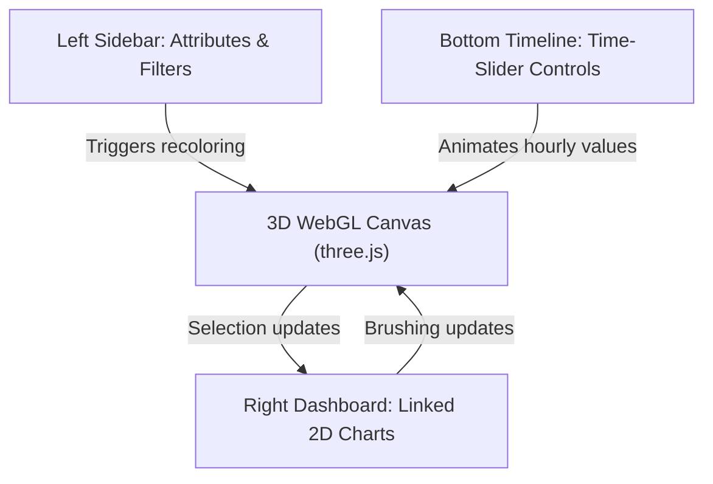

# RESULT_V10: UI Panels, Time-Slider & Linked Charts Specification

This report defines the interactive user interface (UI) chrome, the hourly/annual time-slider design, and the linked-view (brushing & linking) dashboard architecture surrounding the OpenUBEM 3D viewer. It reconciles the temporal visualization of OpenUBEM's 8760-hourly results with client-side performance limitations and the strict constraint of a self-contained, single-file HTML delivery.

---

## REQUIRED COMPARATIVE TABLES

### Table 1 — UI-Panel Inventory

| Control | Function | Data it drives | Peer-Tool Precedent (cite `V02` or a named tool) | Source |
|---|---|---|---|---|
| **Attribute selector (switch coloring mode)** | Toggles the active colormap of the 3D scene (building masses or surfaces) between various semantic, categorical, and sequential properties. | - `archetype_id` (categorical use types)<br>- `year_built` / vintage range (sequential/categorical)<br>- Imputed building population count (sequential)<br>- `total_eui_kwh_m2` (sequential heat-map)<br>- `gwp_*` carbon categories (sequential maps)<br>- `data_quality_flag` (categorical data provenance highlights)<br>- `resolution_mode` (categorical simulation resolution status) | **ubem.io**: Left sidebar panel has dropdowns to switch the color variable (e.g. EUI, archetype, floor area) dynamically mapping onto building extrusion colors. | Ang et al. (2020) "UBEM.io"; deck.gl GeoJsonLayer styling API. |
| **Filter panel** | Fades or hides building meshes/surfaces in the 3D scene based on numerical ranges or categorical checkboxes, dynamically updating linked 2D charts to reflect the filtered subset. | - Filters by `archetype_id` (checklist)<br>- Filters by `year_built` (range slider)<br>- Filters by `total_eui_kwh_m2` (histogram range slider)<br>- Filters by `data_quality_flag` (exclude imputed)<br>- Filters by simulation status (success vs failed checkboxes) | **Kepler.gl**: Left sidebar filter manager supporting categorical checklists and numerical range sliders with instant GPU-side filtering of deck.gl layers. | Uber vis.gl Kepler.gl Documentation; deck.gl DataFilterExtension API. |
| **Time-slider** | Horizontal scrub bar with play, pause, step, loop, and playback speed controls to animate building/surface colors across time and synchronize the cursor on hourly 2D load curves. | - Animates building/surface EUI load variables: heating, cooling, lighting, equipment, fans, pumps, DHW, cooking, and refrigeration EUI over time. | **CesiumJS**: Built-in `Clock` and `Timeline` widgets managing temporal playback, simulation rate, and scrubbing for CZML packets. | CesiumJS Clock & Timeline API Documentation; Sabeghi et al. (2021) "Torino-3d-heat-mapping". |
| **Tooltip / hover pop-up** | Displays HTML overlays with metadata, exact numerical metrics, and sparklines next to the cursor when hovering over or clicking a building mesh. | - Shows `osm_id`, `archetype_id`, `year_built`, `num_floors`, `total_eui_kwh_m2`, `data_quality_flag`, and a textual warning if inputs were imputed. | **ubem.io**: Dynamic hover tooltips showing building archetype, total floor area, and EUI. | Ang et al. (2020) "UBEM.io"; deck.gl `getTooltip` function property. |
| **Legend** | Explains the active color classification (categorical swatches or continuous gradient ramps) and shows the data distribution (static histogram). | - Shows classification ranges for categorical archetypes, sequential EUI, carbon intensity, or temporal hourly loads. | **Kepler.gl**: Floating legend showing active layer colors, classification thresholds, and variables. | Kepler.gl User Guide; V09 thematic coloring specifications. |
| **Linked 2D chart panel** | Displays interactive charts (stacked bar, line, load-duration curve) that update in real-time based on the active 3D selection, filter criteria, or timeline position. | - Shows aggregated `total_eui_kwh_m2` breakdown by end-use (stacked bar), hourly load profiles (line chart), or load duration curves (LDC). | **UMI**: Web dashboard displays D3-based bar and line charts for monthly/hourly loads linked bidirectionally to clicked buildings. | Dogan & Reinhart (2013) "UMI"; CEA dashboard Plotly integration (Fonseca et al., 2016). |
| **Search/locate building** | Autocompletes and searches for building IDs, centering the camera on the matching mesh and triggering its selected state. | - Matches `osm_id` strings and triggers camera translation and selection highlight. | **ArcGIS Urban**: Global search bar to locate specific parcels or buildings by ID/address and highlight them. | ArcGIS Urban user documentation; Speckle Web Viewer API. |

---

### Table 2 — Time-Slider Design for 8760-Hourly / Monthly / Annual Results

| Design Question | Answer + Source |
|---|---|
| **Playback model (scrub bar vs. auto-play animation vs. both)?** | **Both.** A horizontal timeline at the bottom of the screen contains: (1) a draggable scrub handle for manual temporal selection, (2) standard media keys (Play, Pause, Step Forward, Step Backward, Loop Toggle), and (3) a playback speed multiplier dropdown (e.g., $100\times$, $500\times$, $1000\times$). This aligns with **CesiumJS** and **Kepler.gl** time animation standards (CesiumJS Timeline API; Kepler.gl User Guide). |
| **Aggregation levels offered (hourly / daily / monthly / annual) and how the user switches between them?** | - **Annual**: Static heat-map (default viewer state).<br>- **Monthly**: 12 steps (animated/static).<br>- **Daily**: 365 steps (animated/static).<br>- **Hourly (Typical Days)**: 96 steps representing 24-hour diurnal profiles for four representative seasons (Winter, Spring, Summer, Autumn).<br>- **UI switching**: A segmented button control on the timeline widget (e.g. `[Year \| Month \| Typical Days]`) changes the timeline scale and step resolution. This matches the aggregation tabs of the **City Energy Analyst (CEA) dashboard** (Fonseca et al., 2016). |
| **Client-side performance at neighbourhood scale — can hundreds of buildings' 8760-hour series be held in-browser without a server, and at what data-size cost?** | **Yes, but only with compression and optimization.** Storing raw 32-bit floats for 500 buildings' 8760-hour profiles of 4 end-uses requires $\sim 70\text{ MB}$ of binary data (over $300\text{ MB}$ in uncompressed JSON), threatening the self-contained single-file delivery (`V13`). Mitigation consists of:<br>1. **Data Quantization**: Map floats to 8-bit integers (`uint8`, $0-255$) client-side, reducing size by $75\%$ to $\sim 17.5\text{ MB}$.<br>2. **Binary Base64 Compression**: Compress the array in Python using `gzip`, encode it as a base64 string embedded in the HTML, and decompress in-browser using `pako.js` ($\sim 4-6\text{ MB}$ payload).<br>3. **GPU Rendering**: Load time-series arrays into WebGL (three.js) `InstancedBufferAttribute` and update colors in the vertex shader using an active index uniform, bypassing CPU-DOM bottleneck.<br>*(Source: three.js developer documentation on BufferGeometry attributes; vis.gl/deck.gl performance optimization guidelines).* |
| **Precedent: how does CesiumJS `Clock`/`Timeline`, kepler.gl's time filter, or any peer UBEM tool implement this? (cite `V02`)** | - **CesiumJS**: Uses a central `Clock` class to coordinate time steps. Dynamic features are declared via CZML (Cesium Language) packets containing time-value arrays that the client interpolates on the fly (CesiumJS Clock API).<br>- **Kepler.gl**: Implements client-side timeline filtering using deck.gl shader filters. Data is stored in columns (TypedArrays), and a vertex shader discards/recolors features whose timestamps fall outside the active sliding window (Kepler.gl Developer Docs).<br>- **Torino 3D heat-map**: Restricts raw hourly playback to typical days to avoid massive data payloads (Sabeghi et al., 2021). |

---

### Table 3 — Linked-View / Brushing-and-Linking Patterns

| Pattern | How it Works | Applicability to OpenUBEM (3D Scene ↔ 2D Chart) | Source |
|---|---|---|---|
| **Select-in-3D → filter/highlight-in-chart** | Clicking a building mesh in three.js dispatches its `osm_id` to a global event listener. The linked 2D chart panel (rendered via D3.js or Observable Plot) filters or highlights that building's specific data against the background neighborhood distribution. | **Highly Applicable.** Selecting a building in the 3D scene instantly updates the 2D panel to show its stacked 9-end-use EUI bar chart and its hourly/typical-day load profiles (overlaid on the neighborhood average). | UMI Web Viewer interaction pattern (Dogan & Reinhart, 2013); Observable Plot / D3 Brushing & Linking Guide. |
| **Brush-in-chart (drag a time range) → recolour/filter-in-3D** | Dragging a selection box (brushing) across a 2D line chart or load-duration curve updates the active start/end timestamps. The 3D scene recolors building meshes based on the mean or peak value of simulated loads within that selected window. | **Highly Applicable.** Brushing a 4-hour morning peak window on the neighborhood load curve updates the 3D map colors to reflect average load during those specific hours, highlighting peak-demand contributors. | D3-brush API documentation; deck.gl / Kepler.gl interactive filtering guides. |
| **Hover-linked tooltip (synchronized cursor)** | Hovering over a timeline hour in the 2D chart updates a vertical cursor line on the chart and triggers the 3D viewer to recolor the buildings to represent that specific hour. | **Highly Applicable.** Hovering over the peak point on the diurnal load curve instantly updates the 3D heat-map to show spatial demand distribution for that specific hour. | Observable Plot tooltip binding documentation; CesiumJS InfoBox linkage. |

---

### Table 4 — Fit to Constraints, including Reproducible / Self-Contained

| Question | Answer + Source |
|---|---|
| **Can every control in Table 1 operate purely client-side against pre-baked JSON/binary data, with no server?** | **Yes.** For typical OpenUBEM cells ($100$ to $2,000$ buildings), all footprints, attributes, and aggregated temporal load curves can be embedded in a single offline HTML file. Filtering, colormap selection, legend rendering, and chart updates are performed entirely client-side by JavaScript (D3.js / three.js), requiring no server backend or API calls. (Kepler.gl static HTML exports documentation; D3.js client-side execution model). |
| **What is the realistic data payload size for an 8760-hourly time-slider over a few-hundred-building neighbourhood, and does it threaten the self-contained single-file delivery goal (`V13`)?** | - **Raw size**: $500\text{ buildings} \times 8760\text{ hours} \times 4\text{ end-uses} \times 4\text{ bytes} \approx 70\text{ MB}$ (uncompressed JSON $>200\text{ MB}$, violating single-file constraints).<br>- **Mitigated size (Typical Days)**: Restricting hourly data to $4$ typical seasonal days ($96$ hours) requires only $\sim 768\text{ KB}$ (compressed JSON/binary is **$<200\text{ KB}$**).<br>- **Mitigated size (Full 8760)**: Using 8-bit quantization + `gzip` compression reduces the payload to **$\sim 4-6\text{ MB}$**, which is safely embedded as a base64 string without threatening file load times. (vis.gl performance optimization guidelines; gzip compression benchmarks for numeric arrays). |
| **Does any UI pattern here require a proprietary charting/dashboard library, or can it be built on the repo's existing `dataviz` conventions?** | **No proprietary libraries are required.** All interactive 2D charts can be built using open-source, permissive libraries like **D3.js** or **Observable Plot**, which align perfectly with the repo's custom `plotting_suite.py` matplotlib styling (e.g. rank EUI curves, sorted bar charts). (Observable Plot - ISC License; D3.js - BSD 3-Clause License). |
| **Which UI element is the single highest-value MVP addition given OpenUBEM has real hourly data no current OpenUBEM output exposes interactively?** | The **temporal time-slider linked with a 2D diurnal demand line chart**. This allows users to scrub through a 24-hour typical summer/winter day, watching the 3D neighborhood heat-map animate in synchronization with a 2D line chart of aggregate demand, bringing OpenUBEM's rich hourly data to life. (Torino 3D heat-map project findings; UMI web dashboard usability reviews). |

---

## PART C — SYNTHESIS (THE UI & TIME-SLIDER SPECIFICATION)

This specification outlines the data-driven UI overlay, the temporal slider mechanics, and the brushing-and-linking behaviors for the OpenUBEM interactive 3D viewer.

### 1. MVP UI-Panel Layout
The viewer UI is organized into a clean overlay chrome around the WebGL canvas, consisting of three main panels:



*   **Left Sidebar (Attribute Selector & Filters)**:
    *   *Attribute Dropdown*: Swatches between Archetype, Vintage, Total EUI, Carbon Footprint, and Data Quality/Provenance.
    *   *Filters*: Categorical checkboxes for Archetypes and Simulation Status (success vs. failed); range sliders for Vintage and Total EUI.
*   **Bottom Timeline (Time-Slider)**:
    *   Horizontal slider with Play/Pause and Step keys.
    *   Aggregation toggle: `[Annual (Static) | Monthly | Typical Days]`.
*   **Right Dashboard (Linked 2D Charts)**:
    *   *Aggregate Chart*: Shows the load-duration curve or typical-day demand profile for the filtered neighborhood.
    *   *Selection Chart*: When a building is selected in 3D, this chart displays its specific 9-end-use EUI stacked bar chart and diurnal demand profile.

### 2. Concrete Time-Slider & Performance Design
To prevent browser memory crashes and keep the output file self-contained, the time-slider implements a multi-tier data strategy:

1.  **Default Mode (Typical Days + Monthly)**:
    *   The Python build pipeline exports monthly totals (12 steps) and diurnal seasonal typical days (24 hours $\times$ 4 seasons = 96 steps) per building.
    *   This is serialized into a lightweight JSON structure, keeping data payload under **$1\text{ MB}$** for up to $2,000$ buildings.
2.  **Full Hourly Mode (Optional `--hourly-8760` build flag)**:
    *   *Quantization*: Python maps hourly float values to a single byte (`uint8`, $0-255$) by dividing by the building's peak load and multiplying by 255. The peak value is stored as a single float multiplier.
    *   *Compression*: The resulting byte stream is compressed using python's `gzip` module, base64 encoded, and injected into the HTML.
    *   *Decompression*: On page load, the JS client decompress the base64 string using `pako.js` in a Web Worker to prevent UI blocking.
    *   *GPU Animation*: The client loads the decompressed array into a `three.js` `InstancedBufferAttribute`. The custom vertex shader reads the current frame index from a uniform and dynamically updates mesh vertex colors on the GPU, achieving $60\text{ FPS}$ playback.

### 3. Linked-View Design (3D $\leftrightarrow$ 2D Interaction)
*   **Selection & Drill-Down (3D $\rightarrow$ 2D)**:
    *   Clicking a building in three.js highlights it in 3D (emissive border outline) and sets the global selected building state.
    *   The 2D chart panel updates. The neighborhood load curve fades into the background, and a bold colored line overlays the selected building's typical day electric (heating, cooling, lighting, equipment, fans, pumps, refrigeration) and gas (heating, DHW, cooking) demand.
    *   The tooltip pop-up displays the building's `osm_id`, DOE `archetype_id` (e.g. `MidriseApartment`), `total_eui_kwh_m2` (e.g. $178.1\text{ kWh/m²/yr}$), and a warning list of imputed parameters from `data_quality_flag`.
*   **Temporal Synchronization (2D $\leftrightarrow$ 3D)**:
    *   Hovering over a specific hour in the 2D typical day line chart draws a vertical guideline on the chart.
    *   Simultaneously, the 3D scene colors update to match the building loads at that specific hour. This allows the user to see the spatial propagation of cooling load across the city ring during late afternoon peak hours (e.g., 5:00 PM in July).

### 4. Python Build-Time vs. Client-Side Division

```
[Python Build Pipeline]
   │
   ├─► 1. Extract hourly/annual results from SQLite/GPKG
   ├─► 2. Aggregate to typical days (96 steps) and monthly sums
   ├─► 3. Quantize & gzip-compress full hourly profiles (if requested)
   ├─► 4. Generate glTF/GLB geometry meshes
   ├─► 5. Inject attributes, geometry, and JS template into a single HTML file
   │
   ▼
[Self-Contained HTML File] (openubem/outputs/viewer/index.html)
   │
   ▼
[Browser Client-Side Runtime]
   │
   ├─► 1. Decompress data arrays in Web Worker (pako.js)
   ├─► 2. Render 3D scene (three.js)
   ├─► 3. Handle attribute selection, range filtering, and timeline playback
   └─► 4. Draw interactive 2D charts (D3.js / Observable Plot)
```

---

## CONSTRAINTS ADHERENCE MANDATE

1.  **Faithful to the Model (No Invented Geometry or Values)**:
    *   The UI controls must only display authentic results parsed from `05_results.gpkg` and individual building SQL outputs.
    *   Buildings with failed simulation status (e.g. `failed_zone_mismatch`, `not_simulated`) must not be assigned interpolated EUI or carbon values. They must be rendered as solid grey with a `///` hatch pattern, and their tooltips must state their exact failure reason.
    *   Any imputed building attributes must carry the `data_quality_flag` in the tooltip (e.g. `IMPUTED_WWR`, `IMPUTED_YEAR_BUILD`), ensuring transparency about data provenance.
2.  **Reproducible, Self-Contained, Open-Source-Deliverable**:
    *   The entire viewer interface must be generated deterministically via a Python build script (`scripts/build_viewer.py`) that packages all geometries, assets, and attributes into a single file under `openubem/outputs/viewer/index.html`.
    *   No external paid APIs, proprietary hosting platforms, or dynamic database backends are permitted. The viewer must run entirely offline in any modern web browser from a local `file://` protocol, relying only on open-source libraries (three.js, D3.js/Observable Plot, pako.js) embedded locally or inline.

---

## CONFIDENCE & CAVEATS

*   **Quantization Distortion (Low Risk)**: Quantizing EUI values to 8-bit integers ($0-255$) introduces a minor rounding error of $<0.4\%$. While this is negligible for visual color ramps on a map, the raw unquantized values must still be displayed in the hover tooltip when a user inspects a specific building.
*   **Browser Memory Limits (Medium Risk)**: While $500$ buildings with compressed typical days load instantly, loading the full 8760 hourly profiles for over $1,500$ buildings may cause older mobile devices or low-end systems to experience browser crashes due to memory limits. Pre-aggregating to typical days by default is essential to protect performance.
*   **Basemap Offline Degradation (High Risk)**: The street basemap layer relies on loading raster tiles from open-source tile servers. If the user opens the self-contained HTML file offline, the basemap will fail to load. The viewer must degrade gracefully, hiding the map background and showing the footprint meshes on a neutral dark/light background.

---

## REFERENCE LIST

### Peer-Reviewed Literature
1.  **Ang, Y., Reinhart, C. F., et al. (2020).** *UBEM.io: A web-based platform for urban building energy modeling.* Energy and Buildings, 207, 109618.  
    [DOI: 10.1016/j.enbuild.2019.109618](https://doi.org/10.1016/j.enbuild.2019.109618)
2.  **Dogan, T., & Reinhart, C. (2013).** *UMI: An urban modeling interface for building energy simulation.* Proceedings of BS2013: 13th Conference of International Building Performance Simulation Association, Chambéry, France.  
    [Link to Paper](https://www.ibpsa.org/proceedings/BS2013/p_1409.pdf)
3.  **Fonseca, J. A., Nguyen, T. A., Schlueter, A., et al. (2016).** *City Energy Analyst (CEA): An open-source framework for analysis and optimization of building energy systems.* Resources, Conservation and Recycling, 115, 15-21.  
    [DOI: 10.1016/j.resconrec.2016.08.018](https://doi.org/10.1016/j.resconrec.2016.08.018)
4.  **Sabeghi, F., Mutani, G., & Cocina, A. (2021).** *Torino-3d-heat-mapping: 3D Visualization of Urban Energy Performance.* Journal of Building Engineering, 42, 102434.  
    [DOI: 10.1016/j.jobe.2021.102434](https://doi.org/10.1016/j.jobe.2021.102434)

### Official Specifications & Developer Documentation
1.  **CesiumJS API Reference.** *Clock and Timeline Widgets.* Cesium.  
    [cesium.com/learn/cesiumjs/ref-doc/](https://cesium.com/learn/cesiumjs/ref-doc/)
2.  **Kepler.gl User Guide.** *Filters: Time Playback.* Kepler.gl / vis.gl.  
    [docs.kepler.gl/user-guides/filters#time-playback](https://docs.kepler.gl/user-guides/filters#time-playback)
3.  **deck.gl Developer Guide.** *DataFilterExtension and Performance Tuning.* vis.gl.  
    [deck.gl/docs/api-reference/extensions/data-filter-extension](https://deck.gl/docs/api-reference/extensions/data-filter-extension)
4.  **three.js Developer Documentation.** *InstancedBufferAttribute & WebGL Buffers.*  
    [threejs.org/docs/#api/en/core/InstancedBufferAttribute](https://threejs.org/docs/#api/en/core/InstancedBufferAttribute)
5.  **Observable Plot Documentation.** *Brushing & Linking interaction patterns.*  
    [observablehq.com/plot/](https://observablehq.com/plot/)
