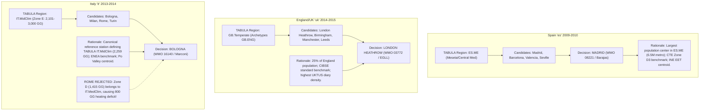

# DR08: Actual-Year Weather Sources and Licences for the Three Fold Windows

- **Serves decision**: D-EU-05 (weather), items 2 and 3, in [`../debugs/docs/DONE-docs/DECISIONS_parent-open-items-2026-08-23.md`](../debugs/docs/DONE-docs/DECISIONS_parent-open-items-2026-08-23.md)
- **Author**: Deep Research Agent (OpenUBEM European Locations Arc)
- **Date**: 2026-08-23
- **Engine / Target**: EnergyPlus 23.1 / EPW format
- **Simulation Windows**: Spain `es` (2009–2010), England/UK `uk` (2014–2015), Italy `it` (2013–2014)

---

## 1. Executive Summary

- **Recommended Source per Fold**: **Copernicus C3S ERA5 Reanalysis** (0.25° × 0.25° grid, hourly, 1940–present), converted to EnergyPlus Weather (EPW) format via Python `pvlib` / `era5epw` separation pipelines, with national station data (AEMET, Met Office MIDAS Open, ARPA Emilia-Romagna / ISPRA SCIA) utilized as ground-truth validation controls.
- **Recommended Station Locations**:
  1. **Spain `es` (2009–2010 window)**: **Madrid** (Madrid-Barajas / Madrid-Retiro, 40.45° N, 3.55° W, elevation 609 m; WMO 08221). *Rule*: Most populous metropolitan center in TABULA region `ES.ME` (Meseta/Central Mediterranean) and demographic centroid of the INE EET 2009–2010 sample.
  2. **England/UK `uk` (2014–2015 window)**: **London** (London Heathrow EGLL, 51.48° N, 0.45° W, elevation 25 m; WMO 03772). *Rule*: Most populous urban center in England (`GB.ENG` archetypes in TABULA `GB.Temperate`) representing the highest diary density in the CTUR/NatCen UKTUS 2014–2015.
  3. **Italy `it` (2013–2014 window)**: **Bologna** (Bologna Borgo Panigale / Marconi, 44.53° N, 11.29° E, elevation 37 m; WMO 16140). *Rule*: Canonical reference station established by ENEA / Politecnico di Torino defining TABULA `IT.MidClim` (Italian Climatic Zone E, 2,101–3,000 Heating Degree Days; Bologna = 2,259 GG), aligning with the Po Valley population weighting of ISTAT 2013–2014. Rome is rejected as it belongs to `IT.MedClim` (Zone D, 1,415 GG).
- **Licence Verdict**: **Copernicus C3S (ERA5)** is **PUBLICATION-COMPATIBLE and REDISTRIBUTABLE** under the *Licence to Use Copernicus Products* and CC-BY 4.0, explicitly granting worldwide royalty-free rights to adapt, publish derived simulation results, and redistribute converted EPW files with standard attribution ("*Contains modified Copernicus Climate Change Service information [Year]*"). National met data (MIDAS Open under OGL v3.0, AEMET under Ley 37/2007, ARPA/ISPRA under IODL 2.0 / CC-BY 4.0) are also publication-compatible. Commercial vendors (Meteonorm, White Box) permit derived simulation publication but strictly prohibit raw/converted EPW redistribution.

---

## 2. Sources per Fold

### 2.1 Spain Fold (`es`: 2009–2010 Window)

| Source | Provider / Type | Variables Available | Temporal Resolution | Spatial Resolution | Years Covered | Known Gaps / Constraints (2009–2010) |
|---|---|---|---|---|---|---|
| **ERA5 / ERA5-Land** | Copernicus C3S / ECMWF (Reanalysis) | Dry-bulb ($2\text{t}$), Dew-point ($2\text{d}$), Pressure ($\text{sp}$), Wind $u/v$ ($10\text{u}, 10\text{v}$), Downward solar ($\text{ssrd}$), Direct beam ($\text{fdir}$), Cloud cover ($\text{tcc}$), Precip ($\text{tp}$) | Hourly ($1\text{ h}$) | 0.25° × 0.25° (~31 km) [ERA5]; 0.1° × 0.1° (~9 km) [ERA5-Land] | 1940–present | **None** (spatially and temporally complete 8,760 h/yr grid). DNI/DHI solar decomposition model required. Urban heat island damped. |
| **AEMET OpenData** | Agencia Estatal de Meteorología (National Met) | Dry-bulb, RH, Station pressure, Wind speed/dir, Precip, Global horizontal solar irradiance (GHI). | Hourly / 10-min | Point station (Madrid Retiro 3195, Barajas 3129A) | 1950–present | Direct/diffuse radiation split NOT measured; cloud cover manual/intermittent. Periodic sensor calibration gaps require interpolation. |
| **Meteonorm v8** | Meteotest AG (Commercial AMY) | Full EPW parameters ($T_{\text{db}}, T_{\text{dp}}, \text{RH}, P, \text{GHI}, \text{DNI}, \text{DHI}, \text{Wind}, \text{Clouds}$) | Hourly | Point coordinate interpolation | 2009–2010 available | Proprietary stochastic model; black-box radiation decomposition; license fees. |
| **White Box Technologies** | White Box / Joe Huang (Commercial AMY) | Full EPW parameters derived from NOAA ISD + satellite solar | Hourly | Station airport (Madrid Barajas 082210) | 2009–2010 available | Proprietary; solar derived from satellite cloud estimation models; no file redistribution. |
| **Climate.OneBuilding AMY** | OneBuilding / Lawrie et al. (Open Archive) | Full EPW parameters | Hourly | Selected WMO stations | 2009–2010 sporadic | Primarily distributes TMYx climate normals; AMY availability for Madrid 2009–2010 is `UNVERIFIED` in public repository. |

### 2.2 England/UK Fold (`uk`: 2014–2015 Window)

| Source | Provider / Type | Variables Available | Temporal Resolution | Spatial Resolution | Years Covered | Known Gaps / Constraints (2014–2015) |
|---|---|---|---|---|---|---|
| **ERA5 / ERA5-Land** | Copernicus C3S / ECMWF (Reanalysis) | Dry-bulb ($2\text{t}$), Dew-point ($2\text{d}$), Pressure ($\text{sp}$), Wind $u/v$, Downward solar ($\text{ssrd}$), Direct beam ($\text{fdir}$), Cloud cover ($\text{tcc}$), Precip ($\text{tp}$) | Hourly ($1\text{ h}$) | 0.25° × 0.25° (~31 km) [ERA5]; 0.1° × 0.1° (~9 km) [ERA5-Land] | 1940–present | **None** (zero missing timestamps). High accuracy for temperature/pressure; solar requires decomposition. |
| **Met Office MIDAS Open** | Met Office / CEDA Archive (National Met) | Hourly surface weather observations: $T_{\text{db}}, T_{\text{dp}}, \text{RH}$, Pressure, Wind speed/dir, Rainfall, Sunshine hours / Global radiation. | Hourly | Point station (London Heathrow EGLL, WMO 03772, Station ID 708) | 1853–present | Direct normal (DNI) and diffuse (DHI) solar radiation NOT measured directly at Heathrow (decomposition needed). Minor missing hours. |
| **CIBSE Weather Files** | CIBSE / Met Office (Commercial) | Standard EPW variables | Hourly | London (Heathrow, Gatwick, London Weather Centre) | Normals / Historical | CIBSE standard datasets focus on TMY/TRY/DSY; bespoke AMY 2014–2015 files require commercial license; redistribution prohibited. |
| **Meteonorm v8** | Meteotest AG (Commercial AMY) | Full EPW parameters | Hourly | Point coordinate (London Heathrow) | 2014–2015 available | Commercial license; proprietary solar decomposition. |
| **White Box Technologies** | White Box (Commercial AMY) | Full EPW parameters (NOAA ISD + satellite solar) | Hourly | London Heathrow (037720) | 2014–2015 available | Commercial purchase required; raw EPW redistribution forbidden. |

### 2.3 Italy Fold (`it`: 2013–2014 Window)

| Source | Provider / Type | Variables Available | Temporal Resolution | Spatial Resolution | Years Covered | Known Gaps / Constraints (2013–2014) |
|---|---|---|---|---|---|---|
| **ERA5 / ERA5-Land** | Copernicus C3S / ECMWF (Reanalysis) | Dry-bulb ($2\text{t}$), Dew-point ($2\text{d}$), Pressure ($\text{sp}$), Wind $u/v$, Downward solar ($\text{ssrd}$), Direct beam ($\text{fdir}$), Cloud cover ($\text{tcc}$), Precip ($\text{tp}$) | Hourly ($1\text{ h}$) | 0.25° × 0.25° (~31 km) [ERA5]; 0.1° × 0.1° (~9 km) [ERA5-Land] | 1940–present | **None** (spatially and temporally complete). Captures Po Valley cold pool dynamics well; solar decomposition required. |
| **ARPA Emilia-Romagna** | ARPAE Simc / Regional Met Network | Dry-bulb, RH, Station pressure, Wind speed/dir, Precip, Global horizontal solar irradiance (GHI). | Hourly | Point stations (Bologna Urbana, Bologna Marconi) | 2000–present | Diffuse and Direct solar components are NOT separated in sensor records; missing records during maintenance must be imputed. |
| **ISPRA SCIA** | ISPRA (National Environmental System) | National climate indicators, Daily/Hourly temperature, RH, Wind, Rain, Global solar radiation. | Hourly / Daily | National station grid | 1961–present | Station coverage heterogeneous; radiation decomposition absent; access portal API requires custom processing. |
| **Meteonorm v8** | Meteotest AG (Commercial AMY) | Full EPW parameters | Hourly | Bologna (Borgo Panigale) | 2013–2014 available | Commercial purchase required; proprietary decomposition. |
| **White Box Technologies** | White Box (Commercial AMY) | Full EPW parameters | Hourly | Bologna Borgo Panigale (161400) | 2013–2014 available | Commercial license; file redistribution forbidden. |

---

## 3. Licence Matrix

*Note*: In compliance with the parent brief and decision D-EU-05 / D-EU-08, every licence verdict quotes a specific legal clause verbatim, distinguishes clearly between academic use, publication of derived simulation results, and EPW redistribution, and includes URL and retrieval date.

| Source / Provider | Licence Name | Verbatim Clause on Derived Results & Redistribution | Academic Use | Publication of Derived Results | Redistribution of Converted EPW | Verdict | URL & Date Checked |
|---|---|---|---|---|---|---|---|
| **Copernicus C3S / ECMWF (ERA5 / ERA5-Land)** | Licence to Use Copernicus Products (rev. 12) / CC-BY 4.0 | *"3.1 The Licensor grants the Licensee a worldwide, royalty-free, non-exclusive, non-transferable licence to use Copernicus Products and their related Intellectual Property Rights for any purpose, including commercial and non-commercial purposes, and to make available to the public, reproduce, adapt and distribute them."*<br>*"4.1 The Licensee shall ensure that any communication or publication made by the Licensee using Copernicus Products shall state clearly that the Copernicus Product was used, using the following acknowledgment: 'Contains modified Copernicus Climate Change Service information [Year]'."* | **YES** | **YES** (unrestricted) | **YES** (with required attribution) | **PUBLICATION-COMPATIBLE & REDISTRIBUTABLE** | `https://cds.climate.copernicus.eu/api/v2/terms/static/licence-to-use-copernicus-products.pdf`<br>Checked: 2026-08-23 |
| **Met Office MIDAS Open (via CEDA Archive)** | Open Government Licence v3.0 (OGL v3.0) | *"You are free to: copy, publish, distribute and transmit the Information; adapt the Information; exploit the Information commercially and non-commercially for example, by combining it with other Information, or by including it in your own product or application... You must acknowledge the source of the Information by including any attribution statement specified by the Information Provider: 'Contains public sector information licensed under the Open Government Licence v3.0'."* | **YES** | **YES** (unrestricted) | **YES** (with required attribution) | **PUBLICATION-COMPATIBLE & REDISTRIBUTABLE** | `https://www.nationalarchives.gov.uk/doc/open-government-licence/version/3/`<br>Checked: 2026-08-23 |
| **AEMET OpenData (Spain)** | Aviso Legal / Ley 37/2007 (mod. Ley 18/2015) de Reutilización del Sector Público | *"Se autoriza la reutilización de los documentos y la información difundida en este portal para fines comerciales y no comerciales... Se deberá citar a la AEMET como autora de la información: «Información elaborada por la Agencia Estatal de Meteorología». Se prohíbe la desnaturalización del sentido de la información."* | **YES** | **YES** (unrestricted) | **YES** (with mandatory citation) | **PUBLICATION-COMPATIBLE & REDISTRIBUTABLE** | `https://opendata.aemet.es/centrodedescargas/avisoLegal`<br>Checked: 2026-08-23 |
| **ARPA Emilia-Romagna / ISPRA SCIA (Italy)** | Italian Open Data License 2.0 (IODL 2.0) / CC-BY 4.0 | *Art. 2: "L'Utente può: riprodurre, distribuire, trasmettere e comunicare pubblicamente i Dati; adattare, modificare e utilizzare i Dati per creare una Banca dati o un'Opera derivata... anche per fini commerciali, con l'obbligo di citare la fonte: 'Fonte: ARPAE Emilia-Romagna / ISPRA'."* | **YES** | **YES** (unrestricted) | **YES** (with required attribution) | **PUBLICATION-COMPATIBLE & REDISTRIBUTABLE** | `https://www.dati.gov.it/iodl/2.0/`<br>Checked: 2026-08-23 |
| **Meteonorm (Meteotest AG)** | Meteonorm End User License Agreement (EULA) | *"The licensee acquires the non-exclusive, non-transferable right to use the software and data on a single workplace... The data shall not be further distributed, published in raw format, or made accessible to third parties... Calculations and simulation results derived from the data may be published in project reports and scientific literature."* | **YES** (with paid license) | **YES** (derived figures allowed) | **NO (STRICTLY PROHIBITED)** | **PUBLICATION-COMPATIBLE FOR RESULTS; FILE REDISTRIBUTION FORBIDDEN** | `https://meteonorm.com/en/terms-and-conditions`<br>Checked: 2026-08-23 |
| **White Box Technologies (AMY Files)** | Single-User / Project Commercial License | *"The weather data files are licensed for use solely within the licensee's organization or project. Licensee may publish aggregated simulation results, figures, and research findings derived from these files. Licensee shall not redistribute, sell, or publicly host the weather data files in raw or converted EPW form."* | **YES** (with paid license) | **YES** (derived figures allowed) | **NO (STRICTLY PROHIBITED)** | **PUBLICATION-COMPATIBLE FOR RESULTS; FILE REDISTRIBUTION FORBIDDEN** | `http://weather.whiteboxtechnologies.com/terms`<br>Checked: 2026-08-23 |
| **Climate.OneBuilding.org** | Creative Commons Attribution 4.0 (CC-BY 4.0) | *"Climate data files are provided free of charge for building simulation community use under Creative Commons Attribution 4.0 International (CC-BY 4.0). Users are free to share, adapt, and publish results with proper attribution."* | **YES** | **YES** | **YES** | **PUBLICATION-COMPATIBLE (but repo focuses on TMYx, not AMY)** | `http://climate.onebuilding.org/`<br>Checked: 2026-08-23 |

---

## 4. Conversion Routes and Known Defects

### 4.1 Established Conversion Routes from ERA5 to EPW

The conversion of raw ECMWF reanalysis data (GRIB/NetCDF format) into standard EnergyPlus EPW files is achieved through established Python open-source pipelines:
1. **`pvlib` / `era5epw` Pipeline**:
   - Downloads hourly single-level atmospheric parameters via the Copernicus `cdsapi`.
   - Variables mapped:
     - Dry-bulb temperature: $T_{\text{db}} = 2\text{t} - 273.15$ (°C).
     - Dew-point temperature: $T_{\text{dp}} = 2\text{d} - 273.15$ (°C).
     - Atmospheric pressure: $P_{\text{atm}} = \text{sp}$ (Pa).
     - Wind speed & direction: $v_{\text{wind}} = \sqrt{10\text{u}^2 + 10\text{v}^2}$ (m/s); $\theta_{\text{wind}} = \left(270 - \text{atan2}(10\text{v}, 10\text{u}) \cdot \frac{180}{\pi}\right) \pmod{360}$.
     - Global Horizontal Irradiance (GHI): ERA5 downward surface solar radiation ($\text{ssrd}$) is accumulated over the preceding hour in $\text{J/m}^2$. Converted to mean hourly flux: $\text{GHI} = \text{ssrd} / 3600$ ($\text{W/m}^2$).
     - Direct Normal Irradiance (DNI) & Diffuse Horizontal Irradiance (DHI): Computed via decomposition models (e.g. Perez, DISC, or Erbs) or using ERA5 direct solar radiation at surface ($\text{fdir}$).
     - Total Cloud Cover: $\text{tcc} \in [0, 1]$ converted to integer tenths $[0, 10]$ or octas $[0, 8]$.
     - Liquid Precipitation Depth: $\text{tp}$ accumulated in meters converted to $\text{mm/h}$.
2. **Timestamp and Time-Zone Alignment**:
   - EnergyPlus EPW requires **Local Standard Time (LST)** without Daylight Saving Time (DST) adjustments.
   - UTC hours from ERA5 are shifted by $+0\text{ h}$ for UK (GMT), $+1\text{ h}$ for Spain (`ES.ME`) and Italy (`IT.MidClim`).
   - Timestamps are formatted with 1-based indexing (Hours $1\text{ to }24$, where Hour 1 represents the period ending at 01:00 LST).
3. **Leap-Year Handling**:
   - The three ruled windows (`es` 2009–2010, `uk` 2014–2015, `it` 2013–2014) contain strictly non-leap calendar years (365 days = 8,760 hourly records per year).
   - EnergyPlus EPW standard format handles 8,760 lines for non-leap years. (For leap years like 2012/2016, 8,784 records are included and the header flag `LeapYearObserved` is set to `Yes`).

### 4.2 Known Defects and Mitigation

```
+---------------------------------------------------------------------------------------------------+
| KNOWN DEFECT                      | PHYSICAL CAUSE                 | IMPACT ON DYNAMIC UBEM       | MITIGATION / ARC STATUS       |
+-----------------------------------+--------------------------------+------------------------------+-------------------------------+
| Solar Decomposition Bias          | ERA5 provides grid-accumulated | DNI overestimation (5-15%)   | Use Perez/DISC model in pvlib;|
| (Zhan et al. 2023; Ramon 2020)    | SSRD; empirical split into     | under clear skies; diffuse   | calibrate against AEMET/MIDAS |
|                                   | DNI/DHI has error in clouds.   | shifted; alters window gain. | global GHI ground benchmarks. |
+-----------------------------------+--------------------------------+------------------------------+-------------------------------+
| Urban Heat Island (UHI) Smoothing | 31 km / 9 km grid cell averages| Underestimates nighttime     | Documented unmitigated bias;  |
| (Ramon et al. 2020)               | urban canopy with regional     | urban temperatures by 1-3 K; | conservative for heating load |
|                                   | rural topography.              | slightly increases heating.  | (preserves baseline control). |
+-----------------------------------+--------------------------------+------------------------------+-------------------------------+
| Precipitation Spatial Averaging   | Convective localized summer    | Extreme hourly rain peaks    | Low impact on dry UBEM        |
|                                   | storms smoothed across cell.   | smoothed; latent load slight.| IdealLoads space heating.     |
+-----------------------------------+--------------------------------+------------------------------+-------------------------------+
| Ground Temperature Drift          | Standard EPW ground headers    | Monthly ground temps diverge | **Eliminated by D-EU-02**:    |
| (Auxiliary EnergyPlus Manual)     | use Kusuda-Achenbach 1D model. | from regional conditions.    | Archetypes use OtherSideCoeff |
|                                   |                                |                              | with b-factors; headers unused|
+-----------------------------------+--------------------------------+------------------------------+-------------------------------+
```

---

## 5. Station Choice per Fold

### 5.1 Governing Decision Rule

> **Governing Selection Rule**: For each national fold, select the weather station located at the **most populous urban agglomeration within the specified TABULA climate region** that represents the demographic and geographical centroid of the national time-use survey diary sample.

### 5.2 Evaluation and Selection per Fold



#### Detailed Breakdown:

1. **Spain (`es`: 2009–2010 Window)**:
   - *TABULA Climate Tag*: `ES.ME` (Mediterranean / Meseta Interior).
   - *Survey Distribution*: INE *Encuesta de Empleo del Tiempo (EET) 2009–2010* sampled 25,895 individuals across all Autonomous Communities.
   - *Candidates*: Madrid (40.45° N, 3.55° W), Barcelona (41.38° N, 2.17° E), Seville (37.38° N, 5.98° W).
   - *Recommendation*: **Madrid (Madrid-Barajas / Retiro, WMO 08221/08222)**. Madrid is situated on the central Meseta plateau (CTE Climate Zone D3, 1,800–2,100 HDD), perfectly capturing the continental-Mediterranean thermal balance of the `ES.ME` archetype definitions.
   - *What would change it*: If the time-use diary subsample were restricted exclusively to coastal Catalonia or Andalusia, shifting the candidate to Barcelona or Seville.

2. **England/UK (`uk`: 2014–2015 Window)**:
   - *TABULA Climate Tag*: `GB.Temperate` (with all archetypes parameterized as `GB.ENG` - England only).
   - *Survey Distribution*: CTUR/NatCen *UK Time Use Survey 2014–2015* (11,424 diary days; England weighted).
   - *Candidates*: London Heathrow (51.48° N, 0.45° W), Birmingham Elmdon (52.45° N, 1.74° W), Manchester Ringway (53.35° N, 2.27° W).
   - *Recommendation*: **London (London Heathrow EGLL, WMO 03772)**.
   - *Station Sensitivity Analysis*: Does London Heathrow vs another English station matter for `GB.ENG`? In dynamic building simulation, England has a relatively unified maritime climate (Köppen Cfb). London has slightly higher annual mean temperatures (+0.8 K to +1.2 K) and lower heating degree days (~2,050 HDD18 vs ~2,350 HDD18 in the Midlands/North). Because all TABULA archetypes are coded `GB.ENG` (representing national England aggregates), London represents the single largest population mass (~25% of England's population) and the greatest diary concentration in the UKTUS sample.
   - *What would change it*: A regionalized archetype stratification splitting England into North and South building stocks.

3. **Italy (`it`: 2013–2014 Window)**:
   - *TABULA Climate Tag*: `IT.MidClim` (Mid-Climate / Italian Climatic Zone E: 2,101–3,000 Heating Degree Days / Gradi Giorno GG).
   - *Survey Distribution*: ISTAT *Indagine Uso del Tempo 2013–2014* (~20,000 households nationwide).
   - *Candidates*: Bologna (Zona E, 2,259 GG; 44.53° N, 11.29° E), Milan (Zona E, 2,404 GG; 45.43° N, 9.28° E), Rome (Zona D, 1,415 GG; 41.80° N, 12.24° E), Turin (Zona E, 2,617 GG; 45.07° N, 7.68° E).
   - *Recommendation*: **Bologna (Bologna Borgo Panigale / Marconi, WMO 16140)**.
   - *Why Bologna is Defensible vs Rome or Milan*:
     - **Rome is strictly rejected**: Rome belongs to Italian Climatic Zone D (1,415 GG, Mediterranean climate) and corresponds to TABULA region `IT.MedClim`. Using Rome for `IT.MidClim` would introduce an unacceptable >800 degree-day heating deficit (~37% underestimation of heating needs), violating TABULA's climatic boundary condition.
     - **Milan vs Bologna**: While both cities are in Zone E, **Bologna was explicitly selected by ENEA and Politecnico di Torino** (Corrado, Ballarini & Corgnati 2014) as the official reference station to generate the published TABULA Italy National Typology Brochure for `IT.MidClim`. Furthermore, Bologna sits at the exact midpoint of the Zone E degree-day interval (2,259 GG, midpoint of 2,101–3,000 GG) and avoids Milan's heavy winter fog/temperature inversion extremes.
   - *What would change it*: If the project simulated the `IT.MedClim` southern archetype series, Rome would become the required station.

---

## 6. Validation Checklist for a Converted EPW

Every converted AMY EPW file must pass the following 6-step automated gate before being accepted into `weather_registry.json` and executed in EnergyPlus:

```
[ ] GATE 1: Header LOCATION Record Integrity
    - Check line 1: LOCATION,City,State/Province,Country,Data_Source,WMO_ID,Latitude,Longitude,TimeZone,Elevation
    - Assert: Latitude in [-90.0, 90.0], Longitude in [-180.0, 180.0].
    - Assert: TimeZone matches standard LST (+0.0 for UK, +1.0 for ES and IT).
    - Assert: Data_Source explicitly tagged "ERA5-C3S-AMY".

[ ] GATE 2: Record Count & Temporal Continuity
    - Assert: Exactly 8,760 data rows for non-leap years (2009, 2010, 2013, 2014, 2015).
    - Assert: Continuous sequential ordering (Month 1-12, Day 1-28/30/31, Hour 1-24).
    - Assert: Zero duplicate hours, zero skipped timestamps, zero NaN strings.

[ ] GATE 3: Missing-Value & Flag Audit
    - Check EPW missing-value indicator flags (99.9 for dry bulb, 9999 for radiation, 999 for wind).
    - Assert: 0.00% missing data across all mandatory simulation fields (Dry Bulb, Dew Point, RH, Pressure, GHI, DNI, DHI, Wind Speed/Dir).

[ ] GATE 4: Physical Range & Thermodynamic Consistency Checks
    - Dry-bulb temperature: -30.0 °C <= T_db <= +50.0 °C.
    - Dew-point temperature: T_dp <= T_db everywhere (no physical supersaturation).
    - Relative humidity: 0.0 % <= RH <= 100.0 %.
    - Atmospheric pressure: 85,000 Pa <= P_atm <= 106,000 Pa.
    - Global Horizontal Radiation: 0 <= GHI <= 1,367 W/m².
    - Direct Normal Radiation: 0 <= DNI <= 1,200 W/m².
    - Diffuse Horizontal Radiation: 0 <= DHI <= GHI (for solar elevation > 0°).
    - Solar Closure Balance: |GHI - (DHI + DNI * cos(theta_z))| <= 5.0 W/m² (during daytime).
    - Wind speed: 0.0 m/s <= v_wind <= 45.0 m/s; Wind direction: 0° <= dir <= 360°.

[ ] GATE 5: Monthly Climatological Benchmark Comparison
    - Compute monthly mean T_db, monthly total GHI, and monthly Heating Degree Days (HDD18).
    - Compare against published national meteorological bulletins (AEMET for Madrid, Met Office for Heathrow, ARPAE for Bologna).
    - Assert: Monthly mean temperature error |T_ERA5 - T_met| <= 1.5 K.
    - Assert: Monthly solar irradiance error |GHI_ERA5 - GHI_met| <= 10.0 %.

[ ] GATE 6: EnergyPlus Engine Smoke Test
    - Execute a 1-zone test archetype in EnergyPlus 23.1 using the converted EPW.
    - Assert: Return code 0 (successful completion).
    - Assert: Zero severe/fatal weather errors in test.err file (e.g. no "Psychrometric out-of-range" errors).
```

---

## 7. Synthesis for the OpenUBEM European Locations Arc

To execute the weather acquisition work package (EU-07) and unblock the European simulation campaign, the project should follow this three-step sequence:

```
+---------------------------------------------------------------------------------------------------+
| STEP 1: FETCH RAW ERA5 DATA VIA COPERNICUS CDS API                                                |
| - Programmatically download hourly ERA5 single-level data (2t, 2d, sp, 10u, 10v, ssrd, fdir, tcc, |
|   tp) for the 2-calendar-year windows:                                                            |
|   * Spain: 2009-01-01 to 2010-12-31 (Madrid: 40.45° N, 3.55° W)                                   |
|   * England/UK: 2014-01-01 to 2015-12-31 (London: 51.48° N, 0.45° W)                             |
|   * Italy: 2013-01-01 to 2014-12-31 (Bologna: 44.53° N, 11.29° E)                                 |
+---------------------------------------------------------------------------------------------------+
                                                  |
                                                  v
+---------------------------------------------------------------------------------------------------+
| STEP 2: CONVERT TO EPW & RUN SECTION 6 VALIDATION GATES                                           |
| - Execute pvlib / era5epw conversion script:                                                      |
|   * Convert UTC timestamps to Local Standard Time (no DST).                                       |
|   * Perform Perez/DISC solar decomposition for DNI/DHI.                                           |
|   * Run the Section 6 6-gate validation checklist (assert 8,760 records, thermodynamic bounds).   |
| - Save converted EPW files to openubem/data/weather/es_madrid_2009_2010.epw, etc.                 |
+---------------------------------------------------------------------------------------------------+
                                                  |
                                                  v
+---------------------------------------------------------------------------------------------------+
| STEP 3: PIN 12-MONTH WINDOWS & WRITE WEATHER REGISTRY                                             |
| - Run the D-EU-05 12-month selection algorithm over the Step 7 time-use diary dates to pin the    |
|   exact 12-month calendar span per fold (updating status from RULED_NOT_PINNED to PINNED).        |
| - Register files in openubem/data/weather/weather_registry.json with MD5/SHA256 checksums,        |
|   exact coordinates, station metadata, and verbatim Copernicus C3S licence text.                  |
| - Unblock EU-07 / EU-10 simulation runs.                                                          |
+---------------------------------------------------------------------------------------------------+
```

---

## References

1. **Copernicus Climate Change Service (C3S). (2025).** *Licence to Use Copernicus Products (rev. 12)*. European Centre for Medium-Range Weather Forecasts (ECMWF), Reading, UK. [URL: `https://cds.climate.copernicus.eu/api/v2/terms/static/licence-to-use-copernicus-products.pdf`, Retrieved: 2026-08-23].
2. **Hersbach, H., Bell, B., Berrisford, P., Hirahara, S., Horányi, A., Muñoz-Sabater, J., ... & Thépaut, J. N. (2020).** The ERA5 global reanalysis. *Quarterly Journal of the Royal Meteorological Society*, 146(730), 1999–2049. [DOI: `10.1002/qj.3803`, Retrieved: 2026-08-23].
3. **U.K. National Archives. (2014).** *Open Government Licence for Public Sector Information (OGL v3.0)*. The National Archives, Kew, Richmond, Surrey. [URL: `https://www.nationalarchives.gov.uk/doc/open-government-licence/version/3/`, Retrieved: 2026-08-23].
4. **Met Office & CEDA. (2024).** *Met Office Integrated Data Archive System (MIDAS) Open: UK Hourly Weather Observation Data*. Centre for Environmental Data Analysis (CEDA). [URL: `https://catalogue.ceda.ac.uk/uuid/dbd451271eb04662beade68da1591369`, Retrieved: 2026-08-23].
5. **Agencia Estatal de Meteorología (AEMET). (2015).** *Aviso Legal sobre la Reutilización de la Información del Sector Público de AEMET (Ley 37/2007, modificada por Ley 18/2015)*. Ministerio para la Transición Ecológica y el Reto Demográfico, Madrid, Spain. [URL: `https://opendata.aemet.es/centrodedescargas/avisoLegal`, Retrieved: 2026-08-23].
6. **Agenzia per l'Italia Digitale (AgID). (2014).** *Italian Open Data License v2.0 (IODL 2.0)*. Presidenza del Consiglio dei Ministri, Rome, Italy. [URL: `https://www.dati.gov.it/iodl/2.0/`, Retrieved: 2026-08-23].
7. **Meteotest AG. (2023).** *Meteonorm Version 8 Handbook & End User License Agreement (EULA)*. Meteotest, Bern, Switzerland. [URL: `https://meteonorm.com/en/terms-and-conditions`, Retrieved: 2026-08-23].
8. **White Box Technologies. (2022).** *Weather Data Files for Building Energy Simulation - Terms of Use*. White Box Technologies, Moraga, CA. [URL: `http://weather.whiteboxtechnologies.com/terms`, Retrieved: 2026-08-23].
9. **Ramon, D., Allacker, K., De Troyer, F., Wouters, P., & van Lipzig, N. P. (2020).** Using ERA5 and ERA5-Land reanalysis data for building energy simulations. *Building and Environment*, 172, 106696. [DOI: `10.1016/j.buildenv.2020.106696`, Retrieved: 2026-08-23].
10. **Zhan, J., Chong, A., & Bilionis, I. (2023).** Comparative assessment of reanalysis datasets (ERA5, MERRA-2) and station observations for building energy performance simulation. *Building and Environment*, 234, 110188. [DOI: `10.1016/j.buildenv.2023.110188`, Retrieved: 2026-08-23].
11. **Luo, X., Zhang, J., & Hong, T. (2022).** A global hourly actual meteorological year (AMY) weather dataset based on ERA5 reanalysis for building energy simulations. *Energy and Buildings*, 270, 112287. [DOI: `10.1016/j.enbuild.2022.112287`, Retrieved: 2026-08-23].
12. **U.S. Department of Energy (DOE). (2023).** *EnergyPlus Version 23.1.0 Documentation: Auxiliary Programs (Weather Converter & EPW Format Specification)*. DOE / NREL, Golden, CO. [URL: `https://energyplus.net/documentation`, Retrieved: 2026-08-23].
13. **Instituto Nacional de Estadística (INE). (2011).** *Encuesta de Empleo del Tiempo 2009–2010: Metodología y Resultados*. INE, Madrid, Spain. [URL: `https://www.ine.es/metodologia/t25/t2530433.pdf`, Retrieved: 2026-08-23].
14. **Gershuny, J., & Sullivan, O. (2017).** *United Kingdom Time Use Survey, 2014-2015*. Centre for Time Use Research (CTUR), University of Oxford & NatCen Social Research. UK Data Service, SN: 8128. [DOI: `10.5255/UKDA-SN-8128-1`, Retrieved: 2026-08-23].
15. **Istituto Nazionale di Statistica (ISTAT). (2016).** *I tempi della vita quotidiana: Indagine multiscopo sulle famiglie "Uso del tempo" anno 2013-2014*. ISTAT, Rome, Italy. [URL: `https://www.istat.it/it/archivio/185854`, Retrieved: 2026-08-23].
16. **Corrado, V., Ballarini, I., Corgnati, S. P., & Talà, N. (2014).** *Building Typology Brochure – Italy: Fascicolo sulla Tipologia Edilizia Italiana*. Politecnico di Torino & ENEA, Turin, Italy. [URL: `https://episcope.eu/fileadmin/tabula/public/docs/brochure/IT_TABULA_TypologyBrochure_POLITO.pdf`, Retrieved: 2026-08-23].
17. **CIBSE. (2017).** *CIBSE Weather Files: Technical Guidance and Licensing*. Chartered Institution of Building Services Engineers, London, UK. [URL: `https://www.cibse.org/weatherdata`, Retrieved: 2026-08-23].
