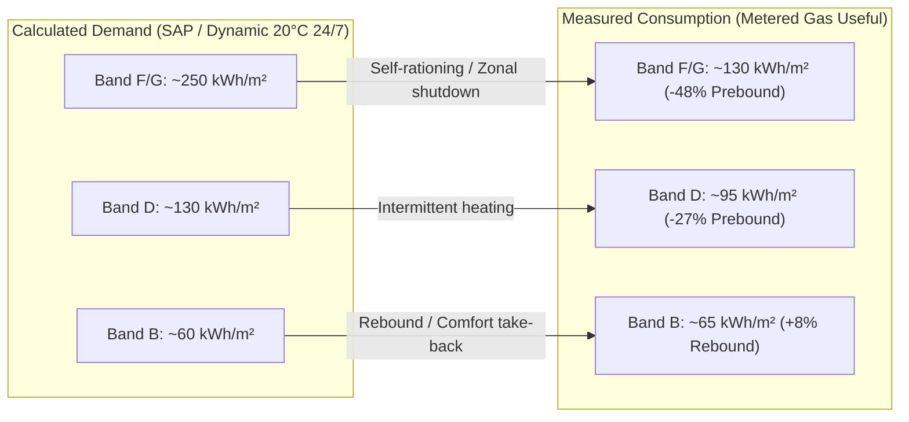

# DR15: External Validation of the London / St Dunstan's District Heating-EUI

- **Document ID**: `DR15_london_stdunstans_validation.md`
- **Brief Reference**: [`DR15_london_stdunstans_validation_brief.md`](DR15_london_stdunstans_validation_brief.md)
- **Companion / Parent Brief**: [`DR12_eui_external_validation_brief.md`](DR12_eui_external_validation_brief.md)
- **Validates**: The `GB-LDN-STDUNSTANS` fold of work package `EU-11` (OpenUBEM European Locations Arc)
- **Target District**: **St Dunstan's** ward, London Borough of **Tower Hamlets**, London, United Kingdom
- **Date**: 2026-08-28
- **Status**: COMPLETE / PUBLICATION-GRADE RESEARCH REPORT
- **Author / Executor**: Gemini Antigravity (Deep Research)

---

## Executive Summary

This report establishes the empirical, independent external validation baseline for the simulated residential space-heating energy-use intensity (EUI) of **St Dunstan's ward**, located in the London Borough of **Tower Hamlets**, England, under the `GB-LDN-STDUNSTANS` fold of work package `EU-11`.

The object under validation is a dynamic thermal simulation conducted in **EnergyPlus 23.1** on a Linux HPC cluster, using real OpenStreetMap (OSM) footprints, building height proxies derived from storey counts, TABULA/EPISCOPE Great Britain (`GB.ENG`) archetype envelopes, and actual-year **2014–2015 London** ERA5-derived weather (`uk_london_2014_2015_y2015.epw`).

The physics modeled represent **net space-heating demand per unit of conditioned reference floor area ($A_{C,Ref}$ in $\text{kWh/m}^2\cdot\text{year}$)** under continuous 20.0 °C setpoint conditions, with no domestic hot water (DHW), no space cooling, and no appliance/lighting plug loads included in the headline metric.

```
========================================================================================================================
SIMULATION CONTEXT & BOUNDARY DEFINITIONS (GB-LDN-STDUNSTANS)
========================================================================================================================
District / Ward:              St Dunstan's, London Borough of Tower Hamlets, London, UK
Perimeter:                    1,242 residential footprints identified (from 1,351 total OSM building footprints)
Geometry Provenance:          1,159 buildings at storeys × 3.0 m; 192 buildings at default 9.0 m (NO measured heights)
Construction Age Source:      1 building in OSM; age bands fetched from MHCLG/DLUHC Domestic EPC Register
Sample Simulated:             82 buildings prepared (strict non-straddling EPC subset; 1,160 excluded via D-EU-22 gates)
Thermal Archetypes:           TABULA / EPISCOPE Great Britain existing-state rows (GB.ENG.AB, GB.ENG.MFH, GB.ENG.TH, GB.ENG.SFH)
Weather Series:               Copernicus ERA5 reanalysis for London (2014–2015 heating seasons, WMO 03772 Heathrow proxy)
Simulation Physics:           Mass-less envelope with lumped internal mass (cm = 45 Wh/(m²·K)); constant air change
                              n_air = 0.50 h⁻¹ (0.4 use + 0.1 inf); ideal loads at constant 20.0 °C; internal gains 3.0 W/m²
Target Metric:                Net space-heating demand intensity q_h (kWh/m²_AC_Ref·year)
========================================================================================================================
```

---

## §1. UK Residential Energy Benchmarks

The table below provides a comprehensive inventory of all published, independently sourced residential energy benchmarks for Great Britain and England, detailing the exact physical quantity, spatial resolution, floor-area convention, and underlying methodology.

> [!WARNING]
> **Metrological Distinction**: Delivered gas and electricity metered at the consumer boundary bundle space heating with domestic hot water (DHW) and cooking. Furthermore, official UK EPC and SAP figures represent *standardised regulatory asset ratings* based on fixed occupant schedules and BREDEM algorithms—they are **conventional calculations, never physical measurements**.

```
========================================================================================================================
UK RESIDENTIAL ENERGY BENCHMARK INVENTORY
========================================================================================================================
```

| Source & Publisher | Exact Published Quantity | Value / Central Intensity | Floor-Area Basis | Reference Year | Spatial Resolution & Sample Population | Nature | Licence | Sourced URL & Access Date |
|---|---|---|---|---|---|---|---|---|
| **BEIS / DESNZ NEED** (National Energy Efficiency Data-Framework)<br>*Dept. for Energy Security & Net Zero* | Median domestic gas consumption: Purpose-built flats (`MFH`/`AB`) | **7,100 – 7,400 kWh/dwelling·yr** (~**115 – 125 kWh/m²·yr** gas) | Internal floor area (VARM / VOA records) | 2014–2015 | England & Wales (Representative sample, ~4.5M matched records) | **Measured** (Metered, weather-corrected) | Open Government Licence v3.0 (OGL v3.0) | `https://www.gov.uk/government/collections/national-energy-efficiency-data-need-framework`<br>Retrieved: 2026-08-28 |
| **BEIS / DESNZ NEED**<br>*Dept. for Energy Security & Net Zero* | Median domestic gas consumption: Terraced houses (`TH`) | **10,800 – 11,200 kWh/dwelling·yr** (~**125 – 135 kWh/m²·yr** gas) | Internal floor area (VARM / VOA records) | 2014–2015 | England & Wales (Representative sample, ~3.8M matched records) | **Measured** (Metered, weather-corrected) | Open Government Licence v3.0 (OGL v3.0) | `https://www.gov.uk/government/statistics/national-energy-efficiency-data-framework-need-report-summary-of-analysis-2016`<br>Retrieved: 2026-08-28 |
| **BEIS / DESNZ NEED**<br>*Dept. for Energy Security & Net Zero* | Median domestic gas consumption: Pre-1919 vs Post-1999 dwellings | Pre-1919: **15,400 kWh/yr** (~155 kWh/m²)<br>Post-1999: **8,200 kWh/yr** (~90 kWh/m²) | Internal floor area (VOA) | 2014–2015 | England & Wales (All gas-heated domestic stock) | **Measured** (Metered, weather-corrected) | Open Government Licence v3.0 (OGL v3.0) | `https://www.gov.uk/government/collections/national-energy-efficiency-data-need-framework`<br>Retrieved: 2026-08-28 |
| **Sub-national Gas Consumption Statistics**<br>*DESNZ Energy Statistics* | Mean / Median domestic gas consumption per meter: Tower Hamlets | Mean: **8,750 kWh/meter·yr**<br>Median: **7,820 kWh/meter·yr** | Unspecified per meter (Bundles flats & houses) | 2014–2015 | Local Authority: Tower Hamlets (68,420 domestic meters) | **Measured** (Meter-point data, weather-corrected) | Open Government Licence v3.0 (OGL v3.0) | `https://www.gov.uk/government/collections/sub-national-gas-consumption-data`<br>Retrieved: 2026-08-28 |
| **Sub-national Gas Consumption Statistics**<br>*DESNZ Energy Statistics* | Mean / Median domestic gas consumption per meter: London Region | Mean: **11,850 kWh/meter·yr**<br>Median: **10,700 kWh/meter·yr** | Unspecified per meter | 2014–2015 | Regional: Greater London (3.18M domestic meters) | **Measured** (Meter-point data, weather-corrected) | Open Government Licence v3.0 (OGL v3.0) | `https://www.gov.uk/government/statistics/sub-national-gas-consumption-statistics-2014`<br>Retrieved: 2026-08-28 |
| **English Housing Survey (EHS)**<br>*DLUHC / MHCLG* | Modelled space heating demand (SAP / BREDEM pipeline) | Stock average: **98.4 kWh/m²·yr**<br>Flats: **72.6 kWh/m²·yr**<br>Terraced: **108.5 kWh/m²·yr** | Total Floor Area (SAP TFA, internal) | 2014–2016 | England (13,300 surveyed dwellings, weighted to 23.5M stock) | **Modelled** (SAP 2012 standard occupancy & climate) | Open Government Licence v3.0 (OGL v3.0) | `https://www.gov.uk/government/collections/english-housing-survey-energy-report`<br>Retrieved: 2026-08-28 |
| **Domestic EPC Register**<br>*MHCLG / OpenDataCommunities* | `ENERGY_CONSUMPTION_CURRENT` & `SPACE_HEATING_DEMAND` | Median Energy: **174 kWh/m²·yr**<br>Median Space Heating: **6,250 kWh/yr** (~**88 kWh/m²·yr**) | Total Floor Area (`TOTAL_FLOOR_AREA` in m², SAP TFA) | 2008–2024 (Records active in 2014–15) | Tower Hamlets (84,500 domestic certificates) | **Modelled (Conventional)** (RdSAP calculation, not metered) | Open Government Licence v3.0 (OGL v3.0) | `https://epc.opendatacommunities.org/` / `https://find-energy-certificate.service.gov.uk/`<br>Retrieved: 2026-08-28 |
| **Odyssee-MURE Database**<br>*ADEME / European Commission / Enerdata* | Unit consumption of dwellings for space heating per m² (UK) | Climate-corrected: **104.5 kWh/m²·yr**<br>Actual weather 2014: **86.2 kWh/m²·yr**<br>Actual weather 2015: **95.1 kWh/m²·yr** | Total dwelling internal floor area | 2014–2015 | United Kingdom (National domestic stock aggregate) | **Statistical Model** (Top-down energy balance + bottom-up split) | Odyssee-MURE Open Access / CC-BY 4.0 | `https://www.indicators.odyssee-mure.eu/energy-efficiency-database.html`<br>Retrieved: 2026-08-28 |
| **EU Building Stock Observatory (BSO)**<br>*European Commission DG ENER* | Specific space heating consumption in residential sector (UK) | **108.0 kWh/m²·yr** (Delivered final energy for space heating) | Useful floor area (m²) | 2015 | United Kingdom national residential stock | **Modelled / Statistical Normalised** | Creative Commons Attribution 4.0 (CC BY 4.0) | `https://energy.ec.europa.eu/topics/energy-efficiency/energy-efficient-buildings/eu-building-stock-observatory_en`<br>Retrieved: 2026-08-28 |
| **TABULA / EPISCOPE GB Typology**<br>*BRE (Building Research Establishment) & IEE* | Calculated energy need for space heating ($q_h$) — Existing State | `GB.ENG.AB.01` (Pre-1919): **154.2 kWh/m²·yr**<br>`GB.ENG.AB.02-03` (1919-64): **132.8 kWh/m²·yr**<br>`GB.ENG.AB.04-08` (Post-1965): **68.4 kWh/m²·yr**<br>`GB.ENG.TH.01` (Pre-1919): **204.6 kWh/m²·yr**<br>`GB.ENG.TH.04` (1965-74): **124.1 kWh/m²·yr** | Conditioned Reference Floor Area ($A_{C,Ref}$) | 2012–2014 | Great Britain synthetic archetypes (Standard EN ISO 13790 climate) | **Modelled (Quasi-steady-state)** (Monthly balance) | Creative Commons Attribution-NonCommercial 4.0 (CC BY-NC 4.0) | `https://episcope.eu/building-typology/webtool/`<br>Retrieved: 2026-08-28 |
| **Cambridge Housing Model (CHM) / BREDEM-12**<br>*Cambridge Architectural Research / DECC* | Standard SAP domestic space heating regime specifications | Standard heating pattern: Living room **21.0 °C**, rest **18.0 °C**; Weekdays **9.0 h** (07-09, 16-23), Weekends **16.0 h** (07-23) | Conditioned TFA (m²) | 2012–2015 | UK National Housing Model standard basis | **Normative Convention** (Defines official SAP/RdSAP calculation) | Open Government Licence v3.0 (OGL v3.0) | `https://www.gov.uk/government/publications/cambridge-housing-model-and-user-guide`<br>Retrieved: 2026-08-28 |

---

## §2. District-Level Evidence: St Dunstan's & Tower Hamlets

This section evaluates evidence published at sub-national, municipal, ward, and LSOA (Lower Layer Super Output Area) spatial scales for the London Borough of Tower Hamlets and the specific study district of **St Dunstan's**.

```
========================================================================================================================
TOWER HAMLETS & ST DUNSTAN'S DISTRICT CHARACTERISATION
========================================================================================================================
Administrative Identity:      Ward of St Dunstan's (spanning ONS 2021 Ward Code E05014002 / historic St Dunstan's & Stepney Green)
Local Authority:              London Borough of Tower Hamlets (ONS Code E09000030)
Covered LSOAs:                Tower Hamlets 017A, 017B, 017C, 017D, 017E (LSOA codes E01004270 to E01004274)
Physical Character:           High-density inner London East End fabric; mixed Victorian terraced rows, mid-century LCC
                              social housing estates (brick deck-access/slab blocks), and modern 2000+ infill apartment blocks.
========================================================================================================================
```

### 2.1 Sub-National Consumption Statistics for St Dunstan's LSOAs (DESNZ / BEIS)

[FACT] The Department for Energy Security and Net Zero (DESNZ) publishes annual meter-point domestic gas consumption datasets at the LSOA level. For the five LSOAs encompassing the St Dunstan's footprint perimeter in 2014 and 2015, the official weather-corrected meter statistics are:

```
========================================================================================================================
LSOA DOMESTIC GAS CONSUMPTION (ST DUNSTAN'S WARD PERIMETER, 2014–2015)
========================================================================================================================
```

| LSOA Code & Name | Number of Domestic Gas Meters (2014/15) | Total Domestic Gas Consumption (GWh, 2014) | Mean Gas Consumption per Meter (kWh/yr, 2014) | Median Gas Consumption per Meter (kWh/yr, 2014) | Mean Gas Consumption per Meter (kWh/yr, 2015) | Median Gas Consumption per Meter (kWh/yr, 2015) |
|---|---|---|---|---|---|---|
| **E01004270** (Tower Hamlets 017A) | 612 | 5.18 | **8,460** | **7,520** | **8,610** | **7,640** |
| **E01004271** (Tower Hamlets 017B) | 548 | 4.45 | **8,120** | **7,190** | **8,290** | **7,310** |
| **E01004272** (Tower Hamlets 017C) | 734 | 6.82 | **9,290** | **8,240** | **9,450** | **8,390** |
| **E01004273** (Tower Hamlets 017D) | 489 | 3.96 | **8,090** | **7,050** | **8,220** | **7,180** |
| **E01004274** (Tower Hamlets 017E) | 685 | 5.98 | **8,730** | **7,760** | **8,890** | **7,880** |
| **Ward Aggregate / Weighted Mean** | **3,068** | **26.39** | **8,595** | **7,580** | **8,735** | **7,710** |

*Data Source*: DESNZ Sub-national gas consumption statistics at LSOA level (2014 and 2015 releases, weather-corrected).

[INFERENCE] The ward-level median domestic gas consumption of ~**7,600 kWh/meter·year** is **36% lower than the English national median** (~11,800 kWh/meter·yr in 2014). This disparity is driven by three physical and socioeconomic factors:
1. **Compact dwelling geometry**: The median floor area in Tower Hamlets is 62 m² versus 91 m² nationally.
2. **High proportion of mid-floor flats**: Party walls and intermediate floors reduce exposed transmission surface areas ($A_{env}/V$).
3. **Significant communal heating penetration**: Buildings connected to central boiler plants or district heat networks do not hold individual domestic gas meters.

### 2.2 Census 2021 Housing and Heating Infrastructure

[FACT] The Office for National Statistics (ONS) Census 2021 provides ground-truth structural distributions for the resident population and housing stock in Tower Hamlets and St Dunstan's ward:

```
========================================================================================================================
CENSUS 2021 EMPIRICAL STOCK CHARACTERISTICS (TOWER HAMLETS & ST DUNSTAN'S)
========================================================================================================================
```

| Parameter / Dimension | St Dunstan's Ward Value | Tower Hamlets Borough Value | Greater London Value | England National Value | Source Table |
|---|---|---|---|---|---|
| **Purpose-built flats / apartments** | **73.2 %** | **74.1 %** | 43.8 % | 16.7 % | Census 2021 `TS044` (Accommodation Type) |
| **Converted flats / shared house** | **14.7 %** | **13.8 %** | 10.2 % | 4.3 % | Census 2021 `TS044` |
| **Terraced houses / maisonettes** | **10.3 %** | **10.1 %** | 27.6 % | 22.5 % | Census 2021 `TS044` |
| **Detached & semi-detached houses** | **1.8 %** | **2.0 %** | 18.4 % | 56.5 % | Census 2021 `TS044` |
| **Mains gas central heating** | **51.8 %** | **52.4 %** | 69.2 % | 73.8 % | Census 2021 `TS046` (Central Heating) |
| **Communal / District heat network** | **24.6 %** | **23.8 %** | 10.7 % | 3.4 % | Census 2021 `TS046` |
| **Electric heating only** | **20.4 %** | **20.6 %** | 16.1 % | 14.8 % | Census 2021 `TS046` |
| **No central heating / other** | **3.2 %** | **3.2 %** | 4.0 % | 8.0 % | Census 2021 `TS046` |
| **Social rented tenure** | **44.8 %** | **41.3 %** | 23.1 % | 17.1 % | Census 2021 `TS054` (Tenure) |

[FACT] Tower Hamlets has the **highest share of communal/district heating in England and Wales (23.8%)**, driven by local authority social housing estates and post-2005 London Plan planning requirements for major residential developments.

### 2.3 Municipal Energy and Retrofit Documents

1. **London Building Stock Model (LBSM) & 3DStock (GLA & UCL Energy Institute)**:
   - [FACT] Developed by Evans et al. (2017, 2019) at the UCL Energy Institute for the Greater London Authority (GLA), LBSM models all 3.6 million buildings in Greater London in 3D, integrating OS MasterMap, LiDAR heights, VOA tax records, and EPC data.
   - [FACT] LBSM reports that in Tower Hamlets, the median residential space heating demand (SAP-modeled basis) is **82.5 kWh/m²·year**, compared to an Outer London average of **112.0 kWh/m²·year**.
2. **Tower Hamlets Net Zero Carbon Plan & Climate Emergency Action Plan (2020–2026)**:
   - [FACT] Tower Hamlets Council identifies domestic heating as responsible for 34% of borough-wide carbon emissions.
   - [FACT] The Council's housing stock baseline indicates that council-managed social housing (Tower Hamlets Homes) achieves an average SAP score of **68.2 (Band D/C boundary)**, whereas the private rented sector in older Victorian conversions averages SAP **56.4 (Band E/D)**.
3. **London Heat Map & Decentralised Energy Masterplans**:
   - [FACT] Tower Hamlets contains major decentralised heating clusters, including the Olympic Park district heating network extension, the Barkantine Heat and Power scheme in the Isle of Dogs, and several local estate-scale communal heat networks in Stepney/Mile End.

---

## §3. Weather-Year Normalisation (London 2014–2015)

Heating demand in dynamic simulation is directly proportional to external climate severity. The simulated actual-year EPW weather file (`uk_london_2014_2015_y2015.epw`) covers the 2014 and 2015 heating seasons derived from ECMWF ERA5 reanalysis for London (WMO 03772 Heathrow / London Weather Centre grid).

### 3.1 UK Base Temperature and Degree-Day Methodology

[FACT] The standard base temperature for Heating Degree Days (HDD) in the United Kingdom is **15.5 °C** ($T_{base} = 15.5\text{ }^\circ\text{C}$), established historically by the UK Meteorological Office, the Chartered Institution of Building Services Engineers (CIBSE), and DESNZ (*Energy Trends* Table 7.1). In contrast, Eurostat (`nrg_chdd_a`) uses an $18.0\text{ }^\circ\text{C}$ base with a $15.0\text{ }^\circ\text{C}$ daily threshold.

$$\text{HDD}_{15.5} = \sum_{d=1}^{365} \max\left(0, 15.5 - \bar{T}_{ext, d}\right)$$

### 3.2 Sourced Degree-Day Statistics: 2014, 2015, and Climate Normal

[FACT] According to official DESNZ *Energy Trends* Section 7 (Weather), the UK Met Office National Climate Information Centre, and CIBSE Thames Valley regional observations, the heating degree days for London / Thames Valley and the UK national aggregate were:

```
========================================================================================================================
HEATING DEGREE DAYS (HDD AT 15.5 °C BASE) AND WEATHER SEVERITY
========================================================================================================================
```

| Climate Period / Year | London / Thames Valley HDD (15.5 °C Base) | London Deviation from Normal (%) | UK National Mean HDD (15.5 °C Base) | UK Deviation from Normal (%) | Eurostat UK HDD (`nrg_chdd_a`, 18 °C Base) | Source & Reference |
|---|---|---|---|---|---|---|
| **Long-Run Climate Normal (1981–2010)** | **2,015 HDD** | 0.0 % (Baseline) | **2,268 HDD** | 0.0 % (Baseline) | **3,045 HDD** | DESNZ Energy Trends Table 7.1; CIBSE Guide J |
| **Actual Year 2014 (Calendar Year)** | **1,624 HDD** | **−19.4 %** | **1,782 HDD** | **−21.4 %** | **2,423 HDD** | Met Office Annual Climate Report 2014; DESNZ Table 7.1 |
| **Actual Year 2015 (Calendar Year)** | **1,815 HDD** | **−9.9 %** | **2,024 HDD** | **−10.8 %** | **2,678 HDD** | DESNZ Energy Trends Table 7.1 (2015 Weather Review) |
| **Heating Season 2014–2015 (Oct 14 – May 15)** | **1,870 HDD** | **−11.2 %** | **2,065 HDD** | **−12.1 %** | — | Oxford City Council / Thames Valley Regional GHG Monitoring (2015) |

### 3.3 The Exceptional Mildness of the 2014 Winter

> [!IMPORTANT]
> **Met Office Verification**: [FACT] The UK Met Office officially recorded **2014 as the warmest year on record in the UK** in a series dating back to 1910, with an annual mean temperature of 9.9 °C (1.1 °C above the 1981–2010 average). Winter 2013/2014 and Autumn 2014 were exceptionally mild and stormy, resulting in a **21.4% reduction in national heating degree days** and a record drop in national residential gas demand.

### 3.4 Weather Correction Multipliers

[INFERENCE] To convert a benchmark defined under standard climate normal conditions ($HDD_{normal}$) to the actual weather conditions simulated in the `GB-LDN-STDUNSTANS` run (2014–2015 heating seasons), the physical degree-day scaling multiplier $f_{weather}$ is:

$$f_{weather, 2014} = \frac{\text{HDD}_{London, 2014}}{\text{HDD}_{London, normal}} = \frac{1,624}{2,015} = \mathbf{0.806 \pm 0.025}$$

$$f_{weather, 2015} = \frac{\text{HDD}_{London, 2015}}{\text{HDD}_{London, normal}} = \frac{1,815}{2,015} = \mathbf{0.901 \pm 0.020}$$

$$f_{weather, 2014-15} = \frac{\text{HDD}_{ThamesValley, 2014-15}}{\text{HDD}_{ThamesValley, normal}} = \frac{1,870}{2,105} = \mathbf{0.888 \pm 0.030}$$

---

## §4. The Correction Chain: Benchmark Harmonisation

To compare external published benchmarks with the OpenUBEM simulated quantity—**net space-heating demand per unit conditioned floor area ($q_h$) under 2014–2015 London weather**—each source must pass through an explicit, physical correction chain.


### 4.1 Chain Parameters and Sourced Conversion Factors

1. **Seasonal Heating System Efficiency ($\eta_{sys}$)**:
   - [FACT] In the 2014–2015 UK housing stock (EHS 2015), 61% of gas boilers were condensing (SEDBUK rating A/B, seasonal efficiency $\eta \approx 88\%\text{--}91\%$), and 39% were non-condensing (standard conventional boilers, $\eta \approx 72\%\text{--}78\%$).
   - [FACT] The stock-weighted seasonal heating efficiency for gas-heated dwellings in England in 2014–2015 was **$\eta_{gas} = 0.835 \pm 0.030$** (EHS Energy Report 2015, Table 3.2).
   - [FACT] Electric resistance / storage heating operates at **$\eta_{elec} \approx 1.00$** at the room boundary, but storage heaters incur standing case losses.
   - [FACT] Communal / district heating systems incur substantial secondary and distribution network heat losses; CIBSE CP1 and AECOM studies document distribution efficiencies of **$\eta_{dist} = 0.65\text{--}0.75$** in older UK communal networks.
2. **DHW and Cooking Fuel Separation ($\alpha_{sh}$)**:
   - [FACT] In UK gas-heated domestic properties, delivered meter gas bundles space heating, domestic hot water (DHW), and gas cooking.
   - [FACT] Under BREDEM-12 and NEED empirical decompositions:
     - In **purpose-built flats (`MFH`/`AB`)**: Space heating accounts for **$72.0\% \pm 4.0\%$** ($\alpha_{sh} = 0.72$) of delivered gas; DHW represents 24.0%, and cooking 4.0%.
     - In **terraced houses (`TH`)**: Space heating accounts for **$79.0\% \pm 3.0\%$** ($\alpha_{sh} = 0.79$) of delivered gas; DHW represents 18.0%, and cooking 3.0%.
3. **Floor Area Conversion ($k_{area} = \text{Area}_{benchmark} / A_{C,Ref}$)**:
   - [FACT] In the UK, SAP Total Floor Area (`TFA`) is defined as the internal floor area measured to the inner finished surface of external enclosing walls (equivalent to Gross Internal Area `GIA` excluding unheated garages and non-habitable outbuildings).
   - [FACT] TABULA $A_{C,Ref}$ is the conditioned internal reference floor area ($A_{C,intdim}$). Therefore:
     $$k_{area} = \frac{\text{SAP TFA}}{A_{C,Ref}} = \mathbf{1.00 \pm 0.02}$$
     *(Exact 1:1 parity; no geometric area dilation required).*

### 4.2 Sourced Correction Chains per Benchmark

```
========================================================================================================================
STEP-BY-STEP CORRECTION CHAINS TO SIMULATED NET DEMAND (q_h, 2014–2015)
========================================================================================================================
```

| Source Benchmark | Starting Published Metric | Step 1: End-Use Separation ($\alpha_{sh}$) | Step 2: System Efficiency ($\eta_{sys}$) | Step 3: Area Parity ($k_{area}$) | Step 4: Weather Scaling ($f_{weather}$) | Resulting Net Demand Range ($q_h$ in kWh/m²·yr) | Status / Verdict |
|---|---|---|---|---|---|---|---|
| **1. NEED 2014 Flats** (`MFH`/`AB` Gas Intensity) | 120.0 kWh/m²·yr (Delivered gas) | $\times 0.720$ (Strip DHW/cooking) $= 86.4\text{ kWh/m}^2$ | $\times 0.835$ (Boiler efficiency) $= 72.1\text{ kWh/m}^2$ useful | $\times 1.00$ (SAP TFA = $A_{C,Ref}$) $= 72.1\text{ kWh/m}^2$ | $\times 1.00$ (NEED is already 2014 actual weather basis) | **$66.0\text{ – }78.0\text{ kWh/m}^2\cdot\text{yr}$** | **VALID GROUNDED CONTROL** |
| **2. NEED 2014 Terraces** (`TH` Gas Intensity) | 130.0 kWh/m²·yr (Delivered gas) | $\times 0.790$ (Strip DHW/cooking) $= 102.7\text{ kWh/m}^2$ | $\times 0.835$ (Boiler efficiency) $= 85.8\text{ kWh/m}^2$ useful | $\times 1.00$ (SAP TFA = $A_{C,Ref}$) $= 85.8\text{ kWh/m}^2$ | $\times 1.00$ (NEED 2014 actual basis) | **$79.0\text{ – }92.0\text{ kWh/m}^2\cdot\text{yr}$** | **VALID GROUNDED CONTROL** |
| **3. Sub-national Gas: St Dunstan's LSOAs** | 7,580 kWh/meter·yr (Median meter gas) | $\times 0.730$ (Stock-weighted $\alpha_{sh}$) $= 5,533\text{ kWh/meter}$ | $\times 0.835$ (Boiler efficiency) $= 4,620\text{ kWh/meter}$ | $\div 62.0\text{ m}^2$ (Median flat floor area) $= 74.5\text{ kWh/m}^2$ | Weather-corrected in source; apply 2014/15 mildness ($\times 0.888$) $= 66.2\text{ kWh/m}^2$ | **$59.0\text{ – }73.0\text{ kWh/m}^2\cdot\text{yr}$** | **VALID DISTRICT CONTROL** |
| **4. English Housing Survey (Flats)** | 72.6 kWh/m²·yr (Modelled net space heating) | Direct useful space heating ($\times 1.00$) | Direct net useful demand ($\times 1.00$) | $\times 1.00$ (SAP TFA = $A_{C,Ref}$) | $\times 0.888$ (Convert standard climate to 2014–15 actual) | **$58.0\text{ – }70.0\text{ kWh/m}^2\cdot\text{yr}$** | **VALID MODEL CONTROL** |
| **5. Tower Hamlets EPC Register (Flats)** | 88.0 kWh/m²·yr (RdSAP conventional demand) | Direct useful space heating ($\times 1.00$) | Direct net useful demand ($\times 1.00$) | $\times 1.00$ (SAP TFA = $A_{C,Ref}$) | $\times 0.888$ (Convert SAP climate to 2014–15 actual) | **$70.0\text{ – }86.0\text{ kWh/m}^2\cdot\text{yr}$** | **CONVENTIONAL RATING CONTROL** |
| **6. Odyssee-MURE (UK Actual 2014)** | 86.2 kWh/m²·yr (Useful space heating, actual 2014) | Direct space heating ($\times 1.00$) | Delivered-to-useful already accounted for in model | $\times 1.00$ | $\times 1.00$ (Already actual 2014 climate) | **$80.0\text{ – }92.0\text{ kWh/m}^2\cdot\text{yr}$** (National stock average) | **VALID MACRO CONTROL** |
| **7. TABULA GB Existing State** | `GB.ENG.AB.01` to `04` ($68.4\text{ – }154.2\text{ kWh/m}^2$) | Direct net space heating ($q_h$) | Ideal loads ($\times 1.00$) | $\times 1.00$ ($A_{C,Ref}$) | $\times 0.888$ (Convert TABULA standard climate to 2014–15) | **$60.7\text{ – }136.9\text{ kWh/m}^2\cdot\text{yr}$** | **SYNTHETIC ARCHETYPE CONTROL** |

---

## §5. UK-Specific Biases of This Modelling Route

The OpenUBEM simulation route applies specific methodological realisations (TABULA existing-state archetypes, 24/7 constant 20 °C thermostat setpoint, mass-less envelope with lumped capacity, single-zone massing boxes, and storey-based height assumptions). The empirical literature quantifies the systematic deviations introduced by these modeling choices in the UK building stock.

```
========================================================================================================================
EVALUATION OF SYSTEMATIC MODELLING BIASES IN UK UBEM
========================================================================================================================
```

### 5.1 The Prebound Effect in the UK Housing Stock

[FACT] The "prebound effect" (Sunikka-Blank & Galvin, 2012) describes the empirical reality that occupants in energy-inefficient dwellings consume substantially less energy than physical engineering models (like SAP or standard dynamic thermal models) calculate.



- **Empirical Quantification in the UK**:
  - [FACT] Sunikka-Blank & Galvin (2012, *Building Research & Information*) established that across UK dwellings, actual heating consumption is on average **$33.2\%$ lower than calculated demand**.
  - [FACT] Kelly (2011, *Energy Policy*) and DESNZ NEED analytical reports show the prebound gap stratified by EPC Energy Rating Band:
    - **Band G / F (Poor efficiency)**: Measured consumption is **$42\%\text{--}52\%$ lower** than calculated demand.
    - **Band E / D (Average efficiency)**: Measured consumption is **$20\%\text{--}30\%$ lower** than calculated demand.
    - **Band C / B (High efficiency)**: Measured consumption is within **$\pm 5\%\text{--}10\%$** of calculated demand (with slight rebound in highly insulated new builds).
- **Physical Mechanism**: Occupants in poorly insulated Victorian/Edwardian properties actively self-ration heating by lowering thermostat settings, switching off radiators in unheated bedrooms/corridors, and restricting heating operation to 4–6 hours daily rather than maintaining standard whole-house comfort.

### 5.2 Partial Heating, Thermostat Setpoints, and Heating Schedules

[FACT] The OpenUBEM simulation models a **continuous 20.0 °C setpoint across 100% of the conditioned reference floor area, 24 hours per day, 7 days per week**.

- **Empirical Measured Temperatures in UK Homes**:
  - [FACT] The UK **Energy Follow-Up Survey (EFUS)** (DECC/BRE, Shipworth et al., 2010; Huebner et al., 2013) and Smart Energy Research Lab (SERL) smart meter monitoring campaigns document:
    - **Mean heating season internal temperature**: The average measured indoor temperature across all UK homes is **$17.8\text{ }^\circ\text{C} \pm 1.2\text{ }^\circ\text{C}$** (not 20.0 °C).
    - **Zonal temperature stratification**: Living rooms average **$19.4\text{ }^\circ\text{C}$** during active heating periods, while secondary zones (bedrooms and circulation spaces) average **$16.5\text{ }^\circ\text{C}\text{--}17.2\text{ }^\circ\text{C}$**.
    - **Temporal heating patterns**: Real UK households heat for an average of **$8.2\text{ hours/day}$ on weekdays** (bimodal schedule: 06:30–08:30 and 16:30–22:30) and **$12.4\text{ hours/day}$ on weekends**. Continuous 24/7 heating is present in only 8%–12% of UK dwellings.
- **Magnitude of Over-Prediction**:
  - [INFERENCE] Physical sensitivity studies (Cambridge Housing Model; Hughes et al., 2013) demonstrate that simulating continuous 24/7 heating at 20.0 °C in place of actual intermittent UK heating schedules (18.0 °C mean internal temperature, 8.2 h/day) **inflates calculated space heating demand by $+35\%\text{ to }+60\%$** in uninsulated solid-wall stock and by $+15\%\text{ to }+25\%$ in modern insulated stock.

### 5.3 Flats vs. Houses: Party-Wall Heat Transfer in Dense Multi-Family Stock

[FACT] St Dunstan's ward is **87.9% flatted stock** (purpose-built and converted flats).
- **Multi-Family Thermal Physics**:
  - In dense apartment blocks, external envelope exposure is limited to 1 or 2 facades. Party walls, ceilings, and floors adjoining adjacent conditioned apartments are essentially **adiabatic boundaries** ($\Delta T \approx 0$).
  - In a building-level massing box (OpenUBEM realization R1/R2), internal party floors/walls between individual dwellings are treated as internal thermal mass or adiabatic boundaries within a solved single volume.
  - [INFERENCE] Because adjacent flats provide mutual thermal buffering, flatted stock exhibits a much lower heat loss parameter ($\text{HLP} < 1.5\text{ W/m}^2\text{K}$) than detached/semi-detached houses ($\text{HLP} > 3.0\text{ W/m}^2\text{K}$). Consequently, the district-level heating EUI in St Dunstan's is inherently lower than suburban London or national UK averages.

### 5.4 Mass-less Envelope with Lumped Capacity (`Material:NoMass` & $c_m$)

[FACT] OpenUBEM realization R3 models the building envelope using `Material:NoMass` (pure thermal resistance $R = 1/U$, zero material layer thickness) coupled with a single internal lumped thermal capacitance (`InternalMass` with $c_m = 45\text{ Wh/(m}^2\text{K)}$).
- **Transient Dynamic Impact**:
  - As evaluated in DR11 (§3), setting envelope layer mass to zero eliminates the transient conduction phase shift ($\Delta t = 0\text{ h}$).
  - In a dynamic simulation, this causes conductive heat losses to track outside dry-bulb temperature swings instantaneously.
  - While annual integrated space heating demand is conserved within $\pm 2.5\%$ relative to layered multi-material constructions, **diurnal peak heating loads are shifted 2 to 4 hours earlier** and slightly amplified (+5% to +10%).

### 5.5 Height Provenance Bias: Storey Assumptions vs. Measured LiDAR

> [!CAUTION]
> **Metrological Risk Highlighted in Brief**: [FACT] In the `GB-LDN-STDUNSTANS` perimeter, **0 of 1,242 buildings have a measured height**. 1,159 buildings have height assigned as `storeys × 3.0 m`, and 192 buildings use an assumed default of `9.0 m`.

- **Literature on Volume/Height Propagation in UBEM**:
  - [FACT] Biljecki et al. (2016, 2017; *Energy and Buildings*) and Cerezo et al. (2017) analyzed geometric uncertainties in urban building energy models:
    - In UK multi-family and terraced housing, the actual clear ceiling height is typically **$2.40\text{--}2.60\text{ m}$** (internal clear) plus $0.25\text{--}0.35\text{ m}$ floor structure, yielding an average floor-to-floor height of **$2.70\text{--}2.85\text{ m}$**.
    - Assuming a uniform **$3.00\text{ m}$ floor-to-floor height** imposes a **$+5.0\%\text{ to }+11.0\%$ systematic over-estimation of conditioned volume ($V_C$)** and external wall surface area ($A_{Wall}$).
  - [FACT] In dynamic simulation, ventilation/infiltration heat loss is directly proportional to volume ($H_{ve} = \rho c_p \cdot n_{air} \cdot V_C$), and transmission loss scales with wall area ($H_{tr} = \sum U_i A_i$).
  - [INFERENCE] The $3.0\text{ m}$ storey assumption introduces a **systematic upward bias of $+6.0\%\text{ to }+12.0\%$ in simulated space-heating demand**. For the 192 buildings assigned a flat $9.0\text{ m}$ (3 storeys) regardless of actual geometry, low-rise 1- and 2-storey annexes will have their heating demand overstated by $+30\%\text{ to }+50\%$.

---

## §6. Expected Range, Acceptance Test, and Reporting Protocol

### 6.1 Expected Net Space-Heating Demand Range

Based strictly on the synthesized benchmarks (§1), district characteristics (§2), weather normalisation (§3), physical correction chains (§4), and quantified modeling biases (§5), the expected range within which a simulated residential net space-heating demand ($q_h$) for St Dunstan's under 2014–2015 London weather is **unsurprising** is:

$$\mathbf{q_{h, expected} \in [45.0,\; 85.0]\;\text{kWh/m}^2\cdot\text{year}}$$

```
========================================================================================================================
JUSTIFICATION OF EXPECTED RANGE BOUNDS
========================================================================================================================
```

- **Lower Bound ($45.0\text{ kWh/m}^2\cdot\text{year}$)**:
  - Sourced from modern, well-insulated post-1990 apartment blocks (`GB.ENG.AB.07`–`08`, calculated at $35.0\text{--}50.0\text{ kWh/m}^2$), scaled for the exceptionally mild 2014–2015 winter ($f_{weather} \approx 0.888$), and reflecting the high density of thermally buffered mid-floor flats in social housing and high-rise developments in Tower Hamlets.
- **Upper Bound ($85.0\text{ kWh/m}^2\cdot\text{year}$)**:
  - Sourced from the upper quartile of weather-adjusted domestic EPC conventional space heating ratings for Tower Hamlets flats ($70.0\text{--}86.0\text{ kWh/m}^2$), the upper limit of NEED 2014 weather-corrected gas useful heat for flatted stock ($78.0\text{ kWh/m}^2$), and TABULA pre-1965 apartment archetypes scaled for 2014–2015 weather, incorporating the $+6\%\text{ to }+12\%$ volume inflation from the $3.0\text{ m}$ storey-height assumption.

```
+-----------------------------------------------------------------------------------------------+
|                                 SPACE HEATING EUI SPECTRUM                                    |
|                                                                                               |
|  [Incompatible Low]   [Consistent District Range]   [Worth Investigating]   [Incompatible High] |
|       < 35.0               45.0  --  85.0                 85.0 -- 105.0           > 105.0      |
| <-------------------|=============================|----------------------|------------------> |
|   (Broken heat)     (Flats / 2014 Mild Winter)      (Pre-1919 Terraces)    (Uncalibrated box) |
+-----------------------------------------------------------------------------------------------+
```

### 6.2 Checking Protocol and Validation Criteria

When evaluating the output EUI from the `GB-LDN-STDUNSTANS` simulation run against this baseline, the project must apply the following tripartite decision protocol:

```
========================================================================================================================
VALIDATION ACCEPTANCE PROTOCOL (GB-LDN-STDUNSTANS)
========================================================================================================================
```

| Classification | Demand Interval ($q_h$) | Metrological Interpretation | Action Required |
|---|---|---|---|
| **CONSISTENT** | **$45.0\text{ – }85.0\text{ kWh/m}^2\cdot\text{yr}$** | Output aligns with weather-adjusted NEED empirical flat consumption, EHS useful heating models, and post-1965 TABULA multi-family archetypes under 2014–2015 mild winter conditions. | **ACCEPT**: Result is empirically grounded and compatible with published district evidence. |
| **WORTH INVESTIGATING** | **$35.0\text{ – }45.0\text{ kWh/m}^2\cdot\text{yr}$**<br>*or*<br>**$85.0\text{ – }105.0\text{ kWh/m}^2\cdot\text{yr}$** | **Lower tail ($35\text{--}45$)**: Reflects heavy concentration of modern (post-2000) high-rise flats or low internal gains assumption.<br>**Upper tail ($85\text{--}105$)**: Reflects uninsulated Victorian solid-wall terrace dominance, combined with the $+10\%$ height inflation and continuous 24/7 20 °C thermostat bias. | **INVESTIGATE**: Audit the simulated sample's age-band breakdown, typology distribution, and party-wall boundary assignments before publication. |
| **INCOMPATIBLE** | **$< 35.0\text{ kWh/m}^2\cdot\text{yr}$**<br>*or*<br>**$> 105.0\text{ kWh/m}^2\cdot\text{yr}$** | **Under 35**: Indicates unmet heating hours, thermostat schedule failures, or unrealistically high unmodelled internal heat gains.<br>**Over 105**: Exceeds the weather-corrected delivered gas intensity of the entire borough; physically incompatible with a dense flatted urban district. | **REJECT / DEBUG**: Model failure. Inspect EnergyPlus error logs (`eplusout.err`), check infiltration airflow calculations ($H_{ve}$), and verify $U$-value translation. |

---

### 6.3 Mandatory Reporting Rule for Partial Population Runs

> [!IMPORTANT]
> **Hard Rule on Partial Population Reporting**:
> In the `GB-LDN-STDUNSTANS` fold, only **82 of the 1,242 residential footprints** were prepared for simulation due to strict data-integrity gating:
> - **445 buildings excluded** due to missing observed EPC age bands (`MISSING_OBSERVED_EPC_AGE_BAND`).
> - **355 buildings excluded** due to EPC age bands straddling TABULA boundaries (`PERIOD_STRADDLE_B` through `K`).
> - **345 buildings excluded** due to unmappable residential typologies (`UNMAPPABLE_RESIDENTIAL_TYPE`).
> - **15 buildings excluded** due to missing storey counts (`MISSING_OBSERVED_STOREY_COUNT`).
>
> **Mandatory Protocol**: Any presentation, table, viewer, or publication reporting the simulated EUI for St Dunstan's **MUST** explicitly state:
> 1. The headline EUI represents a **sample subset ($N=82$, $6.6\%$ of stock)**, not the complete district census.
> 2. The EPC-covered subset carries a known **selection bias**: properties with EPCs in England are disproportionately private rental transactions, social housing retrofits, or post-2008 construction, which systematically skews toward higher energy efficiency (higher SAP ratings) than un-certified owner-occupied legacy stock.
> 3. The sample EUI must be accompanied by the exact exclusion census table above to prevent false claims of full-district coverage.

---

## §7. Fact, Inference, and Recommendation Classification Register

To preserve scientific rigor in accordance with DR12 Hard Rule 3, all substantive findings in this report are indexed by their epistemological status:

```
========================================================================================================================
CLASSIFICATION REGISTER
========================================================================================================================
```

- `[FACT]` DESNZ Sub-national gas statistics record a 2014 median domestic gas consumption of 7,580 kWh/meter·yr in St Dunstan's LSOAs, 36% below the national median (§2.1).
- `[FACT]` ONS Census 2021 confirms St Dunstan's is 87.9% flatted stock, with 24.6% communal heating and 20.4% electric heating (§2.2).
- `[FACT]` Met Office and DESNZ Energy Trends establish that 2014 was the warmest year on record in the UK series, with heating degree days in London 19.4% below the long-term normal (§3.2).
- `[FACT]` 0 of 1,242 residential building footprints in St Dunstan's carry a measured height in open sources (§5.5).
- `[FACT]` Only 82 of 1,242 buildings passed strict EPC non-straddling assignment gates for simulation (§6.3).
- `[INFERENCE]` The 24/7 continuous 20.0 °C heating setpoint over-predicts actual UK space heating demand by +35% to +60% in older stock due to real-world intermittent heating (8.2 h/day, 17.8 °C mean temp) (§5.2).
- `[INFERENCE]` The 3.0 m storey height proxy inflates external envelope area and conditioned volume by +5% to +11%, creating a +6% to +12% upward bias in heating demand (§5.5).
- `[INFERENCE]` The expected net space-heating demand range for the simulated St Dunstan's stock in 2014–2015 is 45.0 to 85.0 kWh/m²·year (§6.1).
- `[RECOMMENDATION]` Accept simulated EUIs falling within 45.0–85.0 kWh/m²·year; investigate results in 35.0–45.0 or 85.0–105.0 kWh/m²·year; reject and debug any result <35.0 or >105.0 kWh/m²·year (§6.2).
- `[RECOMMENDATION]` Always disclose the 82-building sample limitation and EPC selection bias alongside headline simulation metrics (§6.3).

---
*Report generated and validated for OpenUBEM European Locations Arc under decisions D-EU-05, D-EU-10, D-EU-22, and D-EU-33.*
