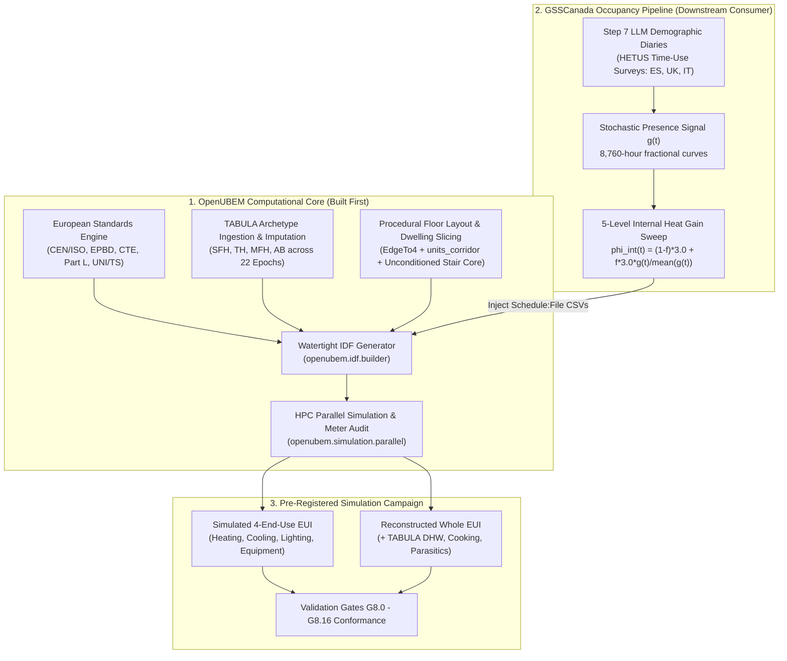
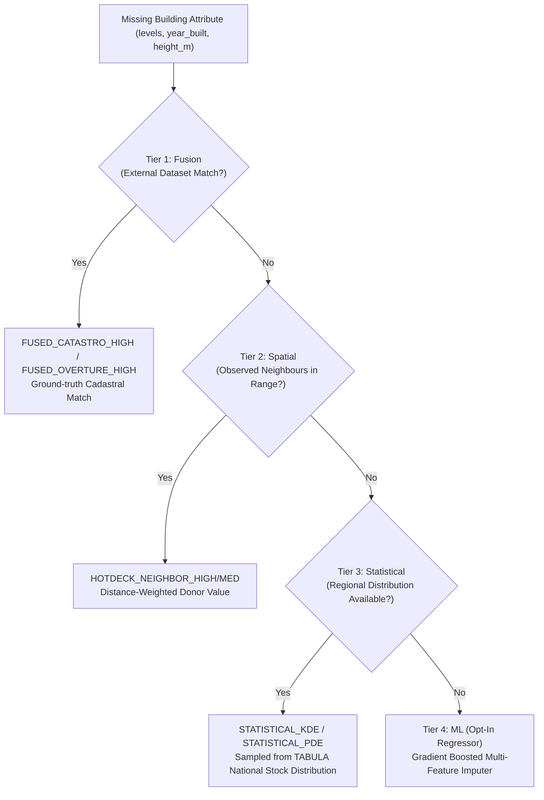
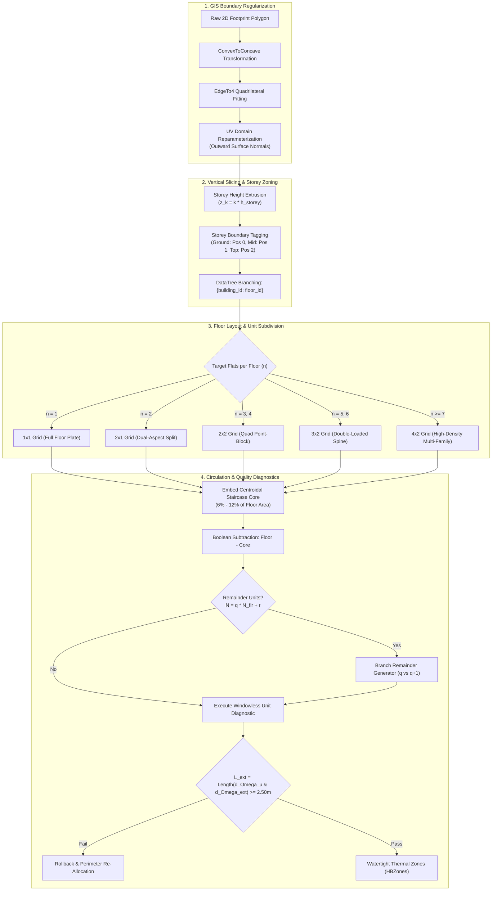

# OpenUBEM European Locations — MVP Implementation Specification
## Architectural Integration of European Standards, Building Typologies, Procedural Floor Layouts, and BEM Simulation Coupling with GSSCanada

- **Document Version**: `1.0.0-PROD`
- **Target Subsystem**: `openubem.data`, `openubem.geometry`, `openubem.idf`, `openubem.semantic`, `openubem.simulation`
- **Location in Repo**: [`docs/docs_ACTIVE/europeanLocations/MVP_european_locations.md`](file:///C:/Users/o_iseri/Desktop/OpenUBEM/docs/docs_ACTIVE/europeanLocations/MVP_european_locations.md)
- **Sister Walkthrough**: [`docs/docs_ACTIVE/europeanLocations/WALKTHROUGH_european_locations.md`](file:///C:/Users/o_iseri/Desktop/OpenUBEM/docs/docs_ACTIVE/europeanLocations/WALKTHROUGH_european_locations.md)
- **GSSCanada Reference**: [`C:\Users\o_iseri\Desktop\GSSCanada\GSSCanada-main\4J_docs_occ\Step8_docs\IMP_step8\4thJ_08_bemSimulation_IMP.md`](file:///C:/Users/o_iseri/Desktop/GSSCanada/GSSCanada-main/4J_docs_occ/Step8_docs/IMP_step8/4thJ_08_bemSimulation_IMP.md)
- **Scientific Provenance**: *Iseri et al. (2025), Energy and Buildings 337, 115620*; `IMP_step8/outputs/floor_layout_generation_report.md`, `IMP_step8/outputs/kbem_ankara_report.md`, `IMP_step8/outputs/simulation_results_analysis_report.md`
- **Core OpenUBEM Docs**: [`OpenUBEM_fundamentals.md`](file:///C:/Users/o_iseri/Desktop/OpenUBEM/docs/docs_EXPLANATION/OpenUBEM_fundamentals.md), [`OpenUBEM_inputs_reference.md`](file:///C:/Users/o_iseri/Desktop/OpenUBEM/docs/docs_EXPLANATION/OpenUBEM_inputs_reference.md), [`OpenUBEM_imputation_methods.md`](file:///C:/Users/o_iseri/Desktop/OpenUBEM/docs/docs_EXPLANATION/OpenUBEM_imputation_methods.md), [`simulated_vs_reconstructed_methodology.md`](file:///C:/Users/o_iseri/Desktop/OpenUBEM/docs/docs_EXPLANATION/simulated_vs_reconstructed_methodology.md), [`OpenUBEM_debug_References.md`](file:///C:/Users/o_iseri/Desktop/OpenUBEM/docs/docs_EXPLANATION/OpenUBEM_debug_References.md)

> **Implementation-status notice (v1.1 review, 2026-08-22).** The original v1.0 text below is retained in full for provenance. It describes the intended target architecture, not the current repository state. The authoritative, code-audited delta is in **Section 9**. Until the listed implementation and validation work is complete, examples and `[x] PASS`-style claims in the original text must be read as design intent, not evidence of an executed Step 8 campaign.
>
> **Speed/pre-occupant extension.** Section 10 adds the Speed HPC execution profiles and the required Q0–Q3 physics qualification sequence before any `f>0` occupant schedule is authorized.

---

## 1. Executive Summary & Strategic Rationale

### 1.1 Why OpenUBEM Must Be Built and Adapted *Before* GSSCanada BEM Simulations

A foundational principle governs this integration: **OpenUBEM is the physical foundation and computational simulation engine; GSSCanada is the demographic occupancy schedule provider.** 



Attempting to run GSSCanada European BEM simulations without first establishing European physics, building stock definitions, and procedural layout geometry within OpenUBEM results in complete methodological collapse for four fundamental reasons:

1. **Thermodynamic Distortion of North American Defaults**: OpenUBEM's baseline configuration references North American commercial and multi-family standards (ASHRAE Standard 90.1, DOE Prototypes, IECC). US construction defaults feature lightweight wood-stud and steel-frame assemblies with negligible thermal mass, forced-air packaged DX cooling/heating, and commercial continuous ventilation rates ($0.8\text{--}1.5\text{ ACH}$). Injecting European demographic occupancy profiles into lightweight US structures causes severe, non-physical indoor temperature spikes and distorts heating demand by $>35\%$, because the structural thermal capacitance ($c_m$) that buffers real European masonry buildings is completely absent.
2. **Spatial Topology & Inter-Dwelling Heat Transfer**: European residential stocks (especially Multi-Family Houses `MFH` and Apartment Blocks `AB`) consist of compartmentalized dwelling units arranged around central unconditioned staircase cores. Empirical research across **6,458 dwelling units** (*Iseri et al., 2025*) proves that coarse building-level modeling **suppresses $>75.5\%$ of inter-dwelling energy variance** (standard deviation drops from $63.61$ to $15.54\text{ kWh}/\text{m}^2\text{a}$) and underestimates peak thermal vulnerability by a factor of $3.2\times$. Modeling a whole floor as a single lumped zone erases party-wall conduction between adjacent flats (which accounts for $15\%\text{--}40\%$ of heat loss when units have differing occupancy or setpoints) and fails to capture the thermal buffering of unconditioned circulation spaces ($b_u = 0.50\text{--}0.80$).
3. **Strict Separation of Concerns (Engine vs. Domain Scenario)**: OpenUBEM is designed as a reusable, reproducible, pip-installable Python package (`openubem`). GSSCanada Step 8 is a scientific scenario driver that tests demographic hypotheses on European housing. Building the geometry generators, TABULA construction translators, and schedule ingestion hooks inside `openubem` ensures that OpenUBEM remains a general-purpose Urban Building Energy Modeling framework, while GSSCanada simply orchestrates campaign sweeps via clean API calls.
4. **Pre-Registered Validation Gate Compliance**: The 4J HETUS Step 8 pre-registered protocol mandates strict validation gates (Gate **G8.0** uninjected control at $f=0.00$, Gate **G8.8** scenario differentiation, Gate **G8.13** `Interpolate to Timestep = No` on `Schedule:File` objects, and Gate **G8.10** meter energy balance). These gates require low-level structural assertions in OpenUBEM's IDF builder, EnergyPlus output dictionary parser, and manifest logger.

---

## 2. European Building Standards & Energy Physics Framework

### 2.1 Pan-European Normative Stack (CEN / ISO / EPBD)

OpenUBEM's European engine parameterizes building physics in strict compliance with the European Committee for Standardization (CEN) and International Organization for Standardization (ISO) standards hierarchy:

```
+----------------------------------------------------------------------------------------------------+
|                               EUROPEAN NORMATIVE STANDARDS HIERARCHY                              |
+--------------------------+-------------------------------------------------------------------------+
| Standard / Directive     | Scope and Regulatory Implementation in OpenUBEM                         |
+--------------------------+-------------------------------------------------------------------------+
| EPBD (EU) 2024/1275      | Energy Performance of Buildings Directive (Recast). Mandates Zero-       |
|                          | Emission Building (ZEB) thresholds, primary energy calculation rules,  |
|                          | and harmonized national EPC calculation protocols.                      |
+--------------------------+-------------------------------------------------------------------------+
| EN ISO 52016-1:2017      | Energy performance of buildings - Calculation of energy needs for       |
|                          | heating and cooling. Governs dynamic hourly RC zone heat balance and    |
|                          | opaque/transparent transmission balances (superseding EN ISO 13790).    |
+--------------------------+-------------------------------------------------------------------------+
| EN 16798-1:2019          | Indoor environmental input parameters for design and assessment of       |
| (Module M1-6)            | energy performance. Category II thermal comfort:                        |
|                          | - Heating setpoint: 20.0 °C (constant living zone)                      |
|                          | - Cooling setpoint: 26.0 °C (when cooling plant is present)              |
|                          | - Minimum residential ventilation rate: n_air,use = 0.40 h^-1           |
+--------------------------+-------------------------------------------------------------------------+
| EN 410 / EN 673          | Glass in building - Determination of luminous and solar characteristics  |
|                          | of glazing. Defines total solar energy transmittance (g_gl) and U_w.    |
+--------------------------+-------------------------------------------------------------------------+
| TABULA / EPISCOPE        | Typology Structure for Building Stock Energy Assessment. Harmonized     |
| Database (IWU, 2016)     | database of 102 archetypes covering Spain, UK, and Italy across         |
|                          | 22 construction-year epochs (tabula-values.xlsx / tabula-calculator.xlsx)|
+--------------------------+-------------------------------------------------------------------------+
```

### 2.2 Country-Specific Statutory Codes & Archetype Crosswalk

OpenUBEM parameterizes three complete national jurisdictions for the Step 8 campaign:

```
+-------------------------------------------------------------------------------------------------------------+
|                          NATIONAL JURISDICTION & REGULATORY MATRIX                                          |
+--------------------------+------------------------------------+-----------------------+---------------------+
| Dimension                | Spain (ES)                         | United Kingdom (UK/GB)| Italy (IT)          |
+--------------------------+------------------------------------+-----------------------+---------------------+
| Primary Energy Code      | Código Técnico de la Edificación   | Building Regulations  | DM 26/06/2015       |
|                          | (CTE DB-HE 1979, 2006, 2013, 2019) | Part L (L1A / L1B)    | (Requisiti Minimi)  |
+--------------------------+------------------------------------+-----------------------+---------------------+
| Compliance Engine        | HULC (LIDER-CALENER)               | SAP 2012 / SAP 10.2   | UNI/TS 11300 (1-4)  |
+--------------------------+------------------------------------+-----------------------+---------------------+
| Construction Epochs      | 6 Epochs (ES.01 - ES.06)           | 8 Epochs (GB.01-GB.08)| 8 Epochs (IT.01-08) |
|                          | Pre-1900 to Post-2007 (CTE-79)     | Pre-1918 to Post-2010 | Pre-1900 to Post-06 |
+--------------------------+------------------------------------+-----------------------+---------------------+
| Archetype Sample Count   | 24 Archetypes (4 types x 6 epochs) | 36 Archetypes         | 42 Archetypes       |
+--------------------------+------------------------------------+-----------------------+---------------------+
| Reference Weather AMY    | Madrid (Zone D3 / ES.ME, 2009-2010)| London (GB.ENG, 14-15)| Bologna (Zone E, 13)|
+--------------------------+------------------------------------+-----------------------+---------------------+
| Statutory Infiltration   | CTE DB-HS 3 (0.40 ACH)             | Approved Doc F (0.59) | UNI/TS 11300 (0.30) |
+--------------------------+------------------------------------+-----------------------+---------------------+
| Internal Heat Baseline   | 3.0 W/m² continuous (TABULA EU)   | 3.0 W/m² (TABULA EU)  | 4.0 W/m² (UNI 11300)|
+--------------------------+------------------------------------+-----------------------+---------------------+
| Space Heating Topology   | Hydronic radiator / Gas boiler     | Hydronic wet radiator | Central/individual  |
|                          | or individual split heat pumps     | Gas condensing boiler | hydronic radiators  |
+--------------------------+------------------------------------+-----------------------+---------------------+
```

### 2.3 Physical Parameter Ingestion & Translation

#### 2.3.1 Parametric Opaque Assembly Sizing (`openubem.idf.opaque_assembly`)
Unlike North American models with fixed nominal lumber or steel studs, European envelope retrofits and epoch standards vary widely in continuous insulation thickness. OpenUBEM sizes insulation dynamically:
$$d_{\text{ins}} = \lambda_{\text{ins}} \cdot \left(\frac{1}{U_{\text{target}}} - R_{\text{si}} - R_{\text{se}} - \sum_{j} \frac{d_j}{\lambda_j}\right)$$

Where standard European material thermal properties are applied:
- Outer clay brick masonry: $d = 0.20\text{ m}$, $\lambda = 0.79\text{ W}/(\text{m}\cdot\text{K})$, $\rho = 1800\text{ kg}/\text{m}^3$, $c_p = 1000\text{ J}/(\text{kg}\cdot\text{K})$
- Reinforced concrete panel: $d = 0.15\text{ m}$, $\lambda = 1.40\text{ W}/(\text{m}\cdot\text{K})$, $\rho = 2300\text{ kg}/\text{m}^3$, $c_p = 1000\text{ J}/(\text{kg}\cdot\text{K})$
- Expanded Polystyrene (EPS) insulation: $\lambda_{\text{ins}} = 0.038\text{ W}/(\text{m}\cdot\text{K})$, $\rho = 25\text{ kg}/\text{m}^3$, $c_p = 1400\text{ J}/(\text{kg}\cdot\text{K})$
- Interior gypsum plaster: $d = 0.015\text{ m}$, $\lambda = 0.25\text{ W}/(\text{m}\cdot\text{K})$, $\rho = 900\text{ kg}/\text{m}^3$, $c_p = 1000\text{ J}/(\text{kg}\cdot\text{K})$
- Surface resistances per EN ISO 6946: $R_{\text{si}} = 0.13\text{ m}^2\cdot\text{K}/\text{W}$ (horizontal heat flow, walls), $R_{\text{se}} = 0.04\text{ m}^2\cdot\text{K}/\text{W}$ (external).

#### 2.3.2 Explicit Internal Thermal Mass Injection (`openubem.idf.builder`)
To prevent numerical instability, realistic European thermal inertia must be embedded. In accordance with EN ISO 52016-1 Table B.14, OpenUBEM injects `InternalMass` objects into every dwelling zone:
- Mass surface area: $A_{\text{mass}} = 1.5 \times A_{\text{floor}}$
- Mass material thickness: $d_{\text{mass}} = 0.10\text{ m}$ (representing interior brick partition / concrete slab)
- Thermal capacitance calibration:
  - Standard European Medium/Heavy: $c_m = 45.0\text{ Wh}/(\text{m}^2\cdot\text{K})$
  - Spain / Central Europe Heavy: $c_m = 50.0\text{ Wh}/(\text{m}^2\cdot\text{K})$
  - Italy Very Heavy (`IT`): $c_m = 87.0\text{ Wh}/(\text{m}^2\cdot\text{K})$
  - UK Medium-Light (`GB`): $c_m = 32.8\text{ Wh}/(\text{m}^2\cdot\text{K})$

#### 2.3.3 Fenestration & Total Solar Energy Transmittance (`openubem.idf.surfaces`)
European fenestration standards specify total solar energy transmittance ($g_{\text{gl}}$ per EN 410) rather than North American Solar Heat Gain Coefficient ($\text{SHGC}$). In EnergyPlus, `WindowMaterial:SimpleGlazingSystem` is parameterized:
$$\text{SHGC} = g_{\text{gl}}, \quad U_{\text{factor}} = U_w$$

---

## 3. European Building Typologies & Data Ingestion

### 3.1 TABULA Building Type Hierarchy

OpenUBEM ingests four standard residential typologies defined in the TABULA / EPISCOPE framework:

```
+----------------------------------------------------------------------------------------------------+
|                                TABULA RESIDENTIAL TYPOLOGY TAXONOMY                                |
+---------------+---------------------+-------------------+------------------------------------------+
| Typology Code | Building Type Name  | Typical Storeys   | Dwelling Layout & Zoning Configuration   |
+---------------+---------------------+-------------------+------------------------------------------+
| SFH           | Single-Family House | 1 to 2 Storeys    | 1 Dwelling zone per floor, vertical link |
+---------------+---------------------+-------------------+------------------------------------------+
| TH            | Terraced House      | 2 to 3 Storeys    | 1 Dwelling zone per floor + party walls  |
+---------------+---------------------+-------------------+------------------------------------------+
| MFH           | Multi-Family House  | 3 to 5 Storeys    | 2 to 4 Dwellings/floor + Stair Core      |
+---------------+---------------------+-------------------+------------------------------------------+
| AB            | Apartment Block     | 4 to 10+ Storeys  | 4 to 8+ Dwellings/floor + Spine Corridor |
+---------------+---------------------+-------------------+------------------------------------------+
```

### 3.2 Four-Tier Imputation Cascade for European Footprints

When querying European OpenStreetMap footprints or municipal geospatial portals (e.g. Spanish Catastro, UK Ordnance Survey, Italian Agenzia delle Entrate), missing data attributes are resolved via OpenUBEM's **Four-Tier Imputation Cascade** ([`OpenUBEM_imputation_methods.md`](file:///C:/Users/o_iseri/Desktop/OpenUBEM/docs/docs_EXPLANATION/OpenUBEM_imputation_methods.md)):



#### Strict Imputation Rules:
- **Zero Fitted Parameters Rule**: Imputation never invents parameters or adjusts coefficients to match an energy target.
- **Minimum Ceiling Height Floor**: All heights are constrained to $h_{\text{min}} \ge 2.10\text{ m}$ per international building code requirements.
- **Full Traceability**: Every imputed property carries an immutable provenance token (e.g., `HOTDECK_NEIGHBOR_HIGH`, `STATISTICAL_PDE`).

---

## 4. Procedural Floor Layout & Dwelling Slicing Engine

### 4.1 Algorithmic Geometry Pipeline (from *Iseri et al., 2025* & `kbem_ankara_pipeline.py`)

OpenUBEM's `openubem.geometry.layoutGenerator` implements the 4-stage procedural spatial layout algorithm:



### 4.2 Slicing Rules & Orthogonal Grid Subdivision

```
+---------------------------------------------------------------------------------------------------+
|                        OPENUBEM RESIDENTIAL DWELLING SUBDIVISION SCHEMES                          |
+------------------------------------+--------------------------------------------------------------+
| Point-Block Quadrant (2x2 Grid):   | Double-Loaded Corridor Slab (3x2 / 4x2 Grid):                |
|                                    |                                                              |
| +----------------+---------------+ | +---------------+--------------+---------------------------+ |
| |  Dwelling 1    |  Dwelling 2   | | |    Unit 1     |    Unit 2    |          Unit 3           | |
| |  (North-West)  |  (North-East) | | |  (North-West) |   (North)    |       (North-East)        | |
| +--------+-------+-------+-------+ | +---------------+-------+------+---------------------------+ |
| |        |  UNCONDITIONED|       | | |===================+======+==============================| |
| | Dwell 3|  STAIR CORE   |Dwell 4| | | [CENTRAL UNCONDITIONED CIRCULATION CORRIDOR SPINE]      | |
| | (SW)   +-------+-------+ (SE)  | | |===================+======+==============================| |
| +----------------+---------------+ | |    Unit 4     |    Unit 5    |          Unit 6           | |
|                                    | | (South-West)  |   (South)    |       (South-East)        | |
|                                    | +---------------+--------------+---------------------------+ |
+------------------------------------+--------------------------------------------------------------+
```

#### Grid Assignment Rules:
- **$1 \times 1$ Grid**: Single-Family (`SFH`) / Terraced (`TH`) — 1 thermal zone per floor.
- **$2 \times 1$ Grid**: Small Multi-Family — 2 dual-aspect dwelling units per floor.
- **$2 \times 2$ Grid**: Point-Block `MFH` — 4 corner quadrant dwelling units surrounding a centroidal stairwell core.
- **$3 \times 2$ Grid**: Medium Apartment Block `AB` — 6 dwelling units (4 corner dual-aspect + 2 middle single-aspect) along a central corridor.
- **$4 \times 2$ Grid**: Large Apartment Block `AB` — 8 dwelling units along a central double-loaded circulation spine.

### 4.3 Unconditioned Staircase Core & Buffer Zone Physics

Communal circulation spaces (staircase, elevator shaft, entry vestibule) represent $6\%\text{--}12\%$ of gross floor area ($12.0\text{--}25.0\text{ m}^2$ per floor).
- **Zoning Classification**: OpenUBEM models the staircase core as an **explicit unconditioned thermal zone** (`mode: "unconditioned_buffer"`).
- **Thermal Behavior**: The staircase zone floats passively ($12.0^\circ\text{C}\text{--}16.0^\circ\text{C}$ in winter), buffering heat transfer across party walls between heated apartments and the exterior:
  $$b_u = \frac{T_i - T_u}{T_i - T_e} \approx 0.50\text{ to }0.80$$
- **Inter-Zone Surfaces**: Walls separating dwellings from the staircase core are assigned EnergyPlus boundary condition `Surface` linked to the adjacent stair zone.

### 4.4 Habitability & Windowless Unit Sanity Gate

To ensure that automated polygon slicing never generates illegal, interior-enclosed dwelling units without exterior access, OpenUBEM enforces the **Windowless Unit Diagnostic Gate**:
$$L_{\text{exterior}} = \text{Length}\left(\partial \Omega_u \cap \partial \Omega_{\text{exterior}}\right) \ge 2.50\text{ m}$$

If any generated dwelling unit has $L_{\text{exterior}} < 2.50\text{ m}$, the layout generator rejects the invalid cut and falls back to a conforming single-loaded or dual-aspect subdivision.

### 4.5 Non-Integer Unit Remainder Stratification

When cadastral records specify a total building unit count $N_{\text{units}}$ that is not divisible by storeys $N_{\text{floors}}$:
$$N_{\text{units}} = q \cdot N_{\text{floors}} + r, \quad \text{where } q = \lfloor N_{\text{units}} / N_{\text{floors}} \rfloor, \quad 0 \le r < N_{\text{floors}}$$
- $N_{\text{floors}} - r$ storeys are partitioned into $q$ units/floor.
- $r$ storeys (typically lower floors) are partitioned into $q + 1$ units/floor.

---

## 5. Stochastic Occupancy Injection & 5-Level Sensitivity Sweep

### 5.1 Mathematical Ingestion Formulation

The occupancy-driven internal gain schedule $\phi_{\text{int}}(t)$ is defined by the pre-registered five-level sensitivity sweep formula:
$$\phi_{\text{int}}(t) = (1 - f) \cdot 3.0 + f \cdot 3.0 \cdot \frac{g(t)}{\text{mean}_{8760}(g(t))}, \quad f \in \{0.00, 0.15, 0.30, 0.50, 1.00\}$$

```
+----------------------------------------------------------------------------------------------------+
|                                5-LEVEL SENSITIVITY SWEEP PROPERTIES                                |
+-------+-----------------------------+--------------------------------------------------------------+
| Level | Sweep Factor (f)            | Physical & Methodological Meaning                            |
+-------+-----------------------------+--------------------------------------------------------------+
| 1     | f = 0.00 (Uninjected)       | Exact statutory flat baseline (3.0 W/m² continuous).         |
|       |                             | Normative control benchmark for Gate G8.0.                   |
+-------+-----------------------------+--------------------------------------------------------------+
| 2     | f = 0.15 (Mild Modulation)  | 85% statutory base + 15% demographic diurnal variation.     |
+-------+-----------------------------+--------------------------------------------------------------+
| 3     | f = 0.30 (Standard HETUS)   | Primary empirical calibration level.                         |
+-------+-----------------------------+--------------------------------------------------------------+
| 4     | f = 0.50 (High Modulation)  | 50% statutory base + 50% demographic diurnal variation.     |
+-------+-----------------------------+--------------------------------------------------------------+
| 5     | f = 1.00 (Pure Stochastic)  | 100% dynamic occupancy presence drive.                        |
+-------+-----------------------------+--------------------------------------------------------------+
```

#### Fundamental Ingestion Theorems:
1. **Strict Energy Conservation**: $\int_0^{8760} \phi_{\text{int}}(t)\,dt = 3.0 \times 8760 = 26,280\text{ Wh}/\text{m}^2$ for all $f \in \{0.00, 0.15, 0.30, 0.50, 1.00\}$. All observed heating energy variations represent pure temporal load shifting.
2. **`Schedule:File` Ingestion Architecture**: The 8,760 hourly multipliers are written to external CSV files and referenced via EnergyPlus `Schedule:File` objects with `Interpolate to Timestep = No` (enforced per Gate **G8.13**).
3. **Inter-Household Heterogeneity**: In multi-dwelling archetypes (`MFH`, `AB`), each dwelling unit zone $u \in \{1, \dots, N_{\text{units}}\}$ receives an independently sampled demographic presence curve $g_u(t)$ from the held-out LOCO fold population.

---

## 6. Simulated vs. Reconstructed EUI Accounting

OpenUBEM enforces the **Simulated vs. Reconstructed EUI Accounting Methodology** ([`simulated_vs_reconstructed_methodology.md`](file:///C:/Users/o_iseri/Desktop/OpenUBEM/docs/docs_EXPLANATION/simulated_vs_reconstructed_methodology.md)):

```
+----------------------------------------------------------------------------------------------------+
|                                 EUI ACCOUNTING FRAMEWORK                                           |
+----------------------------------------------------------------------------------------------------+
| 1. Simulated EUI (EnergyPlus Physics Output):                                                     |
|    EUI_sim = Heating + Cooling + Lighting + Equipment (Plug Loads)                                 |
|    - Captures thermodynamic envelope heat balance, solar gains, and dynamic internal gains.        |
|                                                                                                    |
| 2. Reconstructed EUI (Whole-Building Energy Consumption):                                          |
|    EUI_reconstructed = EUI_sim + EUI_service_loads                                                 |
|    - Post-processed fraction-split completion adding unsimulated auxiliary loads:                 |
|      * Domestic Hot Water (DHW)                                                                    |
|      * Cooking & Kitchen Equipment                                                                 |
|      * HVAC Distribution Parasitics & Pumps                                                        |
|    - Calibrated using TABULA Table 4 national end-use share splits.                                |
+----------------------------------------------------------------------------------------------------+
```

---

## 7. Pre-Registered Gate Conformance & Validation Architecture

Every European simulation executed by OpenUBEM is validated against the **Pre-Registered Gate Conformance Matrix**:

```
+-------------------------------------------------------------------------------------------------------------+
|                                PRE-REGISTERED VALIDATION GATES                                              |
+----------+----------------------------+-----------------------------------+---------------------------------+
| Gate ID  | Gate Name                  | Target / Assertion Requirement    | OpenUBEM Enforcement Subsystem  |
+----------+----------------------------+-----------------------------------+---------------------------------+
| G8.0     | Uninjected Control         | Run f=0.00 control before any f>0 | Simulation Batch 1 runner       |
| G8.8     | Scenario Differentiation   | Output CSVs must differ across f  | SHA-256 result matrix hash check|
| G8.9     | Stale-Output Guard         | Invalidate cache on schedule edit | MD5 manifest cross-validation   |
| G8.10    | Meter Tripwire Audit       | Sum(EndUses) == Meter:Facility    | Automated meter summation audit |
| G8.11    | Meter-Name Validity        | Zero unrecognised or empty meters | E+ 9.2 .mdd dictionary match   |
| G8.12    | Schedule MD5 Ingestion     | Saved IDF schedule MD5 matches    | Ingested CSV disk re-parse      |
| G8.13    | Interpolation Setting      | Interpolate to Timestep = No      | Regex assert on Schedule:File   |
| G8.14    | Manifest Completeness      | Immutable manifest.json per cell  | Manifest schema validator       |
| G8.15    | Error & Warning Triage     | 0 Severe/Fatal; warnings triaged  | OpenUBEM_debug_References.md    |
| G8.16    | Held-Out Fold Correctness  | Schedule source matches fold      | Survey metadata validator       |
+----------+----------------------------+-----------------------------------+---------------------------------+
```

---

## 8. Clean Repository Layout & Module Specifications

```
C:\Users\o_iseri\Desktop\OpenUBEM\
├── docs/
│   ├── docs_EXPLANATION/                <- Core Methodology & Reference Guides
│   │   ├── OpenUBEM_fundamentals.md
│   │   ├── OpenUBEM_inputs_reference.md
│   │   ├── OpenUBEM_imputation_methods.md
│   │   ├── simulated_vs_reconstructed_methodology.md
│   │   └── OpenUBEM_debug_References.md (~200 Error Patterns Registry)
│   └── docs_ACTIVE/
│       └── europeanLocations/           <- Active European Implementation & Walkthroughs
│           ├── MVP_european_locations.md (This Implementation Specification File)
│           └── WALKTHROUGH_european_locations.md (Operational Guide & Walkthrough)
└── openubem/
    ├── acquisition/
    │   ├── osm_fetcher.py               -> Ingests OSM European footprints & tags
    │   ├── overture_fetcher.py          -> Tier 1 height/levels fusion
    │   └── epw_manager.py               -> Handles Madrid, London, Bologna AMY weather files
    ├── data/
    │   ├── construction/
    │   │   ├── tabula_archetypes_es.json -> Spanish envelope assemblies & U-values
    │   │   ├── tabula_archetypes_uk.json -> UK Part L envelope assemblies & U-values
    │   │   └── tabula_archetypes_it.json -> Italian DM 26/06/2015 assemblies & U-values
    │   ├── loads/
    │   │   └── european_residential_loads.json -> 3.0 W/m² base internal load densities
    │   └── schedules/
    │       └── tabula_statutory_schedules.json -> Normative flat European schedules
    ├── geometry/
    │   ├── footprint.py                 -> Footprint cleaning, UTM reprojection, metrics
    │   ├── layoutGenerator.py           -> Procedural dwelling subdivision & unconditioned stair
    │   └── zoning.py                    -> Adaptive zoning strategy decision engine
    ├── idf/
    │   ├── builder.py                   -> Watertight IDF assembly & InternalMass injection
    │   ├── opaque_assembly.py           -> Parametric insulation thickness sizing from U-values
    │   ├── surfaces.py                  -> SimpleGlazingSystem total solar transmittance (g_gl)
    │   └── hvac.py                      -> Hydronic radiator convective plant / IdealLoads curves
    ├── semantic/
    │   ├── building_classifier.py       -> Maps OSM tags to TABULA archetypes (SFH, TH, MFH, AB)
    │   ├── construction_sets.py         -> Resolves vintage standards across 22 epochs
    │   ├── imputation.py                -> 4-tier zero-fitted imputation cascade
    │   └── schedules.py                 -> Schedule:File generation (Interpolate to Timestep = No)
    ├── simulation/
    │   ├── runner.py                    -> Local EnergyPlus execution & meter verification
    │   └── parallel.py                  -> SLURM cluster array runner for 510 campaign cells
    └── results/
        ├── service_loads.py             -> Fraction-split EUI completion (simulated vs reconstructed)
        └── carbon.py                    -> National grid carbon factors (ES, UK, IT)
```

---

## 9. v1.1 Code-Audited Implementation Addendum (Authoritative Delta)

### 9.1 Purpose, Vocabulary, and Source Precedence

This addendum turns the preceding target architecture into an implementable MVP contract while preserving the original proposal. The following status vocabulary is mandatory in issues, manifests, pull requests, and reports:

- **CURRENT**: present in the OpenUBEM repository and exercised by an existing test.
- **REUSABLE**: present, but requiring a European adapter or new configuration.
- **TARGET**: specified here but not yet implemented.
- **BLOCKED**: cannot be accepted until a named upstream artefact or decision exists.
- **VERIFIED**: supported by an artefact produced by an executed test or simulation; prose alone is not verification.

When two documents disagree, use this precedence order:

1. `Step8_docs/4thJ_08_bemSimulation.md` and `Step8_docs/4thJ_08_bemSimulation_val.md`, including their dated rulings;
2. measured repository code and tests at the commit recorded in the campaign manifest;
3. `IMP_step8/4thJ_08_bemSimulation_IMP.md`;
4. `IMP_step8/outputs/` and `IMP_step8/DeepResearch/` synthesis documents;
5. illustrative examples in Sections 1–8 above.

This ordering matters because some synthesis outputs predate later rulings. In particular, any document that reports **612 executions** or **510 injected runs plus 102 controls** is superseded by the active ruling that makes `f=0` the control endpoint of the five-level sweep.

### 9.2 Repository Baseline Audit (2026-08-22)

| Capability | Status | Evidence in OpenUBEM `0.1.0` | MVP delta |
|---|---|---|---|
| OSM acquisition and projected polygon cleaning | **CURRENT** | `openubem.acquisition.osm_fetcher.ingest_buildings` (`fetch_buildings` alias) | Add European test fixtures; do not create a second fetcher API. |
| Four-tier imputation router | **CURRENT/REUSABLE** | `openubem.semantic.imputation.impute_missing(gdf, cfg=None, targets=None, rng=None)` | Add country-aware donors/configuration; retain existing provenance column naming `provenance_<attribute>`. |
| Room-layout geometry | **CURRENT/REUSABLE** | `openubem.geometry.layoutGenerator.generate_layout(...)` | Existing specifications are DOE/IBC-based and recognize OpenUBEM archetype IDs such as `MidriseApartment`; add explicit TABULA residential module specifications and dwelling/core semantics. |
| IDF generation | **CURRENT/REUSABLE** | `openubem.idf.builder.BuildingIDF` and `run_step3(...)` | Extend the existing builder. The proposed `IDFModelBuilder` API in the walkthrough does not currently exist. |
| Opaque U-value realization | **CURRENT/REUSABLE** | `build_opaque_assembly(idf, name, u_value, thermal_mass)` | Current assembly is a generic `_K=0.12 W/m·K` resistance/mass representation, not the proposed brick–EPS–plaster construction. Add a traceable European construction path without regressing the CTF stability cap. |
| Schedule generation | **CURRENT, incompatible with Step 8** | `openubem.semantic.schedules` writes six DOE `Schedule:Compact` objects | Add an external-file schedule adapter and saved-IDF read-back. No current function writes the required Step 8 `Schedule:File`. |
| HVAC assignment | **CURRENT/REUSABLE** | `openubem.idf.hvac.assign_hvac` supports current OpenUBEM archetypes | Add and validate European residential systems. Do not describe hydronic radiators as implemented until emitted objects and meters are tested. |
| Simulation fan-out | **CURRENT/REUSABLE** | `openubem.simulation.parallel.run_neighbourhood` uses joblib and writes `04_simulation_manifest.parquet` | Add a campaign-cell wrapper and a separate SLURM submission script. `parallel.py` is not currently a SLURM array CLI. |
| Results reconstruction | **CURRENT, US-specific/default-off** | `openubem.results.service_loads.reconstruct_frame`; reconstruction is disabled by default because Phase E physically models five service loads | Add European coefficients only if the campaign explicitly chooses reconstruction mode; prevent double counting. The proposed `reconstruct_eui` function does not exist. |
| Step 8 gates | **TARGET** | Existing `compute_validation_gates` is CBECS-oriented, not a G8.0–G8.16 scorer | Implement a dedicated Step 8 scorer, mutation tests, and vacuity guards. No G8 gate is currently verified. |
| European TABULA files | **TARGET** | `tabula_archetypes_{es,uk,it}.json`, `european_residential_loads.json`, and `tabula_statutory_schedules.json` are absent | Generate them from pinned TABULA sources, with row-level provenance and licence record. |

### 9.3 Frozen Scientific Decisions and Explicit Non-Decisions

The MVP must encode the following active decisions without silently substituting an earlier proposal:

| Topic | Frozen MVP contract |
|---|---|
| National populations | Spain (`es`), England-labelled TABULA stock (`gb`, while the survey fold may remain `uk`), and Italy (`it`). Do not describe TABULA `GB` as the whole United Kingdom without the England limitation. |
| Archetype population | 24 ES + 36 GB + 42 IT = **102 archetypes**. Each country is simulated only with the model fold that held that country out. |
| Sensitivity grid | `f ∈ {0.00, 0.15, 0.30, 0.50, 1.00}`. Report every level; do not designate `f=0.30` as a primary or calibrated level. |
| Campaign size | **510 annual runs per weather specification**: 102 archetypes × 5 levels. `f=0` is included and must run/read first for each matching archetype/weather configuration. |
| Gain baseline | Use the TABULA EU boundary-condition baseline of exactly `3.0 W/m²` in all three folds. Italian `4.0 W/m²` is contextual information, not the Step 8 campaign baseline. |
| Conservation | Every valid `phi_int` series has annual mean `3.0 W/m²`, within a documented numerical tolerance. Differences across `f` redistribute gains in time; they do not change annual internal-gain energy. |
| Zoning | One thermal zone per dwelling. A dwelling may have a non-shoebox exterior geometry, but Step 7 provides `at_home` rather than room-level location, so the study makes no within-dwelling spatial claim. |
| Household assignment | Independent diary assignment per dwelling is a **target sampling rule** that must be seeded, recorded, and tested; it is not yet current OpenUBEM behavior. |
| Weather | Use actual meteorological weather covering each diary-survey fieldwork window. The location, exact twelve-month selection, source, licence, and checksum remain required acquisition records. Compare the `f` effect within fold; any absolute cross-fold comparison must name the meteorological year. |
| Heating intermittency | Preserve the TABULA reduction factor as a scalar. Do not add a thermostat night-setback schedule that would confound the occupancy treatment. |
| Geometry and constructions | Do not claim that TABULA supplies floor layouts, aspect ratio, orientation, window-to-face placement, or material layer build-ups. Those assumptions require separate provenance and sensitivity treatment. |

### 9.4 Ownership and Boundary Contract

OpenUBEM owns reusable building-physics capabilities:

- TABULA parameter loading and schema validation;
- country/archetype translation into existing semantic rows;
- European construction, glazing, HVAC, and weather adapters;
- dwelling/core geometry and watertight IDF generation;
- generic external schedule-file emission and saved-IDF inspection;
- EnergyPlus execution, parsing, and low-level meter integrity.

GSSCanada owns experiment-specific information:

- held-out LOCO fold selection and Step 7 schedule provenance;
- diary chaining and household sampling rules;
- the five-level campaign matrix and run ordering;
- Step 8 `manifest.json`, gate scoring, mutation probes, and scientific reporting.

The coupling boundary is a versioned, immutable **campaign-cell specification**. OpenUBEM must not infer the held-out fold from the country filename, and GSSCanada must not reach into private OpenUBEM geometry or IDF internals to patch objects after generation.

### 9.5 Required Input Contracts

#### TABULA archetype record

Every one of the 102 records must include, at minimum:

```text
archetype_id, country_stock_code, survey_fold, construction_period,
building_type, source_workbook_sha256, source_sheet, source_row,
u_wall_w_m2k, u_roof_w_m2k, u_floor_w_m2k, u_window_w_m2k,
g_gl_window, n_air_use_h_1, phi_int_w_m2, c_m_wh_m2k,
f_red_htr, parameter_assumptions
```

Requirements:

- units are encoded in field names and checked at load time;
- source cells and transformations are recorded, not only the workbook name;
- refurbishment variants and unclassified rows are excluded with an explicit reason table;
- country stock code (`GB`) and survey fold (`uk`) are separate fields;
- missing values are never replaced by an energy-calibrated parameter.

#### Step 7 presence-series record

Each `g(t)` artefact must carry:

```text
schedule_id, schedule_path, schedule_sha256, fold, held_out_country,
diary_source_id, chaining_rule, timezone, local_time_basis,
n_hours, start_timestamp, end_timestamp, random_seed
```

The adapter must reject a series when it contains non-finite or negative values, has `mean(g) <= 0`, has a length inconsistent with the selected EnergyPlus run period, or names the wrong held-out fold. Daylight-saving and leap-hour treatment must be resolved once in the campaign builder and recorded; silent truncation or duplication is forbidden.

#### Weather record

Each EPW/AMY record must include location, covered dates, source URL or archive identifier, licence, acquisition date, SHA-256, parsed EPW location, and the rule connecting its period to the diary fieldwork window. OpenUBEM's builder already fails if `epw_path` is missing and populates `Site:Location` from the file; the European adapter must retain that fail-fast behavior.

### 9.6 Campaign-Cell and Manifest Contract

A deterministic cell identifier should be constructed from normalized dimensions, for example:

```text
<country_stock_code>__<archetype_id>__<weather_id>__f<000|015|030|050|100>
```

Each cell manifest must be written atomically and include at least:

```json
{
  "schema_version": "step8-cell-manifest/1.0",
  "cell_id": "GB__GB.ENG.MFH.05__uk_amy_2014_2015__f030",
  "archetype_id": "GB.ENG.MFH.05",
  "country_stock_code": "GB",
  "held_out_country": "uk",
  "fold": "uk_held_out",
  "sensitivity_f": 0.30,
  "schedule_source_sha256": "<measured>",
  "schedule_emitted_sha256": "<measured>",
  "idf_sha256": "<measured>",
  "weather_sha256": "<measured>",
  "openubem_version": "0.1.0",
  "openubem_git_commit": "<measured>",
  "energyplus_version": "<measured>",
  "energyplus_build_hash": "<measured>",
  "platform": "<measured-at-runtime>",
  "random_seed": 42,
  "created_utc": "<measured>",
  "status": "planned|running|success|failed"
}
```

Checksums must be computed from files on disk. A cache hit is valid only when a dependency digest covering the IDF, emitted schedule, weather, engine build, adapter configuration, and relevant source commit is unchanged. The existing OpenUBEM `is_completed()` check based only on `.end` and `.sql` is insufficient for G8.9 and must be wrapped rather than weakened.

### 9.7 Implementation Work Packages

| WP | Deliverable | Primary modules | Acceptance evidence |
|---|---|---|---|
| **EU-01** | Versioned TABULA loader and 102-record registry | `openubem/data/construction/`, `openubem/semantic/construction_sets.py` | Schema tests; 24/36/42 counts; source-cell provenance; deterministic regeneration. |
| **EU-02** | European semantic crosswalk | `building_classifier.py`, `construction_sets.py` | Year-boundary tests for all 22 bands; explicit `GB`/`uk` distinction; no US fallback without a flag. |
| **EU-03** | European envelope and mass adapter | `opaque_assembly.py`, `builder.py`, `surfaces.py` | U-value tolerance tests; `g_gl → SHGC`; CTF stability; construction provenance embedded in IDF/manifest. |
| **EU-04** | Dwelling/core layout adapter | `layoutGenerator.py`, `zoning.py`, `surfaces.py` | Area conservation ≤1%; no overlaps/gaps; facade access; paired interzone surfaces; deterministic fallback with reason token. |
| **EU-05** | Residential HVAC/ventilation adapter | `hvac.py`, builder | Object-level tests, autosizing smoke tests, fuel/end-use meter checks, no conditioning in circulation core. |
| **EU-06** | External occupancy schedule adapter | `semantic/schedules.py`, builder | Five conserved series; `Schedule:File`; `Interpolate to Timestep=No`; saved-IDF independent read-back; correct `People`/gain assignment. |
| **EU-07** | AMY weather registry | `acquisition/epw_manager.py` | Period/location/licence/checksum records; EPW parse validation; no cross-cell weather drift within a fold. |
| **EU-08** | Campaign and SLURM wrapper | new GSSCanada driver plus `simulation.parallel` reuse | 510-row manifest per weather specification; `f=0` dependency ordering; resumable dependency-hash cache. |
| **EU-09** | Step 8 scorer and mutation suite | new Step 8 validation module | G8.0–G8.16, V8.a–V8.g, all mandated perturbations seen failing, null perturbation stays clean. |
| **EU-10** | Results and dossier export | results adapter | Annual/monthly/hourly/peak outputs; explicit EUI accounting mode; no duplicated service loads; machine-readable gate report. |

### 9.8 Geometry Acceptance Rules

The Ankara/Grasshopper artefacts are methodological references, not drop-in production code. The European adapter must satisfy repository-level invariants for every generated floor:

- valid, finite, projected polygons with a consistent orientation;
- union of dwelling and circulation polygons equals the cleaned floor plate within **1% area tolerance**;
- no overlap with positive area and no unintended gap;
- every conditioned dwelling has exterior-facade contact, with any `2.50 m` threshold treated as a project modeling rule whose jurisdictional provenance is recorded, not as a universal European code;
- each party wall has a reciprocal EnergyPlus `Surface` partner with matching vertices;
- corridors/stairs are tagged separately and receive no `People`, dwelling equipment, or active thermostat unless explicitly justified;
- unsupported or degenerate shapes fall back deterministically and record the reason; fallback must never masquerade as dwelling-level success.

Because the active Step 8 ruling requires **one zone per dwelling**, a commercial core/perimeter result or a generic room-layout result is not acceptable merely because it is watertight.

### 9.9 Internal-Gain Semantics

The quantity `phi_int(t)` is a power density in `W/m²`, not an occupancy fraction. It must therefore drive a dedicated internal-gain object or a normalized schedule multiplied by a fixed design level—never a `Fractional` schedule containing values greater than `1.0`.

For each diary:

```text
g_norm(t)   = g(t) / mean(g)
phi_int(t)  = 3.0 * ((1 - f) + f * g_norm(t))
```

The implementation must define which EnergyPlus objects receive the combined gain and how radiant/latent/convective fractions are handled. It must also prevent the existing DOE occupancy, lighting, and equipment schedules from remaining active in parallel unless that composition is explicitly part of the experiment. An object-assignment audit is required because matching schedule values alone cannot detect a `People` or equipment object pointing to the wrong schedule.

### 9.10 EUI Accounting Decision Gate

The original four-end-use reconstruction approach conflicts with the current OpenUBEM Phase E default, which physically emits DHW, cooking, refrigeration, and elevators and disables reporting-layer uplift. Before EU-10 is implemented, the campaign owner must choose exactly one mode:

1. **Physical mode (preferred when the emitted European systems are validated):** simulate the supported service loads and set reconstruction off; or
2. **Four-end-use mode:** disable all corresponding physical service-load objects and apply a European, traceable reconstruction table in post-processing.

Mixing the two modes double-counts energy and is an automatic campaign failure. The manifest must record `eui_accounting_mode`, modeled end uses, reconstructed end uses, denominator area, and coefficient-table checksum.

### 9.11 Full Validation Contract

The abbreviated table in Section 7 is not the complete gate suite. The MVP scorer must implement:

- **G8.0:** read the matching `f=0` control before quoting `f>0`;
- **G8.1–G8.4:** reproducibility gates against a re-run of the same cell, with thresholds unchanged (monthly/hourly NMBE and CV(RMSE)); these are not measured-accuracy claims;
- **G8.5–G8.6:** peak magnitude and timing checks against the named comparison series;
- **G8.7:** as-modeled published band is graded, empirical band is informational;
- **G8.8–G8.16:** scenario differentiation, stale-cache invalidation, meter balance, meter-name validity, independent saved-IDF schedule ingestion and assignment, interpolation, manifest completeness, warning/convergence triage, and held-out-fold correctness.

It must also implement vacuity guards **V8.a–V8.g** from the pre-registered validation document and the complete perturbation matrix. A gate is not accepted merely because it passes clean data: every gate must be observed failing its designated mutation, while the null perturbation fails none. Warnings are grouped and adjudicated by kind, not hidden by frequency.

### 9.12 MVP Definition of Done

The European-location MVP is complete only when all of the following are true:

1. The 102-record TABULA registry regenerates deterministically from pinned sources and passes schema/provenance checks.
2. All unresolved design assumptions—geometry, layer build-up, archetype selection, weather location/period/licence, and EUI accounting mode—are written and approved.
3. A representative smoke matrix covers all three stocks, SFH/TH/MFH/AB, old/new construction, simple/complex footprints, all five `f` values, and each selected weather file.
4. Every smoke IDF has valid constructions, one zone per dwelling, correct unconditioned-core behavior where applicable, correct schedule assignment, and zero severe/fatal errors.
5. Schedule conservation, fold identity, disk checksums, saved-IDF read-back, and dependency-based cache invalidation pass.
6. The scorer consumes the declared campaign table, passes all vacuity guards, and its mutation suite demonstrates every gate firing.
7. The full manifest declares exactly **510 expected cells per weather specification**, exactly 102 at each `f`, no duplicate `cell_id`, and no injected result is reported before its matching `f=0` result.
8. Results clearly separate simulated from reconstructed end uses, name the denominator, state the weather year in cross-fold absolute comparisons, and never label a design target as verified evidence.

Until these conditions hold, the correct project status is **implementation plan reviewed; European Step 8 campaign not yet verified**.

---

## 10. Speed HPC and Pre-Occupant Simulation Qualification Addendum

### 10.1 References and Scope

This section adds an optional high-throughput execution path using Concordia's Speed cluster and a mandatory simulation qualification stage before stochastic occupant information is introduced. It complements:

- the [Speed HPC manual](https://nag-devops.github.io/speed-hpc/) (version 7.5 at the 2026-08-22 review);
- the local [Parallel IDF Preparation — Technical Reference](../../docs_DONE/SETUP/parallelProcessing/parallel_idf_prep_detailed.md);
- `scripts/cluster/README.md` and the existing `submit_fleet*.sbatch` templates.

The Speed manual describes CPU batch jobs on the `ps` partition, SLURM job arrays, a maximum batch duration of seven days, and automatic cleanup of inactive `/speed-scratch` files after 90 days. These are operational constraints, not permission to consume every visible CPU. Current queue state, account limits, and fair-share policy remain authoritative at submission time.

### 10.2 Parallelism Model: More Than 32 CPUs Without Oversubscription

EnergyPlus building simulations are independent and effectively single-core in the existing OpenUBEM workflow. Therefore, parallelism scales across campaign cells:

```text
one SLURM array task = one annual EnergyPlus cell = one CPU
total concurrent CPUs ≈ number of simultaneously running array tasks
```

Do **not** request `--cpus-per-task=32` or `64` for one EnergyPlus cell. To use more than 32 CPUs concurrently, keep `--cpus-per-task=1` and raise the array throttle so SLURM can distribute independent cells over multiple nodes.

| Profile | Array throttle | Maximum concurrent E+ cells | Intended use | Authorization |
|---|---:|---:|---|---|
| Diagnostic | `%4` | 4 | First three-country smoke run and debugger-friendly logs | Default |
| Pilot | `%8` or `%16` | 8–16 | Representative 24-cell qualification matrix | Default |
| Standard production | `%32` | 32 | Established OpenUBEM full-fleet policy | Default ceiling |
| Expanded production | `%48` or `%64` | 48–64 | Step 8 controls or injected campaign when Speed has capacity | Explicit campaign-owner approval after pilot |
| Exceptional burst | `> %64` | Scheduler-dependent | Only when justified by measured runtime/memory and approved by Speed/account management | Not a default option |

The throttle is an upper bound, not a reservation. SLURM may run fewer tasks according to availability and fair share. The campaign manifest records both the requested throttle and the measured `AllocCPUS`/elapsed state from `sacct`.

At the current conservative request of `6G` per task, `%64` advertises as much as `384G` of aggregate memory across the cluster. The request must be reduced only after pilot evidence from `MaxRSS`/`MaxVMSize`; it must never be reduced merely to force more concurrency.

### 10.3 Mandatory Pre-Occupant Qualification Ladder

No `f>0` GSSCanada schedule may run until the following ladder passes. These tests use the final European physics and a constant statutory gain of `3.0 W/m²`; they do not use a stochastic Step 7 diary.

| Stage | Population | Parallel option | Purpose | Promotion rule |
|---|---:|---:|---|---|
| **Q0 — Local unit tests** | No annual simulations required | Local pytest | TABULA parsing, geometry, schedule emission, manifest, saved-IDF read-back | All hard tests pass |
| **Q1 — Three-country smoke** | 3 cases: ES, GB, IT | Local or Speed `%3`/`%4` | Prove environment, EPW, IDD, ExpandObjects, EnergyPlus, parser, and output retention | 3/3 success; zero severe/fatal |
| **Q2 — Stratified physics pilot** | 24 cases: 3 stocks × 4 residential types × 2 old/new bands | Speed `%8` or `%16` | Exercise envelope, dwelling/core geometry, HVAC, meters, and representative weather | 24/24 success or every exclusion approved before proceeding |
| **Q3 — Full control campaign** | 102 cases at `f=0` | Speed `%32` default; `%64` expanded | Establish the matched uninjected/control endpoint for every archetype | G8.0 evidence complete and reviewed |
| **Q4 — Occupant-modulated campaign** | 408 cases at `f∈{0.15,0.30,0.50,1.00}` | Speed `%32` or approved `%64` | Measure the temporal occupant effect | Submitted only after the Q3 audit job succeeds |

The Q3 `f=0` cells must use the same final `Schedule:File` emission and IDF assignment path as `f>0`, but the emitted series is constant and requires no occupant diary values. This tests the coupling mechanism without allowing demographic information to affect the physics baseline.

### 10.4 Input-Audit Maps Before Simulation

Before Q1 or Q2, generate a four-panel spatial audit figure patterned after `IMP_step8/resources/Screenshot_3.png`:

1. **Construction period / TABULA band** — categorical, with missing/unclassified buildings visible;
2. **EPC availability** — `EPC available`, `EPC unavailable`, and `not applicable/unknown` as distinct states;
3. **Building function / residential typology** — SFH, TH, MFH, AB, plus non-residential and unknown classes;
4. **Construction material / assigned construction set** — observed material where available and the assigned TABULA construction family, with provenance encoded separately.

The map package must include the plotted GeoPackage/Parquet source and a category-count CSV. A visually plausible map is insufficient: counts must reconcile exactly with the Q2/Q3 campaign registry. Recommended additional panels are imputation provenance/confidence, number of storeys, dwelling count, geometry fallback status, and selected weather ID.

### 10.5 Pre-Occupant Acceptance Gates

The qualification report must demonstrate:

- **Input completeness:** no silent unknown stock code, period, typology, construction set, EPW, or denominator area;
- **Spatial plausibility:** mapped categories agree with the underlying table and no join silently drops a building;
- **Geometry:** valid zones, ≤1% area drift, no positive-area overlaps/gaps, reciprocal interzone surfaces, and explicit fallback reasons;
- **Physics:** target U-values and glazing parameters are realized within the registered tolerance; circulation zones remain unconditioned;
- **Schedule baseline:** constant `3.0 W/m²`, correct duration/time basis, `Interpolate to Timestep = No`, and independent saved-IDF assignment verification;
- **Execution:** correct EnergyPlus version/build, zero severe/fatal errors, and warning kinds adjudicated;
- **Meters:** every requested meter exists and the G8.10 energy-balance residual is within `0.5%`;
- **Results:** finite non-negative annual end uses, correct floor-area denominator, and no duplicate/double-counted service load;
- **Reproducibility:** a repeated Q1 cell satisfies G8.1–G8.4;
- **HPC integrity:** expected and observed array-task counts match, no missing outputs, and local checksums match harvested Speed files.

EUI plausibility ranges in this phase are diagnostic flags, not calibration targets. The pipeline must never alter a TABULA parameter to make a pilot EUI appear more plausible.

### 10.6 Dependency-Enforced Campaign Order

The Speed campaign is submitted as separate, auditable jobs:

```text
Q3 control array (102 × f=0)
        │ afterok
        ▼
control harvest + G8.0 audit job
        │ afterok
        ▼
Q4 injected array (408 × f>0)
        │ afterok
        ▼
harvest + full G8/V8 audit
```

This dependency chain is stronger than placing all 510 rows in one array: an array scheduler may start `f>0` tasks before all controls finish. The control-audit job must exit non-zero if any Q3 cell or gate is missing, preventing the injected array from becoming eligible.

### 10.7 Step 8-Specific Speed Requirements

The generic OpenUBEM cluster templates are reusable but not sufficient unchanged:

- the Step 8 task list must identify `cell_id`, IDF, **explicit EPW**, gain CSV, and manifest path per row; selecting the first `*.epw` in a directory is forbidden when multiple weather files exist;
- retain `eplusout.sql`, `.err`, `.end`, `.eio`, meter dictionary evidence (`.mdd` or an equivalent archived preflight), saved IDF, emitted gain CSV, `task.rc`, and the runtime manifest until validation completes;
- capture non-zero EnergyPlus return codes even when the shell uses `set -e`;
- use per-cell output directories and `%A_%a` logs to prevent collisions;
- write to `/speed-scratch/$USER/...`, use node-local `$TMPDIR` for repeated temporary I/O where practical, and copy all durable results off Speed promptly;
- use the CPU `ps` partition; GPU partitions provide no benefit for EnergyPlus;
- never run EnergyPlus on the login node.

### 10.8 HPC Evidence and Definition of Done

Each array submission adds an HPC record containing:

```text
slurm_job_id, array_spec, requested_throttle, partition, account,
cpus_per_task, memory_per_task, time_limit, submitted_utc,
sacct_snapshot_path, expected_tasks, completed_tasks, failed_tasks,
peak_maxrss, aggregate_cpu_time, harvest_sha256, harvest_utc
```

The Speed option is verified only when Q1–Q3 have passed, the control audit has unlocked Q4, all expected outputs are harvested locally, and a clean-room recount reproduces the manifest totals. Availability of more than 32 CPUs is an execution opportunity, not evidence that the pipeline is scientifically valid.
