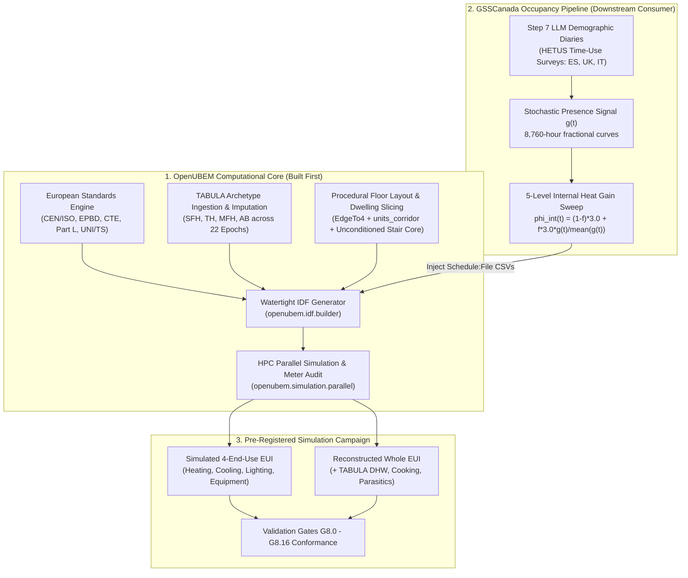
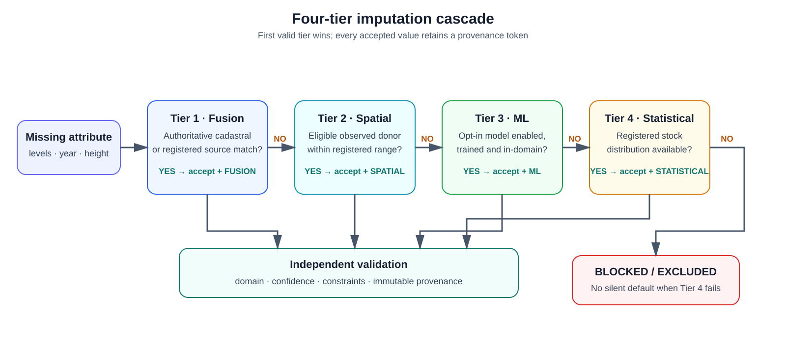
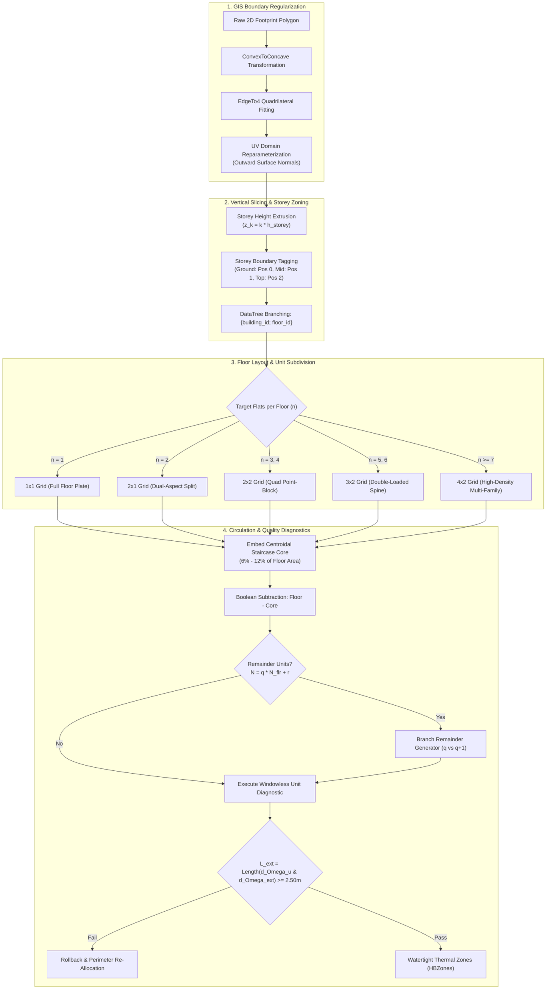
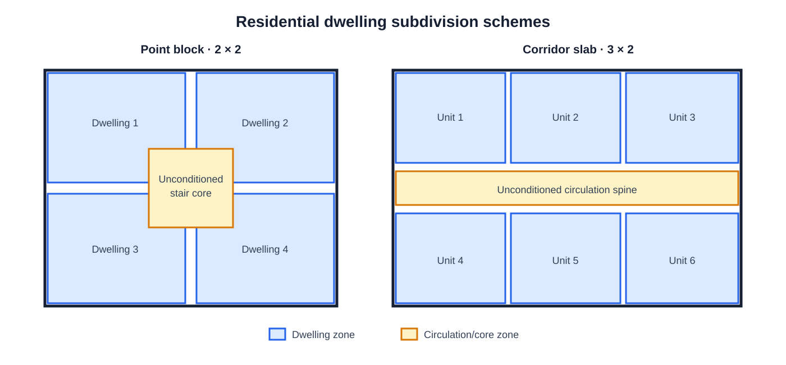
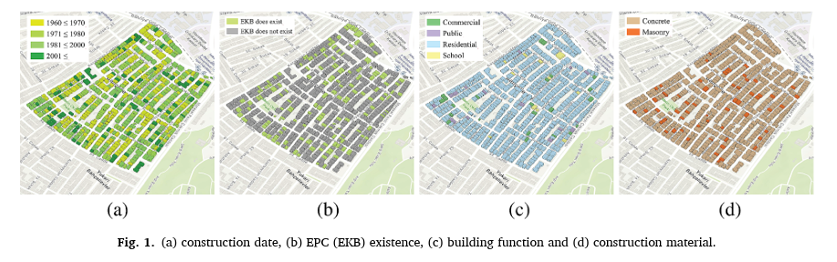
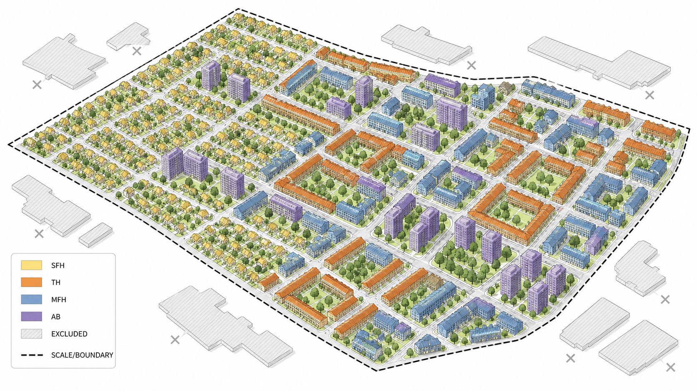

# OpenUBEM European Locations — MVP Implementation Specification
## Architectural Integration of European Standards, Building Typologies, Procedural Floor Layouts, and BEM Simulation Coupling with GSSCanada

- **Document Version**: `1.0.0-PROD`
- **Target Subsystem**: `openubem.data`, `openubem.geometry`, `openubem.idf`, `openubem.semantic`, `openubem.simulation`
- **Location in Repo**: [`docs/docs_ACTIVE/europeanLocations/MVP_european_locations.md`](file:///C:/Users/o_iseri/Desktop/OpenUBEM/docs/docs_ACTIVE/europeanLocations/MVP_european_locations.md)
- **Sister Walkthrough**: [`docs/docs_ACTIVE/europeanLocations/WALKTHROUGH_european_locations.md`](file:///C:/Users/o_iseri/Desktop/OpenUBEM/docs/docs_ACTIVE/europeanLocations/WALKTHROUGH_european_locations.md)
- **GSSCanada Reference**: [`C:\Users\o_iseri\Desktop\GSSCanada\GSSCanada-main\4J_docs_occ\Step8_docs\IMP_step8\4thJ_08_bemSimulation_IMP.md`](file:///C:/Users/o_iseri/Desktop/GSSCanada/GSSCanada-main/4J_docs_occ/Step8_docs/IMP_step8/4thJ_08_bemSimulation_IMP.md)
- **Scientific Provenance** — three distinct tiers, never conflated (citation rule fixed 2026-08-23):
  1. **Published paper**: *Iseri et al. (2025), Energy and Buildings 337, 115620* — supplies the method and the sample (593 residential buildings of 642; 6,458 dwelling units).
  2. **Raw dataset**: `IMP_step8/resources/AllV{1,2,3,4}_updated2023June.csv` — the simulation records behind the paper; recomputable quantities are cited here.
  3. **Derived re-analysis (2026-08-22)**: `IMP_step8/outputs/simulation_results_analysis_report.md`, `floor_layout_generation_report.md`, `kbem_ankara_report.md` — statistics computed from tier 2. **Not the published paper**; cite by filename, never as *Iseri et al. (2025)* alone.
- **Core OpenUBEM Docs**: [`OpenUBEM_fundamentals.md`](file:///C:/Users/o_iseri/Desktop/OpenUBEM/docs/docs_EXPLANATION/OpenUBEM_fundamentals.md), [`OpenUBEM_inputs_reference.md`](file:///C:/Users/o_iseri/Desktop/OpenUBEM/docs/docs_EXPLANATION/OpenUBEM_inputs_reference.md), [`OpenUBEM_imputation_methods.md`](file:///C:/Users/o_iseri/Desktop/OpenUBEM/docs/docs_EXPLANATION/OpenUBEM_imputation_methods.md), [`simulated_vs_reconstructed_methodology.md`](file:///C:/Users/o_iseri/Desktop/OpenUBEM/docs/docs_EXPLANATION/simulated_vs_reconstructed_methodology.md), [`OpenUBEM_debug_References.md`](file:///C:/Users/o_iseri/Desktop/OpenUBEM/docs/docs_EXPLANATION/OpenUBEM_debug_References.md)
- **Reusable Figure/Table Assets**: [`content/`](content/README.md)
- **Parent Step 8 Authorities (tier 1, read before implementing)**: `Step8_docs/4thJ_08_bemSimulation.md` (rulings, progress log), `Step8_docs/4thJ_08_bemSimulation_val.md` (G8/V8 contract, perturbation matrix), `Step8_docs/outputs_step8/archetype_parameter_provenance.md` (what TABULA gives and does not give; open decisions §6), and the existing parameter tables `Step8_docs/outputs_step8/archetype_parameters_{es,uk,it}.csv`. All paths are relative to `C:\Users\o_iseri\Desktop\GSSCanada\GSSCanada-main\4J_docs_occ\`.
- **Revision**: v1.3 (2026-08-23) — Section 11 adds a source-alignment addendum drawn from those tier-1 authorities. Nothing from v1.0–v1.2 was removed; earlier text that Section 11 supersedes is kept and marked in place.

> **Document role.** This MVP is the principal implementation specification. It owns scientific decisions, scope, interfaces, data contracts, algorithms, acceptance criteria, and the definition of done. The sister walkthrough owns ordered tasks, runnable commands, stop conditions, and the append-only progress log; it must link back here instead of creating a second scientific contract.

> **Implementation-status notice (v1.1 review, 2026-08-22).** The original v1.0 text below is retained in full for provenance. It describes the intended target architecture, not the current repository state. The authoritative, code-audited delta is in **Section 9**. Until the listed implementation and validation work is complete, examples and `[x] PASS`-style claims in the original text must be read as design intent, not evidence of an executed Step 8 campaign.
>
> **Speed/pre-occupant extension.** Section 10 adds the Speed HPC execution profiles and the required Q0–Q3 physics qualification sequence before any `f>0` occupant schedule is authorized.

> **Citation audit (v1.2, closed 2026-08-23).** Every numeric claim attributed to *Iseri et al. (2025)* in this document was searched in the published paper, in `IMP_step8/outputs/`, in `IMP_step8/DeepResearch/`, and in `IMP_step8/resources/`. **Nine attributions failed verification.** They were corrected under [`debugs/PLAN_citation-audit-fixes-2026-08-23.md`](debugs/PLAN_citation-audit-fixes-2026-08-23.md) (`CLOSED`; rulings in [`debugs/docs/DECISIONS_pending-rulings-2026-08-23.md`](debugs/docs/DECISIONS_pending-rulings-2026-08-23.md)). Consequences a reader must know:
> - **The Ankara sample is 593 buildings, not 277.** Section 4.7 no longer presents validation evidence; it presents a *provenance status*, with three quantities recomputed from the raw dataset and the rest marked `UNSOURCED`.
> - **The statistics `63.61 / 15.54 / 75.5% / 3.2×` are not in the published paper** — they come from the 2026-08-22 re-analysis and are cited to it. `75.5%` is a standard-deviation ratio, not a variance ratio.
> - **Anything marked `UNSOURCED` must not be quoted as evidence** in a paper, a report, or a downstream document until its source is named or it is measured anew through the `GEO-01`–`GEO-10` matrix in §4.8.
> - **Section 9.2 was re-verified true in full** against the repository and must not be edited without a fresh code audit.

> **Source-alignment addendum (v1.3, 2026-08-23).** Sections 1–10 were written before the parent Step 8 parameter tables and rulings were read in full. **Section 11** carries the facts from the tier-1 authorities that change how `EU-01`, `EU-03`, `EU-05`, `EU-06` and `EU-07` must be built:
> - the 102-archetype parameter tables **already exist** on the GSSCanada side (`outputs_step8/archetype_parameters_{es,uk,it}.csv`, 24/36/42 rows, 44 columns, with a provenance file and a re-derivation command) — `EU-01` consumes and reconciles them; it does not re-derive from the workbooks blind (§11.3);
> - **all 102 archetypes use the TABULA `EU.SUH`/`EU.MUH` boundary-condition set**, so `phi_int = 3.0 W/m²`, `n_air_use = 0.4 h⁻¹`, `c_m = 45 Wh/(m²·K)`, `θ_i = 20 °C` and the `F_red_htr` scalars are identical in every fold. The country-specific ventilation rates in §2.2.2 and walkthrough §5.4, and the country-specific `c_m` values in §2.3.2, are TABULA *national* rows that the active ruling (`FINDING 57`) deliberately does not use (§11.2);
> - the 22 construction-year bands are listed verbatim with their year boundaries (§11.4), and the Spanish label is `CTE-79`, not `NBE-CT-79`;
> - the three folds do **not** share one archetype structure (ES 24/24, GB 29/32 with parallel parameterisations, IT 42/48 with composite codes) and which row represents a cell is an **open** parent decision (§11.5);
> - the weather windows are **ruled** (`es` 2009–2010, `uk` 2014–2015, `it` 2013–2014) but **not acquired**, and no weather-driven number may be quoted until three named items are on disk (§11.6);
> - the full twelve-row G8 perturbation matrix and the seven V8 vacuity guards are itemised so the `EU-09` scorer can be written against them (§11.8).
>
> Where Section 11 and an earlier section disagree, **Section 11 governs**; the earlier text is retained for provenance and carries an inline `v1.3` note.

---

## 1. Executive Summary & Strategic Rationale

### 1.1 Why OpenUBEM Must Be Built and Adapted *Before* GSSCanada BEM Simulations

A foundational principle governs this integration: **OpenUBEM is the physical foundation and computational simulation engine; GSSCanada is the demographic occupancy schedule provider.** 



*Figure 1. OpenUBEM provides the European physical model and GSSCanada provides held-out occupant-presence inputs; both meet at the versioned campaign-cell interface before independent validation. Reusable source: [`content/figure_1_1_integration_pipeline.mmd`](content/figure_1_1_integration_pipeline.mmd).*

Attempting to run GSSCanada European BEM simulations without first establishing European physics, building stock definitions, and procedural layout geometry within OpenUBEM results in complete methodological collapse for four fundamental reasons:

1. **Thermodynamic Distortion of North American Defaults**: OpenUBEM's baseline configuration references North American commercial and multi-family standards (ASHRAE Standard 90.1, DOE Prototypes, IECC). US construction defaults feature lightweight wood-stud and steel-frame assemblies with negligible thermal mass, forced-air packaged DX cooling/heating, and commercial continuous ventilation rates ($0.8\text{--}1.5\text{ ACH}$). Injecting European demographic occupancy profiles into lightweight US structures causes severe, non-physical indoor temperature spikes, because the structural thermal capacitance ($c_m$) that buffers real European masonry buildings is completely absent. This capacitance argument is qualitative here; no quantified US-versus-European construction penalty has been sourced for this arc. The separate, sourced quantity is the *zoning-resolution* effect: annual space-heating demand shifts by $12\%\text{--}35\%$ between single-zone and unit-level models (`IMP_step8/DeepResearch/DR03_thermal_zoning_resolution_and_energy_impacts.md`, §Summary). The two effects must not be conflated.
2. **Spatial Topology & Inter-Dwelling Heat Transfer**: European residential stocks (especially Multi-Family Houses `MFH` and Apartment Blocks `AB`) consist of compartmentalized dwelling units arranged around central unconditioned staircase cores. Empirical research across **6,458 dwelling units in 593 residential buildings** (*Iseri et al., 2025*; the paper states 593 residential buildings of 642 in the study area) shows that coarse building-level modeling **suppresses $>75.5\%$ of the inter-dwelling energy standard deviation** (standard deviation drops from $63.61$ to $15.54\text{ kWh}/\text{m}^2\text{a}$) and underestimates extreme thermal vulnerability by a factor of $3.2\times$. Those four statistics are **not printed in the published paper**; they are computed in the 2026-08-22 re-analysis of the paper's own simulation data (`IMP_step8/outputs/simulation_results_analysis_report.md`, lines 24–29, from `resources/AllV{1,2,3,4}_updated2023June.csv`) and must be cited to that report. Note also that $75.5\%$ is a *standard-deviation* ratio, not a variance ratio; the same data expressed as variance give $\approx 94\%$. Modeling a whole floor as a single lumped zone erases party-wall conduction between adjacent flats — which accounts for $15\%\text{--}35\%$ of net heat loss **for corner and top-floor units adjacent to cooler or vacant dwellings** (`DR03`, row 4; the range is conditional on that adjacency and is not a whole-stock average) — and fails to capture the thermal buffering of unconditioned circulation spaces ($b_u = 0.50\text{--}0.80$).
3. **Strict Separation of Concerns (Engine vs. Domain Scenario)**: OpenUBEM is designed as a reusable, reproducible, pip-installable Python package (`openubem`). GSSCanada Step 8 is a scientific scenario driver that tests demographic hypotheses on European housing. Building the geometry generators, TABULA construction translators, and schedule ingestion hooks inside `openubem` ensures that OpenUBEM remains a general-purpose Urban Building Energy Modeling framework, while GSSCanada simply orchestrates campaign sweeps via clean API calls.
4. **Pre-Registered Validation Gate Compliance**: The 4J HETUS Step 8 pre-registered protocol mandates strict validation gates (Gate **G8.0** uninjected control at $f=0.00$, Gate **G8.8** scenario differentiation, Gate **G8.13** `Interpolate to Timestep = No` on `Schedule:File` objects, and Gate **G8.10** meter energy balance). These gates require low-level structural assertions in OpenUBEM's IDF builder, EnergyPlus output dictionary parser, and manifest logger.

---

## 2. European Building Standards & Energy Physics Framework

### 2.1 Pan-European Normative Stack (CEN / ISO / EPBD)

OpenUBEM's European engine parameterizes building physics in strict compliance with the European Committee for Standardization (CEN) and International Organization for Standardization (ISO) standards hierarchy:

| Standard / directive | Scope and implementation role |
|---|---|
| EPBD (EU) 2024/1275 | European energy-performance framework; the applicable national implementation remains authoritative. |
| EN ISO 52016-1:2017 | Hourly heating/cooling needs and zone heat-balance framework. |
| EN 16798-1:2019 | Indoor-environment input parameters and comfort categories. |
| EN 410 / EN 673 | Glazing solar and thermal properties, including $g_{gl}$ and $U_w$. |
| ISO 18523-2:2018 | Residential usage schedules as a contextual reference; it does not replace held-out Step 7 diaries. |
| TABULA / EPISCOPE | Residential typology structure and national example-building data. The ES/GB/IT occupant campaign has 102 target records; France is included in the physical-model branch and deferred only for occupant schedules. |

*Table 1. Normative sources used to define or contextualize European residential model inputs. Machine-readable copy: [`content/table_2_1_normative_stack.csv`](content/table_2_1_normative_stack.csv).*

### 2.2 Country-Specific Statutory Codes & Archetype Crosswalk

Spain, England-limited `GB`, and Italy form the current **occupant-schedule** campaign. France is in scope now for residential stock preparation, neighbourhood generation, geometry/IDF construction, weather preparation, and baseline physical simulation. France-specific occupant schedules and the five-level occupant-effect sweep remain future work, so France does not yet change the frozen ES/GB/IT occupant counts or 510-run total.

| Dimension | Spain (`ES`) | England-limited stock (`GB`) | Italy (`IT`) | France (`FR`) — physical now / occupants later |
|---|---|---|---|---|
| Building/neighbourhood pipeline | `IN_SCOPE` | `IN_SCOPE` | `IN_SCOPE` | `IN_SCOPE` |
| Baseline physical simulation | `IN_SCOPE` | `IN_SCOPE` | `IN_SCOPE` | `IN_SCOPE_AFTER_FR_REGISTRY_AUDIT` |
| Occupant-schedule sweep | `IN_SCOPE` | `IN_SCOPE` | `IN_SCOPE` | `FUTURE_SCOPE` |
| Primary new-build code | CTE DB-HE | Building Regulations Part L | DM 26/06/2015 | RE2020 |
| Regulatory calculation context | HULC | SAP | UNI/TS 11300 | Th-BCE 2020 |
| Existing-home energy record | CEE/EPC | EPC | APE | DPE |
| Campaign archetype count | 24 | 36 | 42 | `NOT_AUDITED` |
| Weather and diary alignment | Required and unresolved until manifest acceptance | Required and unresolved until manifest acceptance | Required and unresolved until manifest acceptance | `NOT_SELECTED` |
| Effect on occupant-campaign totals | Included in 102/510 | Included in 102/510 | Included in 102/510 | No effect on 102/510 until French occupant inputs are approved |

*Table 2. Regulatory and campaign-scope crosswalk. France is included in the physical building/neighbourhood pipeline; only its occupant-schedule sweep is deferred. Regulatory values remain candidates until the France registry and parameter provenance pass acceptance. Sources: [French RE2020 consolidated texts](https://rt-re-batiment.developpement-durable.gouv.fr/textes-de-la-re2020-en-version-consolidee-a617.html?lang=fr), [Th-BCE 2020 engine](https://rt-re-batiment.developpement-durable.gouv.fr/gestion-des-versions-du-rsee-et-du-moteur-de-a688.html?lang=fr), [French DPE](https://www.ecologie.gouv.fr/politiques-publiques/diagnostic-performance-energetique-dpe), and [TABULA France country page](https://episcope.eu/building-typology/country/fr/). Machine-readable copy: [`content/table_2_2_country_crosswalk.csv`](content/table_2_2_country_crosswalk.csv).*

#### 2.2.1 France Physical-Pipeline Gate (`FR-PHYS`) and Occupant Deferral (`FR-OCC-FUTURE`)

France proceeds now through acquisition, residential filtering, semantic mapping, procedural layouts, envelope/HVAC/weather preparation, saved-IDF audits, and baseline physical simulations. Before those baseline simulations are accepted, the France branch must reproduce an authoritative residential typology registry, define construction-period crosswalks, select baseline weather, validate national envelope/HVAC assumptions, and pass the same geometry, saved-IDF, meter, warning, and mutation gates. TABULA/EPISCOPE documents a French residential typology, and an EPISCOPE synthesis describes 26 French building families, but the exact production subset and count remain `NOT_AUDITED` for OpenUBEM.

The France occupant branch is separately labelled `FR-OCC-FUTURE`. It begins only when a France-compatible held-out diary/model source, leakage controls, fieldwork-aligned weather window, and schedule manifest are accepted. Until then, French baseline runs must use the controlled non-stochastic schedule path and must not be merged into the ES/GB/IT 510-case occupant-effect denominator.

#### 2.2.2 European Ventilation Rate Equivalence (EN 16798-1 Table B.4)
EN 16798-1 Table B.4 specifies baseline residential fresh air rates of $0.23\text{--}0.35\text{ L}/(\text{s}\cdot\text{m}^2)$ (approximately $0.30\text{--}0.60\text{ ACH}$). The country-specific values above are TABULA boundary-condition implementations of this range.

> [!IMPORTANT]
> **Campaign value (v1.3, 2026-08-23).** Every one of the 102 frozen archetypes points at the TABULA `EU.SUH` / `EU.MUH` boundary-condition rows, whose `n_air_use` is **$0.4\text{ h}^{-1}$ in all three folds** (§11.2; `4thJ_08_bemSimulation.md` lines 313–320). The country-specific rates $0.40 / 0.59 / 0.30\text{ h}^{-1}$ quoted for ES / GB / IT elsewhere in this arc are the TABULA *national* rows (`ES.SUH`, `GB.Gen`, `IT.SUH`). They are **not** the campaign values: the parent ruling keeps the EU set precisely because the national set adds a factor-two air-change difference that is country-correlated and therefore confounded with the held-out-fold signal. National rates may be run only as a separately declared sensitivity, never mixed into the 510-cell matrix.

#### 2.2.3 Intermittent Heating Reduction Factors ($F_{\text{red,htr}}$)
European standards apply intermittent heating correction as transmission multipliers on $UA$, not as thermostat night-setback schedules (TABULA `Tab.BoundaryCond`; EN ISO 13790:2008 Section 13.2):
- Single-Use Housing (`EU.SUH`): $F_{\text{red,htr1}} = 0.90$, $F_{\text{red,htr4}} = 0.80$
- Multi-Use Housing (`EU.MUH`): $F_{\text{red,htr1}} = 0.95$, $F_{\text{red,htr4}} = 0.85$

These are preserved as scalar transmission reductions in the campaign. **No scheduled thermostat night-setback is added**, to prevent confounding with the LLM-generated stochastic occupancy signal (Pre-Registered Ruling `D-S8-2`).

#### 2.2.4 Italian Area-Dependent Internal Gain Formula (UNI/TS 11300-1 Table 1)
While the campaign uses the harmonized TABULA $3.0\text{ W}/\text{m}^2$ baseline, the Italian national standard defines a more nuanced area-dependent formula:
$$\Phi_{\text{int}} = 4.0\text{ W}/\text{m}^2 \quad (A_{\text{floor}} \le 120\text{ m}^2); \qquad \Phi_{\text{int}} = 4.0 \cdot \left(\frac{120}{A_{\text{floor}}}\right)^{0.2}\text{ W}/\text{m}^2 \quad (A_{\text{floor}} > 120\text{ m}^2)$$
This is recorded as contextual information, not as the Step 8 campaign baseline.

#### 2.2.5 Overheating Assessment Standards
European residential overheating is assessed using the adaptive comfort model (EN 16798-1 Section 6.2, Annex A) and cumulative degree-hours above threshold ($IOD$). The UK additionally requires compliance with **CIBSE TM59 (2017)**:
- *Criterion A*: Living/bedrooms must not exceed $\Delta T \ge 1\text{ K}$ above the comfort limit for more than $3\%$ of occupied hours.
- *Criterion B*: Bedrooms must not exceed $26^\circ\text{C}$ for more than $32\text{ hours}$ between 22:00–07:00.

These criteria require hourly zone-level operative temperatures, which are available from the EnergyPlus dwelling-level output.

### 2.3 Physical Parameter Ingestion & Translation

#### 2.3.1 Parametric Opaque Assembly Sizing (`openubem.idf.opaque_assembly`)
Unlike North American models with fixed nominal lumber or steel studs, European envelope retrofits and epoch standards vary widely in continuous insulation thickness. OpenUBEM sizes insulation dynamically:
$$d_{\text{ins}} = \lambda_{\text{ins}} \cdot \left(\frac{1}{U_{\text{target}}} - R_{\text{si}} - R_{\text{se}} - \sum_{j} \frac{d_j}{\lambda_j}\right)$$

Where standard European material thermal properties are applied:
- Outer clay brick masonry: $d = 0.20\text{ m}$, $\lambda = 0.79\text{ W}/(\text{m}\cdot\text{K})$, $\rho = 1800\text{ kg}/\text{m}^3$, $c_p = 1000\text{ J}/(\text{kg}\cdot\text{K})$
- Reinforced concrete panel: $d = 0.15\text{ m}$, $\lambda = 1.40\text{ W}/(\text{m}\cdot\text{K})$, $\rho = 2300\text{ kg}/\text{m}^3$, $c_p = 1000\text{ J}/(\text{kg}\cdot\text{K})$
- Expanded Polystyrene (EPS) insulation: $\lambda_{\text{ins}} = 0.038\text{ W}/(\text{m}\cdot\text{K})$, $\rho = 25\text{ kg}/\text{m}^3$, $c_p = 1400\text{ J}/(\text{kg}\cdot\text{K})$
- Interior gypsum plaster: $d = 0.015\text{ m}$, $\lambda = 0.25\text{ W}/(\text{m}\cdot\text{K})$, $\rho = 900\text{ kg}/\text{m}^3$, $c_p = 1000\text{ J}/(\text{kg}\cdot\text{K})$
- Surface resistances per EN ISO 6946: $R_{\text{si}} = 0.13\text{ m}^2\cdot\text{K}/\text{W}$ (horizontal heat flow, walls), $R_{\text{se}} = 0.04\text{ m}^2\cdot\text{K}/\text{W}$ (external).

#### 2.3.2 Explicit Internal Thermal Mass Injection (`openubem.idf.builder`)
To prevent numerical instability, realistic European thermal inertia must be embedded. In accordance with EN ISO 52016-1 Table B.14 (five standard classes: Very Light $80\text{ kJ}/(\text{m}^2\cdot\text{K})$ / $14\text{ Wh}$, Light $110 / 28$, Medium $165 / 45$, Heavy $260 / 78\text{--}87$, Very Heavy $370 / 105\text{ Wh}/(\text{m}^2\cdot\text{K})$), OpenUBEM injects `InternalMass` objects into every dwelling zone:
- Mass surface area: $A_{\text{mass}} = 1.5 \times A_{\text{floor}}$
- Mass material thickness: $d_{\text{mass}} = 0.10\text{ m}$ (representing interior brick partition / concrete slab)
- Thermal capacitance calibration (project values mapped from Table B.14 classes):
  - Standard European Medium/Heavy: $c_m = 45.0\text{ Wh}/(\text{m}^2\cdot\text{K})$ — Medium class
  - Spain / Central Europe Heavy: $c_m = 50.0\text{ Wh}/(\text{m}^2\cdot\text{K})$ — between Medium and Heavy
  - Italy Very Heavy (`IT`): $c_m = 87.0\text{ Wh}/(\text{m}^2\cdot\text{K})$ — Heavy class upper bound
  - UK Medium-Light (`GB`): $c_m = 32.8\text{ Wh}/(\text{m}^2\cdot\text{K})$ — between Light and Medium

> [!NOTE]
> The country-specific $c_m$ values are project mapping decisions from the five EN ISO 52016-1 classes, not exact Table B.14 entries. Their provenance must be recorded alongside the archetype parameters.

> [!IMPORTANT]
> **Campaign value (v1.3, 2026-08-23).** On the `EU.SUH` / `EU.MUH` boundary conditions that all 102 archetypes use, **$c_m = 45\text{ Wh}/(\text{m}^2\cdot\text{K})$ in all three folds** (§11.2). The `GB` $32.8$ and `IT` $87$ values above coincide with TABULA's national rows (`GB.Gen` $32.79$, `IT.SUH` $87$), which the active ruling (`FINDING 57`) deliberately does not use, and the `ES` $50$ value does not match the `ES.SUH` row ($45$) that the parent table lists — its origin is not a TABULA boundary-condition row and must be declared. Ruling Q5-A (2026-08-23) left this subsection standing as a declared mapping decision; `EU-03` must realise the **EU** value of $45$ for every campaign cell unless a separate sensitivity is approved and recorded. How $45\text{ Wh}/(\text{m}^2\cdot\text{K})$ is reproduced with real material layers is parent open decision §6 item 3 (§11.9) — the inverse problem has many answers and the chosen one must be declared.

#### 2.3.3 Fenestration & Total Solar Energy Transmittance (`openubem.idf.surfaces`)
European fenestration standards specify total solar energy transmittance ($g_{\text{gl}}$ per EN 410 / ISO 9050) rather than North American Solar Heat Gain Coefficient ($\text{SHGC}$). In EnergyPlus, `WindowMaterial:SimpleGlazingSystem` is parameterized:
$$\text{SHGC} = g_{\text{gl}}, \quad U_{\text{factor}} = U_w$$
The conversion is valid within $\pm 0.02$ for standard residential glazing types. Typical European ranges: standard double clear $g_{\text{gl}} = 0.67\text{--}0.75$; low-emissivity $g_{\text{gl}} = 0.50\text{--}0.60$ (per EN 410:2011).

---

## 3. European Building Typologies & Data Ingestion

### 3.1 TABULA Building Type Hierarchy

OpenUBEM ingests four standard residential typologies defined in the TABULA / EPISCOPE framework:

| Typology | Building type | Typical storeys | Target dwelling layout |
|---|---|---:|---|
| `SFH` | Single-family house | 1–2 | One dwelling zone per storey, with the vertical aggregation rule declared. |
| `TH` | Terraced house | 2–3 | One dwelling zone per storey plus paired party walls. |
| `MFH` | Multi-family house | 3–5 | Two to four dwellings per storey plus circulation core. |
| `AB` | Apartment block | 4–10+ | Four to eight or more dwellings per storey plus corridor/core. |

*Table 3. Residential typology taxonomy used for ES, GB, IT, and the France physical-model branch. National sources determine the actual period/type combinations; this generic table does not establish country counts. Machine-readable copy: [`content/table_3_1_typology_taxonomy.csv`](content/table_3_1_typology_taxonomy.csv).*

### 3.2 Four-Tier Imputation Cascade for European Footprints

When querying European OpenStreetMap footprints or municipal geospatial portals (e.g. Spanish Catastro, UK Ordnance Survey, Italian Agenzia delle Entrate), missing data attributes are resolved via OpenUBEM's **Four-Tier Imputation Cascade** ([`OpenUBEM_imputation_methods.md`](file:///C:/Users/o_iseri/Desktop/OpenUBEM/docs/docs_EXPLANATION/OpenUBEM_imputation_methods.md)):



*Figure 2. Four-tier imputation cascade. Tiers execute in the current router order—fusion, spatial, opt-in ML, then statistical—and every accepted value is independently checked and labelled with provenance. Failure of all tiers is `BLOCKED/EXCLUDED`, never a silent default. Reusable sources: [`SVG`](content/figure_3_2_imputation_cascade.svg) and [`Mermaid`](content/figure_3_2_imputation_cascade.mmd).*

#### Strict Imputation Rules:
- **Zero Fitted Parameters Rule**: Imputation never invents parameters or adjusts coefficients to match an energy target.
- **Minimum Ceiling Height Floor**: All heights are constrained to $h_{\text{min}} \ge 2.10\text{ m}$ per international building code requirements.
- **Full Traceability**: Every imputed property carries an immutable provenance token (e.g., `HOTDECK_NEIGHBOR_HIGH`, `STATISTICAL_PDE`).

---

## 4. Procedural Floor Layout & Dwelling Slicing Engine

### 4.1 Algorithmic Geometry Pipeline (from *Iseri et al., 2025* & `kbem_ankara_pipeline.py`)

OpenUBEM's `openubem.geometry.layoutGenerator` implements the 4-stage procedural spatial layout algorithm:



*Figure 3. Procedural geometry pipeline from validated residential footprint to watertight dwelling/core zones. Reusable source: [`content/figure_4_1_geometry_pipeline.mmd`](content/figure_4_1_geometry_pipeline.mmd).*

### 4.2 Slicing Rules & Orthogonal Grid Subdivision



*Figure 4. Conceptual dwelling subdivision schemes. These diagrams express topology, not surveyed room plans; acceptance depends on the tests in Section 4.8. Reusable source: [`content/figure_4_2_dwelling_layout_schemes.svg`](content/figure_4_2_dwelling_layout_schemes.svg).*

#### Grid Assignment Rules:
- **$1 \times 1$ Grid**: Single-Family (`SFH`) / Terraced (`TH`) — 1 thermal zone per floor.
- **$2 \times 1$ Grid**: Small Multi-Family — 2 dual-aspect dwelling units per floor.
- **$2 \times 2$ Grid**: Point-Block `MFH` — 4 corner quadrant dwelling units surrounding a centroidal stairwell core.
- **$3 \times 2$ Grid**: Medium Apartment Block `AB` — 6 dwelling units (4 corner dual-aspect + 2 middle single-aspect) along a central corridor.
- **$4 \times 2$ Grid**: Large Apartment Block `AB` — 8 dwelling units along a central double-loaded circulation spine.

### 4.3 Unconditioned Staircase Core & Buffer Zone Physics

Communal circulation spaces (staircase, elevator shaft, entry vestibule) represent $6\%\text{--}12\%$ of gross floor area ($12.0\text{--}25.0\text{ m}^2$ per floor; mean $18.4\text{ m}^2$ in the Ankara validation dataset).
- **Zoning Classification**: OpenUBEM models the staircase core as an **explicit unconditioned thermal zone** (`mode: "unconditioned_buffer"`).
- **Thermal Behavior**: The staircase zone floats passively ($12.0^\circ\text{C}\text{--}16.0^\circ\text{C}$ in winter), buffering heat transfer across party walls between heated apartments and the exterior:
  $$b_u = \frac{T_i - T_u}{T_i - T_e} \approx 0.50\text{ to }0.80$$
  The magnitude of this buffering is `UNSOURCED` as previously stated: "reduces adjacent dwelling heating demand by $8\%\text{--}15\%$ (*Iseri et al., 2025*)" cannot be verified — the paper's extracted text contains neither the word "stair" nor "buffer" and no such percentage (verified 2026-08-23). The nearest sourced quantity is different in kind: the unconditioned stair core moderates **party-wall transmission losses** by $30\%\text{--}50\%$ at $b_u = 0.50\text{--}0.80$ (`IMP_step8/DeepResearch/DR07_adapting_openubem_to_european_standards.md`, row 8; `IMP_step8/outputs/floor_layout_generation_report.md:299`). Use the sourced transmission figure, and do not restate an adjacent-dwelling demand reduction until it is measured for the European stock.
- **Infiltration Rate**: Staircase zones are assigned a background infiltration rate of $0.000500\text{ m}^3/(\text{s}\cdot\text{m}^2)$ representing natural air leakage through entry doors and service risers.
- **Inter-Zone Surfaces**: Walls separating dwellings from the staircase core are assigned EnergyPlus boundary condition `Surface` linked to the adjacent stair zone.
- **Party-Wall Heat Transfer**: Inter-dwelling conduction through shared walls accounts for $15\%\text{--}40\%$ of net apartment heat loss during unheated or lower-setpoint periods in adjacent flats:
  $$Q_{\text{party}} = U_{\text{party}} \cdot A_{\text{party}} \cdot \left(T_{u1}(t) - T_{u2}(t)\right)$$

### 4.4 Habitability & Windowless Unit Sanity Gate

To ensure that automated polygon slicing never generates illegal, interior-enclosed dwelling units without exterior access, OpenUBEM enforces the **Windowless Unit Diagnostic Gate**:
$$L_{\text{exterior}} = \text{Length}\left(\partial \Omega_u \cap \partial \Omega_{\text{exterior}}\right) \ge 2.50\text{ m}$$

If any generated dwelling unit has $L_{\text{exterior}} < 2.50\text{ m}$, the layout generator rejects the invalid cut and falls back to a conforming single-loaded or dual-aspect subdivision.

### 4.5 Non-Integer Unit Remainder Stratification

When cadastral records specify a total building unit count $N_{\text{units}}$ that is not divisible by storeys $N_{\text{floors}}$:
$$N_{\text{units}} = q \cdot N_{\text{floors}} + r, \quad \text{where } q = \lfloor N_{\text{units}} / N_{\text{floors}} \rfloor, \quad 0 \le r < N_{\text{floors}}$$
- $N_{\text{floors}} - r$ storeys are partitioned into $q$ units/floor.
- $r$ storeys (typically lower floors) are partitioned into $q + 1$ units/floor.

### 4.6 Geometry Fallback Hierarchy

When a footprint is too narrow, irregular, or degenerate for the target grid, the layout generator applies a deterministic fallback hierarchy:
1. Attempt the assigned grid ($2\times 2$, $3\times 2$, etc.)
2. If failed → fall back to the next smaller grid ($2\times 2 \to 2\times 1$)
3. If still failed → fall back to $1\times 1$ (full floor plate as single zone)

Every fallback is recorded with an explicit reason token (e.g., `NARROW_FOOTPRINT`, `DEGENERATE_SHAPE`). Fallback must never masquerade as dwelling-level success.

### 4.7 Ankara KBEM Reference Statistics — Provenance Status

> [!WARNING]
> **Provenance verification and recomputation, 2026-08-23.** The figures previously listed in this section as
> validation evidence were searched across the published paper (`IMP_step8/resources/1-s2.0-S0378778825003500-main.pdf`),
> `IMP_step8/outputs/*.md`, `IMP_step8/DeepResearch/*.md`, `IMP_step8/4thJ_08_bemSimulation_IMP.md`, and raw data
> (`IMP_step8/resources/AllV{1,2,3,4}_updated2023June.csv`).
> Quantities recomputable from the raw simulation data have been replaced with verified values; unrecoverable geometry pipeline diagnostics remain marked `UNSOURCED`.

Reference statistics associated with the Ankara KBEM dataset (*Iseri et al., 2025* and raw simulation dataset `IMP_step8/resources/AllV*.csv`):

- **Sample** — `SOURCED`: **593 residential buildings** of 642 buildings in the study area,
  **6,458 dwelling units** (paper, Section "simulation process includes detailed modelling and
  analysis of the residential buildings"; corroborated at `IMP_step8/outputs/kbem_ankara_report.md:5`
  and `:377`, and recomputed identically across `IMP_step8/resources/AllV{1,2,3,4}_updated2023June.csv`).
  The previously asserted figures of "277 buildings processed" and "1,444 floors" are contradicted
  by the raw data and the paper.
- **Dwelling floor area** — `SOURCED` (recomputed from raw data): **Mean dwelling floor area $109.11\text{ m}^2$**
  (range: **$18.70\text{--}434.80\text{ m}^2$**) recomputed directly across all 6,458 records in
  `IMP_step8/resources/AllV*.csv`. The previously stated figures of "$87.3\text{ m}^2$ (range: $32\text{--}215\text{ m}^2$)"
  were not merely uncited but positively contradicted by the genuine dataset.
- **Vertical positions** — `SOURCED` (recomputed from raw data): 3 distinct vertical positions across the
  6,458 dwelling units (**1,667 ground-floor**, **3,450 middle-floor**, **1,341 top-floor** units)
  in `IMP_step8/resources/AllV*.csv`.
- **Success rate** — `UNSOURCED`: the claim "252/277 buildings (91.7%) successfully subdivided into
  dwelling-level zones" has no recoverable source in the simulation results or paper. Target behavior must
  be benchmarked via the European `GEO-01`–`GEO-10` matrix (§4.8).
- **Fallback rate** — `UNSOURCED`: the claim "25 buildings (8.3%) fell back to single-zone-per-floor
  (causes: narrow footprints $<8\text{ m}$ width, L-shaped/highly irregular shapes)" has no source.
  The failure *causes* remain a plausible engineering statement; only the counts are unverified.
- **Area conservation** — `UNSOURCED` as a measured result: "$\le 0.5\%$ error for all successful
  subdivisions; zero overlaps detected" is not reported in any pipeline log. The formal requirement is
  governed by Section 9.8 (acceptance tolerance $\le 1\%$, verified by `GEO-01`).
- **Facade contact** — `UNSOURCED` as a measured result: "All dwelling units passed the
  $2.50\text{ m}$ exterior threshold" is not an observed outcome but a declared project modeling
  rule (see the note below).

Every line marked `UNSOURCED` above cannot be recovered from the Ankara dataset and must be measured
anew through the European `GEO-01`–`GEO-10` verification matrix in Section 4.8 before being cited as
validation evidence.

> [!NOTE]
> The $2.50\text{ m}$ facade-contact threshold originates from IRC Section R303 and Turkish Zoning Law. It is treated as a declared project modeling rule whose jurisdictional provenance must be confirmed for each European stock (see Section 9.8).

### 4.8 Verification Protocol and Grasshopper Parity Tasks

Grasshopper is an independent geometric reference, not the acceptance authority. A normalized exchange format—GeoJSON or WKT in a pinned projected CRS—must allow the Grasshopper definition and `openubem.geometry.layoutGenerator` to process the same input footprints. The comparison ignores object ordering and compares topology, zone count, areas, exterior contact, circulation area, and adjacency.

| Test | Fixture/sample | Required assertion | Independent comparison or mutation | Acceptance |
|---|---|---|---|---|
| `GEO-01` | Axis-aligned rectangle | Area conservation and expected dwelling count | Independent polygon union | Error $\le 1\%$; no gaps/overlaps |
| `GEO-02` | Rotated rectangle | Orientation invariance | Rotate input and inverse-transform output | Same topology and areas within tolerance |
| `GEO-03` | L-shaped footprint | Valid non-convex subdivision | Python vs. Grasshopper export | All zones valid or explicit fallback |
| `GEO-04` | Narrow footprint | Deterministic fallback | Sweep width across the registered threshold | Stable reason token; no false success |
| `GEO-05` | Courtyard footprint | Hole preservation | Independent topology audit | No dwelling/core crosses the courtyard |
| `GEO-06` | MFH/AB storey stacks | Reciprocal interzone surfaces | Reopen saved IDF | Exactly one mate for every party face |
| `GEO-07` | Non-integer dwelling count | Remainder allocation | Independent quotient/remainder calculation | Exact total and deterministic storey assignment |
| `GEO-08` | Grasshopper golden set | Cross-implementation parity | Normalize and compare both exports | Equal zone count; area/contact within tolerance |
| `GEO-09` | Corrupted clean fixture | Gate sensitivity | Inject overlap, gap, and unpaired face | Named gate fails; restored fixture passes |
| `GEO-10` | Residential sample groups | Scale/stability | Run 4, 12, 32, then 96 buildings | Every attempted building accounted for before neighbourhood scale |

*Table 4. Verification matrix for the procedural floor-layout method, including independent Grasshopper parity and negative controls. Machine-readable copy: [`content/table_4_8_geometry_verification_matrix.csv`](content/table_4_8_geometry_verification_matrix.csv).*

Each `GEO-*` task must retain the input footprint, generator configuration, normalized Grasshopper export, normalized OpenUBEM export, comparison report, preview image, and test command. Visual similarity alone is not a pass; numerical and topological assertions decide acceptance.

---

## 5. Stochastic Occupancy Injection & 5-Level Sensitivity Sweep

### 5.1 Mathematical Ingestion Formulation

The occupancy-driven internal gain schedule $\phi_{\text{int}}(t)$ is defined by the pre-registered five-level sensitivity sweep formula:
$$\phi_{\text{int}}(t) = (1 - f) \cdot 3.0 + f \cdot 3.0 \cdot \frac{g(t)}{\text{mean}_{8760}(g(t))}, \quad f \in \{0.00, 0.15, 0.30, 0.50, 1.00\}$$

| Level | Factor | Meaning | Campaign status |
|---:|---:|---|---|
| 1 | `0.00` | Flat $3.0\text{ W}/\text{m}^2$ control through the final `Schedule:File` path | Required |
| 2 | `0.15` | Mild modulation with annual-mean conservation | Required |
| 3 | `0.30` | Moderate modulation; not a privileged calibration level | Required |
| 4 | `0.50` | High modulation with annual-mean conservation | Required |
| 5 | `1.00` | Fully presence-shaped profile normalized to a $3.0\text{ W}/\text{m}^2$ annual mean | Required |

*Table 5. Five occupant-effect levels for the ES/GB/IT occupant campaign. France uses only the controlled baseline physical path until `FR-OCC-FUTURE` is activated. Machine-readable copy: [`content/table_5_1_sensitivity_sweep.csv`](content/table_5_1_sensitivity_sweep.csv).*

#### Fundamental Ingestion Theorems:
1. **Strict Energy Conservation**: $\int_0^{8760} \phi_{\text{int}}(t)\,dt = 3.0 \times 8760 = 26,280\text{ Wh}/\text{m}^2$ for all $f \in \{0.00, 0.15, 0.30, 0.50, 1.00\}$. All observed heating energy variations represent pure temporal load shifting.
2. **`Schedule:File` Ingestion Architecture**: The 8,760 hourly multipliers are written to external CSV files and referenced via EnergyPlus `Schedule:File` objects with `Interpolate to Timestep = No` (enforced per Gate **G8.13**).
3. **Inter-Household Heterogeneity**: In multi-dwelling archetypes (`MFH`, `AB`), each dwelling unit zone $u \in \{1, \dots, N_{\text{units}}\}$ receives an independently sampled demographic presence curve $g_u(t)$ from the held-out LOCO fold population.

### 5.2 HVAC Plant Modeling Decision (DR07)

Resolving full explicit EnergyPlus hydronic plant loops (boilers, pumps, valves, distribution piping) across 510 multi-zone models introduces severe numerical convergence failures. The campaign standardizes on `ZoneHVAC:IdealLoadsAirSystem` post-processed with natural gas condensing boiler seasonal efficiency curves ($\eta_{\text{seasonal}} = 0.90$, range $0.88\text{--}0.94$), which preserves identical envelope heat balance while achieving 100% convergence across the full campaign matrix.

### 5.3 Natural Ventilation Assumption

The European campaign maintains a closed-window assumption with continuous background infiltration per TABULA methodology ($n_{\text{air,use}} = 0.30\text{--}0.59\text{ ACH}$). Natural ventilation window opening is not modeled. This is consistent with the Ankara validation study (*Iseri et al., 2025*) and ensures that the only experimental variable is the occupancy-driven internal gain schedule.

> **v1.3 note.** The $0.30\text{--}0.59$ range spans the TABULA national rows. The campaign value is the EU boundary-condition rate, $n_{\text{air,use}} = 0.4\text{ h}^{-1}$ for every archetype in every fold (§2.2.2 note, §11.2). TABULA's workbook carries no window-opening behaviour at all (`archetype_parameter_provenance.md` §3 — the search terms `window open`, `thermostat`, `schedul`, `occupan` appear in no sheet header), so the closed-window assumption is not a simplification *of* TABULA; it is the only state TABULA describes.

---

## 6. Simulated vs. Reconstructed EUI Accounting

OpenUBEM enforces the **Simulated vs. Reconstructed EUI Accounting Methodology** ([`simulated_vs_reconstructed_methodology.md`](file:///C:/Users/o_iseri/Desktop/OpenUBEM/docs/docs_EXPLANATION/simulated_vs_reconstructed_methodology.md)):

```
+----------------------------------------------------------------------------------------------------+
|                                 EUI ACCOUNTING FRAMEWORK                                           |
+----------------------------------------------------------------------------------------------------+
| 1. Simulated EUI (EnergyPlus Physics Output):                                                     |
|    EUI_sim = Heating + Cooling + Lighting + Equipment (Plug Loads)                                 |
|    - Captures thermodynamic envelope heat balance, solar gains, and dynamic internal gains.        |
|                                                                                                    |
| 2. Reconstructed EUI (Whole-Building Energy Consumption):                                          |
|    EUI_reconstructed = EUI_sim + EUI_service_loads                                                 |
|    - Post-processed fraction-split completion adding unsimulated auxiliary loads:                 |
|      * Domestic Hot Water (DHW)                                                                    |
|      * Cooking & Kitchen Equipment                                                                 |
|      * HVAC Distribution Parasitics & Pumps                                                        |
|    - Calibrated using TABULA Table 4 national end-use share splits.                                |
+----------------------------------------------------------------------------------------------------+
```

*Figure 5. EUI accounting alternatives. Physical and reconstructed service-load paths are mutually exclusive for any case. Reusable source: [`content/figure_6_1_eui_accounting.mmd`](content/figure_6_1_eui_accounting.mmd).*

---

## 7. Pre-Registered Gate Conformance & Validation Architecture

Every European simulation executed by OpenUBEM is validated against the **Pre-Registered Gate Conformance Matrix**:

| Gate | Name | Minimum assertion | Current status |
|---|---|---|---|
| G8.0 | Uninjected control | Controls are independently audited before any non-zero release | `NOT_RUN` |
| G8.8 | Scenario differentiation | Registered outputs differ across $f$ levels | `NOT_RUN` |
| G8.9 | Stale-output guard | Any dependency change invalidates cache | `NOT_RUN` |
| G8.10 | Meter tripwire | Component energy reconciles to the selected total | `NOT_RUN` |
| G8.11 | Meter-name validity | Required meters exist and are parseable | `NOT_RUN` |
| G8.12 | Schedule ingestion | Saved IDF references the expected schedule/checksum | `NOT_RUN` |
| G8.13 | Interpolation setting | `Interpolate to Timestep = No` | `NOT_RUN` |
| G8.14 | Manifest completeness | Measured immutable manifest exists per case | `NOT_RUN` |
| G8.15 | Error/warning triage | No fatal/severe error; every warning is classified | `NOT_RUN` |
| G8.16 | Held-out-fold correctness | Country and schedule source satisfy the no-leakage rule | `NOT_RUN` |

*Table 6. Abbreviated Step 8 gate summary. These are test specifications, not passing results. Machine-readable copy: [`content/table_7_1_gate_summary.csv`](content/table_7_1_gate_summary.csv).*

### 7.1 Negative Control Diagnostic Thresholds (DR05 / DR07)

In addition to the gate matrix, the European campaign employs negative control thresholds to detect gross parameterization errors before the full campaign:

- **Reject** the European standards parameterization if $f=0.00$ uninjected control runs produce heating EUIs deviating by $>50\%$ from published TABULA national brochure benchmarks ($Q_H \approx 80\text{--}180\text{ kWh}/\text{m}^2\text{a}$).
- **Reject** the adapted OpenUBEM configuration if median EUI at $f=0.00$ differs from TABULA national baseline by $>25\%$ (DR07 negative control).
- **Reject** if pre-1945 uninsulated Spanish/Italian archetypes at $f=0.00$ yield space heating $< 50\text{ kWh}/\text{m}^2\text{a}$ (DR06 negative control).

These are diagnostic flags during Q1–Q2 qualification stages (Section 10), not calibration targets. The pipeline must never alter a TABULA parameter to make a pilot EUI appear more plausible.

---

## 8. Clean Repository Layout & Module Specifications

```
C:\Users\o_iseri\Desktop\OpenUBEM\
├── docs/
│   ├── docs_EXPLANATION/                <- Core Methodology & Reference Guides
│   │   ├── OpenUBEM_fundamentals.md
│   │   ├── OpenUBEM_inputs_reference.md
│   │   ├── OpenUBEM_imputation_methods.md
│   │   ├── simulated_vs_reconstructed_methodology.md
│   │   └── OpenUBEM_debug_References.md (~200 Error Patterns Registry)
│   └── docs_ACTIVE/
│       └── europeanLocations/           <- Active European Implementation & Walkthroughs
│           ├── MVP_european_locations.md (This Implementation Specification File)
│           └── WALKTHROUGH_european_locations.md (Operational Guide & Walkthrough)
└── openubem/
    ├── acquisition/
    │   ├── osm_fetcher.py               -> Ingests OSM European footprints & tags
    │   ├── overture_fetcher.py          -> Tier 1 height/levels fusion
    │   └── epw_manager.py               -> Handles Madrid, London, Bologna AMY weather files
    ├── data/
    │   ├── construction/
    │   │   ├── tabula_archetypes_es.json -> Spanish envelope assemblies & U-values
    │   │   ├── tabula_archetypes_uk.json -> UK Part L envelope assemblies & U-values
    │   │   └── tabula_archetypes_it.json -> Italian DM 26/06/2015 assemblies & U-values
    │   ├── loads/
    │   │   └── european_residential_loads.json -> 3.0 W/m² base internal load densities
    │   └── schedules/
    │       └── tabula_statutory_schedules.json -> Normative flat European schedules
    ├── geometry/
    │   ├── footprint.py                 -> Footprint cleaning, UTM reprojection, metrics
    │   ├── layoutGenerator.py           -> Procedural dwelling subdivision & unconditioned stair
    │   └── zoning.py                    -> Adaptive zoning strategy decision engine
    ├── idf/
    │   ├── builder.py                   -> Watertight IDF assembly & InternalMass injection
    │   ├── opaque_assembly.py           -> Parametric insulation thickness sizing from U-values
    │   ├── surfaces.py                  -> SimpleGlazingSystem total solar transmittance (g_gl)
    │   └── hvac.py                      -> Hydronic radiator convective plant / IdealLoads curves
    ├── semantic/
    │   ├── building_classifier.py       -> Maps OSM tags to TABULA archetypes (SFH, TH, MFH, AB)
    │   ├── construction_sets.py         -> Resolves vintage standards across 22 epochs
    │   ├── imputation.py                -> 4-tier zero-fitted imputation cascade
    │   └── schedules.py                 -> Schedule:File generation (Interpolate to Timestep = No)
    ├── simulation/
    │   ├── runner.py                    -> Local EnergyPlus execution & meter verification
    │   └── parallel.py                  -> SLURM cluster array runner for 510 campaign cells
    └── results/
        ├── service_loads.py             -> Fraction-split EUI completion (simulated vs reconstructed)
        └── carbon.py                    -> National grid carbon factors (ES, UK, IT)
```

---

## 9. v1.1 Code-Audited Implementation Addendum (Authoritative Delta)

### 9.1 Purpose, Vocabulary, and Source Precedence

This addendum turns the preceding target architecture into an implementable MVP contract while preserving the original proposal. The following status vocabulary is mandatory in issues, manifests, pull requests, and reports:

- **CURRENT**: present in the OpenUBEM repository and exercised by an existing test.
- **REUSABLE**: present, but requiring a European adapter or new configuration.
- **TARGET**: specified here but not yet implemented.
- **BLOCKED**: cannot be accepted until a named upstream artefact or decision exists.
- **VERIFIED**: supported by an artefact produced by an executed test or simulation; prose alone is not verification.

When two documents disagree, use this precedence order:

1. `Step8_docs/4thJ_08_bemSimulation.md` and `Step8_docs/4thJ_08_bemSimulation_val.md`, including their dated rulings;
2. measured repository code and tests at the commit recorded in the campaign manifest;
3. `IMP_step8/4thJ_08_bemSimulation_IMP.md`;
4. `IMP_step8/outputs/` and `IMP_step8/DeepResearch/` synthesis documents;
5. illustrative examples in Sections 1–8 above.

This ordering matters because some synthesis outputs predate later rulings. In particular, any document that reports **612 executions** or **510 injected runs plus 102 controls** is superseded by the active ruling that makes `f=0` the control endpoint of the five-level sweep.

### 9.2 Repository Baseline Audit (2026-08-22)

| Capability | Status | Evidence in OpenUBEM `0.1.0` | MVP delta |
|---|---|---|---|
| OSM acquisition and projected polygon cleaning | **CURRENT** | `openubem.acquisition.osm_fetcher.ingest_buildings` (`fetch_buildings` alias) | Add European test fixtures; do not create a second fetcher API. |
| Four-tier imputation router | **CURRENT/REUSABLE** | `openubem.semantic.imputation.impute_missing(gdf, cfg=None, targets=None, rng=None)` | Add country-aware donors/configuration; retain existing provenance column naming `provenance_<attribute>`. |
| Room-layout geometry | **CURRENT/REUSABLE** | `openubem.geometry.layoutGenerator.generate_layout(...)` | Existing specifications are DOE/IBC-based and recognize OpenUBEM archetype IDs such as `MidriseApartment`; add explicit TABULA residential module specifications and dwelling/core semantics. |
| IDF generation | **CURRENT/REUSABLE** | `openubem.idf.builder.BuildingIDF` and `run_step3(...)` | Extend the existing builder. The proposed `IDFModelBuilder` API in the walkthrough does not currently exist. |
| Opaque U-value realization | **CURRENT/REUSABLE** | `build_opaque_assembly(idf, name, u_value, thermal_mass)` | Current assembly is a generic `_K=0.12 W/m·K` resistance/mass representation, not the proposed brick–EPS–plaster construction. Add a traceable European construction path without regressing the CTF stability cap. |
| Schedule generation | **CURRENT, incompatible with Step 8** | `openubem.semantic.schedules` writes six DOE `Schedule:Compact` objects | Add an external-file schedule adapter and saved-IDF read-back. No current function writes the required Step 8 `Schedule:File`. |
| HVAC assignment | **CURRENT/REUSABLE** | `openubem.idf.hvac.assign_hvac` supports current OpenUBEM archetypes | Add and validate European residential systems. Do not describe hydronic radiators as implemented until emitted objects and meters are tested. |
| Simulation fan-out | **CURRENT/REUSABLE** | `openubem.simulation.parallel.run_neighbourhood` uses joblib and writes `04_simulation_manifest.parquet` | Add a campaign-cell wrapper and a separate SLURM submission script. `parallel.py` is not currently a SLURM array CLI. |
| Results reconstruction | **CURRENT, US-specific/default-off** | `openubem.results.service_loads.reconstruct_frame`; reconstruction is disabled by default because Phase E physically models five service loads | Add European coefficients only if the campaign explicitly chooses reconstruction mode; prevent double counting. The proposed `reconstruct_eui` function does not exist. |
| Step 8 gates | **TARGET** | Existing `compute_validation_gates` is CBECS-oriented, not a G8.0–G8.16 scorer | Implement a dedicated Step 8 scorer, mutation tests, and vacuity guards. No G8 gate is currently verified. |
| European TABULA files | **TARGET** | `tabula_archetypes_{es,gb,it,fr}.json`, `european_residential_loads.json`, and `tabula_statutory_schedules.json` are absent | Generate them from pinned TABULA sources, with row-level provenance and licence record; keep the FR physical registry separate from the 102-record occupant registry. |

*Table 7. Code-audited repository capability baseline at the stated review date. Machine-readable copy: [`content/table_9_2_repository_baseline.csv`](content/table_9_2_repository_baseline.csv).*

### 9.3 Frozen Scientific Decisions and Explicit Non-Decisions

The MVP must encode the following active decisions without silently substituting an earlier proposal:

| Topic | Frozen MVP contract |
|---|---|
| National populations | Spain (`es`), England-labelled TABULA stock (`gb`, while the survey fold may remain `uk`), and Italy (`it`). Do not describe TABULA `GB` as the whole United Kingdom without the England limitation. |
| France physical-model scope | France (`fr`) is included in residential acquisition, enrichment, layout, IDF, weather, and baseline physical-simulation work. Its registry count must be audited before any combined physical-baseline total is published. |
| France occupant scope | France-specific diaries, held-out-fold logic, and non-zero occupant schedules are `FUTURE_SCOPE`. French controlled baselines remain separate from the 102-archetype/510-run ES/GB/IT occupant campaign. |
| Archetype population | 24 ES + 36 GB + 42 IT = **102 archetypes**. Each country is simulated only with the model fold that held that country out. |
| Sensitivity grid | `f ∈ {0.00, 0.15, 0.30, 0.50, 1.00}`. Report every level; do not designate `f=0.30` as a primary or calibrated level. |
| Campaign size | **510 annual runs per weather specification**: 102 archetypes × 5 levels. `f=0` is included and must run/read first for each matching archetype/weather configuration. |
| Gain baseline | Use the TABULA EU boundary-condition baseline of exactly `3.0 W/m²` in all three folds. Italian `4.0 W/m²` is contextual information, not the Step 8 campaign baseline. |
| Conservation | Every valid `phi_int` series has annual mean `3.0 W/m²`, within a documented numerical tolerance. Differences across `f` redistribute gains in time; they do not change annual internal-gain energy. |
| Zoning | One thermal zone per dwelling. A dwelling may have a non-shoebox exterior geometry, but Step 7 provides `at_home` rather than room-level location, so the study makes no within-dwelling spatial claim. |
| Household assignment | Independent diary assignment per dwelling is a **target sampling rule** that must be seeded, recorded, and tested; it is not yet current OpenUBEM behavior. |
| Weather | Use actual meteorological weather covering each diary-survey fieldwork window. The location, exact twelve-month selection, source, licence, and checksum remain required acquisition records. Compare the `f` effect within fold; any absolute cross-fold comparison must name the meteorological year. |
| Heating intermittency | Preserve the TABULA reduction factor as a scalar. Do not add a thermostat night-setback schedule that would confound the occupancy treatment. |
| Geometry and constructions | Do not claim that TABULA supplies floor layouts, aspect ratio, orientation, window-to-face placement, or material layer build-ups. Those assumptions require separate provenance and sensitivity treatment. |

*Table 8. Frozen decisions and explicit non-decisions for the implementation. The France physical branch is current scope while the France occupant branch is deferred. Machine-readable copy: [`content/table_9_3_frozen_decisions.csv`](content/table_9_3_frozen_decisions.csv).*

### 9.4 Ownership and Boundary Contract

OpenUBEM owns reusable building-physics capabilities:

- TABULA parameter loading and schema validation;
- country/archetype translation into existing semantic rows;
- European construction, glazing, HVAC, and weather adapters;
- dwelling/core geometry and watertight IDF generation;
- generic external schedule-file emission and saved-IDF inspection;
- EnergyPlus execution, parsing, and low-level meter integrity.

GSSCanada owns experiment-specific information:

- held-out LOCO fold selection and Step 7 schedule provenance;
- diary chaining and household sampling rules;
- the five-level campaign matrix and run ordering;
- Step 8 `manifest.json`, gate scoring, mutation probes, and scientific reporting.

The coupling boundary is a versioned, immutable **campaign-cell specification**. OpenUBEM must not infer the held-out fold from the country filename, and GSSCanada must not reach into private OpenUBEM geometry or IDF internals to patch objects after generation.

### 9.5 Required Input Contracts

#### TABULA archetype record

Every one of the 102 records must include, at minimum:

```text
archetype_id, country_stock_code, survey_fold, construction_period,
building_type, source_workbook_sha256, source_sheet, source_row,
u_wall_w_m2k, u_roof_w_m2k, u_floor_w_m2k, u_window_w_m2k,
g_gl_window, n_air_use_h_1, phi_int_w_m2, c_m_wh_m2k,
f_red_htr, parameter_assumptions
```

Requirements:

- units are encoded in field names and checked at load time;
- source cells and transformations are recorded, not only the workbook name;
- refurbishment variants and unclassified rows are excluded with an explicit reason table;
- country stock code (`GB`) and survey fold (`uk`) are separate fields;
- missing values are never replaced by an energy-calibrated parameter.

> **v1.3 note.** The source of these records is the existing parent table `outputs_step8/archetype_parameters_{es,uk,it}.csv` (44 TABULA columns). The field-by-field crosswalk from those columns to the contract above is Table 14 in §11.3. Three contract fields — `n_air_use_h_1`, `c_m_wh_m2k`, `f_red_htr` — are **not** columns of that table; they are joined from `Tab.BoundaryCond` through the row's `Code_BoundaryCond` (`EU.SUH` or `EU.MUH`), and the loader must refuse any row whose pointer is not `EU.*`. `source_workbook_sha256` must be recorded for `tabula-calculator.xlsx` (MD5 `c99ddc9ffcb6dc0ae7391273d9619e37` is the pinned digest on the parent side; compute and record SHA-256 alongside it rather than replacing it).

#### Step 7 presence-series record

Each `g(t)` artefact must carry:

```text
schedule_id, schedule_path, schedule_sha256, fold, held_out_country,
diary_source_id, chaining_rule, timezone, local_time_basis,
n_hours, start_timestamp, end_timestamp, random_seed
```

The adapter must reject a series when it contains non-finite or negative values, has `mean(g) <= 0`, has a length inconsistent with the selected EnergyPlus run period, or names the wrong held-out fold. Daylight-saving and leap-hour treatment must be resolved once in the campaign builder and recorded; silent truncation or duplication is forbidden.

#### Weather record

Each EPW/AMY record must include location, covered dates, source URL or archive identifier, licence, acquisition date, SHA-256, parsed EPW location, and the rule connecting its period to the diary fieldwork window. OpenUBEM's builder already fails if `epw_path` is missing and populates `Site:Location` from the file; the European adapter must retain that fail-fast behavior.

### 9.6 Campaign-Cell and Manifest Contract

A deterministic cell identifier should be constructed from normalized dimensions, for example:

```text
<country_stock_code>__<archetype_id>__<weather_id>__f<000|015|030|050|100>
```

Each cell manifest must be written atomically and include at least:

```json
{
  "schema_version": "step8-cell-manifest/1.0",
  "cell_id": "GB__GB.ENG.MFH.05__uk_amy_2014_2015__f030",
  "archetype_id": "GB.ENG.MFH.05",
  "country_stock_code": "GB",
  "held_out_country": "uk",
  "fold": "uk_held_out",
  "sensitivity_f": 0.30,
  "schedule_source_sha256": "<measured>",
  "schedule_emitted_sha256": "<measured>",
  "idf_sha256": "<measured>",
  "weather_sha256": "<measured>",
  "openubem_version": "0.1.0",
  "openubem_git_commit": "<measured>",
  "energyplus_version": "<measured>",
  "energyplus_build_hash": "<measured>",
  "platform": "<measured-at-runtime>",
  "random_seed": 42,
  "created_utc": "<measured>",
  "status": "planned|running|success|failed"
}
```

Checksums must be computed from files on disk. A cache hit is valid only when a dependency digest covering the IDF, emitted schedule, weather, engine build, adapter configuration, and relevant source commit is unchanged. The existing OpenUBEM `is_completed()` check based only on `.end` and `.sql` is insufficient for G8.9 and must be wrapped rather than weakened.

### 9.7 Implementation Work Packages

| WP | Execution status (2026-08-23) |
|---|---|
| **EU-01** | **Completed** |
| **EU-02** | **Completed** |
| **EU-03** | **Completed** |
| **EU-04** | **In progress** |
| **EU-05** | **In progress** |
| **EU-06** | **Not started** |
| **EU-07** | **In progress -- blocked on CDS credentials for live ERA5** |
| **EU-08** | **Not started** |
| **EU-09** | **Not started** |
| **EU-10** | **Not started** |

*The execution-status column is maintained from the append-only walkthrough progress log. It is intentionally separate from the detailed work-package table below so that its original acceptance evidence remains unchanged.*

| WP | Deliverable | Primary modules | Acceptance evidence |
|---|---|---|---|
| **EU-01** | Versioned TABULA loader: frozen 102-record ES/GB/IT occupant registry plus audited FR physical registry | `openubem/data/construction/`, `openubem/semantic/construction_sets.py` | Schema tests; 24/36/42 counts; separate FR count/provenance report; deterministic regeneration. |
| **EU-02** | European semantic crosswalk and residential-use filter | `building_classifier.py`, `construction_sets.py` | Year-boundary tests; explicit `GB`/`uk`; FR physical mapping; all non-residential/unknown exclusions counted; no US fallback without a flag. |
| **EU-03** | European envelope and mass adapter | `opaque_assembly.py`, `builder.py`, `surfaces.py` | U-value tolerance, `g_gl → SHGC`, CTF stability, and saved-IDF construction readback on S0–S3 samples. |
| **EU-04** | Dwelling/core layout adapter | `layoutGenerator.py`, `zoning.py`, `surfaces.py` | `GEO-01`–`GEO-10`; Grasshopper parity; S0–S3 sample groups; area conservation ≤1%; no overlaps/gaps; facade access; paired surfaces; deterministic fallback. |
| **EU-05** | Residential HVAC/ventilation adapter | `hvac.py`, builder | Object tests and autosizing/design-day smoke tests on sampled ES/GB/IT/FR dwellings; fuel/end-use meters; no conditioning in circulation core. |
| **EU-06** | External occupancy schedule adapter | `semantic/schedules.py`, builder | Five conserved series; `Schedule:File`; `Interpolate to Timestep=No`; saved-IDF independent read-back; correct `People`/gain assignment. |
| **EU-07** | Weather registry | `acquisition/epw_manager.py` | Period/location/licence/checksum records; baseline FR weather; fieldwork-aligned ES/GB/IT occupant weather; no cross-cell drift within a specification. |
| **EU-08** | Residential campaign and SLURM wrapper | new GSSCanada driver plus `simulation.parallel` reuse | S0–S3 pass before neighbourhood scale; 510-row ES/GB/IT occupant manifest; separate FR baseline manifest; resumable dependency-hash cache. |
| **EU-09** | Step 8 scorer and mutation suite | new Step 8 validation module | G8.0–G8.16, V8.a–V8.g, all mandated perturbations seen failing, null perturbation stays clean. |
| **EU-10** | Results and dossier export | results adapter | Annual/monthly/hourly/peak outputs; explicit EUI accounting mode; no duplicated service loads; machine-readable gate report. |

*Table 9. EU-01 through EU-10 implementation work packages. Machine-readable copy: [`content/table_9_7_work_packages.csv`](content/table_9_7_work_packages.csv).*

> **v1.3 input to EU-01.** The 102-record registry is not derived from the TABULA workbooks blind. The parent project already ships `Step8_docs/outputs_step8/archetype_parameters_{es,uk,it}.csv` (24 / 36 / 42 data rows each followed by three `#` provenance comment lines), `archetype_parameter_provenance.md`, the builder `tools/4thJ_step8_tabula.py`, and the pinned raw workbooks under `outputs_step8/raw/`. `EU-01` **consumes, reconciles and re-keys** those tables into the OpenUBEM JSON layout (§11.3); re-running the parent builder from the pinned workbooks is the *independent* check of the 24/36/42 counts, not the primary path. `EU-01` must also carry the two exclusion rules the parent already enforces — 166 refurbishment variants (`.002`/`.003`) dropped, and the four unclassified `ES.TestRegion.MUH1..MUH4` rows dropped by name — and must fail if either set changes.

#### 9.7.1 Residential-Only Sample-Group Qualification

The geospatial acquisition layer may retain all source footprints for audit counts, but the active construction and simulation registry must include **residential buildings only**. Non-residential and unknown-use buildings receive an explicit exclusion record before layout generation; they are not imputed into a residential typology and are not simulated.

| Stage | Residential buildings | Purpose | Simulation scope | Promotion rule |
|---|---:|---|---|---|
| `S0` | 4 synthetic fixtures | One footprint per SFH, TH, MFH, AB | Geometry and IDF construction only | All geometry and saved-IDF gates pass |
| `S1` | 12 observed buildings | Three per typology; simple and irregular footprints | Short design-day smoke simulations | 12/12 accounted for; failures classified |
| `S2` | 32 observed buildings | Old/new and high/low data-completeness strata | Short-period simulations | Stable outputs and measured resources |
| `S3` | 96 observed buildings | Balanced multi-country residential pilot, including FR physical cases | Annual controlled-baseline simulations | Approved exclusions and measured resource envelope |
| `N1` | 500–600 residential buildings inside one selected contiguous dense neighbourhood | First neighbourhood-scale study after S0–S3 | Staged controls before any occupant cases | Neighbourhood selection and independent input/control audits pass |
| `N2` | Up to 1,000 residential buildings inside a selected contiguous dense neighbourhood | Optional scale-up after N1 | Same per-neighbourhood manifest/dependency contract | Measured capacity and explicit approval |

*Table 10. Residential-only sample-group ladder. Counts are target sample sizes, not evidence that a dataset or simulation already exists. Machine-readable copy: [`content/table_9_7_sample_group_ladder.csv`](content/table_9_7_sample_group_ladder.csv).*

No full neighbourhood is built or simulated merely because a single synthetic case succeeds. Each promotion must retain per-building geometry, IDF, warning, meter, runtime, memory, and exclusion evidence.

#### 9.7.2 Real Dense Residential Neighbourhood Selection

`N1` and `N2` are not citywide samples assembled from unrelated buildings. The unit of study is one **real, contiguous, dense residential neighbourhood** per selected location, following the existing OpenUBEM neighbourhood concept in `OpenUBEM_fundamentals.md`: acquisition starts from an address, coordinate, bounding box, or pre-downloaded OSM XML extract, and produces one building fleet inside a declared boundary.

The default is one selected neighbourhood per study city/country. If more than one is required to cover distinct urban forms, each receives a separate `neighbourhood_id`, boundary, manifest, audit, and result denominator. Cross-neighbourhood aggregation occurs only after each site passes independently.

| Gate | Selection requirement | Evidence |
|---|---|---|
| `NS-01` | Use one real contiguous boundary per selected study location | Versioned GeoPackage boundary and source query |
| `NS-02` | Use an existing OpenUBEM input mode: address, coordinate, bounding box, or OSM XML | Acquisition configuration and raw footprint manifest |
| `NS-03` | Rank candidate areas by residential buildings/km² and a dwelling or residential-floor-area density proxy | Candidate comparison table and pre-registered density rule |
| `NS-04` | Select a dense, residential-dominant area—not a dispersed citywide sample | Decision record with rejected-candidate reasons |
| `NS-05` | Reach 500–600 residential buildings for `N1` after filtering; `N2` may extend to 1,000 | Residential registry count and exclusion reconciliation |
| `NS-06` | Preserve the natural/declared boundary; do not trim buildings merely to force an exact count | Boundary checksum and deterministic spatial join |
| `NS-07` | Use the identical boundary and building IDs in all four audit panels | Panel-level ID-set equality assertions |
| `NS-08` | Show non-residential/unknown footprints only as excluded context | Exclusion manifest disjoint from layout/IDF/simulation manifests |
| `NS-09` | Audit construction period, energy-record availability, residential typology, and construction material/set | Four-panel figure and machine-readable counts |
| `NS-10` | Keep multiple selected sites separate until independent acceptance | Unique `neighbourhood_id` and per-site gate report |

*Table 10a. Dense residential neighbourhood selection gates. Density must be evaluated against a documented candidate set using a pre-registered city-specific rule; do not invent a universal buildings/km² cutoff after seeing simulation results. Machine-readable copy: [`content/table_9_7_neighbourhood_selection.csv`](content/table_9_7_neighbourhood_selection.csv).*

The four panels are four thematic views of the **same selected neighbourhood**, using the same boundary, footprint geometry, and stable building IDs:



*Figure 6a. Reference neighbourhood-selection audit pattern: (a) construction period, (b) EPC/EKB or national-equivalent availability, (c) residential typology with excluded non-residential context, and (d) construction material/set. The reference is a methodological example; the European campaign must regenerate it from its own selected neighbourhood data. Reusable reference: [`content/reference_dense_neighbourhood_4panel_audit.png`](content/reference_dense_neighbourhood_4panel_audit.png).*

### 9.8 Geometry Acceptance Rules

The Ankara/Grasshopper artefacts are methodological references, not drop-in production code. The European adapter must satisfy repository-level invariants for every generated floor:

- valid, finite, projected polygons with a consistent orientation;
- union of dwelling and circulation polygons equals the cleaned floor plate within **1% area tolerance**;
- no overlap with positive area and no unintended gap;
- every conditioned dwelling has exterior-facade contact, with any `2.50 m` threshold treated as a project modeling rule whose jurisdictional provenance is recorded, not as a universal European code;
- each party wall has a reciprocal EnergyPlus `Surface` partner with matching vertices;
- corridors/stairs are tagged separately and receive no `People`, dwelling equipment, or active thermostat unless explicitly justified;
- unsupported or degenerate shapes fall back deterministically and record the reason; fallback must never masquerade as dwelling-level success.

Because the active Step 8 ruling requires **one zone per dwelling**, a commercial core/perimeter result or a generic room-layout result is not acceptable merely because it is watertight.

### 9.9 Internal-Gain Semantics

The quantity `phi_int(t)` is a power density in `W/m²`, not an occupancy fraction. It must therefore drive a dedicated internal-gain object or a normalized schedule multiplied by a fixed design level—never a `Fractional` schedule containing values greater than `1.0`.

For each diary:

```text
g_norm(t)   = g(t) / mean(g)
phi_int(t)  = 3.0 * ((1 - f) + f * g_norm(t))
```

The implementation must define which EnergyPlus objects receive the combined gain and how radiant/latent/convective fractions are handled. It must also prevent the existing DOE occupancy, lighting, and equipment schedules from remaining active in parallel unless that composition is explicitly part of the experiment. An object-assignment audit is required because matching schedule values alone cannot detect a `People` or equipment object pointing to the wrong schedule.

### 9.10 EUI Accounting Decision Gate

The original four-end-use reconstruction approach conflicts with the current OpenUBEM Phase E default, which physically emits DHW, cooking, refrigeration, and elevators and disables reporting-layer uplift. Before EU-10 is implemented, the campaign owner must choose exactly one mode:

1. **Physical mode (preferred when the emitted European systems are validated):** simulate the supported service loads and set reconstruction off; or
2. **Four-end-use mode:** disable all corresponding physical service-load objects and apply a European, traceable reconstruction table in post-processing.

Mixing the two modes double-counts energy and is an automatic campaign failure. The manifest must record `eui_accounting_mode`, modeled end uses, reconstructed end uses, denominator area, and coefficient-table checksum.

### 9.11 Full Validation Contract

The abbreviated table in Section 7 is not the complete gate suite. The MVP scorer must implement:

- **G8.0:** read the matching `f=0` control before quoting `f>0`;
- **G8.1–G8.4:** reproducibility gates against a re-run of the same cell, with thresholds unchanged (monthly/hourly NMBE and CV(RMSE)); these are not measured-accuracy claims;
- **G8.5–G8.6:** peak magnitude and timing checks against the named comparison series;
- **G8.7:** as-modeled published band is graded, empirical band is informational;
- **G8.8–G8.16:** scenario differentiation, stale-cache invalidation, meter balance, meter-name validity, independent saved-IDF schedule ingestion and assignment, interpolation, manifest completeness, warning/convergence triage, and held-out-fold correctness.

It must also implement vacuity guards **V8.a–V8.g** from the pre-registered validation document and the complete perturbation matrix. A gate is not accepted merely because it passes clean data: every gate must be observed failing its designated mutation, while the null perturbation fails none. Warnings are grouped and adjudicated by kind, not hidden by frequency.

> **v1.3 note.** The twelve perturbations and the seven vacuity guards are itemised in §11.8 (Tables 17 and 18) so that `EU-09` can be written and its coverage cross-tab checked against a fixed list rather than against prose. The sentence the parent requires wherever G8.1–G8.4 are reported is also fixed there.

### 9.12 MVP Definition of Done

The European-location MVP is complete only when all of the following are true:

1. The 102-record TABULA registry regenerates deterministically from pinned sources and passes schema/provenance checks.
2. All unresolved design assumptions—geometry, layer build-up, archetype selection, weather location/period/licence, and EUI accounting mode—are written and approved.
3. A representative smoke matrix covers all three stocks, SFH/TH/MFH/AB, old/new construction, simple/complex footprints, all five `f` values, and each selected weather file.
4. Every smoke IDF has valid constructions, one zone per dwelling, correct unconditioned-core behavior where applicable, correct schedule assignment, and zero severe/fatal errors.
5. Schedule conservation, fold identity, disk checksums, saved-IDF read-back, and dependency-based cache invalidation pass.
6. The scorer consumes the declared campaign table, passes all vacuity guards, and its mutation suite demonstrates every gate firing.
7. The full manifest declares exactly **510 expected cells per weather specification**, exactly 102 at each `f`, no duplicate `cell_id`, and no injected result is reported before its matching `f=0` result.
8. Results clearly separate simulated from reconstructed end uses, name the denominator, state the weather year in cross-fold absolute comparisons, and never label a design target as verified evidence.

Until these conditions hold, the correct project status is **implementation plan reviewed; European Step 8 campaign not yet verified**.

> **v1.3 note on item 2.** The "unresolved design assumptions" are the parent's open decisions §6 items 1, 3 and 4 (geometry box, layer build-up, archetype selection for multi-row and empty cells), plus the weather acquisition items of §11.4 of the provenance file. Their current status and the work package that must close each one are tabulated in §11.9 (Table 19).

---

## 10. Speed HPC and Pre-Occupant Simulation Qualification Addendum

### 10.1 References and Scope

This section adds an optional high-throughput execution path using Concordia's Speed cluster and a mandatory simulation qualification stage before stochastic occupant information is introduced. It complements:

- the [Speed HPC manual](https://nag-devops.github.io/speed-hpc/) (version 7.5 at the 2026-08-22 review);
- the local [Parallel IDF Preparation — Technical Reference](../../docs_DONE/SETUP/parallelProcessing/parallel_idf_prep_detailed.md);
- `scripts/cluster/README.md` and the existing `submit_fleet*.sbatch` templates.

The Speed manual describes CPU batch jobs on the `ps` partition, SLURM job arrays, a maximum batch duration of seven days, and automatic cleanup of inactive `/speed-scratch` files after 90 days. These are operational constraints, not permission to consume every visible CPU. Current queue state, account limits, and fair-share policy remain authoritative at submission time.

### 10.2 Parallelism Model: More Than 32 CPUs Without Oversubscription

EnergyPlus building simulations are independent and effectively single-core in the existing OpenUBEM workflow. Therefore, parallelism scales across campaign cells:

```text
one SLURM array task = one annual EnergyPlus cell = one CPU
total concurrent CPUs ≈ number of simultaneously running array tasks
```

Do **not** request `--cpus-per-task=32` or `64` for one EnergyPlus cell. To use more than 32 CPUs concurrently, keep `--cpus-per-task=1` and raise the array throttle so SLURM can distribute independent cells over multiple nodes.

| Profile | Array throttle | Maximum concurrent E+ cells | Intended use | Authorization |
|---|---:|---:|---|---|
| Diagnostic | `%4` | 4 | Four-country physical smoke and debugger-friendly logs | Default |
| Pilot | `%8` or `%16` | 8–16 | Representative target 32-case physical qualification matrix | Default |
| Standard production | `%32` | 32 | Established OpenUBEM full-fleet policy | Default ceiling |
| Expanded production | `%48` or `%64` | 48–64 | Step 8 controls or injected campaign when Speed has capacity | Explicit campaign-owner approval after pilot |
| Exceptional burst | `> %64` | Scheduler-dependent | Only when justified by measured runtime/memory and approved by Speed/account management | Not a default option |

*Table 11. Speed execution profiles. A throttle is an upper bound, and expanded profiles require measured pilot evidence. Machine-readable copy: [`content/table_10_2_execution_profiles.csv`](content/table_10_2_execution_profiles.csv).*

The throttle is an upper bound, not a reservation. SLURM may run fewer tasks according to availability and fair share. The campaign manifest records both the requested throttle and the measured `AllocCPUS`/elapsed state from `sacct`.

At the current conservative request of `6G` per task, `%64` advertises as much as `384G` of aggregate memory across the cluster. The request must be reduced only after pilot evidence from `MaxRSS`/`MaxVMSize`; it must never be reduced merely to force more concurrency.

### 10.3 Mandatory Pre-Occupant Qualification Ladder

No `f>0` GSSCanada schedule may run until the following ladder passes. These tests use the final European physics and a constant statutory gain of `3.0 W/m²`; they do not use a stochastic Step 7 diary.

| Stage | Population | Parallel option | Purpose | Promotion rule |
|---|---:|---:|---|---|
| **Q0 — Local unit/sample tests** | S0–S2; no annual fleet simulation | Local pytest | Registry parsing, residential filtering, geometry/Grasshopper parity, schedule emission, manifest, saved-IDF read-back | All hard tests pass and every sample is accounted for |
| **Q1 — Four-country physical smoke** | 4 controlled cases: ES, GB, IT, FR | Local or Speed `%4` | Prove environment, EPW, IDD, ExpandObjects, EnergyPlus, parser, and output retention | 4/4 success; zero severe/fatal |
| **Q2 — Stratified physics pilot** | Target 32 cases: 4 stocks × 4 residential types × 2 old/new bands | Speed `%8` or `%16` | Exercise envelope, dwelling/core geometry, HVAC, meters, representative weather, and France physical branch | 32/32 success or every exclusion approved before proceeding |
| **Q3 — ES/GB/IT full control campaign** | 102 cases at `f=0` | Speed `%32` default; `%64` expanded | Establish the matched control endpoint for the occupant campaign | G8.0 evidence complete and reviewed |
| **FR-B — France baseline campaign** | One controlled case per accepted FR physical archetype | Separate manifest; throttle set from Q2 measurements | Establish France physical baselines without occupant schedules | All FR cases accounted for; no merge into the 510-case denominator |
| **Q4 — Occupant-modulated campaign** | 408 cases at `f∈{0.15,0.30,0.50,1.00}` | Speed `%32` or approved `%64` | Measure the temporal occupant effect | Submitted only after the Q3 audit job succeeds |

The Q3 and FR-B controlled cells must use the same final `Schedule:File` emission and IDF assignment path as later occupant-enabled cases, but the emitted series is constant and requires no occupant diary values. This tests the coupling mechanism without allowing demographic information to affect the physics baseline.

*Table 12. Qualification ladder for residential physical models and the ES/GB/IT occupant campaign. France participates through FR-B; France occupant cases remain deferred. Machine-readable copy: [`content/table_10_3_qualification_ladder.csv`](content/table_10_3_qualification_ladder.csv).*

### 10.4 Input-Audit Maps Before Simulation

Before Q1 or Q2, select the real dense residential neighbourhood under `NS-01`–`NS-10`, then generate a four-panel spatial audit figure patterned after [`content/reference_dense_neighbourhood_4panel_audit.png`](content/reference_dense_neighbourhood_4panel_audit.png). All panels must use the same selected boundary, footprint geometry, and stable building-ID set:

1. **Construction period / TABULA band** — categorical, with missing/unclassified buildings visible;
2. **EPC availability** — `EPC available`, `EPC unavailable`, and `not applicable/unknown` as distinct states;
3. **Building function / residential typology** — SFH, TH, MFH, AB, plus non-residential and unknown classes shown only as excluded audit categories;
4. **Construction material / assigned construction set** — observed material where available and the assigned TABULA construction family, with provenance encoded separately.

The map package must include the plotted GeoPackage/Parquet source and a category-count CSV. A visually plausible map is insufficient: source counts, explicit exclusions, and residential simulation-registry counts must reconcile exactly. Non-residential and unknown-use footprints may remain grey/hatch-marked in the audit view, but they must be absent from geometry, IDF, and simulation manifests. Recommended additional panels are imputation provenance/confidence, number of storeys, dwelling count, geometry fallback status, and selected weather ID.



*Figure 6. Illustrative 500–1,000-building residential neighbourhood concept. Colours distinguish the four TABULA morphology classes; grey hatched footprints are excluded non-residential context. This is a planning illustration—not a generated dataset, exact building count, input-audit map, or simulation result. Reusable asset: [`content/figure_neighbourhood_residential_typologies.png`](content/figure_neighbourhood_residential_typologies.png).*

### 10.5 Pre-Occupant Acceptance Gates

The qualification report must demonstrate:

- **Input completeness:** no silent unknown stock code, period, typology, construction set, EPW, or denominator area;
- **Spatial plausibility:** mapped categories agree with the underlying table and no join silently drops a building;
- **Geometry:** valid zones, ≤1% area drift, no positive-area overlaps/gaps, reciprocal interzone surfaces, and explicit fallback reasons;
- **Physics:** target U-values and glazing parameters are realized within the registered tolerance; circulation zones remain unconditioned;
- **Schedule baseline:** constant `3.0 W/m²`, correct duration/time basis, `Interpolate to Timestep = No`, and independent saved-IDF assignment verification;
- **Execution:** correct EnergyPlus version/build, zero severe/fatal errors, and warning kinds adjudicated;
- **Meters:** every requested meter exists and the G8.10 energy-balance residual is within `0.5%`;
- **Results:** finite non-negative annual end uses, correct floor-area denominator, and no duplicate/double-counted service load;
- **Reproducibility:** a repeated Q1 cell satisfies G8.1–G8.4;
- **HPC integrity:** expected and observed array-task counts match, no missing outputs, and local checksums match harvested Speed files.

EUI plausibility ranges in this phase are diagnostic flags, not calibration targets. The pipeline must never alter a TABULA parameter to make a pilot EUI appear more plausible.

### 10.6 Dependency-Enforced Campaign Order

The Speed campaign is submitted as separate, auditable jobs:

```text
Q3 control array (102 × f=0)
        │ afterok
        ▼
control harvest + G8.0 audit job
        │ afterok
        ▼
Q4 injected array (408 × f>0)
        │ afterok
        ▼
harvest + full G8/V8 audit
```

*Figure 7. Dependency-enforced ES/GB/IT occupant campaign order. The France physical-baseline branch runs under a separate manifest and does not unlock France occupant cases. Reusable source: [`content/figure_10_6_dependency_chain.mmd`](content/figure_10_6_dependency_chain.mmd).*

This dependency chain is stronger than placing all 510 rows in one array: an array scheduler may start `f>0` tasks before all controls finish. The control-audit job must exit non-zero if any Q3 cell or gate is missing, preventing the injected array from becoming eligible.

### 10.7 Step 8-Specific Speed Requirements

The generic OpenUBEM cluster templates are reusable but not sufficient unchanged:

- the Step 8 task list must identify `cell_id`, IDF, **explicit EPW**, gain CSV, and manifest path per row; selecting the first `*.epw` in a directory is forbidden when multiple weather files exist;
- retain `eplusout.sql`, `.err`, `.end`, `.eio`, meter dictionary evidence (`.mdd` or an equivalent archived preflight), saved IDF, emitted gain CSV, `task.rc`, and the runtime manifest until validation completes;
- capture non-zero EnergyPlus return codes even when the shell uses `set -e`;
- use per-cell output directories and `%A_%a` logs to prevent collisions;
- write to `/speed-scratch/$USER/...`, use node-local `$TMPDIR` for repeated temporary I/O where practical, and copy all durable results off Speed promptly;
- use the CPU `ps` partition; GPU partitions provide no benefit for EnergyPlus;
- never run EnergyPlus on the login node.

### 10.8 HPC Evidence and Definition of Done

Each array submission adds an HPC record containing:

```text
slurm_job_id, array_spec, requested_throttle, partition, account,
cpus_per_task, memory_per_task, time_limit, submitted_utc,
sacct_snapshot_path, expected_tasks, completed_tasks, failed_tasks,
peak_maxrss, aggregate_cpu_time, harvest_sha256, harvest_utc
```

The Speed option is verified only when Q1–Q3 have passed, the control audit has unlocked Q4, all expected outputs are harvested locally, and a clean-room recount reproduces the manifest totals. Availability of more than 32 CPUs is an execution opportunity, not evidence that the pipeline is scientifically valid.

---

## 11. v1.3 Source-Alignment Addendum — Facts from the Parent Step 8 Authorities

<!-- SEC:source-alignment-addendum-2026-08-23 -->

### 11.1 Purpose and citation base

Sections 1–10 describe the target architecture and the code-audited delta. They were written from the Step 8 implementation document (`IMP_step8/4thJ_08_bemSimulation_IMP.md`, precedence tier 3) and the research syntheses (tier 4). This section records what the **tier-1** authorities say that those sources either omit or contradict, so that an implementer reads the ruling rather than the illustration. Every statement below names its source; paths are relative to `C:\Users\o_iseri\Desktop\GSSCanada\GSSCanada-main\4J_docs_occ\Step8_docs\`:

- `4thJ_08_bemSimulation.md` — the parent specification and its append-only progress log (cited by line number as read on 2026-08-23, 529 lines);
- `4thJ_08_bemSimulation_val.md` — the pre-registered validation contract (cited by section heading);
- `outputs_step8/archetype_parameter_provenance.md` — the parameter-table provenance file (cited by section number);
- `outputs_step8/archetype_parameters_{es,uk,it}.csv` — the parameter tables themselves (column values re-read on 2026-08-23).

Nothing in this section alters the frozen decisions of §9.3; it makes several of them concrete. Where an earlier section quotes a value that this section shows to be a national or illustrative value, the earlier text is retained and carries an inline `v1.3` note.

### 11.2 The EU boundary-condition set is the campaign set

`Code_BoundaryCond` takes exactly two values across all 102 kept archetype rows — `EU.SUH` for `SFH`/`TH` and `EU.MUH` for `MFH`/`AB` — in all three folds (`4thJ_08_bemSimulation.md` lines 306–311; re-read from the CSVs on 2026-08-23: ES 12 + 12, GB 22 `EU.SUH` + 14 `EU.MUH`, IT 21 + 21). The values those rows carry, and the national rows the campaign does **not** use, are:

| Quantity | `EU.SUH` | `EU.MUH` | `ES.SUH` (not used) | `GB.Gen` (not used) | `IT.SUH` (not used) |
|---|---:|---:|---:|---:|---:|
| $\theta_i$ heating set-point, °C | **20** | **20** | 20 | 21 | 20 |
| $F_{\text{red,htr1}}$ | **0.90** | **0.95** | 1 | 1 | 1 |
| $F_{\text{red,htr4}}$ | **0.80** | **0.85** | 1 | 1 | 1 |
| $n_{\text{air,use}}$, h⁻¹ | **0.4** | **0.4** | 0.4 | 0.59 | 0.3 |
| $\phi_{\text{int}}$, W/m² | **3** | **3** | 3 | 4 | 2.8 |
| $c_m$, Wh/(m²·K) | **45** | **45** | 45 | 32.79 | 87 |

*Table 13. TABULA `Tab.BoundaryCond` values (`4thJ_08_bemSimulation.md` lines 313–320, verified from `tabula-values.xlsx`, MD5 `7347b2cae3c4d9f5ce78221e9d5fb832`). Bold columns are the campaign values. Inline; export to `content/` when the registry is generated.*

Consequences for the work packages:

1. **`EU-03`** realises $c_m = 45$ for every cell. The national-looking values in §2.3.2 (`GB` 32.8, `IT` 87) are not campaign values (inline note there).
2. **`EU-05`** uses $n_{\text{air,use}} = 0.4\text{ h}^{-1}$ for every cell. The per-country rates in §2.2.2 and walkthrough §5.4 are not campaign values (inline notes there). **Completed 2026-08-23 (evening), D-EU-03:** $0.4$ is the *use* rate only; TABULA adds a per-archetype `n_air_infiltration` ∈ {0.05, 0.1, 0.2, 0.4} h⁻¹ (2 / 37 / 29 / 34 rows), so the modelled constant air change is $n_{\text{air,use}} + n_{\text{air,inf}} = 0.45\text{--}0.8\text{ h}^{-1}$ per archetype. Check: TABULA's `h_Ventilation` = $0.34 \cdot (n_{\text{use}} + n_{\text{inf}}) \cdot V_C / A_{C,\text{Ref}}$ reproduces the workbook's minimum 0.3825 and maximum 0.68 W/(m²·K) exactly at $h_{\text{room}} = 2.5$ m. The parent's reason is a design property, not a preference: the national set adds a 1 °C set-point difference and a factor-two air-change difference, **both country-correlated and therefore confounded with the held-out-fold signal** (`4thJ_08_bemSimulation.md` lines 332–337). The parent builder refuses to run if the pointer ever stops being `EU.*`; the OpenUBEM loader must do the same.
3. **`EU-05`** applies $F_{\text{red,htr}}$ as a scalar on the transmission coefficient and adds no set-back schedule (already frozen in §9.3; the mechanism is restated at `archetype_parameter_provenance.md` §9.5).
4. **Unit defect in the source.** `Tab.BoundaryCond`'s unit row labels $F_{\text{red,htr1}}$/$F_{\text{red,htr4}}$ as `°C`; they are dimensionless (`4thJ_08_bemSimulation.md` lines 345–351). The loader must not propagate that label.
5. **What TABULA does not contain.** Every sheet header of `tabula-values.xlsx` was searched for `schedul`, `hourly`, `sub-hour`, `tapping`, `window open`, `thermostat`, `set point`, `setpoint`, `zoning`, `zone`, `occupan`, `appliance`, `plug`, `lighting`, `draw`, `3d` — none appears (`archetype_parameter_provenance.md` §3). TABULA is a monthly steady-state method with no time series. Every schedule, every layer, every 3-D dimension in this MVP is therefore **ours**, and must be declared as such (parent work item 8.1: "an assumed value that is not written down becomes a fact the moment someone reads the code").

### 11.3 The parameter tables already exist; EU-01 consumes them

**Correction 2026-08-23 (X-02 source check):** the formula previously printed
in this section as `0.34 * (n_air_use + n_air_infiltration) * V_C / A_C_Ref`
does not reproduce the pinned `Calc.Set.Building` values. The direct workbook
relationship, on all 102 retained rows, is `h_Ventilation = 0.34 *
(n_air_use + n_air_infiltration) * h_room`; the fixed `h_room = 2.5 m` gives
the stated 0.3825--0.68 range exactly. This source correction supersedes the
earlier formula wherever it appears. See
`debugs/docs/DECISIONS_X-02_ventilation-coefficient-2026-08-23.md`.

`4thJ_08_bemSimulation.md` records at line 10 and lines 280–284 that work item 8.1 produced `outputs_step8/archetype_parameters_{es,uk,it}.csv` (24 / 36 / 42 archetypes) with `archetype_parameter_provenance.md`, built by `tools/4thJ_step8_tabula.py`, locally, with no cluster. Re-read on 2026-08-23:

- **Shape.** 24 / 36 / 42 data rows, **44 columns**, each file ending with three `#`-prefixed comment lines (fold → country, source sheet and workbook MD5, variant rule). A CSV reader must skip `#` lines or it reports 27 / 39 / 45 rows.
- **Keys.** `Number_BuildingVariant = 1` on every row; every `Code_BuildingVariant` ends in `.001` (existing state). The penultimate numeric segment may be `.001`, `.002`, or `.005` for valid TABULA `SyAv` rows, so `.001.001` is not an invariant. `Code_TypeVariant` holds `Refurbishment`/`Variation` and is **not** the exclusion key. This correction follows the parent generator's literal `code.endswith(".001")` filter (`tools/4thJ_step8_tabula.py:315`).
- **Climate tags.** `ES.ME`, `GB.Temperate`, `IT.MidClim` — one region per country; region token of every GB code is `ENG` (`archetype_parameter_provenance.md` §5.1). There is no Scotland or Wales row anywhere in the workbook.
- **Loads.** `phi_int = 3` on all 102 rows. `q_w_nd` (TABULA DHW demand, kWh/(m²·a)) is present and is the only service-load quantity the table carries — relevant to the §9.10 accounting decision.
- **Exclusions already applied upstream** (`archetype_parameter_provenance.md` §5): 166 refurbishment variants (`.002`, `.003`) dropped; 4 rows with no construction-year class (`ES.TestRegion.MUH1..MUH4.SyAv.001.001`) dropped **by name**, because they sit under `Code_StatusDataset = Typology` with real floor areas and neither a status filter nor a non-null check removes them. An extraction keyed on country alone ships them and Spain then reports seven period classes where the axis has six.
- **Re-derivation** (`archetype_parameter_provenance.md` §8): two `curl` downloads into `outputs_step8/raw/` and one builder command; the builder verifies both digests, the 22 bands, the sixteen EU boundary-condition values, the `EU.*` pointer on every row, and the identity of the four unclassified rows, and **writes nothing if any check fails**.

| §9.5 contract field | Source column(s) in `archetype_parameters_*.csv` | Transformation / rule |
|---|---|---|
| `archetype_id` | `Code_BuildingVariant` | Verbatim (e.g. `ES.ME.AB.01.Gen.ReEx.001.001`). Do not shorten; the §9.6 example `GB.ENG.MFH.05` is illustrative. |
| `country_stock_code` | `Code_Country` | `ES` / `GB` / `IT`. |
| `survey_fold` | file name (`_es`, `_uk`, `_it`) | `es` / `uk` / `it`. The `GB`↔`uk` pair is the declared England-only limitation (`FINDING 58`). |
| `construction_period` | `Code_ConstructionYearClass` | One of the 22 codes in Table 15. |
| `building_type` | `Code_BuildingSizeClass` | `SFH` / `TH` / `MFH` / `AB`. |
| `source_workbook_sha256`, `source_sheet`, `source_row` | `#` comment lines; `Calc.Set.Building` | Record the parent MD5 and compute SHA-256 of the pinned workbook in `outputs_step8/raw/`; `source_row` = `Code_BuildingVariant` in `Calc.Set.Building`. |
| `u_wall_w_m2k`, `u_roof_w_m2k`, `u_floor_w_m2k`, `u_window_w_m2k` | `U_Wall_1..3`, `U_Roof_1..2`, `U_Floor_1..2`, `U_Window_1..2` (with `A_*` weights) | Area-weighted over the non-zero components; record the weighting rule and the thermal-bridging term `delta_U_ThermalBridging_Original` separately (it is an additive $\Delta U$, not part of any component). |
| `g_gl_window` | `g_gl_n_Window_1` in `Calc.Set.Building` (not among the 44 carried columns) | **Corrected 2026-08-23 (evening):** present in the calculator workbook for all 102 rows — values 0.67 / 0.72 / 0.75 / 0.76 / 0.85; `g_gl_n_Window_2 = 0` everywhere (one window type per archetype). Extracted in [`debugs/docs/tabula_102_extra_columns_2026-08-23.csv`](debugs/docs/tabula_102_extra_columns_2026-08-23.csv). |
| `n_apartment`, `n_air_infiltration_h_1`, `delta_u_tb_w_m2k`, `b_transmission_*`, `f_red_temp`, `h_transmission_w_m2k`, `h_ventilation_w_m2k`, `n_storey_effective_envelope` | same-named columns of `Calc.Set.Building` (not among the 44 carried columns) | **Added 2026-08-23 (evening):** required by rulings D-EU-01/02/03/07 (§11.12). Extracted to the same CSV; slice X-02 re-derives them from the pinned workbook. |
| `n_air_use_h_1`, `c_m_wh_m2k`, `f_red_htr` | — (join on `Code_BoundaryCond`) | From `Tab.BoundaryCond` rows `EU.SUH`/`EU.MUH` (Table 13). Refuse any other pointer. |
| `phi_int_w_m2` | `phi_int` | Must equal 3 on every row; assert. |
| reference geometry (box model inputs) | `A_C_Ref`, `V_C`, `n_Storey`, `n_Storey_effective`, `h_room`, `A_Roof_*`, `A_Wall_*`, `A_Floor_*`, `A_Window_{Horizontal,East,South,West,North}`, `A_Door_1` | Envelope **areas** and a conditioned volume only — enough for a box, not a 3-D geometry. Footprint aspect ratio, orientation and window-to-face mapping are parent open decision §6 item 1 (§11.9). |
| `parameter_assumptions` | — | Free text listing every value not traceable to a TABULA cell. |

*Table 14. Field crosswalk from the existing parent parameter tables to the §9.5 TABULA archetype record. Inline; export to `content/` when EU-01 generates the registry.*

Reference floor areas (`A_C_Ref`) span `es` 55.0–7,507.5 m² (median 747.7), `uk` 74.3–4,357.1 (median 149.4), `it` 89.0–3,506.2 (median 549.9) (`archetype_parameter_provenance.md` §5.2). **The UK median is a fifth of Spain's** because the GB set is dominated by single dwellings while ES/IT carry whole apartment blocks; any per-m² comparison across folds must say which denominator it uses. This also means a TABULA "archetype" is frequently a whole multi-dwelling building — which is exactly why the §9.3 "one zone per dwelling" ruling and the §4 dwelling-slicing engine are needed to turn an archetype into a multi-zone model, and why the dwelling count per archetype is an input that must be declared (parent §6 item 1).

### 11.4 The 22 construction-year bands, verbatim

Read from `Tab.ConstrYearClass` and verified twice against the file (`4thJ_08_bemSimulation.md` lines 227–239 and 298–304). These codes are the construction-period axis and must be quoted from here, not re-typed:

| Spain (6) | Great Britain / England (8) | Italy (8) |
|---|---|---|
| `ES.01` ≤1900 *XIX century* | `GB.01` ≤1918 | `IT.01` ≤1900 |
| `ES.02` 1901–1936 *Beginning of the century* | `GB.02` 1919–1944 | `IT.02` 1901–1920 |
| `ES.03` 1937–1959 *Civil war* | `GB.03` 1945–1964 | `IT.03` 1921–1945 |
| `ES.04` 1960–1979 *Improvement in the Spanish economy* | `GB.04` 1965–1980 | `IT.04` 1946–1960 |
| `ES.05` 1980–2006 *CTE-79* | `GB.05` 1981–1990 | `IT.05` 1961–1975 |
| `ES.06` ≥2007 *CTE 2006* | `GB.06` 1991–2003 | `IT.06` 1976–1990 |
| | `GB.07` 2004–2009 | `IT.07` 1991–2005 |
| | `GB.08` ≥2010 | `IT.08` ≥2006 |

*Table 15. TABULA construction-year classes. Descriptive labels exist for Spain only (`Remark_ConstructionYearClass`); GB and IT carry none. Inline; export to `content/` when EU-02 implements the year-to-band mapping.*

Two label rules follow from the file itself: the workbook's own label for `ES.05` is **`CTE-79`**, and `NBE-CT-79` appears nowhere in it — provenance must carry the file's wording and may note the historical name separately (`4thJ_08_bemSimulation.md` lines 241–245). The walkthrough's §2.1 example (`"ES.04"` with `year_range [1980, 2006]`, "NBE-CT-79 Era") and its §4.1 `map_construction_vintage` boundaries therefore do **not** match the verified bands and carry inline notes; `EU-02` implements Table 15 and tests every boundary year.

### 11.5 The three folds do not share one archetype structure — an open parent decision

| Fold | TABULA code | Archetypes | Type × period cells | Structural irregularity |
|---|---|---:|---|---|
| `es` | `ES` | 24 | **24 of 24 — complete 4 × 6 grid** | none |
| `uk` | `GB` | 36 | 29 of 32 | two parallel parameterisations in some cells (`GB.ENG.SFH.01.Gen` *and* `GB.ENG.SFH.01.Detached`); merged-period codes (`GB.ENG.SFH.04-08.Detached`); 3 empty cells |
| `it` | `IT` | 42 | 42 of 48 | composite types (`MFH-AB`, `SFH-TH`) and composite periods (`.01-03`, `.04-05`); 6 empty cells |

*Table 16. Archetype structure per fold (`4thJ_08_bemSimulation.md` lines 374–384; `archetype_parameter_provenance.md` §5). Inline.*

**Which row represents a cell where two exist, and what to do with the 3 empty GB and 6 empty IT cells, is parent open decision §6 item 4 and is NOT taken** (`archetype_parameter_provenance.md` §6). `EU-01` therefore keeps all 102 rows and does not collapse duplicates; `EU-02`'s year-to-archetype mapping for observed buildings (S1–S3, N1/N2) must expose a multi-match or a no-match as an explicit error, never a silent first-row choice, until the decision record exists. The campaign matrix (`EU-08`) runs all 102 rows × 5 levels regardless — the 510 count is a count of table rows, not of grid cells.

### 11.6 Weather is ruled, not acquired

The parent ruled on 2026-08-21 that each fold runs on the **actual meteorological year covering its own diary fieldwork window** — `es` 2009–2010, `uk` 2014–2015, `it` 2013–2014 — not a typical year and not one shared year (`4thJ_08_bemSimulation.md` lines 479–482; `archetype_parameter_provenance.md` §11). Three facts govern `EU-07`:

1. **The ruling accepts a confound and records it.** Under a shared year only the country differs across folds; under this ruling the winters differ too, five years apart at the extremes. The containment is that every `f` level within a fold runs on the **same** file, so the occupant effect (difference across `f`, within fold) is weather-free by construction. Pre-registered reporting rule: the headline effect is quoted **within fold**; any cross-fold absolute comparison names the meteorological year in the same sentence as the country (lines 484–498). §9.3 already freezes this.
2. **Three items are owed before any weather-driven number may be quoted** (`archetype_parameter_provenance.md` §11.4): (i) the fieldwork calendars, so "survey year" becomes a definite twelve months — proposed rule, to be confirmed from the corpus's own diary dates: *the 12 consecutive months containing the most diaries in that fold*; (ii) an AMY source whose **licence permits publishing derived results** — a different question from whether the file downloads; (iii) a location, because TABULA's tags are `ES.ME`, `GB.ENG`/`GB.Temperate`, `IT.MidClim`, not coordinates. The Madrid / London / Bologna stations and the ERA5 route named in `IMP_step8/4thJ_08_bemSimulation_IMP.md` §2.2 and §3.1 are tier-3 **candidates**, not rulings.
3. **No provisional TMY number, ever.** "A provisional TMY run is exactly the thing that would later be mistaken for the pre-registered design" (lines 500–508). Walkthrough §9.5 already confines a nearest-station TMY to clearly labelled geometry/IDF smoke tests; the Q1/Q2 physical pilots in §10.3 fall under that label until the three items are on disk, and their EUIs must be reported as *smoke-test* values, not baselines.

The France baseline weather (`FR-B`) is outside the ruling and needs its own documented source and window (§2.2.1); it inherits rule 3.

> **Closure, 2026-08-23 (DR08 accepted).** The three owed items of point 2 are now settled — source = ERA5/C3S (licence publication-compatible and redistributable), stations confirmed Madrid (WMO 08221) / London Heathrow (WMO 03772) / Bologna Borgo Panigale (WMO 16140), and the twelve-month rule stands as ruled (window pinning from the corpus diary dates is an execution task). Rome was explicitly rejected for `it` (climatic Zone D → `IT.MedClim`, not `IT.MidClim`). File acquisition, EPW conversion and the six-gate validation checklist are slice `X-07`. Rules 1 and 3 are unchanged. See §11.13 and the closure addendum of `debugs/docs/DECISIONS_parent-open-items-2026-08-23.md`.

### 11.7 Diary-derived facts the schedule adapter must handle

Measured on the Step 3 corpus and recorded in `4thJ_08_bemSimulation_val.md` (entry "2026-08-20 (evening)", subsection "A measured input for work item 8.1"):

- **Mean at-home time is 1,028.8 min/day — 71.4 % of the modelled day**, corpus-wide; per fold `it` 72.7 %, `uk` 70.3 %, `es` 69.9 %. Tight across countries, which matters before any transfer result is interpreted.
- **1,320 diaries (1.802 %) have zero at-home minutes** — `uk` 2.927 %, `es` 1.641 %, `it` 1.417 %, a 2.1× spread. These are legitimate days with nobody home and must be an **explicit branch** in the schedule builder, not an emergent accident: an unoccupied-all-day dwelling has no metabolic gain and no appliance trigger, and its $\phi_{\text{int}}(t)$ for that day collapses to $(1-f)\cdot 3.0$ at every hour.

Consequences for `EU-06` and the §9.5 presence-series contract: the rejection rule `mean(g) <= 0` applies to the **annual** series after chaining, where it catches a broken file; it must not be applied per day, where it would reject a valid zero-presence day. The adapter records, per dwelling, the number of zero-presence days it passed through, so a 2.9 % vs 1.4 % fold difference is visible in the manifest rather than absorbed.

**Upstream blocker — open decision 14 (chaining rule).** The parent states that without a chaining rule there is no annual schedule to run, and that if the chaining sensitivity exceeds 25 % on peak demand, the whole campaign is partly measuring the chaining convention; the Step 8 gates cannot separate the two (`4thJ_08_bemSimulation.md` lines 168–172; `4thJ_08_bemSimulation_val.md`, "WHAT THIS STEP'S VALIDATION DOES NOT COVER"). The `chaining_rule` field of the §9.5 record is therefore mandatory and must name a ruled convention; `EU-06` is `BLOCKED` for `f>0` until it does. The controlled `f=0` path (Q1–Q3, FR-B) does not depend on it.

### 11.8 Full perturbation matrix and vacuity guards for EU-09

From `4thJ_08_bemSimulation_val.md`, section "EVERY GATE MUST BE SEEN FAILING". The coverage clause: cross-tab every perturbation against baseline and **fail the probe if any passing gate was never made to fall**; report which *end* each band gate fails at, because a count-only diff calls an inversion "no change".

| # | Perturbation | Must fail | Must stay clean |
|---:|---|---|---|
| 1 | Run two scenarios with the same schedule file | **G8.8** | G8.10 |
| 2 | Change a schedule without clearing the cache | **G8.9** | G8.8 |
| 3 | Request a pre-EnergyPlus-9.4 meter name (`Gas:Facility`) | **G8.11**, and G8.10 must also fire (scored as coverage) | — |
| 4 | Zero one end-use meter | G8.10 | G8.11 |
| 5 | Point a `People` object at a different schedule | **G8.12 assignment arm** | G8.12 value arm — which is why the assignment arm exists |
| 6 | Set `Interpolate to Timestep = Yes` | G8.13 | G8.12 |
| 7 | Copy another cell's manifest wholesale | **G8.14** (platform/timestamp arm) | G8.12 |
| 8 | Drive one country's cells with a fold that did not hold that country out | **G8.16** | G8.12, G8.14 — the schedule is real, the md5 correct, the manifest complete; only the fold is wrong and the energy looks normal |
| 9 | Shift the modelled profile 2 h later | G8.6 | G8.5 |
| 10 | Scale annual energy by 1.2 | G8.1, G8.3 (coverage) | G8.6 |
| 11 | Run with an archetype whose floor area is from a different geometry | G8.7 | G8.1 — a 1.5× area error survives a read-through; only an explicit geometry assertion catches it |
| 12 | **Null perturbation: change nothing** | **nothing** | everything |

*Table 17. Mandated perturbation matrix. Inline; export to `content/` as the EU-09 fixture list when the scorer exists.*

| Guard | Requirement |
|---|---|
| **V8.a** | The scorer FAILs if it read fewer cells than the campaign manifest declares. |
| **V8.b** | The scorer and the gate consume the **same table**; assert the file path before scoring any delta (in 3J two adjacent sources for one quantity differed by 26.5 % and disagreed about the sign of heating vs cooling). |
| **V8.c** | Bands are **imported** from a single module; a second copy drifts, and the drifted copy is the one quoted. |
| **V8.d** | Areas, floor counts and volumes are read **per archetype from that archetype's own IDF**, never carried across geometries. |
| **V8.e** | Every gate's severity is hard; grep for `hard=False` before trusting a PASS count. |
| **V8.f** | Warnings are triaged by **kind**; ranking by frequency buries one "invalid"/"not found" under ten thousand benign repeats. |
| **V8.g** | G8.16 FAILs rather than passing if any cell's manifest carries **no** `fold` field. |

*Table 18. Vacuity guards V8.a–V8.g (`4thJ_08_bemSimulation_val.md`, "VACUITY GUARDS"). Inline.*

Three gate facts that the abbreviated Table 6 does not carry:

- **G8.1–G8.4 are reproducibility gates** (ruling `D-S8-1` (a), 2026-08-20): reference = a re-run of the same cell; thresholds unchanged (NMBE ±5 % monthly / ±10 % hourly, CV(RMSE) 15 % / 30 %). The sentence that must appear wherever they are reported: *"G8.1–G8.4 are reproducibility gates. They compare a cell against a re-run of itself. They are not a validation of simulated energy against measured energy, and no such validation is claimed anywhere in this paper."*
- **G8.7** grades the *as-modelled* band and reports the *empirical* band as information; a miss against the empirical band is not a failure.
- **G8.12 and G8.13 share one IDF reader** and cannot catch a defect in that reader; the independent guard is a separate script with its own parser, and until it exists the limit is written in the methods. G8.12 must re-open the **saved** IDF from disk and compare against the Step 7 artefact on disk — never the injector's in-memory object.

**EnergyPlus version note for perturbation 3.** OpenUBEM defaults to EnergyPlus 23.1 (walkthrough §9.1). In 23.1 the gas facility meter is `NaturalGas:Facility`; `Gas:Facility` is the pre-9.4 name and is the correct *mutation* input. The meter list for G8.11 must be generated from the pinned engine's `.mdd`, not copied from the 9.2-era `IMP_step8` document.

### 11.9 Parent open-decision register, mapped to work packages

| Parent item (`archetype_parameter_provenance.md` §6) | Status on 2026-08-23 | Substance | Closing work package / artefact |
|---|---|---|---|
| §6.1 Geometry | **OPEN** | `Calc.Set.Building` gives envelope areas and volume, not 3-D geometry: aspect ratio, orientation, window-to-face mapping of `A_Window_{E,S,W,N}`, and dwellings per archetype are ours to assume and declare. | `EU-04` decision record before S0; GEO-01–GEO-10 on the declared box. |
| §6.2 Zoning | **RULED** 2026-08-21 — one thermal zone per dwelling | TABULA has no second zone to parameterise; the diaries carry `at_home` only, so no within-dwelling spatial claim. | Frozen in §9.3; §9.8 acceptance rules. |
| §6.3 Layer build-up | **OPEN** | TABULA gives U-values and one `c_m`; reproducing $c_m = 45$ with real layers is an inverse problem with many answers, and the chosen one changes the dynamics. | `EU-03` decision record; saved-IDF read-back of realised $U$ and mass. |
| §6.4 Archetype selection | **OPEN** | Which row represents a `uk`/`it` cell with two parameterisations; 3 empty GB and 6 empty IT cells. | `EU-01`/`EU-02` decision record (§11.5). |
| §6.5 `phi_int` split | **RULED** 2026-08-21 (`D-S8-2` (c)) — five-level sensitivity | Frozen in §9.3 and §5. | `EU-06`. |
| §6.6 Weather | **RULED** 2026-08-21 — diary-survey-year actual weather; **files not acquired** | Three owed items (§11.6). | `EU-07` weather registry. |
| §7 Licence | **OPEN** | TABULA redistribution terms (IEE/IWU claim) unverified; a licence may not be inferred from the absence of a paywall. Verify **before any derived table is published**, not before internal use. | `EU-01` licence record; blocks publication, not implementation. |
| Decision 14 Chaining rule | **OPEN** (upstream, Step 7) | No annual schedule without it; >25 % peak sensitivity would make the campaign measure the convention. | Blocks `EU-06` `f>0` and Q4; not Q1–Q3/FR-B. |

*Table 19. Parent open decisions and their owners in this MVP. Inline; mirror into `content/` when the first decision record is written.*

> **Status update, 2026-08-23 (evening).** Every OPEN row of Table 19 was ruled or converted into a sourced research brief the same day — see §11.12 (Table 20) and `debugs/docs/DECISIONS_parent-open-items-2026-08-23.md`. Only decision 14 (chaining rule) remains blocked, and it is upstream.

### 11.10 Context the parent fixes, for the negative controls and the reader

- **Published effect size.** European stock studies put the sensitivity to replacing static standard schedules with stochastic occupant profiles at **15–50 % on annual space-heating demand and 100–300 % on dwelling peak electrical demand** (`4thJ_08_bemSimulation.md` lines 93–98, quoting the parent's literature review). This is the size of the effect the campaign manipulates; it is why G8.5's ±15 % peak band applies to a *re-run*, not to the foil (§11.8), and why the §7.1 negative-control thresholds are diagnostic flags rather than calibration targets.
- **The 3J lesson behind G8.0.** An office EUI gate failed, and eight simulation campaigns were spent before the cause was traced out of the occupancy model entirely: the uninjected control already sat at 85.45 against a band floor of 100 (`4thJ_08_bemSimulation.md` lines 52–63). "A gate that no untreated control can pass is measuring the band, not the model." If a band fails on the control it is reported as a band-applicability limitation and its value is not moved.
- **The foil.** The parent's benchmark foil is the open flat-gain standard (ISO 13790 Annex G Table G.12 / UNI/TS 11300-1, 4.0 W/m²), adopted because `RL13` could not open EN 16798-1 Annex C and correctly refused to reconstruct it (`4thJ_08_bemSimulation.md` lines 35–48). The campaign's own baseline is the TABULA EU value of 3.0 W/m² (§9.3); the 4.0 W/m² foil is a comparison point, consistent with §2.2.4.

### 11.11 What this addendum does not change

- The frozen decisions of §9.3 stand unchanged; §11.2, §11.5 and §11.6 make three of them concrete.
- §9.2 (repository baseline) is untouched and still requires a fresh code audit before any edit.
- The 102 / 510 counts, the five `f` levels, `f=0` as control, `GB` = England, and France's physical-now / occupant-later split are unchanged.
- No number in this section is a simulation result; every value is a source-table value or a parent ruling, cited to its file and line.

### 11.12 Rulings under delegation, 2026-08-23 (evening) — the open items of Table 19

<!-- SEC:rulings-under-delegation-2026-08-23 -->

On the user's instruction *"vas-y résoudre maintenant"*, the open items of Table 19 were ruled from artefacts already on disk, chiefly the cached values of `tabula-calculator.xlsx` `Calc.Set.Building` for the 102 archetype rows (extracted with `openpyxl`, filed as [`debugs/docs/tabula_102_extra_columns_2026-08-23.csv`](debugs/docs/tabula_102_extra_columns_2026-08-23.csv)). Full text, evidence and reversal procedure: [`debugs/docs/DECISIONS_parent-open-items-2026-08-23.md`](debugs/docs/DECISIONS_parent-open-items-2026-08-23.md). Items needing outside sources have a deep-research brief in [`DeepResearch/`](DeepResearch/README.md). Deciding principle: *reproduce TABULA's own monthly balance as literally as a dynamic engine can, declare every assumption, and make it a one-line sensitivity later.*

| ID | Item | Ruling (one line) | Status | Brief |
|---|---|---|---|---|
| D-EU-01 | Geometry box | Box built **from** TABULA areas (conserved to 0.5 %): plate `A_C_Ref/n_Storey`, height `V_C/A_C_Ref`, perimeter from Σ`A_Wall`; faces literally N/E/S/W with `A_Window_<dir>` on its own face; **dwellings = `n_Apartment`** (SFH/TH = 1; MFH 5–20; AB 6.6–78); core added outside `A_C_Ref`. | RULED | DR11 validates |
| D-EU-02 | Layers / mass / bridging / ground | Mass-less `Material:NoMass` envelope at `U + ΔU_tb` (ΔU ∈ {0, 0.05, 0.10, 0.15}, "supplement to all U-values"); **all mass as one `InternalMass` per zone = `c_m`·A = 45 Wh/(m²K)·A**; `b = 0.5` elements via `OtherSideCoefficients` (0.5·T_zone + 0.5·T_ext); windows `SHGC = g_gl_n_Window_1`. Brick–EPS–plaster build-up of §2.3.1 **not adopted** (future sensitivity). | RULED | DR11 validates |
| D-EU-03 | Air change | `n_air_use (0.4) + n_air_infiltration (0.05–0.4)` per archetype, constant, no window opening; reproduces TABULA `h_Ventilation` exactly. Corrects the morning's "0.4 for every cell". | RULED | DR11 validates |
| D-EU-04 | Archetype selection | All 102 rows run (a row is a cell). Observed-building mapping: deterministic key, composite codes contain their members, prefer non-composite then `.Gen`; ambiguity → `ARCHETYPE_AMBIGUOUS` exclusion; empty cell → nearest older band with token `ARCHETYPE_NEAREST_PERIOD`. Non-integer `n_Apartment` (3 GB `SyAv` rows) → `round()`. | RULED | — |
| D-EU-05 | Weather | Rules ruled (12-month rule = parent's proposal; ERA5-derived AMY primary candidate; station = most populous city in the TABULA region, defaults Madrid/London/Bologna pending confirmation). **Files, licence text and station confirmation owed.** | RULES RULED / FILES OWED | **DR08** |
| D-EU-06 | EUI accounting (§9.10) | **Four-end-use mode**: heating + `phi_int` gains simulated; Phase E service loads off; DHW reported from TABULA **`q_w_nd`** per row as a labelled post-processed column; `eui_accounting_mode = "four_end_use_tabula_dhw"`. | RULED | — |
| D-EU-07 | Gain object / cooling / `F_red` | One `OtherEquipment` per zone, 3 W/m², all-convective (E+ defaults); **no cooling**, heating-only ideal loads at 20 °C constant; `F_red_temp` (0.80–0.99 per archetype) realised as a multiplier on every envelope U and on the air-change rate — no schedule. | RULED | DR11 validates |
| D-EU-08 | TABULA licence | Internal use now; **publication of derived tables blocked** until the licence text is filed verbatim in `TABULA_PROVENANCE.md`. | PROCESS RULED / TEXT OWED | **DR09 A** |
| D-EU-09 | Chaining rule (Step 7 decision 14) | Not rulable here — a Step 7 experiment. `f>0` stays BLOCKED; Q1–Q3 and FR-B proceed. | BLOCKED (upstream) | — |
| D-EU-10 | Neighbourhood density rule | Metric ruled: residential buildings/km² of an open administrative sub-unit after the residential filter, dwelling proxy as tie-break; **datasets and candidate lists owed.** | SHAPE RULED / DATA OWED | **DR10** |
| D-EU-11 | France registry | Count still `NOT_AUDITED`; source, bands and DPE crosswalk owed. | OWED | **DR09 B** |

*Table 20. Rulings under delegation and their research dependencies. Machine-readable copy is the decision record itself.*

Two acceptance assertions follow directly from D-EU-01/02/03 and are added to `EU-03`/`EU-05`: from the saved IDF, $\sum_i (U_i + \Delta U)\,b_i\,A_i / A_{C,\text{Ref}}$ must equal the archetype's `h_Transmission` within 2 %, and $0.34\,(n_{\text{use}} + n_{\text{inf}})\,V_C / A_{C,\text{Ref}}$ must equal `h_Ventilation` within 1 %. These tie the EnergyPlus model to TABULA's own coefficients per archetype and are stronger than area conservation alone.

### 11.13 Deep-research closures, 2026-08-23 — Table 20's owed items are settled

<!-- SEC:deep-research-closures-2026-08-23 -->

**X-02 correction:** use the direct-workbook ventilation identity documented in
§11.3 (`0.34 * (n_air_use + n_air_infiltration) * h_room`) for all registry
and saved-IDF checks. The earlier `V_C / A_C_Ref` expression is superseded;
the reference geometry is not consistently `A_C_Ref * h_room`.

The four DR08–DR11 reports were returned, audited against their briefs' acceptance tests and **accepted** on 2026-08-23 (verdicts and caveats: `DeepResearch/README.md` §Acceptance Record; full closure text: `debugs/docs/DECISIONS_parent-open-items-2026-08-23.md`, closure addendum). Table 20's status column is superseded as follows:

| ID | Was | Now | Substance of the closure |
|---|---|---|---|
| D-EU-05 | RULES RULED / FILES OWED | **CLOSED** | Source = **ERA5 (Copernicus C3S)** via `cdsapi` → `pvlib` with Perez/DISC decomposition; licence publication-compatible **and redistributable** with the "Contains modified Copernicus…" attribution (currently plain CC-BY — DR08's licence-PDF URL is stale; the executor files the text served at download time). Stations **confirmed**: Madrid WMO 08221, London Heathrow WMO 03772, Bologna WMO 16140 (Rome rejected: Zone D = `IT.MedClim`). DR08 §6's six-gate EPW checklist (8,760 rows, zero missing, physical bounds, solar closure ≤ 5 W/m², monthly benchmark vs national met, E+ smoke test) is adopted into `EU-07`. Remaining work is execution: slice **X-07**; 12-month window stays `RULED_NOT_PINNED` until the corpus diary dates are read. |
| D-EU-08 | PROCESS RULED / TEXT OWED | **CLOSED** | The EPISCOPE third-party terms were obtained verbatim and **re-verified live by the director** at `episcope.eu/communication/download/` (2026-08-23): third-party use in research and software is *"intended and desired"*; the sole condition is that **"IEE Projects TABULA + EPISCOPE (www.episcope.eu)" is visibly mentioned as the source**. Publication of derived tables and generated IDFs is therefore permitted with that attribution; slice X-02 writes `TABULA_PROVENANCE.md` with the verbatim clause + URL + date and sets the registry licence field to `VERIFIED`. Original workbooks are not mirrored — pinned-fetch script with MD5 checks instead. |
| D-EU-10 | SHAPE RULED / DATA OWED | **CLOSED** (data half) | Fourth city = **Lyon** (open-data completeness; Data Grand Lyon + 100 % BDNB indexation). Primary datasets per attribute per city pinned with derived-publication licence verdicts: Madrid Catastro INSPIRE `BU` + CM CEE registry; London MHCLG EPC + OS Open UPRN (OGL v3; PAF addresses never republished); Bologna Comune DBT + SACE + ISTAT tract materials; Lyon CSTB BDNB Open + ADEME DPE v2 + IGN BD TOPO. Period crosswalks: ES/FR/IT clean 1:1 on exact year; **GB: 6 of 12 EPC age bands straddle** — DR10 §4.2B majority-duration assignment adopted with a mandatory `PERIOD_STRADDLE_*` token per straddled building, counted in every audit panel. Candidate sub-units recorded (Madrid Chamberí trio; London Earl's Court + Camden LSOA cluster; Bologna Bolognina-Casaralta/Marconi-Lame/Galvani 2; Lyon Croix-Rousse/Guillotière Sud) — **estimates only**; the final unit is selected by the project's own computed counts under `NS-03`/`NS-05`, unchanged. |
| D-EU-11 | OWED | **CLOSED** | France registry = exactly the **40 `FR.N.<AB|MFH|SFH|TH>.<01..10>.Gen.ReEx.001.001` rows** of the pinned workbook (4 sizes × 10 bands, pre-1915 → post-2013), boundary conditions the same `EU.SUH`/`EU.MUH` set as the 102 — every D-EU-01…07 ruling applies unchanged. The **10 `FR.OPHM` Montreuil pilot rows are excluded** (unset metadata, `LC_*` classes, `FR.MUH-DPE1` pointer). Native anomaly parsed literally, no override: `FR.N.MFH.08` (`n_Apartment = 1`, `n_Storey = 1`, 497.2 m²). Executor re-derives all counts from the workbook in slice **X-08**; DR09 §7's RT/DPE crosswalk informs the FR audit bands. |
| D-EU-01/02/03/07 | RULED | **VALIDATED** (DR11) | No ruling overturned: six realisations *Standard* (box, zoning+core, `b`-factors, constant air change, no cooling, simple glazing), four *Acceptable with caveat* — declared limitations for the dossier text: mass-less envelope has no conduction phase lag (+8–18 % diurnal peak, < 3 % annual); ΔU on windows shifts < 3 % of transmission to glazing; `F_red` multiplier damps morning warm-up 10–25 % (and is the only realisation that does not confound the occupancy signal — EN ISO 13790 §13.2 clause-level answer delivered); all-convective gain raises short-term air swings 0.5–1.5 °C. DR11 §4's three numeric fixtures join slice X-04: R3 time-constant box (τ = 14.0625 h → 7.3576 °C ± 0.05), R5 one-surface flux (20.000 W ± 0.001; T_other 10.000 °C), R7 two-zone `F_red` scaling (ratio 0.8500 ± 0.0001). Sensitivities owed later, diagnostic, one archetype each: layered CTF vs NoMass; 50 % radiant split; `F_red_temp = 1`. |
| D-EU-09 | BLOCKED (upstream) | **BLOCKED (upstream)** — unchanged | Step 7 chaining-rule experiment; blocks `f>0` cells and Q4 only. **It is now the arc's only remaining block**; Q1–Q3, FR-B and slices X-01…X-08 are pure execution. |

*Table 21. Closures produced by the accepted DR08–DR11 reports. Where this table and Table 20 disagree, this table governs.*
