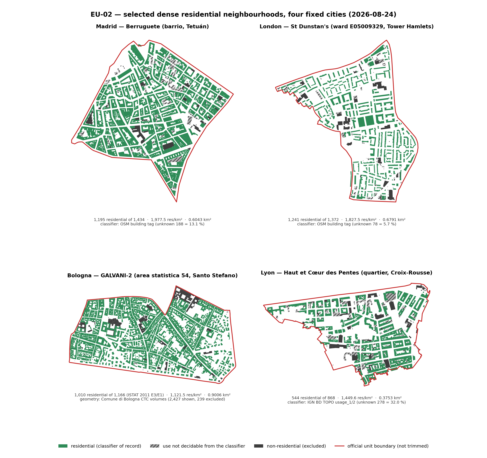

# EU-02 — Dense residential neighbourhood selection for the European campaign

**Revision B — 2026-08-24.** Revision A of the same date is retained verbatim at
[`debugs/docs/EU02_neighbourhood_selection_2026-08-24_revA_superseded.md`](../../debugs/docs/EU02_neighbourhood_selection_2026-08-24_revA_superseded.md).

**Executed in-session against live public APIs** (not delegated to an external LLM)
**Serves:** MVP §9.7.2 gates `NS-01`–`NS-10`, MVP §10.4 four-panel input audit, decision `D-EU-10` (data half)
**Pre-registered rule:** [`eu02_prereg_selection_rule.md`](eu02_prereg_selection_rule.md) (v1)
· **amendment** [`eu02_prereg_selection_rule_v2_amendment.md`](eu02_prereg_selection_rule_v2_amendment.md) (v2)
**Machine-readable evidence:** [`eu02_site_measurements_v2.csv`](eu02_site_measurements_v2.csv) ·
[`eu02_site_measurements_v2.json`](eu02_site_measurements_v2.json) ·
[`eu02_candidates_madrid.csv`](eu02_candidates_madrid.csv) ·
[`eu02_candidates_london.csv`](eu02_candidates_london.csv) ·
[`eu02_candidates_bologna_istat.csv`](eu02_candidates_bologna_istat.csv) ·
[`eu02_candidates_lyon_quartier_bdtopo.csv`](eu02_candidates_lyon_quartier_bdtopo.csv) ·
[`eu02_candidates_lyon_iris_bdtopo.csv`](eu02_candidates_lyon_iris_bdtopo.csv) ·
[`eu02_reproducible_queries.json`](eu02_reproducible_queries.json) ·
[`eu02_boundaries/`](eu02_boundaries/)

**This document is a result package.** The report and every artefact it cites live together in
`docs/docs_ACTIVE/europeanLocations/outputs/EU02_neighbourhood_selection_2026-08-24/`: this report, 8 candidate
tables (`.csv`), 2 site-measurement files (`.csv`, `.json`), the reproducible-query record (`.json`), the v1
pre-registered rule and its v2 amendment (`.md`), 2 figures (`.png`), and 8 official boundary polygons under
`eu02_boundaries/` (`.geojson`, EPSG:4326, one file per candidate site, SHA-256 quoted in §3). Artefacts whose
name lacks `_v2`, `_istat` or `_bdtopo` belong to Revision A and are retained only as its evidence; the
Revision B chain is `eu02_site_measurements_v2.*`, `eu02_candidates_{madrid,london,bologna_istat,lyon_quartier_bdtopo,lyon_iris_bdtopo}.csv`
and the four selected boundaries. The figure is also mirrored flat to `openubem/outputs/eu02_selected_neighbourhoods_v2.png`
per the repository's figure rule.

> **What changed between Revision A and Revision B, and why.**
> Revision A refused to select in Bologna and Lyon. The stated reason was that residential dominance
> could not be established: 65.5 % and 61.1 % of buildings carried the OSM value `building=yes`, the
> crosswalk's ambiguous token. **That refusal has now been resolved, not overridden.** The OSM tag was
> replaced, in Italy and France only, by the national authority that actually enumerates building use —
> **ISTAT** for Italy and **IGN BD TOPO®** for France — and both cities then select cleanly. The
> ranking rule itself (`R1`–`R5`) was carried over unchanged; only the classifier was substituted, on a
> measured coverage statistic, and the substitution is written up in the v2 amendment together with an
> honest note on its timing. Separately, the campaign owner released the `N1` 500–600 size band on
> 2026-08-24 ("*n'importe quoi le numéro, s'il y a plus de 100 bâtiments ou plus de 1000 bâtiments, ça
> marche bien aussi*"), which voided v1's "closest to 550" tie-break and moved the Madrid pick from
> *Bellas Vistas* to the denser *Berruguete*. London is unchanged.

> **What this document is.** Every count below was **measured** on 2026-08-24 from a named live source
> and joined to an **official boundary polygon** obtained from the publishing authority. It is not a
> plan and not an estimate. What it is *not*: no footprints were written into the repository, no
> residential registry was built, no geometry, IDF or simulation exists for any site. See §6.

---

## 0. Method actually executed

1. **Pre-registration.** Pool, residential filter, density metric and tie-breaks were written to
   `eu02_prereg_selection_rule.md` **before** the first ranking. The classifier substitution and
   the released size band are written to the v2 amendment, which discloses that it was authored after
   the Italian re-ranking and before the French one.
2. **Boundaries** were taken from the publishing authority, not drawn: Madrid *barrios* (OSM
   `admin_level=10` relations mirroring the Ayuntamiento set), London wards from the **ONS Open
   Geography Portal** (BFC, full resolution), Bologna *aree statistiche* from the **Comune di Bologna**
   open-data portal, Lyon *quartiers* and *IRIS* from **Métropole de Lyon**.
3. **Classifier of record, per country** — this is the substance of Revision B:

   | Country | Classifier of record | What decides "residential" |
   |---|---|---|
   | ES | OSM `building` tag via `openubem/data/osm_to_use_class.json` | the 8 residential tokens; `yes`/empty = unknown |
   | GB | same | same |
   | IT | **ISTAT, 15° Censimento generale della popolazione e delle abitazioni 2011**, census-section variables | `E3` *edifici utilizzati ad uso residenziale* over `E1` *edifici* — a full enumeration, so there is no unknown class |
   | FR | **IGN BD TOPO® V3**, layer `batiment`, Géoplateforme WFS | `usage_1` or `usage_2` = `Résidentiel`; `Indifférencié` = unknown; `Annexe` excluded as non-modelable |

4. **Assignment.** Buildings and census sections were assigned to candidate polygons by point-in-polygon
   in the national projected CRS (EPSG:25830 ES, 27700 GB, 32632 IT, 2154 FR).
5. **ISTAT variable mapping was verified, not assumed.** The 2011 section file has 31 `E` columns and
   no header dictionary in the archive. The mapping used here was fixed by five arithmetic identities
   that must each equal `E3`, checked over all 2,260 Bologna sections and all reproduced exactly:
   `E5+E6+E7` (material) = `E8..E16` (period) = `E17..E20` (storeys) = `E21..E26` (dwelling units per
   building) = `E28..E31` (state of repair) = **22,149** = `E3`; and `E2−E3 = E4` = 6,609. A first pass
   that assumed `E4` was the first material class was off by one and was caught by these checks.
6. **Shortlisted sites** were re-measured through a second, independent query path (bbox fetch with full
   geometry, then clip against the official polygon).

Populations measured: **44** Madrid barrios, **58 + 38** London wards, **90** Bologna aree statistiche
(over 2,333 census-section polygons and 2,260 ISTAT section records), **36** Lyon quartiers and **185**
Lyon IRIS — **451 candidate units**. Bulk data: ≈197,000 OSM building records, **107,347** BD TOPO
buildings for the Lyon commune bbox, **65,744 + 40,621** Comune di Bologna building records, and the
ISTAT national section archive (52 MB).

---

## 1. Executive decision table

| site_id | City / neighbourhood | Decision | Boundary | Centroid (lon, lat) | bbox (W,S,E,N) | Classifier of record | Residential | Res/km² | Reason |
|---|---|---|---|---|---|---|---:|---:|---|
| `ES-MAD-BERRUGUETE` | Madrid — **Berruguete** (barrio, Tetuán) | **SELECTED** | `VERIFIED` | −3.704917, 40.459605 | −3.711403, 40.453976, −3.698399, 40.463907 | OSM + OpenUBEM crosswalk | **1,195 · MEASURED** | **1,977.5** | Highest residential density of the whole 44-barrio pool among the 28 units passing the 0.60 dominance gate; 83.3 % residential-dominant; whole official barrio, untrimmed. |
| `GB-LDN-STDUNSTANS` | London — **St Dunstan's** ward, Tower Hamlets (`E05009329`) | **SELECTED** | `VERIFIED` | −0.040004, 51.518428 | −0.050013, 51.512597, −0.033744, 51.524248 | OSM + OpenUBEM crosswalk | **1,241 · MEASURED** | **1,827.5** | Highest residential density of the three-borough pool and of the extended 96-ward check; 90.5 % dominant; 90.8 % `building:levels` coverage. |
| `IT-BOL-GALVANI2` | Bologna — **GALVANI-2** (area statistica 54, Santo Stefano) | **SELECTED** | `VERIFIED` | 11.349303, 44.488200 | 11.339551, 44.484404, 11.358017, 44.492249 | **ISTAT 2011 `E3`/`E1`** | **1,010 · MEASURED** | **1,121.5** | Highest residential density of the 60 aree statistiche passing the dominance gate under the national census; 86.6 % dominant; 8,963 dwelling units. |
| `FR-LYO-HAUTCOEURPENTES` | Lyon — **Haut et Cœur des Pentes** (quartier, Croix-Rousse, Lyon 1er) | **SELECTED** | `VERIFIED` | 4.831888, 45.772313 | 4.823612, 45.768891, 4.837450, 45.774784 | **IGN BD TOPO® `usage_1/2`** | **544 · MEASURED** | **1,449.6** | Highest residential density of the 11 quartiers passing the dominance gate; 62.7 % dominant; 6,387 dwellings at 100 % attribute coverage. The v1 and v2 rules pick the **same** unit here, and 544 sits inside the original `N1` band. |

Naming for the existing OpenUBEM cell convention (`openubem/outputs/simulationResults/<cell>__*.png`):
`madrid_berruguete`, `london_stdunstans`, `bologna_galvani2`, `lyon_hautcoeurpentes`.



*Figure EU-02.1 (Revision B). Panel (c) of the MVP §10.4 four-panel audit, regenerated from the
campaign's own selected data — the same boundary and the same building-ID set in every panel, as
`NS-07` requires. Green enters the model; hatched grey and dark grey are excluded and retained as audit
context per `NS-08`. Compare with the Revision A figure: the two lower panels were then almost entirely
grey, and that greyness was the OSM tag, not the city. Panels (a) construction period, (b) energy-record
availability and (d) construction material are not drawn — §2.7 states, per country, which of them are
now measurable and which still need a join. Reusable asset:
[`eu02_selected_neighbourhoods_v2.png`](eu02_selected_neighbourhoods_v2.png), also
written flat to `openubem/outputs/eu02_selected_neighbourhoods_v2.png`.*

**Effect of releasing the size band, stated for every city.** What the v1 rule ("top decile by density,
then closest to 550") would have selected, against what v2 selects:

| City | Units passing `R1`+`R3` | Top decile | v1 pick | **v2 pick (selected)** |
|---|---:|---:|---|---|
| Madrid | 28 | 3 | Bellas Vistas (1,025) | **Berruguete (1,195)** |
| London | 26 | 3 | St Dunstan's (1,241) | **St Dunstan's (1,241)** — unchanged |
| Bologna | 60 | 6 | San Giuseppe (620) | **GALVANI-2 (1,010)** |
| Lyon | 11 | 2 | Haut et Cœur des Pentes (544) | **Haut et Cœur des Pentes (544)** — unchanged |

Bologna is the informative row: **even under the unamended v1 rule the classifier substitution alone
would have produced a selection** (San Giuseppe, 620 residential, 850.8/km², dominance 0.930). The size
band was never Bologna's blocker; the classifier was.

---

## 2. Candidate comparison

All units of every pool are in the CSVs; the tables below show the decisive rows. Every number is
`MEASURED` 2026-08-24 unless marked otherwise.

### 2.1 Madrid — 44 barrios of the *almendra central*

Pass `R1` (≥100 buildings): 42. Pass `R3` (residential share ≥ 0.60): 28. Top decile = 3.

| Rank | Barrio | District | km² | Buildings | Residential | Unknown | Res. share | **Res/km²** | Verdict |
|---:|---|---|---:|---:|---:|---:|---:|---:|---|
| 1 | **Berruguete** | Tetuán | 0.604 | 1,433 | **1,194** | 188 | 0.833 | **1,975.9** | **SELECTED** |
| 2 | Embajadores | Centro | 1.022 | 1,787 | 1,678 | 27 | **0.939** | 1,641.6 | Best data completeness of the pool (1.5 % unknown) |
| 3 | Bellas Vistas | Tetuán | 0.717 | 1,506 | 1,025 | 407 | 0.681 | 1,430.6 | Revision A's pick; retained as the fallback site |
| 4 | Universidad | Centro | 0.940 | 1,588 | 1,158 | 316 | 0.729 | 1,232.0 | Below decile cut |
| 5 | Palos de la Frontera | Arganzuela | 0.652 | 894 | 770 | 41 | 0.861 | 1,180.6 | Below decile cut |
| 7 | Sol | Centro | 0.446 | 693 | 501 | 81 | 0.723 | 1,122.9 | Inside the original 500–600 band |
| — | Vallehermoso | Chamberí | 1.072 | 485 | 64 | 391 | 0.132 | 59.7 | Rejected: fails `R3`; 80.6 % unknown |

The two independent query paths differ by **one building** on the selected barrio: the bulk
`out tags center` extract gives 1,433 / 1,194, the bbox `out geom` + clip path gives 1,434 / 1,195. The
packet in §3.1 carries the clip-path numbers, which are the ones drawn in Figure EU-02.1.

**Madrid whole barrios in the 500–600 band (share ≥ 0.60), measured:** Sol 501 · Gaztambide 516 ·
Chopera 502 (share 0.928, unknown 1.1 %) · Recoletos 529 · Delicias 509.

### 2.2 London — 58 wards of Tower Hamlets, Islington and Hackney

Pass `R1`: 58. Pass `R3`: 26. Top decile = 3. Ranking used the ONS **BGC** generalised boundaries; the
selected site was re-measured on the full-resolution **BFC** boundary (§2.6).

| Rank | Ward | Borough | km² | Buildings | Residential | Unknown | Res. share | **Res/km²** | Verdict |
|---:|---|---|---:|---:|---:|---:|---:|---:|---|
| 1 | **St Dunstan's** `E05009329` | Tower Hamlets | 0.681 | 1,400 | **1,269** | 78 | 0.906 | **1,862.3** | **SELECTED** (BFC re-measure: 1,372 / 1,241 / 0.6791 km² / 1,827.5 per km²) |
| 2 | Island Gardens `E05009324` | Tower Hamlets | 1.039 | 2,021 | 1,852 | 52 | 0.916 | 1,781.9 | Largest residential count in the pool |
| 3 | Hillrise `E05013705` | Islington | 1.020 | 2,207 | 1,611 | 506 | 0.730 | 1,578.9 | Top decile |
| — | Barnsbury `E05013698` | Islington | 0.897 | 2,346 | 331 | 1,965 | 0.141 | 369.1 | Rejected: 83.8 % unknown — a mapping artefact, not low density (43rd of 58) |
| — | Bunhill `E05013699` | Islington | 0.837 | 857 | 95 | 613 | 0.111 | 113.5 | Rejected: fails `R3` |

Median ward unknown share: **Tower Hamlets 0.212**, **Hackney 0.472**, **Islington 0.505** (maximum
0.838). The London ranking therefore partly measures **mapping completeness** — the same defect that
Italy and France showed in extreme form. It is contained by the dominance gate and by the fact that the
selected ward's own unknown share is 5.7 %, but the EPC/UPRN join in §3.2 is what would remove it.

**Supplementary check — DR10's own London boroughs.** Camden and Kensington & Chelsea, outside the
pre-registered pool, were measured afterwards with the identical method as a check
([`eu02_candidates_london_dr10_boroughs.csv`](eu02_candidates_london_dr10_boroughs.csv)):
38 further wards, 20 passing the dominance gate. The densest are Kentish Town South (1,854.7/km²,
1,521 residential) and Kentish Town North (1,808.9, 1,014) — both below St Dunstan's, so **the
selection is unchanged over the extended 96-ward pool**. Wards it adds inside the 500–600 band:
Norland 535, Chelsea Riverside 536, Abingdon 578.

### 2.3 Bologna — 90 *aree statistiche*, ISTAT classifier (**resolves Revision A's `NO_SELECTION`**)

Pass `R1` (≥100 buildings): 71. Pass `R3` (`E3/E1` ≥ 0.60): **60** — against **2** under the OSM
classifier. Top decile = 6.

| Rank | Area statistica | Quartiere | km² | `E1` buildings | `E3` residential | Res. share | **Res/km²** |
|---:|---|---|---:|---:|---:|---:|---:|
| 1 | **GALVANI-2** | Santo Stefano | 0.901 | 1,166 | **1,010** | 0.866 | **1,121.5** |
| 2 | MALPIGHI-2 | Porto - Saragozza | 0.772 | 961 | 852 | 0.887 | 1,103.4 |
| 3 | IRNERIO-1 | Santo Stefano | 0.308 | 375 | 322 | 0.859 | 1,044.3 |
| 4 | XXI APRILE | Porto - Saragozza | 0.826 | 958 | 828 | 0.864 | 1,001.9 |
| 5 | PONTEVECCHIO | Savena | 0.404 | 468 | 359 | 0.767 | 887.8 |
| 6 | SAN GIUSEPPE | Porto - Saragozza | 0.729 | 667 | 620 | **0.930** | 850.8 |

The full period, material, storey, dwelling-unit and state-of-repair breakdown for every one of the 90
units is in [`eu02_candidates_bologna_istat.csv`](eu02_candidates_bologna_istat.csv).

**Cross-check against the city's own dwelling statistic.** Spearman rank correlation between the
classifier's residential/km² and the Comune's published **families per km²** (2024, CC BY 4.0), over all
90 units: **0.914** with ISTAT, against **0.777** with the OSM tag over the 85 units Revision A could
rank. The selected unit sits **12th of 90** on families/km² (6,611 families, 7,341/km²); Revision A's
mechanical OSM output, `LA BIRRA`, sat **52nd of 85**. The substitution moves the ranking toward the
city's own measurement of where people live, which is what `NS-03` asks for.

**What the OSM tag said about this same unit:** 2,202 mapped buildings, **31** residential (1.4 %),
2,077 `building=yes`. The authority says 1,010 of 1,166 are residential. This single row is the clearest
statement of why Revision A's refusal was correct and why it is now lifted.

### 2.4 Lyon — 36 quartiers and 185 IRIS, BD TOPO classifier (**resolves Revision A's `NO_SELECTION`**)

Pass `R1`: 36 quartiers. Pass `R3`: **11** — against **0** under the OSM classifier. Top decile = 2.

| Rank | Quartier | km² | Buildings | Residential | Unknown | Non-res | Res. share | **Res/km²** | Dwellings |
|---:|---|---:|---:|---:|---:|---:|---:|---:|---:|
| 1 | **Haut et Cœur des Pentes** | 0.375 | 868 | **544** | 278 | 52 | 0.627 | **1,449.6** | **6,387** |
| — | Croix-Rousse Est et Rhône | 0.591 | 1,432 | 820 | 561 | 51 | 0.573 | 1,387.3 | 6,752 |
| 2 | Brotteaux | 0.558 | 1,058 | 690 | 297 | 71 | 0.652 | 1,236.0 | 9,658 |
| 3 | Bas des Pentes Presqu'île | 0.434 | 709 | 518 | 144 | 47 | 0.731 | 1,192.7 | 6,162 |
| — | Croix-Rousse Centre | 0.629 | 1,300 | 705 | 496 | 99 | 0.542 | 1,121.6 | 6,149 |
| — | Montchat | 2.268 | 3,924 | 2,327 | 1,287 | 310 | 0.593 | 1,026.2 | 10,592 |

Rows marked "—" **fail** `R3` and are shown only to make the gate visible. Revision A's provisional Lyon
site was *Croix-Rousse Est et Rhône*, which the dominance gate still rejects under the better classifier.

**The French unit question is now decidable on evidence, and Revision A's finding on it was wrong.**
Revision A reported "no single Lyon IRIS exceeds 230 residential buildings" and concluded that one IRIS
could not carry the sample. That 230 was an OSM artefact. Under BD TOPO the largest single Lyon IRIS is
**La Plaine Charcot at 513 residential buildings** (share 0.611, 926.2/km²) — the only IRIS that lands
inside the original 500–600 band — and **65 of 185** IRIS pass the dominance gate. The densest IRIS are
Capucins-Griffon (210 residential, 2,421/km²), Bossuet Ney (152, 2,320) and Chardonnet (98, 2,208).

Recommendation, for the owner to rule: **use the quartier**. It needs no artificial IRIS pairing, it
carries 544 residential buildings — inside the original `N1` band — at a higher density than any IRIS of
comparable size, and it is the level the Métropole publishes as a neighbourhood. `La Plaine Charcot` is
the IRIS-level fallback if the owner prefers to keep `D-EU-10`'s named unit.

### 2.5 DR10 estimates vs the project's own counts

| Unit | DR10 estimate | Measured here | Note |
|---|---|---:|---|
| Madrid Gaztambide | 490–540 residential | **516** | Inside DR10's range |
| Madrid Trafalgar | 580–640 | **502** | 37.7 % of its buildings are `building=yes` |
| Madrid Arapiles | 520–580 | **321** | 37.9 % unknown |
| Madrid Bellas Vistas | 850–950 | **1,025** | Same direction, larger |
| Madrid Bellas Vistas area | 0.716 km² (Ayuntamiento) | **0.7165 km²** | Boundary independently confirmed |
| Lyon Croix-Rousse IRIS pair `693840101+02` | 0.460 km², 520–580 residential | **0.358 km², 521 buildings, 169 OSM-residential** | DR10's figure ≈ the *total*, not the filtered count |
| Bologna "Bolognina 1 — Casaralta (`AS_31`)" | 0.520 km², 510–570 residential | **no such unit** in the official 90-area set | DR10's Bologna area codes do not resolve |

**Consequence, unchanged in Revision B:** DR10 candidate counts must not be quoted as project numbers.
Its *dataset* pins were all independently confirmed live, and Revision B adds three that DR10 did not
name and that turned out to be decisive: the ISTAT section-variable archive, the Géoplateforme BD TOPO
WFS, and the Comune di Bologna CTC building layer.

### 2.6 Boundary-generalisation sensitivity (London)

Same ward, two ONS products: **BGC** (generalised, 23 vertices, 0.6814 km²) → 1,400 buildings / 1,269
residential; **BFC** (full resolution, 236 vertices, 0.6791 km²) → 1,372 / 1,241. A **2.2 %** count
difference from the boundary product alone. The packet pins **BFC**; any panel built on BGC would not
reconcile with it (`NS-07`).

### 2.7 Attribute coverage now in hand, per site (what Figure 6a's four panels can be built from)

| Panel (MVP §10.4) | `ES-MAD-BERRUGUETE` | `GB-LDN-STDUNSTANS` | `IT-BOL-GALVANI2` | `FR-LYO-HAUTCOEURPENTES` |
|---|---|---|---|---|
| (a) construction period | **NOT_MEASURED** — OSM `start_date` coverage measured at **0.0 %**; needs Catastro | **NOT_MEASURED** — needs EPC `CONSTRUCTION_AGE_BAND` | **MEASURED (aggregate)** — ISTAT: 741 ante-1919, 107 1919-45, 89 1946-60, 51 1961-70, 6 1971-80, 2 1981-90, 13 1991-2000, 0 2001-05, 1 post-2005 | **MEASURED (per building)** — BD TOPO `date_d_apparition`, coverage **98.5 %** |
| (b) energy-record availability | **NOT_MEASURED** — CM registry verified live, not joined | **NOT_MEASURED** — MHCLG dictionary verified (91 fields), not joined | **NOT_MEASURED** — no open bulk endpoint found for the Emilia-Romagna SACE registry | **MEASURED (bbox)** — **8,221** ADEME DPE records geolocated inside the site bbox (postcode 69001 total 12,978) |
| (c) residential typology + excluded context | **MEASURED** — Figure EU-02.1 | **MEASURED** | **MEASURED** | **MEASURED** |
| (d) construction material / set | **NOT_MEASURED** — no open per-building material source | **NOT_MEASURED** — EPC `WALLS_DESCRIPTION` not joined | **MEASURED (aggregate)** — ISTAT: 903 load-bearing masonry, 93 reinforced concrete, 14 other | **MEASURED (per building)** — BD TOPO `materiaux_des_murs`, coverage **98.9 %** |

The country that Revision A called the hardest is now the best-instrumented: **Italy and France carry
three of the four panels between them; Spain and England carry one.** That inversion should be read
before EU-04 sequencing is decided.

---

## 3. Site acquisition packets

Field values are exactly as measured; nothing is implied. `boundary_geojson` is shipped as a retained
file rather than inlined — path and SHA-256 are given.

### 3.1 Madrid — SELECTED

```yaml
site_id: "ES-MAD-BERRUGUETE"
country_stock: "ES"
city: "Madrid"
neighbourhood_name: "Berruguete (barrio, distrito 06 Tetuan)"
decision: "SELECTED"
boundary_status: "VERIFIED"
crs_input: "EPSG:4326"
centroid_wgs84: [-3.704917, 40.459605]
bbox_wgs84: [-3.711403, 40.453976, -3.698399, 40.463907]           # [west, south, east, north]
bbox_openubem_order: [40.463907, 40.453976, -3.698399, -3.711403]  # (n, s, e, w) for ingest_buildings(bbox=...)
boundary_geojson: "docs/docs_ACTIVE/europeanLocations/outputs/EU02_neighbourhood_selection_2026-08-24/eu02_boundaries/eu02_boundary_ES-MAD-BERRUGUETE.geojson"
boundary_sha256: "2b04b1a2b22dd177bb5cdaa7110578ad015cbcfdb2e66fa07de4e7f13884c738"
boundary_geometry: "Polygon, 1 part, 66 vertices, no holes, 0.6043 km2"
boundary_rationale: >
  Highest residential-building density of the whole pre-registered pool among the units satisfying the
  0.60 dominance gate; whole official barrio, untrimmed.
contiguity_basis: "administrative"
classifier_of_record: "OSM building tag via openubem/data/osm_to_use_class.json"
footprint_source:
  provider: "OpenStreetMap contributors (Overpass API)"
  dataset_or_endpoint: "https://overpass-api.de/api/interpreter"
  licence_url: "https://www.openstreetmap.org/copyright"
  attribution_text: "(c) OpenStreetMap contributors, ODbL 1.0"
  access_date_utc: "2026-08-24"
  stable_building_id_field: "osm_type + osm_id (way/relation)"
boundary_source:
  provider: "Ayuntamiento de Madrid (barrio set), retrieved as the OSM admin_level=10 relation mirroring it"
  authoritative_download: "https://datos.madrid.es/dataset/900012-0-limites-administrativos-mapas"
  licence_note: "Ayuntamiento de Madrid open data, attribution required; the OSM mirror is ODbL"
residential_filter:
  include_rules: ["building in {apartments,bungalow,detached,dormitory,house,residential,semidetached_house,terrace}"]
  exclude_rules: ["every other building value per openubem/data/osm_to_use_class.json"]
  unknown_use_policy: "exclude and retain in audit"     # building=yes / empty = ambiguous_tokens
count_status: "MEASURED"
count_evidence: >
  1,434 buildings inside the boundary: 1,195 residential, 188 unknown-use, 51 non-residential
  (clip path). The independent bulk path gives 1,433 / 1,194 / 188 / 51 - a one-building difference
  between query paths, retained rather than reconciled away.
candidate_density_evidence: >
  1,977.5 residential buildings/km2, rank 1 of the 28 pool units passing the dominance gate.
  Floor-area proxy: residential footprint 272,822 m2, median footprint 169.7 m2, building:levels present
  for 86.1 % of residential buildings (mean 3.81), proxy GFA on the covered subset 1,047,020 m2
  = 1,732,676 m2/km2 (PARTIAL COVERAGE, not a full-stock figure).
four_panel_data_sources:
  construction_period: >
    Direccion General del Catastro INSPIRE Buildings, municipality file
    https://www.catastro.hacienda.gob.es/INSPIRE/Buildings/28/28900-MADRID/A.ES.SDGC.BU.28900.zip
    (ATOM https://www.catastro.hacienda.gob.es/INSPIRE/buildings/ES.SDGC.BU.atom.xml, twice-yearly).
    Rights: free use provided the D.G. of the Cadastre is named as author and owner.
    OSM carries no usable date here: start_date coverage MEASURED at 0.0 %.
  energy_record_availability: >
    Comunidad de Madrid EPC registry, open CSV/ZIP, CC-BY, monthly:
    https://datos.comunidad.madrid/catalogo/dataset/registro_certificados_eficiencia_energetica
    (field list NOT_MEASURED - read it at acquisition before designing the panel).
  typology_or_use: "Catastro currentUse + OSM building tag; TABULA SFH/TH/MFH/AB crosswalk per the EU-02 semantic layer."
  construction_material_or_set: "TABULA ES family by period x typology; no open observed per-building material source."
known_geometry_risks:
  - "building:levels missing for 13.9 % of residential buildings - storey count should come from Catastro numberOfFloorsAboveGround or the repo height cascade."
  - "188 unknown-use buildings (13.1 %) sit inside the boundary and are excluded; if Catastro shows them residential the site grows toward 1,380."
  - "Multipolygon buildings (relations) are included in the count and need the acquisition layer's overlap resolution."
count_stage: "ABOVE_1000 (owner released the N1/N2 band 2026-08-24)"
eu04_readiness: "READY_FOR_ACQUISITION"
blocking_items:
  - "Catastro municipality extract not downloaded; construction period and storey counts unavailable until it is."
  - "OpenUBEM has not yet run ingest_buildings on this bbox; no raw footprint manifest or checksum exists in the repository."
fallback_site: "ES-MAD-BELLASVISTAS (1,025 residential, 1,430.6/km2) - Revision A's pick, boundary and measurements retained."
```

### 3.2 London — SELECTED

```yaml
site_id: "GB-LDN-STDUNSTANS"
country_stock: "GB"
city: "London"
neighbourhood_name: "St Dunstan's ward (E05009329), London Borough of Tower Hamlets"
decision: "SELECTED"
boundary_status: "VERIFIED"
crs_input: "EPSG:4326"
centroid_wgs84: [-0.040004, 51.518428]
bbox_wgs84: [-0.050013, 51.512597, -0.033744, 51.524248]
bbox_openubem_order: [51.524248, 51.512597, -0.033744, -0.050013]
boundary_geojson: "docs/docs_ACTIVE/europeanLocations/outputs/EU02_neighbourhood_selection_2026-08-24/eu02_boundaries/eu02_boundary_GB-LDN-STDUNSTANS.geojson"
boundary_sha256: "f5286cf28ff4cea079a87b68b9f0942e31542d2833e9ede1350830665e140bbc"
boundary_geometry: "Polygon, 236 vertices (ONS BFC full resolution), 0.6791 km2"
boundary_rationale: >
  Highest residential-building density of the pre-registered three-borough pool and of the extended
  96-ward check; whole official ward, untrimmed.
contiguity_basis: "administrative"
classifier_of_record: "OSM building tag via openubem/data/osm_to_use_class.json"
footprint_source:
  provider: "OpenStreetMap contributors (Overpass API)"
  dataset_or_endpoint: "https://overpass-api.de/api/interpreter"
  licence_url: "https://www.openstreetmap.org/copyright"
  attribution_text: "(c) OpenStreetMap contributors, ODbL 1.0"
  stable_building_id_field: "osm_type + osm_id"
boundary_source:
  provider: "Office for National Statistics, Open Geography Portal"
  dataset: "Wards (December 2022) Boundaries UK BFC"
  licence_note: "Open Government Licence v3.0; contains OS data (c) Crown copyright and database right 2022"
  generalisation_pinned: "BFC - BGC changes the building count by 2.2 % (see section 2.6)"
residential_filter:
  include_rules: ["the eight residential tokens of openubem/data/osm_to_use_class.json"]
  unknown_use_policy: "exclude and retain in audit"
count_status: "MEASURED"
count_evidence: >
  1,372 buildings inside the BFC boundary: 1,241 residential, 78 unknown-use, 53 non-residential.
candidate_density_evidence: >
  1,827.5 residential buildings/km2 (BFC). Floor-area proxy: residential footprint 141,285 m2, median
  48.7 m2 (terraced fabric), building:levels present for 90.8 % (mean 2.50), proxy GFA on the covered
  subset 411,958 m2 = 606,637 m2/km2.
four_panel_data_sources:
  construction_period: >
    MHCLG Energy Performance of Buildings open data, domestic certificates, field CONSTRUCTION_AGE_BAND;
    dictionary verified live (91 fields). https://get-energy-performance-data.communities.gov.uk/
  energy_record_availability: "Same source: certificate presence per UPRN/postcode gives panel (b) directly."
  typology_or_use: "EPC PROPERTY_TYPE + BUILT_FORM crosswalked to TABULA GB SFH/TH/MFH/AB."
  construction_material_or_set: "EPC WALLS_DESCRIPTION + TABULA GB set assignment."
  join_key: "UPRN via OS Open UPRN (OGL), or POSTCODE + address matching as fallback."
known_geometry_risks:
  - "Median residential footprint 48.7 m2 - many OSM ways are individual terrace houses; check for shared-wall duplication before dwelling allocation."
  - "78 unknown-use buildings (5.7 %) excluded; the EPC join should resolve most of them."
count_stage: "ABOVE_1000 (owner released the N1/N2 band 2026-08-24)"
eu04_readiness: "READY_FOR_ACQUISITION"
blocking_items:
  - "EPC extract for Tower Hamlets not downloaded; no join has been attempted."
  - "OS Open UPRN not acquired."
  - "OpenUBEM has not yet run ingest_buildings on this bbox."
fallback_site: "GB-LDN-ISLANDGARDENS (E05009324, 1,852 residential, 1,781.9/km2)"
```

### 3.3 Bologna — SELECTED (`NO_SELECTION` of Revision A resolved)

```yaml
site_id: "IT-BOL-GALVANI2"
country_stock: "IT"
city: "Bologna"
neighbourhood_name: "GALVANI-2 (area statistica 54, zona Galvani, quartiere Santo Stefano)"
decision: "SELECTED"
boundary_status: "VERIFIED"
crs_input: "EPSG:4326"
centroid_wgs84: [11.349303, 44.488200]
bbox_wgs84: [11.339551, 44.484404, 11.358017, 44.492249]
bbox_openubem_order: [44.492249, 44.484404, 11.358017, 11.339551]
boundary_geojson: "docs/docs_ACTIVE/europeanLocations/outputs/EU02_neighbourhood_selection_2026-08-24/eu02_boundaries/eu02_boundary_IT-BOL-GALVANI2.geojson"
boundary_sha256: "7d7dcb8d9553ca2325f71ee5b7ca82ef3180ae4365627ef247007523d956714b"
boundary_geometry: "Polygon, 1 part, 132 vertices, no holes, 0.9006 km2, 66 ISTAT census sections"
boundary_rationale: >
  Highest residential-building density of the 60 aree statistiche passing the dominance gate under the
  national census classifier; whole official unit, untrimmed.
contiguity_basis: "administrative"
classifier_of_record: >
  ISTAT, 15 Censimento generale della popolazione e delle abitazioni 2011, section-level building
  variables E1 (edifici) and E3 (edifici utilizzati ad uso residenziale). Variable positions verified by
  five arithmetic identities against E3 (see section 0 item 5), not assumed from a data dictionary.
count_source:
  provider: "ISTAT"
  dataset: "Basi territoriali e variabili censuarie 2011 - dati-cpa_2011.zip"
  member_file: "Sezioni di Censimento/R08_indicatori_2011_sezioni.csv"
  filter: "PROCOM = 37006 (Bologna), NSEZ joined to the Comune's 2011 section polygons"
  licence_note: "ISTAT open data, CC BY 3.0 IT; attribution required"
  vintage_caveat: "2011. Buildings were last enumerated in the 2011 census; the 2021 permanent census does not re-survey them."
footprint_source:
  provider: "Comune di Bologna, open-data portal"
  dataset_or_endpoint: "https://opendata.comune.bologna.it/api/explore/v2.1/catalog/datasets/c_a944ctc_edifici_pl"
  description: "Carta Tecnica Comunale - edifici volumetrici; carries quota_gronda, quota_piede, altezza_gronda, volume, area"
  licence_note: "CC BY 4.0, Comune di Bologna"
  stable_building_id_field: "codice_ogg"
  secondary_dataset: "rifter_edif_pl (edifici particellari, cadastral foglio/mappale, 1,372 objects in this unit)"
boundary_source:
  provider: "Comune di Bologna"
  dataset: "aree-statistiche (90 units)"
  licence_note: "CC BY 4.0"
residential_filter:
  count_rule: "E3 / E1 per census section, summed over the 66 sections whose representative point falls inside the unit"
  geometry_rule: >
    CTC objects whose descrizion is one of the 29 explicitly non-residential classes (Stabilimento
    industriale, Edificio scolastico, Chiesa, Ospedale, Tettoia/pensilina, Baracca, Cabina ENEL, ...)
    are excluded; the remainder ("Edificio generico" and equivalents) are residential candidates.
  unknown_use_policy: "not applicable - ISTAT enumerates every building, so there is no ambiguous class"
count_status: "MEASURED"
count_evidence: >
  ISTAT: 1,166 buildings, 1,154 used, 1,010 residential, 144 used non-residential; 8,963 dwelling units
  (interni). Geometry: 2,427 CTC volumetric objects inside the boundary, 239 excluded as non-residential,
  2,188 residential candidates, 397,592 m2 footprint, median 96.5 m2, height present for 100 % of them
  (mean eaves height 12.57 m), total volume 5,474,762 m3. The CTC object count exceeds the ISTAT building
  count because the CTC decomposes a building into volumetric bodies - this is a KNOWN, UNRESOLVED
  many-to-one relation, not a disagreement about how many buildings exist.
candidate_density_evidence: >
  1,121.5 residential buildings/km2, rank 1 of 60 units passing the gate. Independent dwelling proxy:
  6,611 resident families (Comune, 2024) = 7,341 families/km2, rank 12 of 90. Spearman rank correlation
  between the ISTAT classifier and families/km2 over all 90 units = 0.914.
four_panel_data_sources:
  construction_period: >
    MEASURED (aggregate, from the classifier itself): ante-1919 741, 1919-1945 107, 1946-1960 89,
    1961-1970 51, 1971-1980 6, 1981-1990 2, 1991-2000 13, 2001-2005 0, post-2005 1.
    73.4 % of the residential stock predates 1919 - a single dominant TABULA IT vintage band.
  energy_record_availability: >
    NOT_MEASURED. Regione Emilia-Romagna SACE certificate registry; no open bulk endpoint was found on
    2026-08-24. Must be resolved before panel (b) can exist for Italy.
  typology_or_use: >
    MEASURED (aggregate): dwelling units per building - 1 unit 86, 2 units 56, 3-4 units 145,
    5-8 units 319, 9-15 units 267, 16+ units 137. Storeys - 1 storey 16, 2 storeys 99, 3 storeys 286,
    4+ storeys 609. Both crosswalk directly to TABULA IT SFH/TH/MFH/AB.
  construction_material_or_set: >
    MEASURED (aggregate): load-bearing masonry 903, reinforced concrete 93, other 14.
    89.4 % masonry, consistent with the pre-1919 share.
  state_of_repair_bonus: "ottimo 301, buono 650, mediocre 57, pessimo 2 - available if a retrofit-state prior is wanted."
known_geometry_risks:
  - "CTC volumes are 2.1x the ISTAT building count; a volume-to-building aggregation rule must be defined before dwelling allocation, and it is not defined here."
  - "ISTAT attributes are section-level aggregates, not per-building. Panels (a) and (d) for Italy are choropleths over 66 sections, not per-footprint colourings, unless a further join is built."
  - "ISTAT vintage is 2011; the CTC geometry is current. Buildings erected after 2011 carry geometry but no census attributes."
count_stage: "ABOVE_1000 (owner released the N1/N2 band 2026-08-24)"
eu04_readiness: "READY_FOR_ACQUISITION"
blocking_items:
  - "Volume-to-building aggregation rule for the CTC layer is undefined."
  - "No open Italian EPC bulk source found; panel (b) has no source yet."
  - "OpenUBEM has no ingest path for the Bologna ODS API - ingest_buildings would fetch OSM here, which section 2.3 shows is unusable for use classification."
fallback_site: "IT-BOL-SANGIUSEPPE (620 residential, 850.8/km2, dominance 0.930) - the v1-rule pick, inside the original N2 range."
```

### 3.4 Lyon — SELECTED (`NO_SELECTION` of Revision A resolved)

```yaml
site_id: "FR-LYO-HAUTCOEURPENTES"
country_stock: "FR"
city: "Lyon"
neighbourhood_name: "Haut et Coeur des Pentes (quartier, Pentes de la Croix-Rousse, Lyon 1er)"
decision: "SELECTED"
scope_note: "France is in the campaign for the physical / controlled-baseline scope only (arc rule)."
boundary_status: "VERIFIED"
crs_input: "EPSG:4326"
centroid_wgs84: [4.831888, 45.772313]
bbox_wgs84: [4.823612, 45.768891, 4.837450, 45.774784]
bbox_openubem_order: [45.774784, 45.768891, 4.837450, 4.823612]
boundary_geojson: "docs/docs_ACTIVE/europeanLocations/outputs/EU02_neighbourhood_selection_2026-08-24/eu02_boundaries/eu02_boundary_FR-LYO-HAUTCOEURPENTES.geojson"
boundary_sha256: "8832ec13e7bb96aff3cca4fee52b76d0f8644bffb9157a56c6eed2c77f4b0739"
boundary_geometry: "MultiPolygon with 1 part (contiguity checked), 232 vertices, no holes, 0.3753 km2"
boundary_rationale: >
  Highest residential-building density of the 11 quartiers passing the dominance gate; the v1 and v2
  rules select the same unit here; whole official quartier, untrimmed.
contiguity_basis: "administrative"
classifier_of_record: "IGN BD TOPO V3, layer batiment, usage_1 / usage_2"
footprint_source:
  provider: "Institut national de l'information geographique et forestiere (IGN)"
  dataset_or_endpoint: "https://data.geopf.fr/wfs/ows - TYPENAMES=BDTOPO_V3:batiment"
  licence_note: "Licence Ouverte / Open Licence 2.0 (Etalab); attribution 'IGN - BD TOPO' required"
  stable_building_id_field: "cleabs"
  axis_order_trap: "BBOX must be given as CRS:84 (lon,lat); EPSG:4326 (lat,lon) returns zero features on this service."
boundary_source:
  provider: "Metropole de Lyon"
  dataset: "adr_voie_lieu.adrquartier (36 quartiers inside the Lyon commune)"
  licence_note: "NOT_VERIFIED - confirm the Grand Lyon open-data licence, or substitute IGN/INSEE CONTOURS-IRIS"
residential_filter:
  include_rules: ["usage_1 = 'Residentiel' OR usage_2 = 'Residentiel'"]
  exclude_rules: ["usage_1 in {Commercial et services, Industriel, Agricole, Religieux, Sportif}"]
  annexe_rule: "usage_1 = 'Annexe' and not residential -> removed from the total as non-modelable (23 objects here); reported separately so it can be undone"
  unknown_use_policy: "usage_1 = 'Indifferencie' -> unknown, excluded, retained in audit"
count_status: "MEASURED"
count_evidence: >
  891 BD TOPO buildings inside the boundary; 23 annexes removed; of the remaining 868: 544 residential,
  278 unknown ('Indifferencie'), 52 non-residential. Residential share 0.6267, unknown share 0.3203.
candidate_density_evidence: >
  1,449.6 residential buildings/km2, rank 1 of the 11 quartiers passing the gate. Dwelling count is
  MEASURED, not proxied: 6,387 dwellings (nombre_de_logements present for 100.0 % of residential
  buildings) = 17,019 dwellings/km2. Floor-area proxy: residential footprint 106,889 m2, median 154.4 m2,
  nombre_d_etages present for 100.0 % (mean 5.45), proxy GFA 637,506 m2 = 1,698,727 m2/km2 - FULL
  COVERAGE, unlike every other site in this document.
four_panel_data_sources:
  construction_period: >
    MEASURED (per building): BD TOPO date_d_apparition, coverage 98.5 % of residential buildings.
  energy_record_availability: >
    MEASURED (bbox level): ADEME "DPE Logements existants (depuis juillet 2021)", dataset
    meg-83tjwtg8dyz4vv7h1dqe, 8,221 certificates geolocated inside the site bbox (postcode 69001 holds
    12,978). Licence Ouverte. Join key: identifiant_ban, or the Lambert-93 coordinates already in the record.
  typology_or_use: >
    MEASURED: nombre_de_logements per building (100 % coverage) + nombre_d_etages + hauteur
    (mean 22.03 m) - a direct TABULA FR SFH/TH/MFH/AB assignment without inference.
  construction_material_or_set: >
    MEASURED (per building): BD TOPO materiaux_des_murs, coverage 98.9 %. Codes are the BD TOPO wall-
    material nomenclature and must be crosswalked before use - the crosswalk is NOT written.
known_geometry_risks:
  - "32.0 % of buildings are 'Indifferencie'. They are excluded, but BD TOPO assigns this class where the match against the fichiers fonciers failed, so some are dwellings. If appariement_fichiers_fonciers resolves them the site grows toward 800."
  - "Mean 5.45 storeys on a 0.375 km2 slope site: the Pentes have significant terrain fall, so eaves height and storey count disagree by construction. Use hauteur with the DTM, not storeys x 3 m."
  - "materiaux_des_murs codes are unmapped to TABULA FR families."
count_stage: "N1 (544 residential - inside the original 500-600 band without any relaxation)"
eu04_readiness: "READY_FOR_ACQUISITION"
blocking_items:
  - "Metropole de Lyon boundary licence NOT_VERIFIED; CONTOURS-IRIS is the licensed substitute."
  - "BD TOPO wall-material code crosswalk is not written."
  - "OpenUBEM has no BD TOPO ingest path; osm_fetcher would fetch OSM, which section 2.4 shows is unusable here."
fallback_site: "FR-LYO-LAPLAINECHARCOT (IRIS, 513 residential, 926.2/km2) if the owner keeps IRIS as the ruled French unit."
```

---

## 4. Reproducible query appendix

Retained with results in [`eu02_reproducible_queries.json`](eu02_reproducible_queries.json).

### 4.1 Overpass (ES, GB) — `https://overpass-api.de/api/interpreter`, POST field `data`

Bounding-box counts (the bbox is larger than the boundary; the site counts of §1/§3 are these extracts
clipped to the official polygon).

```
[out:json][timeout:180];(way["building"](40.453976,-3.711403,40.463907,-3.698399);
relation["building"](40.453976,-3.711403,40.463907,-3.698399););out count;
```
```
[out:json][timeout:180];(way["building"~"^(apartments|bungalow|detached|dormitory|house|residential|semidetached_house|terrace)$"](40.453976,-3.711403,40.463907,-3.698399);
relation["building"~"^(apartments|bungalow|detached|dormitory|house|residential|semidetached_house|terrace)$"](40.453976,-3.711403,40.463907,-3.698399););out count;
```

For London substitute the bbox `(51.512597,-0.050013,51.524248,-0.033744)`. Overpass terms: fair-use
public instance; two of the twelve bulk extracts were rate-limited (HTTP 429) and two timed out
(HTTP 504) on first attempt and were re-run after 20–60 s backoff.

### 4.2 IGN BD TOPO (FR) — Géoplateforme WFS

```
https://data.geopf.fr/wfs/ows?SERVICE=WFS&VERSION=2.0.0&REQUEST=GetFeature
  &TYPENAMES=BDTOPO_V3:batiment&SRSNAME=EPSG:4326&OUTPUTFORMAT=application/json
  &BBOX=4.823612,45.768891,4.837450,45.774784,CRS:84
  &SORTBY=cleabs&COUNT=5000&STARTINDEX=0
```

`RESULTTYPE=hits` on the Lyon commune bbox `4.771,45.703,4.900,45.810,CRS:84` returns
`numberMatched="107347"`. **The `CRS:84` suffix is load-bearing**: the same request with
`,EPSG:4326` and lat/lon-ordered values returns zero features and no error. Page with `STARTINDEX`;
`SORTBY=cleabs` makes paging deterministic.

### 4.3 ISTAT (IT) — census section variables

```
https://www.istat.it/storage/cartografia/variabili-censuarie/dati-cpa_2011.zip   (52,442,848 bytes)
  member: "Sezioni di Censimento/R08_indicatori_2011_sezioni.csv"  (';' separated, latin-1, 152 columns)
  filter: PROCOM == '37006'                                        (2,260 Bologna sections)
  join:   int(NSEZ)  ==  int(sez2011) of the Comune's 2011 section polygons
```

Verify the `E`-column positions with the identities of §0 item 5 before using them.

### 4.4 Comune di Bologna — Opendatasoft Explore v2.1

```
https://opendata.comune.bologna.it/api/explore/v2.1/catalog/datasets/{ds}/exports/geojson?limit=-1
   ds = aree-statistiche                 (90 polygons)
   ds = sezioni-di-censimento-anno-2011  (2,333 polygons, field sez2011)
   ds = c_a944ctc_edifici_pl             (65,744 volumetric buildings)
   ds = rifter_edif_pl                   (40,621 cadastral-parcel buildings)
optional spatial filter: &where=in_bbox(geo_shape, {min_lat}, {min_lon}, {max_lat}, {max_lon})
```

The aggregation form (`/records?group_by=<field>&select=count(*) as n&limit=30`) requires `limit > 0`;
with `limit=0` the endpoint returns `total_count` and an empty `results` array, and an aliased `select`
on the grouped field returns HTTP 400.

### 4.5 ADEME DPE (FR) — energy-record availability

```
https://data.ademe.fr/data-fair/api/v1/datasets/meg-83tjwtg8dyz4vv7h1dqe/lines?size=0
  &bbox=4.823612,45.768891,4.837450,45.774784        -> total 8221
  &qs=code_postal_ban%3A69001                        -> total 12978
```

Dataset slug `dpe03existant`, 15,409,991 rows, 230 fields including `etiquette_dpe`,
`annee_construction`, `surface_habitable_logement`, `identifiant_ban` and Lambert-93 coordinates.
Use the numeric dataset id; the slug alone returned HTTP 403 on the `lines` endpoint.

### 4.6 What EU-04 should run for the two OSM sites

```python
from openubem.acquisition.osm_fetcher import ingest_buildings
gdf = ingest_buildings(bbox=(40.463907, 40.453976, -3.698399, -3.711403),  # (n, s, e, w)
                       tags={"building": True},
                       output_dir=Path("openubem/outputs/eu02/ES-MAD-BERRUGUETE"))
```

`ingest_buildings` dispatches to `osmnx.features.features_from_bbox`, whose tuple order in the pinned
osmnx 1.9.3 is **(north, south, east, west)** — not the GeoJSON `[W,S,E,N]` order used in §3. Clip to
the retained boundary polygon, then apply the residential filter. **There is no repository ingest path
for BD TOPO or for the Bologna ODS API**; for those two sites EU-04 needs a new acquisition adapter,
not a bbox.

### 4.7 Non-OSM sources verified live on 2026-08-24

| Purpose | Endpoint verified | Result |
|---|---|---|
| Madrid boundaries | `datos.madrid.es/dataset/900012-0-limites-administrativos-mapas` | HTTP 200; barrios, secciones censales, distritos |
| Madrid footprints/period | `catastro.hacienda.gob.es/INSPIRE/Buildings/28/28900-MADRID/A.ES.SDGC.BU.28900.zip` | present in the province-28 ATOM feed with its rights statement |
| Madrid EPC | `datos.comunidad.madrid/catalogo/.../registro_certificados_eficiencia_energetica` | CC-BY, monthly, CSV/ZIP per year |
| London boundaries | ONS `Wards_December_2022_Boundaries_UK_BFC` / `_BGC` FeatureServer | 58 wards for the 3 boroughs; BFC ward retrieved |
| London EPC fields | `get-energy-performance-data.communities.gov.uk/download/data-dictionary?property_type=domestic` | 91 fields; `CONSTRUCTION_AGE_BAND`, `WALLS_DESCRIPTION`, `PROPERTY_TYPE`, `BUILT_FORM`, `TOTAL_FLOOR_AREA`, `UPRN` present |
| **Italy building census** | `istat.it/storage/cartografia/variabili-censuarie/dati-cpa_2011.zip` | 52 MB, 83 members, 31 `E` variables per section; Bologna 2,260 sections, 22,149 residential buildings |
| Bologna boundaries | `opendata.comune.bologna.it/.../aree-statistiche/exports/geojson` | 90 polygons, CC BY 4.0 |
| Bologna buildings/heights | dataset `c_a944ctc_edifici_pl` | 65,744 records with `quota_gron`, `quota_pied`, `altezza_gr`, `volume` |
| Bologna cadastral buildings | dataset `rifter_edif_pl` | 40,621 records with `foglio` / `mappale` |
| Bologna dwelling proxy | dataset `famiglie-residenti-...-area-statistica-...` | families by area statistica, 2024 |
| **France buildings** | `data.geopf.fr/wfs/ows` `BDTOPO_V3:batiment` | 107,347 buildings in the Lyon bbox with `usage_1/2`, `nombre_de_logements`, `nombre_d_etages`, `hauteur`, `date_d_apparition`, `materiaux_des_murs` |
| **France EPC** | `data.ademe.fr/data-fair/api/v1/datasets/meg-83tjwtg8dyz4vv7h1dqe` | 15,409,991 DPE records, 230 fields, bbox-queryable |
| Lyon boundaries | Grand Lyon WFS `adr_voie_lieu.adrquartier`, `ter_territoire.teriris_latest` | 201 quartiers (36 in Lyon), 512 IRIS (185 in Lyon) |
| Lyon energy | Grand Lyon WFS `nrj_energie.nrjconsoannuiris_1` | per-IRIS annual consumption by carrier/sector |
| France IRIS fallback | `data.gouv.fr/datasets/contours-iris/` | IGN + INSEE, Licence Ouverte 2.0 |
| Emilia-Romagna regional WFS | `servizigis.regione.emilia-romagna.it/wfs/...` | **unusable** — TLS chain error (self-signed certificate in chain); not used |

---

## 5. `NS-01`–`NS-10` compliance matrix

`PASS` = retained reproducible evidence exists now. `PARTIAL` = evidence exists but the repository step
has not been run. `NOT_MET` = the gate's condition is not satisfied. `NOT_MEASURED` = not attempted. `NS-05` is scored against the ruled floor of 100 (§7.3), not the withdrawn 500–600 gate.

| Gate | `ES-MAD-BERRUGUETE` | `GB-LDN-STDUNSTANS` | `IT-BOL-GALVANI2` | `FR-LYO-HAUTCOEURPENTES` |
|---|---|---|---|---|
| `NS-01` contiguous boundary | **PASS** — official barrio, 1 part, 66 vertices, SHA-256 retained | **PASS** — ONS BFC ward, 1 part, 236 vertices, SHA-256 retained | **PASS** — Comune area statistica, 1 part, 132 vertices, SHA-256 retained | **PASS** — quartier, MultiPolygon with 1 part (contiguity checked), 232 vertices, SHA-256 retained |
| `NS-02` supported input mode + raw manifest | **PARTIAL** — bbox mode + exact query retained; `ingest_buildings` not run | **PARTIAL** — same | **NOT_MET** — no repository ingest path exists for the Bologna ODS API | **NOT_MET** — no repository ingest path exists for BD TOPO |
| `NS-03` rank by res/km² + dwelling or floor-area proxy | **PASS** — 44 units ranked; floor-area proxy on 86.1 % levels coverage | **PASS** — 58 (+38) units ranked; proxy on 90.8 % | **PASS** — 90 units ranked; dwelling units measured (8,963) and an independent families/km² cross-check at ρ = 0.914 | **PASS** — 36 quartiers + 185 IRIS ranked; dwellings measured at 100 % coverage |
| `NS-04` dense residential-dominant, rejections documented | **PASS** — 0.833 share; full ranking retained | **PASS** — 0.905 share; full ranking retained | **PASS** — 0.866 share (ISTAT); 60 of 71 screened units pass, rejections retained | **PASS** — 0.627 share (BD TOPO); 11 of 36 pass, the 25 rejections retained |
| `NS-05` sample size | **PASS** — 1,195 ≥ the ruled floor of 100 | **PASS** — 1,241 | **PASS** — 1,010 (the v1-rule alternate San Giuseppe holds 620) | **PASS** — 544, also inside the preferred 500–600 target |
| `NS-06` no trimming | **PASS** — whole official unit; checksum retained | **PASS** | **PASS** | **PASS** |
| `NS-07` identical boundary + IDs in all four panels | **NOT_MEASURED** — only panel (c) exists | **NOT_MEASURED** — only panel (c) | **PARTIAL** — panels (a), (c), (d) available, but (a) and (d) are section-level aggregates, so the per-building ID equality `NS-07` asserts cannot yet be shown | **PARTIAL** — panels (a), (c), (d) available per building on the same `cleabs` ID set; (b) is bbox-level and not yet joined to it |
| `NS-08` non-residential/unknown as excluded context | **PARTIAL** — 188 unknown + 51 non-res identified per building; no repo manifest | **PARTIAL** — 78 + 53 | **PARTIAL** — 156 non-residential buildings (ISTAT) and 239 excluded CTC objects identified; no repo manifest | **PARTIAL** — 278 unknown + 52 non-res + 23 annexes identified per `cleabs`; no repo manifest |
| `NS-09` four audit dimensions sourced | **PARTIAL** — (a) Catastro, (b) CM registry, (c) measured, (d) TABULA assignment only | **PARTIAL** — (a)(b)(c)(d) all resolvable from verified EPC fields; not joined | **PARTIAL** — (a)(c)(d) **measured**; (b) has **no source** | **PASS (sources)** — (a)(c)(d) measured per building, (b) measured at bbox level; joins not built |
| `NS-10` sites kept separate | **PASS** | **PASS** | **PASS** | **PASS** |

---

## 6. Handoff and limitations

### What an OpenUBEM implementation agent can do immediately

1. Run `ingest_buildings(bbox=...)` for `ES-MAD-BERRUGUETE` and `GB-LDN-STDUNSTANS` with the tuples in
   §3 (repo order `(n, s, e, w)`), clip to the retained boundary GeoJSON, and write the first real
   European raw footprint manifest with source, query, date, licence, CRS and checksum.
2. Apply the residential filter already in the repo and emit the excluded-building manifest required by
   `NS-08`. Expected counts, which must reconcile up to OSM edits after 2026-08-24: Madrid
   1,195 / 188 / 51, London 1,241 / 78 / 53.
3. Download the Catastro Madrid municipality file and the Tower Hamlets EPC extract, and build panels
   (a), (b), (c), (d) for those two sites.
4. For Bologna and Lyon, **write the two missing acquisition adapters** (below) — the data is already
   identified, licensed and measured; only the repository path is absent.

### What is explicitly not done

| Claim | Status |
|---|---|
| Candidate selected from public evidence | **YES**, all four cities |
| Raw building footprints acquired and checksummed **into the repository** | **NO** — the boundaries are checksummed; the footprints are not in the repo |
| Residential filter run **inside** OpenUBEM | **NO** — the identical rule was applied out-of-repo, on the same crosswalk file for ES/GB and on the substituted classifiers for IT/FR |
| Geometry / IDF / simulation evidence | **NO** — nothing was generated for any site |
| Panels (a), (b), (d) rendered | **NO** — §2.7 states which are now *measurable*, which is not the same as drawn |

### Findings that change the plan

1. **The OSM `building` tag is not a use classifier in Italy or France, and the correction is large.**
   In the selected Bologna unit OSM identifies 31 residential buildings; the national census identifies
   1,010. In Lyon the OSM tag left 61.1 % of the commune undecidable and no quartier passed the
   dominance gate; BD TOPO leaves 32 % undecidable at the selected site and 11 quartiers pass. Any
   European OpenUBEM step that reads use from OSM outside ES/GB is reading noise.
2. **The substituted classifiers are not merely adequate — they are better inputs than the OSM path.**
   BD TOPO gives dwelling count, storeys and height at **100 %** coverage, and construction date and
   wall material at ~99 %; ISTAT gives construction period, structural material, storeys, dwelling units
   per building and state of repair. Neither Spain nor England currently has anything comparable in
   hand: OSM `start_date` coverage on the Madrid site is **0.0 %**. §2.7 tabulates the inversion.
3. **Selecting on the authority moves the ranking toward the city's own measurement of density.**
   Spearman against Bologna's published families/km² rises from **0.777** (OSM) to **0.914** (ISTAT),
   and the selected unit moves from 52nd of 85 to 12th of 90.
4. **Revision A's "no single Lyon IRIS exceeds 230 residential buildings" was an artefact and is
   withdrawn.** Under BD TOPO the largest is 513 (`La Plaine Charcot`) and 65 of 185 IRIS pass the
   dominance gate. The French unit question is now a preference, not a constraint.
5. **`N1` at the officially published neighbourhood scale.** With the band released this no longer
   blocks anything, but the underlying fact stands: dense whole official units in Madrid and London hold
   1,000–1,900 residential buildings, Bologna 300–1,010, and only Lyon's quartier scale lands naturally
   in 500–600. Whole units inside the band, if the owner ever wants them, are measured and listed in
   §2.1, §2.2 and the `fallback_site` fields.
6. **The boundary product matters** — ONS BGC vs BFC changed the London count by 2.2 %. Pin BFC.
7. **DR10's candidate counts do not reproduce** (§2.5); its dataset pins do. Revision B adds three
   decisive sources DR10 did not name: ISTAT `dati-cpa_2011`, the Géoplateforme BD TOPO WFS, and the
   Comune di Bologna CTC layer.
8. **ISTAT's `E` columns must be verified arithmetically, not assumed.** The first mapping used here was
   off by one and produced breakdowns that did not sum to `E3`; the five identities in §0 item 5 caught
   it. Anyone re-running this must repeat that check.

### Blocking items, by owner

- **Campaign owner:** ~~three rulings owed~~ — **all three were delegated and are now taken in §7** (2026-08-24): the French unit is the quartier (`D-EU-02-A`), Madrid is Berruguete (`D-EU-02-B`), and the released size band is permanent (`D-EU-02-C`, MVP Table 10, Table 10a `NS-05` and both machine-readable copies amended). Nothing is owed by the owner before implementation starts; any of the three can still be reversed by a later ruling that quotes §7.
- **Implementation:** write a BD TOPO acquisition adapter and a Bologna ODS adapter (`NS-02` is
  `NOT_MET` for both sites purely for want of these); acquire Catastro (ES) and EPC + OS Open UPRN (GB);
  define the CTC volume-to-building aggregation rule; write the BD TOPO `materiaux_des_murs` → TABULA FR
  crosswalk; find an open Italian EPC bulk source or declare panel (b) unavailable for Italy; confirm
  the Métropole de Lyon boundary licence or switch to CONTOURS-IRIS.

---

## 7. Decisions taken on 2026-08-24 under owner delegation

The campaign owner delegated the three rulings Revision B had left open (*“je ne comprends pas pourquoi ne pas le résoudre”*, 2026-08-24). They are taken here with the evidence each rests on, and each is **reversible by a later owner ruling** — anyone re-opening one should quote this section and the row it disagrees with.

### 7.1 `D-EU-02-A` — the French unit is the **quartier**, not an IRIS

**Ruled: `FR-LYO-HAUTCOEURPENTES`, `Quartier Haut et Cœur des Pentes`, Métropole de Lyon quartier id `7016`.**

The alternative was the densest qualifying IRIS, `La Plaine Charcot` (`693850504`). Measured side by side on the same BD TOPO extract of 2026-08-24:


| | quartier `7016` **(ruled)** | IRIS `693850504` |
|---|---|---|
| residential buildings | 544 | 513 |
| area (km²) | 0.3753 | 0.5539 |
| residential per km² | **1,449.6** | 926.2 |
| residential share | 0.627 | 0.611 |
| dwellings (`nombre_de_logements`) | **6,387** | 1,175 |
| dwellings per km² | **17,019** | 2,121 |
| mean storeys | **5.45** | 2.05 |
| `N1` 500–600 band | inside, unrelaxed | below |

**Why.** `D-EU-10` asks for a *dense* residential neighbourhood, and the quartier wins on every density axis at once — 1.6× the buildings per km², 8.0× the dwellings per km², 2.7× the storeys. `La Plaine Charcot` reaches a comparable building count only because it is 48 % larger and low-rise: it is peripheral fabric, not the dense inner Croix-Rousse. The quartier also lands inside the original 500–600 `N1` band with no relaxation, so this ruling does not depend on §7.3. Cost of the ruling: the quartier boundary comes from `Métropole de Lyon adr_voie_lieu.adrquartier`, whose licence line must be confirmed before publication, where the IRIS alternative would have come from IGN CONTOURS-IRIS under a settled licence. That is a documentation task, not a data risk — the footprints are BD TOPO either way.

### 7.2 `D-EU-02-B` — Madrid is **Berruguete**; the Revision A pick *Bellas Vistas* is superseded

**Ruled: `ES-MAD-BERRUGUETE`, barrio `10671427` (Tetuán).**


| | Berruguete **(ruled)** | Bellas Vistas (Rev A) |
|---|---|---|
| residential buildings | 1,195 | 1,025 |
| area (km²) | 0.6043 | 0.7165 |
| residential per km² | **1,975.9** | 1,430.6 |
| residential share | **0.833** | 0.681 |
| rank by `R2` among the 28 barrios passing `R1`∧`R3` | **1 of 28** | 3 of 28 |
| OSM `building:levels` coverage | **0.861** | 0.418 |

**Why.** Once the owner released the size band on 2026-08-24, v1’s “closest to 550” tie-break — the only reason *Bellas Vistas* was ahead — became void, and the rule reduces to the highest `R2` among units passing `R1` and `R3`. That is Berruguete outright. It is also the better input: its storey coverage is more than double (0.861 vs 0.418), and storeys are what the geometry step actually consumes. Neither barrio has any OSM construction-date coverage (0.0 % on both); that gap is unchanged by this ruling and is what §2.7 flags for `EU-04`.

### 7.3 `D-EU-02-C` — the released `N1`/`N2` size band is **permanent**

**Ruled.** `N1` = one contiguous official unit holding **at least 100** post-filter residential buildings, with 500–600 kept as a preferred target where the official geography offers it. `N2` = any larger whole official unit, after `N1`, with no 1,000-building ceiling. MVP Table 10 and gate `NS-05` in Table 10a are amended accordingly and both point here.

**Why.** The 500–600 window was never derived from a statistical requirement — it was a convenient first-neighbourhood size. Enforcing it would have forced this arc either to sub-divide official units, which `NS-06` forbids, or to select the *less* dense unit, which contradicts `D-EU-10`. The owner ruled *“n’importe quoi le numéro, s’il y a plus de 100 bâtiments ou plus de 1000 bâtiments, ça marche bien aussi”* (2026-08-24). The floor of 100 is retained because it is `R1`, the screen that keeps a unit from being too small to stratify by typology and age. **What this does not license:** assembling disconnected buildings, trimming a unit to hit a number, or promoting `N2` before `N1` closes — `NS-01`, `NS-06` and the ladder order are untouched.

### 7.4 What is still not decided here

`NS-02` remains `NOT_MET` for `IT-BOL-GALVANI2` and `FR-LYO-HAUTCOEURPENTES`. That is not a pending decision — it is missing code: the repository has no IGN BD TOPO acquisition adapter and no Comune di Bologna ODS adapter, so neither site can yet be ingested through a supported input mode. Both sources are identified, licensed, reachable and already measured in §4; writing the two adapters is an implementation task and needs no further ruling.


---

## 8. Inline data appendix — this document is self-contained

Everything below is reproduced **inside this file** so the report can be read, checked or handed to another session on its own, with no access to the sibling `.csv` / `.json` / `.geojson` artefacts. Those artefacts stay the machine-readable source of record and hold the full rankings (44 / 58 / 90 / 36 / 185 rows); the tables here are the decisive extracts.

### 8.1 The four selected sites, every measured field

| field | ES-MAD-BERRUGUETE | GB-LDN-STDUNSTANS | IT-BOL-GALVANI2 | FR-LYO-HAUTCOEURPENTES |
|---|---|---|---|---|
| `country` | ES | GB | IT | FR |
| `city` | Madrid | London | Bologna | Lyon |
| `unit_type` | barrio | electoral ward | area statistica | quartier |
| `unit_name` | Berruguete | St Dunstan's (Tower Hamlets) | GALVANI-2 (Santo Stefano / Galvani) | Haut et Coeur des Pentes (Croix-Rousse, Lyon 1er) |
| `unit_code` | 10671427 | E05009329 | 54 | 7016 |
| `classifier` | OSM building tag via openubem/data/osm_to_use_class.json | OSM building tag via openubem/data/osm_to_use_class.json | ISTAT 2011 census section variables E1/E3 (edifici, edifici ad uso residenziale) | IGN BD TOPO V3 batiment.usage_1 / usage_2 |
| `geometry_source` | OpenStreetMap building ways/relations (Overpass) | OpenStreetMap building ways/relations (Overpass) | Comune di Bologna CTC edifici volumetrici (c_a944ctc_edifici_pl) | IGN BD TOPO V3 batiment (Geoplateforme WFS) |
| `boundary_source` | OSM admin_level=10 barrio relation (Ayuntamiento de Madrid boundary set) | ONS Open Geography Portal, Wards Dec-2022 BFC (full resolution) | Comune di Bologna, aree statistiche (90 units) | Metropole de Lyon, adr_voie_lieu.adrquartier |
| `area_km2` | 0.6043 | 0.6791 | 0.9006 | 0.3753 |
| `west` | -3.711403 | -0.050013 | 11.339551 | 4.823612 |
| `south` | 40.453976 | 51.512597 | 44.484404 | 45.768891 |
| `east` | -3.698399 | -0.033744 | 11.358017 | 4.83745 |
| `north` | 40.463907 | 51.524248 | 44.492249 | 45.774784 |
| `centroid_lon` | -3.704917 | -0.040004 | 11.349303 | 4.831888 |
| `centroid_lat` | 40.459605 | 51.518428 | 44.4882 | 45.772313 |
| `total_buildings` | 1434 | 1372 | 1166 | 868 |
| `residential` | 1195 | 1241 | 1010 | 544 |
| `unknown_use` | 188 | 78 | 0 | 278 |
| `nonresidential` | 51 | 53 | 156 | 52 |
| `res_share` | 0.8333 | 0.9045 | 0.8662 | 0.6267 |
| `res_per_km2` | 1977.5 | 1827.5 | 1121.5 | 1449.6 |
| `dwellings` | - | - | 8963 | 6387 |
| `dwellings_source` | - | - | ISTAT E27 (interni in edifici residenziali) | BD TOPO nombre_de_logements (coverage 1.000) |
| `res_footprint_m2` | 272822 | 141285 | 397592 | 106889 |
| `median_res_footprint_m2` | 169.7 | 48.7 | 96.5 | 154.4 |
| `storeys_coverage` | 0.861 | 0.908 | 1.0 | 1.0 |
| `mean_storeys` | 3.81 | 2.5 | - | 5.45 |
| `gfa_proxy_m2` | 1047020 | 411958 | - | 637506 |
| `gfa_proxy_m2_per_km2` | 1732676 | 606637 | - | 1698727 |
| `boundary_sha256` | 2b04b1a2b22dd177bb5cdaa7110578ad015cbcfdb2e66fa07de4e7f13884c738 | f5286cf28ff4cea079a87b68b9f0942e31542d2833e9ede1350830665e140bbc | 7d7dcb8d9553ca2325f71ee5b7ca82ef3180ae4365627ef247007523d956714b | 8832ec13e7bb96aff3cca4fee52b76d0f8644bffb9157a56c6eed2c77f4b0739 |

Bounding boxes are `west, south, east, north` in **EPSG:4326**. OpenUBEM’s own bbox argument order is `(north, south, east, west)`; the reordered tuples are in the §3 packets. `boundary_sha256` is the SHA-256 of the exact GeoJSON in `eu02_boundaries/` — re-hash before trusting a copy.

### 8.2 Madrid — top 10 barrios by residential per km² (OSM classifier)

| # | unit | area km² | residential | share | **res/km²** | levels cov | date cov |
|---|---|---|---|---|---|---|---|
| 1 | Berruguete | 0.604 | 1,194 | 0.833 | **1,975.9** | 0.861 | 0.000 |
| 2 | Embajadores | 1.022 | 1,678 | 0.939 | **1,641.6** | 0.241 | 0.000 |
| 3 | Bellas Vistas | 0.717 | 1,025 | 0.681 | **1,430.6** | 0.418 | 0.000 |
| 4 | Universidad | 0.940 | 1,158 | 0.729 | **1,232.0** | 0.127 | 0.001 |
| 5 | Palos de la Frontera | 0.652 | 770 | 0.861 | **1,180.6** | 0.214 | 0.000 |
| 6 | Justicia | 0.736 | 832 | 0.808 | **1,130.7** | 0.109 | 0.004 |
| 7 | Sol | 0.446 | 501 | 0.723 | **1,122.9** | 0.287 | 0.000 |
| 8 | Valdeacederas | 1.161 | 1,278 | 0.720 | **1,100.8** | 0.121 | 0.000 |
| 9 | Cortes | 0.567 | 612 | 0.765 | **1,080.4** | 0.114 | 0.000 |
| 10 | Gaztambide | 0.508 | 516 | 0.910 | **1,015.2** | 0.037 | 0.000 |

28 of 44 units pass `R1` (≥100 residential) and `R3` (share ≥ 0.60).

### 8.3 London — top 10 wards by residential per km² (OSM classifier, ONS BGC screen)

| # | unit | area km² | residential | share | **res/km²** | levels cov | date cov |
|---|---|---|---|---|---|---|---|
| 1 | St Dunstan's | 0.681 | 1,269 | 0.906 | **1,862.3** | 0.908 | 0.001 |
| 2 | Island Gardens | 1.039 | 1,852 | 0.916 | **1,781.9** | 0.856 | 0.001 |
| 3 | Hillrise | 1.020 | 1,611 | 0.730 | **1,578.9** | 0.496 | 0.001 |
| 4 | Tollington | 0.816 | 1,042 | 0.614 | **1,277.0** | 0.592 | 0.000 |
| 5 | Victoria | 0.763 | 970 | 0.763 | **1,270.9** | 0.687 | 0.002 |
| 6 | Lea Bridge | 1.061 | 1,179 | 0.640 | **1,110.9** | 0.566 | 0.000 |
| 7 | Brownswood | 0.487 | 536 | 0.643 | **1,099.8** | 0.160 | 0.000 |
| 8 | Stepney Green | 0.657 | 694 | 0.824 | **1,056.4** | 0.565 | 0.000 |
| 9 | Hackney Central | 0.777 | 658 | 0.641 | **846.4** | 0.734 | 0.000 |
| 10 | Hackney Wick | 1.633 | 1,350 | 0.826 | **827.0** | 0.714 | 0.000 |

26 of 58 units pass `R1` (≥100 residential) and `R3` (share ≥ 0.60).

The London screen ran on the **generalised BGC** product; the selected ward was re-measured on **BFC** (full resolution) for §3.2, which is why the packet reads 1,372 / 1,241 / 0.6791 km² against the 1,400 / 1,269 / 0.6814 km² above. §2.6 quantifies the 2.2 % effect. **Pin BFC.**

### 8.4 Bologna — top 10 aree statistiche by residential per km² (ISTAT 2011 `E3`)

| # | unit | area km² | residential | share | **res/km²** | quartiere | dwelling units `E27` |
|---|---|---|---|---|---|---|---|
| 1 | GALVANI-2 | 0.901 | 1,010 | 0.866 | **1,121.5** | Santo Stefano | 8,963 |
| 2 | MALPIGHI-2 | 0.772 | 852 | 0.887 | **1,103.4** | Porto - Saragozza | 7,283 |
| 3 | IRNERIO-1 | 0.308 | 322 | 0.859 | **1,044.3** | Santo Stefano | 3,248 |
| 4 | XXI APRILE | 0.826 | 828 | 0.864 | **1,001.9** | Porto - Saragozza | 7,644 |
| 5 | PONTEVECCHIO | 0.404 | 359 | 0.767 | **887.8** | Savena | 2,905 |
| 6 | SAN GIUSEPPE | 0.729 | 620 | 0.930 | **850.8** | Porto - Saragozza | 3,473 |
| 7 | MARCONI-1 | 0.177 | 146 | 0.781 | **826.5** | Porto - Saragozza | 2,027 |
| 8 | MENGOLI | 0.795 | 638 | 0.860 | **802.9** | San Donato - San Vitale | 6,007 |
| 9 | MEZZOFANTI | 0.710 | 568 | 0.853 | **799.8** | Santo Stefano | 4,146 |
| 10 | SIEPELUNGA | 0.460 | 363 | 0.848 | **789.5** | Santo Stefano | 2,507 |

56 of 90 units pass `R1` (≥100 residential) and `R3` (share ≥ 0.60).

### 8.5 Lyon — top 10 quartiers by residential per km² (BD TOPO `usage_1`)

| # | unit | area km² | residential | share | **res/km²** | dwellings | mean storeys |
|---|---|---|---|---|---|---|---|
| 1 | Quartier Haut et Coeur des Pentes | 0.375 | 544 | 0.627 | **1,449.6** | 6,387 | 5.45 |
| 2 | Quartier Brotteaux | 0.558 | 690 | 0.652 | **1,236.0** | 9,658 | 6.06 |
| 3 | Quartier Bas des Pentes Presqu'île | 0.434 | 518 | 0.731 | **1,192.7** | 6,162 | 6.52 |
| 4 | Quartier Bellecour Cordeliers | 0.606 | 570 | 0.678 | **940.2** | 5,219 | 6.62 |
| 5 | Quartier Saxe Roosevelt | 0.577 | 533 | 0.725 | **923.9** | 7,220 | 6.53 |
| 6 | Quartier Mutualité Préfecture Moncey | 0.650 | 576 | 0.691 | **886.8** | 8,173 | 6.34 |
| 7 | Quartier Guillotière | 1.316 | 1,067 | 0.634 | **810.7** | 17,632 | 5.41 |
| 8 | Quartier Bellecour Carnot | 0.944 | 734 | 0.640 | **777.7** | 8,388 | 6.11 |
| 9 | Quartier Quartiers Anciens | 0.927 | 697 | 0.642 | **751.5** | 5,497 | 5.09 |
| 10 | Quartier Jean Macé | 1.181 | 642 | 0.613 | **543.8** | 10,965 | 5.75 |

11 of 36 units pass `R1` (≥100 residential) and `R3` (share ≥ 0.60).

### 8.6 Lyon — top 5 IRIS, the unit type rejected in §7.1

| # | unit | area km² | residential | share | **res/km²** | dwellings | mean storeys |
|---|---|---|---|---|---|---|---|
| 1 | Capucins-Griffon | 0.087 | 210 | 0.698 | **2,421.1** | 2,757 | 6.57 |
| 2 | Bossuet Ney | 0.066 | 152 | 0.694 | **2,319.6** | 1,760 | 5.64 |
| 3 | Saint-Georges | 0.105 | 213 | 0.772 | **2,030.7** | 1,436 | 4.74 |
| 4 | Vitton | 0.089 | 163 | 0.769 | **1,822.9** | 1,887 | 5.70 |
| 5 | Juliette Récamier | 0.065 | 118 | 0.711 | **1,809.3** | 1,481 | 5.54 |

52 of 185 units pass `R1` (≥100 residential) and `R3` (share ≥ 0.60).

