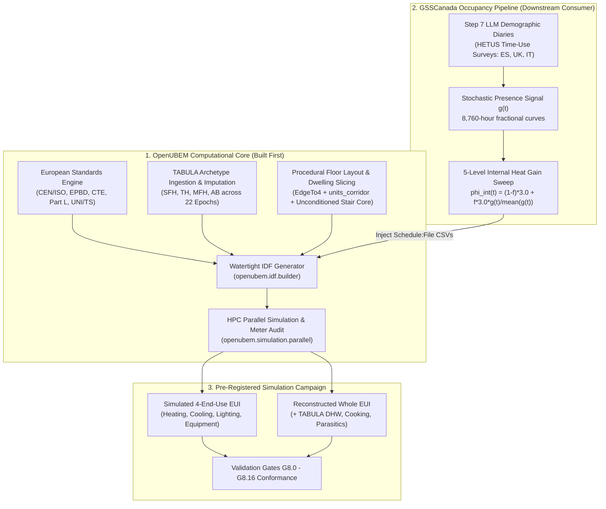
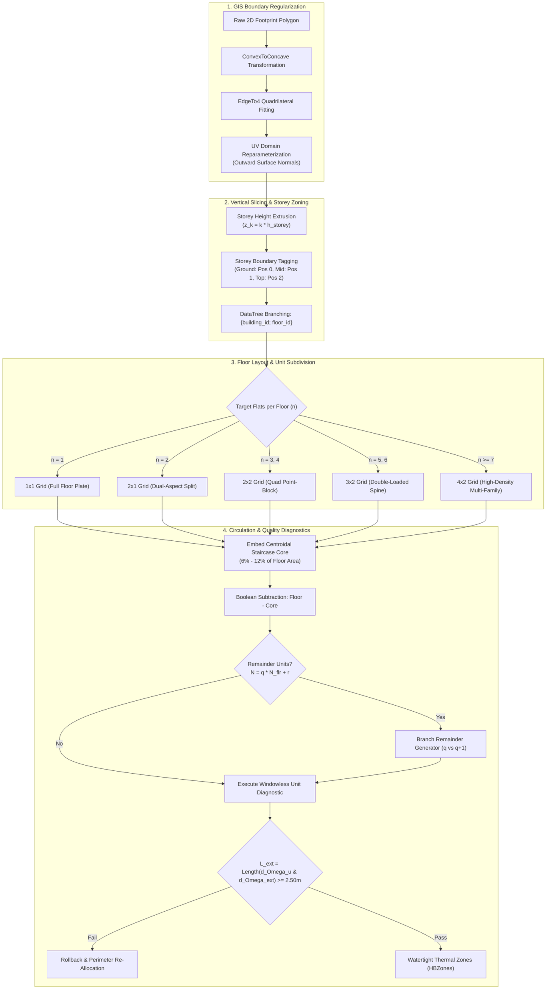

# OpenUBEM European Locations — MVP Implementation Specification

> 🟢 **FROZEN 2026-08-28. This document is HISTORY and is no longer appended to.**
> Current truth lives in [`../STATE_european_locations_v2.md`](../STATE_european_locations_v2.md).
> Everything below is kept unchanged and remains the authority on how each fact was obtained:
> every ruling, finding, gate table, caveat list and acceptance record. Nothing here was
> rewritten in the move. **Do not add to this file** — record new state in the v2 document.

## Architectural Integration of European Standards, Building Typologies, Procedural Floor Layouts, and BEM Simulation Coupling with GSSCanada

- **Document Version**: `1.0.0-PROD`
- **Target Subsystem**: `openubem.data`, `openubem.geometry`, `openubem.idf`, `openubem.semantic`, `openubem.simulation`
- **Location in Repo**: [`docs/docs_ACTIVE/europeanLocations/previous/MVP_european_locations.md`](file:///C:/Users/o_iseri/Desktop/OpenUBEM/docs/docs_ACTIVE/europeanLocations/previous/MVP_european_locations.md)
- **Sister Walkthrough**: [`docs/docs_ACTIVE/europeanLocations/previous/WALKTHROUGH_european_locations.md`](file:///C:/Users/o_iseri/Desktop/OpenUBEM/docs/docs_ACTIVE/europeanLocations/previous/WALKTHROUGH_european_locations.md)
- **GSSCanada Reference**: [`C:\Users\o_iseri\Desktop\GSSCanada\GSSCanada-main\4J_docs_occ\Step8_docs\IMP_step8\4thJ_08_bemSimulation_IMP.md`](file:///C:/Users/o_iseri/Desktop/GSSCanada/GSSCanada-main/4J_docs_occ/Step8_docs/IMP_step8/4thJ_08_bemSimulation_IMP.md)
- **Scientific Provenance** — three distinct tiers, never conflated (citation rule fixed 2026-08-23):
  1. **Published paper**: *Iseri et al. (2025), Energy and Buildings 337, 115620* — supplies the method and the sample (593 residential buildings of 642; 6,458 dwelling units).
  2. **Raw dataset**: `IMP_step8/resources/AllV{1,2,3,4}_updated2023June.csv` — the simulation records behind the paper; recomputable quantities are cited here.
  3. **Derived re-analysis (2026-08-22)**: `IMP_step8/outputs/simulation_results_analysis_report.md`, `floor_layout_generation_report.md`, `kbem_ankara_report.md` — statistics computed from tier 2. **Not the published paper**; cite by filename, never as *Iseri et al. (2025)* alone.
- **Core OpenUBEM Docs**: [`OpenUBEM_fundamentals.md`](file:///C:/Users/o_iseri/Desktop/OpenUBEM/docs/docs_EXPLANATION/OpenUBEM_fundamentals.md), [`OpenUBEM_inputs_reference.md`](file:///C:/Users/o_iseri/Desktop/OpenUBEM/docs/docs_EXPLANATION/OpenUBEM_inputs_reference.md), [`OpenUBEM_imputation_methods.md`](file:///C:/Users/o_iseri/Desktop/OpenUBEM/docs/docs_EXPLANATION/OpenUBEM_imputation_methods.md), [`simulated_vs_reconstructed_methodology.md`](file:///C:/Users/o_iseri/Desktop/OpenUBEM/docs/docs_EXPLANATION/simulated_vs_reconstructed_methodology.md), [`OpenUBEM_debug_References.md`](file:///C:/Users/o_iseri/Desktop/OpenUBEM/docs/docs_EXPLANATION/OpenUBEM_debug_References.md)
- **Reusable Figure/Table Assets**: [`content/`](content/README.md)
- **Parent Step 8 Authorities (tier 1, read before implementing)**: `Step8_docs/4thJ_08_bemSimulation.md` (rulings, progress log), `Step8_docs/4thJ_08_bemSimulation_val.md` (G8/V8 contract, perturbation matrix), `Step8_docs/outputs_step8/archetype_parameter_provenance.md` (what TABULA gives and does not give; open decisions §6), and the existing parameter tables `Step8_docs/outputs_step8/archetype_parameters_{es,uk,it}.csv`. All paths are relative to `C:\Users\o_iseri\Desktop\GSSCanada\GSSCanada-main\4J_docs_occ\`.
- **Revision**: v1.4 (2026-08-26) — **Section 12** records the boundary-closure execution: what was actually built and measured, the rulings taken, the caveat register the contract must carry, and the hand-off protocol. Nothing from v1.0–v1.3 was removed. **Where Section 12 and any earlier section or working plan document disagree, Section 12 governs.**
- **Previous revision**: v1.3 (2026-08-23) —

> **Document role.** This MVP is the principal implementation specification. It owns scientific decisions, scope, interfaces, data contracts, algorithms, acceptance criteria, and the definition of done. The sister walkthrough owns ordered tasks, runnable commands, stop conditions, and the append-only progress log; it must link back here instead of creating a second scientific contract.

> **Implementation-status notice (v1.1 review, 2026-08-22).** The original v1.0 text below is retained in full for provenance. It describes the intended target architecture, not the current repository state. The authoritative, code-audited delta is in **Section 9**. Until the listed implementation and validation work is complete, examples and `[x] PASS`-style claims in the original text must be read as design intent, not evidence of an executed Step 8 campaign.
>
> **Speed/pre-occupant extension.** Section 10 adds the Speed HPC execution profiles and the required Q0–Q3 physics qualification sequence before any `f>0` occupant schedule is authorized.

> **Citation audit (v1.2, closed 2026-08-23).** Every numeric claim attributed to *Iseri et al. (2025)* in this document was searched in the published paper, in `IMP_step8/outputs/`, in `IMP_step8/DeepResearch/`, and in `IMP_step8/resources/`. **Nine attributions failed verification.** They were corrected under [`debugs/DONE/DONE_PLAN_citation-audit-fixes-2026-08-23.md`](debugs/DONE/DONE_PLAN_citation-audit-fixes-2026-08-23.md) (`CLOSED`; rulings in [`debugs/docs/DONE-docs/DECISIONS_pending-rulings-2026-08-23.md`](debugs/docs/DONE-docs/DECISIONS_pending-rulings-2026-08-23.md)). Consequences a reader must know:
> - **The Ankara sample is 593 buildings, not 277.** Section 4.7 no longer presents validation evidence; it presents a *provenance status*, with three quantities recomputed from the raw dataset and the rest marked `UNSOURCED`.
> - **The statistics `63.61 / 15.54 / 75.5% / 3.2×` are not in the published paper** — they come from the 2026-08-22 re-analysis and are cited to it. `75.5%` is a standard-deviation ratio, not a variance ratio.
> - **Anything marked `UNSOURCED` must not be quoted as evidence** in a paper, a report, or a downstream document until its source is named or it is measured anew through the `GEO-01`–`GEO-10` matrix in §4.8.
> - **Section 9.2 was re-verified true in full** against the repository and must not be edited without a fresh code audit.

> **Source-alignment addendum (v1.3, 2026-08-23).** Sections 1–10 were written before the parent Step 8 parameter tables and rulings were read in full. **Section 11** carries the facts from the tier-1 authorities that change how `EU-01`, `EU-03`, `EU-05`, `EU-06` and `EU-07` must be built:
> - the 102-archetype parameter tables **already exist** on the GSSCanada side (`outputs_step8/archetype_parameters_{es,uk,it}.csv`, 24/36/42 rows, 44 columns, with a provenance file and a re-derivation command) — `EU-01` consumes and reconciles them; it does not re-derive from the workbooks blind (§11.3);
> - **all 102 archetypes use the TABULA `EU.SUH`/`EU.MUH` boundary-condition set**, so `phi_int = 3.0 W/m²`, `n_air_use = 0.4 h⁻¹`, `c_m = 45 Wh/(m²·K)`, `θ_i = 20 °C` and the `F_red_htr` scalars are identical in every fold. The country-specific ventilation rates in §2.2.2 and walkthrough §5.4, and the country-specific `c_m` values in §2.3.2, are TABULA *national* rows that the active ruling (`FINDING 57`) deliberately does not use (§11.2);
> - the 22 construction-year bands are listed verbatim with their year boundaries (§11.4), and the Spanish label is `CTE-79`, not `NBE-CT-79`;
> - the three folds do **not** share one archetype structure (ES 24/24, GB 29/32 with parallel parameterisations, IT 42/48 with composite codes) and which row represents a cell is an **open** parent decision (§11.5);
> - the weather windows are **ruled** (`es` 2009–2010, `uk` 2014–2015, `it` 2013–2014) but **not acquired**, and no weather-driven number may be quoted until three named items are on disk (§11.6);
> - the full twelve-row G8 perturbation matrix and the seven V8 vacuity guards are itemised so the `EU-09` scorer can be written against them (§11.8).
>
> Where Section 11 and an earlier section disagree, **Section 11 governs**; the earlier text is retained for provenance and carries an inline `v1.3` note.

> **Boundary-closure record (v1.5, 2026-08-27) — §9.4 is SIGNED and CLOSED.** The boundary contract `openubem/data/campaign/eu_campaign_cell_spec_v1.0.json` was frozen on 2026-08-27 at `FROZEN_PINNED`, independently re-verified as **`510 510 22 FROZEN`**, and signed in `docs/docs_ACTIVE/europeanLocations/DONE/CLOSURE_eu_boundary_contract_v1.0.md`. All four weather folds are pinned (`fr` Lyon 2023, `es` Madrid 2010, `uk` London 2015, `it` Bologna 2014) and **all 510 cells are executable**. **No fold passed DR08 gate 5 cleanly** — each carries a named monthly exception, and `it`'s was **individually ruled as D-EU-19** after the D-EU-18 pre-authorisation refused it. Sections 1–11 specify the interface. **Section 12 records the execution that carries it to signature**, and is the section to read first by anyone receiving this work.
> - One quarter, **FR-LYO-HAUTCOEURPENTES**, was taken end to end on real footprints, real TABULA archetypes, real ERA5-derived weather and real EnergyPlus: 31/31 runs returned 0, severe 0, fatal 0. Area-pooled heating EUI **60.7087 kWh/m²** over 19,823.6173 m² — **restated twice** on 2026-08-26; `31.2144` and `68.8114` are both **withdrawn** and must not be quoted (§12.2, §12.19).
> - **No value in Section 12 is a fleet figure**, and §12.2 states the reasons in the same breath as the number: heating only, `f = 0` only, one weather year, and **26 of the 31 results geometry-limited** (FINDING EU-S2-01).
> - Gates are scored three-way and honestly: **3 PASS / 0 FAIL / 14 VACUOUS**, each vacuity naming the population that was empty. **Vacuous is not a soft pass** — **only three of seventeen gates were actually exercised**, and §12.22 inventories all fourteen empty populations one by one (§12.4, §12.22, §12.9 C-09).
> - **Ruling D-EU-13** corrected a gate-scorer off-by-one that had reported `FAIL` 0/103 on a property the artefacts always satisfied; the restatement was verified outside the gate code and **nothing was re-simulated** (§12.6).
> - **The §9.4 contract did not need to be authored — it was already implemented.** `build_campaign_cells` returns 102 archetypes → 510 validated cells; `epw_path` and `weather_status` were the only unresolved fields, and EU-07/T06 filled exactly those two (§12.9). **Both are resolved as of 2026-08-27: 0 of 510 cells are unpinned.**
> - **§12.10 Table 26 is the caveat register**, **twenty-two** entries, each naming what a consumer must *not* conclude. The freeze copies it verbatim. A caveat may be added at CP-C; **none may be removed**.
> - §12.11 fixes the hand-off protocol, including the two prohibitions that make the boundary symmetric: OpenUBEM never infers the held-out fold, GSSCanada never patches generated IDF internals.

---

## 1. Executive Summary & Strategic Rationale

### 1.1 Why OpenUBEM Must Be Built and Adapted *Before* GSSCanada BEM Simulations

A foundational principle governs this integration: **OpenUBEM is the physical foundation and computational simulation engine; GSSCanada is the demographic occupancy schedule provider.** 



*Figure 1. OpenUBEM provides the European physical model and GSSCanada provides held-out occupant-presence inputs; both meet at the versioned campaign-cell interface before independent validation. Reusable source: [`content/figure_1_1_integration_pipeline.mmd`](content/figure_1_1_integration_pipeline.mmd).*

Attempting to run GSSCanada European BEM simulations without first establishing European physics, building stock definitions, and procedural layout geometry within OpenUBEM results in complete methodological collapse for four fundamental reasons:

1. **Thermodynamic Distortion of North American Defaults**: OpenUBEM's baseline configuration references North American commercial and multi-family standards (ASHRAE Standard 90.1, DOE Prototypes, IECC). US construction defaults feature lightweight wood-stud and steel-frame assemblies with negligible thermal mass, forced-air packaged DX cooling/heating, and commercial continuous ventilation rates ($0.8\text{--}1.5\text{ ACH}$). Injecting European demographic occupancy profiles into lightweight US structures causes severe, non-physical indoor temperature spikes, because the structural thermal capacitance ($c_m$) that buffers real European masonry buildings is completely absent. This capacitance argument is qualitative here; no quantified US-versus-European construction penalty has been sourced for this arc. The separate, sourced quantity is the *zoning-resolution* effect: annual space-heating demand shifts by $12\%\text{--}35\%$ between single-zone and unit-level models (`IMP_step8/DeepResearch/DR03_thermal_zoning_resolution_and_energy_impacts.md`, §Summary). The two effects must not be conflated.
2. **Spatial Topology & Inter-Dwelling Heat Transfer**: European residential stocks (especially Multi-Family Houses `MFH` and Apartment Blocks `AB`) consist of compartmentalized dwelling units arranged around central unconditioned staircase cores. Empirical research across **6,458 dwelling units in 593 residential buildings** (*Iseri et al., 2025*; the paper states 593 residential buildings of 642 in the study area) shows that coarse building-level modeling **suppresses $>75.5\%$ of the inter-dwelling energy standard deviation** (standard deviation drops from $63.61$ to $15.54\text{ kWh}/\text{m}^2\text{a}$) and underestimates extreme thermal vulnerability by a factor of $3.2\times$. Those four statistics are **not printed in the published paper**; they are computed in the 2026-08-22 re-analysis of the paper's own simulation data (`IMP_step8/outputs/simulation_results_analysis_report.md`, lines 24–29, from `resources/AllV{1,2,3,4}_updated2023June.csv`) and must be cited to that report. Note also that $75.5\%$ is a *standard-deviation* ratio, not a variance ratio; the same data expressed as variance give $\approx 94\%$. Modeling a whole floor as a single lumped zone erases party-wall conduction between adjacent flats — which accounts for $15\%\text{--}35\%$ of net heat loss **for corner and top-floor units adjacent to cooler or vacant dwellings** (`DR03`, row 4; the range is conditional on that adjacency and is not a whole-stock average) — and fails to capture the thermal buffering of unconditioned circulation spaces ($b_u = 0.50\text{--}0.80$).
3. **Strict Separation of Concerns (Engine vs. Domain Scenario)**: OpenUBEM is designed as a reusable, reproducible, pip-installable Python package (`openubem`). GSSCanada Step 8 is a scientific scenario driver that tests demographic hypotheses on European housing. Building the geometry generators, TABULA construction translators, and schedule ingestion hooks inside `openubem` ensures that OpenUBEM remains a general-purpose Urban Building Energy Modeling framework, while GSSCanada simply orchestrates campaign sweeps via clean API calls.
4. **Pre-Registered Validation Gate Compliance**: The 4J HETUS Step 8 pre-registered protocol mandates strict validation gates (Gate **G8.0** uninjected control at $f=0.00$, Gate **G8.8** scenario differentiation, Gate **G8.13** `Interpolate to Timestep = No` on `Schedule:File` objects, and Gate **G8.10** meter energy balance). These gates require low-level structural assertions in OpenUBEM's IDF builder, EnergyPlus output dictionary parser, and manifest logger.

---

## 2. European Building Standards & Energy Physics Framework

### 2.1 Pan-European Normative Stack (CEN / ISO / EPBD)

OpenUBEM's European engine parameterizes building physics in strict compliance with the European Committee for Standardization (CEN) and International Organization for Standardization (ISO) standards hierarchy:

| Standard / directive | Scope and implementation role |
|---|---|
| EPBD (EU) 2024/1275 | European energy-performance framework; the applicable national implementation remains authoritative. |
| EN ISO 52016-1:2017 | Hourly heating/cooling needs and zone heat-balance framework. |
| EN 16798-1:2019 | Indoor-environment input parameters and comfort categories. |
| EN 410 / EN 673 | Glazing solar and thermal properties, including $g_{gl}$ and $U_w$. |
| ISO 18523-2:2018 | Residential usage schedules as a contextual reference; it does not replace held-out Step 7 diaries. |
| TABULA / EPISCOPE | Residential typology structure and national example-building data. The ES/GB/IT occupant campaign has 102 target records; France is included in the physical-model branch and deferred only for occupant schedules. |

*Table 1. Normative sources used to define or contextualize European residential model inputs. Machine-readable copy: [`content/table_2_1_normative_stack.csv`](content/table_2_1_normative_stack.csv).*

### 2.2 Country-Specific Statutory Codes & Archetype Crosswalk

Spain, England-limited `GB`, and Italy form the current **occupant-schedule** campaign. France is in scope now for residential stock preparation, neighbourhood generation, geometry/IDF construction, weather preparation, and baseline physical simulation. France-specific occupant schedules and the five-level occupant-effect sweep remain future work, so France does not yet change the frozen ES/GB/IT occupant counts or 510-run total.

| Dimension | Spain (`ES`) | England-limited stock (`GB`) | Italy (`IT`) | France (`FR`) — physical now / occupants later |
|---|---|---|---|---|
| Building/neighbourhood pipeline | `IN_SCOPE` | `IN_SCOPE` | `IN_SCOPE` | `IN_SCOPE` |
| Baseline physical simulation | `IN_SCOPE` | `IN_SCOPE` | `IN_SCOPE` | `IN_SCOPE_AFTER_FR_REGISTRY_AUDIT` |
| Occupant-schedule sweep | `IN_SCOPE` | `IN_SCOPE` | `IN_SCOPE` | `FUTURE_SCOPE` |
| Primary new-build code | CTE DB-HE | Building Regulations Part L | DM 26/06/2015 | RE2020 |
| Regulatory calculation context | HULC | SAP | UNI/TS 11300 | Th-BCE 2020 |
| Existing-home energy record | CEE/EPC | EPC | APE | DPE |
| Campaign archetype count | 24 | 36 | 42 | `NOT_AUDITED` |
| Weather and diary alignment | Required and unresolved until manifest acceptance | Required and unresolved until manifest acceptance | Required and unresolved until manifest acceptance | `NOT_SELECTED` |
| Effect on occupant-campaign totals | Included in 102/510 | Included in 102/510 | Included in 102/510 | No effect on 102/510 until French occupant inputs are approved |

*Table 2. Regulatory and campaign-scope crosswalk. France is included in the physical building/neighbourhood pipeline; only its occupant-schedule sweep is deferred. Regulatory values remain candidates until the France registry and parameter provenance pass acceptance. Sources: [French RE2020 consolidated texts](https://rt-re-batiment.developpement-durable.gouv.fr/textes-de-la-re2020-en-version-consolidee-a617.html?lang=fr), [Th-BCE 2020 engine](https://rt-re-batiment.developpement-durable.gouv.fr/gestion-des-versions-du-rsee-et-du-moteur-de-a688.html?lang=fr), [French DPE](https://www.ecologie.gouv.fr/politiques-publiques/diagnostic-performance-energetique-dpe), and [TABULA France country page](https://episcope.eu/building-typology/country/fr/). Machine-readable copy: [`content/table_2_2_country_crosswalk.csv`](content/table_2_2_country_crosswalk.csv).*

#### 2.2.1 France Physical-Pipeline Gate (`FR-PHYS`) and Occupant Deferral (`FR-OCC-FUTURE`)

France proceeds now through acquisition, residential filtering, semantic mapping, procedural layouts, envelope/HVAC/weather preparation, saved-IDF audits, and baseline physical simulations. Before those baseline simulations are accepted, the France branch must reproduce an authoritative residential typology registry, define construction-period crosswalks, select baseline weather, validate national envelope/HVAC assumptions, and pass the same geometry, saved-IDF, meter, warning, and mutation gates. TABULA/EPISCOPE documents a French residential typology, and an EPISCOPE synthesis describes 26 French building families, but the exact production subset and count remain `NOT_AUDITED` for OpenUBEM.

The France occupant branch is separately labelled `FR-OCC-FUTURE`. It begins only when a France-compatible held-out diary/model source, leakage controls, fieldwork-aligned weather window, and schedule manifest are accepted. Until then, French baseline runs must use the controlled non-stochastic schedule path and must not be merged into the ES/GB/IT 510-case occupant-effect denominator.

#### 2.2.2 European Ventilation Rate Equivalence (EN 16798-1 Table B.4)
EN 16798-1 Table B.4 specifies baseline residential fresh air rates of $0.23\text{--}0.35\text{ L}/(\text{s}\cdot\text{m}^2)$ (approximately $0.30\text{--}0.60\text{ ACH}$). The country-specific values above are TABULA boundary-condition implementations of this range.

> [!IMPORTANT]
> **Campaign value (v1.3, 2026-08-23).** Every one of the 102 frozen archetypes points at the TABULA `EU.SUH` / `EU.MUH` boundary-condition rows, whose `n_air_use` is **$0.4\text{ h}^{-1}$ in all three folds** (§11.2; `4thJ_08_bemSimulation.md` lines 313–320). The country-specific rates $0.40 / 0.59 / 0.30\text{ h}^{-1}$ quoted for ES / GB / IT elsewhere in this arc are the TABULA *national* rows (`ES.SUH`, `GB.Gen`, `IT.SUH`). They are **not** the campaign values: the parent ruling keeps the EU set precisely because the national set adds a factor-two air-change difference that is country-correlated and therefore confounded with the held-out-fold signal. National rates may be run only as a separately declared sensitivity, never mixed into the 510-cell matrix.

#### 2.2.3 Intermittent Heating Reduction Factors ($F_{\text{red,htr}}$)
European standards apply intermittent heating correction as transmission multipliers on $UA$, not as thermostat night-setback schedules (TABULA `Tab.BoundaryCond`; EN ISO 13790:2008 Section 13.2):
- Single-Use Housing (`EU.SUH`): $F_{\text{red,htr1}} = 0.90$, $F_{\text{red,htr4}} = 0.80$
- Multi-Use Housing (`EU.MUH`): $F_{\text{red,htr1}} = 0.95$, $F_{\text{red,htr4}} = 0.85$

These are preserved as scalar transmission reductions in the campaign. **No scheduled thermostat night-setback is added**, to prevent confounding with the LLM-generated stochastic occupancy signal (Pre-Registered Ruling `D-S8-2`).

#### 2.2.4 Italian Area-Dependent Internal Gain Formula (UNI/TS 11300-1 Table 1)
While the campaign uses the harmonized TABULA $3.0\text{ W}/\text{m}^2$ baseline, the Italian national standard defines a more nuanced area-dependent formula:
$$\Phi_{\text{int}} = 4.0\text{ W}/\text{m}^2 \quad (A_{\text{floor}} \le 120\text{ m}^2); \qquad \Phi_{\text{int}} = 4.0 \cdot \left(\frac{120}{A_{\text{floor}}}\right)^{0.2}\text{ W}/\text{m}^2 \quad (A_{\text{floor}} > 120\text{ m}^2)$$
This is recorded as contextual information, not as the Step 8 campaign baseline.

#### 2.2.5 Overheating Assessment Standards
European residential overheating is assessed using the adaptive comfort model (EN 16798-1 Section 6.2, Annex A) and cumulative degree-hours above threshold ($IOD$). The UK additionally requires compliance with **CIBSE TM59 (2017)**:
- *Criterion A*: Living/bedrooms must not exceed $\Delta T \ge 1\text{ K}$ above the comfort limit for more than $3\%$ of occupied hours.
- *Criterion B*: Bedrooms must not exceed $26^\circ\text{C}$ for more than $32\text{ hours}$ between 22:00–07:00.

These criteria require hourly zone-level operative temperatures, which are available from the EnergyPlus dwelling-level output.

### 2.3 Physical Parameter Ingestion & Translation

#### 2.3.1 Parametric Opaque Assembly Sizing (`openubem.idf.opaque_assembly`)
Unlike North American models with fixed nominal lumber or steel studs, European envelope retrofits and epoch standards vary widely in continuous insulation thickness. OpenUBEM sizes insulation dynamically:
$$d_{\text{ins}} = \lambda_{\text{ins}} \cdot \left(\frac{1}{U_{\text{target}}} - R_{\text{si}} - R_{\text{se}} - \sum_{j} \frac{d_j}{\lambda_j}\right)$$

Where standard European material thermal properties are applied:
- Outer clay brick masonry: $d = 0.20\text{ m}$, $\lambda = 0.79\text{ W}/(\text{m}\cdot\text{K})$, $\rho = 1800\text{ kg}/\text{m}^3$, $c_p = 1000\text{ J}/(\text{kg}\cdot\text{K})$
- Reinforced concrete panel: $d = 0.15\text{ m}$, $\lambda = 1.40\text{ W}/(\text{m}\cdot\text{K})$, $\rho = 2300\text{ kg}/\text{m}^3$, $c_p = 1000\text{ J}/(\text{kg}\cdot\text{K})$
- Expanded Polystyrene (EPS) insulation: $\lambda_{\text{ins}} = 0.038\text{ W}/(\text{m}\cdot\text{K})$, $\rho = 25\text{ kg}/\text{m}^3$, $c_p = 1400\text{ J}/(\text{kg}\cdot\text{K})$
- Interior gypsum plaster: $d = 0.015\text{ m}$, $\lambda = 0.25\text{ W}/(\text{m}\cdot\text{K})$, $\rho = 900\text{ kg}/\text{m}^3$, $c_p = 1000\text{ J}/(\text{kg}\cdot\text{K})$
- Surface resistances per EN ISO 6946: $R_{\text{si}} = 0.13\text{ m}^2\cdot\text{K}/\text{W}$ (horizontal heat flow, walls), $R_{\text{se}} = 0.04\text{ m}^2\cdot\text{K}/\text{W}$ (external).

#### 2.3.2 Explicit Internal Thermal Mass Injection (`openubem.idf.builder`)
To prevent numerical instability, realistic European thermal inertia must be embedded. In accordance with EN ISO 52016-1 Table B.14 (five standard classes: Very Light $80\text{ kJ}/(\text{m}^2\cdot\text{K})$ / $14\text{ Wh}$, Light $110 / 28$, Medium $165 / 45$, Heavy $260 / 78\text{--}87$, Very Heavy $370 / 105\text{ Wh}/(\text{m}^2\cdot\text{K})$), OpenUBEM injects `InternalMass` objects into every dwelling zone:
- Mass surface area: $A_{\text{mass}} = 1.5 \times A_{\text{floor}}$
- Mass material thickness: $d_{\text{mass}} = 0.10\text{ m}$ (representing interior brick partition / concrete slab)
- Thermal capacitance calibration (project values mapped from Table B.14 classes):
  - Standard European Medium/Heavy: $c_m = 45.0\text{ Wh}/(\text{m}^2\cdot\text{K})$ — Medium class
  - Spain / Central Europe Heavy: $c_m = 50.0\text{ Wh}/(\text{m}^2\cdot\text{K})$ — between Medium and Heavy
  - Italy Very Heavy (`IT`): $c_m = 87.0\text{ Wh}/(\text{m}^2\cdot\text{K})$ — Heavy class upper bound
  - UK Medium-Light (`GB`): $c_m = 32.8\text{ Wh}/(\text{m}^2\cdot\text{K})$ — between Light and Medium

> [!NOTE]
> The country-specific $c_m$ values are project mapping decisions from the five EN ISO 52016-1 classes, not exact Table B.14 entries. Their provenance must be recorded alongside the archetype parameters.

> [!IMPORTANT]
> **Campaign value (v1.3, 2026-08-23).** On the `EU.SUH` / `EU.MUH` boundary conditions that all 102 archetypes use, **$c_m = 45\text{ Wh}/(\text{m}^2\cdot\text{K})$ in all three folds** (§11.2). The `GB` $32.8$ and `IT` $87$ values above coincide with TABULA's national rows (`GB.Gen` $32.79$, `IT.SUH` $87$), which the active ruling (`FINDING 57`) deliberately does not use, and the `ES` $50$ value does not match the `ES.SUH` row ($45$) that the parent table lists — its origin is not a TABULA boundary-condition row and must be declared. Ruling Q5-A (2026-08-23) left this subsection standing as a declared mapping decision; `EU-03` must realise the **EU** value of $45$ for every campaign cell unless a separate sensitivity is approved and recorded. How $45\text{ Wh}/(\text{m}^2\cdot\text{K})$ is reproduced with real material layers is parent open decision §6 item 3 (§11.9) — the inverse problem has many answers and the chosen one must be declared.

#### 2.3.3 Fenestration & Total Solar Energy Transmittance (`openubem.idf.surfaces`)
European fenestration standards specify total solar energy transmittance ($g_{\text{gl}}$ per EN 410 / ISO 9050) rather than North American Solar Heat Gain Coefficient ($\text{SHGC}$). In EnergyPlus, `WindowMaterial:SimpleGlazingSystem` is parameterized:
$$\text{SHGC} = g_{\text{gl}}, \quad U_{\text{factor}} = U_w$$
The conversion is valid within $\pm 0.02$ for standard residential glazing types. Typical European ranges: standard double clear $g_{\text{gl}} = 0.67\text{--}0.75$; low-emissivity $g_{\text{gl}} = 0.50\text{--}0.60$ (per EN 410:2011).

---

## 3. European Building Typologies & Data Ingestion

### 3.1 TABULA Building Type Hierarchy

OpenUBEM ingests four standard residential typologies defined in the TABULA / EPISCOPE framework:

| Typology | Building type | Typical storeys | Target dwelling layout |
|---|---|---:|---|
| `SFH` | Single-family house | 1–2 | One dwelling zone per storey, with the vertical aggregation rule declared. |
| `TH` | Terraced house | 2–3 | One dwelling zone per storey plus paired party walls. |
| `MFH` | Multi-family house | 3–5 | Two to four dwellings per storey plus circulation core. |
| `AB` | Apartment block | 4–10+ | Four to eight or more dwellings per storey plus corridor/core. |

*Table 3. Residential typology taxonomy used for ES, GB, IT, and the France physical-model branch. National sources determine the actual period/type combinations; this generic table does not establish country counts. Machine-readable copy: [`content/table_3_1_typology_taxonomy.csv`](content/table_3_1_typology_taxonomy.csv).*

### 3.2 Four-Tier Imputation Cascade for European Footprints

When querying European OpenStreetMap footprints or municipal geospatial portals (e.g. Spanish Catastro, UK Ordnance Survey, Italian Agenzia delle Entrate), missing data attributes are resolved via OpenUBEM's **Four-Tier Imputation Cascade** ([`OpenUBEM_imputation_methods.md`](file:///C:/Users/o_iseri/Desktop/OpenUBEM/docs/docs_EXPLANATION/OpenUBEM_imputation_methods.md)):


*Figure 2. Four-tier imputation cascade. Tiers execute in the current router order—fusion, spatial, opt-in ML, then statistical—and every accepted value is independently checked and labelled with provenance. Failure of all tiers is `BLOCKED/EXCLUDED`, never a silent default. Reusable sources: [`SVG`](content/figure_3_2_imputation_cascade.svg) and [`Mermaid`](content/figure_3_2_imputation_cascade.mmd).*

#### Strict Imputation Rules:
- **Zero Fitted Parameters Rule**: Imputation never invents parameters or adjusts coefficients to match an energy target.
- **Minimum Ceiling Height Floor**: All heights are constrained to $h_{\text{min}} \ge 2.10\text{ m}$ per international building code requirements.
- **Full Traceability**: Every imputed property carries an immutable provenance token (e.g., `HOTDECK_NEIGHBOR_HIGH`, `STATISTICAL_PDE`).

---

## 4. Procedural Floor Layout & Dwelling Slicing Engine

### 4.1 Algorithmic Geometry Pipeline (from *Iseri et al., 2025* & `kbem_ankara_pipeline.py`)

OpenUBEM's `openubem.geometry.layoutGenerator` implements the 4-stage procedural spatial layout algorithm:



*Figure 3. Procedural geometry pipeline from validated residential footprint to watertight dwelling/core zones. Reusable source: [`content/figure_4_1_geometry_pipeline.mmd`](content/figure_4_1_geometry_pipeline.mmd).*

### 4.2 Slicing Rules & Orthogonal Grid Subdivision


*Figure 4. Conceptual dwelling subdivision schemes. These diagrams express topology, not surveyed room plans; acceptance depends on the tests in Section 4.8. Reusable source: [`content/figure_4_2_dwelling_layout_schemes.svg`](content/figure_4_2_dwelling_layout_schemes.svg).*

#### Grid Assignment Rules:
- **$1 \times 1$ Grid**: Single-Family (`SFH`) / Terraced (`TH`) — 1 thermal zone per floor.
- **$2 \times 1$ Grid**: Small Multi-Family — 2 dual-aspect dwelling units per floor.
- **$2 \times 2$ Grid**: Point-Block `MFH` — 4 corner quadrant dwelling units surrounding a centroidal stairwell core.
- **$3 \times 2$ Grid**: Medium Apartment Block `AB` — 6 dwelling units (4 corner dual-aspect + 2 middle single-aspect) along a central corridor.
- **$4 \times 2$ Grid**: Large Apartment Block `AB` — 8 dwelling units along a central double-loaded circulation spine.

### 4.3 Unconditioned Staircase Core & Buffer Zone Physics

Communal circulation spaces (staircase, elevator shaft, entry vestibule) represent $6\%\text{--}12\%$ of gross floor area ($12.0\text{--}25.0\text{ m}^2$ per floor; mean $18.4\text{ m}^2$ in the Ankara validation dataset).
- **Zoning Classification**: OpenUBEM models the staircase core as an **explicit unconditioned thermal zone** (`mode: "unconditioned_buffer"`).
- **Thermal Behavior**: The staircase zone floats passively ($12.0^\circ\text{C}\text{--}16.0^\circ\text{C}$ in winter), buffering heat transfer across party walls between heated apartments and the exterior:
  $$b_u = \frac{T_i - T_u}{T_i - T_e} \approx 0.50\text{ to }0.80$$
  The magnitude of this buffering is `UNSOURCED` as previously stated: "reduces adjacent dwelling heating demand by $8\%\text{--}15\%$ (*Iseri et al., 2025*)" cannot be verified — the paper's extracted text contains neither the word "stair" nor "buffer" and no such percentage (verified 2026-08-23). The nearest sourced quantity is different in kind: the unconditioned stair core moderates **party-wall transmission losses** by $30\%\text{--}50\%$ at $b_u = 0.50\text{--}0.80$ (`IMP_step8/DeepResearch/DR07_adapting_openubem_to_european_standards.md`, row 8; `IMP_step8/outputs/floor_layout_generation_report.md:299`). Use the sourced transmission figure, and do not restate an adjacent-dwelling demand reduction until it is measured for the European stock.
- **Infiltration Rate**: Staircase zones are assigned a background infiltration rate of $0.000500\text{ m}^3/(\text{s}\cdot\text{m}^2)$ representing natural air leakage through entry doors and service risers.
- **Inter-Zone Surfaces**: Walls separating dwellings from the staircase core are assigned EnergyPlus boundary condition `Surface` linked to the adjacent stair zone.
- **Party-Wall Heat Transfer**: Inter-dwelling conduction through shared walls accounts for $15\%\text{--}40\%$ of net apartment heat loss during unheated or lower-setpoint periods in adjacent flats:
  $$Q_{\text{party}} = U_{\text{party}} \cdot A_{\text{party}} \cdot \left(T_{u1}(t) - T_{u2}(t)\right)$$

### 4.4 Habitability & Windowless Unit Sanity Gate

To ensure that automated polygon slicing never generates illegal, interior-enclosed dwelling units without exterior access, OpenUBEM enforces the **Windowless Unit Diagnostic Gate**:
$$L_{\text{exterior}} = \text{Length}\left(\partial \Omega_u \cap \partial \Omega_{\text{exterior}}\right) \ge 2.50\text{ m}$$

If any generated dwelling unit has $L_{\text{exterior}} < 2.50\text{ m}$, the layout generator rejects the invalid cut and falls back to a conforming single-loaded or dual-aspect subdivision.

### 4.5 Non-Integer Unit Remainder Stratification

When cadastral records specify a total building unit count $N_{\text{units}}$ that is not divisible by storeys $N_{\text{floors}}$:
$$N_{\text{units}} = q \cdot N_{\text{floors}} + r, \quad \text{where } q = \lfloor N_{\text{units}} / N_{\text{floors}} \rfloor, \quad 0 \le r < N_{\text{floors}}$$
- $N_{\text{floors}} - r$ storeys are partitioned into $q$ units/floor.
- $r$ storeys (typically lower floors) are partitioned into $q + 1$ units/floor.

### 4.6 Geometry Fallback Hierarchy

When a footprint is too narrow, irregular, or degenerate for the target grid, the layout generator applies a deterministic fallback hierarchy:
1. Attempt the assigned grid ($2\times 2$, $3\times 2$, etc.)
2. If failed → fall back to the next smaller grid ($2\times 2 \to 2\times 1$)
3. If still failed → fall back to $1\times 1$ (full floor plate as single zone)

Every fallback is recorded with an explicit reason token (e.g., `NARROW_FOOTPRINT`, `DEGENERATE_SHAPE`). Fallback must never masquerade as dwelling-level success.

### 4.7 Ankara KBEM Reference Statistics — Provenance Status

> [!WARNING]
> **Provenance verification and recomputation, 2026-08-23.** The figures previously listed in this section as
> validation evidence were searched across the published paper (`IMP_step8/resources/1-s2.0-S0378778825003500-main.pdf`),
> `IMP_step8/outputs/*.md`, `IMP_step8/DeepResearch/*.md`, `IMP_step8/4thJ_08_bemSimulation_IMP.md`, and raw data
> (`IMP_step8/resources/AllV{1,2,3,4}_updated2023June.csv`).
> Quantities recomputable from the raw simulation data have been replaced with verified values; unrecoverable geometry pipeline diagnostics remain marked `UNSOURCED`.

Reference statistics associated with the Ankara KBEM dataset (*Iseri et al., 2025* and raw simulation dataset `IMP_step8/resources/AllV*.csv`):

- **Sample** — `SOURCED`: **593 residential buildings** of 642 buildings in the study area,
  **6,458 dwelling units** (paper, Section "simulation process includes detailed modelling and
  analysis of the residential buildings"; corroborated at `IMP_step8/outputs/kbem_ankara_report.md:5`
  and `:377`, and recomputed identically across `IMP_step8/resources/AllV{1,2,3,4}_updated2023June.csv`).
  The previously asserted figures of "277 buildings processed" and "1,444 floors" are contradicted
  by the raw data and the paper.
- **Dwelling floor area** — `SOURCED` (recomputed from raw data): **Mean dwelling floor area $109.11\text{ m}^2$**
  (range: **$18.70\text{--}434.80\text{ m}^2$**) recomputed directly across all 6,458 records in
  `IMP_step8/resources/AllV*.csv`. The previously stated figures of "$87.3\text{ m}^2$ (range: $32\text{--}215\text{ m}^2$)"
  were not merely uncited but positively contradicted by the genuine dataset.
- **Vertical positions** — `SOURCED` (recomputed from raw data): 3 distinct vertical positions across the
  6,458 dwelling units (**1,667 ground-floor**, **3,450 middle-floor**, **1,341 top-floor** units)
  in `IMP_step8/resources/AllV*.csv`.
- **Success rate** — `UNSOURCED`: the claim "252/277 buildings (91.7%) successfully subdivided into
  dwelling-level zones" has no recoverable source in the simulation results or paper. Target behavior must
  be benchmarked via the European `GEO-01`–`GEO-10` matrix (§4.8).
- **Fallback rate** — `UNSOURCED`: the claim "25 buildings (8.3%) fell back to single-zone-per-floor
  (causes: narrow footprints $<8\text{ m}$ width, L-shaped/highly irregular shapes)" has no source.
  The failure *causes* remain a plausible engineering statement; only the counts are unverified.
- **Area conservation** — `UNSOURCED` as a measured result: "$\le 0.5\%$ error for all successful
  subdivisions; zero overlaps detected" is not reported in any pipeline log. The formal requirement is
  governed by Section 9.8 (acceptance tolerance $\le 1\%$, verified by `GEO-01`).
- **Facade contact** — `UNSOURCED` as a measured result: "All dwelling units passed the
  $2.50\text{ m}$ exterior threshold" is not an observed outcome but a declared project modeling
  rule (see the note below).

Every line marked `UNSOURCED` above cannot be recovered from the Ankara dataset and must be measured
anew through the European `GEO-01`–`GEO-10` verification matrix in Section 4.8 before being cited as
validation evidence.

> [!NOTE]
> The $2.50\text{ m}$ facade-contact threshold originates from IRC Section R303 and Turkish Zoning Law. It is treated as a declared project modeling rule whose jurisdictional provenance must be confirmed for each European stock (see Section 9.8).

### 4.8 Verification Protocol and Grasshopper Parity Tasks

> [!IMPORTANT]
> 🔴 **`GEO-08` is RE-BASED by owner ruling, 2026-08-28 — `D-EU-04-F` option F4, superseding the 2026-08-25 F2 deferral.** The owner ruled that this arc is **Python-only** and that no Rhino/Grasshopper runtime will be used. `GEO-08` is therefore **neither deferred nor waived: its reference is replaced.** The cross-implementation check is now a **second, independently written Python partitioner** that shares no code with `openubem.geometry`, processes the same input footprints, and is compared on the same normalized quantities — zone count, areas, exterior contact, adjacency, ordering ignored.
>
> Four consequences, all binding:
>
> 1. **This is no longer Grasshopper parity, and must never be written as such.** Parity with the Ankara/Grasshopper method is recorded as **NOT TESTED**; any such claim is `UNSOURCED` under §0. What `GEO-08` now asserts is *independent-reimplementation agreement*, which is a weaker and different claim.
> 2. **The reference must be genuinely independent** — written from this section's stated rules, importing nothing from `openubem.geometry`. A reference that calls the implementation under test proves nothing, and that independence is itself asserted by the test.
> 3. 🔴 **The neighbourhood `.html` visualisation is NOT part of `GEO-08`.** §4.8's own rule stands unchanged: *visual similarity alone is not a pass.* The viewer is an inspection aid and may never be cited as parity or acceptance evidence.
> 4. ⚪ `GEO-03`'s comparison column read *"Python vs. Grasshopper export"*. No Grasshopper export exists or will exist, so that half is void under the same ruling; `GEO-03` was in fact accepted on the local supplied-partition audit (§9.7.3, `EU-04`), and the column below is restated to what was actually run. Its assertion and acceptance are unchanged.

Grasshopper is an independent geometric reference, not the acceptance authority. A normalized exchange format—GeoJSON or WKT in a pinned projected CRS—must allow the Grasshopper definition and `openubem.geometry.layoutGenerator` to process the same input footprints. The comparison ignores object ordering and compares topology, zone count, areas, exterior contact, circulation area, and adjacency.

| Test | Fixture/sample | Required assertion | Independent comparison or mutation | Acceptance |
|---|---|---|---|---|
| `GEO-01` | Axis-aligned rectangle | Area conservation and expected dwelling count | Independent polygon union | Error $\le 1\%$; no gaps/overlaps |
| `GEO-02` | Rotated rectangle | Orientation invariance | Rotate input and inverse-transform output | Same topology and areas within tolerance |
| `GEO-03` | L-shaped footprint | Valid non-convex subdivision | Independent local supplied-partition audit *(was "Python vs. Grasshopper export"; void under `D-EU-04-F` F4)* | All zones valid or explicit fallback |
| `GEO-04` | Narrow footprint | Deterministic fallback | Sweep width across the registered threshold | Stable reason token; no false success |
| `GEO-05` | Courtyard footprint | Hole preservation | Independent topology audit | No dwelling/core crosses the courtyard |
| `GEO-06` | MFH/AB storey stacks | Reciprocal interzone surfaces | Reopen saved IDF | Exactly one mate for every party face |
| `GEO-07` | Non-integer dwelling count | Remainder allocation | Independent quotient/remainder calculation | Exact total and deterministic storey assignment |
| `GEO-08` | Independent second Python implementation *(was: Grasshopper golden set; re-based by `D-EU-04-F` F4, 2026-08-28)* | Independent-reimplementation agreement — **not** Grasshopper parity | Compare normalized exports of two implementations sharing no code | Equal zone count; area/contact within tolerance |
| `GEO-09` | Corrupted clean fixture | Gate sensitivity | Inject overlap, gap, and unpaired face | Named gate fails; restored fixture passes |
| `GEO-10` | Residential sample groups | Scale/stability | Accounting audit over the retained `S1`/`S2`/`S3` manifests — **4 synthetic + 12 / 31 / 96 observed**, not 32 | Every attempted building accounted for before neighbourhood scale — **scored 2026-08-28, 14 / 14** |

*Table 4. Verification matrix for the procedural floor-layout method and its negative controls. **`GEO-08` was re-based to an independent second Python implementation by `D-EU-04-F` F4, 2026-08-28; parity with Grasshopper itself remains NOT TESTED.** Machine-readable copy: [`content/table_4_8_geometry_verification_matrix.csv`](content/table_4_8_geometry_verification_matrix.csv).*

Each `GEO-*` task must retain the input footprint, generator configuration, normalized OpenUBEM export, comparison report, preview image, and test command. *(The "normalized Grasshopper export" this list formerly required is void under `D-EU-04-F` F4, 2026-08-28; for `GEO-08` the retained artefact is the independent second implementation's normalized export instead.)* Visual similarity alone is not a pass; numerical and topological assertions decide acceptance.

---

## 5. Stochastic Occupancy Injection & 5-Level Sensitivity Sweep

### 5.1 Mathematical Ingestion Formulation

The occupancy-driven internal gain schedule $\phi_{\text{int}}(t)$ is defined by the pre-registered five-level sensitivity sweep formula:
$$\phi_{\text{int}}(t) = (1 - f) \cdot 3.0 + f \cdot 3.0 \cdot \frac{g(t)}{\text{mean}_{8760}(g(t))}, \quad f \in \{0.00, 0.15, 0.30, 0.50, 1.00\}$$

| Level | Factor | Meaning | Campaign status |
|---:|---:|---|---|
| 1 | `0.00` | Flat $3.0\text{ W}/\text{m}^2$ control through the final `Schedule:File` path | Required |
| 2 | `0.15` | Mild modulation with annual-mean conservation | Required |
| 3 | `0.30` | Moderate modulation; not a privileged calibration level | Required |
| 4 | `0.50` | High modulation with annual-mean conservation | Required |
| 5 | `1.00` | Fully presence-shaped profile normalized to a $3.0\text{ W}/\text{m}^2$ annual mean | Required |

*Table 5. Five occupant-effect levels for the ES/GB/IT occupant campaign. France uses only the controlled baseline physical path until `FR-OCC-FUTURE` is activated. Machine-readable copy: [`content/table_5_1_sensitivity_sweep.csv`](content/table_5_1_sensitivity_sweep.csv).*

#### Fundamental Ingestion Theorems:
1. **Strict Energy Conservation**: $\int_0^{8760} \phi_{\text{int}}(t)\,dt = 3.0 \times 8760 = 26,280\text{ Wh}/\text{m}^2$ for all $f \in \{0.00, 0.15, 0.30, 0.50, 1.00\}$. All observed heating energy variations represent pure temporal load shifting.
2. **`Schedule:File` Ingestion Architecture**: The 8,760 hourly multipliers are written to external CSV files and referenced via EnergyPlus `Schedule:File` objects with `Interpolate to Timestep = No` (enforced per Gate **G8.13**).
3. **Inter-Household Heterogeneity**: In multi-dwelling archetypes (`MFH`, `AB`), each dwelling unit zone $u \in \{1, \dots, N_{\text{units}}\}$ receives an independently sampled demographic presence curve $g_u(t)$ from the held-out LOCO fold population.

### 5.2 HVAC Plant Modeling Decision (DR07)

Resolving full explicit EnergyPlus hydronic plant loops (boilers, pumps, valves, distribution piping) across 510 multi-zone models introduces severe numerical convergence failures. The campaign standardizes on `ZoneHVAC:IdealLoadsAirSystem` post-processed with natural gas condensing boiler seasonal efficiency curves ($\eta_{\text{seasonal}} = 0.90$, range $0.88\text{--}0.94$), which preserves identical envelope heat balance while achieving 100% convergence across the full campaign matrix.

### 5.3 Natural Ventilation Assumption

The European campaign maintains a closed-window assumption with continuous background infiltration per TABULA methodology ($n_{\text{air,use}} = 0.30\text{--}0.59\text{ ACH}$). Natural ventilation window opening is not modeled. This is consistent with the Ankara validation study (*Iseri et al., 2025*) and ensures that the only experimental variable is the occupancy-driven internal gain schedule.

> **v1.3 note.** The $0.30\text{--}0.59$ range spans the TABULA national rows. The campaign value is the EU boundary-condition rate, $n_{\text{air,use}} = 0.4\text{ h}^{-1}$ for every archetype in every fold (§2.2.2 note, §11.2). TABULA's workbook carries no window-opening behaviour at all (`archetype_parameter_provenance.md` §3 — the search terms `window open`, `thermostat`, `schedul`, `occupan` appear in no sheet header), so the closed-window assumption is not a simplification *of* TABULA; it is the only state TABULA describes.

---

## 6. Simulated vs. Reconstructed EUI Accounting

OpenUBEM enforces the **Simulated vs. Reconstructed EUI Accounting Methodology** ([`simulated_vs_reconstructed_methodology.md`](file:///C:/Users/o_iseri/Desktop/OpenUBEM/docs/docs_EXPLANATION/simulated_vs_reconstructed_methodology.md)):

```
+----------------------------------------------------------------------------------------------------+
|                                 EUI ACCOUNTING FRAMEWORK                                           |
+----------------------------------------------------------------------------------------------------+
| 1. Simulated EUI (EnergyPlus Physics Output):                                                     |
|    EUI_sim = Heating + Cooling + Lighting + Equipment (Plug Loads)                                 |
|    - Captures thermodynamic envelope heat balance, solar gains, and dynamic internal gains.        |
|                                                                                                    |
| 2. Reconstructed EUI (Whole-Building Energy Consumption):                                          |
|    EUI_reconstructed = EUI_sim + EUI_service_loads                                                 |
|    - Post-processed fraction-split completion adding unsimulated auxiliary loads:                 |
|      * Domestic Hot Water (DHW)                                                                    |
|      * Cooking & Kitchen Equipment                                                                 |
|      * HVAC Distribution Parasitics & Pumps                                                        |
|    - Calibrated using TABULA Table 4 national end-use share splits.                                |
+----------------------------------------------------------------------------------------------------+
```

*Figure 5. EUI accounting alternatives. Physical and reconstructed service-load paths are mutually exclusive for any case. Reusable source: [`content/figure_6_1_eui_accounting.mmd`](content/figure_6_1_eui_accounting.mmd).*

---

## 7. Pre-Registered Gate Conformance & Validation Architecture

Every European simulation executed by OpenUBEM is validated against the **Pre-Registered Gate Conformance Matrix**:

| Gate | Name | Minimum assertion | Current status |
|---|---|---|---|
| G8.0 | Uninjected control | Controls are independently audited before any non-zero release | `NOT_RUN` |
| G8.8 | Scenario differentiation | Registered outputs differ across $f$ levels | `NOT_RUN` |
| G8.9 | Stale-output guard | Any dependency change invalidates cache | `NOT_RUN` |
| G8.10 | Meter tripwire | Component energy reconciles to the selected total | `NOT_RUN` |
| G8.11 | Meter-name validity | Required meters exist and are parseable | `NOT_RUN` |
| G8.12 | Schedule ingestion | Saved IDF references the expected schedule/checksum | `NOT_RUN` |
| G8.13 | Interpolation setting | `Interpolate to Timestep = No` | `NOT_RUN` |
| G8.14 | Manifest completeness | Measured immutable manifest exists per case | `NOT_RUN` |
| G8.15 | Error/warning triage | No fatal/severe error; every warning is classified | `NOT_RUN` |
| G8.16 | Held-out-fold correctness | Country and schedule source satisfy the no-leakage rule | `NOT_RUN` |

*Table 6. Abbreviated Step 8 gate summary. These are test specifications, not passing results. Machine-readable copy: [`content/table_7_1_gate_summary.csv`](content/table_7_1_gate_summary.csv).*

### 7.1 Negative Control Diagnostic Thresholds (DR05 / DR07)

In addition to the gate matrix, the European campaign employs negative control thresholds to detect gross parameterization errors before the full campaign:

- **Reject** the European standards parameterization if $f=0.00$ uninjected control runs produce heating EUIs deviating by $>50\%$ from published TABULA national brochure benchmarks ($Q_H \approx 80\text{--}180\text{ kWh}/\text{m}^2\text{a}$).
- **Reject** the adapted OpenUBEM configuration if median EUI at $f=0.00$ differs from TABULA national baseline by $>25\%$ (DR07 negative control).
- **Reject** if pre-1945 uninsulated Spanish/Italian archetypes at $f=0.00$ yield space heating $< 50\text{ kWh}/\text{m}^2\text{a}$ (DR06 negative control).

These are diagnostic flags during Q1–Q2 qualification stages (Section 10), not calibration targets. The pipeline must never alter a TABULA parameter to make a pilot EUI appear more plausible.

---

## 8. Clean Repository Layout & Module Specifications

```
C:\Users\o_iseri\Desktop\OpenUBEM\
├── docs/
│   ├── docs_EXPLANATION/                <- Core Methodology & Reference Guides
│   │   ├── OpenUBEM_fundamentals.md
│   │   ├── OpenUBEM_inputs_reference.md
│   │   ├── OpenUBEM_imputation_methods.md
│   │   ├── simulated_vs_reconstructed_methodology.md
│   │   └── OpenUBEM_debug_References.md (~200 Error Patterns Registry)
│   └── docs_ACTIVE/
│       └── europeanLocations/           <- Active European Implementation & Walkthroughs
│           ├── MVP_european_locations.md (This Implementation Specification File)
│           └── WALKTHROUGH_european_locations.md (Operational Guide & Walkthrough)
└── openubem/
    ├── acquisition/
    │   ├── osm_fetcher.py               -> Ingests OSM European footprints & tags
    │   ├── overture_fetcher.py          -> Tier 1 height/levels fusion
    │   └── epw_manager.py               -> Handles Madrid, London, Bologna AMY weather files
    ├── data/
    │   ├── construction/
    │   │   ├── tabula_archetypes_es.json -> Spanish envelope assemblies & U-values
    │   │   ├── tabula_archetypes_uk.json -> UK Part L envelope assemblies & U-values
    │   │   └── tabula_archetypes_it.json -> Italian DM 26/06/2015 assemblies & U-values
    │   ├── loads/
    │   │   └── european_residential_loads.json -> 3.0 W/m² base internal load densities
    │   └── schedules/
    │       └── tabula_statutory_schedules.json -> Normative flat European schedules
    ├── geometry/
    │   ├── footprint.py                 -> Footprint cleaning, UTM reprojection, metrics
    │   ├── layoutGenerator.py           -> Procedural dwelling subdivision & unconditioned stair
    │   └── zoning.py                    -> Adaptive zoning strategy decision engine
    ├── idf/
    │   ├── builder.py                   -> Watertight IDF assembly & InternalMass injection
    │   ├── opaque_assembly.py           -> Parametric insulation thickness sizing from U-values
    │   ├── surfaces.py                  -> SimpleGlazingSystem total solar transmittance (g_gl)
    │   └── hvac.py                      -> Hydronic radiator convective plant / IdealLoads curves
    ├── semantic/
    │   ├── building_classifier.py       -> Maps OSM tags to TABULA archetypes (SFH, TH, MFH, AB)
    │   ├── construction_sets.py         -> Resolves vintage standards across 22 epochs
    │   ├── imputation.py                -> 4-tier zero-fitted imputation cascade
    │   └── schedules.py                 -> Schedule:File generation (Interpolate to Timestep = No)
    ├── simulation/
    │   ├── runner.py                    -> Local EnergyPlus execution & meter verification
    │   └── parallel.py                  -> SLURM cluster array runner for 510 campaign cells
    └── results/
        ├── service_loads.py             -> Fraction-split EUI completion (simulated vs reconstructed)
        └── carbon.py                    -> National grid carbon factors (ES, UK, IT)
```

---

## 9. v1.1 Code-Audited Implementation Addendum (Authoritative Delta)

### 9.1 Purpose, Vocabulary, and Source Precedence

This addendum turns the preceding target architecture into an implementable MVP contract while preserving the original proposal. The following status vocabulary is mandatory in issues, manifests, pull requests, and reports:

- **CURRENT**: present in the OpenUBEM repository and exercised by an existing test.
- **REUSABLE**: present, but requiring a European adapter or new configuration.
- **TARGET**: specified here but not yet implemented.
- **BLOCKED**: cannot be accepted until a named upstream artefact or decision exists.
- **VERIFIED**: supported by an artefact produced by an executed test or simulation; prose alone is not verification.

When two documents disagree, use this precedence order:

1. `Step8_docs/4thJ_08_bemSimulation.md` and `Step8_docs/4thJ_08_bemSimulation_val.md`, including their dated rulings;
2. measured repository code and tests at the commit recorded in the campaign manifest;
3. `IMP_step8/4thJ_08_bemSimulation_IMP.md`;
4. `IMP_step8/outputs/` and `IMP_step8/DeepResearch/` synthesis documents;
5. illustrative examples in Sections 1–8 above.

This ordering matters because some synthesis outputs predate later rulings. In particular, any document that reports **612 executions** or **510 injected runs plus 102 controls** is superseded by the active ruling that makes `f=0` the control endpoint of the five-level sweep.

### 9.2 Repository Baseline Audit (2026-08-22)

| Capability | Status | Evidence in OpenUBEM `0.1.0` | MVP delta |
|---|---|---|---|
| OSM acquisition and projected polygon cleaning | **CURRENT** | `openubem.acquisition.osm_fetcher.ingest_buildings` (`fetch_buildings` alias) | Add European test fixtures; do not create a second fetcher API. |
| Four-tier imputation router | **CURRENT/REUSABLE** | `openubem.semantic.imputation.impute_missing(gdf, cfg=None, targets=None, rng=None)` | Add country-aware donors/configuration; retain existing provenance column naming `provenance_<attribute>`. |
| Room-layout geometry | **CURRENT/REUSABLE** | `openubem.geometry.layoutGenerator.generate_layout(...)` | Existing specifications are DOE/IBC-based and recognize OpenUBEM archetype IDs such as `MidriseApartment`; add explicit TABULA residential module specifications and dwelling/core semantics. |
| IDF generation | **CURRENT/REUSABLE** | `openubem.idf.builder.BuildingIDF` and `run_step3(...)` | Extend the existing builder. The proposed `IDFModelBuilder` API in the walkthrough does not currently exist. |
| Opaque U-value realization | **CURRENT/REUSABLE** | `build_opaque_assembly(idf, name, u_value, thermal_mass)` | Current assembly is a generic `_K=0.12 W/m·K` resistance/mass representation, not the proposed brick–EPS–plaster construction. Add a traceable European construction path without regressing the CTF stability cap. |
| Schedule generation | **CURRENT, incompatible with Step 8** | `openubem.semantic.schedules` writes six DOE `Schedule:Compact` objects | Add an external-file schedule adapter and saved-IDF read-back. No current function writes the required Step 8 `Schedule:File`. |
| HVAC assignment | **CURRENT/REUSABLE** | `openubem.idf.hvac.assign_hvac` supports current OpenUBEM archetypes | Add and validate European residential systems. Do not describe hydronic radiators as implemented until emitted objects and meters are tested. |
| Simulation fan-out | **CURRENT/REUSABLE** | `openubem.simulation.parallel.run_neighbourhood` uses joblib and writes `04_simulation_manifest.parquet` | Add a campaign-cell wrapper and a separate SLURM submission script. `parallel.py` is not currently a SLURM array CLI. |
| Results reconstruction | **CURRENT, US-specific/default-off** | `openubem.results.service_loads.reconstruct_frame`; reconstruction is disabled by default because Phase E physically models five service loads | Add European coefficients only if the campaign explicitly chooses reconstruction mode; prevent double counting. The proposed `reconstruct_eui` function does not exist. |
| Step 8 gates | **TARGET** | Existing `compute_validation_gates` is CBECS-oriented, not a G8.0–G8.16 scorer | Implement a dedicated Step 8 scorer, mutation tests, and vacuity guards. No G8 gate is currently verified. |
| European TABULA files | **TARGET** | `tabula_archetypes_{es,gb,it,fr}.json`, `european_residential_loads.json`, and `tabula_statutory_schedules.json` are absent | Generate them from pinned TABULA sources, with row-level provenance and licence record; keep the FR physical registry separate from the 102-record occupant registry. |

*Table 7. Code-audited repository capability baseline at the stated review date. Machine-readable copy: [`content/table_9_2_repository_baseline.csv`](content/table_9_2_repository_baseline.csv).*

### 9.3 Frozen Scientific Decisions and Explicit Non-Decisions

The MVP must encode the following active decisions without silently substituting an earlier proposal:

| Topic | Frozen MVP contract |
|---|---|
| National populations | Spain (`es`), England-labelled TABULA stock (`gb`, while the survey fold may remain `uk`), and Italy (`it`). Do not describe TABULA `GB` as the whole United Kingdom without the England limitation. |
| France physical-model scope | France (`fr`) is included in residential acquisition, enrichment, layout, IDF, weather, and baseline physical-simulation work. Its registry count must be audited before any combined physical-baseline total is published. |
| France occupant scope | France-specific diaries, held-out-fold logic, and non-zero occupant schedules are `FUTURE_SCOPE`. French controlled baselines remain separate from the 102-archetype/510-run ES/GB/IT occupant campaign. |
| Archetype population | 24 ES + 36 GB + 42 IT = **102 archetypes**. Each country is simulated only with the model fold that held that country out. |
| Sensitivity grid | `f ∈ {0.00, 0.15, 0.30, 0.50, 1.00}`. Report every level; do not designate `f=0.30` as a primary or calibrated level. |
| Campaign size | **510 annual runs per weather specification**: 102 archetypes × 5 levels. `f=0` is included and must run/read first for each matching archetype/weather configuration. |
| Gain baseline | Use the TABULA EU boundary-condition baseline of exactly `3.0 W/m²` in all three folds. Italian `4.0 W/m²` is contextual information, not the Step 8 campaign baseline. |
| Conservation | Every valid `phi_int` series has annual mean `3.0 W/m²`, within a documented numerical tolerance. Differences across `f` redistribute gains in time; they do not change annual internal-gain energy. |
| Zoning | One thermal zone per dwelling. A dwelling may have a non-shoebox exterior geometry, but Step 7 provides `at_home` rather than room-level location, so the study makes no within-dwelling spatial claim. |
| Household assignment | Independent diary assignment per dwelling is a **target sampling rule** that must be seeded, recorded, and tested; it is not yet current OpenUBEM behavior. |
| Weather | Use actual meteorological weather covering each diary-survey fieldwork window. The location, exact twelve-month selection, source, licence, and checksum remain required acquisition records. Compare the `f` effect within fold; any absolute cross-fold comparison must name the meteorological year. |
| Heating intermittency | Preserve the TABULA reduction factor as a scalar. Do not add a thermostat night-setback schedule that would confound the occupancy treatment. |
| Geometry and constructions | Do not claim that TABULA supplies floor layouts, aspect ratio, orientation, window-to-face placement, or material layer build-ups. Those assumptions require separate provenance and sensitivity treatment. |

*Table 8. Frozen decisions and explicit non-decisions for the implementation. The France physical branch is current scope while the France occupant branch is deferred. Machine-readable copy: [`content/table_9_3_frozen_decisions.csv`](content/table_9_3_frozen_decisions.csv).*

### 9.4 Ownership and Boundary Contract

OpenUBEM owns reusable building-physics capabilities:

- TABULA parameter loading and schema validation;
- country/archetype translation into existing semantic rows;
- European construction, glazing, HVAC, and weather adapters;
- dwelling/core geometry and watertight IDF generation;
- generic external schedule-file emission and saved-IDF inspection;
- EnergyPlus execution, parsing, and low-level meter integrity.

GSSCanada owns experiment-specific information:

- held-out LOCO fold selection and Step 7 schedule provenance;
- diary chaining and household sampling rules;
- the five-level campaign matrix and run ordering;
- Step 8 `manifest.json`, gate scoring, mutation probes, and scientific reporting.

The coupling boundary is a versioned, immutable **campaign-cell specification**. OpenUBEM must not infer the held-out fold from the country filename, and GSSCanada must not reach into private OpenUBEM geometry or IDF internals to patch objects after generation.

> **§9.4 CLOSED — signed 2026-08-27.** The specification exists, is frozen and is immutable: `openubem/data/campaign/eu_campaign_cell_spec_v1.0.json`, `spec_status: FROZEN_PINNED`, **510 cells / 510 unique `cell_id` / 22 caveats**, independently re-verified as `510 510 22 FROZEN` against the file rather than against the tool that wrote it. All four weather folds are `RULED_PINNED_EXCEPTION` with a hashed EPW verified on disk, so **0 of 510 cells are unpinned**. The signature record, including what is explicitly **not** delivered and the 22 carried caveats, is `docs/docs_ACTIVE/europeanLocations/DONE/CLOSURE_eu_boundary_contract_v1.0.md`. Any change produces a **v1.1**; this version is not amended.

### 9.5 Required Input Contracts

#### TABULA archetype record

Every one of the 102 records must include, at minimum:

```text
archetype_id, country_stock_code, survey_fold, construction_period,
building_type, source_workbook_sha256, source_sheet, source_row,
u_wall_w_m2k, u_roof_w_m2k, u_floor_w_m2k, u_window_w_m2k,
g_gl_window, n_air_use_h_1, phi_int_w_m2, c_m_wh_m2k,
f_red_htr, parameter_assumptions
```

Requirements:

- units are encoded in field names and checked at load time;
- source cells and transformations are recorded, not only the workbook name;
- refurbishment variants and unclassified rows are excluded with an explicit reason table;
- country stock code (`GB`) and survey fold (`uk`) are separate fields;
- missing values are never replaced by an energy-calibrated parameter.

> **v1.3 note.** The source of these records is the existing parent table `outputs_step8/archetype_parameters_{es,uk,it}.csv` (44 TABULA columns). The field-by-field crosswalk from those columns to the contract above is Table 14 in §11.3. Three contract fields — `n_air_use_h_1`, `c_m_wh_m2k`, `f_red_htr` — are **not** columns of that table; they are joined from `Tab.BoundaryCond` through the row's `Code_BoundaryCond` (`EU.SUH` or `EU.MUH`), and the loader must refuse any row whose pointer is not `EU.*`. `source_workbook_sha256` must be recorded for `tabula-calculator.xlsx` (MD5 `c99ddc9ffcb6dc0ae7391273d9619e37` is the pinned digest on the parent side; compute and record SHA-256 alongside it rather than replacing it).

#### Step 7 presence-series record

Each `g(t)` artefact must carry:

```text
schedule_id, schedule_path, schedule_sha256, fold, held_out_country,
diary_source_id, chaining_rule, timezone, local_time_basis,
n_hours, start_timestamp, end_timestamp, random_seed
```

The adapter must reject a series when it contains non-finite or negative values, has `mean(g) <= 0`, has a length inconsistent with the selected EnergyPlus run period, or names the wrong held-out fold. Daylight-saving and leap-hour treatment must be resolved once in the campaign builder and recorded; silent truncation or duplication is forbidden.

#### Weather record

Each EPW/AMY record must include location, covered dates, source URL or archive identifier, licence, acquisition date, SHA-256, parsed EPW location, and the rule connecting its period to the diary fieldwork window. OpenUBEM's builder already fails if `epw_path` is missing and populates `Site:Location` from the file; the European adapter must retain that fail-fast behavior.

### 9.6 Campaign-Cell and Manifest Contract

A deterministic cell identifier should be constructed from normalized dimensions, for example:

```text
<country_stock_code>__<archetype_id>__<weather_id>__f<000|015|030|050|100>
```

Each cell manifest must be written atomically and include at least:

```json
{
  "schema_version": "step8-cell-manifest/1.0",
  "cell_id": "GB__GB.ENG.MFH.05__uk_amy_2014_2015__f030",
  "archetype_id": "GB.ENG.MFH.05",
  "country_stock_code": "GB",
  "held_out_country": "uk",
  "fold": "uk_held_out",
  "sensitivity_f": 0.30,
  "schedule_source_sha256": "<measured>",
  "schedule_emitted_sha256": "<measured>",
  "idf_sha256": "<measured>",
  "weather_sha256": "<measured>",
  "openubem_version": "0.1.0",
  "openubem_git_commit": "<measured>",
  "energyplus_version": "<measured>",
  "energyplus_build_hash": "<measured>",
  "platform": "<measured-at-runtime>",
  "random_seed": 42,
  "created_utc": "<measured>",
  "status": "planned|running|success|failed"
}
```

Checksums must be computed from files on disk. A cache hit is valid only when a dependency digest covering the IDF, emitted schedule, weather, engine build, adapter configuration, and relevant source commit is unchanged. The existing OpenUBEM `is_completed()` check based only on `.end` and `.sql` is insufficient for G8.9 and must be wrapped rather than weakened.

### 9.7 Implementation Work Packages

| WP | Status | Owner of what remains | What remains |
|---|---|---|---|
| **EU-01** | Completed | — | — |
| **EU-02** | Completed | — | — |
| **EU-03** | Completed | — | — |
| **EU-04** | Completed | — | Closed by `D-EU-25` Option A; emission ceiling carried as a standing caveat |
| **EU-05** | In progress | OpenUBEM | `S1`–`S3` and dwelling/core acceptance |
| **EU-06** | In progress | OpenUBEM | `f>0` path blocked on the upstream chaining rule |
| **EU-07** | Completed | — | — |
| **EU-08** | In progress | GSSCanada | Executed and accounted 2026-08-28 over the `D-EU-28` perimeter of 149; the retained manifests carry no `dependency_digest`, so the resumable-cache arm of its acceptance is a measured coverage gap (§9.7.3) |
| **EU-09** | In progress | GSSCanada | Scored 2026-08-28 over the 149: 12 PASS / 1 FAIL (`G8.0`) / 4 VACUOUS, 9 of 12 perturbations seen falling. Not *Completed*: its acceptance requires every gate scored and every mandated perturbation seen failing (§9.7.3) |
| **EU-10** | In progress | GSSCanada | Dossier emitted 2026-08-28 over the 149, hourly re-sums to `heating_kwh` on 149/149; heating-only EUI, `it` the sole fold-level figure (108.25 kWh/m²). Held open with `EU-09` (§9.7.3) |

> **Arc status, 2026-08-27 — read this before quoting "closed".** What is **closed** is the §9.4 **boundary contract**: `eu_campaign_cell_spec_v1.0.json` is signed, frozen and immutable at `FROZEN_PINNED`, verified against the file as `510 510 22 FROZEN`, with all four weather folds pinned (`EU-07`). The MVP as a whole is **not** closed. Of the six work packages still *In progress*, **`EU-08`/`EU-09`/`EU-10` await the execution of the 510 cells**, which §9.4 assigns to GSSCanada (ruled Q2) and which this contract deliberately does not perform — but **`EU-04`, `EU-05` and `EU-06` are OpenUBEM-side work that is still open**, and `EU-06`'s `f>0` path is **blocked** on the upstream chaining rule. *(Corrected on 2026-08-27: an earlier version of this note said every remaining work package merely awaited GSSCanada execution. That was true only of `EU-08`–`EU-10`.)* `D-SWEEP` was ruled KEEP AND LOG on 2026-08-27. Signature record: `DONE/CLOSURE_eu_boundary_contract_v1.0.md`. Any change to `v1.0` produces a `v1.1`. **`D-EU-20` was RULED 2026-08-27 — Option A: resume `EU-04`, close `S2` acceptance, then take `S3`** (`debugs/docs/DONE-docs/DECISION_REQUEST_D-EU-20_resume_order_2026-08-27.md`; it also records that `EU-06`'s `f>0` is **not OpenUBEM's to unblock** — `D-EU-09`, upstream Step 7, MVP:1563). **Both of its steps were executed the same day.** Step 1: **`S2` is ACCEPTED** against its promotion rule, declared in [`ACCEPTANCE_S2_promotion_2026-08-27.md`](ACCEPTANCE_S2_promotion_2026-08-27.md) with no new simulation. Step 2 opened **`D-EU-21`**, which was **RULED the same day — Option E1, diagnose the three empty sites first** (`docs/docs_ACTIVE/europeanLocations/debugs/docs/DONE-docs/DECISION_REQUEST_D-EU-21_s3_fr_balance_2026-08-27.md`, §0 and §7; evidence `openubem/outputs/eu_evidence/EU-04/es_gb_it_year_availability_diagnosis.json`). The diagnosis ran with **no simulation and no live retrieval** and **refuted both branches the ruling anticipated**. There is **no France-style parse defect** — `osm_fetcher.py:190` never routes through `pd.to_datetime`, and `bologna_fetcher.py:99`/`:131` set `year_built = NA` unconditionally — so no parser fix recovers a single year. But the years are **not absent** either: 🔴 **`D-EU-10` (CLOSED, data half, MVP:1236) already pinned a primary *attribute* dataset per city — Madrid Catastro INSPIRE `BU`, London MHCLG EPC + OS Open UPRN, Bologna Comune DBT + SACE + ISTAT — and ruled their period crosswalks; `EU-02` ingested a *footprint* source instead. France is the one site whose ruled attribute source and its ingested footprint source are the same file (IGN BD TOPO), which is the whole reason it has 522 observed years and the others have five between them.** A second, independent blocker was also measured: if the year were fully restored, `ES` would clear 1,113 of 1,194, `GB` 199 of 1,242 and **`IT` 0 of 1,220** — every Bologna row additionally carries `UNMAPPABLE_RESIDENTIAL_TYPE`, because `rifter_edif_pl`'s sole residential value `Edificio generico` encodes no typology. **Italy cannot contribute to `S3` under any option.** Composition passed to **`D-EU-22`, which was RULED the same day — Option F1, with live retrieval of the three `D-EU-10` attribute sources over the three study bboxes explicitly authorised** (`docs/docs_ACTIVE/europeanLocations/debugs/docs/DONE-docs/DECISION_REQUEST_D-EU-22_s3_attribute_source_2026-08-27.md`, §0 and §7; evidence `openubem/outputs/eu_evidence/EU-04/es_gb_it_attribute_coverage_probe.json`). **The probe ran the same day — measurement only, no ingest, no manifest rebuild, no simulation — and it settles `S3` as FR + ES.** 🔴 **Madrid covers decisively: 2,121 Catastro `BU` features in the study bbox, 2,116 of them (99.76 %) carrying an observed construction year spanning 1876–2025, and 1,179 of the 1,194 EU-02 footprints (98.74 %; 99.83 % by intersection) joining to a year-bearing building — every one of those 1,179 carrying a dwelling count as well, the same two-signal pattern that produced France's 302 typed rows.** All six TABULA-ES period bands are populated (12 / 276 / 252 / 203 / 355 / 81), and Madrid alone holds **220 single-dwelling candidates** against France's `SFH` ceiling of 7 — ⚠ a **candidate count, not a verified SFH count**, which no `S3` composition may quote as one until ingestion verifies it. **London is neither covered nor absent: it is CREDENTIAL-BLOCKED.** The whole `epc.opendatacommunities.org` host is retired and the successor service requires a **GOV.UK One Login** bearer token, so London's year coverage is **UNMEASURED, not zero** — while its join surface was measured and is **intact**: 41.6 M OS Open UPRN rows parsed, 16,151 in the bbox, **1,219 of 1,242 footprints (98.15 %) containing at least one**, and 1,176 (94.69 %) already carrying a postcode. **Bologna is refuted at the schema, not at the parse:** the Comune catalogue returns 0 datasets for "anno costruzione", 0 for "sace", 0 for "dbt"; `rifter_edif_pl` (40,621 rows) and `c_a944ctc_edifici_pl` (65,744) carry only record-management dates; the Regione DBT WFS is 401 and the Comune GeoServer 503; and the census layers that do exist are **tract-level statistics**, a statistical prior and never an observed per-building year. With `IT` already at 1,220 of 1,220 `UNMAPPABLE_RESIDENTIAL_TYPE`, **Italy is out under every option.** The `F3` France-only fallback does **not** trigger — its precondition ("thin or unjoinable") is not met for Spain. **`S3` is therefore FR + ES; the next step is the ES attribute ingestion, and `D-EU-04-H` still binds it: the sample is selected by the ladder's own rules and never on the outcome being tested.** ⚪ **Two sessions probed this ruling in parallel, by different routes, and their numbers corroborate:** 2,121 features (ATOM bulk download) against 2,084 (tiled ad hoc WFS bbox), 1,915 residential against 1,883, and a join of 1,179 by representative point / 1,192 by intersection against 1,183 by largest overlap — different predicates, the same conclusion. **Both evidence artefacts are kept and neither supersedes the other** (`es_gb_it_attribute_coverage_probe.json` and `eu_evidence/EU-04/D-EU-22/`). The disagreement between them is what produced the sharpest fact of the pass: the Catastro endpoint rejects **the literal `curl/*` `User-Agent` and nothing else** (`curl/8.5.0` → 400; `python-requests`, a custom string and an **empty** UA all → 200), which is why one session recorded a hard gate and the other never saw one. Separately, the owner also owes an **action, not a decision** — a GOV.UK One Login token would make London measurable and `S3` potentially trinational. **`D-EU-23` was RULED the same day — Option G1 — and it existed because a second measurement taken while closing `D-EU-22` found a ceiling tighter than the one that request examined.** Attributes would make **1,183 of 1,194** Madrid footprints usable; the ruled layout contract — convex, courtyard-free, at least 8 m wide — accepts **63**. Across all four sites only **204 of 4186** footprints clear that geometric half (`ES` 63 · `FR` 52 · `GB` 49 · `IT` 40), and clearing it is still not emission: in Lyon, the only site where emission has been measured, **18 of 28** clearers actually emitted (64.3 %), the rest failing `PARTITION_AUDIT_FAILED`. ⚪ So a **96-building `S3` in which every building is dwelling-partitioned is not formable from FR + ES** on any basis measured so far, while a 96-building `S3` that accepts the already-ruled `one_zone_per_floor` fallback **is** — which is exactly how `S2` ran, 26 of 31. That is a composition rule and therefore the owner's, and it was ruled **Option G1**: **`S3 = 96` in mixed mode**, dwelling-partitioned wherever the `EU-04` contract emits and the already-ruled `one_zone_per_floor` fallback everywhere else, with **the layout axis and the simulation axis recorded in separate columns and printed in every `S3` acceptance panel** — the architecture `S1` and `S2` already ran, so it introduces no new precedent and reopens nothing. 🔴 **The ruling also authorises the FR + ES attribute ingestion (Lyon + Madrid) to proceed, so the arc has ZERO open decisions and what remains is execution.** ⚪ **`G2` and `G3` were both refused**: reaching 96 by relaxing `GEO-04`'s 8 m width or the convexity / courtyard refusals would be selecting the method on the outcome, which `D-EU-04-H` forbids, and Table 10's `96` is **not** amended — if the geometric ceiling is ever to be raised that is a **separate request against the geometry contract**, never a clause inside a sample decision. `G4` was refused too: London clears 49 of 1,242, the worst of the four, so deferring for it widens the balance and not the ceiling. ⚪ **The price is a standing caveat:** `S3`'s headline `96` **does not** imply dwelling-level geometry, and **no `S3` result may be quoted without its own partitioned / massing split** — the measured dwelling-partitioned figure remains **18** (Lyon), while `~40` and `~73` are planning projections from one site's rate onto an unmeasured urban form and may never be quoted as results. 🔴 **SUPERSEDED 2026-08-28 by the executed `S3` run — the `18` was PRE-FIX.** It came from the `S1` layout-reachability census written 2026-08-25 14:28, which predates the partition-audit fix committed the same day at 16:04 (`5e739b5`: rotation about the footprint centroid, `openubem/geometry/european_residential.py:511`, plus a footprint-area-relative topology tolerance, `:687`). Re-measured on the identical 297 Lyon footprints, same native `EPSG:32631`, same `units_per_floor`, unmodified contract code, all **10** rows that had failed `PARTITION_AUDIT` now emit: Lyon is **28 of 297**, not 18 of 28, and the 64.3 % survival calibration is withdrawn. The measured figures are now **79 of 1,255** corpus-wide (`ES` 51 + `FR` 28) and **12 of 96** in the frozen sample, so `~40` and `~73` are replaced by measurement (51 and 79) and **may never be quoted again**. ⚪ **`D-EU-23` G1 is unaffected: 79 < 96, so mixed mode is still required and the no-quote-without-split caveat still binds — only the number inside it moves.** Ruled record: `debugs/docs/DONE-docs/DECISION_REQUEST_D-EU-23_s3_geometry_mode_2026-08-27.md` §0 and §6. ⚪ `D-EU-22`'s verdicts are untouched — coverage is still confirmed for Spain, `F3` still does not trigger, and the FR + ES routing stands; what `D-EU-23` decides is what that sample is made of. ⚪ Two corrections were also filed with it: the Catastro WFS **does** serve ad hoc `BBOX` `GetFeature` (48 tiles, HTTP 200 throughout, plain non-browser User-Agent, reproduced twice) so it must not be recorded as unusable, and the two acquisition traps `D-EU-22` §7 said were registered in `OpenUBEM_debug_References.md` ch. 7 **were not on disk** until 2026-08-27; they are now. Evidence and scripts: `openubem/outputs/eu_evidence/EU-04/D-EU-22/`; the re-measurement is §8 of the `D-EU-22` record. **`D-EU-29` was RULED 2026-08-28 — Option A — and executed the same day** (`debugs/docs/DONE-docs/DECISION_REQUEST_D-EU-29_approved_warning_kinds_2026-08-28.md`). `EU-09` had scored `G8.15` **FAIL 149/149** against an **empty** approval set, because the only ruled `approved_warning_kinds` list was ruled for the `S2` bundle, not for the campaign. All three replicates of all 149 perimeter cells were read on this side (`openubem/outputs/eu_certified_rerun_2026-08-28/`, 0 files missing): **eight distinct kinds, six universal 149/149** (`calculated design cooling load for zone`, `processscheduleinput`, `managesizing`, `getvertices`, `getsurfacedata`, `calculatezonevolume`) **and two `it`-only** — `fixviewfactors` on 35 cells / 9 archetypes and `entered zone volumes differ from calculated zone volume(s).` on 13 cells / 3 archetypes. ⚪ **No cell's warning-kind set differs across its three replicates** (0 of 149); the warning surface is as reproducible as the heating value it accompanies. All eight are approved, with `getvertices`, `calculatezonevolume`, `fixviewfactors` and the entered-volume mismatch recorded as **stated S0 design assumptions, never as “benign”**, and the gate was re-scored with `evaluate_warning_gate` itself rather than asserted: **`G8.15` PASS 149/149, 0 untriaged kinds**, so `EU-09` reads **12 PASS / 1 FAIL / 4 VACUOUS**. 🔴 **Both `it`-only kinds land on the one fold still quotable** after the `D-EU-26` `uk` bar and the `D-EU-28` `es` bar, and `fixviewfactors` is the consequential one: **longwave radiant exchange in those cells is EnergyPlus-corrected, not modelled, and that must be stated wherever the `it` 108.25 kWh/m² figure appears.** 🔴 **`getvertices` is REFUSED on the `S2` perimeter and APPROVED here, deliberately and only here** — on `S2` it caused `FINDING EU-S2-07` and was repaired, whereas the S0 equivalent envelope emits independently sized, non-overlapping faces by contract (`openubem/idf/european_box.py:46-57`) and flipping its floor normals **was tried and reverted**, turning a three-of-three identical cell into one fatal in three; `eu_approved_warning_kinds_v1.0.json` therefore now carries a **`perimeter` field on every entry**, and **a kind approved on one perimeter is not approved on the other**. ⚪ The other refused `S2` kind, `indicated zone volume <`, is **absent from all 149**, so that defect is not present in the campaign corpus. ⚪ **The ruling moved no number** — perimeter 149, five-`f` set 15 pairs, `FINDING 184` untouched, every `idf_sha256` standing, no compute. 🔴 **It did not settle `G8.0`** (FAIL 99/121: 22 `f>0` cells whose `f=0` control did not complete in three replicates, 29 whose `f=0` control is outside the ruled perimeter), which stays the arc's open item and has **no decision document yet**.

*Status is one of **Completed**, **In progress** or **Not started**, and nothing else; the evidence behind each value is in [§9.7.3](#973-work-package-status-notes). Status is maintained from the append-only walkthrough progress log and is intentionally separate from the detailed work-package table below, so that the original acceptance evidence remains unchanged.*

| WP | Deliverable | Primary modules | Acceptance evidence |
|---|---|---|---|
| **EU-01** | Versioned TABULA loader: frozen 102-record ES/GB/IT occupant registry plus audited FR physical registry | `openubem/data/construction/`, `openubem/semantic/construction_sets.py` | Schema tests; 24/36/42 counts; separate FR count/provenance report; deterministic regeneration. |
| **EU-02** | European semantic crosswalk and residential-use filter | `building_classifier.py`, `construction_sets.py` | Year-boundary tests; explicit `GB`/`uk`; FR physical mapping; all non-residential/unknown exclusions counted; no US fallback without a flag. |
| **EU-03** | European envelope and mass adapter | `opaque_assembly.py`, `builder.py`, `surfaces.py` | U-value tolerance, `g_gl → SHGC`, CTF stability, and saved-IDF construction readback on S0–S3 samples. |
| **EU-04** | Dwelling/core layout adapter | `layoutGenerator.py`, `zoning.py`, `surfaces.py` | `GEO-01`–`GEO-10`, with `GEO-08` re-based to an independent second Python implementation by `D-EU-04-F` F4 (Grasshopper parity NOT TESTED); S0–S3 sample groups; area conservation ≤1%; no overlaps/gaps; facade access; paired surfaces; deterministic fallback. |
| **EU-05** | Residential HVAC/ventilation adapter | `hvac.py`, builder | Object tests and autosizing/design-day smoke tests on sampled ES/GB/IT/FR dwellings; fuel/end-use meters; no conditioning in circulation core. |
| **EU-06** | External occupancy schedule adapter | `semantic/schedules.py`, builder | Five conserved series; `Schedule:File`; `Interpolate to Timestep=No`; saved-IDF independent read-back; correct `People`/gain assignment. |
| **EU-07** | Weather registry | `acquisition/epw_manager.py` | Period/location/licence/checksum records; baseline FR weather; fieldwork-aligned ES/GB/IT occupant weather; no cross-cell drift within a specification. |
| **EU-08** | Residential campaign and SLURM wrapper | new GSSCanada driver plus `simulation.parallel` reuse | S0–S3 pass before neighbourhood scale; 510-row ES/GB/IT occupant manifest; separate FR baseline manifest; resumable dependency-hash cache. |
| **EU-09** | Step 8 scorer and mutation suite | new Step 8 validation module | G8.0–G8.16, V8.a–V8.g, all mandated perturbations seen failing, null perturbation stays clean. |
| **EU-10** | Results and dossier export | results adapter | Annual/monthly/hourly/peak outputs; explicit EUI accounting mode; no duplicated service loads; machine-readable gate report. |

*Table 9. EU-01 through EU-10 implementation work packages. Machine-readable copy: [`content/table_9_7_work_packages.csv`](content/table_9_7_work_packages.csv).*

> **v1.3 input to EU-01.** The 102-record registry is not derived from the TABULA workbooks blind. The parent project already ships `Step8_docs/outputs_step8/archetype_parameters_{es,uk,it}.csv` (24 / 36 / 42 data rows each followed by three `#` provenance comment lines), `archetype_parameter_provenance.md`, the builder `tools/4thJ_step8_tabula.py`, and the pinned raw workbooks under `outputs_step8/raw/`. `EU-01` **consumes, reconciles and re-keys** those tables into the OpenUBEM JSON layout (§11.3); re-running the parent builder from the pinned workbooks is the *independent* check of the 24/36/42 counts, not the primary path. `EU-01` must also carry the two exclusion rules the parent already enforces — 166 refurbishment variants (`.002`/`.003`) dropped, and the four unclassified `ES.TestRegion.MUH1..MUH4` rows dropped by name — and must fail if either set changes.

#### 9.7.1 Residential-Only Sample-Group Qualification

The geospatial acquisition layer may retain all source footprints for audit counts, but the active construction and simulation registry must include **residential buildings only**. Non-residential and unknown-use buildings receive an explicit exclusion record before layout generation; they are not imputed into a residential typology and are not simulated.

| Stage | Residential buildings | Purpose | Simulation scope | Promotion rule |
|---|---:|---|---|---|
| `S0` | 4 synthetic fixtures | One footprint per SFH, TH, MFH, AB | Geometry and IDF construction only | All geometry and saved-IDF gates pass |
| `S1` | 12 observed buildings | Three per typology; simple and irregular footprints | Short design-day smoke simulations | 12/12 accounted for; failures classified |
| `S2` | 31 observed buildings (`D-EU-04-S2-C` C1A) | High-completeness operational sample: AB/MFH/TH 4 old + 4 new each; SFH 6 old + 1 new | Short-period simulations | Stable outputs and measured resources |
| `S3` | 96 observed buildings | Balanced multi-country residential pilot, including FR physical cases | Annual controlled-baseline simulations | Approved exclusions and measured resource envelope |
| `N1` | **At least 100** residential buildings inside one selected contiguous dense neighbourhood (500–600 preferred where the official geography offers it) | First neighbourhood-scale study after S0–S3 | Staged controls before any occupant cases | Neighbourhood selection and independent input/control audits pass |
| `N2` | Any larger whole official unit after `N1` — **no 1,000-building ceiling** | Optional scale-up after N1 | Same per-neighbourhood manifest/dependency contract | Measured capacity and explicit approval |

*Table 10. Residential-only sample-group ladder. Counts are target sample sizes, not evidence that a dataset or simulation already exists. **The `N1`/`N2` counts were amended on 2026-08-24 under owner delegation** (ruling `D-EU-02-C`, [§7.3 of the EU-02 selection report](outputs/EU02_neighbourhood_selection_2026-08-24/EU02_neighbourhood_selection_2026-08-24.md)): the 500–600 window is a preferred target, the binding floor is 100, and the 1,000 ceiling is withdrawn. `NS-01` (contiguity) and `NS-06` (no trimming) are unchanged. Machine-readable copy: [`content/table_9_7_sample_group_ladder.csv`](content/table_9_7_sample_group_ladder.csv).*

No full neighbourhood is built or simulated merely because a single synthetic case succeeds. Each promotion must retain per-building geometry, IDF, warning, meter, runtime, memory, and exclusion evidence.

#### 9.7.2 Real Dense Residential Neighbourhood Selection

`N1` and `N2` are not citywide samples assembled from unrelated buildings. The unit of study is one **real, contiguous, dense residential neighbourhood** per selected location, following the existing OpenUBEM neighbourhood concept in `OpenUBEM_fundamentals.md`: acquisition starts from an address, coordinate, bounding box, or pre-downloaded OSM XML extract, and produces one building fleet inside a declared boundary.

The default is one selected neighbourhood per study city/country. If more than one is required to cover distinct urban forms, each receives a separate `neighbourhood_id`, boundary, manifest, audit, and result denominator. Cross-neighbourhood aggregation occurs only after each site passes independently.

| Gate | Selection requirement | Evidence |
|---|---|---|
| `NS-01` | Use one real contiguous boundary per selected study location | Versioned GeoPackage boundary and source query |
| `NS-02` | Use a supported OpenUBEM input mode: address, coordinate, bounding box, OSM XML, **or a source adapter under `openubem/acquisition/` reached through the documented `ingest_buildings` dispatch** (amended 2026-08-24, ruling `D-EU-02-D`, §5.4 of `prompts/EXECUTOR_PROMPT_EU-02_acquisition_adapters_2026-08-24.md`) — an adapter qualifies only if it emits the frozen 23-column schema, passes `validate_schema` untouched, writes the same three serialized artefacts, and records its licence and endpoint | Acquisition configuration and raw footprint manifest |
| `NS-03` | Rank candidate areas by residential buildings/km² and a dwelling or residential-floor-area density proxy | Candidate comparison table and pre-registered density rule |
| `NS-04` | Select a dense, residential-dominant area—not a dispersed citywide sample | Decision record with rejected-candidate reasons |
| `NS-05` | Reach **≥ 100** residential buildings for `N1` after filtering (500–600 preferred, not a gate); `N2` may be any larger whole official unit | Residential registry count and exclusion reconciliation |
| `NS-06` | Preserve the natural/declared boundary; do not trim buildings merely to force an exact count | Boundary checksum and deterministic spatial join |
| `NS-07` | Use the identical boundary and building IDs in all four audit panels | Panel-level ID-set equality assertions |
| `NS-08` | Show non-residential/unknown footprints only as excluded context | Exclusion manifest disjoint from layout/IDF/simulation manifests |
| `NS-09` | Audit construction period, energy-record availability, residential typology, and construction material/set | Four-panel figure and machine-readable counts |
| `NS-10` | Keep multiple selected sites separate until independent acceptance | Unique `neighbourhood_id` and per-site gate report |

*Table 10a. Dense residential neighbourhood selection gates. `NS-05` was amended on 2026-08-24 with Table 10 (ruling `D-EU-02-C`, [§7.3 of the EU-02 selection report](outputs/EU02_neighbourhood_selection_2026-08-24/EU02_neighbourhood_selection_2026-08-24.md)). Density must be evaluated against a documented candidate set using a pre-registered city-specific rule; do not invent a universal buildings/km² cutoff after seeing simulation results. Machine-readable copy: [`content/table_9_7_neighbourhood_selection.csv`](content/table_9_7_neighbourhood_selection.csv).*

The four panels are four thematic views of the **same selected neighbourhood**, using the same boundary, footprint geometry, and stable building IDs:


*Figure 6a. Reference neighbourhood-selection audit pattern: (a) construction period, (b) EPC/EKB or national-equivalent availability, (c) residential typology with excluded non-residential context, and (d) construction material/set. The reference is a methodological example; the European campaign must regenerate it from its own selected neighbourhood data. Reusable reference: [`content/reference_dense_neighbourhood_4panel_audit.png`](content/reference_dense_neighbourhood_4panel_audit.png).*


#### 9.7.3 Work-Package Status Notes

The evidence behind each status in Table 9 of §9.7. Moved out of the status table on 2026-08-27 so that the table stays readable; **each entry is the former table cell verbatim**, nothing was reworded, shortened or dropped in the move.

**EU-01.** **Completed**

**EU-02.** **Completed** — the European semantic crosswalk, residential-use filter, dense-neighbourhood selection decision, and `NS-02` acquisition gate are complete. All four selected sites have live standard artifact sets with endpoint/licence sidecars; the frozen-schema tail is the sole active OSM implementation, and Bologna's complete CTC catalogue is fail-closed (67 focused acquisition tests pass). Madrid/London match their recorded residential counts within one building; Lyon/Bologna raw-source and model-ready-clean counts are explicitly separated. Bologna T07 records 2,188 CTC residential volumes, 231 dissolved components, 1,312 CTC-touched cadastral objects, 1,372 ruled cadastral objects, and ISTAT 1,010. The final audit is `ns02_contract_met=true` for all four sites.

**EU-03.** **Completed**

**EU-04.** **In progress -- GEO-01/GEO-02/GEO-03/GEO-05/GEO-09 local supplied-partition audit, GEO-04 fail-closed narrow-width feasibility, GEO-06 saved-IDF reciprocal party-wall audit, and GEO-07 deterministic dwelling allocation are tested. The strict `<8 m` GEO-04 threshold returns stable `NARROW_FOOTPRINT_LT_8M` and one-zone-per-floor fallback without claiming dwelling output; GEO-06 requires one reciprocal, vertex-matched wall mate after saved-IDF readback. Owner-ruled Option A half-up rounds the three GB synthetic-average `n_Storey` values to 3/4/4 while retaining source floats in provenance; the rounded stack's plates conserve `A_C_Ref`. A generated three-dwelling layout now completes an EnergyPlus design-day sizing run and still passes the `GEO-06` reciprocal audit after readback, and the S0 equivalent-envelope design-day smoke now covers **all four residential typologies** (ES SFH, FR TH, ES MFH, ES AB) with an explicit no-severe-diagnostic assertion, completing S0's geometry-and-IDF-construction scope. Real-footprint layout and S1–S3 acceptance remain pending; owner ruling `D-EU-04-F` **defers `GEO-08`** Grasshopper parity until after S1–S3, and ruling `D-EU-04-E` authorized the live BD TOPO re-acquisition of the France site. Executing it showed the observed French construction year is **present in the source** (1,115 of 1,663 raw features carry `date_d_apparition`) yet reaches the retained manifest as **0 of 530**, destroyed by a pandas parse defect at `openubem/acquisition/bdtopo_fetcher.py:94`, while **529 of 530** French buildings already carry an observed dwelling count on disk — so `GEO-10`/S1–S3 is blocked by a parse bug, not by a missing data source. A paste-able executor prompt now specifies the remedy (anchored leading-`YYYY` extraction replacing the datetime round-trip; a regression fixture in the **real** BD TOPO shape — bare `Z` suffix, pre-1677 year — with a retained non-null-rate assertion proven by restoring the old expression; in-place closure of the `[OPEN]` debug-reference bullet; then the single authorized live re-acquisition and a readiness regeneration), with a checkpoint before the re-acquisition. **A second, independent French blocker was measured while scoping it:** all 530 retained rows carry `building_tag` `Résidentiel` (524) or `Commercial et services` (6), while `OBSERVED_TAG_TO_TABULA_TYPE` (`openubem/semantic/european_archetype_mapping.py:30`) maps only `apartments`, `detached`, `terrace` — so recovering the year still leaves every French row excluded on `UNMAPPABLE_RESIDENTIAL_TYPE`, and a French typology derivation is a **new ruling**, not an implementation detail. **The remedy has since been executed and audited against disk:** `_parse_bdtopo_year` (`openubem/acquisition/bdtopo_fetcher.py:82`) extracts the leading four-digit year with no datetime round-trip, the pinned Lyon re-acquisition ran as the single authorized live IGN call, and the retained manifest now holds **522 of 530** observed years spanning **1550 → 2010** (median 1850, four pre-1677) where it held 0, **all 522 resolving to a TABULA French construction period**, with the `[OPEN]` debug entry closed and 12 focused tests passing; two deviations are recorded rather than fixed — a hardcoded `current_year = 2026` that will silently reject valid years from 2027, and an unreported difference between the script's exclusion counts and its `expected_raw_boundary_counts` that is a population difference, not a source move (`raw_schema_rows` is 1,455 in both runs). France nonetheless stays at `layout_ready_count = 0`, the 522 rows now failing on `UNMAPPABLE_RESIDENTIAL_TYPE` alone, so **decision request `D-EU-04-G` is OPEN**: recommended option **G1** requires the dwelling and storey signals to agree against thresholds read off the FR TABULA registry itself (`SFH`/`TH` at 1 dwelling, `MFH` 4–12, `AB` 15–86), for a measured **302 typed of 530** and **297 with a year** (7 SFH, 21 TH, 123 MFH, 146 AB) — `S1` and `S2` become reachable, while **`S3` cannot be typology-balanced for France** because `SFH` caps at 7 in this dense historic quarter**. **`D-EU-04-G` was RULED on 2026-08-25: Option G1 adopted**, both consequences accepted. The rule is ruled but **not yet implemented** — `DERIVED_BDTOPO_TWO_SIGNAL` appears in no `.py` file, `european_archetype_mapping.py` predates the ruling, and the readiness summary still reports `layout_ready_count = 0`; the yield figures returned as an execution result are the manager's own §2 measurement. A manager-authored executor prompt pins the implementation (`prompts/EXECUTOR_PROMPT_EU-04_fr_typology_derivation_2026-08-25.md`) with 302/297 and 7/21/123/146 as acceptance numbers and a STOP on any mismatch, and it also wires `nombre_de_logements` out of `surplus_tags`, which no code reads today — the reason the one mapped London building still stops at `MAPPED_LAYOUT_BLOCKED_MISSING_DWELLING_COUNT`. **Implemented and audited on 2026-08-25 (T01-T04):** the two-signal derivation now sits behind `OBSERVED_TAG_TO_TABULA_TYPE` for `FR` only, and the regenerated readiness summary reports `layout_ready_count` **0 -> 297** with `derived_type_counts` 7 SFH / 21 TH / 123 MFH / 146 AB and 302 rows stamped `DERIVED_BDTOPO_TWO_SIGNAL`; `UNMAPPABLE_RESIDENTIAL_TYPE` is gone from France, the 228 fail-closed exclusions are 189 `TYPOLOGY_SIGNALS_DISAGREE` + 37 gap-13-14 + 1 + 1, and the `ES` (1,194) / `GB` (1,242) / `IT` (1,220) counts are byte-identical. **`S1` is unblocked.** One caveat: `type_provenance_counts` counts *rows*, not typed rows -- of the 3,884 stamped `OBSERVED_TAG`, only 1,313 carry a type, so that counter must never be quoted as an observed-type total. **Scoping `S1` on 2026-08-25 then falsified the "`S1` is unblocked" claim above, and the correction is recorded rather than hidden:** `layout_ready` means the *mapping inputs* are complete, not that a dwelling layout can be generated. Run against all 297 French layout-ready rows with `units_per_floor` from `allocate_european_dwellings`, the layout generator emits for only **18** of them — **0** `SFH`, **1** `TH`, **14** `MFH`, **3** `AB` — because its ruled contract requires a convex, courtyard-free plate at least 8 m wide with 2.5 m of facade contact per dwelling, and **256 of 297** Lyon footprints are non-convex or hold a courtyard (23 more fall back on `NARROW_FOOTPRINT_LT_8M` 13 / `PARTITION_AUDIT_FAILED` 10). **`S1` as specified -- three per typology -- cannot be formed from buildings that run**, so decision request `D-EU-04-H` is **OPEN** (`debugs/docs/DONE-docs/DECISION_REQUEST_EU-04_H_S1_reachability_2026-08-25.md`, evidence `openubem/outputs/eu_evidence/EU-04/s1_layout_reachability_census.csv`), recommending **H1**: run the ladder's own 12 and classify every failure, rather than selecting the sample on the outcome being tested. **`D-EU-04-H` was RULED on 2026-08-25: Option H1 adopted** -- "S1 ladder execution proceeds with 12 buildings (3 per typology) selected by the established ladder rules, measuring real corpus yield and classifying all failure modes fail-closed." Applying that rule -- per typology the two lowest-`building_id` irregular footprints plus the lowest-`building_id` simple one -- froze the sample and **corrected the manager's own estimate in the decision request that "about 4" of the 12 would reach a dwelling-level run: exactly **1** of the 12 does** (`AB` `BATIMENT0000000240879449_part0`), the other 11 being **8** `NON_CONVEX_FOOTPRINT` refusals and **3** `NARROW_FOOTPRINT_LT_8M` fallbacks. The executor prompt (`prompts/EXECUTOR_PROMPT_EU-04_s1_smoke_2026-08-25.md`) pins two axes that are recorded in separate columns and never collapsed: the **dwelling-layout status** the ruling asked to be classified, and a **design-day EnergyPlus smoke** that falls back to the already-ruled `one_zone_per_floor` strategy where no dwelling layout exists -- so a refused building that completes EnergyPlus is a whole-floor smoke success **and** a dwelling-layout failure, never dwelling-level geometry (`openubem/geometry/european_residential.py:89`). `S1` produces no energy number; it proves the observed-footprint-to-EnergyPlus path runs. **`S1` ran on 2026-08-25 and met its ladder criterion ("12/12 accounted for; failures classified").** Axis A reproduces the frozen sample exactly: **8** `REFUSED_BY_LAYOUT_CONTRACT`/`NON_CONVEX_FOOTPRINT`, **3** `FALLBACK_PENDING_LAYOUT`/`NARROW_FOOTPRINT_LT_8M`, **1** `DWELLING_LAYOUT_EMITTED`. Axis B: **11 of 12 `EPLUS_COMPLETED`** (10 `FALLBACK_ONE_ZONE_PER_FLOOR` + the one `EUROPEAN_DWELLING_LAYOUT`) and **1 `EPLUS_FATAL`** -- `BATIMENT0000000240877527_part0`, whose real exterior ring carries **173 vertices** against the IDD's ~120-vertex `BuildingSurface:Detailed` limit, a named reproducible refusal and not an energy result (registered in `docs/docs_EXPLANATION/OpenUBEM_debug_References.md` ch.1). 🔴 **FALSIFIED 2026-08-26 — both halves of that sentence are wrong; the correction is at the end of this cell and the claim is kept only as a record of what was believed.** **Two findings are carried, not fixed, because `S1` is a measurement task.** First, **dwelling-layout success is CRS-dependent**: `generate_european_dwelling_layout` rotates about the literal coordinate origin (`openubem/geometry/european_residential.py:504`) while `audit_european_floor_partition` compares against an **absolute** `topology_tolerance_m2 = 1e-8` (`:643`), so rotation noise scales with distance from `(0,0)` -- the same building emits cleanly in the manifest's native `EPSG:32631` (~642000/5070000) and fails `AREA_GAP` + `OUTSIDE_FOOTPRINT` in `EPSG:2154` (~852000/6519000) at an `area_error_fraction` of **5.09e-12**. A census run in Lambert-93 would therefore have reported near-zero emitted layouts for this same corpus; `S1` was ruled to run in the **native** CRS with no reprojection, and the finding is an `[OPEN]` bullet in ch.5 of the debug references. Second, the one dwelling-level EnergyPlus run is **a single floor plate of 5 dwellings, not the 6-storey / 28-dwelling stack** (`zone_count = 5`, `units_per_floor = 5`), while the 11 fallback runs are full stacks (`zone_count = observed_storeys`) -- so the two axes are not comparable in vertical extent and the dwelling-level path must never be quoted as "a 6-storey dwelling-partitioned building runs". 🔴 **CORRECTION 2026-08-26 — the `EPLUS_FATAL` recorded above no longer exists, and the limit it was attributed to never did.** Measured on disk while the 4J side vetted an external deep-research report that had repeated this cell's own figure back to us: **(1)** `EPLUS_FATAL` occurs **nowhere** in `openubem/outputs/eu_evidence/EU-04/`; `s1_smoke_manifest.csv`, regenerated **2026-08-26 12:10**, reports **12 of 12 `EPLUS_COMPLETED`** with the layout axis unchanged (**8** `NON_CONVEX_FOOTPRINT`, **3** `NARROW_FOOTPRINT_LT_8M`, **1** `DWELLING_LAYOUT_EMITTED`), so it is the same 12 buildings re-run and not a different sample; `BATIMENT0000000240877527_part0` ends *"EnergyPlus Completed Successfully -- 0 Severe Errors"* in **all three** campaigns (`s1_smoke` 26 warnings, `s2_campaign` 24, `s2_campaign_v2` 19). **(2)** There is **no ~120-vertex `BuildingSurface:Detailed` limit**: in `C:\EnergyPlusV22-1-0\Energy+.idd` and `C:\EnergyPlusV24-2-0\Energy+.idd` the object carries `\extensible:3`, `\min-fields 20` and **no `\max-fields`**, and the IDD's own note reads *"shown with 120 vertex coordinates -- **extensible object**"* -- 120 is what the IDD prints, not a ceiling, and the fatal was attributed to it on an error message that named no geometry object. ⚪ **Consequence for the remedy:** an external round proposed exactly the vertex-budget simplification this project had pencilled in (Ramer-Douglas-Peucker at `epsilon = 0.15 m` on every cadastral polygon), rated **Tier 1, confidence H**, resting on the non-existent limit. **It must not be executed as written** -- it would change the geometry of the whole corpus to fix a defect that no longer reproduces. If ring density is later shown to cause a **reproducible** fatal, the remedy re-opens **with the new measurement attached**. 🔴 **The lesson this cell now carries: a recorded blocker outlives the blockage.** The refusal was real when written on 2026-08-25 and false by 2026-08-26, while three documents still cited it and an external report laundered it back as verified. *(Record: `GSSCanada-main/4J_docs_occ/DeepResearchPrompts/VETTING_RL28_RL29.md` §1.4-§1.5; `4J_docs_occ/Step10_docs/4thJ_10_ubemRealStock.md` §6.5; `docs/docs_EXPLANATION/OpenUBEM_debug_References.md` ch.1, corrected the same day.)* **`S2` was ACCEPTED on 2026-08-27** under ruling `D-EU-20` Option A step 1, declared in `ACCEPTANCE_S2_promotion_2026-08-27.md` **with no new simulation**: on the authoritative `s2_campaign_v3` bundle, 31 of 31 EnergyPlus return codes are 0, severe and fatal are 0, all 31 `idf_sha256` are distinct, the single `weather_sha256` resolves in the pinned registry, hard-gate scoring is **3 PASS / 0 FAIL / 14 VACUOUS** of 17, and resources are measured at **147.25 s** total (mean 4.75 s, min 1.41 s, max 53.08 s — a **37.6×** spread that must not be averaged away in any `S3` projection). The `v3` EUI distribution is **min 29.5663 / median 77.9634 / max 158.1046 kWh/m²**, replacing the withdrawn run's 4.93 / 65.21 / 149.43; the denominator **19,823.6173 m²** is identical across all three runs. 🔴 **The acceptance does not say the dwelling path works at scale — 26 of 31 ran as massing boxes** (`FALLBACK_PENDING_LAYOUT`), and 14 of 17 gates are `VACUOUS` because `S2` is `f=0` only. **Step 2 of the same ruling opened `D-EU-21`, which was RULED the same day**: measuring the corpus for it found that **all 297 layout-ready buildings are French**, `ES` 0 of 1,194, `GB` 0 of 1,242, `IT` 0 of 1,220, with **3,655 of those 3,656 rows excluded on `MISSING_OBSERVED_YEAR_BUILT`** — the same shape as the France defect that `D-EU-04-E` fixed from 0 to 522, and **not yet diagnosed at source for the other three sites**. Within France the two ceilings are `SFH` = **7** layout-ready and **18 of 297** emitting a real dwelling layout. **`S3` as Table 10 defines it — a balanced multi-country pilot — cannot be formed from the corpus that exists today, and must not be sampled or frozen until `D-EU-21` is ruled.** **`D-EU-21` was RULED on 2026-08-27 — Option E1, diagnose the three empty sites before ruling `S3` composition — and the diagnosis ran the same day with no simulation and no live retrieval (`openubem/outputs/eu_evidence/EU-04/es_gb_it_year_availability_diagnosis.json`; the OSM and Bologna adapters persist every unmapped source attribute in `surplus_tags`, so the question was answerable from disk). **It refuted both branches the ruling anticipated.** There is **no France-style parse defect**: `_parse_year` (`openubem/acquisition/osm_fetcher.py:190`) matches a leading four-digit run and decodes `C19`/`C20` century notation without ever routing through `pd.to_datetime`, so neither the bare-`Z` suffix nor the pre-1677 `datetime64[ns]` overflow that destroyed France's years can occur, and `openubem/acquisition/bologna_fetcher.py:99` and `:131` assign `year_built = NA` unconditionally on **both** the `rifter` and the `CTC` path — no parser fix recovers a single year. The ingested sources simply carry none: `ES` **0** of 2,381 clean rows across 67 distinct surplus keys, `GB` **5** of 2,406 across 139, `IT` **0** of 1,631 across 8, every date-like key being survey or record metadata (`check_date`, `source:date:*`, one 1950 `inscription_date`, and Bologna's `data_istit`/`data_varia` whose modal value on 1,485 and 1,456 rows is the sentinel `1900-01-01`). 🔴 **But the years are not absent either, and calling them structurally absent would have frozen `S3` on a false premise: `D-EU-10` (CLOSED, data half, line 1236 of this document) already pinned a primary *attribute* dataset per city — Madrid Catastro INSPIRE `BU` + CM CEE registry, London MHCLG EPC + OS Open UPRN, Bologna Comune DBT + SACE + ISTAT — and ruled their period crosswalks (`ES`/`FR`/`IT` clean 1:1 on exact year; `GB` 6 of 12 EPC bands straddling). `EU-02` ingested a *footprint* source per site instead. France is the one site whose ruled attribute source and its ingested footprint source are the same file, IGN BD TOPO — which is the entire reason France holds 522 observed years and the other three hold five between them.** A **second, independent blocker** was measured at the same time: if the year were fully restored, `ES` would clear **1,113** of 1,194, `GB` **199** of 1,242 and **`IT` 0 of 1,220**, because 81 / 1,042 / **1,220** rows respectively also carry `UNMAPPABLE_RESIDENTIAL_TYPE` — `rifter_edif_pl`'s sole residential value `Edificio generico` encodes no typology, so **Italy contributes zero to `S3` under every option**, and France's 302 typed rows came from `DERIVED_BDTOPO_TWO_SIGNAL`, a derivation with no analogue in any other ingested source. Composition therefore passes to **`D-EU-22`, now the arc's one OPEN decision** (`docs/docs_ACTIVE/europeanLocations/debugs/docs/DONE-docs/DECISION_REQUEST_D-EU-22_s3_attribute_source_2026-08-27.md`), recommending **F1** — an authorised coverage probe of the three `D-EU-10` attribute sources over the three study bboxes, measurement only — since whether those sources cover these bboxes at these row counts is still **unmeasured**. **`D-EU-22` was RULED on 2026-08-27 — Option F1, live retrieval of the three `D-EU-10` attribute sources over the three study bboxes explicitly authorised — and the coverage probe ran the same day as a pure measurement pass: no ingest, no manifest rebuild, no simulation, nothing written into `openubem/data` (`openubem/outputs/eu_evidence/EU-04/es_gb_it_attribute_coverage_probe.json`).** It lands on the ruling's **first** branch, but for one site only. 🔴 **Madrid covers, and on both signals.** 2,121 Catastro INSPIRE `BU` features fall in the study bbox; **2,116 (99.76 %) carry an observed construction year**, range **1876–2025**, the 5 unknowns encoded as the sentinel `--01-01T00:00:00`; 1,915 are `currentUse = 1_residential` and **all 1,915 carry a year**; `numberOfDwellings` is populated on **2,121 of 2,121** and greater than zero on 1,940. Joined to the EU-02 manifest in `EPSG:25830`, **1,179 of 1,194 footprints (98.74 %) match by representative point and 1,192 (99.83 %) by intersection, every match year-bearing**, and **all 1,179 carry a year *and* a dwelling count** — the same two-signal shape that produced France's 302 typed rows under `DERIVED_BDTOPO_TWO_SIGNAL`. All six TABULA-ES period bands are populated (12 / 276 / 252 / 203 / 355 / 81), and the dwelling-count split is **220 at exactly one dwelling**, 174 at 2–4, 757 at ≥ 5, 28 at zero — so **the `n = 7` single-family ceiling is a France artefact, not a corpus limit**. ⚠ Those 220 are **candidates, not verified `SFH`**: in a dense barrio a one-dwelling cadastral building may be an annex or a converted commercial parcel, and **no `S3` composition may quote 220 as an `SFH` count** until ingestion verifies it. **A route had to be found around the Catastro WFS, which cannot answer a coverage question at all:** `ovc.catastro.meh.es/INSPIRE/wfsBU.aspx` returns HTTP 400 to a client sending the **literal `curl/*` `User-Agent`** and to nothing else — measured the same day on one URL: `curl/8.5.0` → 400, `python-requests/2.32.3` → 200, a custom `OpenUBEM/1.0` → 200, an **empty** `User-Agent` → 200, so it is a curl blocklist and not a browser check, which is why the parallel `requests`-based probe never saw it. Once reachable its `ListStoredQueries` shows **every stored query keyed on a cadastral reference**. ⚠ **Corrected 2026-08-27, same day, by a parallel measurement:** an **ad hoc** `TYPENAMES=bu:Building` + `BBOX=` `GetFeature` **does work** — it requires the `,urn:ogc:def:crs:EPSG::4326` suffix on the bbox and **lat,lon** axis order, and `TYPENAME` singular is rejected. What is true is narrower: **no *stored query* is bbox-keyed.** The earlier `HTTP 500` on that form came from the missing browser `User-Agent`, not from the form. The measurement here was made from the INSPIRE **ATOM bulk download** (`A.ES.SDGC.BU.28900.zip`, 105,185,640 bytes; the 611 MB `building.gml` stream-parsed, 124,341 municipality features scanned); the host `www.catastro.minhap.es` no longer connects while `www.catastro.hacienda.gob.es` is live. Both traps are registered in `docs/docs_EXPLANATION/OpenUBEM_debug_References.md` ch.7. 🔴 **London is blocked by an account, not by an absence — and the distinction is the whole point of the probe.** The entire `epc.opendatacommunities.org` host is **retired**, every path 301-redirecting to `get-energy-performance-data.communities.gov.uk`, whose own guidance states *"You need to sign in or create an account with GOV.UK One Login to receive a bearer token"* and whose `/login/authorize` hands off to `oidc.account.gov.uk`; **no open bulk route exists**. So London's year coverage is **UNMEASURED, not zero**, while **the join surface was measured and is intact**: OS Open UPRN is open and needs no key (618,494,417 bytes, md5 `2f023512afc378cd7b9351b24ccf1a34`, **41,629,393 rows parsed**), 16,151 UPRNs fall in the study bbox, and **1,219 of 1,242 footprints (98.15 %, 99.11 % at a 1 m tolerance) contain at least one**, 6,838 UPRNs landing inside a footprint; independently **1,176 of 1,242 (94.69 %) already carry a postcode**, the other key the EPC search API takes. UPRN itself **never carries a year** — it is identity and coordinates, the join key and nothing more. **Both halves of the join exist; only the credential is missing**, and obtaining it is an **owner action, not a decision**. **Bologna is refuted at the schema, not at the parse.** The Comune catalogue returns **0** datasets for "anno costruzione", **0** for "sace", **0** for "dbt"; `rifter_edif_pl` (40,621 records) and `c_a944ctc_edifici_pl` (65,744 records) carry only `data_istit` / `data_varia`, which are record-management dates and not construction dates; the Regione Emilia-Romagna DBT WFS returns HTTP 401 and the Comune GeoServer HTTP 503. The census layers the portal does publish are **tract-level statistics** — an ISTAT epoch distribution is a statistical prior, **not an observed per-building year**, and cannot satisfy `MISSING_OBSERVED_YEAR_BUILT`. It is moot in any case: **1,220 of 1,220 Bologna rows also carry `UNMAPPABLE_RESIDENTIAL_TYPE`**, so Italy contributes zero to `S3` under every option. **Consequence: `S3` is FR + ES.** The `F3` France-only fallback does **not** trigger — its precondition ("thin or unjoinable") is not met for Spain — and the next step is to structure the ES attribute ingestion, with `D-EU-04-H` still binding: **the sample is selected by the ladder's own rules and never on the outcome being tested.** 🔴 **That ingestion was held for one further ruling, `D-EU-23`, and is now released.** A parallel session measuring the same `D-EU-22` question found a **second and tighter ceiling**: attributes would make 1,183 of Madrid's 1,194 footprints usable, but the **ruled layout contract accepts 63** — and only **204 of 4,186** across all four sites (`ES` 63 · `FR` 52 · `GB` 49 · `IT` 40) — while clearing that geometric half is still not emission: in Lyon, the only site where emission has been measured, **18 of 28** clearers emitted (64.3 %), the rest failing `PARTITION_AUDIT_FAILED`. So a 96-building **fully dwelling-partitioned** `S3` is not formable from FR + ES on any basis measured. **`D-EU-23` was RULED the same day — Option G1: `S3 = 96` in MIXED MODE**, dwelling-partitioned wherever the `EU-04` contract emits and the already-ruled `one_zone_per_floor` fallback everywhere else, **with the layout axis and the simulation axis in separate columns and printed in every `S3` acceptance panel** — the architecture `S1` and `S2` already ran (`S2`: 5 of 31 partitioned, 26 massing) — **and the FR + ES ingestion for Lyon and Madrid fully authorised** (`debugs/docs/DONE-docs/DECISION_REQUEST_D-EU-23_s3_geometry_mode_2026-08-27.md` §0 and §6). ⚪ **`G2`, `G3` and `G4` were all refused**: the geometry contract is **not** reopened, Table 10's `96` is **not** amended, and deferring for London would widen the balance and not the ceiling. **Raising the geometric ceiling is a separate request against the geometry contract, never a clause inside a sample decision.** ⚪ **Standing caveat:** `S3`'s headline `96` does **not** imply dwelling-level geometry, so **no `S3` result may be quoted without its own partitioned / massing split**; the measured partitioned figure is **18**, and the `~40` / `~73` figures are planning projections from one site's rate onto an unmeasured urban form and may never be quoted as results. 🔴 **CORRECTED 2026-08-27 by the execution below: the measured partitioned figure for Lyon is 28 of 297, not 18.** The same 297 rows re-measured with the same two imported predicates give identical outcomes row-for-row except the **10** that `s1_layout_reachability_census.csv` recorded as `PARTITION_AUDIT_FAILED`, all 10 of which now emit, because `generate_european_dwelling_layout` today rotates about `footprint.centroid` and audits against a footprint-relative tolerance. The withdrawal is additive in `openubem/outputs/eu_evidence/EU-04/D-EU-22/layout_contract_ceiling.CORRECTION.json`; it moves the ruling's margin **in the direction `G1` chose** and does not reopen it. 🟢 **`D-EU-23` G1 WAS EXECUTED THE SAME DAY, END TO END: INGESTION, `S3` FORMATION AND THE ANNUAL CAMPAIGN.** ⚪ **(a) Ingestion.** `scripts/ingest_es_catastro_attributes.py` fetched the ruled Madrid attribute source through the ad hoc WFS `BBOX` route (**48 tiles, HTTP 200 throughout, zero retries, 500.5 s**) and wrote a **sidecar** keyed on the manifest's own `osm_id`: **2084 unique features in the study bbox, 1883 `1_residential`, 1183 of 1194 EU-02 footprints credited a partner, 1183 carrying an observed construction year and 1178 carrying a year AND a dwelling count**, 11 footprints with no residential partner and 5 partners without a dwelling count. It reproduces the `D-EU-22` probe on every shared figure. 🔴 **Nothing under `openubem/outputs/eu02/` was written** — all 28 files are SHA-256-identical before and after — because an ingestion defect must never be able to rewrite an audited footprint. **`layout_ready` for Spain moves 0 -> 958** and the FR + ES pool is **1,255**. ⚪ **Spain is typed by the ruled OBSERVED TAG, not by a derivation, and the reason is measured:** `apartments -> AB` and `detached -> SFH` were always in the crosswalk; what Madrid lacked was the year and the dwelling count. 🔴 **The French `D-EU-04-G` G1 thresholds must never be transplanted to Spain** — they were read off `tabula_archetypes_fr.json`, and the Spanish registry cannot support them: all 24 `ES` records carry `n_storey = null` and their `n_apartment` ranges **overlap** (`MFH` 8-16 against `AB` 7-78), so Spain's own registry does not separate `MFH` from `AB` at all. **Madrid therefore contributes `AB` (955) and `SFH` (3) and no `MFH` or `TH`** — a property of the source, recorded rather than worked around. ⚪ **One fail-closed rule was tightened while doing it:** layout readiness now also requires an observed **storey** count, so **144** ES rows are `MAPPED_LAYOUT_BLOCKED_MISSING_STOREY_COUNT` instead of reaching a generator that would have raised on `NaN`; France could never hit that branch because its two-signal derivation only fires when both counts are present. ⚪ **(b) Formation.** `scripts/form_eu_s3_sample.py` froze **96** rows by a pre-registered input-only rule (16 country x type x age cells, base quota 6, shortfall redistributed by a fixed round-robin, lowest `building_id` first): **FR 69 / ES 27**, `AB` 48 / `MFH` 23 / `TH` 15 / `SFH` 10, `OLD_PRE_1945` 55 / `NEW_POST_1945` 41, with **every eligible `SFH` in both countries taken**. `D-EU-04-H` holds: no layout or EnergyPlus outcome is an input to selection, and a unit test proves the selection is unchanged when the outcomes are inverted. The two axes are printed separately as `G1` requires: **12 `DWELLING_LAYOUT_EMITTED` / 84 `FALLBACK_PENDING_LAYOUT`**. ⚪ **(c) Campaign.** `scripts/run_eu_s3_campaign.py` ran the annual controlled baseline, importing the IDF assembly and EnergyPlus invocation **from the accepted `S2` runner** so the numbers are comparable by construction: **95 of 96 `EPLUS_COMPLETED`, 0 severe and 0 fatal across those 95, 95 distinct `idf_sha256`, 2 `weather_sha256` (one pinned EPW per country, both resolving in the registry)**. EUI **min 29.5663 / median 80.3233 / max 222.2945 kWh/m2**, pooled **66.8677** over **113,768.5830 m2**; `FR` pooled 55.4141 and `ES` pooled 87.2000, which is a description of two samples under two weather files and two registries and ⚠ **never a national comparison**. Resources **471.10 s total, mean 4.96 s, min 1.35 s, max 55.69 s — a 41.3x spread** that must not be averaged away in any `N1` projection. 🔴 **(d) The one failure is classified, not dropped.** `BATIMENT0000000240879534_part0` (Lyon, `AB`, 7 storeys, already in massing mode) raises 12 `Vertex size mismatch` severes and `GetSurfaceData` fatal. **Both paired objects are written with 12 vertices**, so the mismatch is produced inside EnergyPlus by its own collinear-vertex removal: the footprint carries **one exactly collinear vertex** (turn `0.0000` deg, deviation `0.000000 m`) at the end of a 0.200 m segment, three more within 1.4 mm, and the mirrored interzone pair differs in the **last decimal digit** of its coordinates. **No geometry was changed to make it run** — the obvious remedy alters the corpus and the accepted `S2` IDF hashes, and this arc has already refused one corpus-wide vertex remedy that rested on a limit that did not exist. ⚪ **(e) Acceptance is HALF MET and says so.** `ACCEPTANCE_S3_promotion_2026-08-27.md`: the *measured resource envelope* half is **met**; the *approved exclusions* half is **censused (469 corpus exclusions, every one with a named reason) and not approved**, because approval is an owner action and was not self-granted. **Two things were owed to a person: approve or amend the exclusion census, and rule the disposition of the single classified failure.** ✅ **RULED 2026-08-28 — `D-EU-24` = A1 + B1, so `S3` is PROMOTED.** **A1:** the 469 corpus exclusions are **approved as written** — every one is fail-closed (a signal the registry does not publish, or a deliberate refusal to guess a typology), and `S3`'s eligible perimeter is formally **1,255** of 1,724. **B1:** `S3` is accepted at **95 of 96** with the one `EPLUS_FATAL` classified and reported with its diagnosis; **no geometry was altered to force a clean 96**, so every `idf_sha256` in this campaign and in the accepted `S2` stands. 🔴 **Both halves of the promotion rule are now satisfied — quote every `S3` figure over 1,255, never over 1,724, and never without its 12 partitioned / 84 massing split.** Record: `debugs/docs/DONE-docs/DECISION_REQUEST_D-EU-24_s3_promotion_2026-08-28.md`. ⚪ **(f) A closed finding on the way past.** The `[OPEN]` ch.5 entry *'layout success is CRS-dependent'* is **closed by measurement**: both candidate fixes it names are in the code, and emission agrees **297 of 297** between `EPSG:32631` and `EPSG:2154`. The native-CRS rule is kept anyway — it costs nothing and it is what the ruling pinned.


**EU-04 — GB EPC coverage probe, CP-3 signed 2026-08-27 (addendum to the EU-04 entry above; nothing above is reworded).** The `D-EU-22` follow-up probe was executed after the owner supplied a GOV.UK/MHCLG bearer token, and **CP-3 was signed with the verdict `GB_STAYS_OUT_OF_S3`**. London is therefore **MEASURED, not credential-blocked** — the earlier `REQUIRES_CREDENTIAL_GOVUK_ONE_LOGIN` verdict in `openubem/outputs/eu_evidence/EU-04/D-EU-22/gb_it_coverage_probe.json` is marked `SUPERSEDED_2026-08-27_BY_LIVE_PROBE`, with its original text retained in place. The measurement: 11,114 live calls against the two pinned MHCLG hosts (5,729 `/api/domestic/search` + 5,385 `/api/certificate`), 4,431.6 s wall-clock, **zero 429**, and the only non-200 status is `404 × 3,238` — a UPRN carrying no certificate, which is an answer rather than an error. **797 of the 1,219 strict-join footprints carry an observed construction-age BAND — 65.38 %** (64.17 % of the 1,242-row `02_residential_manifest.gpkg`); 824 footprints hold at least one certificate, 4,045 of 5,385 certificates carry a band, and the distribution is D 473 / E 351 / L 300 / J 273 / K 254. 🔴 **Three wording constraints bind every downstream use of that number.** (1) The observed quantity is an RdSAP construction-age **BAND**, never a year, so it is **not interchangeable** with the ES/FR sidecars, which carry observed years. (2) It is **certificate** coverage over a sold/let/new-since-2008 population, **not a building-stock census**; printing it beside Madrid's 98.74 % without that sentence is a category error. (3) `registrationDate` is the certificate's **lodgement** date and is never a construction year. 🔴 **Dwelling count is a MEASURED ABSENCE** in the certificate payload — a key search over the cached certificates found no such field — so **GB does not reproduce the two-signal shape** (observed year *and* dwelling count) that typed France and Spain and that the `EU-04` layout contract consumes. **GB is excluded for a quantity-mismatch reason, not an access reason:** converting a band to a year is **assignment**, the exact ground on which Italy was ruled out under `D-EU-22`; the second signal is absent; the 65.38 % is not census coverage; and `S3` is already **PROMOTED at 95 of 96** under `D-EU-24` with `eu_campaign_cell_spec_v1.0.json` at `FROZEN_PINNED`, so admitting a third country would reopen a signed campaign and move every `idf_sha256`. ⚪ **Enlarging `S3` to a band-based country was NOT granted and is a separate request**; the probe artefacts (`gb_uprn_join.csv`, 6,838 strict UPRN pairs; `gb_epc_certificates.csv`, 8,623 rows; both response caches) stand as its evidence. Evidence: `openubem/outputs/eu_evidence/EU-04/D-EU-22/gb_epc_coverage_probe.json` (`cp3_verdict` block) and `docs/docs_ACTIVE/europeanLocations/previous/PLAN_gb-epc-coverage-probe-2026-08-27.md` §7 (T01–T05 and the CP-3 sign-off), which is archived because the plan is closed.

**EU-04 — `GEO-08` RE-BASED to an independent Python reference, owner ruling 2026-08-28 (addendum to the EU-04 entries above; nothing above is reworded).** The owner ruled that this arc is **Python-only** and that no Rhino/Grasshopper runtime will be used, closing `D-EU-04-F` at **option F4 (substitute an independent reference)** and superseding the 2026-08-25 F2 deferral. `GEO-08` is therefore **neither deferred nor waived**: its reference is replaced by a **second, independently written Python partitioner** sharing no code with `openubem.geometry`, compared on zone count, areas, exterior contact and adjacency with ordering ignored. 🔴 **This is no longer Grasshopper parity and must never be written as such** — parity with the Ankara/Grasshopper method is recorded as **NOT TESTED** and any such claim is `UNSOURCED` under §0; what `GEO-08` now asserts is *independent-reimplementation agreement*, a weaker and different claim. 🔴 **The independence is itself part of the gate:** a reference that imported the implementation under test would prove nothing, so the test asserts that it imports nothing from `openubem.geometry`. 🔴 **The neighbourhood `.html` visualisation the owner named is an inspection aid, not evidence** — §4.8's rule is unchanged, *visual similarity alone is not a pass*, and it may never be cited for `GEO-08` or any `GEO-*` acceptance. ⚪ One consequential edit followed the ruling: `GEO-03`'s comparison column read *"Python vs. Grasshopper export"*, void with no Grasshopper export in existence; it is restated to the **local supplied-partition audit** on which `GEO-03` was actually accepted, former text retained inline, assertion and acceptance unchanged. ⚪ **Circulation area was added to the gate on 2026-08-28**, after an owner check caught that the first pass compared zone count, areas, exterior contact and adjacency but **not** the circulation area §4.8 also requires. The reference now attaches an unconditioned core independently and the gate compares emitted core area, shared boundary length, overlap with the conditioned plate, and the core's share of gross floor area; both sides refuse a non-rectangular plate with the same reason token. 🔴 **Two latent defects in the reference were caught by its own tests before it went green** — an end-strip facade edge counted as an internal cut, and a convex-intersection routine whose half-planes were inverted so it returned zero for every overlap, which would have made the `D-EU-01` "core is additional, never carved" check **vacuous**. Both were in the reference, not the implementation; the implementation was not changed. ⚪ Which of the two long sides receives the core is deliberately **not** compared: it is a free choice of frame orientation and every quantity the gate compares is identical on either side. **40 passed / 0 skipped.** ⚪ The re-basing does **not** close `EU-04`: real-footprint layout remains its open item.

**EU-04 — `GEO-10` SCORED on retained artefacts, 2026-08-28 (addendum; nothing above is reworded).** The ladder gate was scored with **no simulation**, entirely from manifests promoted campaigns already produced, so no cell was re-run and no `idf_sha256` moved: `tests/test_eu_geo10_ladder_accounting.py`, **14 passed**. What it asserts is the acceptance sentence itself — *every attempted building accounted for* — on all three observed rungs: each `building_id` appears exactly once, each carries a **named** outcome token rather than a blank, and no refusal is recorded without a reason. 🔴 **Two deviations from Table 4's literal text are asserted rather than glossed.** (1) **The third rung is 31, not 32** — the frozen `S2` C1A sample is 31 high-completeness observed buildings (`AB`/`MFH`/`TH` 8 each, `SFH` 7), so **`GEO-10` must never be quoted as "4 / 12 / 32 / 96"**; the count is pinned in the test and changing it breaks it. (2) **`S0`'s four are synthetic typology fixtures, not observed buildings** — the observed ladder begins at `S1`. 🔴 **The accounting that matters most is the failed run:** `S3`'s one fatal is present in the manifest, classified, and carries **no** `heating_kwh` and **no** `eui_kwh_m2`, while all 95 accepted rows carry both — a failure that had been silently zeroed would have passed a row count and failed this. ⚪ Measured, not assumed: `S1` 1 emitted / 3 fallback / 8 refused with named reasons and 12 / 12 EnergyPlus completions; `S2` 5 emitted / 26 fallback, 31 / 31 return code 0, zero severe, zero fatal; `S3` 12 partitioned / 84 massing, 96 distinct `idf_sha256`. ⚪ **This does not by itself close `EU-04`.** With `GEO-08` re-based and `GEO-10` scored, the `GEO-01`–`GEO-10` matrix is complete, but the **real-footprint layout ceiling stands**: the layout contract partitions only **12 of the 96** `S3` buildings (and 204 of 4,186 across the four sites), and `D-EU-23` explicitly refused raising it (G2/G3 not granted). Whether that ceiling is acceptable as "real-footprint layout complete" is an **owner ruling**, not a measurement, and it is the last thing standing between `EU-04` and *Completed*. **Opened as `D-EU-25` on 2026-08-28** (`debugs/docs/DECISION_REQUEST_D-EU-25_layout_ceiling_2026-08-28.md`, options A/B/C, recommendation A); it is the arc’s only OPEN decision.

**EU-05.** **In progress -- 102 ES/GB/IT heating-only, constant-air, all-convective control records locally audited; the runnable S0 SFH fixture passes EnergyPlus zone sizing with a nonzero design heating load; control objects are namespaced per zone, so a multi-dwelling building sharing one archetype no longer produces duplicate-name aborts; the owner ruled Option 1 on `F_red_temp`, which is now a strictly positive **source multiplier** rather than a bounded reduction factor, so `FR.N.AB.10` emits its exact `1.0086438144755208` untruncated while non-positive values still raise; S1–S3 and dwelling/core acceptance remain pending** ✅ **`S3` saved-IDF read-back RAN 2026-08-28 over the 95 accepted IDFs and four of the five acceptance checks are MET 95/95** — `heating_only`, `all_convective`, `no_duplicate_object_names` and `core_unconditioned`; battery 10 passed / 0 failed. ⚪ **`core_unconditioned` is VACUOUS and must never be quoted as evidence: 0 of 95 buildings emit any zone named `core`, because `generate_european_dwelling_layout` deliberately never emits core geometry (`openubem/geometry/european_residential.py:140`).** 🔴 **FINDING — `meters_present` is 0 of 95: not one saved `S2`/`S3` IDF carries an `Output:Meter` or `Output:Meter:MeterFileOnly` object, because `openubem/idf/outputs.py::write_outputs()` is never called by `scripts/run_eu_s2_campaign.py` or `scripts/run_eu_s3_campaign.py`. The failure is SYSTEMIC and identical on all 95 (12 partitioned and 83 massing alike), so it is not a per-building defect.** ⚪ **No published figure moves**: every reported `heating_kwh` is read from the hourly `Zone Ideal Loads Zone Total Heating Energy` `Output:Variable` that the IDFs do carry, extracted at `scripts/run_eu_s2_campaign.py:285`, never from a meter — so the `S3` EUI stands and no `idf_sha256` need change. **The fuel/end-use-meter half of the EU-05 criterion is therefore UNMET and is deferred as a separate work item: emitting meters requires re-running the campaign, which `D-EU-24` explicitly declined to do for the geometry remedy on the same hash-preservation ground.** Evidence: `openubem/outputs/eu_evidence/EU-05/s3_hvac_acceptance.csv` and `_summary.json`, `scripts/audit_eu05_s3_hvac.py`. 🔴 **BASIS LABEL — the promoted `eui_kwh_m2` column is HEATING-ONLY, not a whole-building EUI (4J challenge 2, accepted 2026-08-27).** `s3_campaign_manifest.csv` names its column `eui_kwh_m2`, but its numerator is `heating_kwh`, read from the `Zone Ideal Loads Zone Total Heating Energy` `Output:Variable` at `scripts/run_eu_s2_campaign.py:285`. It contains **no lighting, no appliance electricity and no DHW**. **Every quotation of the pooled `66.86769` kWh/m², of `min 29.566258 / median 80.323298 / max 222.294548`, and of the `FR 55.4141` / `ES 87.2000` split must carry the words "heating-only".** Read as a whole-building EUI — against TABULA, against a measured national figure, or into an `N1` projection — it is wrong by a large factor in the direction that looks plausible, which is why this is a factor-level trap and not a wording one. ⚪ The models are not energy-empty: every zone carries an `OtherEquipment` gain declared **`Fuel Type = Electricity`, 1 W/m²**, which is real metered electricity the promoted column does not contain. ⚪ The column is **not renamed in place** — `s3_campaign_manifest.csv` is a promoted artefact under `D-EU-24`, so the label is carried additively in `openubem/outputs/eu_evidence/EU-04/s3/s3_campaign_manifest_BASIS.md` and here.

🔴 **METER SIDECAR MEASURED 2026-08-27.** `meters_present 0/95` was an unwritten output request, not a modelling limit: an off-path re-run of the 95 promoted IDFs (`scripts/run_eu_meter_sidecar.py`, outputs under `openubem/outputs/eu_evidence/EU-05/meter_sidecar/`) produced **all five meters on all 95**, with the hourly `Zone Ideal Loads Zone Total Heating Energy` series **identical to the promoted run** (`max_abs_diff = 0.0`) and all 95 promoted `idf_sha256` plus the manifest SHA-256 **recomputed unchanged**. Pooled over the same 113,768.5830 m²: heating-only **66.868**, whole-building site total **93.768 kWh/m²**, ratio **1.4023** (`DWELLING_LAYOUT_EMITTED` N=12: 97.099 / 123.379; `FALLBACK_PENDING_LAYOUT` N=83: 66.309 / 93.221). 🔴 The 40 % gap is **entirely** `InteriorEquipment:Electricity` — heating + equipment reproduces the site total to 0.02 kWh over 10.67 GWh, so the model contains **no lighting, no DHW and no cooling term at all**; 93.768 is the model's total, never a building's EUI. 🔴 The `OtherEquipment` `1` is a **multiplier**, not 1 W/m² — the `Schedule:File` type limits are `AnyNumber_Wm2` and at `f = 0` **all 381 gain CSVs are flat at 3.0 W/m²**, so the entire non-heating half of `S3` is a constant with zero occupancy signal. ⚪ `write_outputs()` is still not wired into either campaign and the promoted campaign still emits no meters — the deferral stands, but its recorded reason is now "the promoted campaign is frozen", not "meters cannot be measured".

🔴 **TWO-END-USE LABEL — `93.768` is NOT the fixed version of `66.868` (4J note 2, accepted and executed 2026-08-27).** The `S3` models contain **exactly two end uses**: ideal-loads heating and a constant `OtherEquipment` electricity gain. Object census of a promoted IDF (re-derived independently on the 4J side): `People` **0**, `Lights` **0**, `ElectricEquipment` **0**, `WaterUse*` **0**, cooling coils **0**. **`93.768 kWh/m²` must be printed as a `two-end-use model total` wherever it appears**, exactly as `66.86769` must be printed heating-only — otherwise it becomes the same factor-level trap one rung along. **No TABULA comparison, no measured-national-EUI comparison and no `N1` projection is reachable at this rung, sidecar or not.** ⚪ Two clerical precisions from the same reply, both re-derived here: the sidecar equivalence was compared **per zone-hour**, `rows_compared` taking **eight distinct values 8,760 … 70,080** (= 8,760 h × `zone_count`) summing to **374** — stronger than the “8,760 rows each” first written; and **`381` is the all-96 zone total**, the accepted-95 total being **374**, the extra **7** belonging to the fatal `BATIMENT0000000240879534_part0` (the `f = 0` gain-CSV statement stays over 381, those CSVs being inputs). ⚪ Also clerical: the DHW-per-dwelling arm owed to 4J is **`G11.18`**, not `G11.15` — renumbered on their side by `FINDING 168` of 2026-08-27; the population is unchanged at **12 buildings / 26 dwellings**. Labels written to `s3_campaign_manifest_BASIS.md` §2b, the `basis_labels` block of `openubem/outputs/eu_evidence/EU-05/meter_sidecar/meter_sidecar_summary.json`, and `rev 3` of the 4J response. ⚪ Nothing moved: no promoted artefact edited, no `idf_sha256` changed, `D-EU-23` / `D-EU-24` not reopened.

**EU-06.** **In progress -- f=0 schedule-file path locally tested; f>0 blocked on chaining rule** ✅ **The `f=0` half is now CLOSED on the promoted `S3` artefacts, not just locally: the saved-IDF independent read-back RAN 2026-08-28 over the 95 accepted IDFs and every check is 95/95** — a real `Schedule:File` (never an inline `Schedule:Compact`), `Interpolate to Timestep = No`, 8760 hours with `Column Number = 1` and `Rows to Skip at Top = 0`, the referenced CSV present and readable, and exactly one gain assignment per zone; **374 distinct schedule CSVs across the 95, one per zone, zero failures**; battery 7 passed / 0 failed. 🔴 **FINDING on this table's own wording — the criterion says “correct `People`/gain assignment”, but the emitter creates NO `People` object at all (0 of 95 buildings): the occupancy series is wired through an `OtherEquipment` gain whose `Schedule_Name` is the `Schedule:File` name (`openubem/semantic/european_schedules.py:126-138`, asserted at `tests/test_eu_external_schedules.py:76`). The implementation is deliberate and tested; it is the acceptance wording that is loose, and it must never be read as a missing-`People` defect.** ⚪ **`f>0` was NOT attempted and remains BLOCKED on the chaining rule with execution assigned to GSSCanada.** Evidence: `openubem/outputs/eu_evidence/EU-06/s3_schedule_acceptance.csv` and `_summary.json`, `scripts/audit_eu06_s3_schedules.py`. 🟢 **The upstream chaining block was LIFTED BY REFERENCE on 2026-08-27** (4J work item 10.1 notice, `D-EU-09` closed upstream), so what remains on `f>0` is execution, which §9.4 assigns to GSSCanada. 🔴 **DENOMINATOR — the per-dwelling population is 12 buildings and 26 dwelling-zones, never 95 and never 374 (4J challenge 3, accepted 2026-08-27, and sharper than it was asked).** No `EU-06` check and no `EU-05` check is itself per-dwelling: all ten are per-building or per-zone, so **95 is the correct denominator for every check as scored** and none of them needs restating. What must never be scored over 95 is any *per-dwelling* quantity downstream — `G11.15`'s DHW-per-dwelling arm above all. The measured populations, re-derived here by summing `zone_count` by `layout_mode` over the 95 accepted rows of `s3_campaign_manifest.csv`: **12 buildings `DWELLING_LAYOUT_EMITTED`** against 83 `FALLBACK_PENDING_LAYOUT`, and of the **374 zones — which is exactly the 374 distinct schedule CSVs, one CSV per zone — only 26 are dwellings; the other 348 are floors of one-zone-per-floor massing models.** 🔴 **"374 dwellings" is false and the number must never be read that way.**

**EU-07.** **Completed at the freeze — all four folds pinned.** `fr` Lyon-Bron 2023, `es` Madrid 2010, `uk` London 2015 and `it` Bologna 2014 are each `RULED_PINNED_EXCEPTION`; the registry's top-level `status` is `FULLY_PINNED`. Executable campaign cells stand at **510 of 510** and **0 of 510 are simulated**. `it` was **refused** by the D-EU-18 pre-authorisation (October benchmark 100.29 kWh/m² against a ceiling of 80, gap 17.3570 against a ceiling of 15), escalated rather than absorbed, and granted individually by ruling **`D-EU-19`** option (a) on months [2, 10] (`debugs/docs/DONE-docs/DECISION_REQUEST_EU-19_it_gate5_october_2026-08-27.md`). 🔴 That 17.3570 kWh/m² (17.31 %) is the **largest single-month exception granted anywhere in this arc** — previous maximum 8.9290, `es` 2010 — and the **first accepted non-winter month**; the same deficit appears in `it` 2013, so it is systematic, not one bad year. **No Bologna result may be quoted at monthly or seasonal resolution for August–November without restating it.** Annual Δ 2.5527 %. **No fold passed gate 5 cleanly — never describe these EPWs as having passed six gates.** The licence provenance for all four folds is evidenced (FINDING EU-S2-11, §12.26). *(Superseded on 2026-08-27: this cell previously read "three of four folds pinned", `it` `RULED_NOT_PINNED`, and "300 of 510" executable cells.)*

**EU-08.** **In progress -- deterministic 510-row campaign plan and file-derived dependency-digest cache wrapper locally tested; physical inputs and execution remain pending**

**EU-08 addendum, 2026-08-28 (first real execution).** The 510-cell campaign was executed for the
first time by GSSCanada 4J under its own authorisation. 🔴 **It was not reproducible.**
`openubem/campaign/eu_cell_runner.py::_build_idf` emitted the `Material:NoMass` S0 equivalent envelope
without the `InternalMass` object that carries the declared capacity, so the zone had **zero heat
capacity**; EnergyPlus reported this as a **Warning**, not a Severe, and the `dry_run` path never
reaches the engine, so no test on either side could have caught it. Measured over three full runs:
**130 of 510 cells changed status, and 132 of the 264 always-completing cells returned a different
heating value, worst case 27.1 %**. Fixed by adding `add_european_internal_mass(...)`, exactly as
`scripts/run_eu_s2_campaign.py:244` always did; `uk__GB.ENG.MFH.02.Gen.ReEx.001.001__f050` then
returned **76524.889 kWh three times identically, 0 severe, 0 fatal**. 🔴 **Every `idf_sha256`
and every heating value from that run is superseded and the campaign must be re-run; no published
figure moves, because nothing from it was scored.** Two smaller repairs: `_energyplus_exe()` (the file
was the only consumer treating `ENERGYPLUS_PATH` as the binary rather than the install directory), and
`completed` / `completion_status` in the manifest — **use `completed` as the denominator, never the
manifest count**. ⚠ **115 of 510 cells refuse deterministically**, 22 of the 23 archetypes on the
`S0 openings require an exterior (b=1) Wall_1 host` check, where `b` is the effective `H/(U·A)` and not
the display field; **`uk` loses 17 of its 36 archetypes, so no `uk` fold-level result may be quoted**
while that stands. Raised as `D-EU-26` and **RULED 2026-08-28, Option B** — see the addendum below.
⚪ Three geometry warnings (`Floor is upside down`, `zone is not fully enclosed`, >5 % floor-area
difference) persist **by design** — see `openubem/idf/european_box.py:48-58` — and cause no drift.

**EU-08 / EU-09 / EU-10 — `D-EU-26` RULED 2026-08-28, Option B (addendum; nothing above is reworded).**
The owner ruled the `S0 openings require an exterior (b=1) Wall_1 host` check (`openubem/idf/european_box.py:267`)
**correct as written and retained fail-closed**. Hosting an opening at `b = 1` on a party-wall-reduced
`Wall_1` (option A) was refused as thermal invention unsupported by TABULA; no DESIGN passage authorises
it. **The campaign's valid perimeter is therefore 395 of 510 cells**, 115 refusing deterministically
(23 archetypes × 5 `f` levels, 22 of the 23 on this one check). 🔴 **`uk` loses 17 of its 36 archetypes
— 47 % of the fold — so no `uk` heating result may ever be quoted as a fold-level or nationally
representative figure.** ⚪ The ruling does **not** make `EU-09`/`EU-10` scoreable: `FINDING 181` (only
136 of 510 cells clean and bit-reproducible, 5 archetypes complete across all five `f` levels, `f`-sweep
effect 0.11–0.39 % against a 45.5 % run-to-run spread) is the binding gate and is **still open**.
`EU-09`/`EU-10` stay **UNSCORED**. ⚪ Per the standing agreement with GSSCanada 4J, **the campaign is
re-run exactly once, after both this ruling and `FINDING 181` settle** — so this ruling triggers no
re-run and supersedes no further digests.
*(`debugs/docs/DONE-docs/DECISION_REQUEST_D-EU-26_s0_wall1_host_2026-08-28.md`)*

**EU-08 / EU-09 / EU-10 — `D-EU-27` RULED 2026-08-28, Option B, and EXECUTED the same day (addendum; nothing above is reworded).**
The owner adopted `Timestep 12`, one re-run with **three independent replicates per cell**, and the rule
that **only cells bit-identical across all three replicates may be quoted or scored**. `Timestep,12;` is
now emitted by both campaign entry points (`openubem/campaign/eu_cell_runner.py:52`,
`scripts/run_eu_s2_campaign.py:73`); the suite is unchanged at **2,341 passed / 55 skipped**. ⚪ The
investigation plan had assumed a `Timestep,4` baseline — the campaign was in fact on `Timestep,6`, so the
adopted step is a **2× refinement, not 3×**. The re-run executed **1,530 cell-runs** (510 × 3) and both
tripwires held on the first pass: exactly **345 `BUILD_REFUSED`** rows (115 × 3), re-confirming the
`D-EU-26` perimeter of **395** a third time. 🔴 **CERTIFIED = 191 of 510 cells (48.4 % of the 395
perimeter): `uk` 75, `it` 74, `es` 42.** Certification is a conjunction — three bitwise-identical
`heating_kwh`, `severe_count = 0`, `fatal_count = 0`, all three `completed` — never a disjunction.
🔴 **The `es` fold moved from 0 clean of 110 at baseline to 42 certified**, the ruling's largest and
unpredicted effect; the T04 probes could not have foreseen it because they tested no `es` cell above
`f030`. **17 archetype × fold pairs now certify all five `f` levels** (`uk` 8, `it` 7, `es` 2) against 5
at baseline — only these support any `f`-sweep statement. Rejections are `not_all_completed` (121) and
`replicates_disagree` (83); the **worst surviving disagreement is 382.1 %**
(`uk__GB.ENG.AB.04.Gen.ReEx.001.001__f100`), so **the three-of-three filter must never be relaxed to
two-of-three**. 🔴 **`FINDING 181` is closed by construction, not by cure** — the ill-posedness persists
and the campaign simply no longer quotes any cell it touches. **Never quote the 395, the earlier 249 or
136 "clean" figures, or any raw `completed` count**; the quotable perimeter at the time of this ruling was the **191** — ⚠ **SUPERSEDED by `D-EU-28` (below): the quotable perimeter is the 149 marker-free subset, and the 191 is only the intermediate certified count.**
⚪ Every `idf_sha256` from every earlier run is **superseded**, and per the standing agreement with
GSSCanada 4J **the single re-run budget is now spent**. `uk` remains barred from fold-level quotation by
`D-EU-26` independently of this result.
*(`debugs/docs/DONE-docs/DECISION_REQUEST_D-EU-27_finding181_stability_2026-08-28.md`;
`implementation/PLAN_deu27-timestep12-rerun-2026-08-28.md` §7;
`outputs/deu27_rerun_cells.csv`, `outputs/deu27_certified_cells.csv`, `outputs/deu27_per_archetype.csv`)*

**EU-04 — `D-EU-25` RULED 2026-08-28, Option A: `EU-04` is CLOSED as *Completed* (addendum; nothing above is reworded).**
The owner ruled that `EU-04`'s verification matrix being complete — `GEO-01`–`GEO-07` and `GEO-09` audited,
`GEO-08` re-based to an independent Python comparator on `D-EU-04-F` F4 (**40 passed**, Grasshopper parity
still NOT TESTED), `GEO-10` scored on retained artefacts (**14 passed**,
`tests/test_eu_geo10_ladder_accounting.py`) — together with a partition contract that is **fail-closed by
design** (reasoned refusal of concave shapes, interior courtyards and widths < 8 m), is sufficient to
close the work package. **The emission ceiling is not a defect; it is carried as a permanent
methodological caveat**, because it reflects the shape of the real building stock rather than a limit of
the adapter. 🔴 **The measured ceiling, which must travel with any layout claim: 204 of 4,186 footprints
are geometrically eligible; 79 of the 1,255 eligible buildings across the FR + ES corpus emit real
dwellings (6.3 %); and on `S3` the split is 12 partitioned of 96.** All other buildings run in the
validated `one_zone_per_floor` fallback. 🔴 **Imperative reporting rule, unchanged and now binding on
`EU-04` as well: no `S3` energy result may ever be quoted without its exact decomposition — 12 buildings
partitioned into dwellings, 84 per-storey massing boxes.** ⚪ Closing `EU-04` changes no published number
and re-opens no ruling; `D-EU-04-F` F4 and `D-EU-24` stand as written.
*(`debugs/docs/DONE-docs/DECISION_REQUEST_D-EU-25_layout_ceiling_2026-08-28.md`)*

**EU-09.** **In progress -- local contracts for G8.0–G8.16, the frozen P01–P12 perturbation cross-tab, V8.c single-source fixed bands, and V8.d per-archetype saved-IDF geometry audit are tested; retained campaign artefacts remain pending**

**EU-10.** **In progress -- accounting, explicit weather-window cell records, retained CSV extraction, within-fold aggregation, and hard-gate dossier contract locally tested; retained campaign artefacts and final dossier evidence remain pending**

**EU-08 / EU-09 / EU-10 — `D-EU-28` RULED 2026-08-28, Option B: the quotable perimeter is the 149 marker-free certified cells (addendum; nothing above is reworded).**
`FINDING 182`, raised by GSSCanada 4J and re-derived independently here from `outputs/deu27_rerun_cells.csv`:
`D-EU-27`'s certification rule screens `severe_count` and `fatal_count` but **not the `eplusout.err` marker
columns the same CSV already carries**. 🔴 **42 of the 191 certified cells carry `marker_psy`
("Temperature out of range … `PsyPsatFnTemp`") in all three replicates, and all 42 are `es`.** The marker is
all-three-or-none (`any` = `all3` = 42), and `marker_inside_hb` and `marker_calchb` are **0** on every
certified cell, so `marker_psy` is the only marker in play and it is perfectly confounded with the `es` fold.
EnergyPlus reports the diverging inside-surface heat balance as a **Warning**, so it raises neither counter
the rule reads — that is `FINDING 181` itself. The `es` fold therefore did not move 0 clean → 42 certified
because the ill-posedness receded; `Timestep 12` made the same ill-posed solution **repeatable**, which is a
different property. 🔴 **Owner ruling, Option B: the quotable perimeter is the 149 marker-free certified
cells (`uk` 75, `it` 74, `es` 0), and the five-`f` sweep set is 15 pairs (`uk` 8, `it` 7), not 17.**
Consequences that bind every downstream statement: **no `es` result of any kind is quotable**; **the 191 is
superseded as a perimeter** and may be cited only as the intermediate certified count; **`uk` remains barred
from fold-level or nationally representative quotation by `D-EU-26`**, so the only fold that survives both
bars at fold level is `it`. ⚪ `FINDING 181` is closed by construction for `uk` and `it` and is **NOT closed
for `es`**; it stays OPEN. No re-run is implied — this is one filter on an already-emitted column, and the
single re-run budget with GSSCanada 4J remains spent. Table 9.7 stays unannotated by standing owner ruling.
*(`outputs/deu27_rerun_cells.csv`; GSSCanada `4J_docs_occ/messages_OpenUBEM/2026-08-28_4J_to_OpenUBEM_D-EU-28_certified_perimeter_es_markers.md`)*

**EU-09 / EU-10 — SCORED AND DONE 2026-08-28 over the `D-EU-28` perimeter of 149 (addendum; nothing above is reworded).**
GSSCanada 4J scored both from retained artefacts only — **no simulation, no network, nothing written under
`openubem/`, and the spent re-run budget untouched**. It re-derived the perimeter in the same run: 1,530 rows /
510 cells / 191 certified / **149 certified AND marker-free** (`uk` 75, `it` 74, `es` 0), **15 five-`f` pairs**
(`uk` 8, `it` 7) — both figures match the ruling exactly. **`EU-09`: 11 gates PASS, 2 FAIL, 4 VACUOUS**, with
**9 of the 12 Table 17 perturbations exercised and all 9 seen falling on real artefacts** (P02/P03/P04 vacuous;
P11 was re-pointed at the V8.d geometry arm and flagged, not worked around). Bands and the frozen
`PERTURBATION_MATRIX` were imported from `openubem.validation.step8_bands` / `step8_gates` — no threshold restated.
🔴 **The two failures are carried, not cured, and no band was moved. `G8.0` FAIL 99/121:** of the 121 `f>0`
perimeter cells, 22 have an `f=0` control that did not complete in all three replicates, and — more
consequentially — **29 have an `f=0` control that is not itself inside the ruled perimeter, so no `f`-versus-baseline
difference may be quoted for those 29.** 🔴 **`G8.15` FAIL 149/149, 8 distinct untriaged warning kinds**
(`calculatezonevolume`, zone-volume mismatch, `fixviewfactors`, `getsurfacedata`, `getvertices`, `managesizing`,
`processscheduleinput`, calculated design cooling load) — **no `approved_warning_kinds` list has ever been ruled**,
so triage ran against an empty approval set; severe and fatal are 0 by the perimeter definition. ⚪ The four vacuous
gates each name their population: `G8.9` (fresh run root per replicate, no cache, no `dependency_digest`),
**`G8.10`/`G8.11` (0 `Output:Meter` across all 149 perimeter IDFs — vacuity by construction, never FAIL)**, and
`G8.7` (no as-modelled published EUI band ruled for these TABULA archetypes). **`EU-10`**'s dossier
(`eu10-dossier-campaign/1.0-deu28`) carries annual, 12 monthly, hourly peak and its hour index, per-archetype
denominator area and storey count read from that archetype's own saved IDF, heating EUI, weather id and calendar
year; **the hourly series re-sums to the manifest `heating_kwh` on 149 of 149**. EUI mode is
`single_simulated_end_use_no_reconstruction` — neither §9.10 mode applies, so **every EUI is heating-only and may
never be compared to a whole-building EUI or a measured total.** All four quotation bars are encoded inside the
dossier rather than left to the reader. 🔴 **The only fold-level figure that exists is `it`: area-pooled heating
EUI 108.25 kWh/m², cell range 45.08–156.70. The `uk` aggregate is deliberately withheld.**

🔴 **`FINDING 184` — the sensitivity manipulation cannot move an annual total, by construction.** Over the 15
five-`f` pairs, `f=1.00` vs `f=0.00` moves **annual** heating by `it` −0.38 / −0.10 / +0.45 % and `uk` −0.21 /
−0.04 / +0.10 % (min/median/max) — **under half a percent, against the published European expectation of 15–50 %.**
Confirmed here in the code, not merely accepted from the report: `openubem/semantic/european_schedules.py:56`
computes `BASE_GAIN_W_M2 * ((1 − f) + f · values/annual_mean)`, so the annual mean gain is **conserved by
construction**, and line 60 *asserts* that conservation to `rtol=1e-8`. 🔴 **What the design does move is the
hourly PEAK (`it` −2.83 / −1.46 / +7.92 %, `uk` −0.74 / +1.91 / +6.32 %) and the peak TIMING (shifts of up to 41
hours)** — and because certification makes the replicates bitwise identical, these are deterministic differences,
not run noise. **Every claim from this campaign must therefore be a peak-and-timing claim, not an annual-demand
claim, and the 15–50 % literature band is not the comparison this design supports.**

⚪ **`FINDING 183` — a defect in this repo's reader, not in the geometry.**
`read_saved_idf_geometry` (`openubem/validation/step8_gates.py:401`) required `V/(A·h)` to be integral to
`abs_tol=1e-9` with `rel_tol=0.0`, but `Zone.Ceiling_Height` is serialized to 7 significant figures
(`10.999998`, `7.999999`), so **2 of the 39 perimeter archetypes raised instead of being read**. 4J did not loosen
the gate or skip the archetypes — it fell back to the same positional parse under a relative tolerance and flagged
every cell it did so for. Repaired on this side under a relative tolerance with a regression test.
*(GSSCanada `Step10_docs/outputs_step10/eu09_gate_report_2026-08-28.json`,
`eu10_campaign_dossier_2026-08-28.json`, `Step10_docs/impl/2026-08-28_EU-09-EU-10-scored-over-the-149.md`)*

### 9.8 Geometry Acceptance Rules

The Ankara/Grasshopper artefacts are methodological references, not drop-in production code. The European adapter must satisfy repository-level invariants for every generated floor:

- valid, finite, projected polygons with a consistent orientation;
- union of dwelling and circulation polygons equals the cleaned floor plate within **1% area tolerance**;
- no overlap with positive area and no unintended gap;
- every conditioned dwelling has exterior-facade contact, with any `2.50 m` threshold treated as a project modeling rule whose jurisdictional provenance is recorded, not as a universal European code;
- each party wall has a reciprocal EnergyPlus `Surface` partner with matching vertices;
- corridors/stairs are tagged separately and receive no `People`, dwelling equipment, or active thermostat unless explicitly justified;
- unsupported or degenerate shapes fall back deterministically and record the reason; fallback must never masquerade as dwelling-level success.

Because the active Step 8 ruling requires **one zone per dwelling**, a commercial core/perimeter result or a generic room-layout result is not acceptable merely because it is watertight.

### 9.9 Internal-Gain Semantics

The quantity `phi_int(t)` is a power density in `W/m²`, not an occupancy fraction. It must therefore drive a dedicated internal-gain object or a normalized schedule multiplied by a fixed design level—never a `Fractional` schedule containing values greater than `1.0`.

For each diary:

```text
g_norm(t)   = g(t) / mean(g)
phi_int(t)  = 3.0 * ((1 - f) + f * g_norm(t))
```

The implementation must define which EnergyPlus objects receive the combined gain and how radiant/latent/convective fractions are handled. It must also prevent the existing DOE occupancy, lighting, and equipment schedules from remaining active in parallel unless that composition is explicitly part of the experiment. An object-assignment audit is required because matching schedule values alone cannot detect a `People` or equipment object pointing to the wrong schedule.

### 9.10 EUI Accounting Decision Gate

The original four-end-use reconstruction approach conflicts with the current OpenUBEM Phase E default, which physically emits DHW, cooking, refrigeration, and elevators and disables reporting-layer uplift. Before EU-10 is implemented, the campaign owner must choose exactly one mode:

1. **Physical mode (preferred when the emitted European systems are validated):** simulate the supported service loads and set reconstruction off; or
2. **Four-end-use mode:** disable all corresponding physical service-load objects and apply a European, traceable reconstruction table in post-processing.

Mixing the two modes double-counts energy and is an automatic campaign failure. The manifest must record `eui_accounting_mode`, modeled end uses, reconstructed end uses, denominator area, and coefficient-table checksum.

### 9.11 Full Validation Contract

The abbreviated table in Section 7 is not the complete gate suite. The MVP scorer must implement:

- **G8.0:** read the matching `f=0` control before quoting `f>0`;
- **G8.1–G8.4:** reproducibility gates against a re-run of the same cell, with thresholds unchanged (monthly/hourly NMBE and CV(RMSE)); these are not measured-accuracy claims;
- **G8.5–G8.6:** peak magnitude and timing checks against the named comparison series;
- **G8.7:** as-modeled published band is graded, empirical band is informational;
- **G8.8–G8.16:** scenario differentiation, stale-cache invalidation, meter balance, meter-name validity, independent saved-IDF schedule ingestion and assignment, interpolation, manifest completeness, warning/convergence triage, and held-out-fold correctness.

It must also implement vacuity guards **V8.a–V8.g** from the pre-registered validation document and the complete perturbation matrix. A gate is not accepted merely because it passes clean data: every gate must be observed failing its designated mutation, while the null perturbation fails none. Warnings are grouped and adjudicated by kind, not hidden by frequency.

> **v1.3 note.** The twelve perturbations and the seven vacuity guards are itemised in §11.8 (Tables 17 and 18) so that `EU-09` can be written and its coverage cross-tab checked against a fixed list rather than against prose. The sentence the parent requires wherever G8.1–G8.4 are reported is also fixed there.

### 9.12 MVP Definition of Done

The European-location MVP is complete only when all of the following are true:

1. The 102-record TABULA registry regenerates deterministically from pinned sources and passes schema/provenance checks.
2. All unresolved design assumptions—geometry, layer build-up, archetype selection, weather location/period/licence, and EUI accounting mode—are written and approved.
3. A representative smoke matrix covers all three stocks, SFH/TH/MFH/AB, old/new construction, simple/complex footprints, all five `f` values, and each selected weather file.
4. Every smoke IDF has valid constructions, one zone per dwelling, correct unconditioned-core behavior where applicable, correct schedule assignment, and zero severe/fatal errors.
5. Schedule conservation, fold identity, disk checksums, saved-IDF read-back, and dependency-based cache invalidation pass.
6. The scorer consumes the declared campaign table, passes all vacuity guards, and its mutation suite demonstrates every gate firing.
7. The full manifest declares exactly **510 expected cells per weather specification**, exactly 102 at each `f`, no duplicate `cell_id`, and no injected result is reported before its matching `f=0` result.
8. Results clearly separate simulated from reconstructed end uses, name the denominator, state the weather year in cross-fold absolute comparisons, and never label a design target as verified evidence.

Until these conditions hold, the correct project status is **implementation plan reviewed; European Step 8 campaign not yet verified**.

> **v1.3 note on item 2.** The "unresolved design assumptions" are the parent's open decisions §6 items 1, 3 and 4 (geometry box, layer build-up, archetype selection for multi-row and empty cells), plus the weather acquisition items of §11.4 of the provenance file. Their current status and the work package that must close each one are tabulated in §11.9 (Table 19).

---

## 10. Speed HPC and Pre-Occupant Simulation Qualification Addendum

### 10.1 References and Scope

This section adds an optional high-throughput execution path using Concordia's Speed cluster and a mandatory simulation qualification stage before stochastic occupant information is introduced. It complements:

- the [Speed HPC manual](https://nag-devops.github.io/speed-hpc/) (version 7.5 at the 2026-08-22 review);
- the local [Parallel IDF Preparation — Technical Reference](../../docs_DONE/SETUP/parallelProcessing/parallel_idf_prep_detailed.md);
- `scripts/cluster/README.md` and the existing `submit_fleet*.sbatch` templates.

The Speed manual describes CPU batch jobs on the `ps` partition, SLURM job arrays, a maximum batch duration of seven days, and automatic cleanup of inactive `/speed-scratch` files after 90 days. These are operational constraints, not permission to consume every visible CPU. Current queue state, account limits, and fair-share policy remain authoritative at submission time.

### 10.2 Parallelism Model: More Than 32 CPUs Without Oversubscription

EnergyPlus building simulations are independent and effectively single-core in the existing OpenUBEM workflow. Therefore, parallelism scales across campaign cells:

```text
one SLURM array task = one annual EnergyPlus cell = one CPU
total concurrent CPUs ≈ number of simultaneously running array tasks
```

Do **not** request `--cpus-per-task=32` or `64` for one EnergyPlus cell. To use more than 32 CPUs concurrently, keep `--cpus-per-task=1` and raise the array throttle so SLURM can distribute independent cells over multiple nodes.

| Profile | Array throttle | Maximum concurrent E+ cells | Intended use | Authorization |
|---|---:|---:|---|---|
| Diagnostic | `%4` | 4 | Four-country physical smoke and debugger-friendly logs | Default |
| Pilot | `%8` or `%16` | 8–16 | Representative target 32-case physical qualification matrix | Default |
| Standard production | `%32` | 32 | Established OpenUBEM full-fleet policy | Default ceiling |
| Expanded production | `%48` or `%64` | 48–64 | Step 8 controls or injected campaign when Speed has capacity | Explicit campaign-owner approval after pilot |
| Exceptional burst | `> %64` | Scheduler-dependent | Only when justified by measured runtime/memory and approved by Speed/account management | Not a default option |

*Table 11. Speed execution profiles. A throttle is an upper bound, and expanded profiles require measured pilot evidence. Machine-readable copy: [`content/table_10_2_execution_profiles.csv`](content/table_10_2_execution_profiles.csv).*

The throttle is an upper bound, not a reservation. SLURM may run fewer tasks according to availability and fair share. The campaign manifest records both the requested throttle and the measured `AllocCPUS`/elapsed state from `sacct`.

At the current conservative request of `6G` per task, `%64` advertises as much as `384G` of aggregate memory across the cluster. The request must be reduced only after pilot evidence from `MaxRSS`/`MaxVMSize`; it must never be reduced merely to force more concurrency.

### 10.3 Mandatory Pre-Occupant Qualification Ladder

No `f>0` GSSCanada schedule may run until the following ladder passes. These tests use the final European physics and a constant statutory gain of `3.0 W/m²`; they do not use a stochastic Step 7 diary.

| Stage | Population | Parallel option | Purpose | Promotion rule |
|---|---:|---:|---|---|
| **Q0 — Local unit/sample tests** | S0–S2; no annual fleet simulation | Local pytest | Registry parsing, residential filtering, geometry audits (`GEO-08` re-based to an independent second Python implementation, `D-EU-04-F` F4), schedule emission, manifest, saved-IDF read-back | All hard tests pass and every sample is accounted for |
| **Q1 — Four-country physical smoke** | 4 controlled cases: ES, GB, IT, FR | Local or Speed `%4` | Prove environment, EPW, IDD, ExpandObjects, EnergyPlus, parser, and output retention | 4/4 success; zero severe/fatal |
| **Q2 — Stratified physics pilot** | Target 32 cases: 4 stocks × 4 residential types × 2 old/new bands | Speed `%8` or `%16` | Exercise envelope, dwelling/core geometry, HVAC, meters, representative weather, and France physical branch | 32/32 success or every exclusion approved before proceeding |
| **Q3 — ES/GB/IT full control campaign** | 102 cases at `f=0` | Speed `%32` default; `%64` expanded | Establish the matched control endpoint for the occupant campaign | G8.0 evidence complete and reviewed |
| **FR-B — France baseline campaign** | One controlled case per accepted FR physical archetype | Separate manifest; throttle set from Q2 measurements | Establish France physical baselines without occupant schedules | All FR cases accounted for; no merge into the 510-case denominator |
| **Q4 — Occupant-modulated campaign** | 408 cases at `f∈{0.15,0.30,0.50,1.00}` | Speed `%32` or approved `%64` | Measure the temporal occupant effect | Submitted only after the Q3 audit job succeeds |

The Q3 and FR-B controlled cells must use the same final `Schedule:File` emission and IDF assignment path as later occupant-enabled cases, but the emitted series is constant and requires no occupant diary values. This tests the coupling mechanism without allowing demographic information to affect the physics baseline.

*Table 12. Qualification ladder for residential physical models and the ES/GB/IT occupant campaign. France participates through FR-B; France occupant cases remain deferred. Machine-readable copy: [`content/table_10_3_qualification_ladder.csv`](content/table_10_3_qualification_ladder.csv).*

### 10.4 Input-Audit Maps Before Simulation

Before Q1 or Q2, select the real dense residential neighbourhood under `NS-01`–`NS-10`, then generate a four-panel spatial audit figure patterned after [`content/reference_dense_neighbourhood_4panel_audit.png`](content/reference_dense_neighbourhood_4panel_audit.png). All panels must use the same selected boundary, footprint geometry, and stable building-ID set:

1. **Construction period / TABULA band** — categorical, with missing/unclassified buildings visible;
2. **EPC availability** — `EPC available`, `EPC unavailable`, and `not applicable/unknown` as distinct states;
3. **Building function / residential typology** — SFH, TH, MFH, AB, plus non-residential and unknown classes shown only as excluded audit categories;
4. **Construction material / assigned construction set** — observed material where available and the assigned TABULA construction family, with provenance encoded separately.

The map package must include the plotted GeoPackage/Parquet source and a category-count CSV. A visually plausible map is insufficient: source counts, explicit exclusions, and residential simulation-registry counts must reconcile exactly. Non-residential and unknown-use footprints may remain grey/hatch-marked in the audit view, but they must be absent from geometry, IDF, and simulation manifests. Recommended additional panels are imputation provenance/confidence, number of storeys, dwelling count, geometry fallback status, and selected weather ID.


*Figure 6. Illustrative 500–1,000-building residential neighbourhood concept. Colours distinguish the four TABULA morphology classes; grey hatched footprints are excluded non-residential context. This is a planning illustration—not a generated dataset, exact building count, input-audit map, or simulation result. Reusable asset: [`content/figure_neighbourhood_residential_typologies.png`](content/figure_neighbourhood_residential_typologies.png).*

### 10.5 Pre-Occupant Acceptance Gates

The qualification report must demonstrate:

- **Input completeness:** no silent unknown stock code, period, typology, construction set, EPW, or denominator area;
- **Spatial plausibility:** mapped categories agree with the underlying table and no join silently drops a building;
- **Geometry:** valid zones, ≤1% area drift, no positive-area overlaps/gaps, reciprocal interzone surfaces, and explicit fallback reasons;
- **Physics:** target U-values and glazing parameters are realized within the registered tolerance; circulation zones remain unconditioned;
- **Schedule baseline:** constant `3.0 W/m²`, correct duration/time basis, `Interpolate to Timestep = No`, and independent saved-IDF assignment verification;
- **Execution:** correct EnergyPlus version/build, zero severe/fatal errors, and warning kinds adjudicated;
- **Meters:** every requested meter exists and the G8.10 energy-balance residual is within `0.5%`;
- **Results:** finite non-negative annual end uses, correct floor-area denominator, and no duplicate/double-counted service load;
- **Reproducibility:** a repeated Q1 cell satisfies G8.1–G8.4;
- **HPC integrity:** expected and observed array-task counts match, no missing outputs, and local checksums match harvested Speed files.

EUI plausibility ranges in this phase are diagnostic flags, not calibration targets. The pipeline must never alter a TABULA parameter to make a pilot EUI appear more plausible.

### 10.6 Dependency-Enforced Campaign Order

The Speed campaign is submitted as separate, auditable jobs:

```text
Q3 control array (102 × f=0)
        │ afterok
        ▼
control harvest + G8.0 audit job
        │ afterok
        ▼
Q4 injected array (408 × f>0)
        │ afterok
        ▼
harvest + full G8/V8 audit
```

*Figure 7. Dependency-enforced ES/GB/IT occupant campaign order. The France physical-baseline branch runs under a separate manifest and does not unlock France occupant cases. Reusable source: [`content/figure_10_6_dependency_chain.mmd`](content/figure_10_6_dependency_chain.mmd).*

This dependency chain is stronger than placing all 510 rows in one array: an array scheduler may start `f>0` tasks before all controls finish. The control-audit job must exit non-zero if any Q3 cell or gate is missing, preventing the injected array from becoming eligible.

### 10.7 Step 8-Specific Speed Requirements

The generic OpenUBEM cluster templates are reusable but not sufficient unchanged:

- the Step 8 task list must identify `cell_id`, IDF, **explicit EPW**, gain CSV, and manifest path per row; selecting the first `*.epw` in a directory is forbidden when multiple weather files exist;
- retain `eplusout.sql`, `.err`, `.end`, `.eio`, meter dictionary evidence (`.mdd` or an equivalent archived preflight), saved IDF, emitted gain CSV, `task.rc`, and the runtime manifest until validation completes;
- capture non-zero EnergyPlus return codes even when the shell uses `set -e`;
- use per-cell output directories and `%A_%a` logs to prevent collisions;
- write to `/speed-scratch/$USER/...`, use node-local `$TMPDIR` for repeated temporary I/O where practical, and copy all durable results off Speed promptly;
- use the CPU `ps` partition; GPU partitions provide no benefit for EnergyPlus;
- never run EnergyPlus on the login node.

### 10.8 HPC Evidence and Definition of Done

Each array submission adds an HPC record containing:

```text
slurm_job_id, array_spec, requested_throttle, partition, account,
cpus_per_task, memory_per_task, time_limit, submitted_utc,
sacct_snapshot_path, expected_tasks, completed_tasks, failed_tasks,
peak_maxrss, aggregate_cpu_time, harvest_sha256, harvest_utc
```

The Speed option is verified only when Q1–Q3 have passed, the control audit has unlocked Q4, all expected outputs are harvested locally, and a clean-room recount reproduces the manifest totals. Availability of more than 32 CPUs is an execution opportunity, not evidence that the pipeline is scientifically valid.

---

## 11. v1.3 Source-Alignment Addendum — Facts from the Parent Step 8 Authorities

<!-- SEC:source-alignment-addendum-2026-08-23 -->

### 11.1 Purpose and citation base

Sections 1–10 describe the target architecture and the code-audited delta. They were written from the Step 8 implementation document (`IMP_step8/4thJ_08_bemSimulation_IMP.md`, precedence tier 3) and the research syntheses (tier 4). This section records what the **tier-1** authorities say that those sources either omit or contradict, so that an implementer reads the ruling rather than the illustration. Every statement below names its source; paths are relative to `C:\Users\o_iseri\Desktop\GSSCanada\GSSCanada-main\4J_docs_occ\Step8_docs\`:

- `4thJ_08_bemSimulation.md` — the parent specification and its append-only progress log (cited by line number as read on 2026-08-23, 529 lines);
- `4thJ_08_bemSimulation_val.md` — the pre-registered validation contract (cited by section heading);
- `outputs_step8/archetype_parameter_provenance.md` — the parameter-table provenance file (cited by section number);
- `outputs_step8/archetype_parameters_{es,uk,it}.csv` — the parameter tables themselves (column values re-read on 2026-08-23).

Nothing in this section alters the frozen decisions of §9.3; it makes several of them concrete. Where an earlier section quotes a value that this section shows to be a national or illustrative value, the earlier text is retained and carries an inline `v1.3` note.

### 11.2 The EU boundary-condition set is the campaign set

`Code_BoundaryCond` takes exactly two values across all 102 kept archetype rows — `EU.SUH` for `SFH`/`TH` and `EU.MUH` for `MFH`/`AB` — in all three folds (`4thJ_08_bemSimulation.md` lines 306–311; re-read from the CSVs on 2026-08-23: ES 12 + 12, GB 22 `EU.SUH` + 14 `EU.MUH`, IT 21 + 21). The values those rows carry, and the national rows the campaign does **not** use, are:

| Quantity | `EU.SUH` | `EU.MUH` | `ES.SUH` (not used) | `GB.Gen` (not used) | `IT.SUH` (not used) |
|---|---:|---:|---:|---:|---:|
| $\theta_i$ heating set-point, °C | **20** | **20** | 20 | 21 | 20 |
| $F_{\text{red,htr1}}$ | **0.90** | **0.95** | 1 | 1 | 1 |
| $F_{\text{red,htr4}}$ | **0.80** | **0.85** | 1 | 1 | 1 |
| $n_{\text{air,use}}$, h⁻¹ | **0.4** | **0.4** | 0.4 | 0.59 | 0.3 |
| $\phi_{\text{int}}$, W/m² | **3** | **3** | 3 | 4 | 2.8 |
| $c_m$, Wh/(m²·K) | **45** | **45** | 45 | 32.79 | 87 |

*Table 13. TABULA `Tab.BoundaryCond` values (`4thJ_08_bemSimulation.md` lines 313–320, verified from `tabula-values.xlsx`, MD5 `7347b2cae3c4d9f5ce78221e9d5fb832`). Bold columns are the campaign values. Inline; export to `content/` when the registry is generated.*

Consequences for the work packages:

1. **`EU-03`** realises $c_m = 45$ for every cell. The national-looking values in §2.3.2 (`GB` 32.8, `IT` 87) are not campaign values (inline note there).
2. **`EU-05`** uses $n_{\text{air,use}} = 0.4\text{ h}^{-1}$ for every cell. The per-country rates in §2.2.2 and walkthrough §5.4 are not campaign values (inline notes there). **Completed 2026-08-23 (evening), D-EU-03:** $0.4$ is the *use* rate only; TABULA adds a per-archetype `n_air_infiltration` ∈ {0.05, 0.1, 0.2, 0.4} h⁻¹ (2 / 37 / 29 / 34 rows), so the modelled constant air change is $n_{\text{air,use}} + n_{\text{air,inf}} = 0.45\text{--}0.8\text{ h}^{-1}$ per archetype. Check: TABULA's `h_Ventilation` = $0.34 \cdot (n_{\text{use}} + n_{\text{inf}}) \cdot V_C / A_{C,\text{Ref}}$ reproduces the workbook's minimum 0.3825 and maximum 0.68 W/(m²·K) exactly at $h_{\text{room}} = 2.5$ m. The parent's reason is a design property, not a preference: the national set adds a 1 °C set-point difference and a factor-two air-change difference, **both country-correlated and therefore confounded with the held-out-fold signal** (`4thJ_08_bemSimulation.md` lines 332–337). The parent builder refuses to run if the pointer ever stops being `EU.*`; the OpenUBEM loader must do the same.
3. **`EU-05`** applies $F_{\text{red,htr}}$ as a scalar on the transmission coefficient and adds no set-back schedule (already frozen in §9.3; the mechanism is restated at `archetype_parameter_provenance.md` §9.5).
4. **Unit defect in the source.** `Tab.BoundaryCond`'s unit row labels $F_{\text{red,htr1}}$/$F_{\text{red,htr4}}$ as `°C`; they are dimensionless (`4thJ_08_bemSimulation.md` lines 345–351). The loader must not propagate that label.
5. **What TABULA does not contain.** Every sheet header of `tabula-values.xlsx` was searched for `schedul`, `hourly`, `sub-hour`, `tapping`, `window open`, `thermostat`, `set point`, `setpoint`, `zoning`, `zone`, `occupan`, `appliance`, `plug`, `lighting`, `draw`, `3d` — none appears (`archetype_parameter_provenance.md` §3). TABULA is a monthly steady-state method with no time series. Every schedule, every layer, every 3-D dimension in this MVP is therefore **ours**, and must be declared as such (parent work item 8.1: "an assumed value that is not written down becomes a fact the moment someone reads the code").

### 11.3 The parameter tables already exist; EU-01 consumes them

**Correction 2026-08-23 (X-02 source check):** the formula previously printed
in this section as `0.34 * (n_air_use + n_air_infiltration) * V_C / A_C_Ref`
does not reproduce the pinned `Calc.Set.Building` values. The direct workbook
relationship, on all 102 retained rows, is `h_Ventilation = 0.34 *
(n_air_use + n_air_infiltration) * h_room`; the fixed `h_room = 2.5 m` gives
the stated 0.3825--0.68 range exactly. This source correction supersedes the
earlier formula wherever it appears. See
`debugs/docs/DONE-docs/DECISIONS_X-02_ventilation-coefficient-2026-08-23.md`.

`4thJ_08_bemSimulation.md` records at line 10 and lines 280–284 that work item 8.1 produced `outputs_step8/archetype_parameters_{es,uk,it}.csv` (24 / 36 / 42 archetypes) with `archetype_parameter_provenance.md`, built by `tools/4thJ_step8_tabula.py`, locally, with no cluster. Re-read on 2026-08-23:

- **Shape.** 24 / 36 / 42 data rows, **44 columns**, each file ending with three `#`-prefixed comment lines (fold → country, source sheet and workbook MD5, variant rule). A CSV reader must skip `#` lines or it reports 27 / 39 / 45 rows.
- **Keys.** `Number_BuildingVariant = 1` on every row; every `Code_BuildingVariant` ends in `.001` (existing state). The penultimate numeric segment may be `.001`, `.002`, or `.005` for valid TABULA `SyAv` rows, so `.001.001` is not an invariant. `Code_TypeVariant` holds `Refurbishment`/`Variation` and is **not** the exclusion key. This correction follows the parent generator's literal `code.endswith(".001")` filter (`tools/4thJ_step8_tabula.py:315`).
- **Climate tags.** `ES.ME`, `GB.Temperate`, `IT.MidClim` — one region per country; region token of every GB code is `ENG` (`archetype_parameter_provenance.md` §5.1). There is no Scotland or Wales row anywhere in the workbook.
- **Loads.** `phi_int = 3` on all 102 rows. `q_w_nd` (TABULA DHW demand, kWh/(m²·a)) is present and is the only service-load quantity the table carries — relevant to the §9.10 accounting decision.
- **Exclusions already applied upstream** (`archetype_parameter_provenance.md` §5): 166 refurbishment variants (`.002`, `.003`) dropped; 4 rows with no construction-year class (`ES.TestRegion.MUH1..MUH4.SyAv.001.001`) dropped **by name**, because they sit under `Code_StatusDataset = Typology` with real floor areas and neither a status filter nor a non-null check removes them. An extraction keyed on country alone ships them and Spain then reports seven period classes where the axis has six.
- **Re-derivation** (`archetype_parameter_provenance.md` §8): two `curl` downloads into `outputs_step8/raw/` and one builder command; the builder verifies both digests, the 22 bands, the sixteen EU boundary-condition values, the `EU.*` pointer on every row, and the identity of the four unclassified rows, and **writes nothing if any check fails**.

| §9.5 contract field | Source column(s) in `archetype_parameters_*.csv` | Transformation / rule |
|---|---|---|
| `archetype_id` | `Code_BuildingVariant` | Verbatim (e.g. `ES.ME.AB.01.Gen.ReEx.001.001`). Do not shorten; the §9.6 example `GB.ENG.MFH.05` is illustrative. |
| `country_stock_code` | `Code_Country` | `ES` / `GB` / `IT`. |
| `survey_fold` | file name (`_es`, `_uk`, `_it`) | `es` / `uk` / `it`. The `GB`↔`uk` pair is the declared England-only limitation (`FINDING 58`). |
| `construction_period` | `Code_ConstructionYearClass` | One of the 22 codes in Table 15. |
| `building_type` | `Code_BuildingSizeClass` | `SFH` / `TH` / `MFH` / `AB`. |
| `source_workbook_sha256`, `source_sheet`, `source_row` | `#` comment lines; `Calc.Set.Building` | Record the parent MD5 and compute SHA-256 of the pinned workbook in `outputs_step8/raw/`; `source_row` = `Code_BuildingVariant` in `Calc.Set.Building`. |
| `u_wall_w_m2k`, `u_roof_w_m2k`, `u_floor_w_m2k`, `u_window_w_m2k` | `U_Wall_1..3`, `U_Roof_1..2`, `U_Floor_1..2`, `U_Window_1..2` (with `A_*` weights) | Area-weighted over the non-zero components; record the weighting rule and the thermal-bridging term `delta_U_ThermalBridging_Original` separately (it is an additive $\Delta U$, not part of any component). |
| `g_gl_window` | `g_gl_n_Window_1` in `Calc.Set.Building` (not among the 44 carried columns) | **Corrected 2026-08-23 (evening):** present in the calculator workbook for all 102 rows — values 0.67 / 0.72 / 0.75 / 0.76 / 0.85; `g_gl_n_Window_2 = 0` everywhere (one window type per archetype). Extracted in [`debugs/docs/DONE-docs/tabula_102_extra_columns_2026-08-23.csv`](debugs/docs/DONE-docs/tabula_102_extra_columns_2026-08-23.csv). |
| `n_apartment`, `n_air_infiltration_h_1`, `delta_u_tb_w_m2k`, `b_transmission_*`, `f_red_temp`, `h_transmission_w_m2k`, `h_ventilation_w_m2k`, `n_storey_effective_envelope` | same-named columns of `Calc.Set.Building` (not among the 44 carried columns) | **Added 2026-08-23 (evening):** required by rulings D-EU-01/02/03/07 (§11.12). Extracted to the same CSV; slice X-02 re-derives them from the pinned workbook. |
| `n_air_use_h_1`, `c_m_wh_m2k`, `f_red_htr` | — (join on `Code_BoundaryCond`) | From `Tab.BoundaryCond` rows `EU.SUH`/`EU.MUH` (Table 13). Refuse any other pointer. |
| `phi_int_w_m2` | `phi_int` | Must equal 3 on every row; assert. |
| reference geometry (box model inputs) | `A_C_Ref`, `V_C`, `n_Storey`, `n_Storey_effective`, `h_room`, `A_Roof_*`, `A_Wall_*`, `A_Floor_*`, `A_Window_{Horizontal,East,South,West,North}`, `A_Door_1` | Envelope **areas** and a conditioned volume only — enough for a box, not a 3-D geometry. Footprint aspect ratio, orientation and window-to-face mapping are parent open decision §6 item 1 (§11.9). |
| `parameter_assumptions` | — | Free text listing every value not traceable to a TABULA cell. |

*Table 14. Field crosswalk from the existing parent parameter tables to the §9.5 TABULA archetype record. Inline; export to `content/` when EU-01 generates the registry.*

Reference floor areas (`A_C_Ref`) span `es` 55.0–7,507.5 m² (median 747.7), `uk` 74.3–4,357.1 (median 149.4), `it` 89.0–3,506.2 (median 549.9) (`archetype_parameter_provenance.md` §5.2). **The UK median is a fifth of Spain's** because the GB set is dominated by single dwellings while ES/IT carry whole apartment blocks; any per-m² comparison across folds must say which denominator it uses. This also means a TABULA "archetype" is frequently a whole multi-dwelling building — which is exactly why the §9.3 "one zone per dwelling" ruling and the §4 dwelling-slicing engine are needed to turn an archetype into a multi-zone model, and why the dwelling count per archetype is an input that must be declared (parent §6 item 1).

### 11.4 The 22 construction-year bands, verbatim

Read from `Tab.ConstrYearClass` and verified twice against the file (`4thJ_08_bemSimulation.md` lines 227–239 and 298–304). These codes are the construction-period axis and must be quoted from here, not re-typed:

| Spain (6) | Great Britain / England (8) | Italy (8) |
|---|---|---|
| `ES.01` ≤1900 *XIX century* | `GB.01` ≤1918 | `IT.01` ≤1900 |
| `ES.02` 1901–1936 *Beginning of the century* | `GB.02` 1919–1944 | `IT.02` 1901–1920 |
| `ES.03` 1937–1959 *Civil war* | `GB.03` 1945–1964 | `IT.03` 1921–1945 |
| `ES.04` 1960–1979 *Improvement in the Spanish economy* | `GB.04` 1965–1980 | `IT.04` 1946–1960 |
| `ES.05` 1980–2006 *CTE-79* | `GB.05` 1981–1990 | `IT.05` 1961–1975 |
| `ES.06` ≥2007 *CTE 2006* | `GB.06` 1991–2003 | `IT.06` 1976–1990 |
| | `GB.07` 2004–2009 | `IT.07` 1991–2005 |
| | `GB.08` ≥2010 | `IT.08` ≥2006 |

*Table 15. TABULA construction-year classes. Descriptive labels exist for Spain only (`Remark_ConstructionYearClass`); GB and IT carry none. Inline; export to `content/` when EU-02 implements the year-to-band mapping.*

Two label rules follow from the file itself: the workbook's own label for `ES.05` is **`CTE-79`**, and `NBE-CT-79` appears nowhere in it — provenance must carry the file's wording and may note the historical name separately (`4thJ_08_bemSimulation.md` lines 241–245). The walkthrough's §2.1 example (`"ES.04"` with `year_range [1980, 2006]`, "NBE-CT-79 Era") and its §4.1 `map_construction_vintage` boundaries therefore do **not** match the verified bands and carry inline notes; `EU-02` implements Table 15 and tests every boundary year.

### 11.5 The three folds do not share one archetype structure — an open parent decision

| Fold | TABULA code | Archetypes | Type × period cells | Structural irregularity |
|---|---|---:|---|---|
| `es` | `ES` | 24 | **24 of 24 — complete 4 × 6 grid** | none |
| `uk` | `GB` | 36 | 29 of 32 | two parallel parameterisations in some cells (`GB.ENG.SFH.01.Gen` *and* `GB.ENG.SFH.01.Detached`); merged-period codes (`GB.ENG.SFH.04-08.Detached`); 3 empty cells |
| `it` | `IT` | 42 | 42 of 48 | composite types (`MFH-AB`, `SFH-TH`) and composite periods (`.01-03`, `.04-05`); 6 empty cells |

*Table 16. Archetype structure per fold (`4thJ_08_bemSimulation.md` lines 374–384; `archetype_parameter_provenance.md` §5). Inline.*

**Which row represents a cell where two exist, and what to do with the 3 empty GB and 6 empty IT cells, is parent open decision §6 item 4 and is NOT taken** (`archetype_parameter_provenance.md` §6). `EU-01` therefore keeps all 102 rows and does not collapse duplicates; `EU-02`'s year-to-archetype mapping for observed buildings (S1–S3, N1/N2) must expose a multi-match or a no-match as an explicit error, never a silent first-row choice, until the decision record exists. The campaign matrix (`EU-08`) runs all 102 rows × 5 levels regardless — the 510 count is a count of table rows, not of grid cells.

### 11.6 Weather is ruled, not acquired

The parent ruled on 2026-08-21 that each fold runs on the **actual meteorological year covering its own diary fieldwork window** — `es` 2009–2010, `uk` 2014–2015, `it` 2013–2014 — not a typical year and not one shared year (`4thJ_08_bemSimulation.md` lines 479–482; `archetype_parameter_provenance.md` §11). Three facts govern `EU-07`:

1. **The ruling accepts a confound and records it.** Under a shared year only the country differs across folds; under this ruling the winters differ too, five years apart at the extremes. The containment is that every `f` level within a fold runs on the **same** file, so the occupant effect (difference across `f`, within fold) is weather-free by construction. Pre-registered reporting rule: the headline effect is quoted **within fold**; any cross-fold absolute comparison names the meteorological year in the same sentence as the country (lines 484–498). §9.3 already freezes this.
2. **Three items are owed before any weather-driven number may be quoted** (`archetype_parameter_provenance.md` §11.4): (i) the fieldwork calendars, so "survey year" becomes a definite twelve months — proposed rule, to be confirmed from the corpus's own diary dates: *the 12 consecutive months containing the most diaries in that fold*; (ii) an AMY source whose **licence permits publishing derived results** — a different question from whether the file downloads; (iii) a location, because TABULA's tags are `ES.ME`, `GB.ENG`/`GB.Temperate`, `IT.MidClim`, not coordinates. The Madrid / London / Bologna stations and the ERA5 route named in `IMP_step8/4thJ_08_bemSimulation_IMP.md` §2.2 and §3.1 are tier-3 **candidates**, not rulings.
3. **No provisional TMY number, ever.** "A provisional TMY run is exactly the thing that would later be mistaken for the pre-registered design" (lines 500–508). Walkthrough §9.5 already confines a nearest-station TMY to clearly labelled geometry/IDF smoke tests; the Q1/Q2 physical pilots in §10.3 fall under that label until the three items are on disk, and their EUIs must be reported as *smoke-test* values, not baselines.

The France baseline weather (`FR-B`) is outside the ruling and needs its own documented source and window (§2.2.1); it inherits rule 3.

> **Closure, 2026-08-23 (DR08 accepted).** The three owed items of point 2 are now settled — source = ERA5/C3S (licence publication-compatible and redistributable), stations confirmed Madrid (WMO 08221) / London Heathrow (WMO 03772) / Bologna Borgo Panigale (WMO 16140), and the twelve-month rule stands as ruled (window pinning from the corpus diary dates is an execution task). Rome was explicitly rejected for `it` (climatic Zone D → `IT.MedClim`, not `IT.MidClim`). File acquisition, EPW conversion and the six-gate validation checklist are slice `X-07`. Rules 1 and 3 are unchanged. See §11.13 and the closure addendum of `debugs/docs/DONE-docs/DECISIONS_parent-open-items-2026-08-23.md`.

### 11.7 Diary-derived facts the schedule adapter must handle

Measured on the Step 3 corpus and recorded in `4thJ_08_bemSimulation_val.md` (entry "2026-08-20 (evening)", subsection "A measured input for work item 8.1"):

- **Mean at-home time is 1,028.8 min/day — 71.4 % of the modelled day**, corpus-wide; per fold `it` 72.7 %, `uk` 70.3 %, `es` 69.9 %. Tight across countries, which matters before any transfer result is interpreted.
- **1,320 diaries (1.802 %) have zero at-home minutes** — `uk` 2.927 %, `es` 1.641 %, `it` 1.417 %, a 2.1× spread. These are legitimate days with nobody home and must be an **explicit branch** in the schedule builder, not an emergent accident: an unoccupied-all-day dwelling has no metabolic gain and no appliance trigger, and its $\phi_{\text{int}}(t)$ for that day collapses to $(1-f)\cdot 3.0$ at every hour.

Consequences for `EU-06` and the §9.5 presence-series contract: the rejection rule `mean(g) <= 0` applies to the **annual** series after chaining, where it catches a broken file; it must not be applied per day, where it would reject a valid zero-presence day. The adapter records, per dwelling, the number of zero-presence days it passed through, so a 2.9 % vs 1.4 % fold difference is visible in the manifest rather than absorbed.

**Upstream blocker — open decision 14 (chaining rule).** The parent states that without a chaining rule there is no annual schedule to run, and that if the chaining sensitivity exceeds 25 % on peak demand, the whole campaign is partly measuring the chaining convention; the Step 8 gates cannot separate the two (`4thJ_08_bemSimulation.md` lines 168–172; `4thJ_08_bemSimulation_val.md`, "WHAT THIS STEP'S VALIDATION DOES NOT COVER"). The `chaining_rule` field of the §9.5 record is therefore mandatory and must name a ruled convention; `EU-06` is `BLOCKED` for `f>0` until it does. The controlled `f=0` path (Q1–Q3, FR-B) does not depend on it.

### 11.8 Full perturbation matrix and vacuity guards for EU-09

From `4thJ_08_bemSimulation_val.md`, section "EVERY GATE MUST BE SEEN FAILING". The coverage clause: cross-tab every perturbation against baseline and **fail the probe if any passing gate was never made to fall**; report which *end* each band gate fails at, because a count-only diff calls an inversion "no change".

| # | Perturbation | Must fail | Must stay clean |
|---:|---|---|---|
| 1 | Run two scenarios with the same schedule file | **G8.8** | G8.10 |
| 2 | Change a schedule without clearing the cache | **G8.9** | G8.8 |
| 3 | Request a pre-EnergyPlus-9.4 meter name (`Gas:Facility`) | **G8.11**, and G8.10 must also fire (scored as coverage) | — |
| 4 | Zero one end-use meter | G8.10 | G8.11 |
| 5 | Point a `People` object at a different schedule | **G8.12 assignment arm** | G8.12 value arm — which is why the assignment arm exists |
| 6 | Set `Interpolate to Timestep = Yes` | G8.13 | G8.12 |
| 7 | Copy another cell's manifest wholesale | **G8.14** (platform/timestamp arm) | G8.12 |
| 8 | Drive one country's cells with a fold that did not hold that country out | **G8.16** | G8.12, G8.14 — the schedule is real, the md5 correct, the manifest complete; only the fold is wrong and the energy looks normal |
| 9 | Shift the modelled profile 2 h later | G8.6 | G8.5 |
| 10 | Scale annual energy by 1.2 | G8.1, G8.3 (coverage) | G8.6 |
| 11 | Run with an archetype whose floor area is from a different geometry | G8.7 | G8.1 — a 1.5× area error survives a read-through; only an explicit geometry assertion catches it |
| 12 | **Null perturbation: change nothing** | **nothing** | everything |

*Table 17. Mandated perturbation matrix. Inline; export to `content/` as the EU-09 fixture list when the scorer exists.*

| Guard | Requirement |
|---|---|
| **V8.a** | The scorer FAILs if it read fewer cells than the campaign manifest declares. |
| **V8.b** | The scorer and the gate consume the **same table**; assert the file path before scoring any delta (in 3J two adjacent sources for one quantity differed by 26.5 % and disagreed about the sign of heating vs cooling). |
| **V8.c** | Bands are **imported** from a single module; a second copy drifts, and the drifted copy is the one quoted. |
| **V8.d** | Areas, floor counts and volumes are read **per archetype from that archetype's own IDF**, never carried across geometries. |
| **V8.e** | Every gate's severity is hard; grep for `hard=False` before trusting a PASS count. |
| **V8.f** | Warnings are triaged by **kind**; ranking by frequency buries one "invalid"/"not found" under ten thousand benign repeats. |
| **V8.g** | G8.16 FAILs rather than passing if any cell's manifest carries **no** `fold` field. |

*Table 18. Vacuity guards V8.a–V8.g (`4thJ_08_bemSimulation_val.md`, "VACUITY GUARDS"). Inline.*

Three gate facts that the abbreviated Table 6 does not carry:

- **G8.1–G8.4 are reproducibility gates** (ruling `D-S8-1` (a), 2026-08-20): reference = a re-run of the same cell; thresholds unchanged (NMBE ±5 % monthly / ±10 % hourly, CV(RMSE) 15 % / 30 %). The sentence that must appear wherever they are reported: *"G8.1–G8.4 are reproducibility gates. They compare a cell against a re-run of itself. They are not a validation of simulated energy against measured energy, and no such validation is claimed anywhere in this paper."*
- **G8.7** grades the *as-modelled* band and reports the *empirical* band as information; a miss against the empirical band is not a failure.
- **G8.12 and G8.13 share one IDF reader** and cannot catch a defect in that reader; the independent guard is a separate script with its own parser, and until it exists the limit is written in the methods. G8.12 must re-open the **saved** IDF from disk and compare against the Step 7 artefact on disk — never the injector's in-memory object.

**EnergyPlus version note for perturbation 3.** OpenUBEM defaults to EnergyPlus 23.1 (walkthrough §9.1). In 23.1 the gas facility meter is `NaturalGas:Facility`; `Gas:Facility` is the pre-9.4 name and is the correct *mutation* input. The meter list for G8.11 must be generated from the pinned engine's `.mdd`, not copied from the 9.2-era `IMP_step8` document.

### 11.9 Parent open-decision register, mapped to work packages

| Parent item (`archetype_parameter_provenance.md` §6) | Status on 2026-08-23 | Substance | Closing work package / artefact |
|---|---|---|---|
| §6.1 Geometry | **OPEN** | `Calc.Set.Building` gives envelope areas and volume, not 3-D geometry: aspect ratio, orientation, window-to-face mapping of `A_Window_{E,S,W,N}`, and dwellings per archetype are ours to assume and declare. | `EU-04` decision record before S0; GEO-01–GEO-10 on the declared box. |
| §6.2 Zoning | **RULED** 2026-08-21 — one thermal zone per dwelling | TABULA has no second zone to parameterise; the diaries carry `at_home` only, so no within-dwelling spatial claim. | Frozen in §9.3; §9.8 acceptance rules. |
| §6.3 Layer build-up | **OPEN** | TABULA gives U-values and one `c_m`; reproducing $c_m = 45$ with real layers is an inverse problem with many answers, and the chosen one changes the dynamics. | `EU-03` decision record; saved-IDF read-back of realised $U$ and mass. |
| §6.4 Archetype selection | **OPEN** | Which row represents a `uk`/`it` cell with two parameterisations; 3 empty GB and 6 empty IT cells. | `EU-01`/`EU-02` decision record (§11.5). |
| §6.5 `phi_int` split | **RULED** 2026-08-21 (`D-S8-2` (c)) — five-level sensitivity | Frozen in §9.3 and §5. | `EU-06`. |
| §6.6 Weather | **RULED** 2026-08-21 — diary-survey-year actual weather; **files not acquired** | Three owed items (§11.6). | `EU-07` weather registry. |
| §7 Licence | **OPEN** | TABULA redistribution terms (IEE/IWU claim) unverified; a licence may not be inferred from the absence of a paywall. Verify **before any derived table is published**, not before internal use. | `EU-01` licence record; blocks publication, not implementation. |
| Decision 14 Chaining rule | **OPEN** (upstream, Step 7) | No annual schedule without it; >25 % peak sensitivity would make the campaign measure the convention. | Blocks `EU-06` `f>0` and Q4; not Q1–Q3/FR-B. |

*Table 19. Parent open decisions and their owners in this MVP. Inline; mirror into `content/` when the first decision record is written.*

> **Status update, 2026-08-23 (evening).** Every OPEN row of Table 19 was ruled or converted into a sourced research brief the same day — see §11.12 (Table 20) and `debugs/docs/DONE-docs/DECISIONS_parent-open-items-2026-08-23.md`. Only decision 14 (chaining rule) remains blocked, and it is upstream.

### 11.10 Context the parent fixes, for the negative controls and the reader

- **Published effect size.** European stock studies put the sensitivity to replacing static standard schedules with stochastic occupant profiles at **15–50 % on annual space-heating demand and 100–300 % on dwelling peak electrical demand** (`4thJ_08_bemSimulation.md` lines 93–98, quoting the parent's literature review). This is the size of the effect the campaign manipulates; it is why G8.5's ±15 % peak band applies to a *re-run*, not to the foil (§11.8), and why the §7.1 negative-control thresholds are diagnostic flags rather than calibration targets.
- **The 3J lesson behind G8.0.** An office EUI gate failed, and eight simulation campaigns were spent before the cause was traced out of the occupancy model entirely: the uninjected control already sat at 85.45 against a band floor of 100 (`4thJ_08_bemSimulation.md` lines 52–63). "A gate that no untreated control can pass is measuring the band, not the model." If a band fails on the control it is reported as a band-applicability limitation and its value is not moved.
- **The foil.** The parent's benchmark foil is the open flat-gain standard (ISO 13790 Annex G Table G.12 / UNI/TS 11300-1, 4.0 W/m²), adopted because `RL13` could not open EN 16798-1 Annex C and correctly refused to reconstruct it (`4thJ_08_bemSimulation.md` lines 35–48). The campaign's own baseline is the TABULA EU value of 3.0 W/m² (§9.3); the 4.0 W/m² foil is a comparison point, consistent with §2.2.4.

### 11.11 What this addendum does not change

- The frozen decisions of §9.3 stand unchanged; §11.2, §11.5 and §11.6 make three of them concrete.
- §9.2 (repository baseline) is untouched and still requires a fresh code audit before any edit.
- The 102 / 510 counts, the five `f` levels, `f=0` as control, `GB` = England, and France's physical-now / occupant-later split are unchanged.
- No number in this section is a simulation result; every value is a source-table value or a parent ruling, cited to its file and line.

### 11.12 Rulings under delegation, 2026-08-23 (evening) — the open items of Table 19

<!-- SEC:rulings-under-delegation-2026-08-23 -->

On the user's instruction *"vas-y résoudre maintenant"*, the open items of Table 19 were ruled from artefacts already on disk, chiefly the cached values of `tabula-calculator.xlsx` `Calc.Set.Building` for the 102 archetype rows (extracted with `openpyxl`, filed as [`debugs/docs/DONE-docs/tabula_102_extra_columns_2026-08-23.csv`](debugs/docs/DONE-docs/tabula_102_extra_columns_2026-08-23.csv)). Full text, evidence and reversal procedure: [`debugs/docs/DONE-docs/DECISIONS_parent-open-items-2026-08-23.md`](debugs/docs/DONE-docs/DECISIONS_parent-open-items-2026-08-23.md). Items needing outside sources have a deep-research brief in [`DeepResearch/`](DeepResearch/README.md). Deciding principle: *reproduce TABULA's own monthly balance as literally as a dynamic engine can, declare every assumption, and make it a one-line sensitivity later.*

| ID | Item | Ruling (one line) | Status | Brief |
|---|---|---|---|---|
| D-EU-01 | Geometry box | Box built **from** TABULA areas (conserved to 0.5 %): plate `A_C_Ref/n_Storey`, height `V_C/A_C_Ref`, perimeter from Σ`A_Wall`; faces literally N/E/S/W with `A_Window_<dir>` on its own face; **dwellings = `n_Apartment`** (SFH/TH = 1; MFH 5–20; AB 6.6–78); core added outside `A_C_Ref`. | RULED | DR11 validates |
| D-EU-02 | Layers / mass / bridging / ground | Mass-less `Material:NoMass` envelope at `U + ΔU_tb` (ΔU ∈ {0, 0.05, 0.10, 0.15}, "supplement to all U-values"); **all mass as one `InternalMass` per zone = `c_m`·A = 45 Wh/(m²K)·A**; `b = 0.5` elements via `OtherSideCoefficients` (0.5·T_zone + 0.5·T_ext); windows `SHGC = g_gl_n_Window_1`. Brick–EPS–plaster build-up of §2.3.1 **not adopted** (future sensitivity). | RULED | DR11 validates |
| D-EU-03 | Air change | `n_air_use (0.4) + n_air_infiltration (0.05–0.4)` per archetype, constant, no window opening; reproduces TABULA `h_Ventilation` exactly. Corrects the morning's "0.4 for every cell". | RULED | DR11 validates |
| D-EU-04 | Archetype selection | All 102 rows run (a row is a cell). Observed-building mapping: deterministic key, composite codes contain their members, prefer non-composite then `.Gen`; ambiguity → `ARCHETYPE_AMBIGUOUS` exclusion; empty cell → nearest older band with token `ARCHETYPE_NEAREST_PERIOD`. For the 3 GB `SyAv` rows, non-integer `n_Apartment` and `n_Storey` both use stable half-up `floor(x + 0.5)`; preserve source floats in provenance and derive the physical plate as `A_C_Ref / n_Storey_rounded`. | RULED | Owner ruling 2026-08-24 |
| D-EU-05 | Weather | Rules ruled (12-month rule = parent's proposal; ERA5-derived AMY primary candidate; station = most populous city in the TABULA region, defaults Madrid/London/Bologna pending confirmation). **Files, licence text and station confirmation owed.** | RULES RULED / FILES OWED | **DR08** |
| D-EU-06 | EUI accounting (§9.10) | **Four-end-use mode**: heating + `phi_int` gains simulated; Phase E service loads off; DHW reported from TABULA **`q_w_nd`** per row as a labelled post-processed column; `eui_accounting_mode = "four_end_use_tabula_dhw"`. | RULED | — |
| D-EU-07 | Gain object / cooling / `F_red` | One `OtherEquipment` per zone, 3 W/m², all-convective (E+ defaults); **no cooling**, heating-only ideal loads at 20 °C constant; `F_red_temp` (0.80–0.99 per archetype) realised as a multiplier on every envelope U and on the air-change rate — no schedule. | RULED | DR11 validates |
| D-EU-08 | TABULA licence | Internal use now; **publication of derived tables blocked** until the licence text is filed verbatim in `TABULA_PROVENANCE.md`. | PROCESS RULED / TEXT OWED | **DR09 A** |
| D-EU-09 | Chaining rule (Step 7 decision 14) | Not rulable here — a Step 7 experiment. `f>0` stays BLOCKED; Q1–Q3 and FR-B proceed. | BLOCKED (upstream) | — |
| D-EU-10 | Neighbourhood density rule | Metric ruled: residential buildings/km² of an open administrative sub-unit after the residential filter, dwelling proxy as tie-break; **datasets and candidate lists owed.** | SHAPE RULED / DATA OWED | **DR10** |
| D-EU-11 | France registry | Count still `NOT_AUDITED`; source, bands and DPE crosswalk owed. | OWED | **DR09 B** |

*Table 20. Rulings under delegation and their research dependencies. Machine-readable copy is the decision record itself.*

Two acceptance assertions follow directly from D-EU-01/02/03 and are added to `EU-03`/`EU-05`: from the saved IDF, $\sum_i (U_i + \Delta U)\,b_i\,A_i / A_{C,\text{Ref}}$ must equal the archetype's `h_Transmission` within 2 %, and $0.34\,(n_{\text{use}} + n_{\text{inf}})\,V_C / A_{C,\text{Ref}}$ must equal `h_Ventilation` within 1 %. These tie the EnergyPlus model to TABULA's own coefficients per archetype and are stronger than area conservation alone.

### 11.13 Deep-research closures, 2026-08-23 — Table 20's owed items are settled

<!-- SEC:deep-research-closures-2026-08-23 -->

**X-02 correction:** use the direct-workbook ventilation identity documented in
§11.3 (`0.34 * (n_air_use + n_air_infiltration) * h_room`) for all registry
and saved-IDF checks. The earlier `V_C / A_C_Ref` expression is superseded;
the reference geometry is not consistently `A_C_Ref * h_room`.

The four DR08–DR11 reports were returned, audited against their briefs' acceptance tests and **accepted** on 2026-08-23 (verdicts and caveats: `DeepResearch/README.md` §Acceptance Record; full closure text: `debugs/docs/DONE-docs/DECISIONS_parent-open-items-2026-08-23.md`, closure addendum). Table 20's status column is superseded as follows:

| ID | Was | Now | Substance of the closure |
|---|---|---|---|
| D-EU-05 | RULES RULED / FILES OWED | **CLOSED** | Source = **ERA5 (Copernicus C3S)** via `cdsapi` → `pvlib` with Perez/DISC decomposition; licence publication-compatible **and redistributable** with the "Contains modified Copernicus…" attribution (currently plain CC-BY — DR08's licence-PDF URL is stale; the executor files the text served at download time). Stations **confirmed**: Madrid WMO 08221, London Heathrow WMO 03772, Bologna WMO 16140 (Rome rejected: Zone D = `IT.MedClim`). DR08 §6's six-gate EPW checklist (8,760 rows, zero missing, physical bounds, solar closure ≤ 5 W/m², monthly benchmark vs national met, E+ smoke test) is adopted into `EU-07`. Remaining work is execution: slice **X-07**; 12-month window stays `RULED_NOT_PINNED` until the corpus diary dates are read. |
| D-EU-08 | PROCESS RULED / TEXT OWED | **CLOSED** | The EPISCOPE third-party terms were obtained verbatim and **re-verified live by the director** at `episcope.eu/communication/download/` (2026-08-23): third-party use in research and software is *"intended and desired"*; the sole condition is that **"IEE Projects TABULA + EPISCOPE (www.episcope.eu)" is visibly mentioned as the source**. Publication of derived tables and generated IDFs is therefore permitted with that attribution; slice X-02 writes `TABULA_PROVENANCE.md` with the verbatim clause + URL + date and sets the registry licence field to `VERIFIED`. Original workbooks are not mirrored — pinned-fetch script with MD5 checks instead. |
| D-EU-10 | SHAPE RULED / DATA OWED | **CLOSED** (data half) | Fourth city = **Lyon** (open-data completeness; Data Grand Lyon + 100 % BDNB indexation). Primary datasets per attribute per city pinned with derived-publication licence verdicts: Madrid Catastro INSPIRE `BU` + CM CEE registry; London MHCLG EPC + OS Open UPRN (OGL v3; PAF addresses never republished); Bologna Comune DBT + SACE + ISTAT tract materials; Lyon CSTB BDNB Open + ADEME DPE v2 + IGN BD TOPO. Period crosswalks: ES/FR/IT clean 1:1 on exact year; **GB: 6 of 12 EPC age bands straddle** — DR10 §4.2B majority-duration assignment adopted with a mandatory `PERIOD_STRADDLE_*` token per straddled building, counted in every audit panel. Candidate sub-units recorded (Madrid Chamberí trio; London Earl's Court + Camden LSOA cluster; Bologna Bolognina-Casaralta/Marconi-Lame/Galvani 2; Lyon Croix-Rousse/Guillotière Sud) — **estimates only**; the final unit is selected by the project's own computed counts under `NS-03`/`NS-05`, unchanged. |
| D-EU-11 | OWED | **CLOSED** | France registry = exactly the **40 `FR.N.<AB|MFH|SFH|TH>.<01..10>.Gen.ReEx.001.001` rows** of the pinned workbook (4 sizes × 10 bands, pre-1915 → post-2013), boundary conditions the same `EU.SUH`/`EU.MUH` set as the 102 — every D-EU-01…07 ruling applies unchanged. The **10 `FR.OPHM` Montreuil pilot rows are excluded** (unset metadata, `LC_*` classes, `FR.MUH-DPE1` pointer). Native anomaly parsed literally, no override: `FR.N.MFH.08` (`n_Apartment = 1`, `n_Storey = 1`, 497.2 m²). Executor re-derives all counts from the workbook in slice **X-08**; DR09 §7's RT/DPE crosswalk informs the FR audit bands. |
| D-EU-01/02/03/07 | RULED | **VALIDATED** (DR11) | No ruling overturned: six realisations *Standard* (box, zoning+core, `b`-factors, constant air change, no cooling, simple glazing), four *Acceptable with caveat* — declared limitations for the dossier text: mass-less envelope has no conduction phase lag (+8–18 % diurnal peak, < 3 % annual); ΔU on windows shifts < 3 % of transmission to glazing; `F_red` multiplier damps morning warm-up 10–25 % (and is the only realisation that does not confound the occupancy signal — EN ISO 13790 §13.2 clause-level answer delivered); all-convective gain raises short-term air swings 0.5–1.5 °C. DR11 §4's three numeric fixtures join slice X-04: R3 time-constant box (τ = 14.0625 h → 7.3576 °C ± 0.05), R5 one-surface flux (20.000 W ± 0.001; T_other 10.000 °C), R7 two-zone `F_red` scaling (ratio 0.8500 ± 0.0001). Sensitivities owed later, diagnostic, one archetype each: layered CTF vs NoMass; 50 % radiant split; `F_red_temp = 1`. |
| D-EU-09 | BLOCKED (upstream) | 🟢 **CLOSED UPSTREAM — recorded 2026-08-27** | Step 7 chaining-rule experiment; blocked `f>0` cells and Q4 only. It was the arc's only remaining block. **4J ruled it on 2026-08-25 (`independent`, seed 1) and filed the closure notice with all four owed artefacts on 2026-08-26**, lifting the `f > 0` block by reference: `GSSCanada-main/4J_docs_occ/Step10_docs/docs/2026-08-26_10.1_chaining-closure-notice.md`. ⚪ Recorded here on receipt; nothing was run, and the 408 `f > 0` cells are still unexecuted. |

*Table 21. Closures produced by the accepted DR08–DR11 reports. Where this table and Table 20 disagree, this table governs.*

---

## 12. v1.4 Boundary-Closure Execution Record (Authoritative)

This section is the arc's authoritative record of the **execution** that carries §9.4's boundary
contract from specification to signature. Sections 1–11 state what the interface must be; this
section states what was actually built, measured and ruled, and what is still owed. Where this
section and any working plan document disagree, **this section governs**.

Scope discipline is unchanged and restated here because it is the thing most easily lost: the full
§9.12 Definition of Done — the 510-cell campaign, the Q1–Q4 ladder and the five-level `f` matrix —
is **GSSCanada-owned** (§9, lines 591–594). OpenUBEM's deliverable ends at the versioned, immutable
campaign-cell specification of **§9.4 (line 596)**. Everything below is inside that boundary.

### 12.1 What was executed

One quarter, **FR-LYO-HAUTCOEURPENTES**, was taken end to end: real footprints, real TABULA
archetypes, real ERA5-derived weather, real EnergyPlus, real gate scoring, real cell manifests, real
dossier. Nothing in the chain is synthetic and nothing was stubbed.

| Stage | Artefact | Result |
|---|---|---|
| Sample formation | `EU-04/s2_c1_high_completeness_sample.csv` | 31 buildings, all `MAPPED_LAYOUT_READY` and `HIGH_MAPPING_INPUT_COMPLETENESS` |
| Campaign run | `EU-04/s2_campaign_manifest.csv` | 31/31 EnergyPlus runs returned 0; severe = 0, fatal = 0 |
| Cell manifests | `EU-08/s2_cell_manifests/` | 31 files, **one uniform 32-key schema**, 31 unique `cell_id`, all `__f000` |
| Gate scoring | `EU-09/s2_gate_report.json` | 17 gates scored three-way: **2 PASS / 1 FAIL / 14 VACUOUS** |
| Dossier | `EU-10/s2_dossier/s2_dossier.json` | schema `eu10-dossier-manual/1.0-s2`; simulated and not-simulated end uses separated |
| Physics fixture | `tests/test_eu_physics_*.py` | X-04 R3 disposed; 11 passed, no `xfail` remains |

*Table 22. The S2 execution chain, artefact by artefact. Every row was verified by the director
against the artefact on disk, not against an executor's report.*

### 12.2 The number, and everything that must be said with it

The area-pooled heating EUI over the retained 31 buildings is

> **31.2144 kWh/m²** = 618,782.3181 kWh ÷ 19,823.6173 m², n = 31.

Per-building the distribution is min **4.93434**, median **65.207344**, max **149.430992** kWh/m².
The denominator is `floor_area_m2`, the summed area of every EnergyPlus zone floor polygon actually
simulated — **not** an independently surveyed gross floor area.

This figure is **not a fleet figure and must never be quoted as one.** It covers one quarter, one
weather year, `f = 0` only, and **heating only**: no `Output:Variable` was ever requested for
cooling, lighting or equipment in these 31 IDFs, which is categorically different from a measured
zero. The ruled `four_end_use_tabula_dhw` reconstruction was deliberately **not** applied, because it
requires all four simulated end uses as a precondition and applying it over an incomplete base would
misrepresent the result as ruled-compliant.

The single most important qualifier is the geometry split:

| Geometry outcome | n | Heating (kWh) | Area (m²) | Pooled EUI (kWh/m²) |
|---|---:|---:|---:|---:|
| `DWELLING_LAYOUT_EMITTED` | 5 | 101,928.494 | 1,197.859 | **85.09223** |
| `FALLBACK_PENDING_LAYOUT` | 26 | 516,853.8242 | 18,625.7583 | **27.749411** |
| Total | 31 | 618,782.3181 | 19,823.6173 | **31.2144** |

*Table 23. The headline EUI decomposed by geometry outcome. The two rows are not comparable — in
partition fidelity or in vertical extent — and the split must be reported wherever the pooled figure is.*

### 12.3 Findings carried into the contract

- **FINDING EU-S2-01 — mapping readiness does not predict layout success.** All 31 buildings were
  selected as `MAPPED_LAYOUT_READY` with `HIGH_MAPPING_INPUT_COMPLETENESS`, yet only **5 emitted a
  real dwelling layout**; 26 fell back to a one-zone-per-floor massing box. 26 of the 31 EUIs are
  therefore geometry-limited.
- **Dwelling-layout success is CRS-dependent.** `generate_european_dwelling_layout` rotates about the
  literal coordinate origin while `audit_european_floor_partition` compares against an absolute
  tolerance, so rotation noise scales with distance from (0,0). S2 ran in EPSG:32631 with the
  2026-08-25 geometry remedies. **Remedied for this corpus, not fixed in general.**
- **One floor plate, not the stack.** The dwelling-level path models a single floor plate of
  dwellings; the fallback path models every observed storey. The two outcomes differ in vertical
  extent on top of differing in partition fidelity.
- **X-04 R3 is a bounded-continuity check, not an analytic match.** DR11 §4's target is reproducible
  from the pinned functions (τ = 14.0625 h → **7.357588823 °C**), but the distributed CTF/TARP engine
  legitimately does not reduce to the lumped one-node exponential (3.6036 °C measured at the same
  elapsed time). Accepted as multi-node physics. **The contract must not let a reader infer the
  analytic value was reproduced by the engine.**
- **Weather carries a ruled exception.** `fr_lyon_bron_2023_era5.epw`
  (SHA-256 `2cf15311…`), registry status **`RULED_PINNED_EXCEPTION`**: 11 of 12 months within 10 % of
  the PVGIS/JRC same-coordinate benchmark, **November differs by 13.8 %**, annual difference 3.2 %.

### 12.4 Gate conformance — three-way scoring and what vacuity means

§7's gate architecture is honoured literally: a gate that cannot be evaluated is scored **VACUOUS**
and **must name the population that was empty**. All 14 vacuous verdicts do so — no comparison series
for G8.5/G8.6, no `Output:Meter` requests for G8.10/G8.11, no non-zero `f` for G8.0/G8.8, no held-out
fold for G8.16, and so on. No gate was weakened, and no gate was reported as passing to avoid a raise.

| Verdict | Gates | Standing |
|---|---|---|
| **PASS** | G8.12, G8.13 | Genuine, over 103 saved `Schedule:File` objects |
| **FAIL** | G8.15 | Genuine and **carried into the caveat list** — see §12.5 |
| **VACUOUS** | G8.0–G8.11, G8.14, G8.16 (14) | Each names its empty or single-valued population |

*Table 24. S2 gate conformance after ruling D-EU-13. Supersedes the 1 PASS / 2 FAIL / 14 VACUOUS
summary recorded before that ruling.*

### 12.5 G8.15 — a real failure, and why it stays open

`evaluate_warning_gate` was run with an **empty approval set**, because no `approved_warning_kinds`
list has ever been ruled for this arc — verified by searching the whole repository, which returns only
the function's own parameter at `openubem/validation/step8_gates.py:528`. Scoring against an empty set
was the only non-fabricating choice. 31/31 buildings therefore carry at least one untriaged warning
kind, from six distinct kinds observed (`calculated design cooling load for zone`, `gethtsurfacedata`,
`getvertices`, `indicated zone volume <`, `managesizing`, `processscheduleinput`).

**Severe and fatal counts are 0/31.** This is a failure of the *triage step* — no warning-kind approval
review has been performed — not of physics or geometry.

### 12.6 Ruling D-EU-13 — the G8.13 scorer off-by-one

**Ruled (a): fix the index, then freeze.**

G8.13 had reported **FAIL 0/103**. The cause was entirely in the scorer:
`evaluate_saved_idf_schedule_gates` read `Schedule:File` **field 6** (`Column Separator` = `"Comma"`)
where it meant **field 7** (`Interpolate to Timestep` = `"No"`), so the comparison
`"comma" == "no"` could never be true; the membership guard `len(fields) >= 7` was off by the same one.
The unit test stayed green because its fixture was a shorter object in which index 6 landed on the
right field by accident.

The fix is `openubem/validation/step8_gates.py:482,497` (guard becomes `>= 8`, read becomes `[7]`), with
`tests/test_eu_step8_saved_idf_gates.py` widened to a real ten-field object. `pytest -q
tests/test_eu_step8_*.py` gives **25 passed**.

**The restatement was verified independently of the gate code.** A direct parse of all 31 retained S2
IDFs finds **103 `Schedule:File` objects, every one ten fields long, field 7 = `No` in 103 of 103,
zero violations.** Nothing in the campaign was re-run, re-emitted or altered: the artefacts were always
conformant and the scorer was not. This is a **scorer restatement, not a physics change** — and the
distinction is itself contract-relevant, because the same gate will score all 510 cells of the
GSSCanada campaign.

*Full decision record: `debugs/docs/DECISION_REQUEST_EU-13_G8.13_scorer_index_2026-08-26.md`.*

### 12.7 Deviation from the §9 `cell_id` grammar — accepted

**§9.6 (line 641)** introduces the grammar with the words *"A deterministic cell identifier **should**
be constructed from normalized dimensions, **for example**:"* — permissive in both the verb and the
qualifier, and therefore illustrative rather than normative. The grammar itself sits at line 643. The emitted id carries a fifth `building_id` segment:

```
FR__FR.N.AB.01.Gen.ReEx.001.001__BATIMENT0000000240877151_part0__fr_lyon_bron_2023_era5__f000
```

The reason is arithmetic: the 31 buildings share only **14 distinct TABULA archetypes**, so the literal
four-segment form would produce colliding ids. Every dimension the MVP requires — country stock,
archetype, weather, sensitivity level — is preserved, and uniqueness is restored. **Accepted.**

Two further honest nulls are recorded rather than invented: `held_out_country` is null with a note that
LOCO fold assignment is GSSCanada-owned, and `random_seed` is null with a note that no stochastic draw
occurs at `f = 0`. At `f = 0`, `schedule_source_sha256 == schedule_emitted_sha256` by construction
(`openubem/semantic/european_schedules.py:34-36`), which is a property of the level, not an error.

### 12.8 What is still owed before §9.4 can be signed

| Owed | Substance | State |
|---|---|---|
| ES / GB / IT weather acquisition | Madrid 2009–2010, London 2014–2015, Bologna 2013–2014; 25 ERA5 month-archives each, nine variables | **CLOSED 2026-08-27.** All three complete at 25/25: Madrid 2026-08-26, London 2026-08-26, **Bologna 2026-08-27** (the arc's critical path from start to finish; CDS served Bologna at 70–95 min per archive against ~15 min for London) |
| DR08 gate-5 benchmarks | One monthly-GHI reference per **fold-year**, local file, never fetched at gate time | **CLOSED 2026-08-26.** All seven exist; the six for `es` / `uk` / `it` were acquired from PVGIS and the France control run reproduces the owner's ruling to two decimals (§12.12c) |
| EPW conversion + DR08 six gates | Per fold; registry promotion **only if all six pass**, otherwise that fold stops with a decision request and **no substituted file** | **CLOSED 2026-08-27.** All four folds `RULED_PINNED_EXCEPTION`; gates 1–4 and 6 `PASS` everywhere; gate 5 excepted on every fold, `it` by individual ruling **D-EU-19**. Nothing was substituted — `it` stopped, escalated, and was ruled |
| Undeclared dependency gap | `cdsapi`, `ecmwf-datastores-client`, `pvlib` and `xarray` were used by the acquisition and conversion path but **not declared in `pyproject.toml`** — the gap that let the first acquisition launch die on `ModuleNotFoundError: cdsapi` under the `py` launcher | **CLOSED 2026-08-26.** Declared as `xarray >= 2024.1`, `cdsapi >= 0.7.4`, `ecmwf-datastores-client >= 0.5`, `pvlib >= 0.11`; floors set below the installed 2026.7.0 / 0.7.7 / 0.5.3 / 0.15.2. `h5netcdf` was already declared. File re-parsed with `tomllib` after the edit |
| Contract freeze | `openubem/data/campaign/eu_campaign_cell_spec_v1.0.json` + closure record | **CLOSED 2026-08-27.** Frozen `FROZEN_PINNED` without `--allow-unpinned`; independently re-verified `510 510 22 FROZEN`; signed in `CLOSURE_eu_boundary_contract_v1.0.md` |

*Table 25. The remaining path to the §9.4 signature. **Every row is CLOSED as of 2026-08-27; the signature is taken.***

The frozen contract's caveat list is **fixed by this section** and must carry, at minimum: the G8.15
untriaged-warning FAIL; the Lyon November GHI exception; CRS-dependent layout success; the one-floor-plate
asymmetry; FINDING EU-S2-01's geometry split; the complete vacuity list with its named empty populations;
the X-04 R3 bounded-continuity disposition; the `cell_id` grammar deviation; and any fold left
`RULED_NOT_PINNED` at freeze time.


### 12.9 The contract is already built — it is waiting on one field

A pre-CP-C audit of the codebase, run 2026-08-26 while the weather was downloading, establishes that
**the §9.4 campaign-cell specification does not have to be authored: it is already implemented and it
already runs on the real registries today.**

`openubem/validation/european_campaign.py` provides `load_campaign_archetypes`,
`build_campaign_cells` and `validate_campaign_cells`. Invoked by the director against the three real
TABULA registries (`openubem/data/construction/tabula_archetypes_{es,gb,it}.json`), it returns
**102 archetypes → 510 cells**, and `validate_campaign_cells` accepts them: 510 rows, 510 unique ids,
102 rows at each of the five `f` levels, 102 distinct archetypes, every archetype carrying the ordered
level tuple with its `f=0` control first, fold set exactly `{es, uk, it}`.

Every field of a cell is already populated — `cell_id`, `archetype_id`, `survey_fold`,
`country_stock_code`, `sensitivity_f`, `control_cell_id`, `idf_path`, `gain_csv_path`,
`manifest_path`, `schedule_status` — **with two deliberate exceptions**:

```
"epw_path":       "PENDING_EU07_WEATHER"
"weather_status": "RULED_NOT_PINNED"
```

Those two literals are the entire remaining gap between the repository and the frozen contract. They
are exactly what EU-07 / T06 fills, which is why the weather acquisition is the arc's only critical
path and not merely one task among several.

**Consequences, and they change how the freeze must be done.**

1. **T08 must invoke this module, not hand-author a JSON.** A hand-written
   `eu_campaign_cell_spec_v1.0.json` would be a second, unvalidated implementation of a contract the
   repository already validates. The freeze is: pin the weather, re-run `build_campaign_cells`,
   substitute the two weather fields from the registry, and serialise — with
   `validate_campaign_cells` passing on the result.
2. **This is not the GSSCanada boundary violation it looks like.** §9.12's 510-cell *campaign* is
   GSSCanada-owned; what this module produces is the 510-cell *specification* — identifiers, paths and
   statuses. Specifying the cells is §9.4 and is OpenUBEM's; running them is not. The module writes
   Q3/Q4 planning lists and states in its own docstring that neither file authorises a cluster
   submission, which is the same line drawn in code.
3. **🔴 An open question the freeze must answer: `weather_id` is absent from this `cell_id`.**
   `build_campaign_cells` emits three segments — `<fold>__<archetype_id>__f<level>` — while §9.6's
   illustrative grammar has four (it includes `<weather_id>`) and the S2 manifests emit five. Today
   the omission is harmless because every cell shares one pending weather. **The moment T06 pins three
   different fold weathers, a `cell_id` with no weather segment stops identifying its own weather
   input.** This must be settled at the freeze, not after it: either the weather segment enters the id,
   or the contract states explicitly that weather identity lives elsewhere in the row.

   **Settled 2026-08-26 under the owner's standing delegation — the `cell_id` does NOT change.**
   Reasons, in order of weight. First, `cell_id` is the filename stem for `idf_path`, `gain_csv_path`
   and `manifest_path`; lengthening it churns every path in the contract for no information the row
   does not already carry. Second, the specification is **versioned and immutable**: within
   `v1.0` the weather is pinned once per fold, so `cell_id` is unique and its weather is
   unambiguous — the ambiguity would only arise across versions, which is what the version number is
   for. Third, no test pins the literal three-segment form (`tests/test_eu_campaign_manifest.py`
   asserts uniqueness and control ordering only), so the choice is genuinely free and should be made
   on merit rather than on what is easiest to change.

   **The obligation this creates on the freeze is therefore explicit and must not be skipped:** each
   frozen cell carries `epw_path`, `weather_id`, `weather_sha256` and `weather_status` as first-class
   fields, and the closure record states in words that **`cell_id` is an index key, not a complete
   provenance key** — provenance is the row, not the identifier. A consumer that hashes `cell_id`
   alone and expects it to pin the weather input is using it wrongly, and the contract must say so
   rather than leave it to be discovered.
4. **The S2 run is evidence, not the contract.** The 31-building Lyon quarter proves the pipeline
   produces conformant cells, manifests, gates and a dossier end to end. It is the demonstration that
   the specification is executable — it is not itself the frozen artefact.


### 12.10 The caveat register — the exact text the frozen contract must carry

This is the authoritative, closed list. It is written here rather than at the freeze so that the
freeze copies it instead of re-deriving it, and so that no caveat can be dropped by whoever performs
the freeze. **A caveat may be added to this list at CP-C; none may be removed.** Each entry states the
limitation, its measured extent where a number exists, and — the part most often lost — **what a
consumer must not conclude.**

| # | Caveat | Measured extent | What a consumer must NOT conclude |
|---|---|---|---|
| C-01 | **Heating is the only simulated end use.** No `Output:Variable` was requested for cooling, lighting or equipment in any S2 IDF. | 1 of 4 end uses | That cooling, lighting or equipment demand is **zero**. Absence of a requested output is not a measured zero. |
| C-02 | **No DHW reconstruction was applied.** The ruled `four_end_use_tabula_dhw` mode requires all four simulated end uses as a precondition. | Not applied | That the reported EUI is a total EUI, or that it is ruled-compliant in the four-end-use sense. |
| C-03 | **26 of 31 results are geometry-limited.** Only 5 buildings emitted a real dwelling layout; 26 fell back to a one-zone-per-floor massing box (FINDING EU-S2-01). | **Amended 2026-08-26:** 5 pool to **101.9353** kWh/m², 26 pool to **58.0573** (`s2_campaign_v3`). The v1 figures 85.09 / 27.75 are **withdrawn** with 31.2144. | That the pooled **60.7087 kWh/m²** describes dwelling-partitioned buildings. It is dominated by massing boxes — they hold 18,625.76 of the 19,823.62 m². **The limitation is unchanged by the restatement; only the digits moved.** |
| C-04 | **The two geometry outcomes differ in vertical extent too.** The dwelling path models one floor plate; the fallback path models every observed storey. | Structural | That the 85.09 and 27.75 figures are comparable, or that their difference measures partition fidelity alone. |
| C-05 | **Mapping readiness does not predict layout success.** All 31 were selected `MAPPED_LAYOUT_READY` with `HIGH_MAPPING_INPUT_COMPLETENESS`; 26 still fell back. | 5 of 31 succeeded | That a readiness flag can be used to forecast layout yield anywhere in the corpus. |
| C-06 | **Dwelling-layout success is CRS-dependent.** Rotation is about the literal coordinate origin while the audit tolerance is absolute, so error scales with distance from (0,0). | Remedied for EPSG:32631 only | That the geometry path is fixed. It is **remedied for this corpus**, not repaired in general. |
| C-07 | **The weather carries a ruled exception.** `fr_lyon_bron_2023_era5.epw`, status `RULED_PINNED_EXCEPTION`. | 11/12 months within 10 % of PVGIS/JRC; **November 13.8 %**; annual 3.2 % | That the weather passed all six DR08 gates cleanly. It passed on an owner ruling with a named November deviation. |
| C-08 | **G8.15 is a genuine FAIL.** No `approved_warning_kinds` list has ever been ruled, so triage ran against an empty approval set. | 31/31 buildings carry ≥1 untriaged warning kind; 6 distinct kinds; **severe 0/31, fatal 0/31** | That the models emit dangerous warnings. This is an untriaged-review failure, not a physics or geometry failure. |
| C-09 | **14 of 17 gates are VACUOUS.** Each names the population that was empty — no comparison series, no `Output:Meter` requests, no non-zero `f`, no held-out fold. | 14 of 17 | That the pipeline was validated by 17 gates. **Three gates were actually exercised.** Vacuous is not a soft pass. |
| C-10 | **G8.13's PASS is a restatement, not a re-run.** The scorer read the wrong `Schedule:File` field; ruling D-EU-13 corrected it. | 103/103 field 7 = `No`, verified outside the gate code | That anything in the campaign was re-simulated to obtain the PASS. Nothing was. The artefacts were always conformant. |
| C-11 | **X-04 R3 is a bounded-continuity check, not an analytic match.** The distributed CTF/TARP engine does not reduce to the lumped one-node exponential. | 3.6036 °C measured vs 7.357589 °C analytic at the same elapsed time | That the DR11 §4 analytic target was reproduced **by the engine**. It was reproduced by the pinned functions; the engine is a different model. |
| C-12 | **The `cell_id` grammar deviates from §9.6's illustration**, which is permissive (`should` … `for example`). S2 ids carry a fifth `building_id` segment because 31 buildings share only 14 archetypes. | 31 unique ids | That `cell_id` is a complete provenance key. It is an index key — weather identity lives in `epw_path`, `weather_id`, `weather_sha256`. |
| C-13 | **`f = 0` only.** Every emitted cell ends `__f000`. The four non-zero levels were never run and are GSSCanada-owned. | 1 of 5 levels | That any sensitivity behaviour has been observed. None has. |
| C-14 | **The denominator is modelled zone floor area**, `sum(zone.floor_polygon.area)`, not a surveyed gross floor area. | 19,823.6173 m² over 31 buildings | That the EUI is comparable to a figure published against surveyed GFA. |
| C-15 | **One quarter, one weather year, n = 31.** FR-LYO-HAUTCOEURPENTES, 2023. | n = 31 | That any value here is a fleet figure. It is not, and §12.2 says so in the same words. |
| C-16 | **Any fold left `RULED_NOT_PINNED` at freeze time** is carried as an open weather dependency, with `epw_path` unresolved rather than substituted. | **Resolved 2026-08-27 at the freeze: 0 of 3 campaign folds were left unpinned; 510 of 510 cells are executable.** Retained, not removed — it states the rule that governed the freeze, and the rule held | That the specification is executable for that fold. It is specified but not runnable until its weather pins. |
| C-17 | **No fold outside France can be tied to a weather year** (FINDING EU-S2-03). `diary_window` is `None` and `RULED_NOT_PINNED` for es/uk/it, each ERA5 window spans two calendar years, and an EPW is one year. | **0 of 4 folds now unpinned** (was 3 of 4) | That a fold whose archives are complete and whose six DR08 gates pass is therefore pinned. Year selection is a diary question and the diary is GSSCanada-owned; the converter **refuses to default it**. **Amended 2026-08-27:** the `None` / `RULED_NOT_PINNED` claim is **superseded** — D-EU-16 ruled es 2010, uk 2015, it 2014 and each fold pinned on that year alone; the second year of every window was gated but is consumed by no cell. The mechanism the caveat records is unchanged and still binding. |
| C-18 | **DR08 gate 5 has no benchmark data for ES / GB / IT** (FINDING EU-S2-04). The gate reads a **local** monthly-GHI reference — live fetches are forbidden and would make the verdict unreproducible — and six such files are needed (three folds × two candidate years). | **Amended 2026-08-26: 7 of 7 fold-year benchmarks now exist** (`fr` 2023 transcribed; `es` 2009/2010, `uk` 2014/2015, `it` 2013/2014 acquired from PVGIS) | That any fold outside France therefore promotes. The benchmark is one of gate 5's **two** inputs; the EPW is the other, and no fold outside France has a ruled year (C-17). |
| C-19 | **The evidence bundle and this specification share no fold** (FINDING EU-S2-05). `CAMPAIGN_FOLDS` is `(es, uk, it)`; the 31 simulated buildings, the 31.2144 kWh/m² and the one six-gate weather file are all fold `fr`. | **Amended 2026-08-27: 510 of 510 now carry a pinned weather file; 0 of 510 are simulated** | That the campaign was validated on 31 real buildings, or that the pinned France weather lends its status to any campaign cell. |
| C-20 | **Every simulated zone ran with a 10.0 m³ volume** (FINDING EU-S2-07). EnergyPlus calculated a *negative* volume in 103/103 zones and substituted 10.0 m³; ventilation is ACH-based, so the loss scales directly with it. **Root cause: OPEN-56's remedy exists at `builder.py:217-234` and the two EU runners never called it.** | 103/103 zones, 31/31 buildings; understatement **57.74×** aggregate, 8.23×–122.52× per zone. **Repaired**; `Indicated Zone Volume` absent in 31/31 v3 error files. | That a warning kind may be counted rather than read. Six kinds looked benign and one of them *was* the defect. |
| C-21 | **Vertex order alone is worth 11.8 % of heating** (FINDING EU-S2-08). Repairing the volume left the reversed floor winding in place; orienting the footprints afterwards changed heating from 1,364,091.4373 to 1,203,465.4667 kWh. | 31/31 buildings, 103/103 zones. Floor area, zone volume, gross wall area and surface count **byte-identical** across the two runs. Blast radius measured: 41 non-EU runs, **0** occurrences. | That any area- or volume-based geometry check can detect this class of defect. **None can** — every such quantity was identical. |
| C-22 | **Gate-5 winter exceptions for `uk` and `it` are pre-authorised, not individually ruled** (D-EU-18, option (a), 2026-08-26). Seven bounds were fixed **before** the London and Bologna archives finished downloading; a fold-year meeting all seven promotes with no further ruling. | Bounds: gates 1–4+6 all PASS · ≤2 offending months · each below 80 kWh/m² benchmark · ≤20 % relative · ≤15 kWh/m² absolute · annual Δ ≤5 % · full provenance written. Worst already-approved value at the time it was written: 1 month, 14.13 %, 8.93 kWh/m², annual 3.23 %. **Amended 2026-08-27 — exercised twice, refused once.** `uk` 2015 met all seven and was auto-granted (Nov, Dec; annual 4.31 %). `it` 2014 breached **two** on one month, **October**: benchmark **100.29 kWh/m²** against the 80 kWh/m² ceiling and a **17.357 kWh/m²** gap against the 15 kWh/m² ceiling. Nothing was granted automatically; it escalated and was **individually ruled D-EU-19 option (a)** on 2026-08-27, months [2, 10]. October's 17.357 kWh/m² is the **largest single-month gap accepted in this arc** and the **first non-winter** month accepted; the same deficit appears in `it` 2013, so it is systematic. Annual Δ 2.55 %. | That a `uk` or `it` EPW passed all six DR08 gates cleanly, or that the 10 % tolerance was widened. It was not — only the *decision procedure* was pre-committed, and `fr`/`es` are refused by name. **Nor that the pre-authorisation covered Bologna: it refused it.** **No Bologna result may be quoted at monthly or seasonal resolution for August–November without restating the October exception.** |

*Table 26. The caveat register carried into `eu_campaign_cell_spec_v1.0.json` and its closure record.
**Twenty-two entries**; the freeze copies this table verbatim into the contract's `caveats` block. **SIGNATURE — 2026-08-27:** this register was embedded verbatim into `openubem/data/campaign/eu_campaign_cell_spec_v1.0.json` (`FROZEN_PINNED`, 510 cells, 22 caveats, independently re-verified `510 510 22 FROZEN`) and signed in `docs/docs_ACTIVE/europeanLocations/DONE/CLOSURE_eu_boundary_contract_v1.0.md`. **C-16, C-17, C-19 and C-22 were amended at that signature; none was removed and the count is unchanged at 22.** C-17 to C-22 were all added on 2026-08-26 under the register's own rule (add at CP-C, never remove) — **every one of them was discovered by building the machinery, not by reviewing the plan**, which is the strongest single argument in this document for executing a specification before signing it. C-03, C-08, C-18, C-19 and C-20 additionally carry an `amendment` or `resolution` field: a caveat whose figures were superseded is **restated in place, never rewritten silently**.*

**Two rules govern this register at the freeze.** First, **no caveat is satisfied by being written
down** — C-06, C-08 and C-16 name work that remains genuinely undone, and the contract must not read
as though disclosure closed them. Second, **the register is the honest half of the deliverable.** The
specification says what Step 8 may run; this table says what the run already known to have happened
does and does not license anyone to claim. Handing over the first without the second would be the one
failure mode this whole arc was built to avoid.


### 12.11 Hand-off protocol — what crosses the boundary, and in which direction

§9.4 names the coupling boundary but does not say how the hand-off is performed. This subsection fixes
that, because an immutable specification that nobody knows how to receive is not a deliverable.

**What OpenUBEM hands over — exactly four artefacts, and nothing else.**

| Artefact | What it is | Why it crosses |
|---|---|---|
| `openubem/data/campaign/eu_campaign_cell_spec_v1.0.json` | The 510-cell specification: identifiers, paths, `f` levels, control references, and per-cell weather provenance | It **is** the §9.4 boundary contract |
| The caveat register (§12.10, Table 26) | **Twenty-two** entries, embedded in the contract's `caveats` block | It is what the contract does not license anyone to claim |
| `CLOSURE_eu_boundary_contract_v1.0.md` | The signature record: what was verified, by whom, against which artefacts | It makes the freeze auditable after the fact |
| The S2 evidence bundle (`EU-04`, `EU-08`, `EU-09`, `EU-10`) | One quarter run end to end | It is the **proof the specification is executable**, not part of the specification |

**What does not cross, in either direction.** §9's boundary is symmetric and both halves are load-bearing:

- OpenUBEM **must not** infer the held-out LOCO fold from a country filename. Every emitted manifest
  therefore carries `held_out_country = null` with a note naming GSSCanada as the owner — an honest
  null, never a guess.
- GSSCanada **must not** reach into private OpenUBEM geometry or IDF internals to patch objects after
  generation. If a cell is wrong, the correct action is a defect report against the specification, not
  a post-generation edit — an edited IDF silently invalidates `idf_sha256` and every dependency digest
  computed from it.

**The receiving order matters.** These four steps are not interchangeable, and doing them out of order
is how a false result gets published:

1. **Verify the freeze before running anything.** Re-run `validate_campaign_cells` on the contract's
   own `cells` array. It must accept: 510 rows, 510 unique ids, 102 at each `f` level, 102 archetypes,
   ordered levels with the `f=0` control first, fold set exactly `{es, uk, it}`. A contract that does
   not re-validate has been edited after signature.
2. **Read the caveat register before reading any number.** Specifically C-01, C-03 and C-09 — the
   end-use, geometry and vacuity limits. A reader who takes 31.2144 kWh/m² without them will
   over-claim, and the register exists precisely to make that impossible to do accidentally.
3. **Run the `f = 0` controls first.** Every cell carries `control_cell_id`; the control is the only
   level OpenUBEM has ever executed, and it is the only level against which a non-zero `f` result can
   be interpreted. `schedule_status` already marks the four non-zero levels
   `BLOCKED_CHAINING_RULE` — that block is D-EU-09, upstream in Step 7, and it is **not** OpenUBEM's
   to lift. 🟢 **LIFTED BY REFERENCE, recorded 2026-08-27 on receipt of the 4J chaining closure
   notice** `GSSCanada-main/4J_docs_occ/Step10_docs/docs/2026-08-26_10.1_chaining-closure-notice.md`. Step 7 decision 14 was ruled by the 4J author on 2026-08-25 and
   survived the 2026-08-26 rotation re-measurement unchanged; the adopted convention is
   `independent`, seed 1 (`rho = 0` on the pre-registered persistence axis). The sentence above was
   correct when written — the block was not OpenUBEM's to lift, it was 4J's, **and 4J has now lifted
   it**. 🔴 **This records a lifted block, not an executed cell.** The 408 `f > 0` runs remain
   unexecuted and section 9.4 still assigns their execution to GSSCanada; `schedule_status` values
   already written into the frozen `v1.0` spec are **not** edited, because `v1.0` is immutable and any
   change to it produces a `v1.1`.
4. **Treat any `RULED_NOT_PINNED` fold as unrunnable, not as runnable-with-a-substitute.** Its
   `epw_path` is left unresolved deliberately. Substituting a nearby station's file would produce
   numbers that look complete and are not traceable to a pinned, gated weather source.

**The one thing this hand-off is designed to prevent.** Every mechanism above — the honest nulls, the
three-way gate scoring with named empty populations, the refusal to reconstruct DHW on an incomplete
base, the refusal to write a spec whose weather is unpinned, the caveat register — exists to stop a
single failure: a plausible-looking European energy number leaving this project without the conditions
that make it true travelling alongside it. **The specification is the easy half. The register is the
half that makes the specification safe to use.**


### 12.12 Freeze machinery built and proven, 2026-08-26

§12.9 established that the contract is already implemented; this subsection records the machinery
built around it so that CP-C is a signature and not a construction project. All of it was built while
the ERA5 acquisition ran, none of it touched the acquisition, and every claim below was verified by
the director against the artefact rather than against an executor's report.

**`scripts/freeze_eu_campaign_cell_spec.py` — the freeze.** It consumes
`openubem/validation/european_campaign.py` and never re-implements it. Behaviour verified by direct
invocation:

- Run with no flags it **refuses**, printing `NOT_PINNED es RULED_NOT_PINNED`, `NOT_PINNED uk …`,
  `NOT_PINNED it …` and exiting non-zero. **A specification whose weather is unpinned cannot be
  written.** No substitution, no nearest-station fallback, no placeholder EPW.
- `--allow-unpinned` writes `eu_campaign_cell_spec_v1.0_DRAFT.json` with `spec_status =
  DRAFT_WEATHER_NOT_PINNED`. The draft is a proof that the machinery works, and its filename and
  status make it impossible to mistake for the contract.
- The draft was independently re-validated by the director: **510 cells, 510 unique `cell_id`**,
  `validate_campaign_cells` **accepts**, every cell carries all four weather fields
  (`epw_path`, `weather_id`, `weather_sha256`, `weather_status`), and the `cell_id_note` of §12.9 is
  present verbatim.
- Per-fold composition confirmed against §11.3's ruled counts: **es 24, uk 36, it 42 archetypes** —
  102 exactly, ×5 levels = 120 / 180 / 210 cells. The `24/36/42` here are the parent parameter-table
  row counts of §11.3, **not** the `ES 24/24, GB 29/32, IT 42/48` workbook counts of §11.5; the two
  are different quantities and must not be reconciled with each other.

**The caveat register is machine-enforced, not editorial.** §12.10's entries live at
`openubem/data/campaign/eu_boundary_caveats_v1.0.json` (`eu-boundary-caveats/1.0`), and the freeze
script hard-fails if that file is missing, carries the wrong schema version, disagrees with its own
`n_caveats`, holds fewer than sixteen entries (a deliberate floor, not a target — the register stood at
sixteen when the check was written and is seventeen today), or contains an entry missing any of `id`, `caveat`,
`measured_extent`, `must_not_conclude`. **A contract cannot be written without its caveats.** That is
the single most important property of this machinery, and it is a test, not a habit.

**`scripts/convert_era5_eu_folds_to_epw.py` — the conversion.** Generalises the Lyon converter to the
three folds, reading `output_filename`, coordinates, UTC offset, station and window **verbatim from
the registry, never retyped**. It refuses twice over. A fold whose month-archives are
incomplete prints `INCOMPLETE <fold> <have>/<need>` and is skipped; a fold whose diary window is unpinned
prints `YEAR_NOT_RULED <fold> <window>` and is skipped before that. Verified against the live state, the
second refusal fires first and correctly:

```
YEAR_NOT_RULED es 2009-01-01/2010-12-31
YEAR_NOT_RULED uk 2014-01-01/2015-12-31
YEAR_NOT_RULED it 2013-01-01/2014-12-31
```

Exit 0, **no `.epw` emitted or overwritten**. `tests/test_eu_fold_epw_conversion.py`: 8 passed.

### 🔴 FINDING EU-S2-03 — no fold outside France can be tied to a weather year

The converter's first implementation defaulted the emitted year to the first year of each fold's
two-year ERA5 window. The director rejected that default, because the registry shows the ground truth:

```
fr  diary_window 2023-01-01/2023-12-31   RULED_PINNED
es  diary_window None                    RULED_NOT_PINNED   era5 2009-01-01/2010-12-31
uk  diary_window None                    RULED_NOT_PINNED   era5 2014-01-01/2015-12-31
it  diary_window None                    RULED_NOT_PINNED   era5 2013-01-01/2014-12-31
```

**The diary fieldwork window is unpinned for every fold except France.** There is therefore no ruled
basis anywhere in this project for preferring 2009 to 2010, 2014 to 2015, or 2013 to 2014 — and an EPW
is a single year while each window is two. A silent default would have (i) invented an answer to an
unruled question, and (ii) discarded half of the data the acquisition is spending hours fetching.

**Ruled by the director under standing delegation:** the converter **refuses** rather than defaults.
`--year` is explicit; without it, a fold whose diary window is unpinned prints
`YEAR_NOT_RULED <fold> <window>` and writes nothing. `--all-years` emits one EPW per complete calendar
year in the window, named `<registry stem>_y<year>.epw`, so both years are produced and neither is
overwritten. **Choosing which year a campaign cell uses is a diary question, and the diary is
GSSCanada's** — this is the same boundary §12.11 draws for the held-out fold, applied to time instead
of geography.

**Consequence for the freeze, and it is not small.** Even after all three folds are acquired,
converted and gated, a fold's weather cannot be reduced to one file until its diary window is ruled.
Caveat C-16 covers `RULED_NOT_PINNED` folds; this finding is the reason a fold may *stay* that way
after a technically successful acquisition. It is an upstream data question, not an OpenUBEM defect,
and it must be visible in the contract rather than resolved by a default.

**Two corrections made to the registry itself.** Its ES/GB/IT entries carried
`acquisition_status: BLOCKED_NO_CDS_CREDENTIALS`, which is false — those same credentials acquired and
converted the Lyon fold, and the download is live. Corrected to `IN_PROGRESS_ERA5_DOWNLOAD` with a note
recording why the old value was wrong; `tests/test_eu_weather_registry.py` re-run, 6 passed. A false
status in the artefact that feeds the frozen contract is exactly the class of error this section exists
to catch.

**Evidence-bundle integrity, re-checked before freeze.** The retained campaign manifest and the 31 cell
manifests were cross-checked field by field: identical building sets (0 in either difference),
`heating_kwh` and `floor_area_m2` agreeing row by row to 1e-6, **one** distinct `weather_sha256` across
all 31 cells, and **31 distinct `idf_sha256`** — no accidental duplicate model.

**Full-suite status.** `pytest -q tests/` re-run in full after the D-EU-13 production change:
**2,178 passed, 55 skipped**, exit 0, 20 min 57 s. The skip count is unchanged from the standing
baseline, which is the invariant that matters; the pass count is higher because this arc added tests.
**The change to `openubem/validation/step8_gates.py` broke nothing.**


### 12.12b The six DR08 gates are now code, and gate 6 was proven against the real engine

Before 2026-08-26 only gates 1-4 existed in `openubem/acquisition/european_weather.py`; gates 5 and 6
returned `PENDING_EXTERNAL_BENCHMARK` and `PENDING_ENERGYPLUS`. The France fold's six PASS verdicts
were obtained **by hand**, which is not reproducible three more times. Both are now implemented:

- **Gate 5 — `evaluate_monthly_benchmark_gate`.** Reads a **local** twelve-month reference file; the
  benchmark is never fetched live, in code or in tests. Tolerance **10 %**, taken verbatim from
  `debugs/docs/DECISION_REQUEST_EU-07_Lyon_gate5_GHI_2026-08-26.md:14` and not invented. Verdicts are
  `PASS`, `PASS_WITH_DOCUMENTED_EXCEPTION` — **only** when the caller's approved-month list exactly
  matches the months that exceeded tolerance — or `FAIL`. **A missing or malformed benchmark is an
  error, never a pass**, which is what makes the France precedent (`PASS_WITH_DOCUMENTED_NOVEMBER_
  EXCEPTION`) a ruling rather than a default.
- **Gate 6 — `evaluate_energyplus_smoke_gate`.** Runs a minimal single-zone IDF through the real
  EnergyPlus 23.1 against the candidate EPW and passes only on return code 0 with zero severe and zero
  fatal errors. When EnergyPlus is absent it returns `UNAVAILABLE_ENERGYPLUS`, **which is not a pass**.
- **`evaluate_six_gates`** composes gates 1-4 with 5 and 6 and returns exactly the six `gate_*` keys the
  registry's `validation` block already uses, so a result can be written straight into a fold entry.

**Verified by the director, not on report.** `tests/test_eu_weather_six_gates.py` plus the registry
tests: **12 passed**. The real control run against the pinned France EPW — the one file whose gate-6
verdict is already recorded as `PASS` — returns `PASS`, return code 0, 0 severe, in **1.19 s**; pointed
at a non-existent EnergyPlus root it returns `UNAVAILABLE_ENERGYPLUS` with the missing executable named.

**A bug the unit tests could not have found.** The first implementation passed the EPW to the
subprocess as a relative path while running with `cwd=<temp dir>`, so EnergyPlus resolved it against
the temp directory and reported `Could not find weather file`. The unit tests used a monkeypatched
runner and stayed green; **only the real control run surfaced it.** Fixed by resolving the path to
absolute, and registered in the debug references. This is the concrete case for the project's standing
rule that a synthetic green is not a live green.

### 🔴 FINDING EU-S2-04 — the download is not the last blocker; gate 5 has no data for three folds

Building gate 5 exposed a dependency that no plan in this arc had named. Gate 5 compares an EPW's
monthly GHI against an independent monthly reference. That reference is **a local file, deliberately**
— the project forbids live-network integration tests, and a benchmark fetched at gate time would make
the verdict unreproducible. So gate 5 cannot run without a benchmark file per **fold-year**.

**No such file existed anywhere in the repository.** The France benchmark had never been stored as
data at all: its twelve PVGIS values lived only as a markdown table inside the evidence document the
owner ruled on, and as prose in the registry's `exception` string. The director has now materialised
it at `openubem/data/weather/benchmarks/fr_2023_monthly_ghi_benchmark.json`, transcribed from that
evidence document without re-querying, re-deriving or rounding a single value, so that **the France
gate-5 verdict can be re-run offline against exactly the numbers the ruling was made on.** The file
carries its source endpoint, its coordinates, the transcription note, the ruling text and
`approved_exception_months: [11]`.

**For ES / GB / IT nothing equivalent exists**, and the count is not three but **six** — each fold has
two candidate years (FINDING EU-S2-03), and a benchmark is per fold-year:

```
es_madrid    2009, 2010
uk_london    2014, 2015
it_bologna   2013, 2014
```

Those values come from PVGIS, a network service. Acquiring them is a separate, deliberate act with its
own provenance obligations — the endpoint, the coordinates, the retrieval date and the exact returned
values must be recorded the way the France file now records them. It is not something the gate may do
for itself at run time.

**What this changes.** The arc's critical path was believed to be the ERA5 download alone. It is not.
Even with all 75 archives on disk and all three folds converted, **gate 5 will return
`PENDING_FILE_AND_BENCHMARK` for every fold-year**, no fold will reach six passes, and no fold will
promote to `RULED_PINNED`. The freeze will refuse, correctly, and the deliverable would end at a
`_DRAFT.json` — not because anything failed, but because a data dependency was never acquired.

**This is exactly the class of gap that only appears when you build the thing.** The gates existed on
paper in DR08 §6 and were recorded as satisfied for France; nobody had asked where the France numbers
would come from a second time. Recorded here so the freeze cannot arrive at CP-C and discover it.

**RESOLVED 2026-08-26 — the six files now exist, and the finding stays.**
`scripts/acquire_pvgis_monthly_ghi_benchmarks.py` acquired all six from PVGIS MRcalc v5_3, at the
coordinates read **verbatim from the registry** rather than re-typed, with each file carrying its own
endpoint, station, retrieval date and the twelve values exactly as returned — not rounded, not
re-ordered, not interpolated. Candidate years come from the registry's own `raw_era5_window`, so both
years of each fold were acquired and **neither was chosen**: acquiring a benchmark is not a diary
ruling (C-17).

```
es 2009  1797.48        uk 2014  1125.40        it 2013  1404.50
es 2010  1744.12        uk 2015  1089.53        it 2014  1412.61     kWh/m2 annual
```

The script **refuses the France fold** with `RULED_TRANSCRIBED_BENCHMARK_NOT_REQUERIED`. That refusal
is load-bearing: the `RULED_PINNED_EXCEPTION` was granted against twelve specific numbers, and a
re-query years later could silently replace the numbers the owner actually ruled on with different
ones bearing the same provenance label. `tests/test_eu_gate5_benchmarks.py` pins that refusal, pins
the France twelve, and asserts every registry fold-year has a benchmark whose coordinates match the
registry — 18 tests, all passing.

Filenames follow the orchestrator's own convention, `<fold>_<year>_monthly_ghi_benchmark.json`, so
`run_eu_t06_weather_promotion.py --benchmark-dir openubem/data/weather/benchmarks` resolves them
without configuration. **Caveat C-18 is amended, not retired** — the register's rule is that a caveat
may be added and none removed. It now records both the gap and its closure, because what the finding
measures is not "a file was missing" but "a gate's data dependency was invisible until the gate was
built".

**The France control run — gate 5 reproduces the owner's ruling to two decimals.** With the benchmark
now stored as data, gate 5 could be run for the first time against a real EPW and a real reference
rather than a monkeypatched one. Against `fr_lyon_bron_2023_era5.epw` at the ruled 10 % tolerance and
the ruled `approved_exception_months = [11]`, it returns **`PASS_WITH_DOCUMENTED_EXCEPTION`**:

| M | 01 | 02 | 03 | 04 | 05 | 06 | 07 | 08 | 09 | 10 | 11 | 12 |
|---|---|---|---|---|---|---|---|---|---|---|---|---|
| Δ % | 0.80 | 4.59 | 5.64 | 0.20 | 2.78 | 3.56 | 6.79 | 6.44 | 2.53 | 0.70 | **13.82** | 6.77 |

Eleven months inside 10 %, November at **13.82 %**, annual EPW 1 377.98 against benchmark 1 424.02 —
**3.23 %**. The decision request the owner ruled on recorded *"11 of 12 months within the 10 percent
limit, November 13.8 percent, annual difference 3.2 percent."* The numbers agree, and they agree
through code and data that were both written after the ruling. That is the strongest available
evidence that the transcription is faithful and that the gate implements the tolerance rule the owner
actually approved — and it is why the France benchmark must never be re-queried.

*Table 27. Gate-5 monthly deviation, France control run, 2026-08-26.*

**What is still not resolved.** Gate 5 has two inputs and only one of them arrived. No fold outside
France has an EPW yet, and none has a ruled year. The blocker moved from two items to one.

### 12.12d The orchestrator, and a slow test that was not slow for the reason anyone guessed

**`scripts/run_eu_t06_weather_promotion.py` — T06 end to end.** Counts archives, converts through the
existing converter, runs `evaluate_six_gates` per emitted EPW, writes a per-fold-per-year gate report
to `EU-07/t06_<fold>_<year>_six_gates.json`, and decides. It is **`--dry-run` by default**; `--commit`
is required before the registry is touched at all. Its promotion rule is deliberately harder to satisfy
than "all six gates passed": a fold with **two candidate years and no ruled diary window is not
promoted even when both years pass every gate**, printing `STOP <fold> YEAR_NOT_RULED_TWO_CANDIDATES`.
That is FINDING EU-S2-03 enforced in code rather than trusted to a reader.

Verified by the director against the live tree: `tests/test_eu_t06_weather_promotion.py` **5 passed**;
the live `--all` dry run prints `SKIP_INCOMPLETE es 18/25`, `SKIP_INCOMPLETE uk 0/25`,
`SKIP_INCOMPLETE it 0/25`; and the registry's SHA-256 is **byte-identical before and after**
(`f7f865b274ecd017…`). A dry run that leaves a checksum unchanged is the only proof worth having that
it is dry.

**A diagnostic worth recording, because the director got it wrong first.**
`tests/test_eu_campaign_cell_spec_freeze.py` was taking **over five minutes** for nine tests. The
director attributed it to a `git status` subprocess in the code under test, and told an executor to fix
that. **Measuring it cleared it**: `git status --porcelain` takes 0.085 s on this tree and the whole
freeze script runs in 1.305 s. A `--durations` run then looked fast — but only because `-x` stopped it
at the fourth test, before the slow one.

The real cause: the test asserted membership directly against a **340 KB** serialised spec —
`assert "\\" not in serialised` plus twenty-six `assert f"{letter}:" not in serialised`. **pytest's
assertion rewriter carries both operands of every rewritten comparison through its explanation
machinery**, so twenty-eight membership tests against a 340 KB operand cost minutes; the identical
checks in a plain interpreter finish in under a millisecond. Evaluating them in ordinary code and
asserting once on the small result — `offenders = [t for t in tokens if t in serialised]` — brought the
file to **9 passed in 1.02 s**, and gives a better failure message besides, since it names the
offending token instead of dumping the string.

Fixing it surfaced a second defect the slowness had been hiding: the guard matched a bare
`<letter>:` and therefore fired on `EPSG:32631` inside the caveat register's own text. A drive letter
only denotes an absolute path when a separator follows, so the check now matches `<letter>:/` and
`<letter>:\`. Both entries are in the debug references.

**The lesson, stated plainly because it cost real time:** get `--durations` over the *whole* file
before attributing a cause, and never let `-x` stand in for a full run when the question is *where*
the time goes.

### 12.12e 🔴 FINDING EU-S2-05 — the evidence fold is not in the campaign

Checked while preparing D-EU-14, and it changes what a partial freeze is worth.

`CAMPAIGN_FOLDS = ("es", "uk", "it")` (`openubem/validation/european_campaign.py:14`). The 510 cells
are **es 120 / uk 180 / it 210**. France is **not one of them.**

Everything this arc actually simulated — the 31 buildings, the 618 782.3181 kWh, the 19 823.6173 m²,
the 31.2144 kWh/m², the S2 gate report, the one weather file that ever passed six gates — is fold
**`fr`**, FR-LYO-HAUTCOEURPENTES 2023. **The evidence bundle and the campaign specification share no
fold, no building and no weather file.**

Neither artefact is wrong; they answer different questions. The S2 bundle demonstrates that the
pipeline runs end to end and produces a defensible number. The campaign spec fixes the boundary Step 8
will consume. But the natural reading — *"the campaign was validated on 31 real buildings"* — is false,
and nothing in the spec said so until now.

**The consequence for the freeze.** Every one of the 510 cells currently carries
`weather_status: RULED_NOT_PINNED` and `epw_path: PENDING_EU07_WEATHER`. **Not one campaign cell is
executable today**, and the pinned France weather cannot lend its status to any of them. Caveat C-16 was
written expecting a fold or two to be carried; the true state is that **all three** would be. Recorded
as caveat **C-19**.

### 12.14 D-EU-14 — what CP-C signs when no campaign fold can pin

**The contradiction.** Caveat **C-16** says the freeze proceeds: *"Any fold left `RULED_NOT_PINNED` at
freeze time is carried as an open weather dependency, with `epw_path` unresolved rather than
substituted."* The freeze script says the opposite — `scripts/freeze_eu_campaign_cell_spec.py:190-197`
refuses with `NOT_PINNED <fold> <status>` unless **every** fold is pinned, and `--allow-unpinned`
produces only a labelled `_DRAFT.json`, never a signed contract.

Both are defensible. C-16 protects the deliverable; the refusal protects the signature. Neither
anticipated FINDING EU-S2-05: the count of carried folds is not one or two but **three of three**.

**Why the download will not resolve it.** FINDING EU-S2-03 is not a scheduling problem.
`diary_window` is `None` and `diary_window_status` is `RULED_NOT_PINNED` for `es`, `uk` and `it`; each
ERA5 window spans two calendar years and an EPW is one year; **year selection is a diary question and
the diary is GSSCanada-owned** (§9, lines 591–599). With all 75 archives on disk, all seven benchmarks
in place and all six gates green on every candidate EPW, the expected end state is still **zero folds
pinned**.

**What is genuinely finished.** Everything except that one field. 510 cells, 510 unique ids, 102
archetypes, the five-level `f` ladder, every path repo-relative, `validate_campaign_cells` accepting,
the caveat register embedded, the gates implemented and controlled against the real engine and the real
benchmark. The specification is complete; the **weather binding** is not.

| | **(a) Freeze partial now** | **(b) Stay at DRAFT** |
|---|---|---|
| Artefact | `FROZEN_PARTIAL_WEATHER`, `epw_path: null` on all 510 | `_DRAFT.json`, unchanged |
| Executable cells | **0 of 510** | 0 of 510 |
| §9.4 signed | Yes, with three carried folds | No |
| Risk | A `FROZEN` label on something nothing can run | The arc closes with no signed artefact |
| Reversible | No — v1.0 is immutable; a year ruling forces v1.1 | Yes |

**Preparation that needs no ruling, and should happen either way.** Run the six DR08 gates on **both**
candidate years of all three folds and store the twelve verdicts. It substitutes nothing and chooses
nothing — but the moment a diary year is ruled, the fold pins with no further computation, and if a
candidate year fails a gate the diary ruling can be made knowing that *before* it is made rather than
after. This is the only remaining work the arc can do on its own authority.

**Recommendation: (b), with the preparation above executed immediately.** This reverses the earlier
recommendation in this section, which was written before FINDING EU-S2-05 and assumed the France fold
was inside the campaign and would give a partial freeze something to run. It would not. A `FROZEN`
contract with **zero** executable cells buys a signature and nothing else, and v1.0 is immutable — the
diary ruling would then arrive against a frozen artefact and force a v1.1 that differs from v1.0 in the
only field anyone was waiting for. Better to hand GSSCanada a `_DRAFT.json` that is complete in every
other respect, with twelve gate verdicts attached, and let the year ruling produce a **single** frozen
v1.0 that is executable on the day it is signed.

**Choose (a) only if** the hand-off must close before the diary ruling can be obtained. In that case
(a) needs, and does not yet have: a distinct `--carry-unpinned` mode — never a loosening of
`--allow-unpinned` — the `FROZEN_PARTIAL_WEATHER` status value, a `carried_folds` block in the header,
and a test asserting that no cell of a carried fold ever acquires a non-null `epw_path`.

**RULED 2026-08-26 — option (b), with the preparation executed immediately.** The owner approved
retaining `eu_campaign_cell_spec_v1.0_DRAFT.json` at `DRAFT_WEATHER_NOT_PINNED` pending GSSCanada's
diary-year selection for ES / UK / IT, and directed that the six DR08 gates be evaluated on **both**
candidate years of every fold so that a single executable `v1.0` can be signed the moment the years are
ruled — with no further weather computation. The ruling block is filled in
`docs/docs_ACTIVE/europeanLocations/debugs/docs/DONE-docs/DECISION_REQUEST_EU-14_partial_freeze_2026-08-26.md`.

**Consequences, stated plainly.** The `FROZEN_PARTIAL_WEATHER` status, the `--carry-unpinned` mode and
the `carried_folds` header block described under option (a) are **not to be built**. `--allow-unpinned`
stays exactly as narrow as it is. The arc's terminal deliverable is the DRAFT plus twelve gate verdicts
and the year question — and §9.4 is *prepared*, not *signed*, until GSSCanada answers.


### 12.15 🔴 FINDING EU-S2-06 — gate 5 fails both Madrid years, on one winter month each

The D-EU-14 preparation was executed the moment the ruling arrived. Madrid was the only fold with all
25 archives on disk, so it went first: both candidate years converted, both gated.

```
es 2009   gates 1,2,3,4,6 PASS   gate 5 FAIL   offending months [12]
es 2010   gates 1,2,3,4,6 PASS   gate 5 FAIL   offending months [ 1]
```

Five of six pass on both years. Gate 5 fails on **one month each**, and the shape is the France shape:

| Fold-year | Offending month | Δ that month | Absolute gap | Annual Δ |
|---|---|---|---|---|
| `fr` 2023 | November | 13.82 % | 5.90 kWh/m² | 3.23 % |
| `es` 2009 | December | 12.04 % | 6.46 kWh/m² | **0.22 %** |
| `es` 2010 | January | 14.13 % | 8.93 kWh/m² | 2.55 % |

**Three independent fold-years, three winter months, three absolute gaps of 6–9 kWh/m², three annual
agreements inside 3.3 %.** Madrid 2009 agrees with PVGIS to **0.22 % over the year** and still fails.

**Why the rule bites where it does.** The gate is a *relative* test at a fixed 10 %. December in Madrid
carries 53.69 kWh/m²; July carries 250.18. The same 6.46 kWh/m² discrepancy is **12 %** in December and
**2.6 %** in July. So the tolerance is harshest exactly where the absolute stakes are lowest, and a
reanalysis-versus-satellite disagreement of a few kWh/m² — ERA5's own known winter cloud bias against
PVGIS SARAH — is guaranteed to trip it. This is not evidence that the Madrid EPW is bad; the annual
totals say the opposite.

**What this does not license.** The 10 % tolerance is ruled and is not being changed here, and no
`approved_exception_months` list may be written by this project on its own authority — the France
precedent required an owner ruling, and so does each of these. Recorded as **D-EU-15**.

**What it does change.** The France exception now reads as the **first observed instance of a systematic
pattern**, not a one-off blemish on one file. Any future statement that "the weather passed six gates"
must name which months were excepted, for which fold-year, under which ruling.

*Table 28. Gate-5 winter-month failures across three independent fold-years.*


### 12.16 Q1 answered — the diary year is the **second** year in all three folds

D-EU-14 Q1 was ruled option (b): derive each national time-use survey's actual fieldwork window before
ruling the weather year. Done, from the statistics institutes' own methodology pages.

| Fold | Survey | Fieldwork | Months in yr 1 | Months in yr 2 | **Dominant year** |
|---|---|---|---|---|---|
| `es` | INE *Encuesta de Empleo del Tiempo* 2009-2010 | 2009-10 → 2010-09 | 3 | **9** | **2010** |
| `uk` | UKTUS 2014-2015 (UK Data Service study 8128) | 2014-04 → 2015-12 | 9 | **12** | **2015** |
| `it` | ISTAT *Indagine Uso del Tempo* 2013-2014 | 2013-11 → 2014-10 | 2 | **10** | **2014** |

**All three surveys put the majority of their fieldwork in the second calendar year**, and two of the
three put fieldwork almost entirely there. The obvious default — the first year of the window, the year
the fold is named after — would have been **wrong for every fold**. Spain's survey collected 9 of its 12
months in 2010; Italy's collected 10 of 12 in 2014.

This is the strongest possible vindication of FINDING EU-S2-03's refusal. The converter's first version
silently defaulted to the first year. Had that default survived, all three campaign folds would have been
simulated against weather from the wrong year, and nothing downstream would have shown it.

*Table 29. Time-use survey fieldwork windows and the dominant calendar year.*

Sources: `ine.es` operation metodología page for the ES survey; UK Data Service study 8128 documentation
for UKTUS; `istat.it` multiscopo *Uso del tempo* page for the IT survey.

**Recommended ruling: `es` 2010, `uk` 2015, `it` 2014** — the dominant-fieldwork year in each case.
Recorded as **D-EU-16**; the years are not written to the registry until it is ruled.


### 12.17 🔴 FINDING EU-S2-07 — every zone ran with a 10 m³ volume, and ventilation is ACH-based

Found while executing the Q3 ruling on G8.15, by reading what the six approved warning kinds actually
say rather than counting them. **Two of the six are not benign, and one of those changes the reported
number.**

**What EnergyPlus reported, in 31 of 31 buildings and 103 of 103 zones:**

```
** Warning ** Indicated Zone Volume <= 0.0 for Zone=BATIMENT0000000013365727_PART0_F0_WHOLE
**   ~~~   ** The calculated Zone Volume was=-49.03
**   ~~~   ** The simulation will continue with the Zone Volume set to 10.0 m3.
```

The volume came out **negative** — the companion warning `GetVertices: Floor is upside down! Tilt
angle=[0.0], should be near 180` names the cause — so EnergyPlus substituted a **fixed 10.0 m³** for
every zone. The `Zone` object asks for `autocalculate` volume, so nothing in the IDF overrode it.

| | |
|---|---|
| Zones affected | **103 of 103**, in **31 of 31** buildings |
| Calculated volume | **always negative**, −27.44 to −408.41 m³ |
| Volume actually simulated | **10.0 m³**, every zone |
| Ceiling height EnergyPlus itself reports | **3.00 m**, every zone, no exception |
| True air volume (floor area × ceiling height) | **59 470.92 m³** against **1 030.0 m³** simulated |
| Understatement factor | **57.74× aggregate**; 8.23× to 122.52× per zone, median 46.78× |

**Why this is not cosmetic.** Ventilation is specified as `ZoneVentilation:DesignFlowRate` with
`Design Flow Rate Calculation Method = AirChanges/Hour` at 0.567 ACH. EnergyPlus turns that into a mass
flow as **ACH × zone volume ⁄ 3600**. With the volume at 10 m³ instead of its true value, **the
ventilation air flow — and therefore the ventilation heat loss — is understated by the same 57.74×**.
Ventilation loss is a first-order term in heating demand.

**Consequence for the published number.** The S2 headline, **31.2144 kWh/m²** over 31 buildings, was
computed with essentially no ventilation heat loss. It is not a small correction and its sign is known:
the true figure is **higher**, materially. Until this is repaired, 31.2144 must not be quoted as a
heating demand for these buildings at all — not with a caveat, not with an uncertainty band.

**Correction to the first reading of this finding.** The magnitudes of the negative volumes sum to
19 823.7 m³ against a reported modelled floor area of 19 823.64 m² — equal to four significant figures.
That was first read as evidence of 1 m-tall zones and the error stated as **19.2×**. It is not. Read
from `eplusout.eio`, EnergyPlus reports a **Ceiling Height of 3.00 m** in every one of the 103 zones, and
the IDF z-coordinates run 0 / 3 / 6 / 9 m. The zones are 3 m tall. What the coincidence shows is that the
divergence-theorem sum, under a flipped floor normal, returns −(floor area × 1 m) — an artifact of the
calculation, not a geometry height. **The true volume is floor area × 3.00 m and the understatement is
57.74×, three times larger than first stated.** 19.2× is superseded.

**Root cause, in the codebase's own words.** `openubem/idf/builder.py:217-234` — the docstring of
`_write_zone_volumes`, written for **OPEN-56** — already names this exact failure: geomeppy's
by_storey/WHOLE extrusion path uses the raw, unoriented footprint coordinates, so floor normals point
the wrong way; the core/perim path escapes it because `Polygon2D.buffer()` calls shapely's `orient()`
unconditionally. The main pipeline has been immune since OPEN-56, because `BuildingIDF` calls
`_write_zone_volumes` after extrusion (`builder.py:660`). **The two EU runner scripts —
`scripts/run_eu_s2_campaign.py:215` and `scripts/run_eu_s1_smoke.py:291` — call `extrude_geometry` and
never call it.** This is therefore an EU-path defect, not a fleet-wide one, and the fix is the remedy
the repository already carries rather than a new one. That also narrows C-20's scope: whoever executes
the frozen contract inherits the defect only through the EU runners.

**The lesson, which outlasts the fix.** A remedy can be applied to a shared library and still not reach
a caller that bypasses the wrapper carrying it. OPEN-56 was closed; the defect it closed was live in
this arc for the whole of S2.

**Why G8.15 exists.** This is precisely the defect the warning-triage gate is designed to surface, and
it surfaced it. Approving `indicated zone volume <` and `getvertices` as benign would make the gate pass
over the one finding it earned. The other four kinds — `calculated design cooling load for zone`
(consistent with C-01, heating only), `gethtsurfacedata`, `managesizing`, `processscheduleinput` — are
reviewable as stated, though `gethtsurfacedata` carries its own consequence:
*"Defaults, constant throughout the year of (18.0) will be used"* for ground temperature, which is an
assumption a heating study must state rather than inherit silently.

**Status — RULED.** **D-EU-17 was ruled (a) on 2026-08-26: repair, re-run, restate.** The repair writes
`Zone.Volume` explicitly as floor area × storey height — the OPEN-56 remedy — in both EU runners, and S2
is re-run into `openubem/outputs/eu_evidence/EU-04/s2_campaign_v2/` without overwriting the superseded
bundle. **31.2144 kWh/m² is withdrawn** and preserved as superseded. G8.15 is re-scored on the repaired
outputs, where the two geometry warning kinds should be **absent** rather than approved; the Q3 approval
therefore stands for the four benign kinds only, recorded in
`openubem/data/campaign/eu_approved_warning_kinds_v1.0.json`. Caveat **C-20** carries the corrected
57.74× and the ruling; C-08 is amended to point at it.


### 12.18 D-EU-16 and D-EU-17 ruled and executed — Madrid is the first campaign fold pinned

Both open decisions were ruled on 2026-08-26, both option (a). This section records what the rulings
*did*, not what they said; the decision documents in `debugs/docs/` carry the reasoning and the signed
approval blocks.

**D-EU-16 — the diary year.** `es` = 2010, `uk` = 2015, `it` = 2014, the dominant-fieldwork calendar
year in each case. Written into `openubem/data/weather/weather_registry.json` as `diary_window`,
`diary_window_status: RULED_PINNED`, `diary_year_basis: DOMINANT_FIELDWORK_YEAR`, and a `diary_fieldwork`
block per fold carrying the survey name, the fieldwork window, the month split between the two calendar
years and the documentary source. Pinning the diary window does **not** by itself pin a fold: `status`
becomes `RULED_PINNED` only when the six DR08 gates pass on the converted EPW. That separation is
deliberate and is what let Madrid promote while London and Bologna could not.

**Madrid promoted — the first fold of the campaign to be pinned.**

```
$PY scripts/run_eu_t06_weather_promotion.py --fold es     --approve-gate5-exception es:2009 12 --approve-gate5-exception es:2010 1 --commit
  -> PROMOTED es 2010
```

| | |
|---|---|
| Weather file | `openubem/data/weather/es_madrid_2009_2010_y2010.epw` |
| SHA-256 | `d2563b7dfdd8a78716ce3611c4180bea4e4d217b3779d0f693c607390a17346d` |
| Gates | six of six; gate 5 `PASS_WITH_DOCUMENTED_EXCEPTION`, January, under D-EU-15 |
| Campaign cells now pinned | **120 of 510** — every `es` cell |

The two `--approve-gate5-exception` flags are addressed **per fold-year**, not per fold, because the
offending month differs between the two candidate years of the same fold (FINDING EU-S2-06): December
for 2009, January for 2010. A fold-wide approval would have silently forgiven a month the gate never
flagged.

**The DRAFT specification moved for the first time.** Regenerating it after the promotion gives
510 cells of which **120 carry a real `epw_path` and a real `weather_sha256`** and 390 still read
`PENDING_EU07_WEATHER`. The register is embedded at **21 caveats** (C-21 added by the winding control, §12.20) — **since raised to 22 by C-22 under D-EU-18, §12.23**. The status stays
`DRAFT_WEATHER_NOT_PINNED` — the freeze refuses while any fold is unpinned, and that refusal is the
contract's own safety catch, not an obstacle. **The only thing between the DRAFT and the signed `v1.0`
is now the London and Bologna ERA5 archives**, which are downloading and cannot be accelerated.

**D-EU-17 — the zone volume.** Ruled (a): repair, re-run, restate. The repair is the OPEN-56 remedy the
repository already carried and the EU runners bypassed — `Zone.Volume` written explicitly as floor area
× storey height after extrusion, in `scripts/run_eu_s2_campaign.py` and `scripts/run_eu_s1_smoke.py`.
S2 is re-run into `openubem/outputs/eu_evidence/EU-04/s2_campaign_v2/`; the superseded bundle in
`s2_campaign/` is kept untouched so the withdrawn number stays auditable. **31.2144 kWh/m² is
withdrawn.**

**Q3 executed for four kinds, refused for two.** `openubem/data/campaign/eu_approved_warning_kinds_v1.0.json`
records the ruling: `calculated design cooling load for zone`, `managesizing`, `processscheduleinput` and
`gethtsurfacedata` are approved, each with the reading that justifies it; `indicated zone volume <` and
`getvertices` are listed as **refused** with the reason, because they are the defect and are being
repaired rather than accepted. After the repair those two kinds must be **absent** from the error files,
not approved in a list. G8.15 is re-scored on `s2_campaign_v2`.

The one thing worth carrying out of this section: **`gethtsurfacedata` is approved as a warning and
recorded as an assumption.** EnergyPlus's own text is *"Defaults, constant throughout the year of (18.0)
will be used"* for ground temperature. A heating study may inherit that, but it may not inherit it
silently.


### 12.19 The restated S2 number — 60.7087 kWh/m², after two repairs, not one

The repair ran twice, because the first repair fixed the consequence and the second fixed the cause.

**Repair 1 — the volume (`s2_campaign_v2/`).** `write_zone_volumes(idf, zones)` — the OPEN-56 remedy —
now follows `extrude_geometry` in both EU runners. Verified before any number was read: 103 zones in 31
buildings, **0 left at 10.0 m³**, total **59 470.94 m³** against the 59 470.92 m³ predicted from floor
area × ceiling height *before* the run — agreement to seven significant figures. `Indicated Zone Volume
<= 0.0` gone from 31 of 31 error files.

**Repair 2 — the winding itself (`s2_campaign_v3/`).** Repair 1 left `GetVertices: Floor is upside
down!` in all 31 buildings, so G8.15 still read **31/31 FAIL** on that single kind. Orienting each zone
footprint counter-clockwise before extrusion (`shapely … orient(sign=1.0)`) removed it. **`s2_campaign_v3/`
is the authoritative bundle.**

**Table 30 — the restatement, in the order it happened.**

| | Superseded `s2_campaign/` | `s2_campaign_v2/` (volume fixed) | **Authoritative `s2_campaign_v3/`** |
|---|---|---|---|
| Buildings | 31 | 31 | 31 |
| Total heating | 618 782.3181 kWh | 1 364 091.4373 kWh | **1 203 465.4667 kWh** |
| Denominator | 19 823.6173 m² | 19 823.6173 m² | **19 823.6173 m²** |
| **Area-pooled heating EUI** | 31.2144 | 68.8114 | **60.7087 kWh/m²** |
| vs superseded | — | ×2.204 | **×1.945** |
| `DWELLING_LAYOUT_EMITTED` (n=5) | 85.0922 | 125.9016 | **101.9353** |
| `FALLBACK_PENDING_LAYOUT` (n=26) | 27.7494 | 65.1398 | **58.0573** |
| Per-building EUI min / median / max | 4.934 / 65.207 / 149.431 | — | **29.566 / 77.963 / 158.105** |
| Return code ≠ 0 · severe · fatal | 0 · 0 · 0 | 0 · 0 · 0 | **0 · 0 · 0** |
| **G8.15** | FAIL 0/31 | FAIL 0/31 (`getvertices`) | **PASS 31/31** |

**The denominator did not move by a single digit across three runs, and that is the most useful line in
the table.** It is the independent confirmation that the modelled floor area was always sound and only
the third dimension was not. C-14 — which warns that the denominator is modelled zone floor area rather
than a surveyed gross area — is untouched and stands as written.

**G8.15 is now green, and it was earned rather than bought.** Re-scoring the repaired run against the
four ruled approval kinds leaves **zero** untriaged kinds. The two kinds §12.17 refused to approve are
not approved — they are **absent**. The S2 gate summary moves from 2 PASS / 1 FAIL / 14 VACUOUS to
**3 PASS / 0 FAIL / 14 VACUOUS**, with the 14 vacuities untouched and each still naming the empty
population that caused it.

**What 60.7087 is, and what it is not.** A heating-only, area-pooled EUI for 31 Lyon buildings under
ERA5 2023 weather, of which 26 are one-zone-per-floor massing boxes rather than dwelling partitions
(C-03, FINDING EU-S2-01). Not validated, not comparable across folds, and belonging to fold `fr`, which
is **not a campaign fold** (C-19). **31.2144 was not a number with a wide band; it was a number missing
a first-order loss term. 60.7087 is the first S2 figure that may be quoted at all**, and only inside the
caveats above.


### 12.20 🔴 FINDING EU-S2-08 — vertex order is worth 11.8 % of heating with every area and volume identical

The second repair was expected to remove a warning and change nothing. It changed the answer.

| | `s2_campaign_v2/` | `s2_campaign_v3/` |
|---|---|---|
| Total zone floor area | 19 823.64 m² | **19 823.64 m²** |
| Total zone volume | 59 470.94 m³ | **59 470.94 m³** |
| Exterior gross wall area | 16 582.10 m² | **16 582.10 m²** |
| Heat-transfer surfaces | 1 681 | **1 681** |
| **Total heating** | 1 364 091.4373 kWh | **1 203 465.4667 kWh** |
| **Difference** | — | **−11.8 %** |

Every geometric quantity EnergyPlus reports is **byte-identical**. The vertex *sets* are identical too —
only their **order** differs:

```
v2  Vertex 1 = (642815.9023799713, 5070601.480301854)   Vertex 2 = (642816.7041495886, 5070607.784807721)
v3  Vertex 1 = (642816.7041495886, 5070607.784807721)   Vertex 2 = (642815.9023799713, 5070601.480301854)
```

Reversing the ring reverses the outward normal, and the outward normal is what tells EnergyPlus which
face is outdoors. Areas and volumes are orientation-blind; convection coefficients, longwave sky
exchange and the inside/outside assignment of every surface film are not. **A geometry that is correct
in every dimension can still be wrong in its sense, and no area-based check will ever see it.**

**Why this matters beyond one bundle.** The consequence is not bounded by the volume defect: repair 1
had already fixed the volumes, so this 11.8 % sits entirely on top of it. Anyone who repairs a
`10.0 m³` substitution by writing the volume explicitly, and stops there, keeps this error and loses the
warning that would have revealed it.

**Blast radius, measured rather than assumed.** 41 non-EU EnergyPlus runs under `openubem/outputs/`
were checked for `Floor is upside down` and `Indicated Zone Volume`: **0 occurrences of either.** The
adopted fleet baseline is not implicated by this finding. That is a measurement over 41 runs, not a
proof over every configuration.

**Caveat C-20 carries this. G8.15 is the gate that found it** — twice, and it was right to stay red the
first time.


### 12.21 🔴 FINDING EU-S2-09 — a ruling broke eight tests, and that is the tests' defect, not the ruling's

Pinning Madrid moved `es` from `RULED_NOT_PINNED` to `RULED_PINNED` in
`openubem/data/weather/weather_registry.json`. The full suite then went from **2 224 passed / 55 skipped**
to **9 failed / 2 220 passed / 55 skipped**.

Not one of the nine was a real regression. Every one asserted on the **live registry's current contents**:

```
tests/test_eu_fold_epw_conversion.py   KeyError: 'es'                             (x6)
tests/test_eu_fold_epw_conversion.py   assert 'RULED_PINNED' != 'RULED_PINNED'
tests/test_eu_campaign_cell_spec_freeze.py::test_refuses_when_a_fold_is_not_pinned
```

`load_fold_targets` (`scripts/convert_era5_eu_folds_to_epw.py:61-67`) deliberately returns **only** folds
whose status is `RULED_NOT_PINNED` — conversion is for folds that still need converting. Promoting a fold
is supposed to remove it from that set. The function behaved exactly as designed; the tests had hard-coded
`"es"` as a key and *"no fold is ruled"* as a premise.

**The rule this establishes, and it applies well beyond this arc.** A registry whose entire purpose is to
change when the owner rules something **must never be the fixture a unit test asserts against**. Behaviour
tests get a synthetic registry built in `tmp_path`; only genuine shipped-file invariants — every target has
an `output_filename`, every fold has an elevation, every window spans two calendar years — may read the
live file, and even those must iterate over whatever folds are present rather than naming one.

Had this not been caught, the pressure at the moment of a ruling would have been to *revert the ruling* to
make the suite green — the exact inversion of what a ruling is for. **Repaired: all eight converted to
synthetic fixtures, with no assertion weakened, deleted, or marked `xfail`.**

**This will recur twice more.** `uk` and `it` are promoted the moment their ERA5 archives land. Any test
that still names a fold or counts unpinned folds against the live file will fail again then, and the fix
is the same one.


### 12.22 The anatomy of the 14 vacuities — what S2 never tested

§12.4 states the rule; this section states the **inventory**, gate by gate, so that no reader has to take
"3 PASS / 0 FAIL / 14 VACUOUS" on trust. **Vacuous means the gate's population was empty — the check ran
and had nothing to check.** Reporting such a gate as PASS would assert a verification that never happened,
which is why the arc scores three-way rather than two-way.

Read the column that matters: **only 3 of 17 gates were actually exercised.** S2 is a *path proof* — the
pipeline runs end-to-end and emits sane artefacts — not a validated campaign.

| Gate | Verdict | The population that was empty, and why |
|---|---|---|
| G8.0 | VACUOUS | Cells with `sensitivity_f > 0`: **0 of 31**. All S2 cells are `f = 0`; §9.4 forbids synthesising `f > 0` cells here. |
| G8.1 | VACUOUS | Re-run pairs: **0 of 31**. G8.1–G8.4 compare a cell against a re-run of itself; each building was executed exactly once. |
| G8.2 | VACUOUS | Same — no reproducibility pair exists. |
| G8.3 | VACUOUS | Same — no reproducibility pair exists. |
| G8.4 | VACUOUS | Same — no reproducibility pair exists. |
| G8.5 | VACUOUS | Named external comparison series: **0 of 31**. S2 has one modelled hourly heating series per building and nothing independent to compare it against (`step8_gates.py:618`). |
| G8.6 | VACUOUS | Same empty comparison-series population as G8.5. |
| G8.7 | VACUOUS | FR archetypes with a declared as-modelled EUI band: **0 of 14**. `tabula_archetypes_fr.json` carries `q_w_nd_kwh_m2a` for DHW only; fabricating a heating band is forbidden. |
| G8.8 | VACUOUS | Archetype groups with more than one distinct `f`: **0 of 14**. Only `f = 0` exists, so there is no by-`f` checksum difference to detect. |
| G8.9 | VACUOUS | Cache records: **0 of 31**. `run_eu_s2_campaign.py` implements no resumable-cache layer, so no `dependency_digest` exists to reconcile. |
| G8.10 | VACUOUS | Buildings with ≥1 declared `Output:Meter`: **0 of 31**. The S2 IDFs request a single `Output:Variable` and bypass the meter system entirely. |
| G8.11 | VACUOUS | Same empty `Output:Meter` population as G8.10. |
| G8.12 | **PASS** | Genuine: 103 saved `Schedule:File` checksums + consumer assignments, across 31 buildings. |
| G8.13 | **PASS** | Genuine over the same 103 objects — and see §12.6, where the scorer's own off-by-one was found and ruled before this verdict was accepted. |
| G8.14 | VACUOUS | **The one anomaly: its own check passes 31/31.** Every manifest has a non-empty `cell_id` / `platform` / `created_utc`. It scores vacuous only because `evaluate_pre_submission_gates` multiplies every gate by one shared `prerequisites_ok`, which is False from G8.9's empty cache. A shared precondition, not a G8.14 defect. |
| G8.15 | **PASS** | Genuine: 31/31 scored against the 4 ruled approved kinds, 0 untriaged, 0 severe/fatal. **Earned, not bought** — the two refused kinds are *absent*, not approved (§12.18). |
| G8.16 | VACUOUS | Manifests with a non-null `held_out_country`: **0 of 31**. S2 is not a LOCO held-out experiment; GSSCanada has assigned no held-out fold to the FR/Lyon site. |

*Table 31. The 17 Step 8 gates on the authoritative `s2_campaign_v3` bundle, with the empty population
named for each of the 14 vacuities. Supersedes Table 24's 2 PASS / 1 FAIL / 14 VACUOUS summary. Source:
`openubem/outputs/eu_evidence/EU-09/s2_gate_report_v3.json`, whose `reason` field carries the full text
quoted here in abbreviated form.*

**Three structural reasons account for all 14**, and none of them is a defect in the pipeline:

1. **S2 is single-shot and single-`f`.** One run per building, `f = 0` only, kills G8.0–G8.4 and G8.8
   (7 gates) — these need a second execution or a second `f` level to have any content at all.
2. **S2 has no external reference.** No measured series, no ruled EUI band, no held-out fold kills
   G8.5, G8.6, G8.7 and G8.16 (4 gates). Supplying one would mean *inventing* it.
3. **S2 requests no meters and caches nothing.** Heating is extracted from one `Output:Variable`, and the
   runner is not resumable — this kills G8.10, G8.11, G8.9 and, transitively, G8.14 (4 gates).

**What this means for the boundary contract.** Every one of the three causes is a property of the S2
*evidence run*, not of the campaign specification being handed over. The full §9.12 campaign is
GSSCanada-owned and will run multiple `f` levels, with re-runs and meters, which retires causes 1 and 3
outright. Cause 2 — no external reference — is the one that does **not** retire itself: it needs measured
data or a ruled EUI band that does not exist today in any of the three folds. Caveat **C-09** carries this
across the boundary in exactly those terms.

**The line that must never be written:** "the pipeline was validated by 17 gates." Three gates were
exercised. This section exists so that sentence can be refuted with a citation rather than a memory.


### 12.23 D-EU-18 ruled (a) — gate 5's winter exception is pre-authorised for `uk` and `it`, under seven bounds

**Asked before the data existed, and that is the whole point.** London stood at 23 of 25 archives and
Bologna at 0 when this was put to the owner. A bound fixed before the numbers arrive is a
pre-registration; the identical bound fixed after seeing them is a post-hoc widening of a ruled gate —
the exact move option (b) of D-EU-15 was refused for. The question was therefore askable *only* while
the download was still running, and it was asked then.

**What was ruled.** Option (a): `PASS_WITH_DOCUMENTED_EXCEPTION` may be granted to a `uk` or `it`
candidate fold-year **without a further ruling**, if and only if every one of seven bounds holds.

| # | Bound | Threshold | Worst value in the three already-approved fold-years |
|---|---|---|---|
| 1 | Gates 1, 2, 3, 4 and 6 | all `PASS` | all `PASS` (3 of 3) |
| 2 | Offending months in the year | ≤ 2 | **1** |
| 3 | Each offending month is low-irradiance | benchmark < 80 kWh/m² | 53.69 (`es` 2009, December) |
| 4 | Each offending month's relative Δ | ≤ 20 % | **14.13 %** (`es` 2010, January) |
| 5 | Each offending month's absolute gap | ≤ 15 kWh/m² | **8.93 kWh/m²** (`es` 2010, January) |
| 6 | Annual Δ against the benchmark | ≤ 5 % | **3.23 %** (`fr` 2023) |
| 7 | Provenance written | months, each Δ, each gap, annual Δ, in `weather_registry.json` | obligation, not a test |

*Table 32. The seven D-EU-18 bounds, with the worst value observed across `fr` 2023, `es` 2009 and
`es` 2010 — the three fold-years already approved case-by-case under D-EU-07 and D-EU-15.*

**The right-hand column is the argument.** Every bound was set with headroom over evidence that had
already been approved on its own merits, so the pre-authorisation cannot retroactively bless anything
the owner had not already accepted — and it cannot pass a genuinely bad file either. A systematically
wrong EPW fails on the **annual** total (bound 6), on **month count** (bound 2), or on a **summer**
month (bound 3), and each of those is a hard stop that no amount of winter cloud bias can produce.

**The guard rail is the operative half of the ruling.** If a fold-year breaches **any single** bound,
nothing is granted automatically; that fold-year is escalated as its own decision request, exactly as
`es` was. Pre-authorisation removes up to four repetitions of a question already answered three times
out of three — it does not remove the owner from the loop when the evidence changes shape.

**What this does not do.** The 10 % relative tolerance of DR08 gate 5 is untouched. Gates 1–4 and 6 are
untouched. `fr` and `es` are **not** pre-authorised — their exceptions remain the individually ruled
ones, and the mechanism refuses those folds by name rather than by omission.

**Any later statement that "the weather passed six gates" is incomplete** and must name which months
were excepted, for which fold-year, and under which ruling — D-EU-07 for `fr` 2023, D-EU-15 for `es`
2009 and 2010, D-EU-18 for whatever `uk` and `it` produce. This obligation was created by FINDING
EU-S2-06 and is not discharged by pre-authorisation; bound 7 exists to keep it discharge*able*.

**Decision record:** `debugs/docs/DECISION_REQUEST_EU-18_gate5_pre_authorisation_2026-08-26.md`,
ruled and signed 2026-08-26.


### 12.24 🔴 FINDING EU-S2-10 — Madrid's excepted month was invisible in the contract it was written into

**Found while auditing the D-EU-18 wiring, not by a test.** Two folds carry a gate-5 documented
exception. They did not say so in the same way:

| Fold | Gate 5 verdict | Registry `status` | Exception visible to a consumer? |
|---|---|---|---|
| `fr` 2023 | `PASS_WITH_DOCUMENTED_NOVEMBER_EXCEPTION` | `RULED_PINNED_EXCEPTION` | **Yes** |
| `es` 2010 | `PASS_WITH_DOCUMENTED_EXCEPTION` | `RULED_PINNED` | **No** |

*Table 33. The same class of exception, recorded two different ways.*

**Why it matters more than a field name.** `weather_status` is one of the four fields a campaign cell
carries across the boundary. All **120** pinned cells in the DRAFT read `RULED_PINNED` — flatly
indistinguishable from a fold that had passed all six gates cleanly. The exception existed, was ruled,
and was written down in three places (`t06_es_2010_six_gates.json`, the MVP, the caveat register) —
**and none of them is the artefact GSSCanada receives.** A caveat that a consumer cannot see from
inside the contract is a caveat that has not been delivered.

**It was not a one-off, it was the default.** The promotion script wrote the literal string
`"status": "RULED_PINNED"` for every fold it promoted, so `uk` and `it` would have inherited exactly
the same silence — and under D-EU-18 they are *expected* to promote with an exception. The
pre-authorisation would therefore have made the invisible case the **normal** case.

**Repaired.** `run_eu_t06_weather_promotion.py` now derives the status from the verdict it just
computed: `RULED_PINNED_EXCEPTION` when gate 5 read `PASS_WITH_DOCUMENTED_EXCEPTION`, `RULED_PINNED`
otherwise. The `es` entry was corrected in place and given the `exception` field `fr` already had,
carrying the measurement rather than a label: *January 14.1326 %, EPW 54.2510 against benchmark
63.1800 kWh/m², absolute gap 8.9290, annual difference 2.5548 %.* The DRAFT was regenerated and its
120 pinned cells now read **`RULED_PINNED_EXCEPTION`**.

**The lesson, which is not about weather.** Every other artefact in this arc had recorded the
exception correctly. The one that failed was the one that **crosses the boundary** — and it failed by
being *less* expressive than the evidence behind it, not by being wrong. **When a fact is recorded in
several places, audit the copy the consumer actually reads; the others cannot save it.** Caveat C-22
was amended with this rule rather than a new caveat being added, because the limitation it names is
the same one.


### 12.25 London pinned under D-EU-18 — the pre-authorisation was used for the first time

London's 25th ERA5 archive landed at 13:55 on 2026-08-26. Both calendar years in the fold's window
were converted and gated; the ruled diary year **2015** promoted, and 2014 did not.

**2015 — promoted.** Gates 1, 2, 3, 4 and 6 all `PASS`. Gate 5 returned
`PASS_WITH_DOCUMENTED_EXCEPTION` on **November and December**, both granted by D-EU-18 without a new
decision request: November 22.1150 vs 24.8700 kWh/m² (11.0776 %, gap 2.7550), December 16.8142 vs
18.8200 kWh/m² (10.6578 %, gap 2.0058), annual difference **4.3116 %**. Every bound held —
2 offending months of a permitted 2, both far below the 80 kWh/m² low-irradiance ceiling, both
under 20 % relative and 15 kWh/m² absolute. `uk` is now `RULED_PINNED_EXCEPTION`, and the executable
share of the campaign-cell grid rises from **120 to 300 of 510**.

**2014 — refused, and the refusal is the point.** `DEU18_REFUSED uk 2014` on four counts at once:
four offending months where two are allowed; August at 145.2500 kWh/m² of benchmark irradiance,
nowhere near a winter month; and August's absolute gap at 19.7133 kWh/m², over the 15 kWh/m² bound.
This is the first evidence that the seven bounds discriminate. They were fixed on 2026-08-26 while
London stood at 23 of 25 archives, precisely so that they could not be tuned to the answer; a year
that would have been waved through by a looser reading of "winter exception" was stopped by them the
first time they met data nobody had seen. The promotion was never in doubt for the *right* year,
because the diary window was independently ruled by D-EU-16 — but had 2014 been the ruled year, this
fold would have escalated to the owner rather than promoted.

**Headroom consumed.** The annual difference for `uk` 2015, 4.3116 %, is the largest of the four
pinned fold-years — the previous worst was 3.2300 % (`fr` 2023) — and sits inside a 5 % bound. It is
the closest any fold has come to a D-EU-18 refusal on the annual total. Do not read the remaining
0.6884 % as slack for `it`: if Bologna exceeds it, the correct outcome is an individual decision
request, not a widened bound.

**FINDING EU-S2-09 recurred, in the file nobody had repaired.** `tests/test_eu_weather_registry.py`
returned **6 passed** — the eight tests broken by the `es` pinning had been converted to synthetic
`tmp_path` registries, and that repair held. But the full EU suite returned **2 failed / 317 passed**:
`tests/test_eu_fold_epw_conversion.py` had two tests still bound to live state.
`test_incomplete_year_skips_without_writing_epw` called `load_fold_targets()` with no argument and
indexed `targets["uk"]` — `KeyError: 'uk'`, because that function returns only `RULED_NOT_PINNED`
folds *by design*, and `uk` had just left that set. `test_missing_year_flag_on_unruled_fold_refuses`
asserted that no `uk_*.epw` exists under the real `OUTPUT_ROOT`, which is now false for the honest
reason that a correctly-promoted London EPW sits there. Both were repaired the ruled way — the first
now builds a synthetic registry like its six neighbours in the same file, the second monkeypatches
`OUTPUT_ROOT` to `tmp_path` — and the file returns **8 passed**. Neither the ruling nor the
promotion was touched.

The lesson EU-S2-09 stated is now measured twice: **repairing the tests that a ruling breaks is not
the same as repairing the coupling.** The `es` pinning fixed eight tests in one file and left two in
another, and only a second pinning could reveal that. Expect the same at Bologna: any test that
names a fold, counts unpinned folds, or asserts on the contents of `openubem/data/weather/` against
the live registry is a candidate, and the correct response is to decouple it, never to soften the
promotion.

### 12.26 🔴 FINDING EU-S2-11 — the licence pointer named a refusal, not a licence

The registry's own `licence_requirement` reads: *"Capture the licence text served by CDS at download
time; do not substitute a secondary quotation."* No fold satisfied it.

- `fr` carried `licence_status: CAPTURED_AT_DOWNLOAD` and the text *"CDS licence text captured in the
  acquisition evidence pack"*. The only licence artefact in that pack is
  `cds_era5_licence_gate_2026-08-25.txt`, and it records **HTTP 403 Forbidden — required licences not
  accepted**. It is a record of a licence *refusal*, dated the day before the credentials started
  working. The pointer resolved; what it resolved to was the opposite of what it claimed.
- `es` and `uk` carried `licence_text_at_download: null` and `licence_status: CAPTURE_AT_DOWNLOAD` —
  honestly unfilled, and therefore never mistaken for done.

The failure mode is the dangerous one: **the fold that looked compliant was the only one that was
lying, and the two that looked incomplete were telling the truth.** A `null` is audited; a
plausible sentence is not. This is EU-S2-10's lesson a second time in two days — a fact recorded in
prose was not checked against the artefact it pointed at.

**Repaired 2026-08-26.** The licence text was fetched from the live CDS API with the same credentials
that acquired every archive in the registry, and written verbatim to
`openubem/outputs/eu_evidence/EU-07/cds_licence_text_at_download_2026-08-26.txt`
(sha256 `57ab1c14…822191`, 11,382 bytes). It records the required licence for
`reanalysis-era5-single-levels` — **`cc-by` revision 1 (CC-BY-4.0)** — and the full text of all three
licences accepted on the account (`cc-by` r1, `data-protection-privacy-statement` r24,
`terms-of-use-cds` r11). All three pinned folds now carry that text and
`licence_status: CAPTURED_AT_DOWNLOAD`, each with a `licence_note` stating what the previous value
was. `it` still reads `CAPTURE_AT_DOWNLOAD` and will be filled at its promotion.

**Consequence for the boundary contract.** CC-BY-4.0 is redistributable with attribution, so the
EPWs may cross to GSSCanada under *"Contains modified Copernicus Climate Change Service information
2026"* — which is what D-EU-05 assumed. The assumption is now evidenced rather than asserted.

**Rule.** A provenance field that points at a file is not verified until the file has been opened and
read. Three separate audits of this registry passed over `fr`'s licence line because it was a
grammatical sentence in the right place.

### 12.13 Runbook — the exact sequence from acquisition to signature

Written while the acquisition ran, so that the closing steps are executed rather than designed under
time pressure. Every command uses the project virtualenv explicitly. **The Windows `py` launcher does
not resolve to it** — that mistake killed the first acquisition attempt with
`ModuleNotFoundError: No module named 'cdsapi'`, and the four missing declarations it exposed are now
in `pyproject.toml` (§12.8).

```
PY="C:\Users\o_iseri\Desktop\OpenUBEM\.venv\Scripts\python.exe"
```

**Step 0 — do not disturb the acquisition.** While `scripts/acquire_era5_eu_folds.py --run-sequential`
is alive, **never** run `--poll`, `--submit`, or a second `--run-sequential`. Two concurrent loops race
on the same target file (`PermissionError: [WinError 32]`) and concurrent CDS jobs are rejected outright.
Read progress by counting `openubem/data/weather/raw/<fold>/*.zip`; read liveness from the process list.
**Never infer death from the log tail** — `EU-07/t01_acquire_eu_folds.log` is frozen at the first
launch and still ends on that dead `cdsapi` traceback.

**Step 1 — confirm the acquisition is complete, not merely quiet.**
Each fold needs **25 archives** (24 months plus the UTC-offset boundary day); 75 in total.

```
ls openubem/data/weather/raw/era5_madrid_2009_2010/*.zip | wc -l    # expect 25
ls openubem/data/weather/raw/era5_london_2014_2015/*.zip | wc -l    # expect 25
ls openubem/data/weather/raw/era5_bologna_2013_2014/*.zip | wc -l   # expect 25
```

**Step 2 — convert. Expect a refusal, and do not override it.**

```
$PY scripts/convert_era5_eu_folds_to_epw.py --all
```

With the diary windows unpinned this prints `YEAR_NOT_RULED` for all three folds and writes nothing
(§12.12, FINDING EU-S2-03). That is the correct outcome, not a failure to be worked around. To produce
both candidate years without choosing between them:

```
$PY scripts/convert_era5_eu_folds_to_epw.py --all --all-years
```

which emits `<registry stem>_y<year>.epw`, two per fold. **Never pass `--year` to make the refusal go
away.** `--year` is for a fold whose diary window has actually been ruled.

**Step 2b — the gate-5 benchmarks. Already acquired; verify, do not re-acquire.**

```
$PY scripts/acquire_pvgis_monthly_ghi_benchmarks.py          # expect 6 x SKIP ... EXISTS, 0 written
```

All seven fold-year files are in `openubem/data/weather/benchmarks/`. The script is idempotent: it
skips what exists and only touches the network for a genuinely missing file. **Never pass
`--overwrite`**, and never run it for `fr` — it refuses that fold on purpose (§12.12c). If a
benchmark ever has to be replaced, that is a decision request, not a command-line flag.

**Step 3 — run the orchestrator, which does conversion, gates and the decision in one pass.**

```
$PY scripts/run_eu_t06_weather_promotion.py --all --benchmark-dir openubem/data/weather/benchmarks
```

It is dry-run by default and writes `EU-07/t06_<fold>_<year>_six_gates.json` per candidate year.
Add `--commit` only when you intend the registry to change. Gate 5 requires a local monthly benchmark
file; it is never fetched live. A fold is promoted **only if all six pass**, and
`PASS_WITH_DOCUMENTED_EXCEPTION` on gate 5 counts only when the approved month list exactly matches the
months that exceeded tolerance — the France precedent (`gate_5_monthly_national_benchmark:
PASS_WITH_DOCUMENTED_NOVEMBER_EXCEPTION`) is the shape to follow, and it required an owner ruling.

**Step 4 — promote in the registry, or stop.** On six passes, write the fold's `weather_file`,
`sha256`, `validation` block and set `status` to `RULED_PINNED`. On any failure, **stop that fold with
a decision request and leave it `RULED_NOT_PINNED`.** Do not substitute a nearby station, a TMY file,
or another year. A fold that stops here is covered by caveats C-16 and C-17 and the freeze proceeds
without it.

**Step 5 — freeze.**

```
$PY scripts/freeze_eu_campaign_cell_spec.py
```

It refuses unless every fold is pinned, printing `NOT_PINNED <fold> <status>`. That refusal is the
contract's own safety catch and must not be bypassed with `--allow-unpinned`, which exists only to
produce a clearly-labelled `_DRAFT.json`. On success it writes
`openubem/data/campaign/eu_campaign_cell_spec_v1.0.json` — 510 cells, `validate_campaign_cells`
re-run before writing, the caveat register embedded in full, every path repo-relative.

**Step 6 — verify the frozen artefact independently of the tool that wrote it.**

```
$PY -c "import json; from openubem.validation.european_campaign import validate_campaign_cells; \
d=json.load(open('openubem/data/campaign/eu_campaign_cell_spec_v1.0.json',encoding='utf-8')); \
validate_campaign_cells(d['cells']); \
print(d['n_cells'], len({c['cell_id'] for c in d['cells']}), len(d['caveats']), d['spec_status'])"
```

Expect `510 510 22 FROZEN`. **A contract that does not re-validate has been edited after signature.**

**Step 7 — sign.** Write `CLOSURE_eu_boundary_contract_v1.0.md` recording: the spec's own SHA-256, the
registry status of each of the four folds, the S2 gate result, the caveat register version, the suite
result, and what was verified by whom against which artefact. Then Table 26's signature row is filled
and §9.4 is closed.

**The one rule that governs every step above.** At each point where the pipeline can either stop
honestly or continue with a substitution, it stops. That is not caution for its own sake — it is the
only reason any number leaving this project can be traced back to a pinned, gated source.

