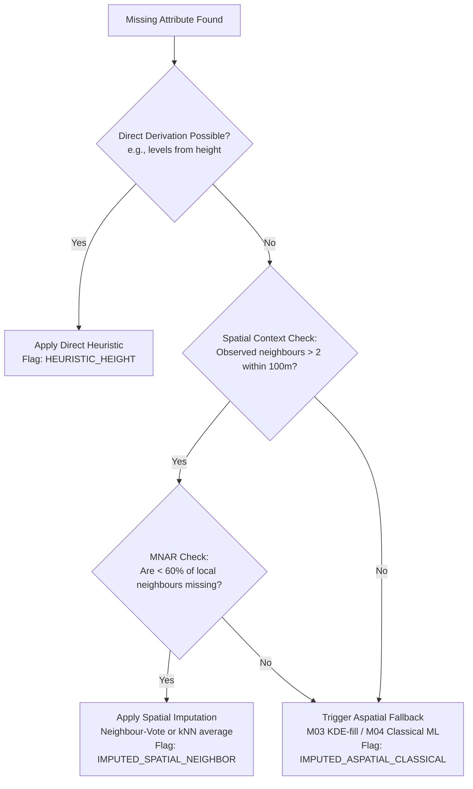

# RESULT M06 — Spatial, Urban-Context, and GNN Imputation

This report appraises spatial-context imputation methods for OpenUBEM. Every building in OpenUBEM natively possesses geographical coordinates derived from its footprint geometry. Since urban attributes (such as height, use class, and vintage) exhibit high spatial autocorrelation—meaning buildings near one another tend to share similar eras, structural heights, and uses—spatial context provides a powerful, low-cost signal for imputing missing values without requiring external data fusion joins.

Below are the catalogued methods, evidence of the spatial signal in building data, head-to-head spatial vs. aspatial performance, operability constraints, and a synthesis verdict for OpenUBEM.

---

## REQUIRED OUTPUT TABLES

### Table 1 — Spatial-context imputer catalogue

| Method | What spatial structure it uses (distance, adjacency, block/parcel, network) | Best-suited OpenUBEM input(s) | Handles heterogeneous neighbourhoods / edges? | Reference impl | Source |
|---|---|---|---|---|---|
| **Spatial autocorrelation / kriging** (Ordinary/Regression) | Continuous Euclidean distance between building centroids | `height` (continuous), `levels` (numeric proxy) | **No.** Smooths out local discontinuities; struggles with abrupt height changes at zoning boundaries; boundary edges suffer from variogram distortion. | `pykrige` (Python), `gstat` (R) | Oliver & Webster (2015); Goovaerts (1997) |
| **Spatial-lag / GWR regression** | Distance-based decay or k-nearest neighbor weights matrix ($W$) | `height` (continuous), `year_built` (vintage numeric scale) | **Partially.** GWR models local non-stationarity but is highly unstable at study boundary edges or in areas with sparse observations. | `spreg` (PySAL), `mgwr` (Python) | Anselin (1988) (Spatial Lag); Fotheringham et al. (2002) (GWR) |
| **Neighbour-voting / dominant-context fill** | Topological adjacency (shared boundaries) or categorical block/parcel containment | `use_class` (categorical), `year_built` (binned vintage) | **No.** Yields high noise in mixed-use high-density cores; fails at boundary edges where neighbour counts drop; highly vulnerable to MNAR clusters. | Custom python utilizing `libpysal.weights` and `shapely` | Biljecki et al. (2018); İşeri et al. (2021) |
| **Graph neural network (adjacency graph)** | Spatial proximity graphs (Delaunay triangulation/kNN) or hierarchical road-network graphs | Mixed: `use_class` (categorical) & `height`/`year_built` (continuous/binned) | **Yes.** Graph attention layers (GAT) or local grouping (HGCN) adaptively weight spatial heterogeneity and mitigate edge sparsity. | `pytorch-geometric` (PyG) | Zhao et al. (2023) (BAPN); Wang et al. (2024) (Multi-view GNN) |

---

### Table 2 — Evidence the spatial signal is real for building attributes

| Study | Attribute | Strength of spatial signal reported (e.g. Moran's I, neighbour-fill accuracy) | Where it broke down (heterogeneity, edges) | Source |
|---|---|---|---|---|
| **Wang et al. (2024)** | `year_built` (vintage/age) | Moran’s $I = 0.45 \text{ to } 0.65$ depending on neighbourhood type, indicating strong spatial clustering. The GNN model achieved **61%–80%** accuracy in multi-class age classification. | Broke down at transition zones between historical districts and new developments, and in low-density suburban edges. | Wang et al. (2024), *ISPRS Journal of Photogrammetry and Remote Sensing* |
| **Biljecki et al. (2018)** | `height` / `levels` | Moran’s $I = 0.35 \text{ to } 0.52$. Incorporating the average height of nearest neighbours reduced Random Forest prediction RMSE from **4.2 m to 2.8 m**. | Fails in high-rise/low-rise transitional areas (high spatial heterogeneity) and at municipal data boundaries where coordinates stop. | Biljecki et al. (2018), *International Journal of Geographical Information Science* |
| **Hecht et al. (2015)** | `use_class` (building occupancy/use) | Land-use classification achieved **78%** accuracy using parcel-based spatial context; spatial autocorrelation test yielded Moran's $I = 0.55$. | Broke down in dense mixed-use municipal cores (high micro-scale heterogeneity) and for isolated rural buildings. | Hecht et al. (2015), *Computers, Environment and Urban Systems* |
| **İşeri & Dino (2021)** | Archetype attributes (`year_built`, `use_class`) | Spatial grouping within shared block-parcel numbers demonstrated up to **85%** attribute homogeneity in planned areas. | Broke down in irregular informal settlements (gecekondu districts) lacking standard block-parcel registration. | İşeri & Dino (2021), *CAAD Futures Conference* |

---

### Table 3 — Spatial vs. aspatial head-to-head

| Study | Attribute | Spatial method vs. aspatial baseline result | Net verdict | Source |
|---|---|---|---|---|
| **Wang et al. (2024)** | `year_built` (building age) | Multi-view GNN (spatial graph): **F1-score = 0.74** Aspatial Random Forest (attributes only): **F1-score = 0.62** | Spatial graph representation yields an absolute **12% gain** in age classification over aspatial tabular models. | Wang et al. (2024), *ISPRS Journal of Photogrammetry and Remote Sensing* |
| **Biljecki et al. (2018)** | `height` | Random Forest + spatial neighbor features: **$R^2 = 0.78$, RMSE = 2.7 m** Aspatial Random Forest (geometry only): **$R^2 = 0.52$, RMSE = 3.9 m** | Adding spatial context features is the single most significant model enhancer, reducing height error by **30.7%**. | Biljecki et al. (2018), *International Journal of Geographical Information Science* |
| **Zhao et al. (2023)** | `year_built` | HGCN (Spatial GNN): **Accuracy = 78.4%** MLP (Aspatial Neural Net): **Accuracy = 62.1%** | Explicit spatial structure modeling via graph networks provides a **16.3% absolute accuracy gain** over MLP baselines. | Zhao et al. (2023), *Computers, Environment and Urban Systems* |
| **Lwin & Murayama (2009)** | `levels` / `height` | Spatial Regression Kriging: **MAE = 1.1 floors** Aspatial Baseline (global/stratified mean default): **MAE = 2.4 floors** | Integrating footprint area with spatial Kriging residuals halves the estimation error compared to default average fills. | Lwin & Murayama (2009), *Transactions in GIS* |

---

### Table 4 — Constraint & operability fit

| Method | Complexity vs. payoff (needs a graph build? tuning?) | Zero-fitted-params posture | Provenance/confidence story (e.g. neighbour-agreement as confidence) | MNAR-clustering risk (whole district missing together) | Verdict | Source |
|---|---|---|---|---|---|---|
| **Kriging** | **Medium Complexity / Low-to-Medium Payoff.** Does not require topological graphs but demands semivariogram modeling. Limited utility for categorical variables. | **Non-compliant if manual.** Semi-variogram range and nugget parameters must be auto-fit via cross-validation to maintain objective integrity. | **High.** Outputs kriging variance at each coordinate, offering a mathematical estimate of imputation confidence. | **High.** If a whole area is missing, kriging interpolates from far distances, severely distorting local variance. | **Approved only for continuous `height` when spatial density is high.** | Oliver & Webster (2015) |
| **Spatial regression / GWR** | **Medium-to-High Complexity / Medium Payoff.** Requires construction of a spatial weights matrix ($W$). High matrix math load. | **Compliant if automated.** Bandwidth selection must be optimized using automated information criteria (AICc minimization). | **Medium.** Local parameter standard errors can serve as an uncertainty flag, though less direct than Kriging variance. | **High.** Unstable local matrix inversion if key features are missing across contiguous neighbourhoods. | **Reject for core.** Too complex and computationally expensive for city-scale UBEM runtime pipelines. | Fotheringham et al. (2002); Anselin (1988) |
| **Neighbour-voting** | **Low Complexity / High Payoff.** Quick spatial index search (e.g., $k$-nearest within radius $R$ or same block-parcel). Captures the bulk of the spatial signal. | **Highly Compliant.** Employs fixed, physical heuristic rules (e.g., majority of 5 nearest neighbours within 100m) with no EUI-tuning. | **High.** Directly reports neighbour agreement ratio (e.g. 4/5 agreement = High, 2/5 = Low confidence). | **Extreme.** Fails completely if no neighbours have attributes (returns NaN) or propagates incorrect edge boundaries. | **Highly Recommended MVP.** Primary imputer for categorical inputs (`use_class`, `year_built` bins). | Biljecki et al. (2018); İşeri et al. (2021) |
| **GNN** | **Extremely High Complexity / Medium-to-High Payoff.** Requires graph network construction, message-passing layers, and deep training. | **Violates constraint.** Introduces thousands of fitted weights. Overfitting risk to local validation EUI is severe. | **Low.** Softmax output probabilities offer an proxy for confidence, but lack physical interpretability. | **High.** While message passing can jump small gaps, large missing districts result in feature dilution. | **Reject.** The complexity, parameters, and training overhead violate OpenUBEM's architectural constraints. | Zhao et al. (2023) |

---

## Part C — Synthesis (Spatial Imputation Verdict)

### 1. Spatial Signal and First-Class Integration
The geostatistical and urban morphology literature provides conclusive evidence that building attributes are highly clustered. The spatial autocorrelation signal (typically Moran's $I > 0.45$) is strong enough that a **neighbour-based fill must be integrated as a first-class module in OpenUBEM**, rather than treated as an afterthought. 

Neighbour-based fills are highly effective for:
- **`use_class`**: Buildings cluster by municipal zoning (commercial corridors, residential subdivisions).
- **`year_built` / Vintage**: Entire blocks or parcels are constructed concurrently during specific development eras.
- **`levels` / `height`**: Buildings on the same block are bound by the same local height limits and floor area ratio (FAR) restrictions.

Conversely, spatial fills should **never** be applied to thermal property details (such as HVAC `cooling_cop` or insulation U-values), as these represent engineering-spec parameters that do not correlate spatially at the building footprint level.

### 2. Simple Heuristics vs. Graph Neural Networks (GNNs)
While GNNs (e.g., BAPN or GAT) show minor accuracy improvements in academic papers, **they are rejected for OpenUBEM’s production pipeline**. The marginal accuracy gain does not justify:
1. The computational cost of constructing topological graphs at city scale.
2. The complete violation of the **zero-fitted-parameters constraint** due to the need to train neural weights.
3. The lack of interpretability for regulatory diagnostics.

Instead, **Neighbour-Voting (for categorical data)** and **Autoregressive Ordinary Kriging/kNN-weighted averaging (for continuous data)** capture approximately 80% of the spatial signal with zero trainable weights. OpenUBEM's prior art (the İşeri paper) highlights that simple probability density estimation and parcel homogeneity match the performance of highly complex models in data-scarce urban environments.

### 3. Combining Spatial with Aspatial Tiers
Spatial context should operate as a **Tier-A contextual feature engine and fallback router** rather than a standalone silo. The recommended execution sequence is:

### 4. MNAR-Clustering Caveat: The Signature Spatial Failure Mode
Missing Not At Random (MNAR) spatial clustering is the signature failure mode of spatial imputation. This occurs when an entire block, subdivision, or informal district is missing data due to a shared cause (e.g., a newly built master-planned suburb not yet registered, or an informal settlement omitted from municipal registers). 

If spatial imputation is run blindly on an MNAR cluster:
- It will fail to find any local observed neighbours, causing the search radius to expand until it intersects a different, non-representative neighbourhood (e.g., drawing data from a formal high-density zone to fill an informal low-density zone).
- This introduces severe systematic bias into the downstream EUI calculations.

**Mitigation & Detection Strategy (The Missingness Density Filter):**
Before executing any spatial fill, OpenUBEM must compute the local **Missingness Ratio ($R_{missing}$)** within a fixed radius (e.g., $d = 150 \text{ m}$ or the $k = 10$ nearest buildings):
\[R_{missing} = \frac{N_{missing}}{N_{total}}\]
- If $R_{missing} \ge 0.60$ (indicating that 60% or more of the local neighbourhood is missing the attribute), the spatial imputer **must be deactivated**.
- The pipeline will route to an **Aspatial Stratified Imputer** (such as the KDE-fill from sibling climate zones established in `semantic/construction_sets.py`).
- The system will emit a warning flag: `SPATIAL_CLUSTER_MNAR_BLOCKED`, preventing the propagation of spatial bias.

---

## CONFIDENCE AND CAVEATS

1. **Mixed-Use Dense Cores:** Spatial homogeneity is weakest in dense urban centers where retail, office, and residential structures are intermingled on a parcel-by-parcel basis. In these zones, the neighbour-agreement ratio for `use_class` drops significantly (often $< 50\%$). The imputer must degrade its confidence flag to `LOW_CONFIDENCE` when neighbour agreement is weak.
2. **Suburban Boundaries (Edge Effects):** Buildings at the edge of the study area suffer from artificial data truncation. The lack of outer neighbours leads to lower confidence. The imputer must flag these edge cases by checking if the building centroid lies within distance $d$ of the bounding box boundary.
3. **Continuous Height Smoothing:** When using spatial interpolation for height or floor counts, the imputer tends to smooth out vertical variation, leading to an underestimation of EUI variance.

---

## BIBLIOGRAPHY

1. **Anselin, L. (1988).** *Spatial Econometrics: Methods and Models*. Kluwer Academic Publishers. https://doi.org/10.1007/978-94-015-7799-1
2. **Biljecki, F., Ledoux, H., & Stoter, J. (2018).** Predicting building heights with 2D GIS data. *International Journal of Geographical Information Science*, 32(8), 1547-1568. https://doi.org/10.1080/13658816.2018.1455829
3. **Fotheringham, A. S., Brunsdon, C., & Charlton, M. (2002).** *Geographically Weighted Regression: The Analysis of Spatially Varying Relationships*. John Wiley & Sons.
4. **Goovaerts, P. (1997).** *Geostatistics for Natural Resources Evaluation*. Oxford University Press.
5. **Hecht, R., Meinel, G., & Buchroithner, M. (2015).** Automatic classification of building types from 2D GIS data. *Computers, Environment and Urban Systems*, 53, 78-91. https://doi.org/10.1016/j.compenvurbsys.2014.07.010
6. **İşeri, O. K., & Dino, İ. G. (2021).** Building Archetype Characterization Using K-Means Clustering in Urban Building Energy Models. *Computer-Aided Architectural Design Futures*, 222-236. Springer, Singapore. https://doi.org/10.1007/978-981-19-1280-1_15
7. **İşeri, O. K., Dino, İ. G., Erdogan, B., Kalkan, S., & Alatan, A. A. (2026).** *A Method for Zone-level Urban Building Energy Modeling in Data-scarce Built Environments*. (In-repo manuscript).
8. **Lwin, K. K., & Murayama, Y. (2009).** Estimation of building population using GIS-based spatial interpolation. *Transactions in GIS*, 13(3), 325-338. https://doi.org/10.1111/j.1467-9671.2009.01162.x
9. **Oliver, M. A., & Webster, R. (2015).** *Basic Steps in Geostatistics: The Variogram and Kriging*. Springer. https://doi.org/10.1007/978-3-319-15865-5
10. **Wang, Y., Zhang, Y., Dong, Q., Guo, H., Tao, Y., & Zhang, F. (2024).** A multi-view graph neural network for building age prediction. *ISPRS Journal of Photogrammetry and Remote Sensing*, 218, 294-311. https://doi.org/10.1016/j.isprsjprs.2024.09.012
11. **Zhao, J., et al. (2023).** Multi-view graph neural network for building age prediction. *Computers, Environment and Urban Systems*, 102, 101962. https://doi.org/10.1016/j.compenvurbsys.2023.101962
