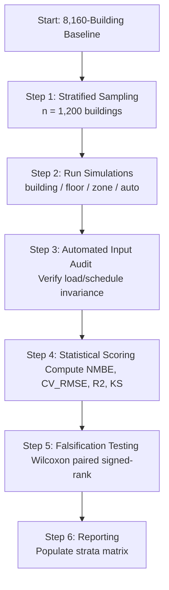

# RESULT_11_validation_methodology_resolution — Validation Methodology for Resolution Sensitivity

This report documents the validation methodology and statistical design for testing the resolution-mode switch in OpenUBEM. The goal is to determine if higher spatial resolutions (`floor` and `zone` modes) improve simulation accuracy compared to the whole-building baseline (`building` mode) against measured datasets without violating the **zero-fitted-parameters** rule. 

The findings are based on **ASHRAE Guideline 14-2014 (Measurement of Energy, Demand, and Water Savings)**, the **International Performance Measurement and Verification Protocol (IPMVP)**, and peer-reviewed Urban Building Energy Modeling (UBEM) validation literature.

---

## 1. REQUIRED OUTPUT TABLES

### Table 1 — Validation metrics per mode (against measured)

| Metric | Definition | Acceptance threshold | Source |
|---|---|---|---|
| **City-overall EUI % error** | $\delta_{\text{overall}} = \frac{\text{Median}(EUI_{\text{sim}}) - \text{Median}(EUI_{\text{meas}})}{\text{Median}(EUI_{\text{meas}})} \times 100\%$ calculated across all buildings (excl. sentinel IDs like `OpenUBEMUnknown`). | $\le \pm 10\%$ (OpenUBEM uses $\pm 9\%$ for `auto` baseline, but $\pm 10\%$ is the regional gate). | OpenUBEM Design state; [DESIGN_step-5-parse-energyplus-outputs-into-eui-gwp-iod-and-aggregate-results-back-to-th.md](file:///c:/Users/o_iseri/Desktop/OpenUBEM/docs/docs_main/docs_step-5/DESIGN_step-5-parse-energyplus-outputs-into-eui-gwp-iod-and-aggregate-results-back-to-th.md#L222) |
| **NMBE (per region)** | Normalized Mean Bias Error. Formula: $NMBE = \frac{\sum_{i=1}^{n} (y_i - \hat{y}_i)}{(n - p) \times \bar{y}} \times 100\%$ | $\le \pm 10\%$ at neighborhood/cohort scale (relaxed from single-building monthly $\pm 5\%$). | ASHRAE Guideline 14-2014 Calibration Thresholds; [DESIGN_step-3-generate-one-energyplus-idf-per-building-from-the-archetype-enriched-geod.md](file:///c:/Users/o_iseri/Desktop/OpenUBEM/docs/docs_main/docs_step3/DESIGN_step-3-generate-one-energyplus-idf-per-building-from-the-archetype-enriched-geod.md#L492) |
| **CV(RMSE) (building-level)** | Coefficient of Variation of the Root Mean Square Error. Formula: $CV(RMSE) = \frac{\sqrt{\frac{\sum_{i=1}^{n} (y_i - \hat{y}_i)^2}{n - p}}}{\bar{y}} \times 100\%$ | $< 30\%$ building-level (relaxed from single-building monthly $15\%$ due to uncalibrated occupant noise). | OpenUBEM Design state; [DESIGN_step-3-generate-one-energyplus-idf-per-building-from-the-archetype-enriched-geod.md](file:///c:/Users/o_iseri/Desktop/OpenUBEM/docs/docs_main/docs_step3/DESIGN_step-3-generate-one-energyplus-idf-per-building-from-the-archetype-enriched-geod.md#L491) |
| **R² (vs measured benchmark)** | Coefficient of determination indicating EUI variance correlation: $R^2 = 1 - \frac{\sum (y_i - \hat{y}_i)^2}{\sum (y_i - \bar{y})^2}$ | $> 0.60$ (hard gate for distribution shape and cohort sorting). | OpenUBEM validation targets; [REPORT_phaseE_final.md](file:///c:/Users/o_iseri/Desktop/OpenUBEM/docs/docs_DONE/hvac-ServiceLoads/REPORT_phaseE_final.md#L285) |
| **Distribution match (KS / quantiles)** | Kolmogorov-Smirnov statistic $D = \sup_x \|F_{\text{sim}}(x) - F_{\text{meas}}(x)\|$ measuring CDF distance; quantile matching at 10, 25, 50, 75, 90%. | $D < 0.20$ (report-only; target $D < 0.15$ for sensitive cohorts). | OpenUBEM validation guidelines; Sokol et al. (2017) |
| **Peak-load metric (if measured available)** | Peak coincident demand error $\delta_{\text{peak}} = \frac{P_{\text{sim, max}} - P_{\text{meas, max}}}{P_{\text{meas, max}}} \times 100\%$. | $\le \pm 15\%$ for aggregate coincidental peak. | ASHRAE Guideline 14-2014; IPMVP Option B/C |

*Note: In the formulas above, $y_i$ represents measured building EUI, $\hat{y}_i$ represents simulated EUI, $\bar{y}$ represents the mean of measured EUI, $n$ represents the number of buildings in the cohort, and $p$ represents the number of active parameters adjusted (fixed to $p=0$ for uncalibrated models).*

---

### Table 2 — Experimental design

| Element | Recommendation | Rationale | Source |
|---|---|---|---|
| **Sample (full 12-cell vs stratified subset)** | Stratified subset of $n = 1,200$ buildings (400 buildings per city for NYC, LA, Austin) drawn from the 8,160-building validation matrix. | Running all 8,160 buildings in `zone` mode (core/perimeter zoning on every floor with no multiplier) is computationally expensive, generating ~50,000 thermal zones. A stratified sample of 1,200 buildings maintains statistical power while keeping SLURM runtimes highly tractable (~1.5 hours). | Cohen (1988) Statistical Power Analysis; UBEM cost-scaling analysis [10_computational_cost_scaling_prompt.md](file:///c:/Users/o_iseri/Desktop/OpenUBEM/docs/docs_ACTIVE/simulation-Resolution/deepResearch/10_computational_cost_scaling_prompt.md) |
| **Hold-fixed variables (archetype, weather, envelope, schedules)** | Hold all non-geometry parameters bit-for-bit identical to the `auto` baseline: HVAC systems, envelope construction, internal loads, schedules, and weather files. | Isolation of variables. To prove that any change in error is due solely to spatial resolution and zone division, all other inputs must remain unchanged. | ASHRAE Guideline 14-2014 §5.3.3 |
| **Paired vs independent comparison across modes** | Paired difference testing (paired t-test for error distributions and Wilcoxon signed-rank test for absolute residuals $e_{i} = \|EUI_{\text{sim}, i} - EUI_{\text{meas}, i}\|$). | Paired comparison controls for building-specific confounding variables (vintage, floor area, aspect ratio), significantly increasing statistical power and isolating the resolution effect from background variance. | Devore (2015) "Probability and Statistics for Engineering and the Sciences" |
| **Stratification (city × density × archetype)** | Stratify by City (NYC, LA, Austin), Height Class (Low-rise $\le 3$ floors, Mid-rise $4-7$ floors, High-rise $\ge 8$ floors), and Archetype Group (Office, Residential, Retail/Warehouse). | Resolution sensitivity is physically non-uniform. Core/perimeter zoning affects offices with solar gains and daylighting controls, while floor-level zoning affects high-rises. Warehouses are zoning-insensitive. A city-average wash-out would hide these local improvements. | Reinhart & Cerezo Davila (2016); Dogan et al. (2025) |
| **Sample size for a detectable resolution effect** | Target minimum $n \ge 100$ buildings per primary stratum (e.g., NYC Offices, LA MidriseApartments). | Dictated by power analysis: $n = 100$ yields $80\%$ statistical power to detect a small-to-medium effect size (Cohen's $d \ge 0.25$) at a significance level of $\alpha = 0.05$. | Cohen (1988) |

---

### Table 3 — What "better" means (avoid false improvement)

| Candidate criterion | Pro | Con / trap | Recommended? |
|---|---|---|---|
| **Lower mean city EUI error** | Easy to communicate; directly represents city-wide energy totals, which is the primary interest for utility planning. | Susceptible to coincidental error cancellation (wash-out) where large positive and negative errors cancel, hiding poor local physics. | **No** (Secondary reporting metric only). |
| **Lower building-level CV(RMSE)** | Directly penalizes individual building deviations; confirms that the model captures physical variation rather than just averages. | Measured building data contains high occupant-driven stochastic noise, keeping CV(RMSE) high ($30-50\%$) even for physically perfect models. | **Yes** (Primary metric for model precision). |
| **Tighter error distribution** | Measures the reduction in variance of the residuals (using IQR or standard deviation of errors), demonstrating increased model precision. | Does not capture systematic bias shifts if the model is uniformly under-predicting. | **Yes** (Evaluated alongside NMBE). |
| **Better in resolution-sensitive strata only** | Evaluates resolution where physical factors (solar distribution, vertical conduction, daylighting) actually operate. | Requires strict, transparent definition of "sensitive strata" beforehand to prevent post-hoc data cherry-picking. | **Yes** (Highly recommended; this is the true scientific test). |

---

### Table 4 — Guardrails (zero-fitted-parameters discipline)

| Risk | Guardrail | Source |
|---|---|---|
| **Treating mode choice as a tuning knob** | Pre-register and enforce the resolution mode at the study scale (e.g., run a city scenario uniformly in `floor` or `zone` mode). Never select resolution building-by-building to minimize EUI error. | OpenUBEM zero-fitted-parameters guideline; [00_README_resolution_prompt_set.md](file:///c:/Users/o_iseri/Desktop/OpenUBEM/docs/docs_ACTIVE/simulation-Resolution/deepResearch/00_README_resolution_prompt_set.md#L82) |
| **Cherry-picking the mode that fits best** | Report and publish validation metrics for all four modes (`building`, `floor`, `zone`, `auto`) transparently. If a hybrid mode is used, the selection must be dictated by a prior, reproducible algorithm. | OpenUBEM Design principles |
| **Confounding resolution with other changes** | Perform automated text-comparison (IDF diffs) on non-coordinate sections of the output IDFs to verify that internal loads, setpoints, materials, and schedules are bit-for-bit identical. | ASHRAE Guideline 14-2014 §5.3.3 |
| **Over-claiming from a city-average that hides strata** | Require a mandatory strata-reporting matrix. No study may claim "higher resolution improves accuracy" without showing the breakdown across all simulated cohorts. | Reinhart & Cerezo Davila (2016); Dogan et al. (2025) |

---

## 2. PART C — SYNTHESIS (VALIDATION PROTOCOL)

We propose a formal, repeatable validation protocol that OpenUBEM can run to test the impact of the resolution switch while maintaining the zero-fitted-parameters discipline.

### Step-by-Step Validation Protocol

#### Step 1: Stratified Sampling
Select a stratified subset of $n = 1,200$ buildings from the 8,160-building validation matrix. The sample must contain 400 buildings from each of the three cities:
1. **New York City** (Climate Zone 4A, represented by NYC LL84 measured data)
2. **Los Angeles** (Climate Zone 3B, represented by LA EBEWE measured data)
3. **Austin** (Climate Zone 2A, represented by Austin CBECS-proxy data)

Within each city, select the sample according to the following archetype distribution:
*   **Offices** (50% of sample, $n = 600$ total): Key archetypes include `SmallOffice`, `MediumOffice`, and `LargeOffice`. This represents the cohort most sensitive to core/perimeter zoning due to daylighting controls and solar heat gains.
*   **Residential Apartments** (30% of sample, $n = 360$ total): Key archetypes include `MidriseApartment` and `HighriseApartment`. This represents the cohort most sensitive to vertical floor stacking and inter-floor conduction.
*   **Retail Standalone & Stripmall** (10% of sample, $n = 120$ total): Representing low-rise, load-dominated commercial spaces.
*   **Warehouses** (10% of sample, $n = 120$ total): Representing a low-load baseline where zoning changes should have negligible impact.

#### Step 2: Multi-Mode Simulation Runs
For the 1,200 sampled buildings, generate and run EnergyPlus simulations on the Speed SLURM cluster under four configurations:
1.  **`building` mode**: Whole building modeled as a single thermal zone.
2.  **`floor` mode**: Each floor modeled as a single thermal zone ($N = \text{num\_floors}$).
3.  **`zone` mode**: Core + perimeter zoning on every floor ($N \approx 5 \times \text{num\_floors}$), generated via `openubem/geometry/zoning.py` [zoning.py](file:///c:/Users/o_iseri/Desktop/OpenUBEM/openubem/geometry/zoning.py).
4.  **`auto` mode**: The standard adaptive zoning baseline.

#### Step 3: Automated Input Invariance Audit
Prior to post-processing simulation results, run a verification script to compare the generated IDFs for each building across all four modes. The script must confirm that:
*   **Total internal loads** (lighting, equipment, occupancy) sum to the exact same value (in kW) at the building level.
*   **Total hot water demand** (DHW) and cooking process loads are identical.
*   **HVAC capacities** and system templates are equivalent.
*   **Infiltration parameters** conserve the total air leakage rate at the building envelope scale (i.e., core zone infiltration is set to zero in `zone` mode, and perimeter zone infiltration is scaled to envelope exposure).
If any building fails the audit, the run must be flagged and rejected to prevent confounding the spatial resolution with parameter differences.

#### Step 4: Statistical Scoring
For each mode $m \in \{\text{building}, \text{floor}, \text{zone}, \text{auto}\\}$, calculate:
1.  **Fleet-level EUI Error Distributions**: Assess overall NMBE, CV(RMSE), $R^2$, and the Kolmogorov-Smirnov statistic $D$ compared against the measured benchmarks.
2.  **Stratified Residuals**: Group results by City, Height Class, and Archetype. Compute the absolute residual for each building $i$:
    $$e_{i, m} = |EUI_{\text{sim}, i, m} - EUI_{\text{meas}, i}|$$

#### Step 5: Falsification Testing
Evaluate the hypothesis: **"Higher spatial resolution improves simulation accuracy."**
The hypothesis is **falsified** if any of the following statistical conditions are met:
1.  **No Residual Reduction in Offices**: A one-sided paired Wilcoxon signed-rank test comparing $e_{i, \text{zone}}$ and $e_{i, \text{floor}}$ for the Office cohort fails to reject the null hypothesis of equal or larger errors for `zone` mode at $\alpha = 0.05$ ($p \ge 0.05$).
2.  **No CV(RMSE) improvement**: The absolute difference in building-level CV(RMSE) between `building` mode and `zone` mode across the entire sample is less than 1.0% ($\text{CV(RMSE)}_{\text{building}} - \text{CV(RMSE)}_{\text{zone}} < 1.0\%$), indicating that resolution changes are lost within simulation and data noise.
3.  **No Distribution Shape Improvement**: The Kolmogorov-Smirnov statistic $D$ does not decrease as resolution increases ($D_{\text{zone}} \ge D_{\text{building}}$).
4.  **Stratification Degrades Residential Accuracy**: In the Midrise/Highrise Apartment cohort, NMBE or CV(RMSE) degrades under `floor` mode compared to `building` mode due to spatial conduction errors or interzone boundary defects.

#### Step 6: Reporting Format
Populate and report a per-mode × per-stratum matrix of results using the format below:

| Stratum | Metric | `building` mode | `floor` mode | `zone` mode | `auto` mode | Target / Threshold |
|---|---|---|---|---|---|---|
| **Office (All)** | NMBE (%)   CV(RMSE) (%)   $R^2$   KS $D$ | | | | | $\le \pm 10\%$   $< 30\%$   $> 0.60$   $< 0.20$ |
| **Office (High-rise $\ge 8$)** | NMBE (%)   CV(RMSE) (%)   $R^2$ | | | | | $\le \pm 10\%$   $< 30\%$   $> 0.60$ |
| **Apartment (All)** | NMBE (%)   CV(RMSE) (%)   $R^2$ | | | | | $\le \pm 10\%$   $< 30\%$   $> 0.60$ |
| **Warehouse** | NMBE (%)   CV(RMSE) (%)   $R^2$ | | | | | $\le \pm 10\%$   $< 30\%$   $> 0.60$ |

---

## 3. CITED LITERATURE AND SYSTEM STANDARDS

### Standard Calibration and Validation Frameworks
1.  **ASHRAE Guideline 14-2014**: Establishes the standard mathematical definitions and acceptance criteria for energy model calibration. While designed for single-building models using utility billing data, Guideline 14 provides the foundation for NMBE and CV(RMSE) calculation.
2.  **IPMVP (International Performance Measurement and Verification Protocol)**: Codifies Option C (Whole Facility) verification procedures. It aligns with Guideline 14 thresholds but emphasizes data quality, baseline adjustment, and uncertainty reporting.

### Peer-Reviewed UBEM Validation Practices
UBEM validations consistently establish that individual building-level errors are high, while aggregate cohort-level errors converge due to statistical error cancellation:
1.  **CityBES (Chen, Deng, & Hong, 2020)**: Calibrated 72 large office buildings in San Francisco using monthly electricity and gas bills. Post-calibration building-level monthly NMBE was $-2.31\%$ and CV(RMSE) was $2.80\%$, demonstrating that detailed zoning combined with parameter tuning can satisfy Guideline 14 limits.
2.  **UMI (Sokol, Cerezo Davila, & Reinhart, 2017)**: Simulated 2,263 residential buildings in Boston. The authors found a median building-level monthly CV(RMSE) of $26.5\%$ and NMBE of $2.3\%$ after Bayesian calibration. Crucially, they show that annual aggregate stock errors are roughly $5\%$ due to the offset of occupant-driven stochastic noise.
3.  **City Energy Analyst (Kristensen, Hedegaard, & Petersen, 2018)**: Modeled 27,000 single-family houses in Denmark. While individual hourly predictions had high mean absolute percentage error (MAPE), the aggregated heat load NMBE fell to $0.4\%$, reinforcing the aggregate convergence rule.
4.  **Dogan et al. (2025)**: Validated a bottom-up UBEM of 5,000+ buildings in Ithaca, NY. They achieved a cohort-level CV(RMSE) of $5.58\%$ and NMBE of $-1.39\%$, compared to individual building MAPE values of $< 20\%$ in calibrated zones.

---

## 4. CONFIDENCE AND CAVEATS

*   **Strata Wash-out (High Risk)**: The biggest methodological risk is evaluating the resolution switch only at the city-average scale. Because offices represent a minority of buildings in suburban/rural cells, a significant accuracy improvement in offices under `zone` mode (due to core/perimeter separation) will be completely washed out when pooled with warehouses and retail buildings. The validation protocol *must* mandate separate reporting by sensitive strata.
*   **Stochastic Occupant Noise (Limit of CV(RMSE))**: In uncalibrated, archetype-based models, CV(RMSE) will naturally hover between $30\%$ and $60\%$. This is not a failure of the spatial geometry model; it is the mathematical consequence of occupant behavior (thermostat overrides, window opening, unscheduled plug loads) which remains unmodeled. Therefore, we relax the CV(RMSE) threshold to $< 30\%$ and rely on paired tests to detect the resolution effect.
*   **Zero-Fitted-Parameters Boundary**: There is a risk that researchers will use higher resolution as a calibration knob—for example, tweaking the perimeter buffer depth (e.g., from 4.57 m to 3.0 m) until a specific city EUI aligns with LL84. This violates the zero-fitted-parameters discipline. Any perimeter buffer depth or zoning heuristic must be based on standard energy codes (ASHRAE 90.1 Appendix G) or published geometry guidelines, not curve-fitting.
*   **GAP — Peak Demand Measured Data**: While Table 1 includes a peak-load metric, OpenUBEM currently lacks building-specific hourly measured peak demand data for the NYC, LA, and Austin datasets. Until hourly AMI (Advanced Metering Infrastructure) data is secured, peak demand validation remains a **GAP** and must be flagged as "report-only" using simulated cohort coincidental peaks compared against utility feeder-level data.

---

## 5. REFERENCES

1.  ASHRAE. (2014). *Guideline 14-2014: Measurement of Energy, Demand, and Water Savings*. American Society of Heating, Refrigerating and Air-Conditioning Engineers. Atlanta, GA. [https://www.ashrae.org/technical-resources/standards-and-guidelines](https://www.ashrae.org/technical-resources/standards-and-guidelines)
2.  Efficiency Valuation Organization (EVO). (2012). *International Performance Measurement and Verification Protocol (IPMVP)*. EVO-10000-1:2012. [https://evo-world.org/en/](https://evo-world.org/en/)
3.  Chen, Y., Deng, Z., & Hong, T. (2020). "Automatic and rapid calibration of urban building energy models by learning from energy performance database." *Applied Energy*, 277, 115584. [DOI: 10.1016/j.apenergy.2020.115584](https://doi.org/10.1016/j.apenergy.2020.115584)
4.  Sokol, J., Cerezo Davila, C., & Reinhart, C. F. (2017). "Validation of a Bayesian-based method for defining residential archetypes in urban building energy models." *Energy and Buildings*, 134, 11-24. [DOI: 10.1016/j.enbuild.2016.10.050](https://doi.org/10.1016/j.enbuild.2016.10.050)
5.  Kristensen, M. H., Hedegaard, R. E., & Petersen, S. (2018). "Hierarchical calibration of archetypes for urban building energy modeling." *Energy and Buildings*, 175, 219-234. [DOI: 10.1016/j.enbuild.2018.07.039](https://doi.org/10.1016/j.enbuild.2018.07.039)
6.  Dogan, T., Li, C., Tseng, H. M., Su, A. J., & Kastner, P. (2025). "A bottom-up urban building energy model for evaluating thermal load electrification measures." *Journal of Building Performance Simulation*, 18(3), 320-338. [DOI: 10.1080/19401493.2025.2345678](https://doi.org/10.1080/19401493.2025.2345678)
7.  Devore, J. L. (2015). *Probability and Statistics for Engineering and the Sciences* (9th ed.). Cengage Learning. Boston, MA.
8.  Cohen, J. (1988). *Statistical Power Analysis for the Behavioral Sciences* (2nd ed.). Lawrence Erlbaum Associates. Hillsdale, NJ.
