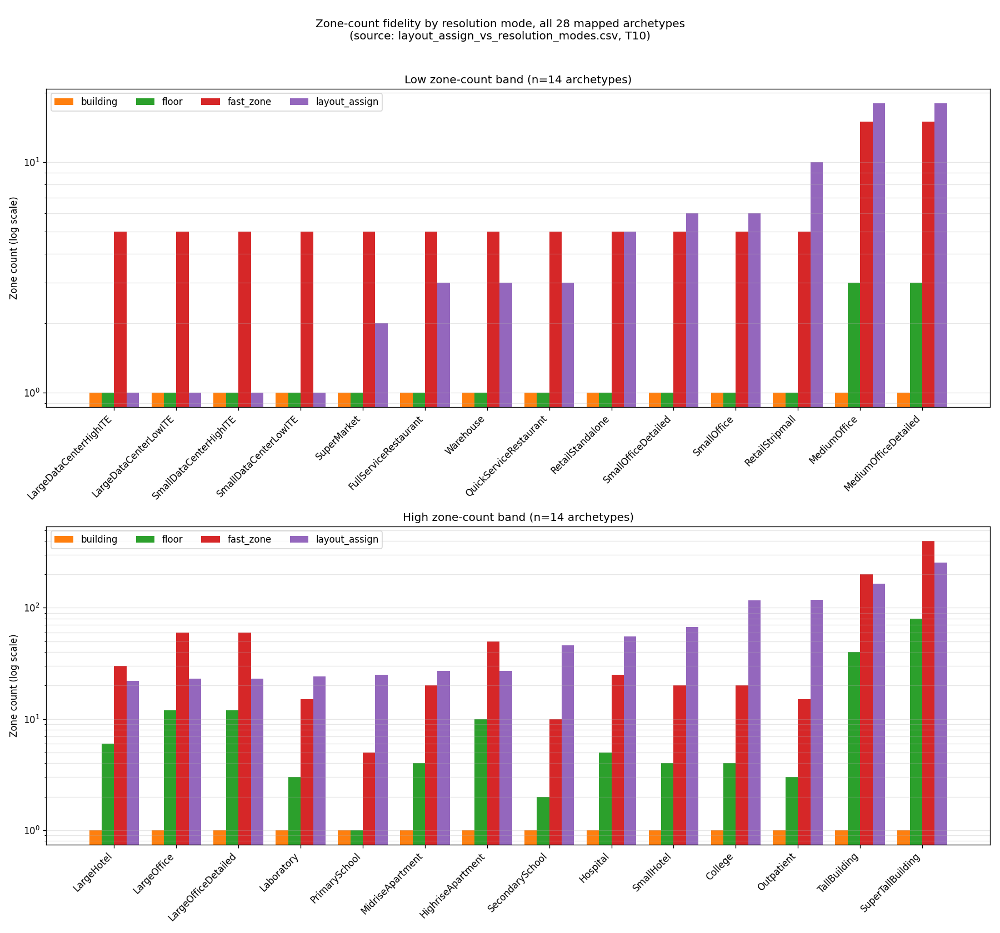
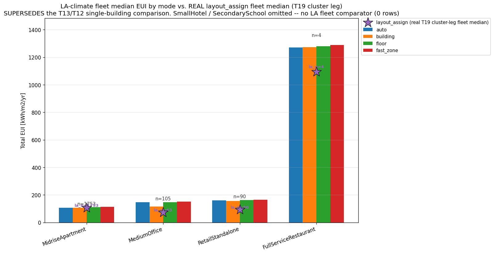
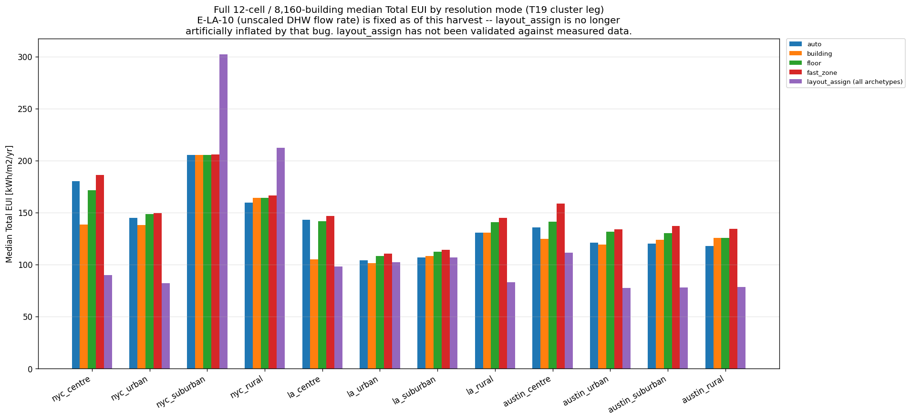
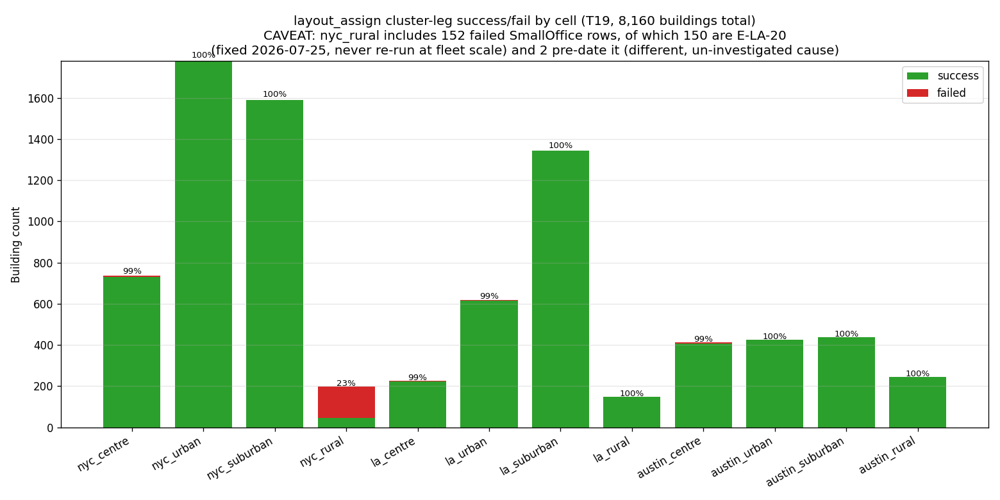

# LayoutAssigner — Figures Explained (plain language)

A simple guide to the 5 comparison figures in this folder (updated 2026-07-23 with the full 12-cell/8,160-building cluster result). For the full technical write-up (data sources, caveats, exact numbers) see [`OpenUBEM_results_LayoutAssigner.md`](OpenUBEM_results_LayoutAssigner.md) §3/§3a.

**Changelog — 2026-07-26:** Figures 2, 5, 6 and the summary CSV regenerated on the **T19** harvest (Figure 3/severity is a frozen 2026-07-23 spot-check and was left as-is). T19 reflects two rounds of defect fixes since the original T17 harvest these figures were first built on, including the E-LA-10 DHW fix. Prior T17-era figures are preserved in `openubem/outputs/comparisons/previous/*_t17.*`.

---

## Figure 1 — Zone-count fidelity

*How many thermal zones each resolution mode gives a building, for all 28 building types (log scale — split into two panels just so the labels stay readable).*

- `building` / `floor` / `fast_zone` all use one generic rule for every building type; `layout_assign` instead uses the **real, validated** zone count from that building type's actual reference model.
- `layout_assign` is sometimes far more detailed than the generic modes (tall towers, hospitals) and sometimes less — the point isn't "more zones is better", it's that `layout_assign` matches reality instead of guessing.

---

## Figure 2 — Energy use (EUI) comparison, Los Angeles cells

*Updated 2026-07-26 on T19: real annual energy use of `layout_assign` across the full LA fleet (thousands of buildings) vs. the other 4 modes, for the 4 building types where both numbers exist.*

- Previously this compared a single test building; it now compares real fleet medians on both sides.
- T19 `layout_assign` fleet medians (kWh/m²/yr): MidriseApartment 106.1 (n=1,753), MediumOffice 73.1 (n=63), RetailStandalone 94.0 (n=90), FullServiceRestaurant 1,093.5 (n=4) — all now below or near the other-mode medians for the same building types, now that the E-LA-10 DHW bug (see Figure 5) is fixed.

---

## Figure 3 — Simulation warning/error counts (6-building spot-check) — HISTORICAL, not regenerated

*This is a frozen 2026-07-23 snapshot, reflecting pre-fix behaviour. It was NOT regenerated in the 2026-07-26 T19 update (its 6-building EnergyPlus warning/error counts are hardcoded from the original E-LA-06 investigation, not sourced from the T17/T19 harvests, and the underlying bug landscape has since changed). Treat it as a historical record of what E-LA-06 looked like at the time, not as current behaviour. How many warning/error messages EnergyPlus produced while simulating each of 6 test buildings (log scale; red numbers are the more serious "severe" errors). This figure reflects the small 6-building spot-check, not the full 8,160-building fleet — the fleet-wide success/fail picture is Figure 6 below.*

- Only `MidriseApartment` (the building closest to its original reference size) ran cleanly; the other 5 produced large numbers of warnings because their equipment (transformers, water heaters, HVAC coils) wasn't resized along with the building.

---

## Figure 5 — Full fleet: energy use by mode, all 12 cells (updated 2026-07-26, T19)

*The real result of running `layout_assign` on all 8,160 buildings across all 12 city zones, compared to the other 4 modes, on the T19 harvest (2 rounds of defect fixes after the original 2026-07-23 T17 harvest).*

- The original version of this figure (T17, preserved in `openubem/outputs/comparisons/previous/layout_assign_vs_modes_cluster_eui_t17.png`) showed the purple `layout_assign` bars wildly too high in 2 zones (`nyc_suburban`, `la_suburban`), traced to E-LA-10: a fixed water-heater flow-rate value that should shrink/grow with the building's size but didn't. It mostly affected apartment buildings and small offices, which happen to be most of the buildings in those 2 zones. That T17 figure also carried a black-diamond "excl. MidriseApartment/SmallOffice" series as a workaround for the bug.
- **E-LA-10 is fixed.** This T19 figure shows the real `layout_assign` median for every zone with no exclusions — the black-diamond workaround series has been removed since it no longer serves a purpose. Fleet-wide median `total_eui` (successful rows) is now 103.8 kWh/m²/yr and median `dhw_eui` is 13.6 kWh/m²/yr, down from the T17 numbers the DHW bug had inflated.
- **Bottom line: the E-LA-10 DHW-scaling bug that made these fleet-scale energy numbers untrustworthy is fixed.** The honest caveat that remains: `layout_assign`'s energy output has never been validated against measured/metered data at any scale — the zone-count fidelity (Figure 1) and the "does it run at all" result (Figure 6) are solid, but "plausible-looking EUI" is not the same as "validated EUI."

---

## Figure 6 — Full fleet: did the simulation even run? (updated 2026-07-26, T19)

*Out of 8,160 buildings, how many simulated successfully (green) vs. crashed (red), per city zone, on the T19 harvest.*

- 97.92% succeeded fleet-wide (7,990 of 8,160), up from 96.65% (7,887 of 8,160) in the original T17 harvest — reflecting the two rounds of defect fixes (T18, T19) since T17.
- **Caveat: T19 was harvested BEFORE the E-LA-20 fix.** `nyc_rural`'s red bar includes 152 failed `SmallOffice` rows, but they are not all the same problem: 150 of them are E-LA-20 — a CTF-convergence Fatal bug fixed 2026-07-25 but never re-run at fleet scale — and the other 2 were already failing before E-LA-20 existed, from a different, un-investigated cause. Do not read `nyc_rural`'s column as current behaviour; it is expected to look much healthier (though not perfectly green) once the fleet is re-harvested post-E-LA-20.
- Outside of that one archetype/cell combination, crashes are concentrated in a handful of building types (large/tall office towers, a specific hospital-style building) that are more common in dense city centres — that's why `nyc_centre` still shows some red.
- Most of the 12 zones had zero or near-zero crashes — those zones simply don't contain many of the problem building types in the real data.
