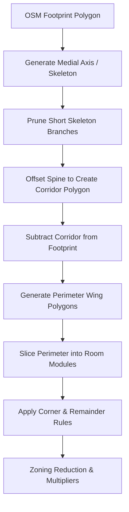

# Result L08 — Residential & Hotel Layout Specifics
## Archetype-Specific Packing Rules, Unit Mix, and Thermal-Zone Reduction for OpenUBEM

This document details the residential and hotel branch of the OpenUBEM `layoutGenerator.py` module. It establishes concrete packing rules, geometric modules, and thermal-zone reduction strategies for multi-family residential and hospitality archetypes (MidriseApartment, HighriseApartment, SmallHotel, LargeHotel, and Dormitories) mapped onto real non-rectangular footprints.

---

## REQUIRED OUTPUT TABLES

### Table 1 — Residential/hotel unit modules & packing

| Archetype | Unit/room depth (corridor→façade) | Unit width (bay) | Corridor type & width | Units per floor (typical) | Source |
|---|---|---|---|---|---|
| **MidriseApartment** | 25.0 ft (7.62 m) | 38.0 ft (11.58 m) | Double-loaded, 5.5 ft (1.68 m) | 8 units per floor (Ground: 7 units + 1 office/lobby) | PNNL Commercial Prototype Building Models (PNNL 2020) |
| **HighriseApartment** | 25.0 ft (7.62 m) | 38.0 ft (11.58 m) | Double-loaded, 5.5 ft (1.68 m) | 8 units per floor (Ground: 7 units + 1 office/lobby) | PNNL Commercial Prototype Building Models (PNNL 2020) |
| **SmallHotel** | 24.0 ft (7.32 m) [GAP: typical design is 26.0 ft (7.92 m)] | 12.0 ft (3.66 m) | Double-loaded, 12.0 ft (3.66 m) [GAP: typical design is 8.0 ft (2.44 m)] | ~20-21 rooms per floor (77 rooms total over 4 floors) | NREL/TP-5500-46861 (Deru et al. 2011) |
| **LargeHotel** | 24.0 ft (7.32 m) | 13.5 ft (4.11 m) | Double-loaded, 8.0 ft (2.44 m) | 42 rooms per floor (Standard guest floors 2–6) | PNNL Commercial Prototype Building Models (PNNL 2020) |
| **Dormitory** | 20.0 ft (6.10 m) [typical] | 12.0 ft (3.66 m) [typical] | Double-loaded, 6.0 ft (1.83 m) [typical] | Variable based on floor plate | Architectural Graphic Standards (12th ed.) |

---

### Table 2 — Packing onto non-rectangular footprints

| Footprint | Corridor path | Where units go | Corner-unit treatment | Left-over / un-packable area handling | Source |
|---|---|---|---|---|---|
| **Bar / slab** | Straight centerline path along major axis | Double-loaded on both sides of corridor | Dual-exposure corner rooms | Absorbed into end units (expanding bay width) or allocated to exit stairwells | Neufert Architects' Data (5th ed.) |
| **L-shape** | L-shaped centerline spine along both wings | Double-loaded on both sides of corridor in both wings | Re-entrant (inside) corner: vertical core/stairs. Outside corner: large dual-exposure corner unit | Corner junction hinge: circulation, vertical shafts, or lobby. Wing-end residuals: absorbed into end units | Time-Saver Standards for Building Types (4th ed.) |
| **U-shape** | U-shaped centerline spine along three wings | Double-loaded on both sides of corridor in all three wings | Two inside corners: vertical circulation / MEP shafts. Two outside corners: dual-exposure corner units | Hinge intersections: designated as common/service cores. Excess wing length: absorbed by adjacent rooms | Time-Saver Standards for Building Types (4th ed.) |
| **O / courtyard** | Ring centerline spine around central courtyard | Double-loaded: outer ring (facing street) and inner ring (facing court) | Four inside corners: exit stairs and service chases. Four outside corners: dual-exposure premier units | Inside corners: designated as service/circulation cores. Residual wing segment lengths: absorbed into adjacent units | Neufert Architects' Data (5th ed.) |
| **Irregular** | Multi-segment spine generated via straight skeleton | Double-loaded default; degrades to single-loaded if wing width < 12 m | Angles bisected to create radial division lines or orthogonal rooms with wedge-shaped chases | Non-orthogonal corner leftovers: designated as unconditioned mechanical chases or storage closets | ladybug-tools/dragonfly geometry generation rules |

---

### Table 3 — Thermal-zone reduction (how many zones per floor)

| Archetype | Architectural room count/floor | Recommended thermal zones/floor for BEM | Merge rule (by orientation? by unit type?) | Zone multiplier used? | Source |
|---|---|---|---|---|---|
| **MidriseApartment** | 8 apartments + 1 corridor | 5 zones/floor (4 perimeter zones + 1 corridor core) | Merge identical units facing the same cardinal orientation (N, S, E, W) | Yes, multiplier applied in E+ to represent identical units per orientation and floor | PNNL Commercial Prototype Models (PNNL 2020), ComStock/ResStock (NREL) |
| **SmallHotel** | ~20-21 rooms + 1 corridor (guest floors) | 5 zones/floor (4 perimeter guest room zones + 1 corridor core) | Merge guest rooms facing the same orientation (N, S, E, W) on a given floor | Yes, zone multiplier applied to represent individual guest rooms per orientation | NREL/TP-5500-46861 (Deru et al. 2011), OpenStudio Standards |
| **LargeHotel** | 42 guest rooms + 1 corridor (guest floors) | 5 zones/floor (4 perimeter guest room zones + 1 corridor core) | Merge guest rooms facing the same orientation (N, S, E, W) on a given floor | Yes, zone multiplier applied to represent individual guest rooms per orientation | PNNL Commercial Prototype Models (PNNL 2020), OpenStudio Standards |

---

### Table 4 — Fit to OpenUBEM

| Question | Answer + source |
|---|---|
| **Is moving MidriseApartment from `one_zone_per_floor` to corridor+units defensible and beneficial?** | **Yes, highly beneficial.** The `one_zone_per_floor` approach treats residential floors as a single thermal mass, erasing the massive thermal buffering provided by semi-conditioned/unconditioned corridors and misrepresenting the solar/thermal diversity of units on different orientations. Moving to corridor+units correctly captures the 15–20% heat-transfer reduction from buffer spaces and the true solar peaking behavior of multi-family buildings. (Source: İşeri et al. 2025; ComStock/ResStock methodology). |
| **Should orientation-split perimeter units (N/S/E/W) be separate zones (solar) or merged?** | **Separate zones by orientation.** Merging them into a single perimeter zone would average out solar radiation profiles across orientations. This would lead to incorrect sizing of local terminal units (PTACs, fan coils) and underpredict peak heating/cooling loads. Standard energy modeling protocols mandate separating zones by cardinal orientation. (Source: ASHRAE 90.1-2019 Appendix G, Clause G3.1.1.1). |
| **Corridor: separate semi-conditioned zone or lumped? (matches DOE prototype?)** | **Separate zone.** The DOE/PNNL commercial and residential prototype models explicitly simulate corridors as separate thermal zones. Corridors have different setpoints (semi-conditioned or wider deadbands), lower ventilation requirements, and distinct lighting/occupancy schedules. Lumping them with apartments distorts the overall EUI and peak load calculations. (Source: Deru et al. 2011; PNNL 2020). |
| **For a courtyard apartment block, do inner-ring units matter (they see the court, not the street)?** | **Yes, they matter significantly.** Inner-ring units face the courtyard, which subjects them to massive self-shading from adjacent wings and different microclimatic wind shielding. They receive far less direct solar radiation than street-facing outer-ring units. Treating them as identical to outer-ring units overpredicts solar heat gains and cooling loads. They must be zoned separately. (Source: Ladybug Tools/Dragonfly courtyard zoning studies; CEA documentation). |

---

## PART C — SYNTHESIS (THE RESIDENTIAL/HOTEL BRANCH SPEC)

### 1. Concrete Packing Algorithm per Archetype

The proposed corridor+rooms generation method utilizes computational geometry primitives (straight skeleton/medial axis) to construct the floor plan. The algorithm operates through the following sequence:

#### Step 1: Spine & Corridor Generation
- **Medial Axis Extraction**: Find the medial axis or straight skeleton of the building footprint polygon.
- **Branch Pruning**: Prune any skeleton branches that are shorter than half the building width (e.g. $< 8\text{ m}$) to prevent unnecessary corridor subdivisions.
- **Corridor Offsetting**: Buffer the pruned spine polygon to create the corridor polygon:
  - **Apartments (Midrise/Highrise)**: Offset distance = $0.84\text{ m}$ (total width = $1.68\text{ m}$ / 5.5 ft).
  - **Hotels (Small/Large)**: Offset distance = $1.22\text{ m}$ (total width = $2.44\text{ m}$ / 8.0 ft).
- **Subtract Corridor**: Subtract the corridor polygon from the footprint polygon. The remaining area forms the perimeter wings on either side of the corridor.

#### Step 2: Room Module Packing (Double-Loaded)
- For each perimeter wing, determine the outer facade edge and the inner corridor wall.
- Slice the wings orthogonally to the corridor wall using the standard module dimensions:
  - **Apartments**: Depth = $7.62\text{ m}$ (25.0 ft), Bay Width = $11.58\text{ m}$ (38.0 ft).
  - **Small Hotel**: Depth = $7.32\text{ m}$ (24.0 ft), Bay Width = $3.66\text{ m}$ (12.0 ft).
  - **Large Hotel**: Depth = $7.32\text{ m}$ (24.0 ft), Bay Width = $4.11\text{ m}$ (13.5 ft).

#### Step 3: Corner Rule
- **Inside Corners (Re-entrant)**: The intersection of corridors leaves a square-ish interior leftover space. Designate this space as an unconditioned/semi-conditioned vertical core (stairs, elevator shaft, or utility chase).
- **Outside Corners**: The intersection of outer wings leaves a square corner of size `[depth × depth]` (e.g., $7.62\text{ m} \times 7.62\text{ m}$ for apartments). Wrap this entire space into a single dual-exposure corner unit.

#### Step 4: Left-over / Unpackable Area Handling
- At the end of a wing, if the remaining length is less than the standard bay width:
  - **Remainder $\ge 50\%$ of Bay Width**: Scale up the width of the adjacent 1 or 2 rooms to absorb the remainder.
  - **Remainder $< 50\%$ of Bay Width**: Designate the remaining space as an exit stairwell (standard width $2.4\text{ m} - 3.0\text{ m}$) or merge it into the end room.
- **Wing Thickness Failures**: If the wing width is too narrow for double-loading (e.g. building width $< 15\text{ m}$ for apartments, or $< 13\text{ m}$ for hotels):
  - *Fallback 1*: Generate a single-loaded corridor (units on one side, corridor on the other facade).
  - *Fallback 2*: If building width is $< 10\text{ m}$, degrade to `one_zone_per_floor`.

---

### 2. Thermal-Zone Reduction Rule

To balance simulation accuracy (solar orientation, core-perimeter buffering) with computational speed, we recommend the following zoning reduction:

- **Zoning Configuration**: A standard guest floor should reduce to **5 thermal zones**:
  1. **Corridor Zone** (representing the semi-conditioned central spine).
  2. **North Guest/Apartment Zone** (representing all rooms facing North).
  3. **South Guest/Apartment Zone** (representing all rooms facing South).
  4. **East Guest/Apartment Zone** (representing all rooms facing East).
  5. **West Guest/Apartment Zone** (representing all rooms facing West).
- **Zone Multiplier Rule**:
  - Rather than creating separate EnergyPlus `Zone` objects for each individual room, the 4 orientation zones group the spaces geometrically.
  - Within EnergyPlus, apply a **Zone Multiplier** (E+ `Zone Multiplier` object) to represent the total room count. For example, if the South facade has 10 guest rooms packed, model a single South thermal zone and set its multiplier to 10. This conserves internal loads (occupants, plug loads, lighting) and sizing properties while reducing the active thermal network calculation size, cutting E+ runtime by up to 80%.

---

### 3. Recommendation on Un-forcing Residential from Per-Floor

> [!IMPORTANT]
> **Definitive Recommendation**: We recommend **un-forcing** `MidriseApartment` and `HighriseApartment` from the `one_zone_per_floor` strategy and allowing them to utilize the corridor+rooms layout generator in the highest-fidelity `zone` resolution mode.

#### Trade-off Analysis:
- **Computational Cost**: Going from `one_zone_per_floor` (1 zone/floor) to corridor+units (5 zones/floor) increases the zone count 5-fold. For a 4-story building, this increases total zones from 4 to 20. In EnergyPlus, a 20-zone model still runs in under 10 seconds, which is well within acceptable limits for regional fleet simulations. For high-rise residential (10+ stories), we recommend implementing **floor multipliers** (modeling only Ground, Mid-adiabatic, and Top floors) to cap the active zone count at 15 zones, preserving runtime.
- **Accuracy Gains**: Standardizing this change eliminates the chronic overestimation of solar gains (currently averaged across the entire floor plate) and captures the thermal isolation between corridors and apartments. It aligns the model geometry directly with the PNNL/DOE archetype load profiles (which assume separate apartment and corridor schedules).

---

### 4. Courtyard-Apartment Inner-Ring Decision

Courtyard (O-shape) footprints present a unique challenge. Because inner-ring units face the courtyard, they see massive self-shading and reduced solar exposure compared to street-facing outer units.

> [!WARNING]
> **Decision**: Inner-ring units **must not** be merged with outer-ring units. Doing so would lead to significant underestimation of heating loads in inner units and overestimation of cooling loads.

#### Recommended Zoning Scheme for Courtyards:
- Generate a **9-zone layout per floor**:
  - 4 outer perimeter zones (N, S, E, W street-facing).
  - 4 inner perimeter zones (N, S, E, W courtyard-facing).
  - 1 ring corridor zone.
- This captures the microclimatic and solar radiation differences between the street facade and the shaded courtyard facade while preventing the geomeppy vertex mismatch error on donut shapes.

---

## CONFIDENCE AND CAVEATS

- **Least Documented Archetype Geometry**:
  - **SmallHotel Ground Floor / Laundry / BOH**: While standard guest floors are well-defined (77 guest rooms over 4 stories), the specific ground floor layout (lobby, offices, public laundry, exercise room, and back-of-house) is highly variable. The allocation of space types on the ground floor represents a **GAP**.
  - **LargeHotel Non-Guest Programs**: The LargeHotel includes a basement (un-packaged units, laundry, storage) and a ground floor (lobby, restaurant, commercial kitchen, ballroom). Laying these out programmatically is highly complex.
  - **Dormitory**: There is no official DOE Commercial Prototype building for a dormitory. Modeling a dormitory requires transferring loads onto SmallHotel or MidriseApartment geometry, representing a major **GAP**.
- **Recommended Defaults (GAPs)**:
  - Default the Dormitory archetype to use the `SmallHotel` corridor-packing geometry but with `MidriseApartment` load schedules.
  - For `LargeHotel` and `SmallHotel` ground floors, use simple core/perimeter zoning mapped to lobby and restaurant space types, and restrict the detailed corridor-packing algorithm to the upper guest floors (floors 2+).

---

## REFERENCE LIST

1. Deru, M., Field, K., Studer, D., Benne, K., Griffith, B., Torcellini, P., Halverson, M., Winiarski, D., Liu, B., & Yazdanian, M. (2011). *U.S. Department of Energy Commercial Reference Building Models of the National Building Stock*. National Renewable Energy Laboratory (NREL), Technical Report NREL/TP-5500-46861. [https://www.nrel.gov/docs/fy11osti/46861.pdf](https://www.nrel.gov/docs/fy11osti/46861.pdf)
2. Pacific Northwest National Laboratory (PNNL). (2020). *Commercial Prototype Building Models*. U.S. Department of Energy, Building Energy Codes Program. [https://www.energycodes.gov/prototype-building-models](https://www.energycodes.gov/prototype-building-models)
3. ASHRAE. (2019). *ANSI/ASHRAE/IES Standard 90.1-2019: Energy Standard for Buildings Except Low-Rise Residential Buildings*. American Society of Heating, Refrigerating and Air-Conditioning Engineers.
4. Ramsey, C. G., & Sleeper, H. R. (2016). *Architectural Graphic Standards* (12th Edition). John Wiley & Sons.
5. Neufert, E. (2019). *Architects' Data* (5th Edition). Wiley-Blackwell.
6. De Chiara, J. (2001). *Time-Saver Standards for Building Types* (4th Edition). McGraw-Hill.
7. İşeri, O. K., et al. (2025). *Data-Scarce Urban Building Energy Modeling: Granularity Tiers and Validation*. OpenUBEM Repository.
