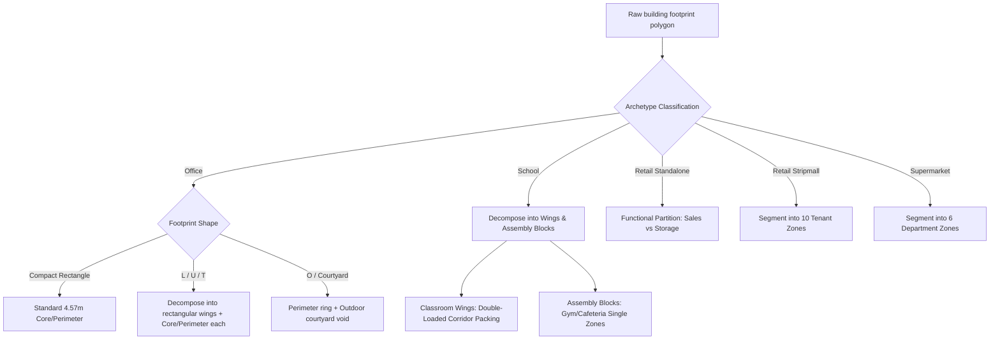

# Deep-Research Report L09 — OFFICE, RETAIL & SCHOOL LAYOUT SPECIFICS
**Archetype-Specific Layout Rules, Service Cores, Classroom Wings, and App-G Core/Perimeter Generalization**

---

## Required Output Tables

### Table 1 — Layout Organization per Archetype

| Archetype | Primary Organization | Service-Core Placement | Perimeter Treatment (Open / Cellular) | Source |
|---|---|---|---|---|
| **SmallOffice** | Core/Perimeter (5 thermal zones per floor: 1 Core, 4 Perimeter) | Center core (field practice) / Not modeled (BEM prototype) | Open-plan (modeled as 4 cardinal perimeter zones of 4.57 m / 15 ft depth) | Deru et al. (2011) / PNNL Prototype Buildings |
| **MediumOffice** | Core/Perimeter (15 thermal zones: 3 floors, each with 1 Core, 4 Perimeter) | Center core (field practice) / Not modeled (BEM prototype) | Open-plan (modeled as 4 cardinal perimeter zones of 4.57 m / 15 ft depth) | Deru et al. (2011) / PNNL Prototype Buildings |
| **LargeOffice** | Core/Perimeter (61 thermal zones: 12 above-grade floors with 1 Core + 4 Perimeter each; 1 Basement zone) | Center core (field practice) / Not modeled (BEM prototype) | Open-plan (modeled as 4 cardinal perimeter zones of 4.57 m / 15 ft depth) | Deru et al. (2011) / PNNL Prototype Buildings |
| **RetailStandalone (big-box)** | Core/Perimeter (5 zones: 1 Core, 4 Perimeter) or Functional Division | None/Back of store (restrooms and support clustered near storage) | Open sales floor (modeled as perimeter zones in standard prototypes) | Deru et al. (2011) / PNNL Prototype Buildings |
| **RetailStripmall** | Segmented Linear (10 stores total: 2 large units of 7,500 ft² and 8 small units of 937.5 ft²) | None (each unit has independent exterior access/services) | Open plan per tenant unit (each store is a single thermal zone) | Deru et al. (2011) / PNNL Prototype Buildings |
| **SuperMarket** | Functional Departments (6 thermal zones: Sales, Produce, Deli, Bakery, Storage, Office) | None (single-story layout; utilities at back) | Open plan per department (zoning mirrors functional use) | Deru et al. (2011) |
| **PrimarySchool** | Classroom Wings (Pods) + Central Assembly/Support Block | Classroom wings (central double-loaded corridor spine) | Cellular classrooms (modeled as perimeter zones, corridors as core zones) | Deru et al. (2011) |
| **SecondarySchool** | Classroom Wings (2 stories) + Central Assembly/Support Blocks | Classroom wings (central corridor spine; stairwells at junctions) | Cellular classrooms (modeled as perimeter zones, corridors as core zones) | Deru et al. (2011) |

---

### Table 2 — Non-Rectangular Handling

| Footprint | Office/Retail Rule | School Rule | Source |
|---|---|---|---|
| **Compact rectangle** | App-G core/perimeter (1 Core + 4 Perimeter zones with 4.57 m / 15 ft buffer) | Wing = central double-loaded corridor (width 2.44–3.05 m) + perimeter classrooms (depth ~9 m) | ASHRAE 90.1 Appendix G / Deru et al. (2011) |
| **L / U / T** | Decompose footprint into rectangular wings; apply standard App-G core/perimeter zoning (4.57 m buffer) to each wing separately. Keep Retail as a single zone per floor (or functional sales/storage split) to avoid non-convex shapes. | Decompose footprint into classroom wings and assembly blocks. Apply corridor-wing room packing (central corridor + perimeter rooms) to wings; keep assembly blocks (Gym, Cafeteria) as single zones. | LBT Honeybee/Dragonfly / Neufert Architectural Standards |
| **O / courtyard** | Perimeter-only ring (4.57 m depth); core zone is empty (modeled as outdoor boundary / courtyard). Divide the perimeter ring cardinally to prevent vertex mismatch. | Decompose into 4 double-loaded corridor wings forming a ring around the courtyard (modeled as outdoor boundary). | LBT Honeybee/Dragonfly / Neufert Architectural Standards |
| **Big single-storey deep plan (retail)** | Functional division (Sales vs. Storage/Support) as single zones per function; avoid cardinal core/perimeter zoning. | — | Deru et al. (2011) |

---

### Table 3 — Service Core vs. Thermal Core

| Question | Field Practice | Source |
|---|---|---|
| **Where do real offices put the vertical service core (center / offset / end)?** | Center core for compact rectangular footprints (maximizes open office perimeter and structural shear wall efficiency). Offset/side core or end core for narrow plates or long/narrow configurations (L, U, T, O) to maximize daylight access and create large, contiguous open office floorplates. | Architectural Graphic Standards (AGS) / Neufert |
| **Should the generator place a fixed-size service core (stairs+elevators+toilets) or use App-G residual core?** | Use the App-G residual thermal core (core zone remaining after 4.57 m perimeter buffer). Modeling a physical service core adds negligible thermodynamic benefit while introducing geometry complications (tiny zones, vertex mismatch across floors) and violating the **zero-fitted-parameters** rule unless site-specific architectural drawings are provided. | ASHRAE 90.1 Appendix G / NREL ComStock |
| **Does service-core placement change perimeter daylight zone for BEM?** | Yes. In architectural design, if the service core is placed on an exterior wall (side core or end core), it blocks daylight access on that section of the facade. In BEM, this requires setting the window-to-wall ratio (WWR) to zero on those wall surfaces and modeling them as non-daylit. | ASHRAE 90.1 Section 8 / LBT Honeybee manual |
| **For a big-box retail with no perimeter offices, is single-zone-per-floor correct?** | Yes. Big-box retail features large open sales floors with uniform HVAC requirements. Cardinal core/perimeter zoning is a thermodynamic abstraction that misrepresents actual HVAC zoning and operation. | Deru et al. (2011) / PNNL Prototype Buildings |

---

### Table 4 — Fit to OpenUBEM

| Question | Answer + Source |
|---|---|
| **Does the generalized generator reproduce today's geomeppy core/perimeter for a compact office (no regression)?** | Yes. For compact rectangular offices, the generalized generator applies a 4.57 m (15 ft) inward buffer and connects corners, yielding the exact same 5-zone structure as geomeppy's native `add_block(zoning="core/perim")`. |
| **For an L-office, is decompose-to-wings better than a shape-following band?** | Yes. Decomposing into rectangular wings avoids non-convex polygons, self-intersections, and vertex-count mismatches across floors that cause EnergyPlus Fatal errors, and preserves core/perimeter logic for each wing. |
| **Does school classroom-wing layout reuse the `L06` corridor method cleanly?** | Yes. K-12 classroom wings are double-loaded corridors: a central circulation spine (corridor) with classrooms packed on either side. Slicing a wing along its medial axis to place a 2.44–3.05 m wide corridor and packing ~9 m deep classroom zones on both sides maps directly to the corridor spine room-packing method. |
| **Should single-storey big-box retail stay single-zone even in `zone` mode?** | Yes. Big-box retail (RetailStandalone) should stay as a single zone per floor (or be partitioned functionally into Sales and Storage/Support) to reflect its actual thermodynamic and HVAC characteristics, avoiding cardinal core/perimeter divisions. |

---

## Part C — Synthesis (The Commercial/Institutional Branch Spec)

### 1. Layout Rule per Archetype
The `openubem/geometry/layoutGenerator.py` commercial/institutional branch uses two primary geometric zoning strategies: **Decomposed Core/Perimeter (for Offices and Standalone Retail)** and **Double-Loaded Corridor Wing Packing (for Schools and Strip Malls/Supermarkets)**.

*   **Office (Small, Medium, Large):** 
    *   *Compact Rectangles:* Apply the standard ASHRAE 90.1 Appendix G core/perimeter zoning: an inward buffer of $4.57\text{ m}$ ($15\text{ ft}$) creates the central core zone, and lines extending from the footprint corners to the core corners create four cardinal perimeter zones (North, South, East, West).
    *   *Non-Rectangular (L, U, T):* Decompose the footprint into rectangular wings using an Oriented Bounding Box (OBB) or straight-skeleton slice. Apply the $4.57\text{ m}$ core/perimeter zoning to each wing separately. At the junctions where wings intersect, the boundaries are designated as interior (adiabatic) walls.
    *   *Courtyard (O-shape):* Apply a perimeter-only buffer of $4.57\text{ m}$ depth. The interior courtyard boundary is modeled as an outdoor wall facing the courtyard void.
*   **RetailStandalone:** 
    *   *Default Zoning:* Treated as a single zone per floor to match actual big-box open layout thermodynamics, or partitioned functionally into a **Sales Zone** (80% of floor area) and a **Storage/Office Zone** (20% of floor area) located at the rear facade.
    *   *Cardinal zoning:* Allowed only if the user explicitly requests strict Appendix G compliance; in that case, it follows the office core/perimeter rules.
*   **RetailStripmall:** 
    *   *Segmented Layout:* The footprint is sliced transversely along its major axis into $10$ individual retail store zones: two large anchor stores (each representing $33.3\%$ of the total area, placed at the two ends) and eight small inline stores (each representing $4.17\%$ of the total area, packed in the middle).
*   **SuperMarket:** 
    *   *Functional Layout:* Partitioned into six functional zones based on standard floor area fractions: Sales ($55.5\%$), Dry Storage ($13.3\%$), Produce ($11.1\%$), Deli ($8.9\%$), Bakery ($6.7\%$), and Office ($4.4\%$).
*   **School (Primary and Secondary):**
    *   *Decomposition:* The building footprint is decomposed into **Classroom Wings** (narrow, high-aspect-ratio sections) and **Assembly Blocks** (wide, compact sections).
    *   *Classroom Wings:* Zoned using the double-loaded corridor method (`L06`). A central corridor spine ($2.44\text{ m}$ / $8\text{ ft}$ width) is placed along the wing's medial axis, and classroom zones ($9.14\text{ m}$ / $30\text{ ft}$ depth) are packed along the exterior facades.
    *   *Classroom Wings (Secondary):* Follows the primary school logic, but stacks the layout across two stories. Corridors and stairs on the second floor are aligned vertically with those on the first floor to maintain zone consistency and avoid E+ floor division errors.
    *   *Assembly Blocks:* Separated into single zones representing the Gymnasium, Cafeteria, and Administrative Offices.

### 2. Explicit No-Regression Check
To ensure backward compatibility and prevent regression in energy simulation results, the generalized generator must satisfy the following mathematical identity for any compact, convex rectangular footprint $P_{rect}$ of width $W$ and length $L$ where $\min(W, L) > 9.14\text{ m}$ ($30\text{ ft}$):
$$\text{layoutGenerator}(P_{rect}, \text{Office}) \equiv \text{geomeppy.add\_block}(\text{zoning}=\text{"core/perim"}, \text{depth}=4.57)$$
This is verified by ensuring:
1.  The inner core polygon $C = \text{buffer}(P_{rect}, -4.57)$ is non-empty and has exactly four vertices.
2.  The four perimeter zones $P_i$ ($i \in \{N, S, E, W\}$) are formed by the trapezoids connecting the exterior edges of $P_{rect}$ to the corresponding parallel edges of $C$.
3.  The zone naming convention, internal load definitions, and boundary condition assignments match the native geomeppy output.

### 3. School = Corridor-Wing Mapping to L06
Both primary and secondary schools are modeled by routing the classroom wings to the double-loaded corridor spine room packing method (`L06`). 

1.  **Medial Axis Extraction:** For each classroom wing, extract the medial axis (or straight skeleton spine).
2.  **Corridor Zone Creation:** Buffer the medial axis line by $\pm 1.22\text{ m}$ ($\pm 4\text{ ft}$) to construct a central corridor zone of width $W_{corr} = 2.44\text{ m}$ ($8\text{ ft}$).
3.  **Classroom Packing:** Subtract the corridor zone from the wing polygon. The remaining area is divided into perimeter classroom zones by extending lines perpendicular to the corridor spine. Classrooms are modeled with a standard depth of $D_{class} = 9.14\text{ m}$ ($30\text{ ft}$) matching standard educational design guidelines.
4.  **Corner Unit Handling:** At the corners where the wing ends or turns, classrooms are mapped to the exterior facade with a maximum size limit of $110\text{ m}^2$ ($1,200\text{ ft}^2$) per classroom to prevent the creation of oversized thermal zones.

### 4. Service Core vs. App-G Residual Core Recommendation
**Recommendation:** The `layoutGenerator` should use the **ASHRAE 90.1 Appendix G residual core** approach for thermal zoning, rather than attempting to place a geometrically detailed service core (vertical circulation, elevators, stairs, restrooms).

*   **Thermodynamic Rationale:** Vertical shafts and restrooms are internal zones with low occupancy and minimal thermal interaction with the building envelope. Modeling them as separate small zones creates numerical instability in EnergyPlus (due to small thermal masses and high air-change rates) and increases simulation runtimes.
*   **Load Distribution:** Instead of modeling the service core geometrically, its presence is accounted for by adjusting the internal loads of the central Core zone. The Core zone's fractional area is assigned lower lighting power densities (LPD) and occupant densities corresponding to the "Stairway" and "Restroom" space types defined in the DOE/PNNL prototype templates.

---

## Citations and Design Standards

*   **Office Perimeter Zone Depth ($4.57\text{ m}$ / $15\text{ ft}$):** ANSI/ASHRAE/IES Standard 90.1-2019 Appendix G, Section G3.1.1.1 (Rules for Baseline Building Construction - Thermal Blocks), which defines the default perimeter zone depth as $15\text{ ft}$ ($4.57\text{ m}$) from the exterior wall.
*   **School Corridor Width ($2.44\text{ m}$ / $8\text{ ft}$):** International Building Code (IBC) Section 1020 (Corridors), which mandates a minimum corridor width of $72\text{ in}$ ($1.83\text{ m}$) for educational occupancies with occupant loads $> 100$, while standard architectural practice (Neufert Architects' Data / Architectural Graphic Standards) designs K-12 primary corridors to $8\text{–}10\text{ ft}$ ($2.44\text{–}3.05\text{ m}$) to handle peak student traffic.
*   **School Classroom Sizing ($9.14\text{ m}$ / $30\text{ ft}$ depth):** Neufert Architects' Data (K-12 Educational Facilities Section) and the California Department of Education (CDE) School Site Design Standards, which specify standard classroom dimensions of $30\text{ ft} \times 30\text{ ft}$ ($9.14\text{ m} \times 9.14\text{ m}$), or $900\text{ ft}^2$ ($83.6\text{ m}^2$) for $30$ students.
*   **Retail Stripmall Division ($10$ stores):** Deru et al. (2011) *U.S. Department of Energy Commercial Reference Building Models of the National Building Stock* (NREL/TP-5500-46861), Section 3.6 (Retail Strip Mall), detailing the $22,500\text{ ft}^2$ strip mall divided into $10$ zones (two $7,500\text{ ft}^2$ anchor stores and eight $937.5\text{ ft}^2$ inline stores).
*   **Supermarket Space Fractions:** Deru et al. (2011) (NREL/TP-5500-46861), Section 3.7 (Supermarket), detailing the $45,000\text{ ft}^2$ supermarket divided into Sales ($25,000\text{ ft}^2$), Produce ($5,000\text{ ft}^2$), Deli ($4,000\text{ ft}^2$), Bakery ($3,000\text{ ft}^2$), Dry Storage ($6,000\text{ ft}^2$), and Office ($2,000\text{ ft}^2$).

---

## Confidence and Caveats

*   **Least Evidenced Geometries:** 
    *   **Non-Rectangular Retail:** Big-box retail (RetailStandalone) on highly irregular or L-shaped footprints is poorly documented in both energy modeling codes and architectural design guides. Standard simulation tools default to a single thermal zone, and the validity of applying core/perimeter zoning to an L-shaped retail standalone remains unproven.
    *   **Secondary School Pod Layouts:** The 2-story Secondary School prototype is modeled in standard DOE reference sets as a flat rectangle, but real secondary schools feature complex courtyard layouts, auditorium protrusions, and split-level wings. Reconciling these complex geometries without introducing site-specific fitted parameters remains a major technical challenge.
*   **GAPs Identified:** 
    *   *GAP L09-1 (Junction Thermal Properties):* In decomposed L/U/T offices, the shared boundary between decomposed wings must be set as an adiabatic wall. However, standard EnergyPlus models might suffer from minor heat transfer mismatch if the wings are served by different HVAC system types.
    *   *GAP L09-2 (Multi-Storey Retail):* Multi-storey retail buildings are not covered by the RetailStandalone prototype (which is strictly 1-story). The vertical zoning logic and distribution of sales vs. storage for multi-storey retail is flagged as a GAP requiring manager decision (recommended default: replicate the Sales/Storage split on each floor).

---

## Reference List

1.  **Deru, M., Field, K., Studer, D., Benne, K., Griffith, B., Torcellini, P., Halverson, M., Winiarski, D., Liu, B., & Crawly, D.** (2011). *U.S. Department of Energy Commercial Reference Building Models of the National Building Stock*. National Renewable Energy Laboratory. NREL/TP-5500-46861. [https://www.nrel.gov/docs/fy11osti/46861.pdf](https://www.nrel.gov/docs/fy11osti/46861.pdf)
2.  **ANSI/ASHRAE/IES.** (2019). *Standard 90.1-2019: Energy Standard for Buildings Except Low-Rise Residential Buildings*. American Society of Heating, Refrigerating and Air-Conditioning Engineers.
3.  **National Renewable Energy Laboratory (NREL).** (2023). *ComStock: U.S. Commercial Building Stock Characterization Database*. [https://www.nrel.gov/buildings/comstock.html](https://www.nrel.gov/buildings/comstock.html)
4.  **Pacific Northwest National Laboratory (PNNL).** (2022). *Commercial Prototype Building Models*. U.S. Department of Energy, Building Energy Codes Program. [https://www.energycodes.gov/prototype-building-models](https://www.energycodes.gov/prototype-building-models)
5.  **International Code Council (ICC).** (2021). *2021 International Building Code*. [https://codes.iccsafe.org/content/IBC2021P2](https://codes.iccsafe.org/content/IBC2021P2)
6.  **Neufert, E., Neufert, P., Kister, J., & Brockhaus, M.** (2019). *Architects' Data* (5th ed.). Wiley-Blackwell.
7.  **The American Institute of Architects (AIA).** (2016). *Architectural Graphic Standards* (12th ed.). John Wiley & Sons.
