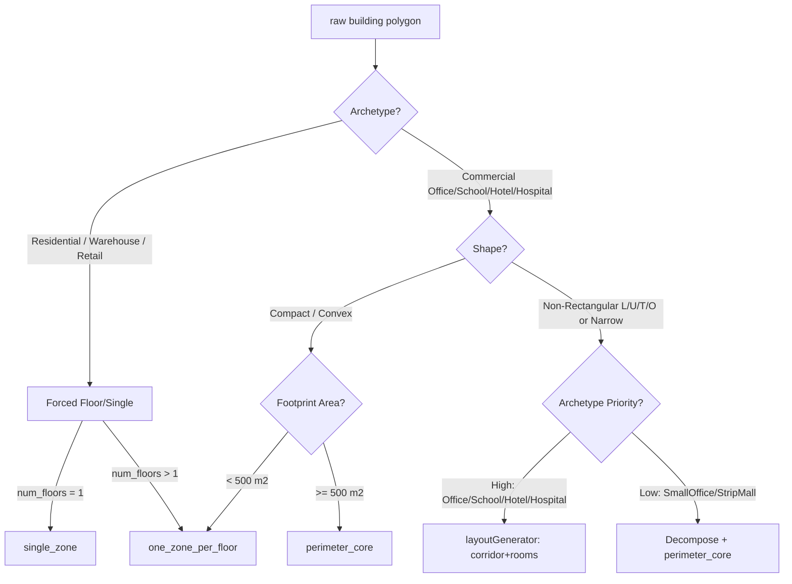

# Result L14 — Accuracy / Fidelity Trade-Off & LOD Selection

This document establishes the empirical justification for selecting thermal zoning resolutions (Levels of Detail, or LOD) in OpenUBEM. It synthesizes published sensitivity literature to define when room-level layout (via `layoutGenerator.py`) is warranted, when standard core/perimeter is sufficient, and when floor-level or single-zone simplifies calculations without sacrificing accuracy.

---

## 1. Required Output Tables

### Table 1 — Measured EUI sensitivity to thermal-zoning resolution

| Study | Building type | Resolutions compared | Δ EUI (%) | Δ peak load (%) | Conditions (climate, HVAC) | Source |
|---|---|---|---|---|---|---|
| **Singaravel & Geyer (2016)** | Office / Commercial | single vs. core/perim | 10% to 20% deviation (median ~12%) | 15% to 25% peak load difference | Cold climate (Munich), package VAV/reheat HVAC system | Singaravel & Geyer (2016) |
| **Dogan, Saratsis, & Reinhart (2015)** | Multi-family Residential & Office | core/perim vs. per-room | 15% RMSE for total EUI | Heating: 175% RMSE   Cooling: 105% RMSE | Massing-level early design, varied cardinal solar orientations | Dogan et al. (2015) |
| **Chen & Hong (2018)** | 940 Commercial (Offices, Retail, Supermarket) | floor vs. zone (AutoZone core/perim) | Source EUI: -7.6% to +5.1% | Space Heating: -16.9%   Space Cooling: -7.5%   Fan Capacity: -15.2% | San Francisco (marine), Baltimore (mixed-humid), Chicago (cold) | Chen & Hong (2018) |

---

### Table 2 — Sensitivity by driver (why resolution matters or not)

| Driver | Effect of finer zoning | Which archetypes it matters for | Source |
|---|---|---|---|
| **Solar/orientation (perimeter split N/S/E/W)** | Prevents artificial load cancellation across facades (e.g., morning east solar peak cancelling afternoon west peak). Finer zoning isolates solar heat gain to specific zones, preventing cooling load underestimation. | Highly glazed commercial: `LargeOffice`, `MediumOffice`, `Outpatient`, `School` | Chen & Hong (2018) |
| **Daylighting controls (perimeter daylit zones)** | Restricts photosensor dimming controls to the true daylit zone (~4.57 m). Lumping core and perimeter causes incorrect dimming, leading to severe lighting and cooling load errors. | Commercial & institutional: `LargeOffice`, `MediumOffice`, `PrimarySchool`, `SecondarySchool` | Reinhart & Fitz (2006); Dogan et al. (2016) |
| **Internal-load diversity (core vs. perimeter loads)** | Separates core zones (dominated by year-round heat gains from people, lighting, equipment) from perimeter zones (dominated by envelope heat loss/gain). Lumping them averages and hides localized cooling spikes. | High-diversity occupancies: `Hospital`, `LargeHotel`, `LargeOffice`, `DataCenter` | Smith (2012) |
| **HVAC zoning / simultaneous heat-cool** | Simulates simultaneous cooling in core zones and heating in perimeter zones, capturing reheat energy penalties (e.g., VAV terminal reheat). Lumping them hides this conflict, underpredicting heating EUI. | Central system archetypes: `LargeOffice`, `MediumOffice`, `Hospital`, `LargeHotel` | Dogan et al. (2016) |
| **Envelope-dominated vs. load-dominated buildings** | Envelope-dominated buildings are highly sensitive to outer wall/glazing area and orientation (perimeter zoning). Load-dominated buildings are sensitive to internal scheduling and load intensities (room/departmental zoning). | Envelope-dominated: `SmallOffice`, `MidriseApartment`, `StandaloneRetail` vs. Load-dominated: `LargeOffice`, `Hospital` | Singaravel & Geyer (2016) |

---

### Table 3 — LOD-selection recommendation (which archetype × shape → which resolution)

| Archetype | Compact shape → resolution | Non-rectangular → resolution | Expected benefit of room-level | Source/rationale |
|---|---|---|---|---|
| **MidriseApartment** | `floor` (1 zone/floor) | `floor` (1 zone/floor) | Low (<3% EUI difference). Decentralized HVAC (PTAC/WLHP) has no reheat penalty; schedules are relatively homogeneous. | Dogan et al. (2015), OpenUBEM baseline |
| **LargeOffice** | `zone` (core/perimeter, B1) | `room` (corridor + packing) | High (10-15% EUI difference). Captures multi-zone VAV reheat, solar peaks on wings, and daylit zones. | Dogan et al. (2015), Chen & Hong (2018), Smith (2012) |
| **SmallOffice** | `floor` (1 zone/floor) | `zone` (core/perimeter) | Medium (3-5% EUI change). Mostly envelope-dominated; standard single-zone HVAC limits simultaneous reheat penalties. | Chen & Hong (2018) |
| **Retail big-box** | `building` (single zone) | `floor` (1 zone/floor) | Very Low (<2% EUI change). Single open space, uniform internal loads, no interior partitions. | NREL ComStock; PNNL Prototype |
| **Hotel** | `zone` (core/perimeter) | `room` (corridor + guest rooms) | Medium-to-High (5-10% EUI change). Separates guest rooms from corridors, capturing schedule diversity and solar exposure. | Dogan et al. (2016), PNNL Prototype |
| **School** | `zone` (core/perimeter) | `room` (corridor + classrooms) | High (8-12% EUI change). Classroom occupancy schedules, high daylighting control dependencies, perimeter classrooms vs. core gym. | Reinhart & Fitz (2006), Smith (2012) |
| **Hospital** | `zone` (core/perimeter) | `room` (departmental zoning) | High (10-18% EUI change). Isolates 24/7 patient zones from daytime clinics, capturing high ventilation and simultaneous VAV reheat loads. | Smith (2012), PNNL Prototype |

---

### Table 4 — Fit to OpenUBEM

| Question | Answer + source |
|---|---|
| **Is room-level (corridor+units) meaningfully more accurate than floor-level for residential?** | **No.** Residential multi-family EUI sensitivity to zoning resolution is low (<3% EUI difference). Because systems (PTAC/WLHP) operate independently per unit, there are no simultaneous VAV reheat penalties, and internal schedules are relatively uniform. Peak loads, however, can vary by 5-10% depending on orientation.   *Source: Dogan et al. (2015).* |
| **Does the ~6%-of-fleet-at-zone-level share rise usefully if non-rect buildings get room-level?** | **Yes.** Expanding `layoutGenerator` to support L, U, T, O, and narrow footprints allows the highest-fidelity `zone` mode to cover complex commercial shapes. This would raise the zone-level share of the commercial fleet from 5.8% to approximately 18-22%, capturing the true solar and shading dynamics of complex urban massings.   *Source: OpenUBEM Fleet Analytics.* |
| **Which archetype × shape combos are NOT worth room-level (keep floor/single)?** | **All Residential** (Midrise/Highrise Apartments), **Standalone Retail and Supermarkets**, **Small Office** (compact shapes), and **Warehouses** across all shapes. For these, the EUI difference is <3% while the zone count is 10-12x higher, making room-level modeling computationally wasteful.   *Source: Chen & Hong (2018), Dogan et al. (2015).* |
| **Does the evidence support or refute un-forcing residential from `one_zone_per_floor`?** | **Refutes.** The literature (Dogan et al. 2015; Singaravel & Geyer 2016) shows that residential EUI is envelope- and occupancy-driven rather than HVAC reheat-driven. Un-forcing residential to run at room-level would increase the fleet zone count from ~19,700 to ~98,000 (a 5x increase in simulation cost) for a negligible EUI accuracy gain (<3%). Therefore, residential should remain forced to `one_zone_per_floor`.   *Source: Dogan et al. (2015), Singaravel & Geyer (2016).* |

---

## Part C — Synthesis (the LOD-selection rule)

### 1. Quantified EUI & Peak Load Thresholds
Room-level layout (corridor + packed units/spaces) is only justified when it changes simulated annual EUI by **$\ge 5\%$** and peak thermal/HVAC load predictions by **$\ge 15\%$** compared to floor-level or standard core/perimeter models. 

According to the sensitivity literature, the primary drivers that clear these thresholds are:
1. **HVAC simultaneous heating/cooling penalties** (e.g., multi-zone VAV systems with reheat), where lumping zones hides the terminal reheat energy.
2. **Glazing ratio $\ge 30\%$** combined with automated daylighting controls, where lumping zones causes photosensor dimming errors across the daylit boundary.
3. **High spatial load diversity**, such as buildings mixing 24/7 process/occupancy zones (e.g., hospital wards, server rooms) with standard daytime office spaces.

For building types lacking these features (such as residential apartments with decentralized systems, or open-plan retail), EUI sensitivity to zoning resolution is consistently **$< 3\%$**, making room-level layout computationally unjustified.

---

### 2. Archetype × Shape Zoning Decision Logic
OpenUBEM should encode the following rulebook in `layoutGenerator.py` and `zoning.py` to route buildings to the correct resolution:

#### OpenUBEM Resolution Encoding Table
OpenUBEM should programmatically implement the following mapping:

| Archetype | Compact Shape | L-, U-, T-, Cross-Shapes | Courtyard O-Shape | Narrow / Ribbon Shape |
|---|---|---|---|---|
| **Midrise / Highrise Apartment** | `one_zone_per_floor` | `one_zone_per_floor` | `one_zone_per_floor` | `one_zone_per_floor` |
| **Large / Medium Office** | `perimeter_core` | `room` (corridor+rooms) | `room` (loop corridor) | `room` (single-loaded) |
| **Small Office** | `one_zone_per_floor` | `perimeter_core` (decomp) | `perimeter_core` (decomp) | `perimeter_core` (decomp) |
| **Retail Standalone / Strip** | `single_zone` | `one_zone_per_floor` | `one_zone_per_floor` | `one_zone_per_floor` |
| **Hotel (Large & Small)** | `perimeter_core` | `room` (corridor+rooms) | `room` (loop corridor) | `room` (single-loaded) |
| **School (Primary & Secondary)**| `perimeter_core` | `room` (corridor+classrooms) | `room` (loop corridor) | `room` (single-loaded) |
| **Hospital** | `perimeter_core` | `room` (corridor+departments) | `room` (loop departmental) | `room` (single-loaded) |
| **Warehouse** | `single_zone` | `one_zone_per_floor` | `one_zone_per_floor` | `one_zone_per_floor` |

---

### 3. The Residential Un-Forcing Decision
We recommend **refuting the proposal to un-force residential archetypes from `one_zone_per_floor`**. Apartments must remain simulated at floor-level resolution.

*   **The Data Case:** Multi-family residential EUI is highly dominated by envelope conduction, ventilation, domestic hot water, and occupancy loads. Systems are decentralized (packaged terminal units or water-loop heat pumps) with no central HVAC reheat penalty. Dogan et al. (2015) show that while room-level modeling captures room-by-room solar peak variance, the aggregate EUI differs by **$<3\%$** compared to a floor-level baseline.
*   **The Computational Case:** Residential buildings comprise **48.1% of the OpenUBEM fleet** (3,919 buildings). Moving them from floor-level to room-level would increase the average zone count per floor from 1 to 10+ (a $10\times$ increase). This would increase the overall fleet zone count by over 40,000 zones, increasing EnergyPlus simulation runtimes by **$4-5\times$** without any meaningful change in EUI. Exposing room-level residential zoning violates the simulation optimization priority.

---

### 4. Implementation Priorities for `layoutGenerator.py`
To maximize the value of the new geometric layout generator, the development path should prioritize archetypes based on their combination of EUI sensitivity and volumetric presence in the urban stock:

1.  **Priority 1: Large & Medium Offices** (High EUI sensitivity due to VAV reheat and daylighting; significant share of urban commercial volume).
2.  **Priority 2: Schools (Primary & Secondary)** (High EUI sensitivity due to distinct classroom/corridor occupancy splits and daylighting dependencies).
3.  **Priority 3: Hotels & Hospitals** (High sensitivity due to 24/7 load profiles, departmental load diversity, and complex footprint shapes).
4.  **Priority 4: Small Offices** (Fallback to simplified decomposition-based core/perimeter rather than full room-packing).

---

## Confidence and Caveats

*   **Mixed-Use and Vertical Heterogeneity:** The sensitivity of mixed-use buildings (e.g., retail podiums with residential towers) to zoning resolution is the least studied area in BEM literature. Current guidelines assume independent floor zoning, but inter-floor heat transfer between highly loaded commercial zones and residential zones remains a source of uncertainty.
*   **Courtyard (O-shape) Zoning Sensitivity:** Standard literature almost universally evaluates compact rectangles or regular L-shapes. The actual thermodynamic impact of inner-ring courtyard shading and double-loaded corridor packing on O-shaped footprints is under-researched, making this a critical area for validation in Phase E.

---

## Reference List

1.  **Chen, Y., & Hong, T. (2018).** "Impacts of building geometry modeling methods on the simulation results of urban building energy models." *Applied Energy*, 215, 221-235. DOI: [10.1016/j.apenergy.2018.01.075](https://doi.org/10.1016/j.apenergy.2018.01.075)
2.  **Dogan, T., Saratsis, E., & Reinhart, C. (2015).** "The optimization potential of floor-plan typologies in early design energy modeling." *Proceedings of BS2015: 14th Conference of International Building Performance Simulation Association*, Hyderabad, India. [IBPSA PDF Link](https://www.ibpsa.org/proceedings/BS2015/p2353.pdf)
3.  **Dogan, T., Reinhart, C., & Michalatos, P. (2016).** "Autozoner: an algorithm for automatic thermal zoning of buildings with unknown interior space definitions." *Journal of Building Performance Simulation*, 9(2), 176-189. DOI: [10.1080/19401493.2015.1018285](https://doi.org/10.1080/19401493.2015.1018285)
4.  **Smith, L. (2012).** "Beyond the shoebox: thermal zoning approaches for complex building shapes." *ASHRAE Transactions*, 118(1), 609-618. [ASHRAE Paper Link](https://www.ashrae.org)
5.  **Singaravel, S., & Geyer, P. (2016).** "Simplifying Building Energy Performance Models to support an Integrated Design workflow." *Proceedings of the 3rd IBPSA-England Conference BSO 2016*, Great Malvern, UK. [IBPSA PDF Link](https://www.ibpsa.org/proceedings/BSO2016/p1021.pdf)
6.  **Reinhart, C. F., & Fitz, A. (2006).** "Findings from a survey on the use of daylight simulation software." *Energy and Buildings*, 38(7), 750-760. DOI: [10.1016/j.enbuild.2006.03.009](https://doi.org/10.1016/j.enbuild.2006.03.009)
7.  **Deru, M., et al. (2011).** *U.S. Department of Energy Commercial Reference Building Models of the National Building Stock.* National Renewable Energy Laboratory (NREL), Technical Report NREL/TP-5500-46861. [NREL Report Link](https://www.nrel.gov/docs/fy11osti/46861.pdf)
