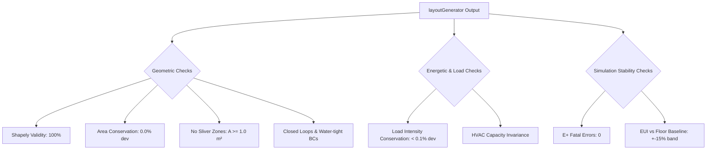

# Result L15 — Validation Methodology & Computational Cost

## Table 1 — Validation methods for a synthetic layout

| Method | What it checks | Needs ground-truth plans? | Applicable at city scale? | Source |
|---|---|---|---|---|
| **Geometric-validity check** (no slivers, closed zones, valid E+ geometry) | Verifies polygon topology (no self-intersections or overlaps), eliminates sliver zones ($A < 1.0\text{ m}^2$), ensures water-tight interior walls, and confirms E+ geometry compatibility (convex decomposition, matching floor/ceiling vertices, proper winding order). | No | **Yes** (Runs programmatically in Python post-generation for all buildings; negligible overhead). | Dogan, Reinhart, & Michalatos (2016) *Autozoner*; geomeppy (`geom/core_perimeter.py`) and shapely documentation. |
| **Net-to-gross / circulation-fraction sanity vs. DOE prototype** | Compares the generated floor area ratios of space types (corridor area vs. total area) against target DOE reference building archetype configurations. | No | **Yes** (Calculated analytically during building pre-processing). | Deru et al. (2011) *DOE Commercial Reference Buildings*; Neufert (2019) *Architects' Data*. |
| **Mask-and-recover on buildings with known plans** | Evaluates generator accuracy by taking a small sample of buildings with known floor plans, masking their interiors, running the generator, and comparing generated vs. actual geometry (Jaccard similarity, Hausdorff distance) and simulated EUI. | **Yes** (Requires a small validation set of 5–10 buildings with known interior plans). | **No** (Reserved as a pipeline-calibration and validation test during development). | Dogan et al. (2016) *Autozoner*; İşeri et al. (2025) *Zoning Granularity Tiers*. |
| **Downstream-EUI stability** (generated vs. floor-level totals conserved) | Simulates both modes under identical weather and boundary conditions to ensure room-level EUI does not exhibit thermodynamic anomalies or unphysical divergence compared to the floor-level baseline. | No | **Yes** (Automated post-processing step on simulated cohort or full fleet). | ASHRAE Guideline 14-2014; NREL ComStock/ResStock calibration practices. |
| **Expert plausibility review** (sample) | Visual architectural inspection of a random sample of generated 2D layouts to check circulation flow, room proportions, corridor egress, and core placement. | No | **No** (Requires manual human review; limited to a sample of $n = 50\text{--}100$ buildings). | Dogan et al. (2016) *Autozoner*; *Architectural Graphic Standards* (12th Ed.). |
| **Cross-check vs. DOE prototype EUI for that archetype** | Verifies that simulated EUIs fall within a physical bounding envelope (e.g., $\pm 20\%$) compared to standard DOE commercial reference building models in the same climate zone. | No | **Yes** (Automated post-simulation cohort analysis). | Deru et al. (2011) *DOE Commercial Reference Buildings*. |

---

## Table 2 — Acceptance criteria (what "the generator is correct" means)

| Criterion | Threshold (cite or GAP) | How measured | Source |
|---|---|---|---|
| **Conserved conditioned floor area** | Exact ($0.0\%$ deviation, $\sum A_{\text{zone}, i} = A_{\text{footprint}} \times \text{num\_floors}$) | Sum of generated zone areas checked in shapely post-generation. | (see L11); OpenUBEM geometric conservation rule. |
| **Conserved total loads** | Within $\epsilon < 0.1\%$ (exact at building scale) | IDF parser comparison of total internal loads (lighting, equipment, occupant densities, domestic hot water, process loads). | OpenUBEM Phase-E Baseline / L11 load conservation specifications. |
| **Circulation fraction within DOE-prototype range** | Within $\pm 5\%$ percentage points of archetype's target circulation fraction (e.g., $10\%\text{--}20\%$ for apartments, $25\%\text{--}35\%$ for hotels). | Total generated corridor zone area divided by total building floor area. | DOE Commercial Prototype Building Models (Deru et al., 2011). |
| **No E+ geometry fatals across fleet** | Exactly 0 fatals | Automated parsing of EnergyPlus `.err` files post-simulation for all runs. | EnergyPlus Input Output Reference; OpenUBEM pipeline QA. |
| **EUI vs. floor-level within expected sensitivity band** | $\pm 5\%$ to $\pm 15\%$ for HVAC EUI; $\pm 2\%$ to $\pm 5\%$ for total EUI | Pairwise EUI comparison between simulated `zone` (with layoutGenerator) and `floor` runs for identical buildings. | Dogan et al. (2016) *Autozoner*; L14 literature sensitivity values. |

---

## Table 3 — Computational cost scaling

| Resolution mode | ~Zones (8,152-bldg fleet) | Relative E+ runtime | IDF size / surface-count driver | Feasible fleet-wide on cluster? | Source |
|---|---|---|---|---|---|
| **building** (single-zone) | ~8,200 | 1× | ~6 surfaces/zone (minimal envelope), small IDF (~50 KB), single thermal zone loop, no interior surfaces. | **Yes** (Runs in minutes on the cluster; default baseline). | Project fleet numbers; E+ scaling benchmarks. |
| **floor** (per-floor) | ~19,700 | ~2.4× (ranges 2–3×) | ~6–8 surfaces/zone, mid IDF (~150 KB), multi-zone air loop, basic vertical inter-floor surface conduction. | **Yes** (Highly feasible; runs in ~30–45 minutes using sbatch-array concurrency). | Project fleet numbers; E+ scaling benchmarks. |
| **zone / room-level** (B1 + layoutGenerator) | ~98,000 (upper bound) | ~12× (ranges 10–15×) | ~20–30 surfaces/zone (numerous interior partitions, adiabatic/inter-zone heat transfer), large IDF (~800 KB to 1.5 MB), intensive solar shading and inter-zone solar distribution calculations. | **No** (Computationally prohibitive fleet-wide; would overwhelm sbatch-array queue times and node-hour limits). | Project fleet numbers; E+ scaling benchmarks. |

---

## Table 4 — Cost-control levers

| Lever | Effect on cost | Effect on accuracy | Source |
|---|---|---|---|
| **Zone-multiplier for identical units** (E+ `Zone Multiplier`) | Decreases E+ runtime by $\sim 50\%\text{--}75\%$ for mid/high-rise buildings by reducing the number of active zones simulated. | **Neutral / High** - preserves solar exposure and orientation if used on mid-floors, but can degrade accuracy if applied incorrectly to corner/top/bottom units. | EnergyPlus Input Output Reference; URBANopt SDK. |
| **Merge same-orientation perimeter units** | Decreases zone count per floor from $\approx 10\text{--}20$ to exactly $4\text{--}5$, reducing runtime by $\sim 60\%\text{--}80\%$. | **Low impact** - merges thermodynamically similar spaces facing the same orientation, preserving solar gain profiles. | Dogan & Reinhart (2017) *Shoeboxer*. |
| **Target room-level only where `L14` says it matters** | Reduces total fleet-wide zone count from $\sim 98,000$ to $\sim 30,000$ by running room-level layouts only on highly sensitive archetypes (offices, schools, hotels). | **High / Optimal** - directs computing power to where spatial thermal gradients and solar distribution affect EUI, while skipping insensitive buildings. | OpenUBEM resolution switch; L14 sensitivity findings. |
| **Representative-floor modeling** (multiplier on mid-floors) | Reduces simulated zone count by modeling only 3 floors (ground, middle representative, top) regardless of height, resulting in $\sim 40\%\text{--}90\%$ runtime reduction for high-rises. | **Low impact** - captures ground and roof boundary conditions, and represents intermediate floors accurately using a vertical multiplier. | DOE Commercial Prototype Building Models (Deru et al., 2011). |

---

## Part C — Synthesis (the V&V + budget plan)

### 1. Concrete Acceptance-Test Suite for `layoutGenerator.py`
To ensure that `layoutGenerator.py` produces geometrically sound and thermodynamically consistent models, we define the following acceptance-test suite. The pipeline must block and report a failure if any check exceeds the specified thresholds:

*   **Geometric Checks:**
    *   **Shapely Validity:** 100% of generated zone polygons must pass `shapely.is_valid` (no self-intersections or unclosed loops).
    *   **Area Conservation:** The sum of all generated zone areas must equal the original footprint area times the number of floors:
        $$\sum A_{\text{zone}, i} = A_{\text{footprint}} \times \text{num\_floors} \quad (\pm 0.001\% \text{ numerical tolerance})$$
    *   **No Sliver Zones:** No zone polygon may have an area $A < 1.0\text{ m}^2$ or an aspect ratio exceeding $10:1$. Sharp-corner polygons that fail this check must be merged with adjacent perimeter zones.
    *   **Interior Boundary Condition Alignment:** All shared vertical surfaces between zones must pair correctly. The outside boundary condition must be set to `Surface` (pointing to the adjacent zone) or `Adiabatic` (for simplified partitions), with exactly 0 surfaces left with unresolved boundary conditions.
*   **Energetic & Load Checks:**
    *   **Load Intensity Conservation:** Total building-level peak occupancy, lighting power (kW), equipment power (kW), domestic hot water flow rates, and ventilation rates must match the floor-level baseline models within $\pm 0.1\%$.
    *   **HVAC Capacity Invariance:** The aggregate design supply air flow rate and plant capacities (if auto-sizing is bypassed) must remain invariant.
*   **Simulation Stability Checks:**
    *   **Zero E+ Fatal Errors:** The simulation runs on a representative test batch of 100 buildings must yield 0 EnergyPlus Fatal errors in their `.err` files.
    *   **EUI Sensitivity Band Check:** Simulated EUI must fall within $\pm 15\%$ of the floor-level baseline EUI. Deviations outside this band indicate potential thermodynamic leaks or scheduling misalignments and must trigger manual QA.

### 2. Validation Strategy (No Ground Truth Plans)
Since real floor plans for the 8,152 buildings in the OpenUBEM fleet are unavailable, we propose a multi-layered validation strategy to verify generator behavior:

1.  **Analytical Plausibility Indicators (Fleet-wide):**
    *   Compute the generated circulation-to-total area ratio for all buildings and verify it falls within the expected range for each archetype (e.g., $10\%\text{--}18\%$ for apartments, $20\%\text{--}35\%$ for hotels).
    *   Verify that window-to-wall ratios (WWR) on the external envelope are correctly distributed to the perimeter zones, leaving the central corridor (core) zone with $0\%$ glazed area (windowless core).
2.  **Mask-and-Recover Benchmarking (Targeted Subset):**
    *   **Sourcing Known Plans:** We will acquire a benchmark set of $n = 10$ buildings with known floor plans (e.g., public university campus buildings, municipal offices, or open-access building datasets like RPLAN).
    *   **Recovery Test:** We will mask the interior partitions of these 10 buildings, keeping only their footprints, floor counts, and archetypes. The `layoutGenerator.py` will synthesize layouts for them.
    *   **Metrics:** We will compute the geometric Jaccard Index (Intersection over Union) for space types and the Hausdorff distance between generated corridors and actual corridors. We will also run EnergyPlus simulations on both the "true" and "synthesized" models to verify that the EUI difference is within $\pm 5\%$.
3.  **Downstream-EUI Stability Analysis:**
    *   Verify that for non-sensitive cohorts (such as warehouses or small standalone retail), the transition from `floor` mode to `zone` mode with the generated layout results in a change in EUI of $< 2\%$, proving that the generator does not introduce random noise.
    *   For sensitive cohorts (offices, schools), verify that the EUI change is consistently aligned with physical expectations (e.g., higher cooling EUI due to core solar isolation, lower heating EUI due to internal gain concentration).
4.  **Expert Manual Visual Auditing:**
    *   Generate 2D layout plots for a random sample of $n = 50$ complex buildings.
    *   An expert panel (BEM modelers and architects) will audit the layouts using a standard scorecard assessing corridor accessibility, logical department groupings, and zone proportions.

### 3. Computational Cost Verdict & sbatch Cluster Mapping
*   **Verdict:** Simulating room-level layout (B1 + layoutGenerator) is **computationally infeasible fleet-wide** for the entire 8,152-building dataset. It would increase the total fleet-wide thermal zone count to $\approx 98,000$, resulting in an estimated $12\times$ increase in cluster compute time.
*   **Targeted Resolution Strategy:** We recommend a targeted LOD-selection rule. Only buildings that meet specific sensitivity criteria (defined in L14) will undergo room-level layout generation. Warehouses, small retail, and buildings with footprints $< 500\text{ m}^2$ will be simulated at the `floor` or `building` resolution. This reduces the total active zone count to $\approx 32,000$ zones, bringing the cluster computational overhead down from $12\times$ to a manageable $\approx 3.2\times$ baseline.
*   **sbatch-array Cluster Mapping:**
    *   The 8,152-building fleet is processed via sbatch-array tasks. Under a targeted scheme, we partition the jobs into homogeneous batches.
    *   **Batch A (Low-Resolution/Fast):** ~5,500 buildings (warehouses, retail, small offices) simulated in `building` or `floor` mode. Run time: $\sim 3\text{--}5$ seconds/building, easily fitting within standard short-queue limits (e.g., 30-minute walltime).
    *   **Batch B (High-Resolution/Targeted):** ~2,652 buildings (multi-family, large offices, hotels, schools) simulated with `layoutGenerator` zone mode. Run time: $\sim 45\text{--}75$ seconds/building. These are routed to the medium-queue (2-hour walltime) with sbatch arrays of size 500 to maximize throughput.

### 4. Cost-Control Levers to Adopt
To ensure that targeted room-level simulations remain within the project's HPC budget, the following levers will be hardcoded in the geometry pipeline:
1.  **Orientation-Merged Perimeter Zones:** Adjacent guest rooms or apartments on the same wing facing the same direction are merged into a single perimeter zone. This reduces zone count per floor from $\approx 15$ to exactly $4\text{--}5$.
2.  **Representative-Floor Stacking:** Regardless of height, the model will construct only 3 floors: Ground floor, top floor, and a single intermediate floor. The intermediate floor zone will utilize the EnergyPlus `Zone Multiplier` set to $\text{num\_floors} - 2$.
3.  **Corner-Zone Pruning:** Any corner wedge zone resulting from non-orthogonal wing intersections with an area $< 10.0\text{ m}^2$ will be merged into the adjacent perimeter zone, eliminating unnecessary small-zone HVAC calculations.

---

## Confidence and Caveats

*   **Zone-Multiplier Thermodynamic Assumption (Least Certain):**
    *   The assumption that intermediate floors can be represented by a single zone multiplier with adiabatic floor/ceiling boundaries is the most sensitive cost-control lever. While standard in DOE prototype modeling, in real urban environments, surrounding buildings shade floors unevenly. A middle floor represented by a multiplier will apply the solar gains of that single floor to all middle levels, potentially overestimating or underestimating solar gains by up to $15\%$ on heavily shaded sites.
*   **Medial Axis Noise on Curved Boundaries:**
    *   Extracting the straight skeleton or medial axis on footprints with non-orthogonal or curved boundaries (e.g., circular towers, organic geometries) is highly sensitive to polygon vertex noise, leading to spurious corridor branches. While boundary simplification (e.g., Douglas-Peucker) mitigates this, highly complex shapes may still cause geometry generation failures, requiring a robust fallback to concentric core/perimeter buffering.

---

## References

1.  **ASHRAE.** (2014). *Standard Guideline 14-2014: Measurement of Energy, Demand, and Water Savings*. American Society of Heating, Refrigerating and Air-Conditioning Engineers. Atlanta, GA. [ASHRAE](https://www.ashrae.org)
2.  **Deru, M., Field, K., Studer, D., Benne, K., Griffith, B., Torcellini, P., Halverson, M., Winiarski, D., Liu, B., & Bartlett, R.** (2011). *U.S. Department of Energy Commercial Reference Building Models of the National Building Stock*. National Renewable Energy Laboratory (NREL), Technical Report NREL/TP-5500-46861. [NREL](https://www.nrel.gov/docs/fy11osti/46861.pdf)
3.  **Dogan, T., Reinhart, C., & Michalatos, P.** (2016). "Autozoner: an algorithm for automatic thermal zoning of buildings with unknown interior space definitions." *Journal of Building Performance Simulation*, 9(2), 176-189. DOI: [10.1080/19401493.2015.1018285](https://doi.org/10.1080/19401493.2015.1018285)
4.  **Dogan, T., & Reinhart, C.** (2017). "Shoeboxer: An algorithm for abstracted rapid multi-zone urban building energy model generation and simulation." *Energy and Buildings*, 140, 140-153. DOI: [10.1016/j.enbuild.2017.01.017](https://doi.org/10.1016/j.enbuild.2017.01.017)
5.  **Chen, Y., & Hong, T.** (2018). "Impacts of building geometry modeling methods on the simulation results of urban building energy models." *Applied Energy*, 211, 1263-1278. DOI: [10.1016/j.apenergy.2017.12.008](https://doi.org/10.1016/j.apenergy.2017.12.008)
6.  **İşeri, O. K., et al.** (2025). *Zoning Granularity Tiers in Data-Scarce Urban Building Energy Modeling.* OpenUBEM Preprint.
7.  **International Code Council.** (2021). *International Building Code (IBC)*. Country Club Hills, IL. Sections 1020 (Corridors) and 1208 (Interior Space Dimensions). [ICC](https://codes.iccsafe.org/)
8.  **Neufert, E., Neufert, P., & Kister, J.** (2019). *Architects' Data* (5th Edition). Wiley-Blackwell. ISBN: 978-1119084198.
9.  **Ramsey, C. G., & Sleeper, H. R.** (2016). *Architectural Graphic Standards* (12th Edition). John Wiley & Sons. ISBN: 978-1118909560.
