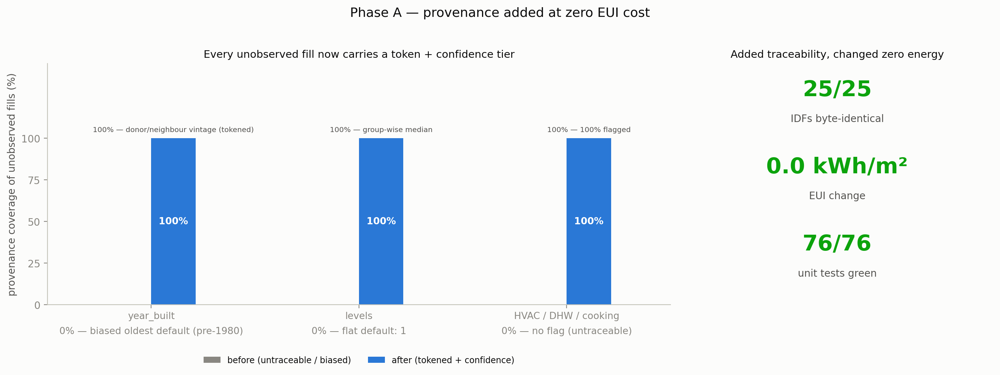
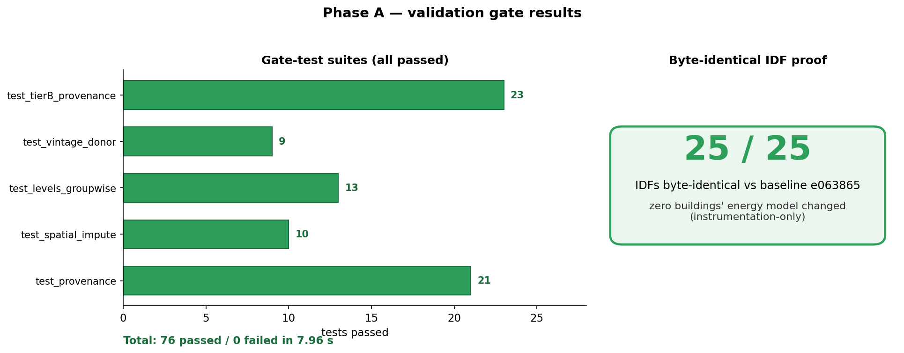
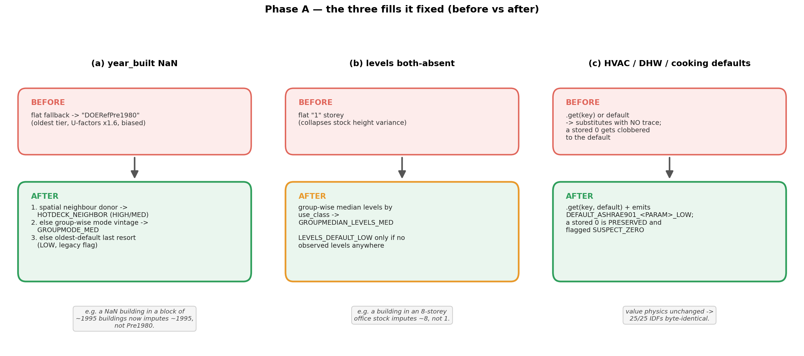
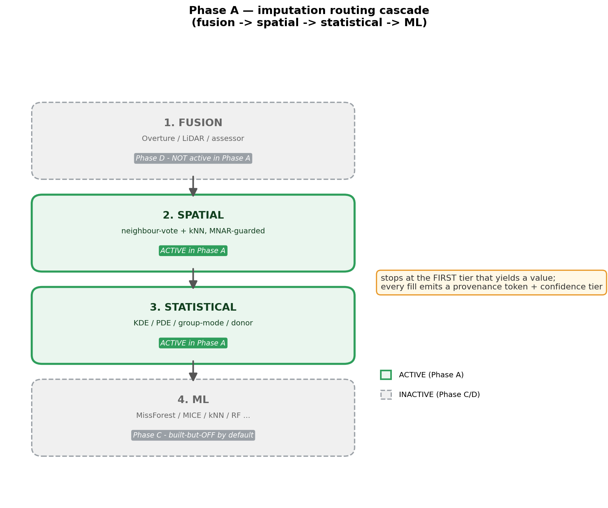
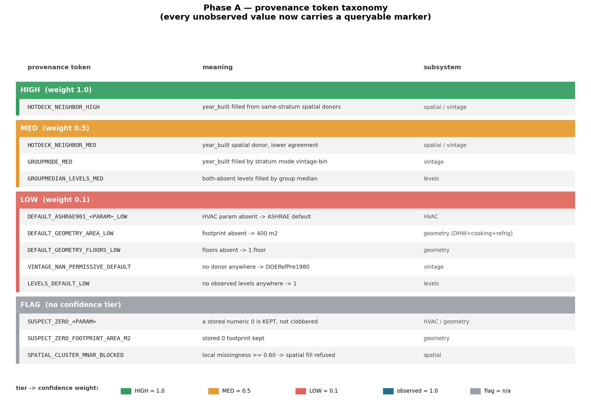

# RESULTS — Phase A (statistical imputer + provenance)

**Arc:** Input-Parameter Imputation ("OpenUBEM AI")
**Phase:** A — provenance-complete statistical MVP (user tier 1)
**Status:** ✅ CLOSED — checkpoint CP-1 MET (2026-07-01)
**Source of record:** `../../PLAN_input_imputation_implementation.md` §8 progress log
(entries "CP-1 CHECKPOINT MET" + "CP-1 EUI half — exact IDF field-diff").

---

## What Phase A actually delivered

Phase A is **not** an EUI experiment — it does not produce an "energy improved by X%" number.
It builds the statistical imputer and closes the provenance gaps. Its result is therefore a
**proof that the imputer works without changing any simulated energy** — i.e. instrumentation-only.

Two headline numbers say it passed:

- ✅ **76 / 76 unit tests green** — the five Phase-A gate suites, 0 failed / 0 errored
  (reproduced 2026-07-11; log in `phaseA_gate_tests_output.txt`). Recorded as 75 at CP-1;
  `test_provenance` has since gained one test (20 → 21), no regressions.
- ✅ **25 / 25 IDFs byte-identical** — exact local field-diff vs the pre-work baseline (`e063865`)
  over a 24-archetype fleet: the new provenance instrumentation changed the energy model of
  **zero** buildings.

---

## Quantitative before/after

The companion figure below states Phase A's honest before/after: provenance coverage of unobserved
fills goes 0 → 100% while the simulated energy does not move at all.

No predicted-vs-actual scatter is shown for Phase A: it is a **byte-identity** proof (25/25 IDFs
identical, 0.0 kWh/m² change), not a recovery-accuracy measurement — there is no predicted/actual pair
to plot.

---

## The five gate suites (76/76)

| Test suite | Tests | What it proves |
|---|---|---|
| `test_tierB_provenance` | 23 | HVAC/DHW/cooking silent defaults now leave a queryable flag; a stored `0` is kept, not clobbered |
| `test_vintage_donor` | 9 | NaN `year_built` fills from same-stratum spatial/group donors before the oldest-default |
| `test_levels_groupwise` | 13 | Both-absent `levels` fills from group-wise median, not a flat `1` |
| `test_spatial_impute` | 10 | Neighbour-vote / kNN fill + MNAR guard (deactivates spatial fill at missingness ≥ 0.60) |
| `test_provenance` | 21 | Token format + confidence tiers (HIGH/MED/LOW) + idempotent flag append |
| **Total** | **76** | all green in 7.96 s (2026-07-11 reproduction) |

---

## The EUI-unchanged proof (25/25 byte-identical)

The whole point of Phase A's delicate work (converting `.get(k) or d` → `.get(k, d)` + a tracked
flag) was to add **traceability** to HVAC/DHW/cooking defaults **without touching any physics**.

- Method (user-ratified): exact **local IDF field-diff** against `e063865`, the pre-instrumentation
  baseline — strictly stronger than a cluster full-sim (no ≤2 kWh/m² platform-rounding blind spot)
  and zero cluster cost.
- Result: **25 / 25 IDFs byte-identical** across a 24-archetype coverage fleet
  (`diff_idfs.py` + `diff -rq` exit 0 + md5sum cross-check all report 0 differing files).
- Two deliberate behavioural improvements were enumerated and proven **non-firing** on every current
  archetype: (1) a literal `0` is preserved instead of promoted to the default; (2) a `NaN` no longer
  leaks through truthiness. Both are correctness fixes, not regressions.

---

## The three fills Phase A fixed (before vs after)

The statistical work targeted the three highest-leverage gaps the manager audit found: the biased
oldest-vintage default, the flat 1-storey default, and the untraceable HVAC/DHW/cooking defaults.

---

## How the imputer routes (fusion → spatial → statistical → ML)

Every fill flows through a fixed precedence, stopping at the first tier that yields a value. Phase A
lit up the **spatial** and **statistical** tiers; fusion (Phase D) and ML (Phase C) are drawn greyed
because they are not active here.

---

## What is now traceable (provenance tokens added in Phase A)

Every value the pipeline did not observe now carries a token + confidence tier. Key new tokens:

| Token | Fires when | Confidence |
|---|---|---|
| `DEFAULT_ASHRAE901_<PARAM>_LOW` | HVAC param absent → ASHRAE default used | LOW |
| `DEFAULT_GEOMETRY_AREA_LOW` / `_FLOORS_LOW` | footprint / floors absent → 400 m² / 1 floor | LOW |
| `HOTDECK_NEIGHBOR_HIGH` / `_MED` | `year_built` filled from same-stratum spatial donors | HIGH / MED |
| `GROUPMODE_MED` | `year_built` filled by stratum mode vintage-bin | MED |
| `GROUPMEDIAN_LEVELS_MED` | both-absent `levels` filled by group median | MED |
| `SPATIAL_CLUSTER_MNAR_BLOCKED` | local missingness ≥ 0.60 → spatial fill refused | (flag) |
| `SUSPECT_ZERO_<PARAM>` | a stored numeric `0` kept instead of defaulted | (flag) |

Full registry: parent plan §5G. The full taxonomy, grouped by confidence tier and subsystem:

---

## ⚠️ Important — do not confuse Phase A and Phase B numbers

Phase A does **not** produce the well-known EUI accuracy numbers. Those belong to **Phase B (CP-2)**,
which built the validation harness and *measured* the Phase-A imputer on real cities:

| Phase | Result | Where |
|---|---|---|
| **A (CP-1)** | 76/76 tests + 25/25 IDFs byte-identical (imputer built, nothing broken) | this file |
| **B (CP-2)** | nyc_centre N=32: NMBE **+0.49%** / CV(RMSE) **1.71%** · la_urban N=124: **+0.08%** / **0.61%** (both PASS 5%/15%) | see `../phase_B/RESULTS_phaseB.md` |

In one line: **Phase A proves the imputer is safe; Phase B proves it is accurate.**
