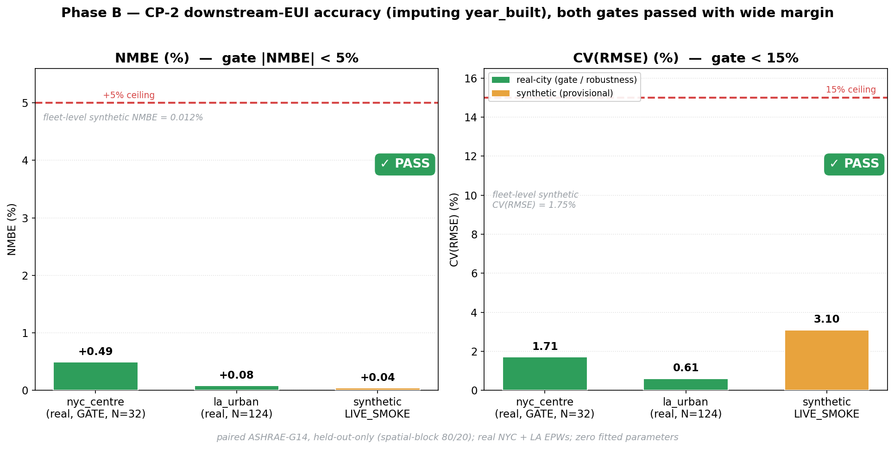
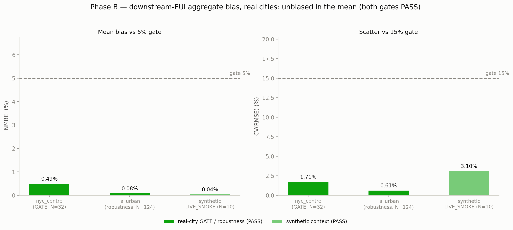
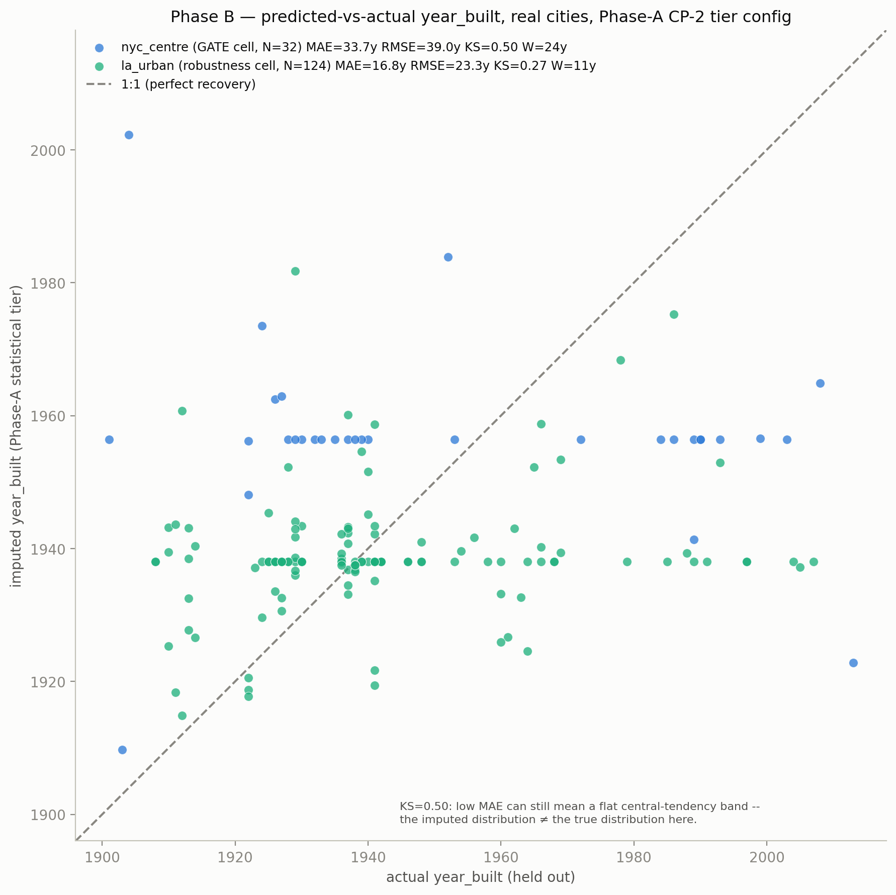
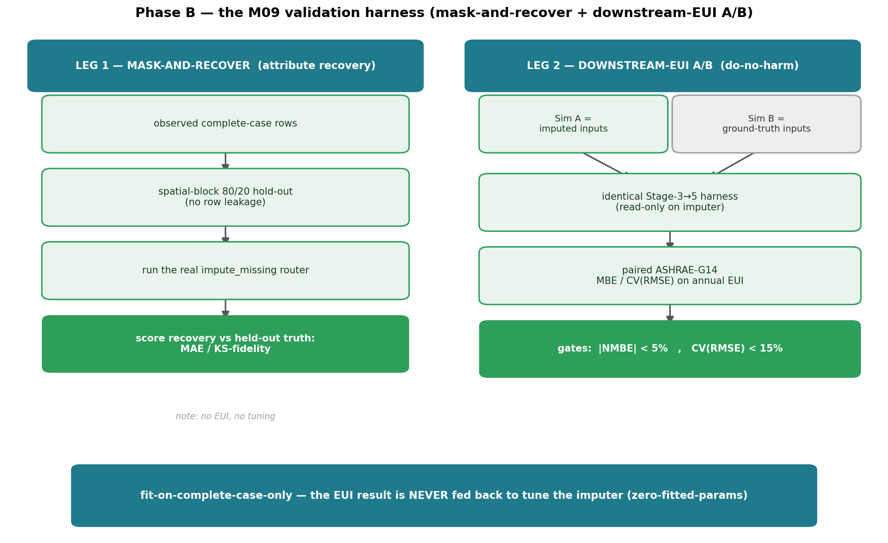
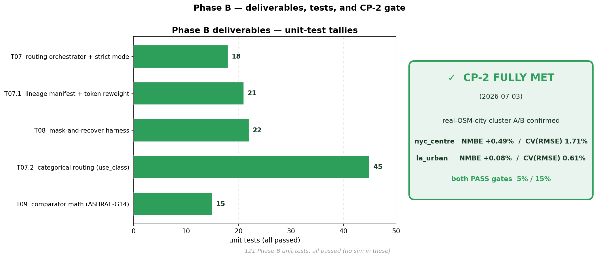
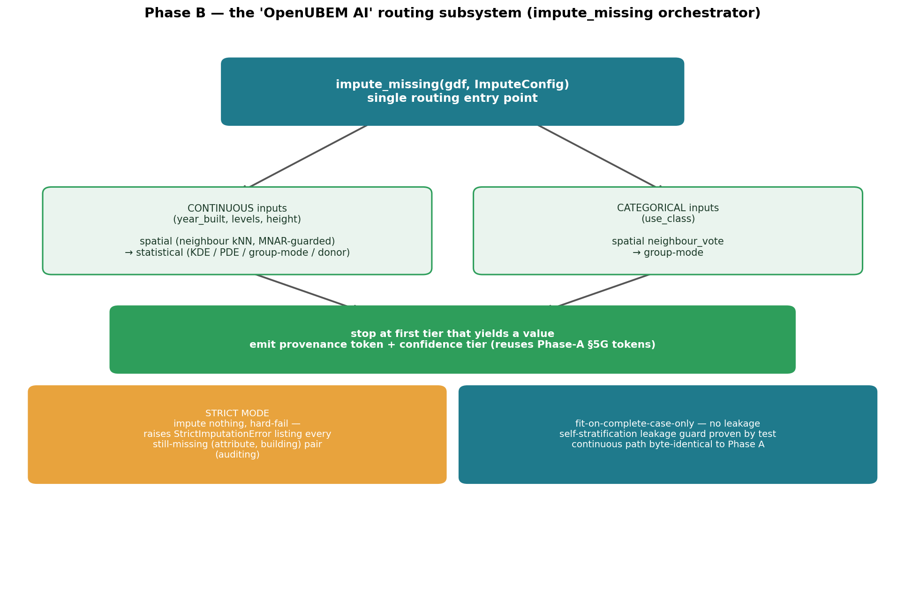

# RESULTS — Phase B ("OpenUBEM AI" routing subsystem + validation harness)

**Arc:** Input-Parameter Imputation ("OpenUBEM AI")
**Phase:** B — subsystem contract + M09 validation harness (user tier 2)
**Status:** ✅ CLOSED — checkpoint CP-2 **FULLY MET** (2026-07-03, real-OSM-city cluster-confirmed)
**Source of record:** `../../PLAN_input_imputation_implementation.md` §8 progress log + `docs/PROJECT_CHECKLIST.md` §G.

---

## What Phase B actually delivered

Where Phase A proved the imputer is **safe** (nothing broke, no energy model changed), Phase B
proves it is **unbiased in the aggregate** — the downstream EUI it produces, averaged over a held-out
city, matches ground truth to within a fraction of a percent. (This is *not* the same claim as
per-building accuracy — see the reframe note under "Predicted-vs-actual" below.) It builds two things
and then *measures* the Phase-A imputer with them:

1. **The "OpenUBEM AI" routing subsystem** — a single entry point `impute_missing(gdf, ImputeConfig)`
   that routes every missing input through the research-mandated tier order, plus a **strict mode**
   for auditing. The contract (routing + provenance + no-leakage), not the algorithm, is the centrepiece.
2. **The M09 validation harness** — a two-leg protocol (mask-and-recover + downstream-EUI A/B) that
   quantifies recovery accuracy **without ever tuning the imputer against EUI** (zero-fitted-params).

The headline result: the imputer clears **both** downstream-EUI gates with wide margin on real cities.

---

## The headline — CP-2 downstream-EUI aggregate bias (both gates passed)

The definitive CP-2 number is a **real-OSM-city A/B**: simulate each held-out building twice —
once with the imputed input, once with its ground-truth input — and compare annual EUI. The imputed
target was **`year_built`** (EUI-relevant through `resolve_vintage` → DOE construction sets). Metrics
are paired ASHRAE-Guideline-14, **held-out-only** (spatial-block 80/20 hold-out), under real NYC
(725053) and LA weather.

| Cell | N | NMBE | CV(RMSE) | Gate (5% / 15%) |
|---|---|---|---|---|
| **nyc_centre** (GATE) | 32 | **+0.49%** | **1.71%** | ✅ PASS |
| **la_urban** (robustness) | 124 | **+0.08%** | **0.61%** | ✅ PASS |
| synthetic LIVE_SMOKE (held-out-only) | 10 | ≈+0.04% | ≈3.1% | ✅ PASS |

*(fleet-level synthetic: NMBE 0.012% / CV(RMSE) 1.75% — provisional floor superseded by the real-city gate.)*

---

## Quantitative before/after

The companion figure below plots the two recorded metrics against their gates, so the wide margin is
visible at a glance: the imputed-vs-truth EUI error sits far under both the 5% and 15% budgets.

### Predicted-vs-actual

The scatter below is the real, regenerated `year_built` recovery cloud behind the table above (same
Phase-A CP-2 tier config, spatial-block hold-out, real per-building pairs — no aggregate is synthesized).

**Reframe (2026-07-16, honest-precision pass):** the CP-2 gate above (`NMBE`) is a **mean-bias**
metric — it cannot distinguish a genuinely good imputer from a **central-tendency constant fill**,
because a constant-mean predictor is unbiased by construction. The scatter makes this concrete: the
per-building `year_built` recovery is in fact weak (MAE 33.7 y nyc_centre / 16.8 y la_urban, KS≈0.50 /
0.27 — see `phaseB_scatter_year_built.png` above), i.e. the imputed values cluster in a flat band
rather than tracking the true vintage per building. That weak per-building recovery is **acceptable
for UBEM's purpose**, which is aggregate-EUI at the cell/fleet level, not a per-building attribute
audit — but `NMBE≈0` is correctly read as *aggregate-EUI unbiasedness*, not as a per-building accuracy
claim, and the CP-2 PASS verdict stands on that (narrower, still valid) basis.

---

## The validation harness (M09) — how accuracy is proven without fitting

Phase B's core deliverable is the harness itself: two independent legs, neither of which feeds any
result back to tune the imputer.

- **Leg 1 — mask-and-recover** (attribute recovery): mask observed complete-case rows under a
  **spatial-block 80/20 hold-out** (no row leakage), run the *real* `impute_missing` router, and score
  recovery vs held-out truth (MAE / KS-fidelity). No EUI, no tuning.
- **Leg 2 — downstream-EUI A/B** (do-no-harm): Sim A (imputed) vs Sim B (ground-truth) through an
  **identical, read-only** Stage-3→5 harness, then paired ASHRAE-G14 MBE / CV(RMSE) against the
  5% / 15% gates.

---

## Deliverables + tests (121/121) and the CP-2 gate

All five Phase-B deliverables were accepted; 121 unit tests green (no simulation in these — the
LIVE_SMOKE and cluster A/B are separate runs).

| Task | What it landed | Tests |
|---|---|---|
| `T07` | routing orchestrator `impute_missing` / `ImputeConfig` / strict mode | 18 |
| `T07.1` | lineage side-manifest + legacy-token reweight | 21 |
| `T08` | mask-and-recover + spatial-block hold-out harness | 22 |
| `T07.2` | categorical routing (`use_class`) + leakage guard | 45 |
| `T09` | paired ASHRAE-G14 comparator math + `compare_ab` scaffold | 15 |
| **Total** | | **121** |

*(T10 optional `--replicates` uncertainty mode deferred — not a CP-2 gate condition.)*

---

## The "OpenUBEM AI" routing subsystem

`impute_missing` is the single routing entry point. It splits by input type, stops at the first tier
that yields a value, and emits the Phase-A §5G provenance token + confidence tier for every fill.
Strict mode and the complete-case-only / no-leakage discipline are enforced in one place.

---

## ⚠️ Where Phase B sits in the arc

| Phase | What it proves | Status |
|---|---|---|
| **A (CP-1)** | imputer is **safe** — 76/76 tests, 25/25 IDFs byte-identical | ✅ CLOSED (`../phase_A/RESULTS_phaseA.md`) |
| **B (CP-2)** | imputer is **aggregate-EUI unbiased** — real-city A/B NMBE +0.49%/+0.08%, both gates pass (not a per-building accuracy claim — see "Predicted-vs-actual" above) | ✅ CLOSED (this file) |
| **C (CP-3)** | classical-ML imputer — attribute leg marginal; **EUI do-no-harm leg FAILS (−5.51% NMBE)** | ⏸ built-but-OFF (user-accepted) |
| **D / E** | fusion / frontier | gated / deferred |

In one line: **Phase A proves the imputer is safe; Phase B proves it is unbiased in the aggregate — both with zero fitted parameters.**
