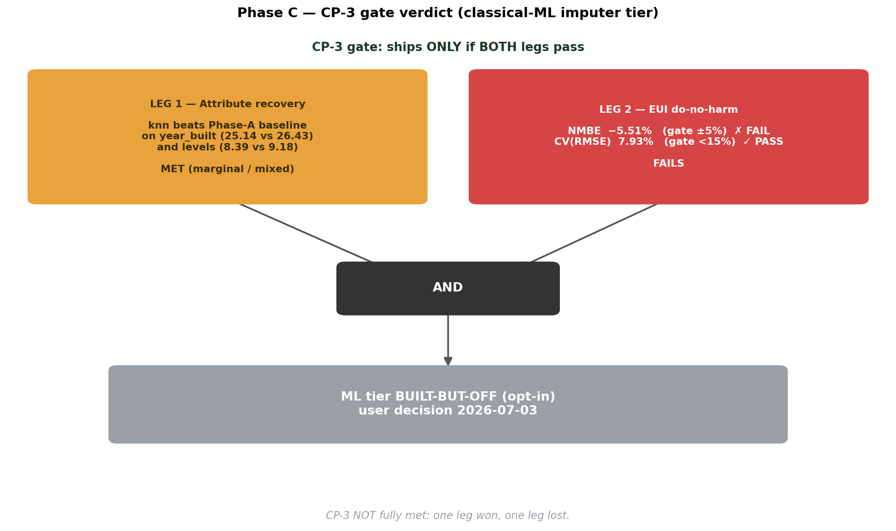
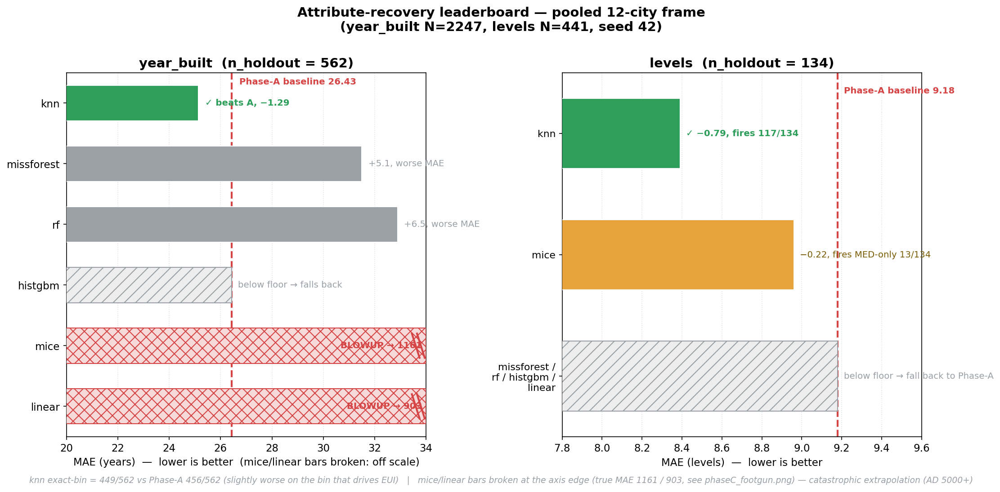
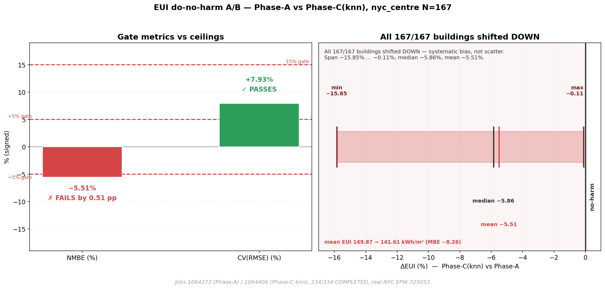
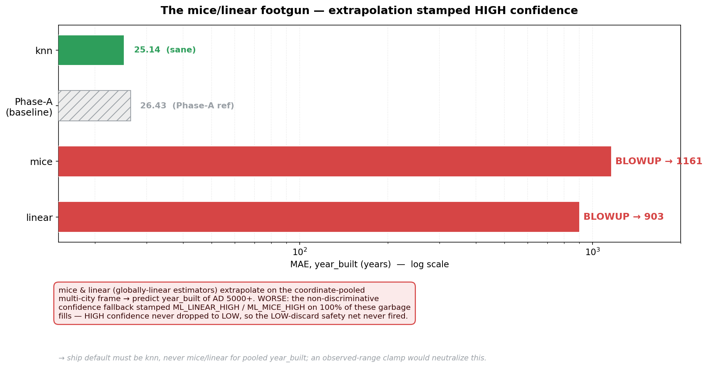
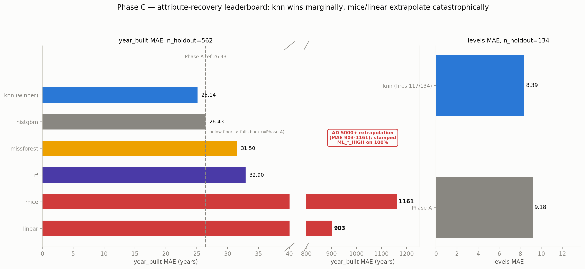
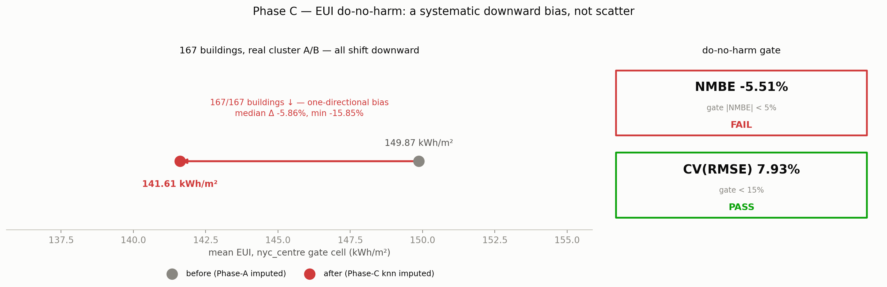
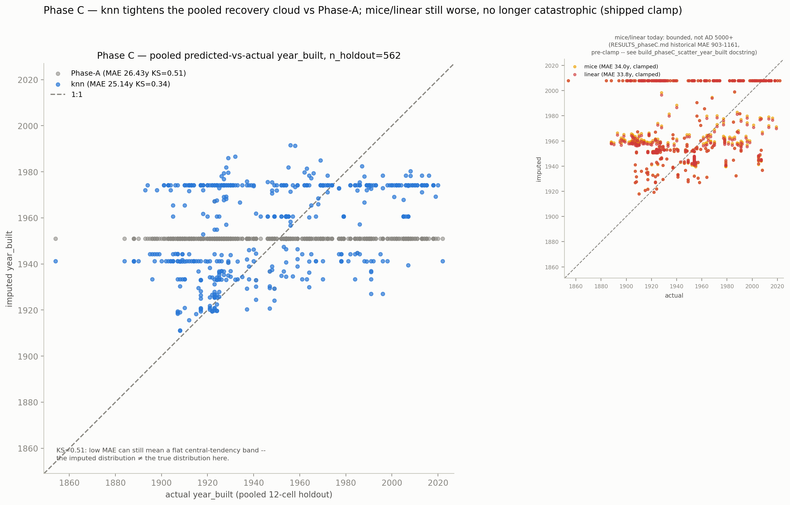
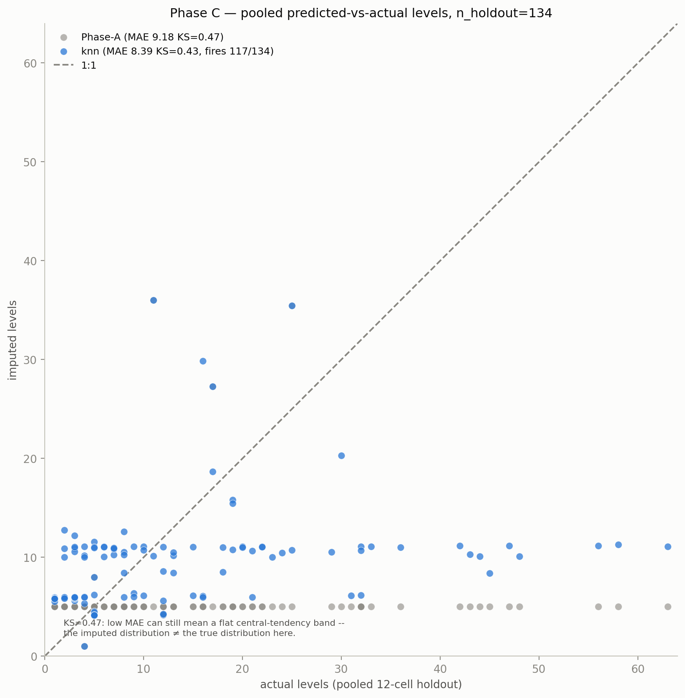

# RESULTS — Phase C (classical-ML imputer + CP-3 do-no-harm gate)

**Arc:** Input-Parameter Imputation ("OpenUBEM AI")
**Phase:** C — classical-ML tier, 6-method sklearn menu (user tier 3)
**Status:** ⏸ **CLOSED — CP-3 NOT fully MET · ML tier kept BUILT-BUT-OFF (user decision 2026-07-03)**
**Source of record:** `../../docs_Done/PLAN_phaseC_ml_imputer.md` §8 progress log
(entries "T11.6 — CP-3 gate", "T11.6 EUI-leg — cluster harvest", "Manager — USER DECISION: accept built-but-off").

---

## What Phase C actually delivered

Phase C is **not** an EUI-improvement experiment — CP-2 already exhausted the EUI headroom (Phase-A
recovers `year_built` near-perfectly: nyc_centre +0.49%, la_urban +0.08%). Phase C answers a narrower
question:

> **Does a classical-ML imputer recover the vintage / morphology attribute *more accurately at the
> attribute level* than the group-median/mode fallback — without *worsening* the downstream EUI?**

It ships a real capability and then measures it honestly:

1. **A 6-method sklearn imputer** (`build_ml_imputer`) behind one pluggable registry —
   `missforest` · `mice` · `knn` · `rf` · `histgbm` · `linear` — with per-target complete-case
   **floors** (RF ≥ 1,000; HistGBM ≥ 5,000; kNN/MICE ≥ 200); below floor the tier **abstains** and
   routing falls through to the Phase-A statistical tier.
2. **Per-row confidence + `ML_<METHOD>_<TIER>` provenance tokens** (HIGH/MED only; LOW discarded,
   mirroring the spatial tier).
3. **The CP-3 gate evaluation** — a pooled multi-city attribute-recovery leaderboard **and** a real
   cluster EUI do-no-harm A/B.

The result: the best method (`knn`) **wins the attribute leg marginally** but **fails the EUI
do-no-harm leg** — so the tier stays **opt-in / off by default**.

---

## The headline — CP-3 verdict (one leg won, one leg lost)

| CP-3 leg | Condition | Result | Verdict |
|---|---|---|---|
| **Attribute recovery** | ≥1 method beats Phase-A on mask-and-recover | `knn` beats Phase-A on `year_built` + `levels` (all continuous metrics) | ✅ MET — but **marginal / mixed** |
| **EUI do-no-harm** | \|NMBE\| < 5% **and** CV(RMSE) < 15% vs Phase-A | NMBE **−5.51%** (FAIL) · CV(RMSE) **7.93%** (PASS) | ❌ **FAILS** |

**CP-3 is NOT fully met.** The attribute win is real but small; the EUI leg fails because `knn`
shifts **all 167/167** gate-cell buildings **downward** — a systematic bias, not scatter.

---

## Leg 1 — attribute-recovery leaderboard (6 methods vs Phase-A)

Pooled all 12 committed phaseE `01_buildings.gpkg` cells (n=8,160), reprojected to a common CRS
(EPSG:5070 Conus-Albers, to stop the 100 m spatial-KNN from crossing NYC/LA/Austin's three UTM zones).
Pooled observed **`year_built` = 2,247** (clears the RF/missforest floor) and **`levels` = 441**
(clears the kNN/MICE floor only). `use_class` was **not evaluable** — it is not in the Stage-1 23-col
schema (populated only by Stage-2). Ran the T08 `mask_and_recover` harness verbatim, seed 42,
spatial-block 80/20 holdout, Phase-A `("spatial","statistical")` vs Phase-C `("spatial","ml","statistical")`
per method. **Re-run twice, byte-identical.**

**`year_built` (n_holdout = 562).** Phase-A baseline: MAE 26.43 / RMSE 32.36 / KS 0.509 /
exact-vintage-bin **456/562 (81.1%)**.

| Method | MAE | RMSE | KS | Wasserstein | exact-bin | vs Phase-A |
|---|---|---|---|---|---|---|
| **Phase-A** (baseline) | 26.43 | 32.36 | 0.509 | 26.21 | 456/562 | — |
| **`knn`** ✅ | **25.14** | **31.91** | **0.343** | **18.05** | 449/562 | **beats A on every continuous metric** |
| `missforest` / `rf` | +5.1 / +6.5 | worse | better | better | 379–382/562 | mixed trade-off (worse bin) |
| `mice` / `linear` | **1161 / 903** | 💥 | — | — | — | **catastrophic extrapolation (AD 5000+)** |
| `histgbm` | = A | = A | = A | = A | = A | below floor (train ≈1797 < 5000) → falls back |

**`levels` (n_holdout = 134).** Phase-A: MAE 9.18 / RMSE 15.06 / KS 0.470.
`knn` fires 117/134: MAE **8.39** (−0.79) / RMSE **12.98** (−2.08) / KS 0.425 — a clean win.
All other methods are below floor (train ≈353) and correctly fall back byte-identical to Phase-A.

**Winner: `knn`** — the only method that cleanly beats Phase-A on **both** targets, on every continuous
metric, with no catastrophic mode.

---

## Leg 2 — EUI do-no-harm (real cluster A/B, 167 buildings)

The winning config (`knn`) was taken through a **real EnergyPlus cluster A/B** on the gate cell
(nyc_centre). The local field-diff first showed material divergence — **168/738** rows flip vintage
bin (542/738 change raw `year_built`) — which tripped the plan's escalation trigger, so a full cluster
A/B fired: **167 EUI-relevant-diverging buildings × 2 branches** (Phase-A-imputed vs Phase-C-`knn`-imputed),
real NYC Central Park weather (station **725053**, confirmed consumed via E+'s own `eplusout.eio`).

- Jobs **1064373** (Phase-A) / **1064406** (Phase-C-knn) — **334/334 COMPLETED**, 0 FATAL, 167/167 per branch.
- Clean isolation proven: floor areas **byte-identical** A-vs-C (max |Δ| = 0.0000 m²); only
  `vintage_standard` + 4 U-value columns differ — geometry, archetype, HVAC, schedules untouched.

**Paired ASHRAE-Guideline-14 result (Phase-A reference vs Phase-C-`knn`):**

| Metric | Value | Gate | Verdict |
|---|---|---|---|
| **NMBE** | **−5.51%** | \|NMBE\| < 5% | ❌ **FAILS** (by 0.51 pp) |
| **CV(RMSE)** | **7.93%** | < 15% | ✅ PASSES |

**All 167/167 buildings moved — every one DOWNWARD** (mean EUI 149.87 → 141.61 kWh/m², MBE −8.26;
Δ% median −5.86, min −15.85). The miss is a **one-directional bias**, not scatter: `knn`'s
neighbour-averaging regresses vintages toward the denser/newer urban-core stock, systematically
assigning better vintages and lowering heating-dominated EUI across the whole cell. Because Phase-A is
CP-2-validated as near-perfect vs *observed* EUI, a −5.5% departure from Phase-A **is** −5.5% away from
ground truth — harm by the gate's own definition.

---

## The adverse finding worth keeping — the `mice`/`linear` footgun

A valuable, ratified adverse result: on the coordinate-pooled multi-city frame, `mice` and `linear`
(both globally-linear estimators) **catastrophically extrapolate** — predicting `year_built` of AD
5000+ on out-of-cluster coordinates (MAE 903–1161). Worse, the non-discriminative confidence fallback
stamped **`ML_LINEAR_HIGH` / `ML_MICE_HIGH` on 100%** of those garbage fills — HIGH confidence never
dropped to LOW, so the LOW-discard safety net never fired.

This directly confirms the CP-3a audit caveat and yields concrete design inputs for any future
ship attempt: (1) the per-target default must be `knn`, never `missforest`/`mice`/`linear` for
coordinate-pooled `year_built`; (2) an **observed-range / vintage-bin clamp** on ML fills would
neutralize both the extrapolation footgun and the newer-skew bias.

---

## Deliverables + tests

The imputer was built, wired, and unit-green **before** any evaluation effort (checkpoint CP-3a MET).

| Task | What it landed | Tests |
|---|---|---|
| `T11.1` | `build_ml_imputer` + 6-method estimator registry + per-target floors | 12 |
| `T11.2` | dispersion → confidence + `ML_<METHOD>_<TIER>` tokens (12 tokens, ratified into §5G) | 4 |
| `T11.3` | `_ml_tier` wiring + `_CANONICAL_TIER_ORDER` reorder (byte-identity-proven) + opt-in config | 4+2 |
| `T11.4` | `impute_column` `method='auto'` + `model_path` (KDE/PDE byte-identical) | 7 |
| `T11.5` | joblib persistence + frozen-reload determinism (all 6 methods) | 7 |
| `TestNoEUILeakage` | structural zero-fitted-params guard (`__code__.co_names`) | 4 |
| **Total (`test_ml_imputer.py`)** | | **40** |

Full imputation-relevant suite after STEP-0 reconciliation: **171 passed / 0 failed.** The no-ML
default path is byte-identical (`ml` ∉ `IMPUTE_ENABLED_TIERS`; the reorder is behaviour-preserving for
every non-ml routing, proven with `assert_frame_equal`).

---

## The decision — kept built-but-off

**CP-3 did not clear the ship bar** (attribute leg marginal; EUI leg fails do-no-harm with a systematic
city-wide bias — the more concerning failure mode for a UBEM). Holding the do-no-harm line keeps the
whole validation credible under the arc's non-negotiable **zero-fitted-params** rule (don't move the
goalposts to pass).

**User ruling (2026-07-03):** *"one method does not need to cover all input parameters, no worries,
keep it."* → the ML tier is **accepted BUILT-BUT-OFF (opt-in)**, no clamp-retry, no retirement. The
estimator registry is **per-target** (`config.IMPUTE_ML_METHOD_BY_TARGET`), so ML need not be one
global method — a future user can point a per-target imputer at a parameter where it does clear
do-no-harm. Keeping it opt-in preserves that flexibility at **zero cost to the default pipeline**.

- `ml` remains **outside** `IMPUTE_ENABLED_TIERS` (default run unchanged, CP-1 byte-identity intact).
- **T11.7** (production wiring + `enrich_semantics` byte-identity reconcile) stays USER-SIGN-OFF-only
  and is **not** being pursued.
- Candidate future revisit (documented, not scheduled): observed-range / vintage-bin clamp on ML fills
  to neutralize the newer-skew, then re-run the A/B.

---

## ⚠️ Where Phase C sits in the arc

| Phase | What it proves | Status |
|---|---|---|
| **A (CP-1)** | imputer is **safe** — 76/76 tests, 25/25 IDFs byte-identical | ✅ CLOSED (`../phase_A/RESULTS_phaseA.md`) |
| **B (CP-2)** | imputer is **accurate** — real-city A/B NMBE +0.49% / +0.08%, both gates pass | ✅ CLOSED (`../phase_B/RESULTS_phaseB.md`) |
| **C (CP-3)** | classical-ML tier — attribute leg marginal; **EUI do-no-harm FAILS (−5.51% NMBE)** | ⏸ built-but-OFF (this file) |
| **D / E** | fusion / frontier | gated / deferred |

In one line: **Phase A proved the imputer is safe, Phase B proved it is accurate — Phase C shows that
classical ML does not (yet) beat the validated statistical tier on the EUI-relevant target, so it ships
opt-in / off. All three with zero fitted parameters.**

---

## Quantitative before/after

Two companion figures, drawn only from the metrics already reported above, make the two legs of the
CP-3 verdict visible at a glance: the attribute-recovery leaderboard (broken axis so the `mice`/`linear`
catastrophic bars don't crush the meaningful 25–33 MAE range) and the EUI do-no-harm dumbbell.

### Predicted-vs-actual

Real, regenerated pooled 12-cell (EPSG:5070) predicted-vs-actual clouds behind the leaderboard above
(Phase-A vs `knn`, real per-building pairs; MAE annotated in-figure reproduces the leaderboard exactly).
The `year_built` figure's inset also reports an honest update: `mice`/`linear` predictions regenerate
today as bounded (MAE ≈ 34 / 34), not the historical AD-5000+ catastrophe (MAE 903–1161) — the
observed-range clamp shipped after this leaderboard was recorded now neutralizes that footgun (still
worse than `knn`, no longer catastrophic; see the figure's own caption for the full note).

