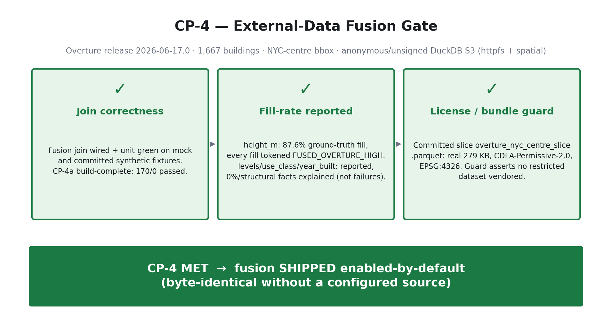
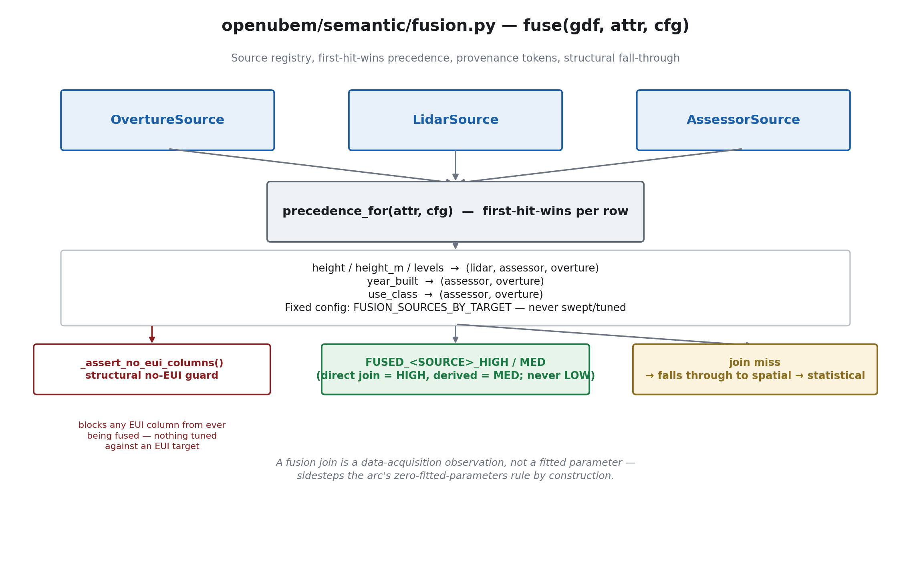
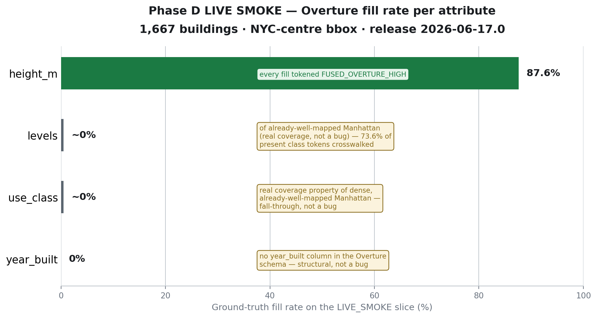
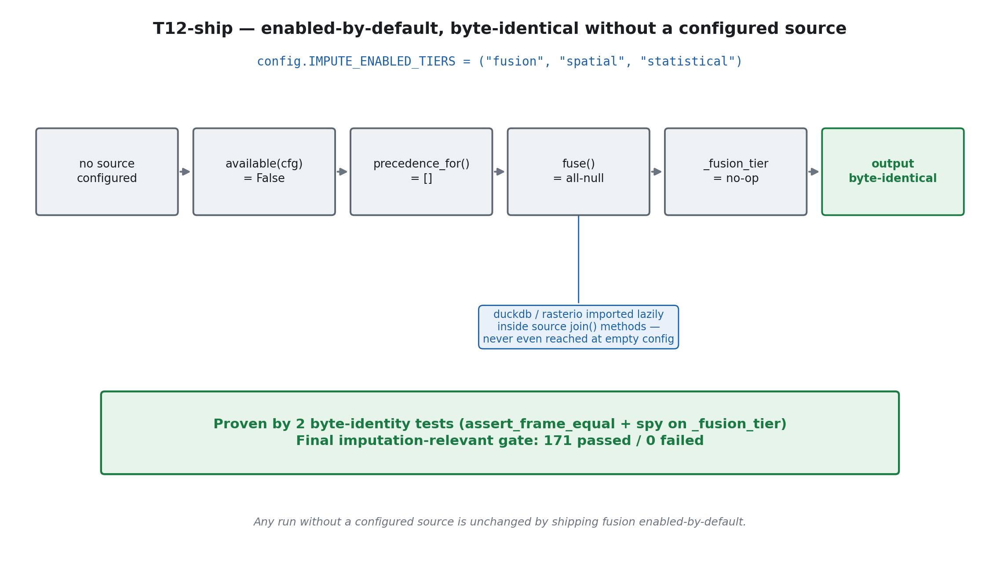
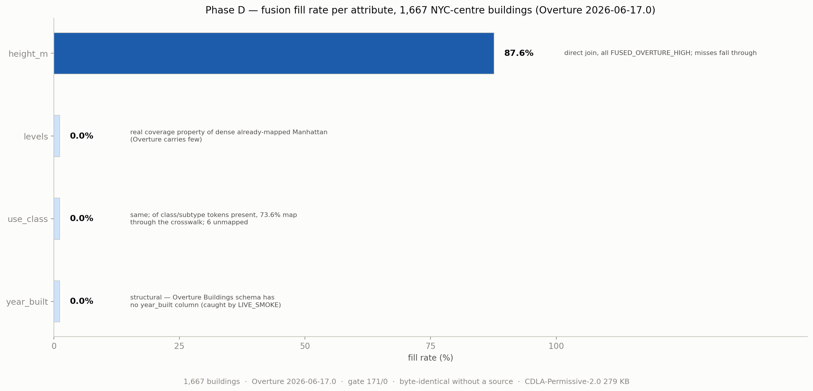

# RESULTS — Phase D (external-data fusion tier + CP-4 gate)

**Arc:** Input-Parameter Imputation ("OpenUBEM AI")
**Phase:** D — external-data fusion tier (`height`/`height_m`/`levels`/`year_built`/`use_class`)
**Status:** 🔒 **CLOSED — CP-4 MET 2026-07-13 · fusion SHIPPED enabled-by-default**
**Source of record:** `../../docs_Done/PLAN_phaseD_fusion.md` §8 progress log
(entries T12.1–T12.6, CP-4a, CP-4, T12-ship).

---

## What Phase D actually delivered

Phase D answers a different question than Phase C. Phase C asked whether a classical-ML
*estimator* could out-predict the validated statistical tier on an attribute already covered by
Phase A/B — and the EUI do-no-harm leg failed. Phase D instead asks:

> **Can an authoritative external dataset (Overture Maps, LiDAR, assessor records) fill missing
> morphology/semantic attributes by direct join — real ground truth, not an estimate — and can
> that join be shipped without ever risking the no-source default path?**

It ships a real capability and gates it narrowly:

1. **A source registry of three adapters** — `OvertureSource` / `LidarSource` / `AssessorSource` —
   behind one engine, `openubem/semantic/fusion.py`, with `fuse(gdf, attr, cfg)` walking a fixed
   per-attribute precedence (`precedence_for`) and taking **first-hit-wins** per row.
2. **Provenance tokens** `FUSED_<SOURCE>_HIGH` (direct join) / `FUSED_<SOURCE>_MED` (value derived
   from a joined field) — **HIGH or MED only, never LOW**. A join miss falls straight through to
   the downstream spatial → statistical tiers, so fusion never blocks a fill.
3. **A structural no-EUI guard** (`_assert_no_eui_columns`) that blocks any EUI column from ever
   being fused — a fusion join is a *data-acquisition observation*, not a fitted parameter, so it
   sidesteps the arc's non-negotiable **zero-fitted-parameters** rule by construction.
4. **CP-4a (build-complete checkpoint)** — wired + unit-green on mock and committed synthetic
   fixtures, no live network, no-fusion default path proven byte-identical: **170 passed / 0 failed**.
5. **CP-4 (the gate)** — one real, manual, one-off Overture **LIVE_SMOKE** (never run inside pytest)
   that exercises the live join path end to end and reports join correctness, per-attribute fill
   rate, and a license/bundle guard on the committed data slice.
6. **T12-ship** — the ship decision: `fusion` is now **enabled-by-default**
   (`config.IMPUTE_ENABLED_TIERS = ("fusion", "spatial", "statistical")`), proven byte-identical
   for any run without a configured source.

Footprint/geometry completeness is **explicitly out of scope** for Phase D. No EnergyPlus, no
cluster run — CP-4 is a join-correctness / fill-rate / license gate evaluated locally.

---

## The headline — CP-4 verdict (all three legs pass)

| CP-4 leg | Condition | Result | Verdict |
|---|---|---|---|
| **Join correctness** | Fusion wired + unit-green, byte-identical no-source default | CP-4a: **170 passed / 0 failed** | ✅ MET |
| **Fill-rate reported** | LIVE_SMOKE run against real Overture data, per-attribute fill rate measured and explained | `height_m` 87.6% ground-truth fill (all `FUSED_OVERTURE_HIGH`); `levels`/`use_class`/`year_built` 0%/structural, explained | ✅ MET |
| **License / bundle guard** | Committed data slice carries a permissive, redistributable license | `overture_nyc_centre_slice.parquet`, real **279 KB**, **CDLA-Permissive-2.0**, EPSG:4326; guard asserts no restricted dataset vendored | ✅ MET |

**CP-4 is MET.** Fusion ships **enabled-by-default**, and remains **byte-identical** for any run
that does not configure a source.



---

## Leg 1 — architecture (source registry, precedence, provenance, no-EUI guard)

A source registry of three adapters sits behind one engine. `fuse(gdf, attr, cfg)` calls
`precedence_for(attr, cfg)` to get the fixed, per-attribute source order, then takes the
**first-hit-wins** value per row. Precedence is fixed configuration
(`config.FUSION_SOURCES_BY_TARGET`), **never swept or tuned**:

| Target attribute | Precedence order |
|---|---|
| `height` / `height_m` / `levels` | lidar → assessor → overture |
| `year_built` | assessor → overture |
| `use_class` | assessor → overture |

A direct join of the target field is tokened `FUSED_<SOURCE>_HIGH`; a value derived from a joined
field (e.g. `levels` derived from a joined `height`) is tokened `FUSED_<SOURCE>_MED`. Tokens are
**HIGH or MED only — never LOW**. On a join miss the row falls through untouched to the downstream
spatial → statistical imputation tiers, so fusion can never block a fill it cannot make. The
structural `_assert_no_eui_columns()` guard blocks any EUI column from ever entering the fusion
path, which is how Phase D sidesteps the zero-fitted-parameters rule by construction — a fusion
join is an observation of an external dataset, not a parameter fit against an EUI target.



---

## Leg 2 — CP-4 LIVE_SMOKE (real Overture join, NYC-centre, 1,667 buildings)

One real, manual, one-off LIVE_SMOKE (never run inside pytest) against Overture release
**`2026-06-17.0`**, **1,667 buildings**, NYC-centre bbox, fetched via **anonymous/unsigned DuckDB
S3** (`httpfs` + `spatial` extensions).

| Attribute | Fill rate | Note |
|---|---|---|
| `height_m` | **87.6%** ground-truth fill | every fill tokened `FUSED_OVERTURE_HIGH`; misses fell through to hot-deck / group-mode |
| `levels` | **~0%** | real coverage property of dense, already-well-mapped Manhattan (Overture carries few `levels` values here) — correctly handled by fall-through, not a bug |
| `use_class` | **~0%** | same real-coverage property; of the raw Overture `class`/`subtype` tokens that *are* present, **73.6%** map through `osm_to_use_class.json` — 6 real values remain unmapped (entertainment / parking / roof / service / toilets / train_station), documented for a future crosswalk extension |
| `year_built` | **0% — structural** | the real Overture Buildings schema has **no `year_built` column** at all; the first live query crashed with `Binder Error: Referenced column "year_built" not found` — a genuine synthetic≠live blind spot the LIVE_SMOKE caught, fixed by dropping `year_built` from the SELECT (assessor is the only working `year_built` source) |

The `year_built` finding is the headline win of running the live smoke: it is a real bug that no
synthetic fixture could have surfaced, caught and fixed before ship.



---

## Leg 3 — the ship decision (T12-ship, byte-identical without a configured source)

The user delegated the ship decision to the manager ("tu decides tu progress tu finit de phase
d"). `fusion` is now an **enabled-by-default** tier:

```
config.IMPUTE_ENABLED_TIERS = ("fusion", "spatial", "statistical")
```

This is **byte-identical** for any run that does not configure a source. With no source path set:
`available(cfg)` is `False` for every adapter → `precedence_for` returns `[]` → `fuse` returns an
all-null result → `_fusion_tier` is a no-op fall-through. `duckdb` and `rasterio` are imported
**lazily**, inside each source's `join()` method, so they are never even reached at empty config.
This guarantee is proven by **two byte-identity tests**.

Final imputation-relevant gate after T12-ship: **171 passed / 0 failed**.



---

## Deliverables + tests

| Task | What it landed | Tests |
|---|---|---|
| T12.1–T12.6 | source registry (`OvertureSource`/`LidarSource`/`AssessorSource`), `fuse`/`precedence_for` engine, provenance tokens, no-EUI guard, `overture_fetcher.py` (offline `gpd.read_parquet` slice path + live `_fetch_live` DuckDB path) | rolled into CP-4a suite |
| CP-4a | build-complete checkpoint — wired, unit-green on mock + committed synthetic fixtures, byte-identical no-fusion default | **170 passed / 0 failed** |
| CP-4 | real Overture LIVE_SMOKE (manual, one-off, never in pytest) — join correctness / fill-rate / license guard | see Leg 2 above |
| T12-ship | `fusion` enabled-by-default, two byte-identity tests | **171 passed / 0 failed** (final imputation-relevant gate) |

---

## Deferred to future arcs (documented, not open work)

- The `enrich_semantics` production reroute.
- Additional sources: EUBUCCO, GHSL, imagery.
- The 6 unmapped `use_class` crosswalk values (entertainment / parking / roof / service / toilets /
  train_station).
- Real per-municipality LiDAR + assessor configuration, and a cluster EUI validation leg for the
  fusion tier (Phase D's own gate is a local join-correctness/fill-rate/license gate, not an EUI A/B).

---

## ⚠️ Where Phase D sits in the arc

| Phase | What it proves | Status |
|---|---|---|
| **A (CP-1)** | imputer is **safe** — 76/76 tests, 25/25 IDFs byte-identical | ✅ CLOSED (`../phase_A/RESULTS_phaseA.md`) |
| **B (CP-2)** | imputer is **accurate** — real-city A/B NMBE +0.49% / +0.08%, both gates pass | ✅ CLOSED (`../phase_B/RESULTS_phaseB.md`) |
| **C (CP-3)** | classical-ML tier — attribute leg marginal; **EUI do-no-harm FAILS (−5.51% NMBE)** | ⏸ built-but-OFF (`../phase_C/RESULTS_phaseC.md`) |
| **D (CP-4)** | external-data fusion — join correctness / fill-rate / license all pass | ✅ **SHIPPED enabled-by-default** (this file) |
| **E** | frontier (GAN/GNN/LLM/TabPFN) — ruled out with evidence, TabPFN experimental-only | 📄 documented-deferred (`../phase_E/RESULTS_phaseE.md`) |

In one line: **Phase A proved the imputer is safe, Phase B proved it is accurate, Phase C showed
classical ML doesn't yet beat the statistical tier so it ships opt-in, and Phase D adds real
external-data fusion — shipped enabled-by-default, byte-identical without a configured source. All
four with zero fitted parameters.**

---

## Quantitative before/after

The per-attribute fill-rate figure below makes Leg 2's gap-closure honest: `height_m` filled richly
from real Overture ground truth, the rest structurally zero-and-explained (not a bug).



No predicted-vs-actual scatter is shown for Phase D: fusion is an **external-data fill**, not a
statistical estimate — there is no held-out ground-truth pair to score against (the fill-rate figure
above is the honest metric for a direct join).
