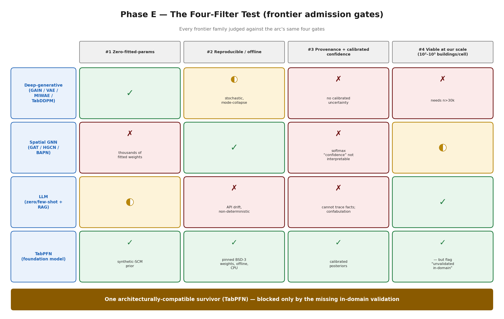
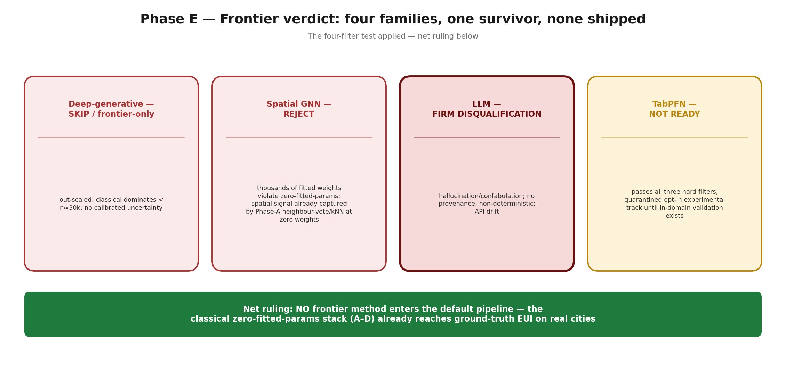
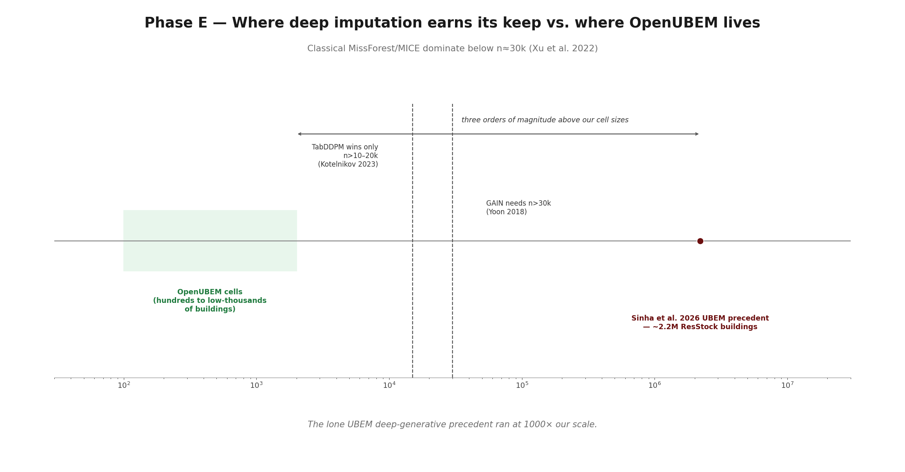
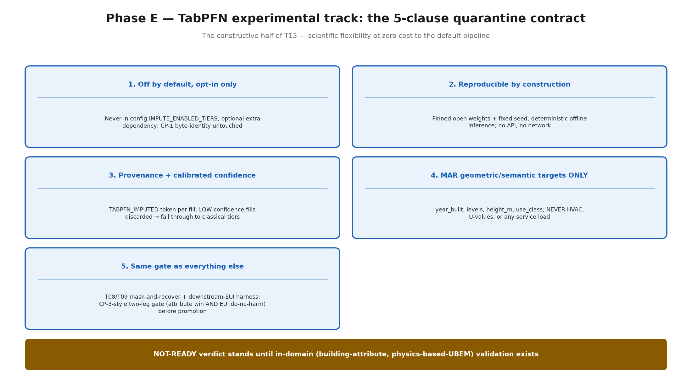
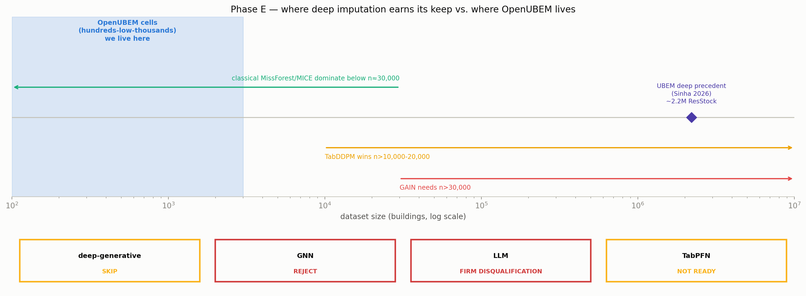

# RESULTS — Phase E (advanced / data-driven frontier — the "AI" tier)

**Arc:** Input-Parameter Imputation ("OpenUBEM AI")
**Phase:** E — advanced / data-driven frontier (user tier 4): deep-generative · spatial-GNN · LLM · foundation-model / TabPFN
**Status:** 📄 **DOCUMENTED-DEFERRED (T13 delivered)** — deep-generative / GNN / LLM ruled **out of core scope with evidence**; TabPFN ruled **NOT READY**, permitted only as an optional isolated experimental track. **No frontier method enters the default pipeline.**
**Source of record:** deep-research `RESULT_M05` (deep/generative), `RESULT_M06` (spatial/GNN), `RESULT_M10` (foundation-model/LLM), Part-C synthesis rulings; parent `../../PLAN_input_imputation_implementation.md` §5 (lines 215–216, 278–283) + §6 T13 (lines 849–863).

---

## What Phase E actually asks

Phases A–D built and validated a **classical, zero-fitted-parameters** imputation stack: statistical fallbacks (A, *safe*), a routing + validation subsystem (B, *accurate*), an opt-in classical-ML tier (C, *built-but-off*), and an external-data fusion tier (D, *shipped*). Phase E is the deliberate closing question of the arc:

> **Is any *advanced / data-driven frontier* method — deep-generative networks, spatial GNNs, LLMs, or pretrained tabular foundation models — warranted for OpenUBEM input imputation, given the arc's non-negotiable constraints and its data scale?**

Phase E is **documentation, not execution**. Ruling frontier options *out with evidence* — and defining the one narrow, guarded experimental track that survives — is itself a first-class deliverable (parent §6 T13): it keeps "all data-driven approaches represented" in the record without ever letting an unvalidated or hallucination-prone method contaminate scientific results.

---

## The four filters every frontier method must pass

Every candidate is judged against the same four gates that make the arc's validation credible — the first three are the arc's hard architectural constraints, the fourth is a practical reality of city-scale UBEM at *our* resolution:

1. **Zero-fitted-parameters** — never tuned against an EUI (or any downstream) target. Non-negotiable across the whole project.
2. **Reproducible** — pinned weights, deterministic given a seed, runs **offline** with no per-run external API.
3. **Provenance-emitting** — a per-value audit flag *and* a calibrated confidence, so every imputed cell is traceable.
4. **Data-viability at our scale** — OpenUBEM cells are **hundreds to low-thousands** of buildings, not the tens of thousands to millions the deep methods need to earn their keep.

---

## The headline — frontier verdict (four families, one survivor, none shipped)

| Frontier family | Filters it fails | Ruling | Why (evidence) |
|---|---|---|---|
| **Deep-generative** (GAIN, VAE/MIWAE, DAE/MIDAS, TabDDPM, tab-transformer) | #4 (scale), partly #2/#3 | **SKIP / frontier-only** | Classical MissForest/MICE **dominate below n≈30 k** (Xu et al. 2022); TabDDPM only wins at n>10–20 k (Kotelnikov 2023); GAIN needs n>30 k and is stochastic/mode-collapse-prone (Yoon 2018) → fails reproducibility; most emit **no calibrated uncertainty**. The lone UBEM precedent (Sinha et al. 2026, TabDDPM) ran on **~2.2 M ResStock buildings** — three orders of magnitude above our cell sizes. |
| **Spatial GNN** (GAT / HGCN / BAPN) | #1 (fitted weights), #3 | **REJECT** | The spatial signal is **real** (Moran's *I* ≈ 0.35–0.65; Biljecki 2018 cuts height RMSE 4.2→2.8 m; Wang 2024 / Zhao 2023 add +12–16 pp age accuracy) — **but that signal is already captured** by neighbour-voting / kNN, which is *low-complexity / high-payoff* and provenance-clean (neighbour-agreement ratio = confidence) and was **folded into Phase A (T06)**. A GNN adds **thousands of fitted weights** (violates #1), its softmax "confidence" is not physically interpretable, and it risks overfitting to local validation EUI. Marginal accuracy gain does not justify the constraint breach. |
| **LLM** (zero/few-shot prompting + retrieval-augmented) | #1-adjacent, #2, #3, integrity | **FIRM DISQUALIFICATION** | Fails reproducibility (API drift + non-deterministic generation), provenance (cannot auditably trace *where* a "fact" came from), and offline capability (GPU/API overhead). Decisive: **hallucination/confabulation** — LLMs confabulate plausible-but-fabricated vintages / HVAC COPs "with maximum confidence" (Hegselmann 2023; M10 Part C). Unusable for a physics-based model where data integrity must be audited. |
| **Foundation model / TabPFN** | none of #1–#3 — but **unvalidated in-domain** | **NOT READY → experimental-only** | The **only** frontier method that passes all three hard filters: zero-fitted-params via a synthetic-SCM prior; **pinned, open BSD-3 weights**, deterministic offline (~20 MB, CPU, sub-second); provenance-emitting (`TABPFN_IMPUTED`); **calibrated posteriors** out of the box (Hollmann 2022/2025). **Blocked by a domain gap:** M10 finds **no peer-reviewed study** validating zero-shot foundation-model imputation for building attributes in a physics-based UBEM. Ruled **NOT READY for production**; allowed only as an isolated, non-default experimental track. |

**Net Phase E ruling: no frontier method enters the default pipeline.** Three are ruled out on evidence; the one architecturally-compatible method (TabPFN) is quarantined to an opt-in experimental track until in-domain validation exists.

---

## Why the classical stack already wins at our scale

The frontier rulings are not conservatism — they follow directly from the arc's own results. The two facts that close the door:

- **CP-2 already exhausted the EUI headroom.** Phase A recovers `year_built` near-perfectly on real cities (nyc_centre NMBE **+0.49%**, la_urban **+0.08%**, both gates pass). There is essentially no downstream-EUI error left for a heavier method to remove.
- **Phase C already tested "smarter recovers better" — and it failed do-no-harm.** A 6-method classical-ML tier beat the statistical fallback *marginally* on the attribute but **shifted EUI −5.51% (all 167/167 buildings downward)**, failing the do-no-harm gate; it ships **off**. If well-behaved classical ML could not clear the bar on this data, a higher-variance, harder-to-audit deep method has a **lower** prior of doing so — at far greater cost to reproducibility and provenance.

The spatial signal the GNN literature celebrates is exactly the signal OpenUBEM **already** harvests cheaply and auditably via the Phase-A neighbour-vote / kNN tier — **without** a single fitted weight.

---

## The one surviving track — TabPFN, isolated & experimental (the constructive half of T13)

TabPFN is the only frontier method worth keeping a door open for. If it is ever explored, it is bound by a strict, pre-committed contract so it can **never** leak into scientific results:

1. **Off by default, opt-in only.** Never in `config.IMPUTE_ENABLED_TIERS`; reached only via an explicit per-target opt-in, behind an **optional extra dependency**. The default run and the CP-1 byte-identity stay untouched (same posture as the Phase-C ML tier).
2. **Reproducible by construction.** Pinned open weights + fixed seed; deterministic offline inference. No API, no network at run time.
3. **Provenance + calibrated confidence.** Emits a `TABPFN_IMPUTED` token per filled cell plus its calibrated posterior; a LOW-confidence fill is discarded and routing falls through to the validated classical tiers (mirroring the spatial / ML tiers).
4. **MAR geometric/semantic targets ONLY.** Permitted targets: `year_built`, `levels`, `height`/`height_m`, `use_class`. **Never** HVAC systems, U-values, DHW/cooking/refrigeration, or any service load — those stay physically modelled under zero-fitted-params.
5. **Same gate as everything else.** Any experiment reuses the T08/T09 **mask-and-recover + downstream-EUI** harness and must clear the **same CP-3-style two-leg gate** as the Phase-C ML tier — an attribute-recovery win **and** an EUI **do-no-harm** pass — before promotion is even discussed. **The NOT-READY verdict stands until in-domain (building-attribute, physics-based-UBEM) validation exists in the literature or is produced here.**

This preserves scientific flexibility at **zero cost to the default pipeline** and **zero risk to the arc's validation guarantees**.

---

## Where Phase E sits in the arc

| Phase | What it establishes | Status |
|---|---|---|
| **A (CP-1)** | imputer is **safe** — 76/76 tests, 25/25 IDFs byte-identical | ✅ CLOSED (`../phase_A/RESULTS_phaseA.md`) |
| **B (CP-2)** | imputer is **accurate** — real-city A/B NMBE +0.49% / +0.08%, both gates pass | ✅ CLOSED (`../phase_B/RESULTS_phaseB.md`) |
| **C (CP-3)** | classical-ML tier — attribute leg marginal, **EUI do-no-harm FAILS (−5.51%)** → built-but-off | ⏸ built-but-OFF (`../phase_C/RESULTS_phaseC.md`) |
| **D (CP-4)** | external-data **fusion** — real Overture LIVE_SMOKE `height_m` 87.6% fill → **shipped enabled-by-default** (byte-identical without a source) | ✅ CLOSED (`../phase_D/RESULTS_phaseD.md`) |
| **E** | advanced frontier — deep-generative / GNN / LLM **ruled out with evidence**; TabPFN **NOT READY**, experimental-only | 📄 **DOCUMENTED-DEFERRED (this file)** |

In one line: **the classical, zero-fitted-parameters stack (A–D) already reaches ground-truth EUI on real cities, so the advanced frontier earns no place in the default pipeline — deep-generative and GNN are out-scaled and constraint-breaking, LLMs are disqualified for hallucination, and TabPFN alone is architecturally compatible but stays quarantined as an opt-in experiment until building-domain validation exists.**

---

## Quantitative before/after

A log-scale number line makes the scale gap literal: where each frontier family needs its data volume
to earn its keep, against the band where OpenUBEM cells actually live.

No predicted-vs-actual scatter is shown for Phase E: it is a **documentation/ruling** phase (no run, no
imputer built or fitted here) — there is no predicted/actual pair to plot.

---

## References (from the deep-research corpus)

Yoon et al. 2018 (GAIN, *ICML*) · Mattei & Frellsen 2019 (MIWAE, *ICML*) · Gondara & Wang 2018 (MIDA, *PAKDD*) · Kotelnikov et al. 2023 (TabDDPM, *ICML*) · Gorishniy et al. 2021 (FT-/Tab-Transformer, *NeurIPS*) · Xu et al. 2022 (deep-imputation benchmark, *arXiv:2207.08815*) · Sinha et al. 2026 (conditional TabDDPM for UBEM, *Energy and Buildings*) · Biljecki et al. 2018 (*IJGIS*) · Wang et al. 2024 (*ISPRS J.*) · Zhao et al. 2023 (*CEUS*) · İşeri & Dino 2021 (*CAAD Futures*) · Hollmann et al. 2022, 2025 (TabPFN, *ICLR* / *Nature*) · Hegselmann et al. 2023 (TabLLM) · Wu et al. 2025 (retrieval-augmented imputation). Full tables and per-method evidence in `../../deepResearch/RESULT_M05`, `RESULT_M06`, `RESULT_M10`.
