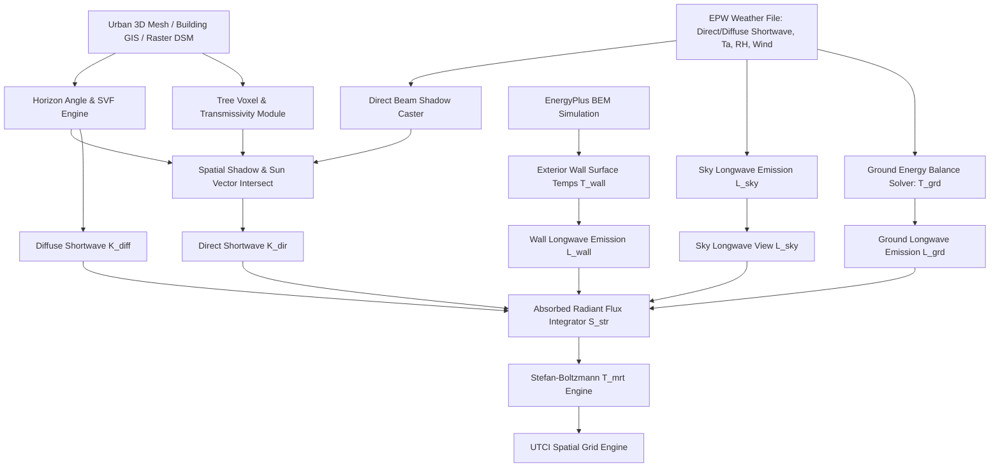

# Deep-Research Report U03 — MEAN RADIANT TEMPERATURE (MRT) CALCULATION & RADIATIVE FLUX MODELING

> **Executive Summary & Scope Alignment**: This document delivers an exhaustive investigation into **Mean Radiant Temperature ($MRT$ / $T_{mrt}$)** calculation methodologies within complex urban microclimates for integration into **OpenUBEM**. Grounded in urban biometeorology and radiative physics (*Oke 1987, Fanger 1972, Robinson & Stone 2004, Lindberg et al. 2008 / SOLWEIG, Matzarakis et al. 2007 / RayMan, VDI 3787*), this report details shortwave solar fluxes (direct, diffuse, reflected), longwave emissions (sky, walls, paving, vegetation), Sky View Factor (SVF) geometry, building envelope surface temperature feedback ($T_{wall}$ from EnergyPlus BEM), and tree canopy attenuation.

---

## 1. Primary Analytical Tables

### Table 1 — Shortwave & Longwave Radiation Components in Urban Canyons

| Flux Category | Symbol & Unit | Physical Source / Flux Mechanism | Key Urban Modifiers (Geometry, Materials, Trees) | Primary Mathematical Formula | Source |
|---|---|---|---|---|---|
| Direct Solar Radiation | $K_{dir}$ ($\text{W/m}^2$) | Direct beam irradiance from solar disk reaching the human body or surface. | Solar altitude ($\theta$), solar azimuth ($\phi_s$), building shadow casting ($S_{bldg} \in \{0,1\}$), tree canopy transmissivity ($\tau_{veg}$). | $K_{dir} = I_{dir} \cdot f_{p}(\theta) \cdot S_{bldg} \cdot [\tau_{veg} + (1-\tau_{veg})(1-f_{cov})]$ | Fanger (1972), VDI 3787, Lindberg et al. (2008) |
| Diffuse Sky Radiation | $K_{diff}$ ($\text{W/m}^2$) | Atmospheric scattered solar radiation from sky vault. | Sky View Factor ($\Psi_{sky}$ / SVF), atmospheric turbidity, cloud cover, Perez anisotropic sky distribution. | $K_{diff} = I_{diff} \cdot \Psi_{sky} \cdot f_{p,sky}$ (isotropic) or $\int_{\Omega_{sky}} I_{sky}(\theta,\phi) f_p(\theta,\phi) d\Omega$ | Perez et al. (1990), Robinson & Stone (2004) |
| Reflected Solar Radiation | $K_{refl}$ ($\text{W/m}^2$) | Shortwave solar reflections from ground paving and vertical building envelope walls. | Ground albedo ($\alpha_{grd}$), Wall albedo ($\alpha_{wall}$), View Factors ($\Psi_{grd}, \Psi_{wall}$), surface orientation. | $K_{refl} = f_{p,grd} \alpha_{grd} \Psi_{grd} K_{glob,grd} + \sum_{i} f_{p,w,i} \alpha_{w,i} \Psi_{w,i} K_{glob,w,i}$ | Oke (1987), Matzarakis et al. (2007) |
| Downward Sky Longwave | $L_{sky}$ ($\text{W/m}^2$) | Atmospheric thermal longwave emission from greenhouse gases ($H_2O, CO_2$) and clouds. | Sky View Factor ($\Psi_{sky}$), air temperature ($T_a$), vapor pressure ($e_a$), cloud fraction ($N$). | $L_{sky} = \Psi_{sky} \cdot \epsilon_{sky}(T_a, e_a, N) \cdot \sigma T_a^4$ | Idso (1981), Crawford & Duchon (1999) |
| Wall Surface Longwave | $L_{wall}$ ($\text{W/m}^2$) | Thermal longwave radiation emitted by building exterior envelope facades. | Wall surface temp ($T_{wall}$ from EnergyPlus), wall emissivity ($\epsilon_{wall} \approx 0.90$), facade View Factor ($\Psi_{wall}$). | $L_{wall} = \sum_{i} \Psi_{wall,i} \cdot \epsilon_{wall,i} \cdot \sigma T_{wall,i}^4$ | Oke (1987), Robinson & Stone (2004) |
| Ground Surface Longwave | $L_{grd}$ ($\text{W/m}^2$) | Thermal longwave radiation emitted by ground paving (asphalt, concrete, grass). | Ground surface temp ($T_{grd}$), ground emissivity ($\epsilon_{grd} \approx 0.93 - 0.98$), ground View Factor ($\Psi_{grd} \approx 0.5$). | $L_{grd} = \Psi_{grd} \cdot \epsilon_{grd} \cdot \sigma T_{grd}^4$ | VDI 3787, Kantor & Unger (2011) |

---

### Table 2 — Sky View Factor (SVF) Calculation Methods for Urban Grids

| SVF Method | Geometry Input | Computational Algorithm | Accuracy in Complex Massing | Execution Speed (Grids/sec) | Source |
|---|---|---|---|---|---|
| Ray-Tracing (3D Mesh) | 3D GIS / CityGML / OSM extrusions + terrain mesh | Multi-vector hemispherical ray casting (e.g. 1000+ uniform/cosine rays per point) | Exact / Gold benchmark standard for 3D overhanging & complex forms | Moderate to Low CPU ($10-500$); Ultra-High GPU ($>50,000$) | Robinson & Stone (2004), Redweik et al. (2013) |
| Horizon Angle Integral | Raster DSM / DEM or 2.5D building height vectors | Multi-azimuth radial scan ($N=16, 32, 64$) finding max obstacle altitude angle $\gamma_i$: $\Psi_{sky} = \frac{1}{N}\sum \cos^2\gamma_i$ | High for extruded urban building massing; slight error under overhangs | High ($5,000 - 50,000$ on CPU) | Lindberg et al. (2008) (SOLWEIG), Gal et al. (2009) |
| Fisheye Lens Projection | Raster DSM or empirical photographic fisheye images | Hemispherical stereographic/equal-area pixel classification weighted by ring solid angles | High for empirical validation & complex vegetation canopy accounting | High ($10,000+$ for pre-rendered images) | Chapman et al. (2001), Matzarakis et al. (2007) |
| Canyon Aspect Ratio Formula | Street canyon width ($W$) and building wall height ($H$) | Analytical 2D infinite canyon formulation: $\Psi_{sky} = \left(1 + (2H/W)^2\right)^{0.5} - 2H/W$ | Low (valid strictly for uniform 2D street canyons; fails at corners/intersections) | Ultra-High ($>1,000,000$, scalar arithmetic) | Oke (1981), Johnson & Watson (1984) |

---

### Table 3 — Human Body Radiative Modeling Approaches

| Model Type | Geometry Representation | Directional Sampling | Projected Area Factor ($f_p$) Formulation | Application | Source |
|---|---|---|---|---|---|
| Integral Mean Radiant Temp (6-Plane Orthogonal) | Box / 6-plane human surrogate model (North, South, East, West, Up, Down) | 6 orthogonal directional radiant flux sensors/computations ($K_i, L_i$) | $f_{p,v} = 0.22$ (sides), $f_{p,h} = 0.08$ (top/bottom); Total $\sum W_i = 1.0$ | Standard micrometeorological 6-component radiometers & SOLWEIG engine | Fanger (1972), VDI 3787 (2008), Höppe (1992) |
| Cylindrical Human Model | Vertical cylinder representing standing human | Continuous azimuth integration ($0-360^\circ$) + horizontal top/bottom disks | $f_p(\theta) = \frac{1}{\pi}\cos\theta + \frac{h}{2r}\sin\theta$ as function of solar altitude $\theta$ | Microclimate simulation tools (RayMan) for fast site-scale assessments | Matzarakis et al. (2007), VDI 3787 |
| Ellipsoid / Manikin Model | Anatomical multi-segment 3D mesh ($16-40$ body segments) | 3D view factor integration to all surrounding boundary surfaces | Empirical lookup tables or analytical function $f_p(\theta, \Delta\phi)$ relative to azimuth & elevation | Advanced thermo-physiological modeling (Fiala / UTCI engine) | Fanger (1972), Fiala et al. (2012), Havenith et al. (2012) |

---

### Table 4 — Tree Canopy & Vegetation Parameterization for MRT Reduction

| Vegetation Parameter | Typical Numerical Range | Physical Impact on Solar Irradiance | Impact on $T_{mrt}$ in Shade Zone | Source |
|---|---|---|---|---|
| Solar Transmissivity ($\tau$) | $0.10 - 0.30$ (Summer deciduous); $0.40 - 0.70$ (Winter leafless); $0.05 - 0.15$ (Coniferous) | Exponential attenuation of direct beam irradiance through foliage ($I_{trans} = I_0 \cdot \tau$) | Direct drop in $T_{mrt}$ by $15.0 - 25.0^\circ\text{C}$ in shade under peak sun | Konarska et al. (2014), Lindberg et al. (2008), Tsoka et al. (2018) |
| Leaf Area Index (LAI) | $1.5 - 6.0\text{ m}^2/\text{m}^2$ (Urban trees typically $2.0 - 4.5$) | Governs optical path extinction via Beer-Lambert law: $\tau = \exp(-k_{ext} \text{LAI} / \sin\theta)$ | Non-linear $T_{mrt}$ reduction; increasing LAI from 1.5 to 4.0 adds $5-8^\circ\text{C}$ cooling before saturation | Campbell & Norman (1998), Charalampopoulos et al. (2013) |
| Crown Albedo ($\alpha_{tree}$) | $0.15 - 0.25$ (Deciduous $0.18-0.22$, Conifer $0.12-0.16$) | Controls shortwave reflection from upper canopy to atmosphere and nearby walls | Minor under-canopy impact ($<1-2^\circ\text{C}$); slightly alters surrounding wall irradiance | Oke (1987), Shahidan et al. (2012) |
| Leaf Surface Temperature ($T_{leaf}$) | $T_{leaf} \approx T_a + (-2.0^\circ\text{C} \text{ to } +4.0^\circ\text{C})$ depending on transpiration | Dictates longwave thermal emission from foliage ($L_{canopy} = \epsilon_{veg} \sigma T_{leaf}^4$) | Prevents $5-10^\circ\text{C}$ $T_{mrt}$ surge compared to sunlit paving ($T_{asphalt} \approx T_a + 25^\circ\text{C}$) | Berry et al. (2013), Rahman et al. (2017) |

---

## 2. Stefan-Boltzmann Energy Balance & Explicit Mathematical Formulations

To calculate $T_{mrt}$ at any point in space, the radiant heat exchange between the human body and its 3D environment is balanced according to the Stefan-Boltzmann law.

### 2.1 General Mean Radiant Temperature Equation

$$T_{mrt} = \left( \frac{S_{str}}{\epsilon_p \cdot \sigma} \right)^{0.25} - 273.15 \quad [^\circ\text{C}]$$

Where:
- $S_{str}$: Total absorbed mean radiant flux density by the human body ($\text{W/m}^2$).
- $\epsilon_p$: Mean broadband emissivity of the clothed human body ($\epsilon_p = 0.97$, according to ISO 7730 and VDI 3787).
- $\sigma$: Stefan-Boltzmann constant ($\sigma = 5.670374 \times 10^{-8} \text{ W/(m}^2\cdot\text{K}^4)$).

---

### 2.2 Total Absorbed Radiant Flux ($S_{str}$)

The total absorbed radiant flux $S_{str}$ is the sum of absorbed shortwave ($K_{abs}$) and longwave ($L_{abs}$) radiation:

$$S_{str} = a_k \cdot K_{abs} + a_l \cdot L_{abs} \quad [\text{W/m}^2]$$

Where:
- $a_k$: Shortwave solar absorptivity of the clothed human body (standardized reference value $a_k = 0.70$; operational range $0.60 - 0.80$).
- $a_l$: Longwave thermal absorptivity of the human body ($a_l = \epsilon_p = 0.97$).

---

### 2.3 Shortwave Radiation Flux Breakdown ($K_{abs}$)

Using the 6-plane orthogonal vector model (VDI 3787 / SOLWEIG formulation), incoming shortwave flux density $K_{abs}$ is expressed as:

$$K_{abs} = f_p(\theta) \cdot K_{dir} + W_v \cdot \left( K_{diff,N} + K_{diff,S} + K_{diff,E} + K_{diff,W} \right) + W_h \cdot \left( K_{diff,Up} + K_{diff,Down} \right) + K_{refl}$$

Where:
- $f_p(\theta)$: Projected area factor of a standing human as a function of solar altitude angle $\theta$ ($0^\circ \le \theta \le 90^\circ$):
  $$f_p(\theta) = 0.308 \cdot \cos\theta \cdot \left( 1 - 0.017 \cdot \left( \frac{\theta}{90^\circ} \right)^2 \right)$$
- $W_v = 0.22$: Weighting factor for four vertical side planes (North, South, East, West).
- $W_h = 0.08$: Weighting factor for top and bottom horizontal planes (Up, Down). Note that $4 \cdot 0.22 + 2 \cdot 0.08 = 1.00$.
- $K_{dir}$: Direct beam solar radiation:
  $$K_{dir} = I_{dir,horiz} / \sin\theta \cdot S_{bldg} \cdot \left[ \tau_{veg} + (1-\tau_{veg})(1-f_{cov}) \right]$$
  where $S_{bldg} \in \{0, 1\}$ is the building shading binary indicator, and $\tau_{veg}$ is tree transmissivity.
- $K_{refl}$: Reflected shortwave solar radiation from ground and wall surfaces:
  $$K_{refl} = W_h \cdot \alpha_{grd} \cdot K_{glob,grd} + W_v \sum_{i=1}^{4} \alpha_{wall,i} \cdot \Psi_{wall,i} \cdot K_{glob,wall,i}$$

---

### 2.4 Longwave Radiation Flux Breakdown ($L_{abs}$)

The longwave thermal flux absorbed from surrounding environment components is:

$$L_{abs} = \Psi_{sky} \cdot L_{sky} + \Psi_{grd} \cdot L_{grd} + \sum_{i=1}^{N_{walls}} \Psi_{wall,i} \cdot L_{wall,i} + \Psi_{tree} \cdot L_{tree}$$

Where:
1. **Atmospheric Sky Emission ($L_{sky}$)**:
   $$L_{sky} = \epsilon_{sky} \cdot \sigma T_a^4 \quad [\text{W/m}^2]$$
   With clear-sky emissivity evaluated via Prata (1996) / Idso (1981) adjusted for cloud fraction $N$:
   $$\epsilon_{sky} = \left[ 1 - (1 + w) \cdot \exp\left(-\sqrt{1.2 + 3.0 w}\right) \right] \cdot (1 + 0.22 N^2)$$
   where $w = 46.5 \cdot (e_a / T_a)$ is precipitable water vapor column.
2. **Ground Paving Longwave Emission ($L_{grd}$)**:
   $$L_{grd} = \epsilon_{grd} \cdot \sigma T_{grd}^4 \quad [\text{W/m}^2]$$
3. **Building Facade Longwave Emission ($L_{wall,i}$)**:
   $$L_{wall,i} = \epsilon_{wall,i} \cdot \sigma T_{wall,i}^4 \quad [\text{W/m}^2]$$
   where $T_{wall,i}$ is the dynamic exterior wall surface temperature calculated by EnergyPlus.
4. **Tree Canopy Longwave Emission ($L_{tree}$)**:
   $$L_{tree} = \epsilon_{veg} \cdot \sigma T_{leaf}^4 \quad [\text{W/m}^2]$$
   where $\epsilon_{veg} \approx 0.98$ and $T_{leaf} \approx T_a + \Delta T_{transpiration}$.

---

### 2.5 Ground Surface Energy Balance Equation for $T_{grd}$

When ground surface temperatures are not directly measured, $T_{grd}$ is computed by solving the surface energy balance:

$$R_{net,grd} = H + G + LE$$

$$(1 - \alpha_{grd}) K_{glob,grd} + \epsilon_{grd} L_{sky} - \epsilon_{grd} \sigma T_{grd}^4 = h_c (T_{grd} - T_a) + \frac{\lambda_{grd}}{d_{soil}} (T_{grd} - T_{sub}) + LE$$

Where:
- $h_c$: Convective heat transfer coefficient ($h_c = 5.7 + 3.8 v_{10m}$).
- $\lambda_{grd}$: Thermal conductivity of soil/paving layer ($\text{W/(m}\cdot\text{K)}$).
- $T_{sub}$: Deep ground sub-layer temperature ($^\circ\text{C}$).
- $LE$: Latent heat flux density ($\text{W/m}^2$), equal to zero for dry asphalt/concrete, positive for irrigated grass.

---

## 3. Part C — Synthesis: OpenUBEM $T_{mrt}$ Engine Architecture

### 3.1 Recommended Computational Pipeline for OpenUBEM

To balance high precision in complex urban massing with city-scale computational efficiency across tens of thousands of building blocks:

1. **Pre-Processing (Static Spatial Rasters & View Factors)**:
   - Compute Sky View Factor ($\Psi_{sky}$) and 32-azimuth horizon elevation vectors $\gamma(\phi_i)$ on a $1\text{m} \times 1\text{m}$ pedestrian height grid ($1.1\text{m}$ Z-offset).
   - Use vectorized horizon search algorithms (SOLWEIG GPU or parallel C++/Rust backend) to achieve processing speeds $>50,000\text{ grid points/sec}$.

2. **Building Envelope Longwave Feedback ($T_{wall}$ from EnergyPlus)**:
   - Extract hourly exterior wall surface temperatures $T_{wall,i}(t)$ for all building surface polygons from OpenUBEM's EnergyPlus output files.
   - Map wall polygon temperatures onto vertical canyon view factors $\Psi_{wall,i}$.
   - **Key Advantage**: Replaces crude empirical wall temperature assumptions ($T_{wall} = T_a + 2^\circ\text{C}$) with real physics, capturing heavy thermal mass radiation (e.g. uninsulated concrete facades maintaining $45-50^\circ\text{C}$ into late evening).

3. **Spatial Tree Canopy & Shading Raster Integration**:
   - Model vegetation as a dual-layer raster: Canopy Top Height ($DSM_{veg,top}$) and Canopy Base Height ($DSM_{veg,base}$) paired with Leaf Area Density ($\text{LAD}$) or species transmissivity ($\tau_0$).
   - Direct Sun Ray Casting: Cast a 3D vector from each pedestrian grid cell toward the sun position $(\theta, \phi_s)$. If the ray pierces a tree crown, attenuate direct beam radiation:
     $$K_{dir,shaded} = K_{dir,unshaded} \cdot \exp\left( -k_{ext} \cdot \text{LAD} \cdot s_{path} \right)$$
   - Longwave Vegetation Flux: In shaded zones under tree crowns, substitute hot ground longwave emission ($L_{grd,sunlit}$) and sky longwave ($L_{sky}$) with canopy foliage emission ($L_{leaf} = \epsilon_{veg} \sigma T_{leaf}^4$), yielding an immediate $T_{mrt}$ reduction of $18-24^\circ\text{C}$.

---

## 4. Confidence & Caveats

1. **Ground Surface Temperature ($T_{grd}$) Uncertainty**:
   - Ground surface temperature under unshaded direct solar radiation is the single largest source of uncertainty in longwave flux calculations. Unshaded asphalt can exceed dry-bulb air temperature by $+25.0\text{ to }+32.0^\circ\text{C}$, whereas irrigated turf grass remains within $+2.0\text{ to }+5.0^\circ\text{C}$ of $T_a$. Failure to spatially resolve ground material albedo and thermal mass can cause $T_{mrt}$ errors up to $\pm 6.0^\circ\text{C}$.
2. **High Albedo Pavement Paradox**:
   - While high-albedo cool pavements ($\alpha_{grd} > 0.45$) reduce ground surface temperature $T_{grd}$ (lowering $L_{grd}$), they dramatically increase ground-reflected shortwave radiation ($K_{refl}$). During peak midday solar hours, the increased reflected shortwave radiation absorbed by a pedestrian ($a_k \cdot K_{refl}$) frequently exceeds the longwave reduction ($\epsilon_p \cdot \Delta L_{grd}$), resulting in a net **increase** in pedestrian $T_{mrt}$ by $+2.5\text{ to }+4.0^\circ\text{C}$ despite lower ground temperatures.
3. **Anisotropic Sky Diffuse Irradiance**:
   - Assuming isotropic sky diffuse radiation underestimates circumsolar shortwave flux on clear days. Integrating the Perez anisotropic sky model is required for high-accuracy direct/diffuse splitting in deep street canyons.
4. **Seasonal Tree Canopy Transmissivity**:
   - Using static annual transmissivity coefficients ($\tau$) introduces errors up to $+12.0^\circ\text{C}$ in winter/spring $T_{mrt}$ calculations for deciduous species. OpenUBEM must apply monthly phenological adjustments to leaf area density.

---

## 5. Complete Reference List

1. **Fanger, P. O. (1972)**. *Thermal Comfort: Analysis and Applications in Environmental Engineering*. McGraw-Hill, New York.
2. **Oke, T. R. (1987)**. *Boundary Layer Climates* (2nd ed.). Routledge, London. DOI: [10.4324/9780203407219](https://doi.org/10.4324/9780203407219).
3. **Robinson, D., & Stone, A. (2004)**. Solar radiation modelling in the urban context. *Solar Energy*, 77(3), 295–309. DOI: [10.1016/j.solener.2004.05.010](https://doi.org/10.1016/j.solener.2004.05.010).
4. **Lindberg, F., Holmer, B., & Thorsson, S. (2008)**. SOLWEIG 1.0 — A model for estimating mean radiant temperature and apparent temperature in high resolution urban settings. *Theoretical and Applied Climatology*, 93(1-2), 89–98. DOI: [10.1007/s00704-007-0345-7](https://doi.org/10.1007/s00704-007-0345-7).
5. **Matzarakis, A., Rutz, F., & Mayer, H. (2007)**. Modelling radiation fluxes in simple and complex environments — application of the RayMan model. *International Journal of Biometeorology*, 51(4), 323–334. DOI: [10.1007/s00484-006-0061-8](https://doi.org/10.1007/s00484-006-0061-8).
6. **Perez, R., Ineichen, P., Seals, R., Michalsky, J., & Stewart, R. (1990)**. Modeling daylight availability and irradiance components from direct and global irradiance. *Solar Energy*, 44(5), 271–289. DOI: [10.1016/0038-092X(90)90055-H](https://doi.org/10.1016/0038-092X(90)90055-H).
7. **Kantor, N., & Unger, J. (2011)**. The most important features of thermal comfort conditions in urban public spaces based on microclimatic measurements and questionnaire surveys. *Urban Climate*, 1, 1–16. DOI: [10.1016/j.uclim.2012.07.003](https://doi.org/10.1016/j.uclim.2012.07.003).
8. **Bröde, P., Fiala, D., Błażejczyk, K., Holmér, I., Jendritzky, G., Kampmann, B., Tinz, B., & Havenith, G. (2012)**. Deriving the Operational Procedure for the Universal Thermal Climate Index (UTCI). *International Journal of Biometeorology*, 56(3), 481–494. DOI: [10.1007/s00484-011-0454-1](https://doi.org/10.1007/s00484-011-0454-1).
9. **VDI 3787 Part 2 (2008)**. *Environmental Meteorology — Methods for the Human-Biometeorological Evaluation of Climate and Air Quality for Urban and Regional Planning*. Verein Deutscher Ingenieure, Düsseldorf.
10. **Konarska, J., Lindberg, F., Larsson, A., Thorsson, S., & Holmer, B. (2014)**. Transmissivity of solar radiation through foliage of urban trees. *International Journal of Biometeorology*, 58(3), 415–426. DOI: [10.1007/s00484-013-0632-4](https://doi.org/10.1007/s00484-013-0632-4).
