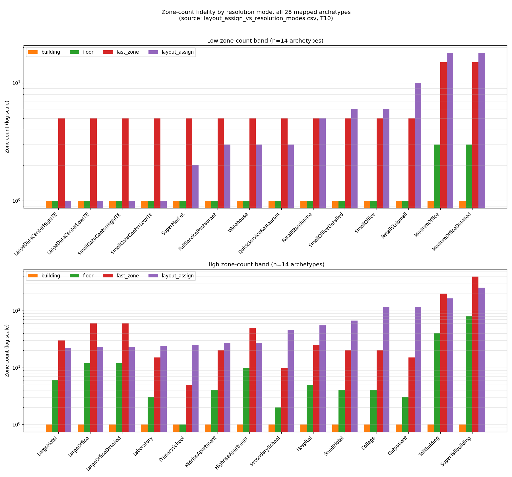
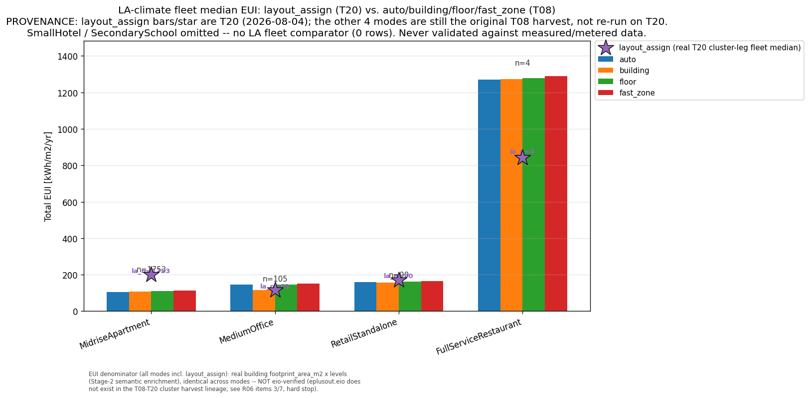
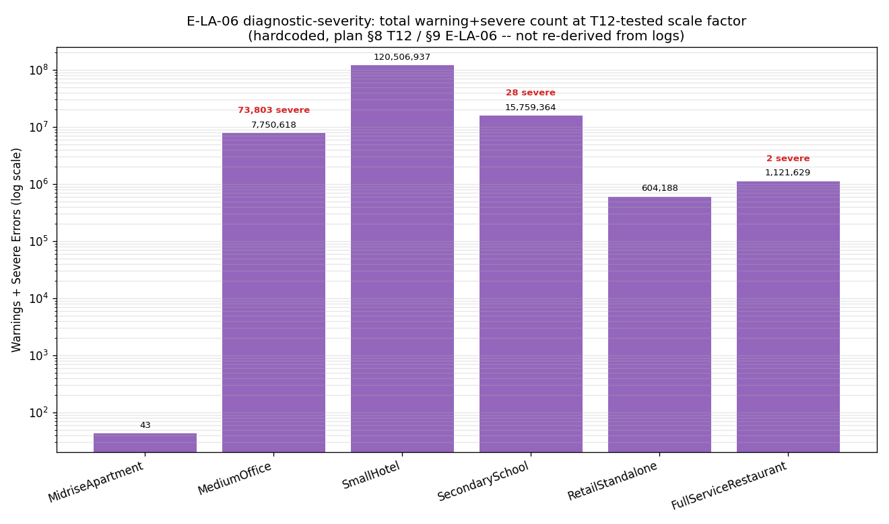
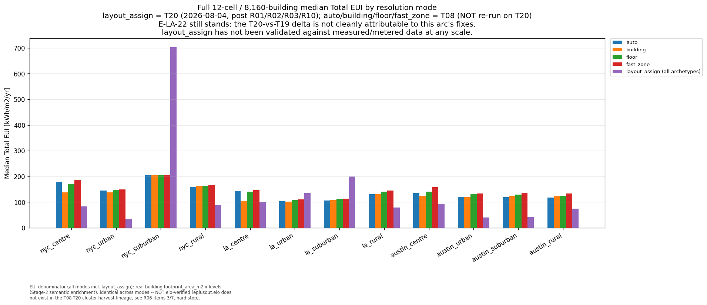
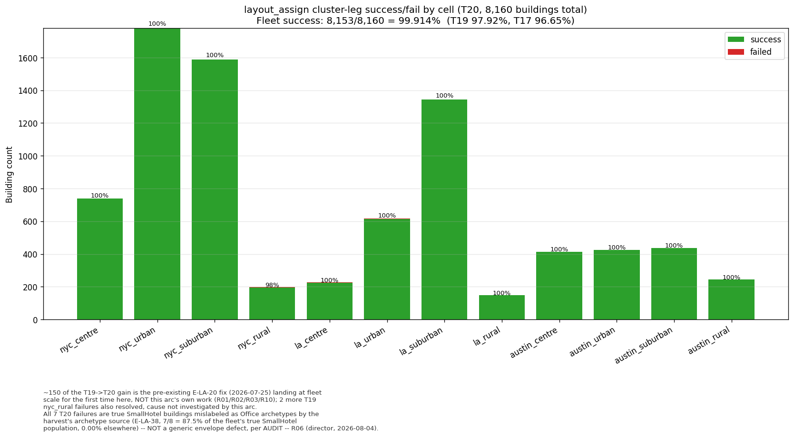

# LayoutAssigner — Figures Explained (plain language)

A simple guide to the 5 comparison figures in this folder (updated 2026-07-23 with the full 12-cell/8,160-building cluster result). For the full technical write-up (data sources, caveats, exact numbers) see [`OpenUBEM_results_LayoutAssigner.md`](OpenUBEM_results_LayoutAssigner.md) §3/§3a (**not yet updated for T20 — pending R08**).

**Changelog — 2026-08-04 (R09):** Figures 1, 2, 5, 6 and the summary CSV regenerated on the **T20** harvest (Figure 3/severity remains a frozen 2026-07-23 spot-check, untouched). T20 is the full 12-cell/8,160-building re-run after this arc's own R01 (E-LA-35 cause A), R02 (E-LA-35 cause B), R03 (E-LA-32) and R10 (E-LA-36 Zone Multiplier × ZoneList compounding fix) — see the `R06` progress-log entry and the director's `AUDIT — R06` entry (both in `PLAN_storey-matching_REMAINder.md`) for the full evidence trail. Prior T19-era figures/CSV are preserved in `openubem/outputs/comparisons/previous/*_t19.*` (T17-era in `*_t17.*`).

**Disclosures new to this update, stated here because they were misleading in earlier passes:**
- **Provenance split.** Figures 2 and 5 mix two harvest vintages: the `layout_assign` bars/star are **T20** (2026-08-04); the `auto`/`building`/`floor`/`fast_zone` bars are still the **original T08 harvest**, never re-run on T20. This is stated directly in both figure titles.
- **EUI denominator.** All 5 modes, including `layout_assign`, use the **same** denominator: the real building's `footprint_area_m2 × levels` (Stage-2 semantic enrichment), verified identical byte-for-byte across harvests for shared buildings. This is **not** the `eio`-verified, multiplier-aware simulated floor-area total that R05 established as `layout_assign`'s theoretically correct denominator — `eplusout.eio` does not exist for any T08–T20 cluster building (the shared sbatch template deletes it; R06 items 3/7, hard stop), so that convention cannot be verified for any mode at fleet scale. The comparison is at least internally consistent — every bar uses the same yardstick.
- **Figure 6's 7 failures are explained, not a mystery.** All 7 of T20's fleet-wide failures are true `SmallHotel` buildings mislabeled as Office archetypes by the harvest's stale archetype source (**E-LA-38**) — 7 of the fleet's 8 real `SmallHotel` buildings (87.5%), 0.00% failure elsewhere. This is **not** a generic envelope defect; see the director's `AUDIT — R06` entry, "Correction 2."
- **E-LA-22 still stands.** The T20-vs-T19/T17 EUI and success-rate deltas are stated as facts, not attributed to this arc's own fixes (R01/R02/R03/R10) — part of the T19→T20 success-rate jump (≈150 of the ≈163 additional passing buildings) is the pre-existing E-LA-20 fix (2026-07-25) landing at fleet scale for the first time in T20, unrelated to this arc.
- **The never-validated-against-metered-data caveat survives verbatim** — a greener success chart and a plausible median are not validation.

---

## Figure 1 — Zone-count fidelity

*How many thermal zones each resolution mode gives a building, for all 28 building types (log scale — split into two panels just so the labels stay readable).*

- `building` / `floor` / `fast_zone` all use one generic rule for every building type; `layout_assign` instead uses the **real, validated** zone count from that building type's actual reference model.
- `layout_assign` is sometimes far more detailed than the generic modes (tall towers, hospitals) and sometimes less — the point isn't "more zones is better", it's that `layout_assign` matches reality instead of guessing.

---

## Figure 2 — Energy use (EUI) comparison, Los Angeles cells

*Updated 2026-08-04 on T20: real annual energy use of `layout_assign` across the full LA fleet (thousands of buildings) vs. the other 4 modes, for the 4 building types where both numbers exist. **`layout_assign` is T20; `auto`/`building`/`floor`/`fast_zone` are still the original T08 harvest, not re-run** — the figure title states this explicitly.*

- Previously this compared a single test building; it now compares real fleet medians on both sides.
- T20 `layout_assign` fleet medians (kWh/m²/yr): MidriseApartment 199.6 (n=1,753), MediumOffice 116.7 (n=63), RetailStandalone 171.4 (n=90), FullServiceRestaurant 841.2 (n=4). MediumOffice and FullServiceRestaurant sit near/below the T08 other-mode medians; MidriseApartment and RetailStandalone are now noticeably above them. Per E-LA-22 (still open), this T19→T20 shift is **not attributed to this arc's fixes** — it is reported as a fact, not a validated improvement or regression.
- Same EUI denominator caveat as Figure 5 below applies here.

---

## Figure 3 — Simulation warning/error counts (6-building spot-check) — HISTORICAL, not regenerated

*This is a frozen 2026-07-23 snapshot, reflecting pre-fix behaviour. It was NOT regenerated in the 2026-07-26 T19 update (its 6-building EnergyPlus warning/error counts are hardcoded from the original E-LA-06 investigation, not sourced from the T17/T19 harvests, and the underlying bug landscape has since changed). Treat it as a historical record of what E-LA-06 looked like at the time, not as current behaviour. How many warning/error messages EnergyPlus produced while simulating each of 6 test buildings (log scale; red numbers are the more serious "severe" errors). This figure reflects the small 6-building spot-check, not the full 8,160-building fleet — the fleet-wide success/fail picture is Figure 6 below.*

- Only `MidriseApartment` (the building closest to its original reference size) ran cleanly; the other 5 produced large numbers of warnings because their equipment (transformers, water heaters, HVAC coils) wasn't resized along with the building.

---

## Figure 5 — Full fleet: energy use by mode, all 12 cells (updated 2026-08-04, T20)

*The real result of running `layout_assign` on all 8,160 buildings across all 12 city zones, on the **T20** harvest (post this arc's own R01/R02/R03/R10 fixes), compared to the other 4 modes — which are still the **original T08 harvest**, not re-run on T20. Both the provenance split and the EUI denominator convention are stated directly in the figure caption.*

- Fleet-wide median `total_eui` (successful rows, T20) is **122.2 kWh/m²/yr**, up from T19's 103.8 kWh/m²/yr and against the adopted fleet baseline (E-R3-3 + Phase-E + elevators) of 158.0 kWh/m²/yr.
- **E-LA-22 still stands**: this T20-vs-T19 delta is stated as a fact, not credited to or blamed on R01/R02/R03/R10 — no clean per-defect attribution of the energy effect exists.
- **EUI denominator, stated explicitly because it was silently wrong once before (E-LA-10/this arc's whole reason for existing):** all 5 modes use the real building's `footprint_area_m2 × levels` (Stage-2 semantic enrichment) — identical across modes, verified byte-for-byte for shared buildings. This is **not** the `eio`-verified, multiplier-aware simulated total that R05 established as the theoretically correct convention for `layout_assign` — `eplusout.eio` does not exist for any T08–T20 cluster building (shared sbatch template deletes it unconditionally; R06 items 3/7, hard stop), so that convention cannot be checked for any mode at fleet scale.
- The honest caveat that remains, unchanged: `layout_assign`'s energy output has never been validated against measured/metered data at any scale — the zone-count fidelity (Figure 1) and the "does it run at all" result (Figure 6) are solid, but "plausible-looking EUI" is not the same as "validated EUI."

---

## Figure 6 — Full fleet: did the simulation even run? (updated 2026-08-04, T20)

*Out of 8,160 buildings, how many simulated successfully (green) vs. crashed (red), per city zone, on the **T20** harvest.*

- **99.914% succeeded fleet-wide (8,153 of 8,160)**, up from T19's 97.92% (7,990/8,160) and T17's 96.65% (7,887/8,160).
- **The T19→T20 jump is not all this arc's own work.** Of the ~163-building improvement, **150 buildings** are the pre-existing E-LA-20 fix (a CTF-convergence Fatal bug fixed 2026-07-25, before this arc started) landing at fleet scale for the first time in this harvest — not a result of R01/R02/R03/R10. A further 2 T19 `nyc_rural` failures also resolved in T20, cause not investigated by this arc.
- **The 7 remaining failures are fully explained, not a mystery.** Every one of them is a true `SmallHotel` building mislabeled as an Office archetype by the harvest's stale archetype source (**E-LA-38**, found and audited during R06) — 7 of the fleet's 8 real `SmallHotel` buildings (87.5%), against a 0.00% failure rate everywhere else. This is **not** a generic envelope defect affecting arbitrary building types; it is fully concentrated in one mislabelled population. See the director's `AUDIT — R06` entry ("Correction 2") in `PLAN_storey-matching_REMAINder.md` for the verbatim evidence (retained raw `in.idf` reading `Building, HotelSmall` for all 7).
- Do not read this figure as validation of `layout_assign`'s energy output — it only shows that the simulations complete; see Figure 5's caveat.
