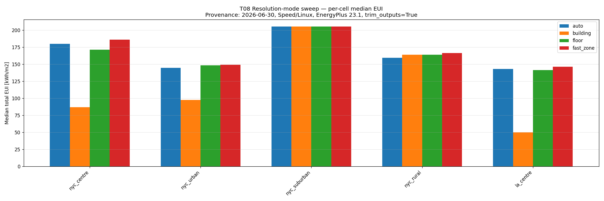
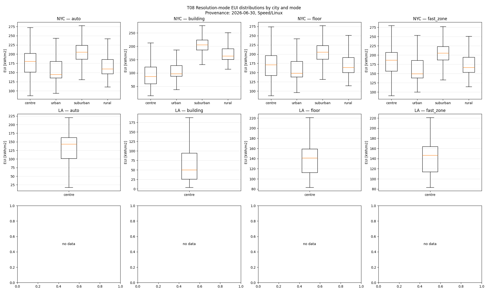
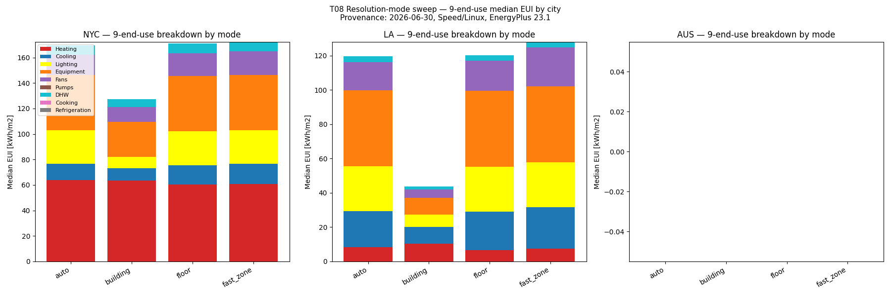
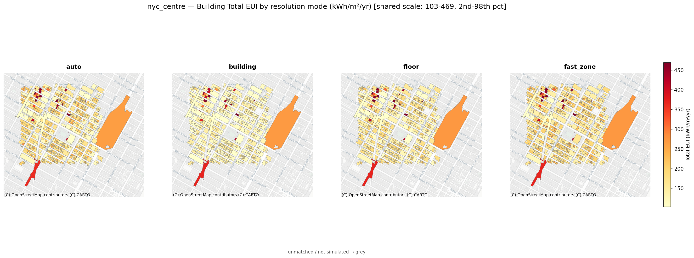
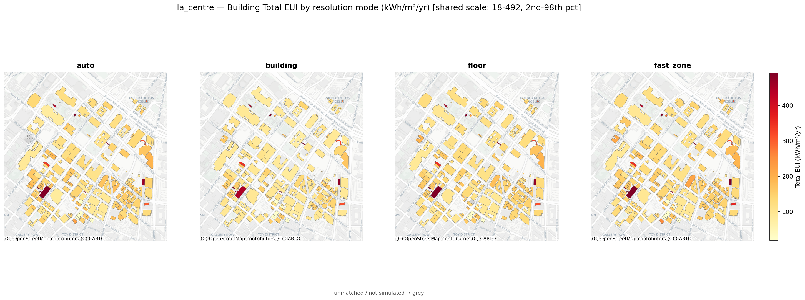
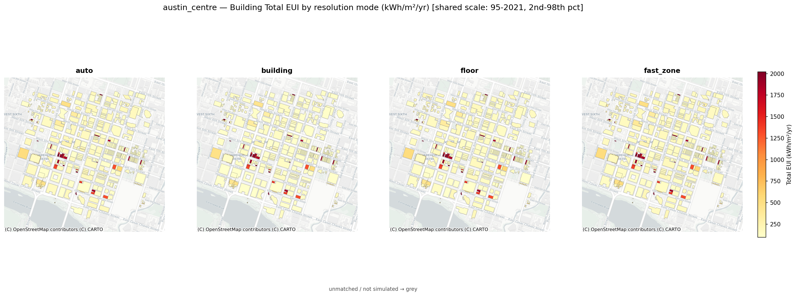
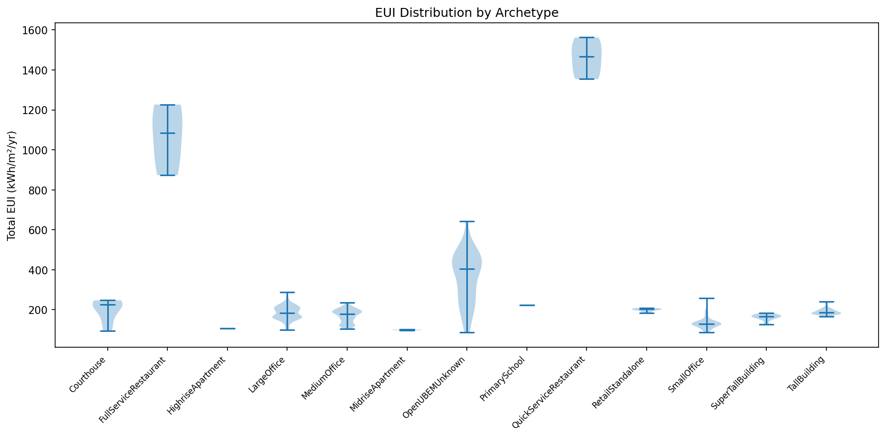
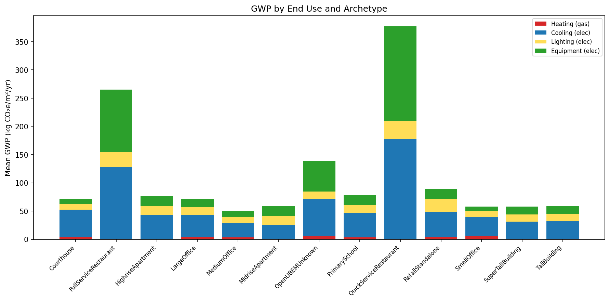
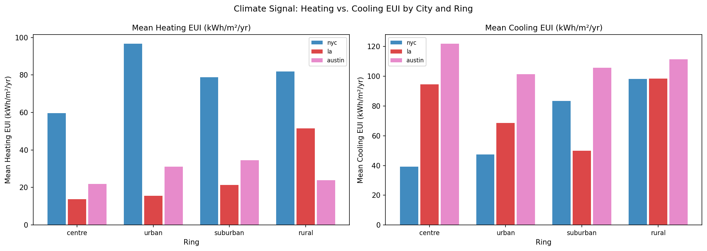

# OpenUBEM — Simulation-Resolution Results & Comparison

**What this document is:** a results report for the user-selectable thermal-zoning
`resolution_mode` feature. It presents the cross-mode simulation comparison over the full
12-cell / 8,160-building validation matrix, the load-conservation integrity check that gated
the feature, the AUTO-baseline fleet results, and the measured-data validation — with the
figures embedded. For the plain-language feature description see
[`OpenUBEM_fundamentals.md` §5.1](OpenUBEM_fundamentals.md); for the binding zoning rule see
[`SIMULATION_RESOLUTION_zoning_by_building.md`](../docs_ACTIVE/simulation-Resolution/SIMULATION_RESOLUTION_zoning_by_building.md);
for the task/plan record see
[`PLAN_resolution_mode_switch.md`](../docs_ACTIVE/simulation-Resolution/PLAN_resolution_mode_switch.md).

Data + figures presented here live under `openubem/outputs/comparisons/`,
`openubem/outputs/simulationResults/`, and `openubem/outputs/validaitonResults/`.

---

## 1. The resolution modes

OpenUBEM builds **one EnergyPlus IDF per building** on the building's **real footprint** and
simulates it for a full year (8,760 hourly steps). What changes between modes is only the
**thermal zoning** inside that single IDF. The EUI denominator is
`footprint_area_m2 × num_floors` in **every** mode, so a cross-mode difference is a genuine
physics difference, never a normalization artefact.

| Mode | Zoning applied to every building | Zones/building | Fidelity | Status |
|---|---|---|---|---|
| **`building`** | 1 zone for the whole building (full height) | 1 | lowest | ✅ validated |
| **`floor`** | 1 zone per floor, all archetypes | `num_floors` | medium | ✅ validated |
| **`fast_zone`** | core + perimeter per floor, **all** archetypes regardless of area | ~5 × `num_floors` | high | ✅ validated |
| **`auto`** *(default)* | adaptive — picks per building by the §1 rule | mixed | validated baseline | ✅ baseline |
| **`zone`** | `fast_zone` shape **plus** per-archetype load labelling | ~5 × `num_floors` | highest | ⏸ deferred |

`building` and `floor` reuse the existing `single_zone` / `one_zone_per_floor` strategies;
`fast_zone` extends the core/perimeter slicing that `auto` already applies to large commercial
onto **all** archetypes. `zone` (per-archetype interior-load labelling) is deferred — deep
research (`deepResearch/layoutMapping/`) found that reproducing each prototype's exact zone
count changes annual EUI < 5% and is fragile on real footprints, so only the load-meaning
half is worth building later.

---

## 2. How the comparison was run

- **Matrix:** 3 cities × 4 urban-density cells = **12 cells**, **8,160 buildings**, each
  simulated under all four active modes (`auto`, `building`, `floor`, `fast_zone`).
- **Cities / climate zones:** Los Angeles (CZ 3B, cooling-led), Austin (CZ 2A, mixed), New
  York (CZ 4A, heating-led).
- **Input-invariant:** loads, schedules, envelope, HVAC and weather are held **bit-identical**
  across modes — only the zoning geometry varies — so the comparison isolates the zoning effect
  (the Step-3 guarantee proven by the load-conservation test).
- **Engine:** EnergyPlus 23.1, annual 8,760-hour run, one IDF per building.
- **Data:** cluster-run cells (nyc_centre/urban/suburban/rural, la_centre) harvested from
  Concordia Speed; the remaining 7 cells run locally. Combined tables:
  `openubem/outputs/comparisons/t08_all_modes_eui.csv` (5 cluster cells × 4 modes) +
  `t08_local_remainder_eui.csv` (7 local cells × 4 modes).

---

## 3. Headline: internal loads conserve across modes

The first thing a resolution switch must guarantee is **energy conservation** — the same
building, simulated at any zoning resolution, must account for the same total floor area and
therefore not gain or lose internal load. A single-zone (`building`) model whose one zone
covered only the footprint (one floor) would under-count a multi-floor building's loads by
`1/num_floors`; catching and fixing that was the gating check for this feature (CP4).

**Conservation test — per-building matched ratio of `building`-mode to `floor`-mode total site
EUI** (a value near 1.0 = conserved; the old defect produced ~0.2 for a 5-floor building):

| Cell | N | median(building/floor) | median(building/auto) | Buildings below 0.35 |
|---|---|---|---|---|
| nyc_centre | 738 | 0.861 | 0.897 | 0 |
| nyc_urban | 1779 | 0.934 | 0.964 | 0 |
| nyc_suburban | 1589 | 1.000 | 1.002 | 0 |
| nyc_rural | 198 | 1.000 | 1.033 | 0 |
| la_centre | 225 | 0.955 | 0.950 | 0 |
| la_urban | 617 | 0.959 | 0.986 | 0 |
| la_suburban | 1343 | 0.964 | 1.014 | 0 |
| la_rural | 143 | 0.958 | 1.027 | 0 |
| austin_centre | 413 | 1.000 | 1.037 | 0 |
| austin_urban | 425 | 0.953 | 1.019 | 0 |
| austin_suburban | 437 | 0.954 | 1.026 | 0 |
| austin_rural | 245 | 1.000 | 1.070 | 0 |

**Result: PASS.** Every cell sits in the healthy 0.75–1.05 band, and **zero** of the 8,160
buildings show the `1/num_floors` under-count signature. The remaining sub-1.0 gap in the
dense/tall cells (nyc_centre 0.861) is **expected physics**, not lost energy — see §5.

---

## 4. Cross-mode EUI comparison

Because a handful of buildings in sparse rural cells carry very high absolute intensities, the
**median** is the robust cross-mode statistic (means are outlier-skewed — e.g. la_rural
`building` mean is inflated by a few units while its median, 130.7, equals the `auto` median).
Median total **site** EUI (kWh/m²·yr) by cell and mode:

| Cell | `auto` | `building` | `floor` | `fast_zone` |
|---|---|---|---|---|
| austin_centre | 135.6 | 124.5 | 141.3 | 158.7 |
| austin_urban | 121.0 | 119.2 | 131.7 | 133.6 |
| austin_suburban | 119.9 | 123.6 | 129.9 | 136.9 |
| austin_rural | 117.8 | 125.5 | 125.5 | 134.3 |
| la_centre | 143.1 | 105.0 | 141.4 | 146.4 |
| la_urban | 103.9 | 101.4 | 108.0 | 110.4 |
| la_suburban | 106.6 | 108.0 | 112.1 | 113.9 |
| la_rural | 130.7 | 130.7 | 140.5 | 145.0 |
| nyc_centre | 180.1 | 138.6 | 171.5 | 186.1 |
| nyc_urban | 144.7 | 137.8 | 148.6 | 149.2 |
| nyc_suburban | 205.5 | 205.4 | 205.4 | 205.6 |
| nyc_rural | 159.6 | 163.9 | 163.9 | 166.4 |

Three consistent patterns:

1. **Ordering `building` ≤ `auto`/`floor` ≤ `fast_zone`.** Finer zoning exposes more perimeter
   surface and prevents core/perimeter load cancellation, so it reports **higher** heating/cooling;
   the lumped single zone reports the least.
2. **Effect concentrates in tall/dense stock.** The centre cells (nyc_centre, la_centre) show
   the largest `building`-vs-finer gap (nyc_centre `building` 138.6 vs `fast_zone` 186.1); the
   low-rise cells (suburban/rural) are nearly mode-invariant (nyc_suburban ≈ 205 in all modes).
3. **`auto` tracks the mid-fidelity modes**, as designed — it applies core/perimeter only where
   it matters and single-zone/per-floor elsewhere.

*Median total site EUI per cell, one bar group per resolution mode.*

*Building-level EUI distribution by city and mode — spread narrows in low-density cells, widens
in dense centres where zoning resolution bites.*

*End-use decomposition by mode. The mode-sensitive components are heating, cooling and fans
(zoning-driven surface/airflow effects); lighting, equipment and the service loads
(DHW/cooking/refrigeration) are area-driven and conserve across modes.*

### 4.1 Per-mode spatial comparison

The tables and box-plots above compare the modes **statistically**; the maps below show them
**spatially** — the same building footprints, one panel per mode, on a shared color scale, so the
resolution effect is visible building-by-building. Only the **four simulated modes** appear:
`zone` is deferred (`NotImplementedError` in `zoning.py`) and was never run, so it has no data and
no panel — the comparison is 4 options, not 5.

*NYC centre (CZ 4A, tallest stock) — `auto` | `building` | `floor` | `fast_zone`. The `building`
panel is visibly paler (lower EUI) than `fast_zone`; the effect is strongest on the tall towers —
the spatial signature of coarse-mode under-prediction.*

*LA centre (CZ 3B) — same four modes, same buildings, shared scale.*

*Austin centre (CZ 2A) — same four modes. (Scale is stretched by one very-high-EUI
QuickServiceRestaurant, the 98th-percentile anchor.)*

These are generated by `scripts/validation/t08_modes_map.py` from the per-mode CSVs joined to the
building footprints (≥ 99.6% osm_id match per cell). The three **centre** cells are shown because
resolution matters most in dense/tall stock; the low-density cells are near mode-invariant (see the
box-plots) and add little spatially.

---

## 5. Why the modes differ — expected physics, not error

The deep-research set (`RESULT_08/09/12/13`) predicts the direction and size of every effect
seen above; they are correct physics that must be read as expected, not "fixed":

- **Annual heating:** a single lumped zone lets core heating and perimeter cooling cancel, so
  `building` under-predicts heating ~10–26% vs finer zoning; expect `fast_zone ≥ floor ≥ building`.
- **Top-floor solar / cooling:** `building` averages shaded lower and unshaded upper walls,
  under-predicting upper-floor solar gain ~15–25% and shifting the cooling peak 1–2 h.
- **Peak / equipment sizing:** coarse modes can mis-size peak substantially — `building`/`floor`
  are for **energy screening and stock totals, not peak-demand or equipment-sizing studies**
  (that is the deferred `zone` mode's job).
- **District-scale wash-out:** the building-scale zoning effect (5–15%) shrinks to **< ~2.3%**
  once aggregated to city scale — resolution is a *secondary* EUI driver behind
  HVAC/occupancy/envelope (30–50%).

The external-literature envelopes that bracket these numbers are commissioned in the
`deepResearch/literatureValidation/` prompt set (V01–V06); the in/out-of-envelope comparison is
the planned follow-on.

---

## 6. The AUTO baseline — fleet results

`auto` is the validated production default that produced the 8,160-building benchmark. Its
per-cell fleet outputs (EUI maps, archetype breakdowns, rank curves, carbon) live in
`openubem/outputs/simulationResults/` — one set per cell. The city-wide spatial view (building
footprints on the CARTO basemap, all 12 cells, shared scale):

*AUTO-mode building total EUI across the full 3-city × 4-density matrix — the validated baseline.
Compare any cell here against its per-mode panel in §4.1.*

*Site-EUI distribution by archetype — resolution-sensitive cohorts (offices, tall residential)
carry the widest spread.*

*Stacked global-warming-potential by archetype (Austin centre) — electricity end-uses × eGRID
2022, gas × 0.181 kg CO₂e/kWh.*

The full per-cell set (`<cell>__eui_map`, `__archetype_eui_bar`, `__eui_rank_curve`,
`__eui_violin_by_archetype`, `__gwp_stacked_by_archetype`) is available for all 12 cells.

---

## 7. Validation against measured data

The AUTO baseline is scored **report-only** (never tuned to pass) against city disclosure data
(NYC LL84, LA EBEWE), a CBECS-2018 regional proxy for Austin, and the national CBECS 2018
survey. Headline: city-overall EUI within **±9%** of measured in all three cities, with a
zero-fitted-parameter model — full record in [`OpenUBEM_fundamentals.md` §7.2](OpenUBEM_fundamentals.md)
and the validation docs. The validation diagnostics live in `openubem/outputs/validaitonResults/`:

*Modeled vs measured/reference EUI — the round-trip agreement scatter.*

*Decomposition of the modeled-vs-measured gap into contributing sources.*

*Climate response — EUI vs climate zone, confirming the physically-correct city ordering
(LA < Austin < NYC).*

*Per-archetype ranked deviation from the measured/reference benchmark.*

> Note: because the zoning effect washes out to < ~2.3% at city scale (§5), the choice of
> resolution mode does **not** move the city-level validation verdict — the ±9% agreement holds
> under `auto`; the coarser modes are provided for screening speed, not for re-passing validation.

---

## 8. Reproducibility & provenance

| Artifact | Path |
|---|---|
| Cross-mode EUI, 5 cluster cells × 4 modes | `openubem/outputs/comparisons/t08_all_modes_eui.csv` |
| Cross-mode EUI, 7 local cells × 4 modes | `openubem/outputs/comparisons/t08_local_remainder_eui.csv` |
| Per-(cell,mode) mean/median summary | `openubem/outputs/comparisons/t08_mode_cell_summary.csv` |
| Cross-mode aggregate figures | `openubem/outputs/comparisons/t08_mode_cell_median_eui.png`, `t08_mode_city_eui_boxplots.png`, `t08_enduse_by_mode_city.png` |
| Per-mode spatial maps (§4.1) | `openubem/outputs/comparisons/t08_modes_map_{nyc_centre,la_centre,austin_centre}.png` — via `scripts/validation/t08_modes_map.py` |
| AUTO baseline overview grid | `openubem/outputs/comparisons/phaseE_overview_grid.png` — via `scripts/validation/phaseE_overview_grid.py` |
| AUTO fleet figures (per cell) | `openubem/outputs/simulationResults/` |
| Validation diagnostics | `openubem/outputs/validaitonResults/` |
| Zoning rule (binding spec) | `docs/docs_ACTIVE/simulation-Resolution/SIMULATION_RESOLUTION_zoning_by_building.md` |
| Task/plan + progress log | `docs/docs_ACTIVE/simulation-Resolution/PLAN_resolution_mode_switch.md` |

All modes were simulated from the same committed working tree; the load-conservation and
freshness checks in §3 were verified building-by-building at harvest (e.g. the 67-floor tower
way/265875648 reads InteriorLights 26.47 kWh/m² in `building` mode, matching the raw
EnergyPlus SQL exactly).

---

## 9. Where to go next

| You want… | Read |
|---|---|
| The plain-language feature description | `docs/docs_EXPLANATION/OpenUBEM_fundamentals.md` §5.1 |
| The binding zoning rule | `docs/docs_ACTIVE/simulation-Resolution/SIMULATION_RESOLUTION_zoning_by_building.md` |
| The task list + full progress log | `docs/docs_ACTIVE/simulation-Resolution/PLAN_resolution_mode_switch.md` |
| The external-validation prompt set | `docs/docs_ACTIVE/simulation-Resolution/deepResearch/literatureValidation/` |
| Current project status | `docs/PROJECT_CHECKLIST.md` |

---

*OpenUBEM — simulation-resolution results report. Figures generated from the T08 12-cell sweep
(EnergyPlus 23.1); the design/spec docs remain the binding source of truth. 2026-07-01.*
