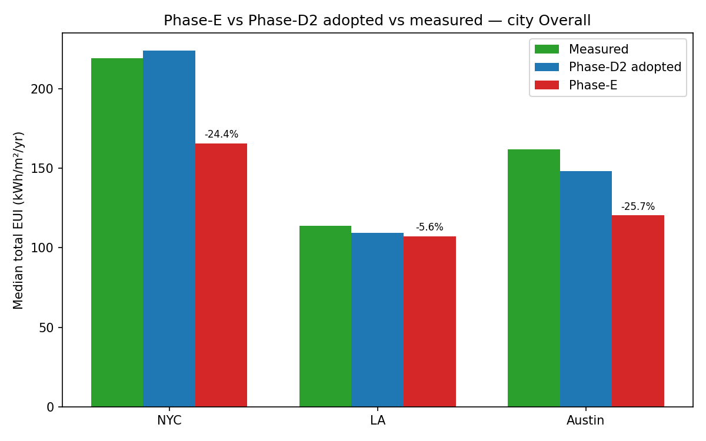
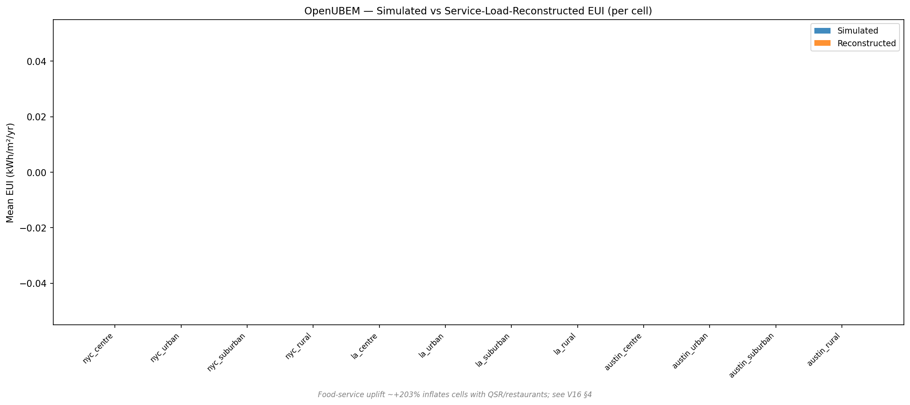
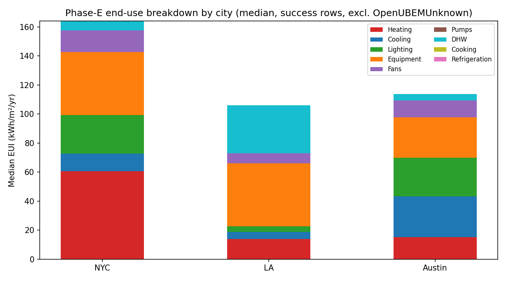
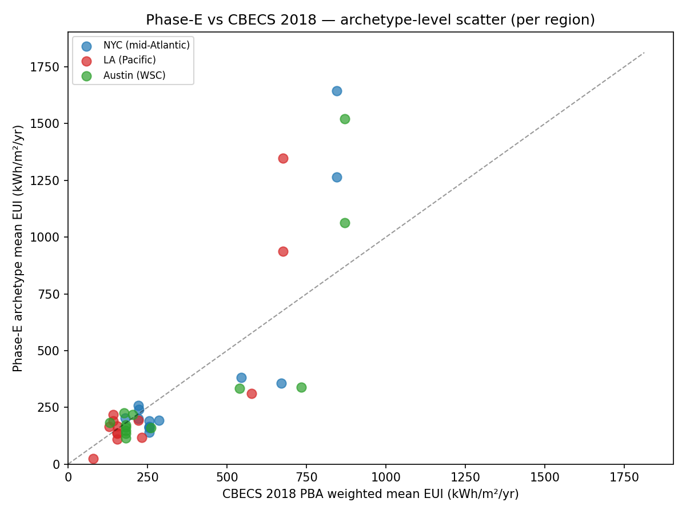
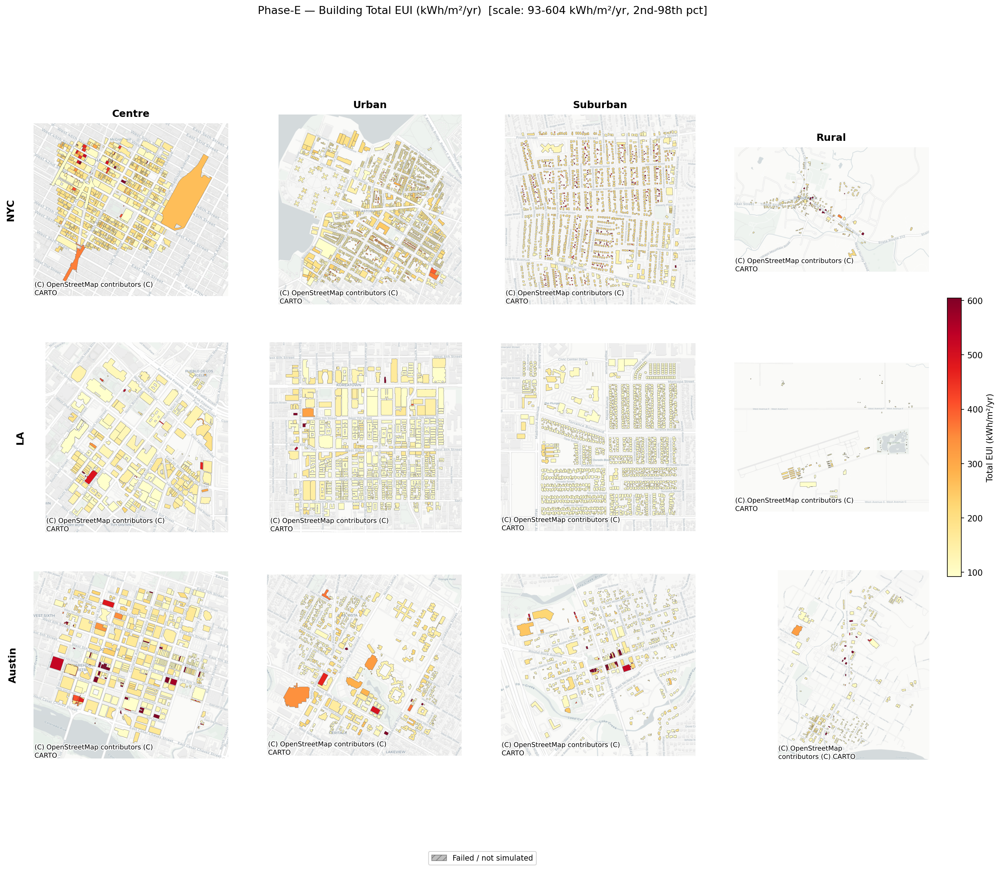
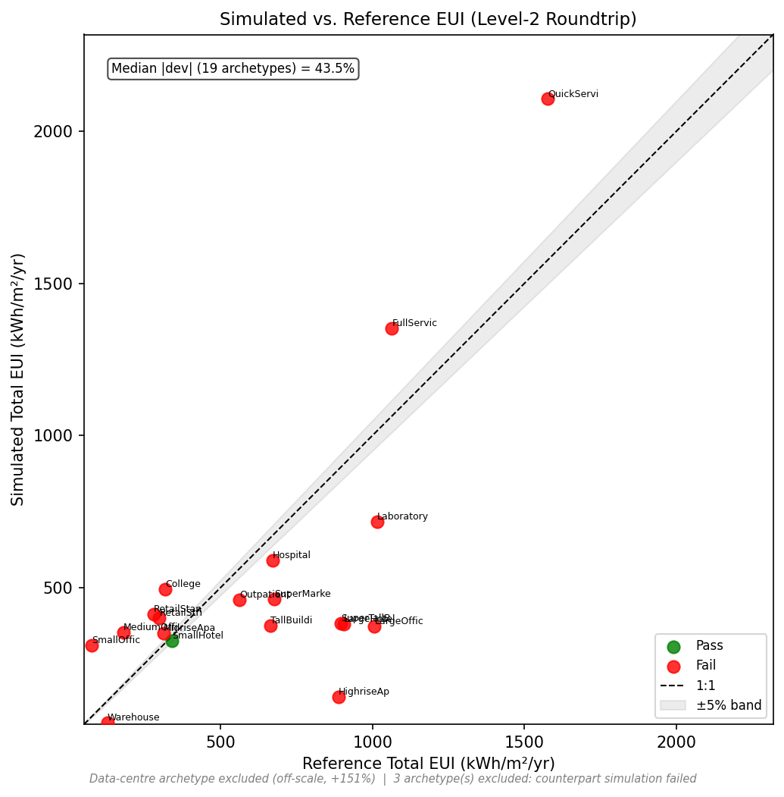
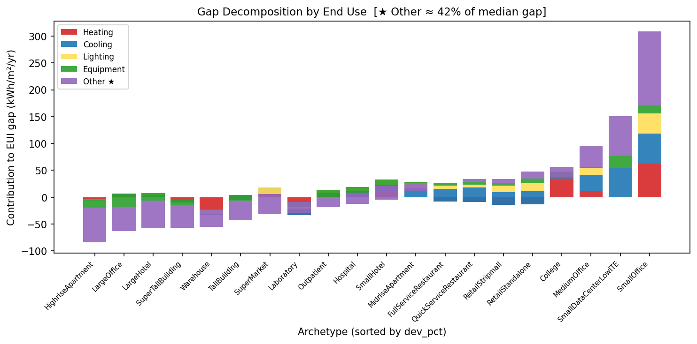
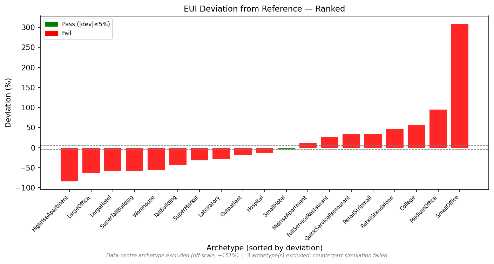

# OpenUBEM — HVAC & Service-Loads Results (Phase-E)

**What this document is:** a reader-facing results report for the **Phase-E full-realism** arc —
the work that replaced OpenUBEM's blanket-PTAC + post-hoc "reconstruction" service loads with
**real, per-archetype HVAC systems and physical service-load objects in EnergyPlus**. It presents
the adopted-baseline results across the 12-cell / 8,160-building matrix, the comparison against the
prior Phase-D2 model and measured city benchmarks, and the validation, with figures embedded.

The binding technical record is
[`REPORT_phaseE_final.md`](../docs_DONE/hvac-ServiceLoads/REPORT_phaseE_final.md); the deep-research
inputs are under `docs/docs_DONE/hvac-ServiceLoads/deepResearch/`. Per-building result CSVs are
archived alongside this report in `docs/docs_RESULTS/OpenUBEM_results_hvacServiceLoads/`.

> **Bottom line:** Phase-E is the **adopted OpenUBEM baseline**. It models every end-use as real
> physics with **zero fitted parameters**, gets the **distribution shape right** (R² 0.90/0.92/0.72,
> up from ~0.71), and in exchange **under-predicts the absolute level** (NYC −24%, LA −6%,
> Austin −26% vs measured) because the CBECS "Other" category the old overlay silently carried is
> now correctly absent. The level gap is an accepted, documented residual, not a bug.

---

## 1. What Phase-E changed

Before Phase-E, every building used a single **blanket PTAC** system, and service loads (DHW,
cooking, refrigeration, fans, pumps) were **not simulated** — they were added afterward as a flat
CBECS-fraction multiplier ("reconstruction overlay"). That hit the city-level number but had the
end-use breakdown wrong (fans/pumps showed as zero) and hid a structural under-prediction.

Phase-E replaced both with physical EnergyPlus objects:

| Dimension | Phase-D2 (prior) | Phase-E (adopted) |
|---|---|---|
| HVAC | Blanket PTAC for all archetypes | **10 archetype-specific families** — central VAV + chiller/boiler (large office), PSZ-AC/HP (small/med nonres), PVAV reheat (school/hospital/courthouse), FCU (large hotel), WLHP (high-rise apt), PTAC/PTHP (mid-rise res) |
| Fans / pumps | Embedded in PTAC meters / none | Physical supply/exhaust fans + hot- & chilled-water pumps (central-plant archetypes) |
| DHW | Reconstructed post-hoc | `WaterHeater:Mixed` + `WaterUse:Equipment` per archetype |
| Cooking | Reconstructed post-hoc | `ZoneVentilation` kitchen exhaust + `OtherEquipment` process load (food-service archetypes) |
| Refrigeration | Reconstructed post-hoc | `Refrigeration:Case` + `CompressorRack` (SuperMarket, 5-case layout) |
| Reconstruction overlay | ON | **Retired** (`OPENUBEM_RECONSTRUCT_SERVICE_LOADS=0`) |
| Parameters fitted | None | None |

HVAC systems are dispatched by **archetype × size × floor count** following ASHRAE 90.1-2019
Appendix G; DHW/cooking/refrigeration intensities come from DOE prototype data. All 12 cells were
re-simulated from scratch on the Speed SLURM cluster.

---

## 2. Fleet integrity

| Metric | Value |
|---|---|
| Cities × density rings | 3 × 4 = 12 cells |
| Total buildings | 8,160 |
| EnergyPlus success | **8,160 / 8,160 (100%)** |
| Cells with results | 12 / 12 |
| Initially dropped, then recovered | 10 (6 geometry fatals via `shapely.orient` + thermal-mass fallback; 4 false-drop parse recoveries) |

The 10 drops were traced to a single fleet-wide cause — OSM footprints wound clockwise produced
inward surface normals, clamping large all-NoMass buildings to a 10 m³ volume that diverged
thermally. The build-time winding fix (`orient(sign=1.0)`) resolves it fleet-wide.

---

## 3. Headline: city comparison vs measured

Median total site EUI (kWh/m²·yr) against measured anchors — **NYC LL84**, **LA EBEWE**, and a
**CBECS West-South-Central** proxy for Austin (no mandatory disclosure law):

| City | n | Phase-E median | Measured | Phase-E delta | Phase-D2 delta |
|---|---|---|---|---|---|
| NYC Overall | 3,746 | 165.7 | 219.2 | **−24.4%** | +2.1% |
| LA Overall | 2,317 | 107.2 | 113.6 | **−5.6%** | −3.7% |
| Austin Overall | 1,447 | 120.4 | 162.0 | **−25.7%** | −8.6% |
| NYC Office | 2,570 | 147.0 | 183.9 | −20.1% | +18.0% |
| NYC Multifamily | 1,036 | 204.5 | 226.2 | −9.6% | +8.8% |
| LA Office | 372 | 131.8 | 121.5 | +8.5% | +12.3% |
| LA Multifamily | 1,775 | 105.5 | 115.8 | −8.9% | −9.2% |
| Austin Office | 1,244 | 116.4 | 162.3 | −28.3% | −9.3% |

*Three bars per city: green = measured anchor, blue = Phase-D2 (reconstruction overlay), red =
Phase-E (pure physics). Phase-E sits below Phase-D2 because it no longer adds the "Other" CBECS
loads the overlay carried.*

LA barely moves (−1.9 pp) because it is DHW-heavy and Phase-E models DHW physically. NYC and Austin
regress because Phase-D2's overlay was propping up the level with the unmodelled "Other" category.

*Simulated (physical) vs the old reconstructed EUI — visualising exactly what the retired overlay
was adding on top of the physics.*

---

## 4. Distribution shape — the metric that improved

The absolute level dropped, but the **shape got substantially better** — the right buildings now
rank high and low for the right physical reasons, which a uniform reconstruction multiplier could
never produce:

| City (CBECS region) | Phase-D2 R² | Phase-E R² | Δ |
|---|---|---|---|
| NYC (middle_atlantic) | ~0.71 | **0.895** | +0.185 |
| LA (pacific) | ~0.71 | **0.924** | +0.214 |
| Austin (west_south_central) | ~0.71 | **0.718** | ~unchanged |

This is the primary evidence the model is physically correct: archetype-appropriate HVAC + real
service loads inject genuine per-building variance.

---

## 5. Per-end-use medians (all physical now)

Every end-use is computed in EnergyPlus — no inference from a national fraction table. Cooking and
refrigeration medians are 0 city-wide because they apply only to food-service/supermarket
archetypes (non-zero at the archetype level):

| City | n | Heating | Cooling | Lighting | Equipment | Fans | Pumps | DHW | Cooking | Refrig | Total |
|---|---|---|---|---|---|---|---|---|---|---|---|
| NYC | 3,746 | 60.7 | 12.2 | 26.5 | 43.4 | 15.0 | 0.0 | 6.3 | 0.0 | 0.0 | 165.7 |
| LA | 2,317 | 13.9 | 4.8 | 4.0 | 43.4 | 6.8 | 0.0 | 33.3 | 0.0 | 0.0 | 107.2 |
| Austin | 1,447 | 15.3 | 28.2 | 26.5 | 27.8 | 11.7 | 0.0 | 4.4 | 0.0 | 0.0 | 120.4 |

*(kWh/m²·yr, median over success rows, OpenUBEMUnknown excluded.)* Physically coherent by climate:
NYC heating-dominated (60.7), Austin cooling-dominated (28.2), LA DHW-heavy (33.3, MidriseApartment
stock).

*Stacked physical end-use medians per city — fans and pumps are now real meter reads, not zeros.*

---

## 6. National validation gates (CBECS 2018)

Gates: NMBE ±10% and R² > 0.60 are hard; CV(RMSE) and KS are report-only (structurally unpassable
for an archetype-deterministic UBEM, ruling V-R5-5).

| City | CBECS region | NMBE | R² | CV(RMSE) | KS_D |
|---|---|---|---|---|---|
| NYC | middle_atlantic | −10.6% (FAIL) | 0.895 (PASS) | 38.0% (report) | 0.256 (report) |
| LA | pacific | −20.5% (FAIL) | 0.924 (PASS) | 60.6% (report) | 0.238 (report) |
| Austin | west_south_central | −11.9% (FAIL) | 0.718 (PASS) | 47.5% (report) | 0.302 (report) |

R² passes everywhere; NMBE fails everywhere — the **expected** consequence of retiring the overlay.
The model now reports what it computes, not what a national-fraction multiplier adds.

*Archetype-level Phase-E medians vs CBECS PBA reference means, by region.*

---

## 7. Spatial overview

Building total EUI across the full 3-city × 4-density matrix (real UTM polygon footprints on the
CARTO basemap, shared color scale, 8,160 buildings at 100% join):

*The adopted Phase-E baseline, all 12 cells. This is the same `auto`-mode fleet used as the
resolution-sweep baseline — see [`OpenUBEM_results_Resolution.md`](OpenUBEM_results_Resolution.md).*

---

## 8. Validation diagnostics

*Modeled vs measured/reference EUI round-trip agreement.*

*Decomposition of the modeled-vs-measured gap — the residual traces to the unmodeled "Other"
service-load category (~42% of the remaining gap per R6-4B).*

*Per-archetype ranked deviation from the benchmark.*

---

## 9. Why the level gap is accepted (not fitted away)

The CBECS "Other" category — elevators, process equipment, miscellaneous plug loads — has **no
physical specification in the DOE archetype prototypes**. Phase-E adds every end-use that *does*
have a spec (DHW, cooking, refrigeration) but cannot add "Other" without **fitting office plug
loads to match the CBECS mean** — which would break the zero-fitted-parameters rule that is the
whole point of the model. The gap is therefore accepted and documented (the R6-4B STOP decision,
confirmed across V16–V19), and the level regression from Phase-D2 directly quantifies how much the
old overlay was carrying.

Key technical discoveries from the arc (full detail in the final report §10): a kitchen-exhaust
absolute-flow defect that inflated restaurant/school EUI and faked a passing NMBE at pilot; a
single-zone VAV over-sizing guard; and the fleet-wide clockwise-winding geometry clamp.

---

## 10. Reproducibility & provenance

| Artifact | Path |
|---|---|
| Per-cell per-building results (12 × CSV) | `docs/docs_VALIDATION/validations/overAll/results/phaseE/<cell>/05_results.csv` |
| Archived copies (this report's data) | `docs/docs_RESULTS/OpenUBEM_results_hvacServiceLoads/` |
| Per-cell gate reports | `.../phaseE/<cell>/v12_<cell>_gates_report.txt` |
| City comparison / end-use / CBECS figures | `openubem/outputs/comparisons/phaseE_*.png` |
| Spatial overview grid | `openubem/outputs/comparisons/phaseE_overview_grid.png` — via `scripts/validation/phaseE_overview_grid.py` |
| Validation diagnostics | `openubem/outputs/validaitonResults/` |
| Re-score driver | `scripts/validation/phaseE_rescore.py` |
| Binding technical report | `docs/docs_DONE/hvac-ServiceLoads/REPORT_phaseE_final.md` |
| Deep-research inputs (HVAC/DHW/cooking/refrig) | `docs/docs_DONE/hvac-ServiceLoads/deepResearch/RESULT_01..05` |

---

## 11. Where to go next

| You want… | Read |
|---|---|
| The full technical report | `docs/docs_DONE/hvac-ServiceLoads/REPORT_phaseE_final.md` |
| The plain-language pipeline overview | `docs/docs_EXPLANATION/OpenUBEM_fundamentals.md` |
| Simulated vs reconstructed methodology | `docs/docs_EXPLANATION/simulated_vs_reconstructed_methodology.md` |
| The resolution-mode results | `docs/docs_EXPLANATION/OpenUBEM_results_Resolution.md` |
| Current project status | `docs/PROJECT_CHECKLIST.md` |

---

*OpenUBEM — HVAC & service-loads (Phase-E) results report. Numbers sourced from
`REPORT_phaseE_final.md` (CP-E, 2026-06-27); the design/spec docs remain the binding source of
truth. 2026-07-01.*
